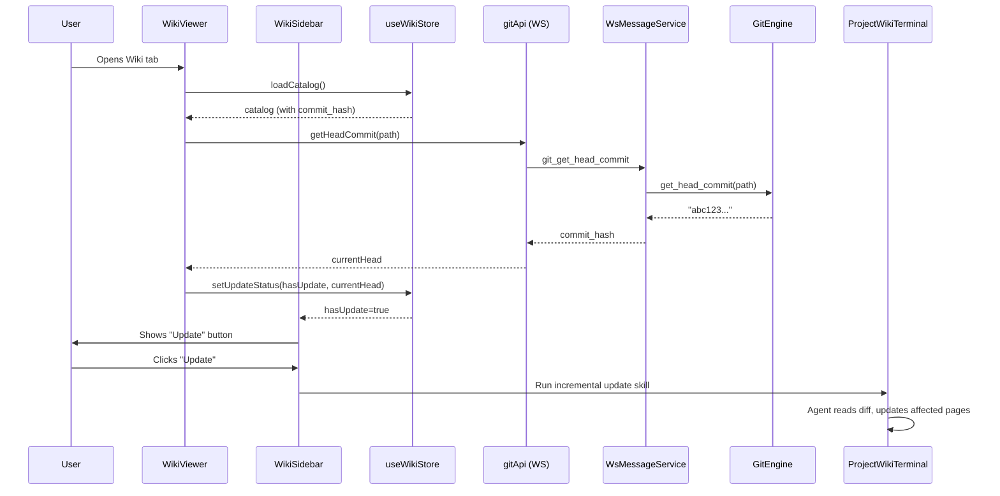

# Wiki Incremental Update via Git Commit Tracking

## Overview

When wiki is generated, record the HEAD commit hash in `_catalog.json`. On subsequent wiki visits, compare the stored commit with current HEAD. If they differ, show an "Update" button in the sidebar header. Clicking it triggers an incremental update skill that only regenerates wiki pages whose source files have changed.

## Architecture




## Layer-by-Layer Changes

### 1. Data Model: Extend `_catalog.json` with `commit_hash`

**File: [skills/project-wiki/references/catalog.schema.json**](skills/project-wiki/references/catalog.schema.json)

- Add `commit_hash` property (string, **required**) at root level
- Add to the `"required"` array: `["version", "generated_at", "project", "catalog", "commit_hash"]`
- Pattern: `"^[0-9a-f]{7,40}$"` (short or full SHA)

**File: [apps/web/src/components/wiki/wiki-utils.ts**](apps/web/src/components/wiki/wiki-utils.ts)

- Add `commit_hash: string` to `CatalogData` interface (required, not optional)

### 2. Backend: New WS Action `GitGetHeadCommit`

Add a lightweight action that returns the current HEAD commit hash via `git rev-parse HEAD`.

**File: [crates/infra/src/websocket/message.rs**](crates/infra/src/websocket/message.rs)

- Add `GitGetHeadCommit` variant to `WsAction` enum
- Add `GitGetHeadCommitRequest { path: String }` struct

**File: [crates/core-engine/src/git/mod.rs**](crates/core-engine/src/git/mod.rs)

- Add `pub fn get_head_commit(&self, repo_path: &Path) -> Result<String>` method
- Implementation: `git rev-parse HEAD` (the pattern already exists at line 574-580)

**File: [crates/core-service/src/service/ws_message.rs**](crates/core-service/src/service/ws_message.rs)

- Add `WsAction::GitGetHeadCommit => self.handle_git_get_head_commit(...)` in the match
- Add handler: `fn handle_git_get_head_commit(&self, req) -> Result<Value>` returning `{ commit_hash: "..." }`

### 3. Frontend: WS API Client

**File: [apps/web/src/hooks/use-websocket.ts**](apps/web/src/hooks/use-websocket.ts)

- Add `'git_get_head_commit'` to `WsAction` type union

**File: [apps/web/src/api/ws-api.ts**](apps/web/src/api/ws-api.ts)

- Add `gitApi.getHeadCommit(path: string): Promise<{ commit_hash: string }>` method

### 4. Frontend: Wiki Store - Update Detection State

**File: [apps/web/src/hooks/use-wiki-store.ts**](apps/web/src/hooks/use-wiki-store.ts)

Add to `WikiContextState`:

```typescript
updateStatus: {
  hasUpdate: boolean;
  checking: boolean;
  catalogCommit: string | null;   // commit_hash from _catalog.json
  currentCommit: string | null;   // current HEAD
} | null;
```

Add new action:

```typescript
checkForUpdates: (contextId: string, effectivePath: string) => Promise<void>
```

Logic:

1. Read `catalog.commit_hash` from already-loaded catalog (required field -- if missing, treat as catalog format error)
2. Call `gitApi.getHeadCommit(effectivePath)` to get current HEAD
3. Compare: if different, set `hasUpdate: true`
4. If `commit_hash` is missing (pre-migration legacy wiki), show a prompt suggesting full regeneration to get the required field

### 5. Frontend: WikiViewer - Trigger Update Check

**File: [apps/web/src/components/wiki/WikiViewer.tsx**](apps/web/src/components/wiki/WikiViewer.tsx)

- After catalog loads successfully, call `checkForUpdates(contextId, effectivePath)`
- Pass update-related props and callbacks down to `WikiSidebar`:
  - `updateStatus` object
  - `onTriggerUpdate: () => void` callback

### 6. Frontend: WikiSidebar - Update Button UI

**File: [apps/web/src/components/wiki/WikiSidebar.tsx**](apps/web/src/components/wiki/WikiSidebar.tsx)

Add new props to `WikiSidebarProps`:

```typescript
updateStatus?: { hasUpdate: boolean; checking: boolean; } | null;
onTriggerUpdate?: () => void;
```

In the sidebar header (the button area with project name, lines 228-238), add an update indicator:

- When `updateStatus?.hasUpdate` is true, show a small `RefreshCw` icon button next to the `Info` icon
- The button should have a subtle pulse animation or accent color to attract attention
- Tooltip: "Wiki is outdated. Click to update."
- On click: calls `onTriggerUpdate()`

Rough layout of the header:

```
[ProjectName (truncated)]  [RefreshCw button]  [Info button]
```

### 7. Frontend: Update Trigger Flow

When "Update" is clicked, the flow mirrors wiki generation:

**File: [apps/web/src/components/wiki/WikiViewer.tsx**](apps/web/src/components/wiki/WikiViewer.tsx) (or a new `WikiUpdateDialog.tsx`)

1. Show a confirmation dialog explaining what will happen
2. Build an incremental update command using the same agent selector pattern as `WikiSetup`
3. The prompt references the new `project-wiki-update` skill:
  ```
   Read the skill at ~/.atmos/skills/.system/project-wiki-update/SKILL.md
   and follow it to incrementally update the project wiki at ./.atmos/wiki/.
   The wiki was generated at commit <catalog.commit_hash>.
   Current HEAD is <currentCommit>.
  ```
4. Run in ProjectWikiTerminal (reuse `onSwitchToProjectWikiAndRun`)

To enable this, `WikiViewer` needs access to the same terminal integration props that `WikiTab` provides. Update `WikiViewerProps` and `WikiTabProps` to pass these through.

### 8. Skill Architecture: Shared Resources via `project-wiki` as Single Source of Truth

#### 8.1 Extract shared content from `project-wiki/SKILL.md`

Currently, formatting rules, content style guidelines, and writing conventions are embedded directly in `project-wiki/SKILL.md`. Extract them into a standalone reference file so all wiki-family skills can reference the same source.

**New file: `skills/project-wiki/references/content-guidelines.md**`

Extract from `SKILL.md` into this file:

- Frontmatter schema (YAML fields: `title`, `section`, `level`, `reading_time`, `path`, `sources`, `updated_at`)
- Content style rules (prose-first, minimal inline code, prefer Mermaid, heading depth conventions, tone)
- File naming conventions (kebab-case under `.atmos/wiki/`)
- Catalog structure rules (two-part hierarchy, `CatalogItem` fields, ordering)
- Subagent parallelism pattern for parallel article writing

Then update `project-wiki/SKILL.md` to reference `references/content-guidelines.md` instead of inlining these rules. This refactoring is backward-compatible -- the generation skill works exactly as before, just with better modularity.

#### 8.2 Repo directory structure with symlinks

```
skills/
├── project-wiki/                              # Canonical home of ALL shared resources
│   ├── SKILL.md                               # Generation-specific logic
│   ├── references/
│   │   ├── catalog.schema.json                # Catalog JSON schema
│   │   ├── content-guidelines.md              # NEW: extracted shared writing/format rules
│   │   ├── output_structure.md                # Output directory spec
│   │   └── frontend-integration.md            # Frontend rendering notes
│   ├── scripts/
│   │   ├── validate_frontmatter.py
│   │   ├── validate_catalog.py
│   │   └── validate_catalog.sh
│   └── examples/
│       ├── sample_catalog.json
│       └── sample_document.md
│
├── project-wiki-update/                       # Incremental update skill
│   ├── SKILL.md                               # Update-specific logic (ONLY unique file)
│   ├── references -> ../project-wiki/references   # Symlink
│   └── scripts -> ../project-wiki/scripts         # Symlink
│
└── (future) project-wiki-increase/            # Future expansion skill
    ├── SKILL.md                               # Increase-specific logic
    ├── references -> ../project-wiki/references   # Symlink
    └── scripts -> ../project-wiki/scripts         # Symlink
```

The symlinks serve **repo-level convenience**: developers can browse/edit shared files from any skill's directory, and `git` tracks them correctly.

#### 8.3 Installed structure (fully self-contained, no cross-references)

Each skill installed to `~/.atmos/skills/.system/` must be **fully self-contained** -- the LLM agent only needs to read files within a single skill directory, never across skills. This is achieved by **resolving symlinks during install** (equivalent to `cp -rL`).

```
~/.atmos/skills/.system/
├── project-wiki/                              # Full install
│   ├── SKILL.md
│   ├── references/
│   │   ├── catalog.schema.json
│   │   ├── content-guidelines.md
│   │   ├── output_structure.md
│   │   └── frontend-integration.md
│   ├── scripts/
│   │   ├── validate_frontmatter.py
│   │   ├── validate_catalog.py
│   │   └── validate_catalog.sh
│   └── examples/...
│
├── project-wiki-update/                       # Full install (symlinks resolved to real files)
│   ├── SKILL.md                               # Unique update logic
│   ├── references/                            # REAL COPIES (not symlinks)
│   │   ├── catalog.schema.json                # Same content as project-wiki's
│   │   ├── content-guidelines.md
│   │   ├── output_structure.md
│   │   └── frontend-integration.md
│   └── scripts/                               # REAL COPIES
│       ├── validate_frontmatter.py
│       ├── validate_catalog.py
│       └── validate_catalog.sh
│
└── (future) project-wiki-increase/            # Same pattern
    ├── SKILL.md
    ├── references/...                         # REAL COPIES
    └── scripts/...                            # REAL COPIES
```

The `project-wiki-update/SKILL.md` references shared resources using **local relative paths** (within its own directory), not cross-skill paths:

```markdown
## References

Read these files in this skill directory before making any changes:
- Content & formatting guidelines: `references/content-guidelines.md`
- Catalog schema: `references/catalog.schema.json`
- Output structure: `references/output_structure.md`
- Validation (run after updates): `scripts/validate_frontmatter.py`
```

This means the agent **only loads one skill** -- everything it needs is right there.

#### 8.4 Two-level design: repo DRY vs installed self-contained


| Concern         | Repo (`skills/`)                                                      | Installed (`~/.atmos/skills/.system/`)        |
| --------------- | --------------------------------------------------------------------- | --------------------------------------------- |
| Shared files    | Symlinks to `project-wiki/` (single source of truth)                  | Real copies (resolved from symlinks)          |
| Update workflow | Edit once in `project-wiki/`, all skills pick up changes via symlinks | Re-run install/sync to propagate              |
| Agent loading   | N/A (repo is for developers)                                          | One skill directory = one self-contained unit |
| Add new variant | Create `SKILL.md` + symlinks, done                                    | Install resolves symlinks into full copy      |


#### 8.5 Benefits

- **Repo-level DRY**: formatting rules, schemas, validation scripts exist in exactly one place (`project-wiki/`). Symlinks keep derivative skills in sync automatically during development.
- **Install-level independence**: each installed skill is a standalone unit. The LLM agent reads one skill directory, never two.
- **Future-proof**: adding `project-wiki-increase` just needs a unique `SKILL.md` + symlinks in the repo. Install resolves everything.

### 9. New Skill: `project-wiki-update`

**New file: `skills/project-wiki-update/SKILL.md**`

The skill's `SKILL.md` contains ONLY the update-specific logic. It starts by instructing the agent to read shared resources from `project-wiki` (see 8.3 above), then proceeds with the three-phase hybrid strategy:

**Phase 1: Source-matched pages (automatic, high confidence)**

1. Read `_catalog.json` to get `commit_hash` and catalog structure
2. Parse every wiki page's frontmatter to collect all `sources` fields -> build a "covered files" set
3. Run `git diff --name-only <old_commit>..HEAD` to get all changed files
4. Partition changed files into:
  - **Covered**: files that appear in at least one page's `sources` -> those pages are "definitely needs update"
  - **Uncovered**: files not referenced by any page's `sources`

**Phase 2: Uncovered changes analysis (AI reasoning)**

1. For each uncovered changed file, the agent reasons about it:
  - **Add to existing page**: the change is conceptually related to an existing wiki topic -> update that page and add the file to its `sources`
  - **Create new page**: a new module/feature/API deserves its own documentation -> create a new wiki page, update `_catalog.json`
  - **Skip**: trivial changes (config, formatting, test-only, CI, `.gitignore`, lock files)

**Phase 3: Cross-cutting impact check**

1. Check if any changed file is a widely-used shared utility or core abstraction. If so, update wiki pages that describe behavior depending on it, even without a direct `sources` reference.

**Finalization:**

1. Regenerate only identified affected pages, preserving unchanged pages
2. Update `commit_hash` in `_catalog.json` to current HEAD
3. Update `generated_at` timestamp
4. Run validation scripts (`validate_catalog.py` must verify `commit_hash` is present and is a valid git SHA)

### 10. Existing Skill Update: `project-wiki`

**File: [skills/project-wiki/SKILL.md**](skills/project-wiki/SKILL.md)

Two changes:

1. Extract shared content into `references/content-guidelines.md` and reference it (see 8.1)
2. Add a step: before writing `_catalog.json`, run `git rev-parse HEAD` and store the result as `commit_hash` in the catalog

### 11. Skill Installation

**File: [crates/core-service/src/service/ws_message.rs**](crates/core-service/src/service/ws_message.rs)

- Extend the wiki skill install handler to also install `project-wiki-update`
- Both skills use the same copy strategy: **resolve symlinks and copy real files** (Rust `std::fs::copy` follows symlinks by default; for directories, recursively copy with symlink resolution, equivalent to `cp -rL`)
- Install order does not matter since symlinks are resolved at copy time -- each installed skill is fully self-contained

**File: [apps/api/src/utils/wiki_skill_sync.rs**](apps/api/src/utils/wiki_skill_sync.rs)

- Add `project-wiki-update` to the sync list alongside `project-wiki`
- The sync function should follow symlinks when copying from the repo's `skills/` directory to `~/.atmos/skills/.system/`
- Verify: after sync, each installed skill directory is fully self-contained (no dangling symlinks)

## Why Three-Phase Hybrid Strategy

A naive approach of only matching `sources` frontmatter would miss important changes:


| Changed file category                          | Source-only approach           | Hybrid approach                                      |
| ---------------------------------------------- | ------------------------------ | ---------------------------------------------------- |
| File listed in a page's `sources`              | Detected                       | Detected (Phase 1)                                   |
| New module/feature file, no page references it | **Missed**                     | Agent creates new page or adds to existing (Phase 2) |
| Shared utility change affecting multiple pages | Only pages listing it directly | Agent traces cross-cutting impact (Phase 3)          |
| Trivial changes (CI, config, lock files)       | Silently skipped               | Explicitly skipped with reasoning (Phase 2)          |


The frontend remains simple: it only checks "is commit_hash stale?" and shows a button. All the intelligence about what to update is delegated to the AI agent running the skill.

## Edge Cases

- **Legacy wiki (no `commit_hash`)**: Since `commit_hash` is now required, a wiki without it is treated as outdated/invalid. Show a prompt in the sidebar header suggesting the user regenerate the wiki fully to enable incremental updates.
- **Stored commit no longer in history** (force push/rebase): `git diff` will fail in the skill; the skill should fall back to suggesting a full regeneration.
- **Non-git project**: `getHeadCommit` will return an error; catch it and skip update check.
- **Massive diff (hundreds of files)**: The skill should use `git diff --stat` for a summary view first, then focus on meaningful changes. If too many files changed, suggest full regeneration instead.

