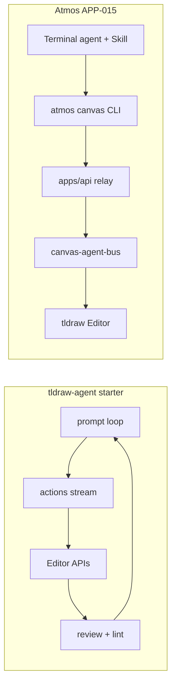

# IMPROVEMENT · APP-015: Canvas Agent — Operational Log

> Living record of **production issues**, **gaps vs [tldraw Agent starter kit](https://tldraw.dev/starter-kits/agent)**, **mitigations shipped**, and **follow-ups**. Complements the frozen planning quartet ([BRAINSTORM](./BRAINSTORM.md) → [PRD](./PRD.md) → [TECH](./TECH.md) → [TEST](./TEST.md)); does **not** replace them.

**Related code**: `apps/web/src/components/canvas/canvas-agent-*`, `apps/cli/src/commands/canvas.rs`, `skills/atmos-canvas-agent/SKILL.md`.

---

## How to use this file

| Rule | Detail |
|------|--------|
| **When to add** | After fixing a user-reported canvas-agent bug, a layout/quality regression, or a deliberate parity gap with the official starter kit. |
| **Entry id** | `IMP-NNN` — zero-padded, monotonic in this file (next: **IMP-006**). |
| **Status** | `open` → `mitigated` → `closed` (or `wont-fix` with reason). |
| **Do not** | Duplicate full TECH sections; link to TECH/PRD and paste only deltas. |
| **Skills** | When agent-facing behavior changes, bump `skills/atmos-canvas-agent/SKILL.md` version and note it in the entry. |

### Entry template (copy for new issues)

```markdown
## IMP-NNN · Short title

| Field | Value |
|-------|--------|
| **Date** | YYYY-MM-DD |
| **Status** | open \| mitigated \| closed \| wont-fix |
| **Reported by** | user \| agent \| internal review |
| **Severity** | crash \| layout \| ergonomics \| docs |

### Problem
…

### Root cause
…

### Solution
…

### Result
…

### Code / docs touched
- …

### Follow-ups
- [ ] …
```

---

## Index

| Id | Title | Status | Date |
|----|-------|--------|------|
| [IMP-001](#imp-001--tldraw-v5-note-patch-crashed-canvas-react-tree) | tldraw v5 `note` patch (`props.h`) crashed React tree | mitigated | 2026-05-19 |
| [IMP-002](#imp-002--diagram-layout-quality-gap-vs-official-tldraw-agent) | Diagram layout quality gap vs official tldraw-agent | mitigated | 2026-05-19 |
| [IMP-003](#imp-003--missing-pre-apply-validation-and-recoverable-cli-errors) | Missing pre-apply validation and recoverable CLI errors | mitigated | 2026-05-19 |
| [IMP-004](#imp-004--deferred-viewport-screenshot-for-agent-self-review) | Deferred: viewport screenshot for agent self-review | open | 2026-05-19 |
| [IMP-005](#imp-005--agent-view-dashed-frame-parity) | Agent view dashed frame (starter kit parity) | mitigated | 2026-05-19 |

---

## IMP-001 · tldraw v5 `note` patch crashed React tree

| Field | Value |
|-------|--------|
| **Date** | 2026-05-19 |
| **Status** | mitigated |
| **Reported by** | user (agent command on live canvas) |
| **Severity** | crash |

### Problem

Terminal agent sent `update-shape` with `{ "h": 120 }` on a **note** shape. tldraw v5 threw `ValidationError: At shape(type = note).props.h: Unexpected property`, which **crashed the React/tldraw subtree** instead of returning a structured error to the CLI.

### Root cause

1. **Schema mismatch**: Notes use `scale` + `richText`, not `w`/`h` in props (see tldraw v5 shape model).
2. **Bus allowed** `h` in the global `update_shape` allow-list for all shape types.
3. **No pre-flight validation** against `editor.store.schema.validateRecord` before apply.
4. **No Error Boundary** around the tldraw mount — one bad mutation took down the whole canvas chrome.

### Solution

| Layer | Change |
|-------|--------|
| **Shape patch planner** | `planUpdateShapePartial()` — reject `h` on notes; map `w` → `scale`. |
| **Validation** | `validateShapeUpdate()` → `finalizeShapeForStore()` + `schema.validateRecord`. |
| **Mutation wrapper** | `mutateEditor()` maps tldraw validation throws to `CanvasAgentError` (`VALIDATION_ARG`, recoverable). |
| **UI recovery** | `CanvasAgentCrashBoundary` + `CanvasAgentCrashProvider` — humorous fallback, **skip (10s default)** / **refresh**, `failInflight()` to CLI, `tldrawRemountKey` remount. |
| **Tests** | `canvas-agent-shape-patch.test.ts`, bus test for note + `h` rejection. |

### Result

- Invalid note patches are **rejected before** tldraw applies them; CLI receives `VALIDATION_ARG`.
- If an unexpected React error still escapes, users get a **recoverable** overlay instead of a blank canvas.
- Regression tests cover the original `props.h` case.

### Code / docs touched

- `apps/web/src/components/canvas/canvas-agent-shape-patch.ts`
- `apps/web/src/components/canvas/canvas-agent-validate.ts`
- `apps/web/src/components/canvas/canvas-agent-mutate.ts`
- `apps/web/src/components/canvas/canvas-agent-errors.ts`
- `apps/web/src/components/canvas/CanvasAgentCrashBoundary.tsx`
- `apps/web/src/components/canvas/canvas-agent-crash-context.tsx`
- `apps/web/src/components/canvas/CanvasView.tsx`
- `apps/web/src/components/canvas/use-canvas-agent-bridge.ts` (`failInflight`)

### Follow-ups

- [ ] Extend validation to **batch** `updateShapes` in layout/move paths (partially mitigated by bounds-based layout in IMP-002).
- [x] Document note vs geo semantics in Skill (see IMP-002).

---

## IMP-002 · Diagram layout quality gap vs official tldraw-agent

| Field | Value |
|-------|--------|
| **Date** | 2026-05-19 |
| **Status** | mitigated |
| **Reported by** | user (visual comparison with [tldraw.dev/starter-kits/agent](https://tldraw.dev/starter-kits/agent); local clone `tldraw-agent`) |
| **Severity** | layout |

### Problem

Atmos agent-drawn diagrams looked **messy**: overlapping boxes, uneven spacing, arrows detached from shapes. Official starter produced stable grids and aligned cards for the same class of prompt (“introduce tldraw 5.0 features”).

### Root cause

| Official tldraw-agent | Atmos (before) |
|----------------------|----------------|
| In-canvas **multi-step loop** (plan → act → review → lint → continue) | **One HTTP round-trip per CLI verb**; no built-in review |
| `align` / `stack` / `distribute` / `place` on **editor APIs** | Only `layout-row/column/grid` using **`props.w/h`** (wrong for notes, arrows) |
| `getShapePageBounds` for placement | `get-state` without bounds; agents guessed coordinates |
| Arrow **`fromId` / `toId` bindings** | `create-arrow` with fixed `x1,y1,x2,y2` only |
| Screenshot + lint feedback | Text-only `get-state` |
| Rich **rules-section** prompt | Skill v1.0.x with note `--w --h` examples |

Additional: default **spawn at viewport center** stacked multiple `create-*` without explicit coordinates.

### Solution

**Bus / CLI (shipped 2026-05-19)**

| Capability | Implementation |
|------------|----------------|
| Native layout | `align`, `stack`, `distribute`, `place` → `editor.alignShapes` / `stackShapes` / `distributeShapes` + bounds math (`canvas-agent-layout.ts`) |
| Bounds-based layout | `layout-row/column/grid` rewritten via `getShapePageBounds` (`canvas-agent-bounds.ts`) |
| State | `get-state` adds per-shape `bounds`; includes `lints` |
| Lint | `lint` command — AABB overlap + unbound arrows (`canvas-agent-lint.ts`) |
| Arrows | `create-arrow --from-id` / `--to-id` + bindings (`canvas-agent-arrow-bindings.ts`) |
| Batch | `apply` — up to 32 commands per invoke |
| Spawn | Staggered auto-placement when `x`/`y` omitted |
| Skill | `skills/atmos-canvas-agent/SKILL.md` **v1.1.0** — diagram workflow, prefer geo cards + align/stack |

**Reference architecture** (unchanged product choice): Atmos remains **CLI → API → browser bus**; we ported **primitives**, not the hosted Worker agent loop.



### Result

- Agents can match official **layout quality** using `align` / `stack` / `layout-grid` + bound arrows without hand-tuning every coordinate.
- `get-state` / `lint` give **actionable** overlap and arrow feedback (textual, not visual).
- Skill teaches a **repeatable diagram recipe** (frame → geo cards → layout → arrows → lint).
- All canvas component tests green; CLI `atmos canvas` exposes new verbs.

### Code / docs touched

- `apps/web/src/components/canvas/canvas-agent-{bounds,layout,lint,arrow-bindings}.ts`
- `apps/web/src/components/canvas/canvas-agent-bus.ts`
- `apps/cli/src/commands/canvas.rs`
- `skills/atmos-canvas-agent/SKILL.md` (v1.1.0)
- `apps/web/src/components/canvas/canvas-agent-feed-labels.ts`

### Follow-ups

- [ ] [IMP-004](#imp-004--deferred-viewport-screenshot-for-agent-self-review) — screenshot in `get-state` for visual review.
- [ ] Promote overlap lint to **geometry-aware** (starter kit uses polygon overlap for text).
- [ ] Optional in-app agent loop (product decision; out of original APP-015 M1 scope).

---

## IMP-003 · Missing pre-apply validation and recoverable CLI errors

| Field | Value |
|-------|--------|
| **Date** | 2026-05-19 |
| **Status** | mitigated |
| **Reported by** | internal (same incident chain as IMP-001) |
| **Severity** | ergonomics |

### Problem

When the bus or tldraw threw, agents saw opaque failures or a **white canvas**; `RELAY_TIMEOUT` / retry guidance in Skill was insufficient for **schema** mistakes.

### Root cause

- Errors were not consistently mapped to **`CanvasAgentError`** with stable `error_code`.
- Bridge did not fail in-flight HTTP requests when the UI recovered from a crash.

### Solution

- `CanvasAgentError` + `isTldrawValidationError` classification.
- `use-canvas-agent-bridge.ts` → `failInflight(message)` posts `INTERNAL_ERROR` on crash recovery paths.
- Crash UI calls `failInflight` before remount/reload.

### Result

CLI scripts and terminal agents receive **structured JSON errors** for validation mistakes; crash recovery **closes the HTTP request** instead of hanging until timeout.

### Code / docs touched

- `canvas-agent-errors.ts`, `use-canvas-agent-bridge.ts`, `CanvasAgentCrashBoundary.tsx`

### Follow-ups

- [ ] Log `request_id` + command in crash `componentDidCatch` for support (see `agents/references/debug-logging.md`).

---

## IMP-004 · Deferred: viewport screenshot for agent self-review

| Field | Value |
|-------|--------|
| **Date** | 2026-05-19 |
| **Status** | open |
| **Reported by** | internal (parity review vs tldraw-agent `review` + screenshot parts) |
| **Severity** | ergonomics |

### Problem

Textual `get-state` + `lint` cannot catch all visual issues (text clipping inside geo, subtle misalignment). Official agent **reviews a screenshot** after multi-step edits.

### Proposed direction

- Add optional `get-state --include-screenshot` or `export-viewport` verb returning PNG (base64) from the active canvas tab.
- Skill: “after layout, request screenshot once before declaring done.”

### Result

*Not implemented — explicitly deferred per product request (2026-05-19).*

### Follow-ups

- [ ] Size cap + privacy note in PRD/TECH if added.
- [ ] Wire into Skill diagram workflow as optional step 8.

---

## IMP-005 · Agent view dashed frame parity

| Field | Value |
|-------|--------|
| **Date** | 2026-05-19 |
| **Status** | mitigated |
| **Reported by** | user (comparison with official tldraw-agent UI) |
| **Severity** | ergonomics |

### Problem

Official [tldraw Agent starter kit](https://tldraw.dev/starter-kits/agent) shows a **dashed page-space frame** with label `Agent XXXXXX's view` while the agent works. Atmos only had transient shape rings, no working-area frame.

### Root cause

APP-015 intentionally dropped multi-agent `TLInstancePresence` / `setMyView`; no UI ported `AgentViewportBoundsHighlights` / `AreaHighlight`.

### Solution

- `CanvasAgentViewHighlight` — `SVGContainer` dashed rect + label (same technique as starter kit `AreaHighlight.tsx`).
- `CanvasAgentActivityStore.beginWork` / `viewBounds` — union of viewport + touched shape bounds (padding 48px); visible while dispatch **inflight** or for **45s** after last command.
- Styles in `packages/ui/src/styles/globals.css` (`.canvas-agent-view-highlight*`).

### Result

With bridge enabled, terminal agent sessions show a stable **Agent {clientId}'s view** frame that grows as shapes are edited — similar affordance to the official screenshot.

### Code / docs touched

- `CanvasAgentViewHighlight.tsx`, `canvas-agent-view-bounds.ts`, `canvas-agent-activity.ts`, `use-canvas-agent-bridge.ts`, `CanvasView.tsx`

### Follow-ups

- [x] `set-agent-view` CLI (`x,y,w,h` or `--center-ids`) for explicit bounds like starter `setMyView`.
- [ ] Toggle in Bot popover to hide the frame.

---

## Operational notes

### Local dev checklist (after bus/CLI changes)

1. Build CLI: `cargo build --release --bin atmos` → install to `~/.atmos/bin/atmos`.
2. Run **dev** API + web (`just dev-api`, `just dev-web`) — browser bus must match CLI version.
3. Sync Skill: `skills/atmos-canvas-agent/SKILL.md` → `~/.atmos/skills/.system/atmos-canvas-agent/SKILL.md`.
4. Canvas tab: enable **bridge** in Bot popover.

### Version markers

| Artifact | Version when IMP-001–003 landed |
|----------|-------------------------------|
| `skills/atmos-canvas-agent/SKILL.md` | 1.1.0 |
| `atmos` CLI | 0.2.0-beta.3 (release build) |
