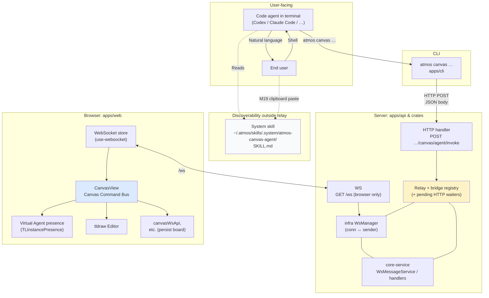
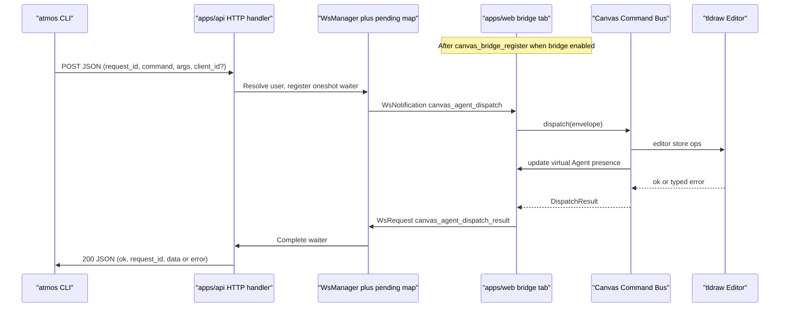

# TECH · APP-015: Canvas Terminal Agent Integration

> Technical Design · HOW. Implements [PRD.md](./PRD.md). **Distinct from [APP-004](../APP-004_local-agent-integration-acp/TECH.md)** (ACP) and complementary to [APP-014 Canvas](../APP-014_canvas/TECH.md) (board + overlay baseline). Post-ship incidents and layout-quality iterations: [IMPROVEMENT.md](./IMPROVEMENT.md).

---

## 1. Scope summary

Delivers **`atmos canvas`** (CLI intent verbs), **Canvas Command Bus** in `apps/web`, relay where **`atmos canvas` uses HTTP to `apps/api`** and the **browser uses the existing main WebSocket** for dispatch to **CanvasView**, plus **bridge registration / permissions**, **system Skill** (`SKILL.md` + manifest sync), **M19 clipboard + `skill-dir`**, **Agent presence / Follow Agent**, and correlated **success/failure** for scripts and agents.

**Transport decision (locked)**: **CLI → `apps/api` via authenticated HTTP** (one request per subcommand, `POST` with JSON body). The API **awaits** the round-trip: it pushes **`canvas_agent_dispatch`** on **`WsManager` → browser**, collects **`canvas_agent_dispatch_result`**, then **returns JSON on the HTTP response**. **No WebSocket client in the CLI** for M1. The **web app** continues to use **`/ws`** for everything it already does, including bridge registration and dispatch handling.

**Out of scope (M1)**: MCP as transport, `@tldraw/driver` leaking to CLI, raw store/snapshot patches, headless server-side editing, ACP tool routing.

**Environment assumption (M1)**: The API process that serves `fs_get_home_dir` and authenticates the CLI runs on the **same machine** where the user’s synced `~/.atmos/skills/.system/` tree and terminal agents live (local runtime / desktop parity). Remote-hosted API topologies **must fall back** to non-expanded path templates until a client-trustworthy home resolution exists.

---

## 2. Locked product constants

| Constant | Value | Notes |
|----------|--------|--------|
| **System skill id** | `atmos-canvas-agent` | Directory `skills/atmos-canvas-agent/` in repo; sync target `~/.atmos/skills/.system/atmos-canvas-agent/`. |
| **M8 text story** | **`create-note` only** | No separate `create-text` in M1; plain text diagrams use note/sticky semantics. Document in Skill + `--help`. |
| **Default multi-tab policy** | **Refuse ambiguous targets** | If more than one bridge-registered tab and CLI omits `--client-id`, fail with explicit stderr + structured error + registered id list in payload. |
| **Layout grid bounds** | **Max 24×24** cells; max **256** ids per layout invocation | Prevent abuse / huge allocations; tighten if profiling says otherwise. |
| **Correlation** | **`request_id`**: UUID v4 strings | Minted by **CLI issuer** each invoke; echoes through relay for log correlation (`agents/references/debug-logging.md`). |
| **Relay timeout** | Default **45s** per invoke | Configurable `--timeout-ms` on CLI for slow machines. |
| **CLI ingress** | **Authenticated `POST` JSON** to `apps/api` | Exact path in implementation (e.g. `POST /api/v1/canvas/agent/invoke`); **no CLI WebSocket** in M1. Reuse the same auth story as other CLI→API flows. |
| **Agent presence user id** | `agent:<actor_id>` | `actor_id` defaults to the bridge `client_id` / terminal agent label hash if CLI does not supply one. Must be stable for a run so `startFollowingUser` remains valid. |
| **Agent presence TTL** | 60s idle | Remove or mark idle after no Agent command for 60s; refresh on every accepted command. |

---

## 3. Architecture overview

Two diagrams summarize **what the integrated system does** (component boundaries) and **how a single `atmos canvas` invocation flows** (message path). Deeper mechanics are specified in §5–§7.

### 3.1 System context (overall)



**How to read this diagram**

- **`SKILL.md`**: teaches *when* and *how* to use the CLI; visible on disk and **not** carried over the relay. **`skill-dir`** only prints a local path and **does not** open a WebSocket.
- **Relay for `atmos canvas` (except `skill-dir`)**: **CLI uses HTTP** to the API; **only the web client** holds a **`/ws`** connection. **Execution** happens in **CanvasView + Editor**; persistence stays the existing **canvas board** path (APP-014).
- **Follow Agent**: the command bus also updates a local tldraw **`TLInstancePresence`** record for the Agent so the user can call tldraw follow APIs (`startFollowingUser` / `zoomToUser`) against a real presence target.

### 3.2 Relay sequence (single request–response cycle)



### 3.3 Relay-only sketch (pure text)

A minimal **relay plane**-only view (no Skill / DB), for copy-paste in environments without Mermaid. This is equivalent to older single-column ASCII diagrams.

```text
  Terminal agent          apps/api                    apps/web
        |                      |                            |
 atmos CLI -------- HTTP POST (invoke) --------> [relay + pending waiter]
        |                      |                            |
        |                      |------ canvas_agent_dispatch (WS Notify) --> [Command Bus --> Editor]
        |                      |<----- canvas_agent_dispatch_result (WS) ----|
        ^--- HTTP 200 JSON (request_id, result) ---   persistence: existing canvas board APIs (APP-014)
```

**Execution locus**: All **mutating** semantics run in the browser against the live `Editor` (APP-014). **`canvas_update_default_board` / persistence** paths stay as today; bridge commands apply **store ops** through tldraw, then existing autosave / manual save persists.

**HTTP vs WebSocket**: The CLI sees a **normal request–response** (no socket to maintain). **`/ws` remains browser-only** for dispatch delivery and `canvas_agent_dispatch_result` uplink. Optional future **`atmos canvas watch`** could add a **separate** long-lived channel; not M1.

---

## 4. Skill artifact & sync

### 4.1 Layout

```
skills/atmos-canvas-agent/
├── SKILL.md          # Canonical agent-facing prose + verb tables + examples
└── (optional references/ scripts as needed)
```

### 4.2 Manifest & Rust allowlist

- Append **`atmos-canvas-agent`** entries to **`skills/system-skills-manifest.json`** (minimum: `skills/atmos-canvas-agent/SKILL.md`).
- Add the id to **`ALL_SYSTEM_SKILL_NAMES`** (see **`crates/infra/src/utils/system_skill_sync.rs`**) beside `git-commit`, `project-wiki`, …

### 4.3 M19 — Clipboard prompt (canonical short text)

Stored once in TECH/Skill so Canvas UI and CLI stay identical:

> **English (M1 default)**  
> `Read the Atmos Canvas skill in this directory, then use 'atmos canvas' subcommands as documented in SKILL.md:`  
> followed by a **newline** and the **absolute directory path** (trailing slash optional but consistent).

If `fs_get_home_dir` is unavailable or deployment is ambiguous, fallback line:

> `Skill directory (expand ~ to your home directory): ~/.atmos/skills/.system/atmos-canvas-agent/`

### 4.4 Web: copy action

- **CanvasView** (or shared helper used by Canvas overflow / share UI) builds the string: **prompt block + resolved path**.
- Resolved path = `join(fs_get_home_dir().path, ".atmos/skills/.system/atmos-canvas-agent")` via existing **`wsRequest("fs_get_home_dir")`** + client-side path join (`/` normalization). No new WsAction required for M1 unless we prefer a dedicated `canvas_skill_dir` later.

### 4.5 CLI: `skill-dir` / `skill-path`

- **`atmos canvas skill-dir`** (primary): print the same two-line convention to **stdout** (human text; optionally mirror JSON shape under global CLI JSON policy when we add `canvas`). **Uses local OS home**, **does not open WebSocket** (no relay).
- **`atmos canvas skill-path`**: **alias** of `skill-dir` (same output), for discoverability from older notes.

---

## 5. Bridge registration & permissions

### 5.1 Semantics (M1 simplification)

**Single session flag** `terminal_canvas_bridge_enabled` (name adjustable in code) lives in **browser memory** (and optionally `sessionStorage` for reload tolerance — product choice in implementation). When **off**:

- Web **does not** register the tab as a relay target (or registers with `accepts: false`).
- **`status` still works** as a server-side diagnostic and reports zero eligible clients / disabled bridge state.
- **`get-state` and all mutating commands** fail fast with a stable error code because they need a bridge target and live editor.

When **on**:

- Tab is eligible for routing; **mutations** still require **live editor ready** + same checks as reads (bridge alone is insufficient if editor not mounted).

UI: toggle or one-time banner in Canvas chrome (exact control shared with APP-014 overflow / toolbar patterns).

### 5.2 Client registration envelope

Browser sends **`WsAction`** **`canvas_bridge_register`** (payload TBD precise fields, illustrative):

```json
{
  "client_id": "uuid-v4-stable-per-tab-session",
  "label": "optional short label",
  "capabilities": ["canvas_agent_v1"],
  "accepts_commands": true
}
```

Unregister on overlay close **or** toggle off **`canvas_bridge_unregister`** (payload `{ "client_id" }`) so server drops routing immediately.

Implementation stores: **`user_id → { conn_id, client_id, label, accepts, updated_at }[]`**. On websocket disconnect: purge all rows tied to **`conn_id`**.

### 5.3 Heartbeats

Prefer **piggybacking** on existing WS activity; optional **`canvas_bridge_ping`** every N minutes later if TTL needed. **M1**: rely on unregister + disconnect cleanup **only**.

---

## 6. Relay transport

### 6.1 CLI ingress — HTTP (**locked for M1**)

- **`atmos canvas <verb>`** (except **`skill-dir`**) performs **`POST`** with **`Content-Type: application/json`** to a route owned by **`apps/api`** (exact path chosen in routing; illustrative: **`POST /api/v1/canvas/agent/invoke`**).
- **Auth**: reuse **existing CLI → API credentials** (same headers / bearer / cookie policy as other authenticated CLI surfaces—implementations must not invent new API keys).

**Body (JSON)** mirrors the invoke envelope:

```json
{
  "request_id": "uuid-v4 (CLI-minted or server optional override)",
  "client_id": "optional bridge-tab uuid",
  "actor": {
    "type": "terminal-agent",
    "id": "optional stable agent id",
    "name": "optional display name",
    "color": "optional CSS color"
  },
  "command": "<snake_case per §10>",
  "args": {}
}
```

**Response (JSON)**: **`{ ok, request_id, data?, error? }`** with appropriate **HTTP status** (see §12). Handler **blocks** until the browser returns **`canvas_agent_dispatch_result`** or **timeout** (**§2** **`Relay timeout`**).

### 6.2 API internal — awaiting the browser

1. Authenticate HTTP → **`user_id`**.
2. Insert **`pending_relay[user_id + request_id] → oneshot::Sender<DispatchResult>`** (or equivalent).
3. Resolve **target `browser_conn_id`** from bridge registry (**§5**). On routing error, **complete HTTP immediately** with structured error (**no WS round-trip**).
4. **`WsManager::send_to(browser_conn_id, notification canvas_agent_dispatch, data)`** with **`request_id`**, **`command`**, sanitized **`args`**, and normalized **`actor`** metadata.
5. On **`canvas_agent_dispatch_result`** from that browser connection, validate **`request_id`**, wake waiter, serialize JSON HTTP response.

If the browser crashes or never answers: **timeout** → HTTP **`503`** / **`504`** with **`CANVAS_BRIDGE_OFFLINE`** or **`RELAY_TIMEOUT`** (stable code).

### 6.3 Browser path (unchanged contract)

- **`onEvent("canvas_agent_dispatch", …)`** → **Canvas Command Bus** (**§8**).
- **`WsRequest` `canvas_agent_dispatch_result`** with **`request_id`** and **`{ success, error_code?, data? }`**.
- Browsers **must** respond to every **`request_id`** they accept (failure included) within server timeout.

### 6.4 Why HTTP for CLI (vs CLI WebSocket)

- **Operational simplicity**: one **`reqwest`/hyper** call per subcommand—no frame loop, reconnect, or **`client_type=canvas_cli`** upgrade in M1.
- **Debuggability**: `curl` / proxies / logs match typical API tooling.
- **Web unchanged**: **`/ws`** stays the **only** place the live editor is driven; HTTP is just the **ingress** that fans in to **`WsManager`**.

### 6.5 Optional later (not M1)

- **`GET`/`POST` streaming** or **SSE** for long runs; **CLI WebSocket** only if product needs sub-second server push to the terminal without polling.

---

## 7. WebSocket protocol deltas (browser ↔ server)

Implement end-to-end in:

- **`apps/web/src/hooks/use-websocket.ts`** — extend **`WsAction` union** where needed; **`onEvent("canvas_agent_dispatch")`** for relay delivery.
- **`crates/core-service`** — enum **`WsAction`** + **`ws_message.rs`** routing for bridge + **`canvas_agent_dispatch_result`** (+ shared **pending waiter** table used by **HTTP handler + WS uplink**).
- **`crates/infra/src/websocket/message.rs`** as needed for notification typing.

**CLI ingress is not a `WsAction`** in M1—it is **HTTP** (**§6**).

### 7.1 New `WsAction` variants (browser → server, planned)

| Action | Direction | Purpose |
|--------|-----------|---------|
| `canvas_bridge_register` | Web → srv | Announce bridge-eligible Canvas tab (`client_id`, flags). |
| `canvas_bridge_unregister` | Web → srv | Tear down routing state. |
| `canvas_agent_dispatch_result` | Web → srv | Completes **HTTP waiters** and correlates **`request_id`**. |

### 7.2 Server notification events

**To browser**:

- **`canvas_agent_dispatch`** — payload: **`request_id`**, **`command`**, **`args`**, **`actor`** (typed per §9–§10).

Browsers validate **`command`**; unknown **`command`** → **`success: false`**, **`error_code`: `UNSUPPORTED_COMMAND`** (**§11**).

---

## 8. Canvas Command Bus (`CanvasView` / adjacent module)

Isolate in a dedicated helper (e.g. **`canvas-agent-bus.ts`**) exported for unit testing:

1. **`dispatch(envelope): Promise<DispatchResult>`**
   - Validates JSON shape (zod or hand-rolled).
   - Calls **tldraw `Editor`** APIs (`createShapes`, `updateShapes`, `deleteShapes`, `setSelectedShapes`, camera helpers, …).
   - Maps recoverable errors to stable **`error_code`** strings (M17).

2. **Driver usage**: `@tldraw/driver` **only** where strictly cheaper than public `editor` surface; **never** part of agent contract.

3. **Terminal card shapes**: For M1 **must** include enough fields in **`get-state`** output to reason about existing cards (align with **`canvas-terminal-shape`** types). **`add-terminal`** remains **Nice** (N3).

### 8.1 Autosave / persistence interaction (M1 policy)

**Mutex rule**: While `dispatch` runs a **mutation** path, **pause** or **coalesce** autosave timer ticks (same critical section as heavy local operations if any exist). **Finish** with `editor.markHistoryStoppingPoint()` (or tldraw equivalent) so undo boundaries are sensible.

**Ordering**: `dispatch` → allow microtask flush → resume autosave / explicit `canvasWsApi.updateDefaultBoard` follow existing debounced save.

If two dispatches race: **serialize** in a FIFO queue in the bus (no parallel mutations from relay).

### 8.2 Sanitization (`sanitizeAction` pattern)

- Unknown shape id → **`STALE_SHAPE_ID`** (recoverable; agent should `get-state`).
- Out-of-range layout → **`VALIDATION_ERROR`**
- Mutation while editor not ready → **`EDITOR_NOT_READY`**

Codify codes in **`DispatchResult`** + Skill appendix.

---

## 9. Agent presence & Follow Agent

tldraw user following depends on collaboration **presence records**, not on `@tldraw/driver`. M1 creates a **virtual Agent presence** in the target browser tab so the human user can follow or jump to the Agent’s latest work area.

### 9.1 Actor metadata

HTTP invoke accepts optional **`actor`** metadata (TECH §6). API normalizes it before dispatch:

```ts
interface CanvasAgentActor {
  type: "terminal-agent";
  id: string;       // stable within an agent run; used to derive agent:<id>
  name: string;     // e.g. "Codex Agent", "Claude Code", "Terminal Agent"
  color: string;    // CSS color; default from deterministic palette
}
```

If CLI does not provide actor fields:

- **`id`** defaults to `client_id` + command source hash (or `default` if unavailable).
- **`name`** defaults to **`Terminal Agent`**.
- **`color`** defaults to a deterministic palette entry.

### 9.2 Virtual presence record

After every accepted command, the command bus computes **`changed_shape_ids`** and **`changed_bounds`**. It then creates or updates a tldraw presence record equivalent to:

```ts
import { InstancePresenceRecordType } from "tldraw";

const agentPresence = InstancePresenceRecordType.create({
  id: InstancePresenceRecordType.createId(agentUserId),
  userId: agentUserId,              // "agent:<actor.id>"
  userName: actor.name,
  color: actor.color,
  currentPageId: editor.getCurrentPageId(),
  cursor: changedCenter
    ? { x: changedCenter.x, y: changedCenter.y, type: "default", rotation: 0 }
    : null,
  selectedShapeIds: changedShapeIds,
  camera: cameraForChangedBounds,   // enough for startFollowingUser viewport math
  screenBounds: syntheticScreenBoundsForChangedBounds,
  lastActivityTimestamp: Date.now(),
  chatMessage: "",
  brush: null,
  scribbles: [],
  followingUserId: null,
  meta: {
    kind: "atmos-terminal-agent",
    requestId,
    command,
  },
});
```

Implementation notes:

- Use tldraw’s **presence scope** / `TLInstancePresence` APIs; do **not** persist this record in `document_json`.
- If direct `editor.store.put([presence])` is used, mark it as **presence/session** state, not document state. If current APP-014 store setup lacks a clean presence channel, isolate this in an adapter (e.g. **`canvas-agent-presence.ts`**) so it can migrate to `@tldraw/sync` later.
- **`@tldraw/driver` is not used for presence**. It may still help with editor operations, but Agent identity and followability live in `TLInstancePresence`.

### 9.3 Follow UI

Add a lightweight Canvas chrome affordance:

- **Agent activity chip**: displays the current Agent name/color and last command status while the TTL is active.
- **Follow Agent**: calls **`editor.startFollowingUser(agentUserId)`**.
- **Jump to Agent**: calls **`editor.zoomToUser(agentUserId)`** or equivalent fallback to `changed_bounds` when the presence record cannot provide enough camera data.
- **Stop following**: rely on tldraw’s normal behavior (manual pan/zoom/select stops following), plus optional explicit button if the default following indicator is not clear enough.

M1 only guarantees presence in the **target browser tab**. APP-015 does **not** broadcast Agent presence to other tabs or other browser users: Atmos Canvas is a local personal developer tool, and the existing multi-tab policy is only for routing ambiguity within the same user session.

### 9.4 Dispatch result additions

Successful mutation results should include:

```ts
interface CanvasAgentDispatchData {
  changed_shape_ids?: string[];
  changed_bounds?: { x: number; y: number; w: number; h: number };
  agent_user_id?: string;
}
```

Read-only commands may update presence with cursor/focus metadata but should not claim changed shapes.

---

## 10. Command vocabulary ↔ JSON payloads

CLI flags are **thin skins** over **`command` + `args`**. Naming below matches **`atmos canvas <verb>`** and **`POST` invoke body `command`** (**§6**).

### 10.1 Read / diagnostics

| CLI verb | `command` string | Payload notes |
|---------|-------------------|---------------|
| `status` | `status` | **Server-side only**; does not dispatch to CanvasView. Response includes **`bridge_registered_count`**, ambiguity hints, **`clients[]`** summaries, and whether bridge is enabled for known tabs. |
| `get-state` | `get_state` | Routed to Canvas tab; optional **`page_id`** in args; default current page. Response schema §10.3. |

### 10.2 Mutations (non-exhaustive keys — final types in TS/Rust)

| CLI verb | `command` | Args highlights |
|----------|-----------|-----------------|
| `create-note` | `create_note` | text, `{x,y}?`, `{w,h}?`, style ids bounded |
| `create-frame` | `create_frame` | title?, bounds |
| `create-geo` | `create_geo` | `kind` enum (must track supported **tldraw** geo kinds server-side validator list) |
| `create-arrow` | `create_arrow` | `{x,y}` pairs for start/end in **page space** M1 |
| `create-draw` | `create_draw` | structured points/path + stroke width/color |
| `select` | `select` | `shape_ids: string[]` |
| `clear-selection` | `clear_selection` | |
| `move` | `move` | ids + delta `{dx, dy}` only for M1. Absolute placement can be added later if user demand appears. |
| `delete` | `delete` | `shape_ids`; **requires CLI flag `--confirm`** mirrored in args `{ "confirm": true }` |
| `layout-row` | `layout_row` | ids/order, gap |
| `layout-column` | `layout_column` | |
| `layout-grid` | `layout_grid` | rows, cols bounded (§2), spacing |
| `update-shape` | `update_shape` | id → `{ patch … }` with **allow-listed keys only** (`color`, `fill`, …) |
| `viewport` | `viewport` | `zoom`, `pan`, optional `bounds`/`center_ids` analogue |

Nice / later (**N2**):

| CLI verb | Notes |
|---------|-------|
| `apply` | Single JSON blob of ordered actions `{ _type }` validators shared with bus internals. |

### 10.3 `get-state` response sketch

```typescript
interface CanvasAgentStateV1 {
  schema: "canvas_agent_state.v1";
  page: { id: string; name: string };
  viewport: {
    zoom: number;
    pan: { x: number; y: number }; // TLDraw camera space conventions
    bounds_world?: { x: number; y: number; width: number; height: number };
  };
  selection_shape_ids: string[];
  shapes: Array<{
    id: string;
    type: string;
    bounds: { x: number; y: number; w: number; h: number };
    text_preview?: string; // capped length
    // When type === canvas-terminal-ish:
    tmux_window?: string | null;
    pane_agent?: unknown;
    is_new_terminal?: boolean;
  }>;
}
```

Expose **explicit** enums for **`type`** string values matching internal shape types.

---

## 11. CLI: `apps/cli`

### 11.1 Command tree

```
atmos canvas
├── skill-dir [--json]        # aliases: skill-path — local only, no WS
├── status [--json]
├── get-state [--json] [--client-id=<uuid>]
├── create-* …                # verbs from §10
├── …
├── --client-id <uuid>        # global flag passed into invoke payload
├── --actor-id <id>           # optional stable Agent id for presence/follow
├── --actor-name <name>       # optional display name, defaults to Terminal Agent
├── --actor-color <css-color> # optional Agent presence color
├── --timeout-ms <n>          # client-side HTTP deadline (should match server)
└── (optional) --api-url / env # base URL for `apps/api` (must match web runtime)
```

**Output**:

- Prefer structured stdout JSON **`{ ok, request_id?, data?, error? }`** mirroring **`POST` response body**.

### 11.2 HTTP client

- **`reqwest`** (or shared internal HTTP helper) with **same auth injection** as future CLI→API conventions.
- **`POST` + JSON** per **§6**; map **4xx/5xx** + body `error.code` to stderr hints.
- **Timeouts**: respect **`--timeout-ms`**; surface **`RELAY_TIMEOUT`** when client aborts first.

### 11.3 Local path resolution (`skill-dir`)

Use OS home dirs (`dirs` crate or POSIX `HOME`), **never** WS (**§4.5**).

---

## 12. Structured errors (HTTP response ↔ CLI)

Use **HTTP status** + JSON body **`{ ok: false, error: { code, message, recoverable? } }`** (exact shape aligned with existing **`apps/api`** error DTOs).

| Code | HTTP (illustrative) | Meaning | Recoverable |
|------|---------------------|---------|-------------|
| `CANVAS_BRIDGE_OFFLINE` | 503 | No registered tab | Yes |
| `CANVAS_CLIENT_AMBIGUOUS` | 409 | Multiple registrations | Yes — `--client-id` |
| `BRIDGE_DISABLED` | 403 | Tab not accepting | Yes |
| `EDITOR_NOT_READY` | 503 | Editor not ready | Retry |
| `STALE_SHAPE_ID` | 422 | Stale id | `get-state` |
| `VALIDATION_ARG` | 400 | Bad args | Fix args |
| `PERMISSION_DENIED` | 401/403 | Auth | Refresh token |
| `UNSUPPORTED_COMMAND` | 422 | Skew | Upgrade |
| `RELAY_TIMEOUT` | 504 | Browser never answered | Retry |

Emit **English** stderr hints for humans; Skill translates for agents.

---

## 13. Security

- **AuthZ**: Relay targets **only** the caller’s own bridge registrations.
- **Sanitize args**: No raw FS paths introduced by M1 commands.
- **Sanitize actor metadata**: Agent display names/colors are untrusted CLI input. Cap lengths, reject control characters, and normalize colors to the supported CSS color subset before writing presence.
- **No secrets** in JSON bodies beyond standard auth headers / session; logs redact tokens.
- **Destructive**: `delete` double gate (CLI flag + payload `confirm`).
- **CSRF / browser**: HTTP route is intended for **authenticated CLI / tools**, not incidental browser form posts—follow existing API CSRF/CORS policy for **`apps/api`**.

---

## 14. Observability

- **Trace**: **`request_id`** end-to-end: **CLI mint → HTTP handler pending map → `canvas_agent_dispatch` → `canvas_agent_dispatch_result` → HTTP JSON** (structured logs).
- **Presence trace**: include **`agent_user_id`** and **`actor.name`** in debug logs where safe so stale/follow issues can be diagnosed.
- **Metrics (optional M1)**: Counter by **`error_code`** on invoke completion.

---

## 15. Versioning & tldraw coupling

- **`schema: "canvas_agent_state.v1"`** and **`canvas_agent_command.v1`** (invoke envelope allow-list).
- **Agent presence** depends on tldraw `TLInstancePresence` / `InstancePresenceRecordType`. Re-check when upgrading tldraw because follow requires `camera`, `screenBounds`, `currentPageId`, and `userId` semantics to stay stable.

---

## 16. Implementation checklist (expected touch list)

| Area | Files / modules (illustrative) |
|------|--------------------------------|
| Skill | `skills/atmos-canvas-agent/SKILL.md`, manifest, `ALL_SYSTEM_SKILL_NAMES` |
| WS + relay core | `crates/infra/.../message.rs`, **`canvas_agent_dispatch`** notify, **`canvas_agent_dispatch_result`** handler linking to **pending HTTP waiter** |
| HTTP ingress | **`apps/api/...`** Axum route + **`core-service`** helper shared with WS routing rules |
| Web bus | `CanvasView.tsx`, `canvas-agent-bus.ts`, **`onEvent("canvas_agent_dispatch")`** |
| Agent presence | `canvas-agent-presence.ts` (or similar), Canvas chrome activity chip / Follow Agent control |
| CLI | `commands/canvas.rs`, **`reqwest`** / HTTP client deps, **`main.rs`** routing |
| Clipboard M19 | Canvas chrome UI |

---

## 17. Rollout

1. Land **`canvas_bridge_*`** + browser **`canvas_agent_dispatch`** noop path.
2. Add **HTTP invoke route** wired to **`pending waiter` + `send_to(browser)`**.
3. Wire server-side `status` and bus-backed `get-state` end-to-end.
4. Add Agent presence adapter + Follow Agent UI over the noop/read path.
5. Layer mutations incrementally and update presence from `changed_shape_ids` / `changed_bounds`.
6. Ship Skill + manifest sync.
7. Dogfood per **TEST.md**.

---

## 18. Risks & mitigations

| Risk | Mitigation |
|------|------------|
| API base URL misconfigured | **`--api-url`** + clear error when host unreachable |
| Orphaned HTTP waiters | Server timeout + structured **`RELAY_TIMEOUT`** |
| Autosave races | §8.1 mutex / queue |
| Stale Agent presence / user follows old location | Presence TTL (§2), cleanup on bridge unregister, refresh from every accepted command |
| Multi-tab confusion | §2 default refuse + `status` lists ids |
| Accidental token in shell | Doc: read token from file/env; never log full URL |

---

## 19. References

- PRD: [PRD.md](./PRD.md)
- Brainstorm / starter-kit parity table: [BRAINSTORM.md](./BRAINSTORM.md)
- Canvas baseline: [APP-014 TECH](../APP-014_canvas/TECH.md)
- Debug logging: `agents/references/debug-logging.md`
- tldraw Agent starter kit (capability reference): https://tldraw.dev/starter-kits/agent
- tldraw collaboration / presence: https://tldraw.dev/docs/collaboration
- tldraw user following: https://tldraw.dev/sdk-features/user-following
