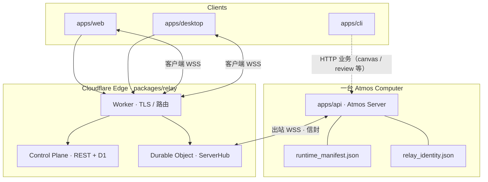
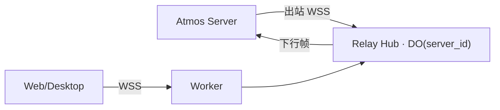
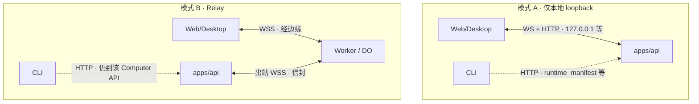
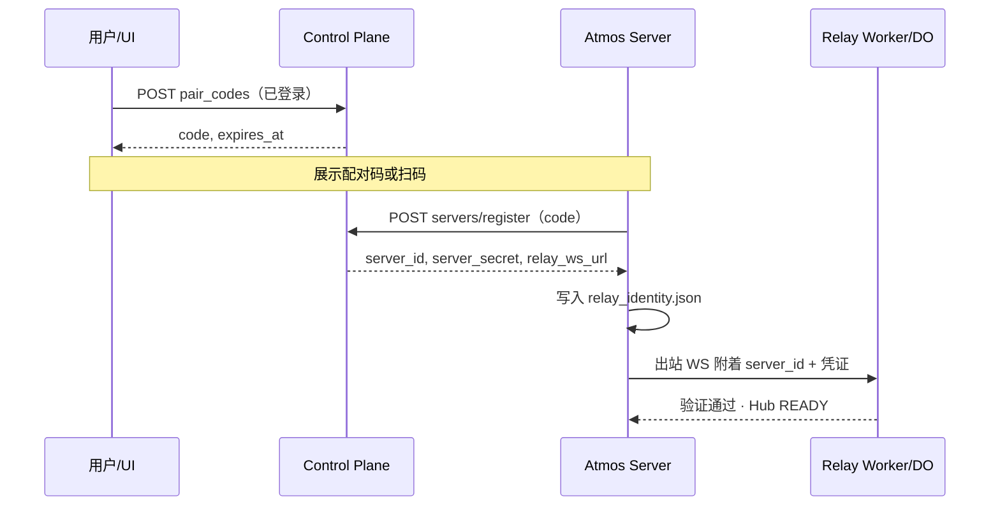
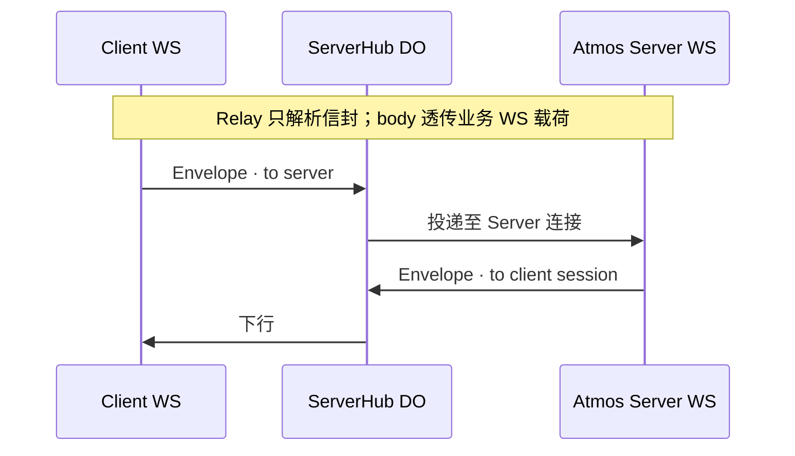
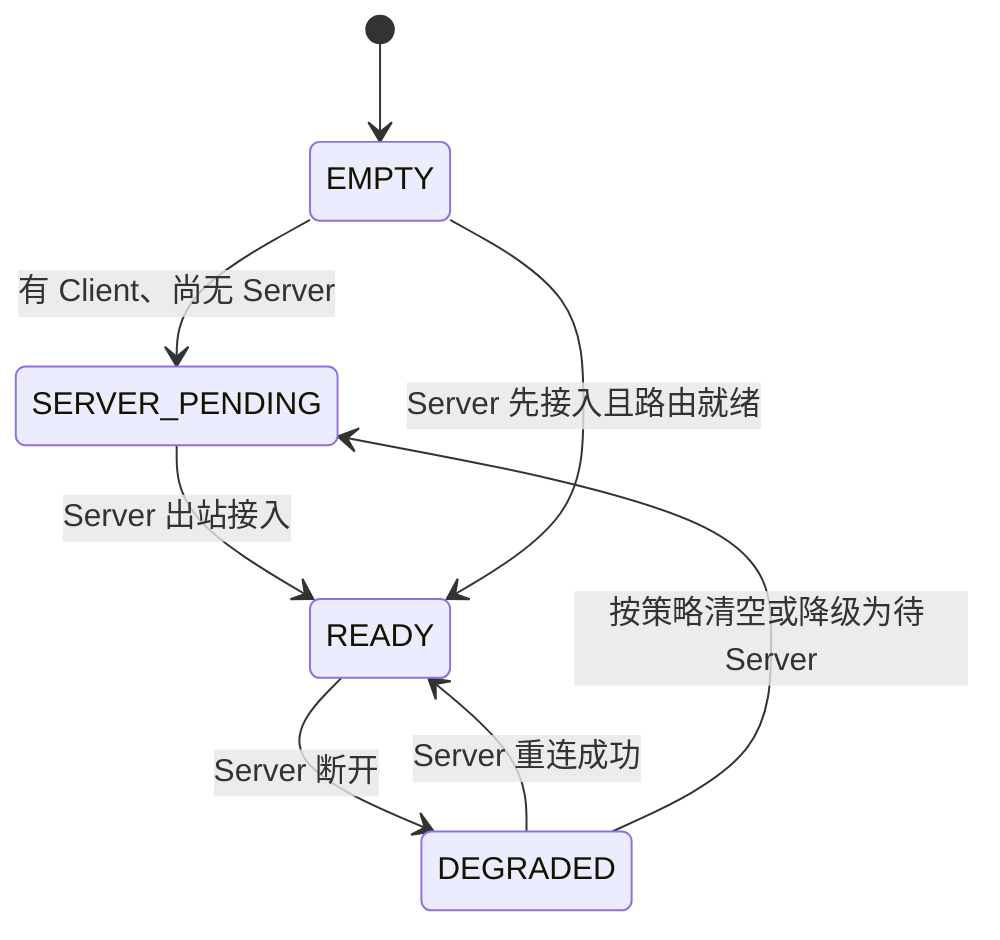
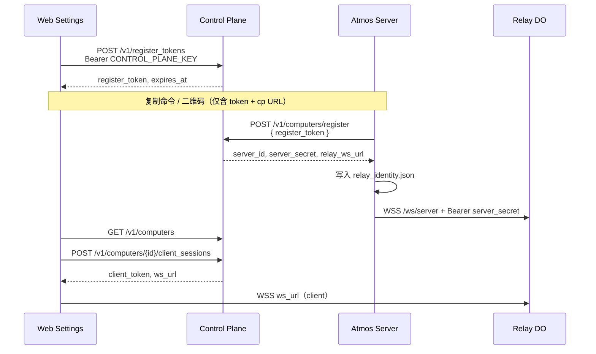

# TECH · APP-016：Atmos Computer

> **命名**：用户向功能名 **Atmos Computer**（`server_id`）；其上 `**apps/api` 进程**为 **Atmos Server**。下文 **Relay / DO / Control Plane** 为连接与控制面实现。
>
> 技术设计：**如何实现**。产品范围见 `PRD.md`。**本文不依赖 [APP-012](../APP-012_remote-access/TECH.md) remote-access。**

## 1. 架构总览

### 1.0 图示（Mermaid）

下列图为 **整体边界 + 关键流程** 的摘要；字段级契约仍以正文表格与各小节为准。

#### 逻辑组件与部署边界




#### Relay 模式连接拓扑（与 §1.2 ASCII 对照）




#### 本地 loopback vs Relay（双模式对照）

同一台 **Atmos Server** 可在 **无 Relay 凭据** 时走纯本地；配对并写入 `relay_identity.json` 后，浏览器经 **Worker/DO** 与 **仅出站** 的 Server 建业务 WS（与 §7.1、不变量一致）。




| 维度                        | 模式 A · 本地                                  | 模式 B · Relay                                             |
| ------------------------- | ------------------------------------------ | -------------------------------------------------------- |
| **WS 路径**                 | Client 直连 `ws://127.0.0.1:port/...`（或 LAN） | Client 仅连 `wss://…/ws/client?...`；**不**与 Server 公网 IP 建连 |
| `**relay_identity.json`** | 无或忽略；不启 relay 出站任务                         | 有；Server 向 DO 附着                                         |
| **典型场景**                  | 本机开发、Desktop 侧车、同一网段                       | Server 在 NAT/VPS、仅出站即可被 UI 访问                            |


#### 配对与注册（对照 §3）




#### 运行时信封路由（对照 §4）




#### ServerHub 状态机摘要（对照 §5）




### 1.1 逻辑组件


| 组件                 | 职责                                                                                          | 部署位置                            |
| ------------------ | ------------------------------------------------------------------------------------------- | ------------------------------- |
| **Atmos Computer** | 用户可选中的一台计算环境（产品对象）；由 `server_id` 标识；**一台 Computer 上运行一个 Atmos Server**                      | 用户本机 / **云端 VPS** / Desktop 侧车等 |
| **Atmos Server**   | 现有 `apps/api`：HTTP + WS、业务逻辑、终端、Canvas relay 等                                              | 驻留在某台 **Computer** 内            |
| **Control Plane**  | 账号、**Computer** 注册、配对码、访问令牌签发、**Computer** 元数据                                              | Cloudflare Worker + D1（或等价持久化）  |
| **Relay Hub（DO）**  | 每个 `server_id` 一个 DO 实例：维护 **1 条 Server 出站 WS** + **N 条 Client WS**；路由、限流、（M2+）事件缓冲与 replay | Cloudflare Durable Object       |
| **Client**         | `apps/web`、`apps/desktop`；可选「经 Relay 的 CLI」                                                 | 用户浏览器 / 本机应用                    |


### 1.2 连接拓扑

```
┌─────────────┐     出站 WSS      ┌──────────────────┐
│ Atmos Server│ ───────────────► │ DO(server_id)    │
│ (任意网络)  │ ◄─────────────── │ Relay Hub        │
└─────────────┘     下行帧      └────────▲───────────┘
                                         │
              WSS（客户端路径）           │
┌─────────────┐                          │
│ Web/Desktop │ ─────────────────────────┘
└─────────────┘
        │
        ▼
┌──────────────────┐
│ Worker (路由)     │  TLS 终止、鉴权、将 client 绑定到对应 DO
└──────────────────┘
```

**不变量**：

- Server **不向公网开放监听**即可加入 Relay（仅出站）。
- Client **永不直接**与 Server 建立 TCP（除非显式「仅本地」模式 loopback）。
- **业务 WS 帧**在理想设计中 **对 Relay 透明**（见 §4）。

### 1.3 与现有 Atmos 代码的边界


| 现有模块                      | Atmos Computer（本 spec）中的角色                                                                                                                                                                                                                          |
| ------------------------- | --------------------------------------------------------------------------------------------------------------------------------------------------------------------------------------------------------------------------------------------------- |
| `apps/api` WS 层           | **不变语义**：对「已认证的本地 client」的处理逻辑复用；新增「来自 Relay 的虚拟 client」注入点（见 §6）。                                                                                                                                                                                  |
| `apps/web` `useWebSocket` | **连接 URL 与握手参数**变化；消息编解码尽量不变。                                                                                                                                                                                                                       |
| `apps/desktop`            | 启动时 **`runtime-manager::supervisor::ensure_running`**（与 CLI / `npx @atmos/local-web-runtime` 共用同一 API 进程）；**不再**使用 Tauri sidecar + 每实例 `ATMOS_LOCAL_TOKEN`。退出 Desktop **不**终止共享 API。 |
| `apps/cli`                | CLI 为 **client**：`canvas` / `review` 等 **HTTP 能力**的 **API 基址 = 当前所选 Atmos Computer**（与 Web/Desktop 同源，见 §8）；`atmos runtime ensure|stop|status` 管理本机 API；`atmos local` 为兼容别名。**Review** 不得以 CLI 内 `infra::DbConnection` + `ReviewService` 为数据平面（见 §8.2）。 |
| `crates/runtime-manager`  | **本机 Runtime 库**：`runtime_manifest.json`（仅 host/port/ws_url，**无 token**）、`relay_identity.json`、控制面 `register_computer`；feature `supervisor` 供 CLI/Desktop 拉起 `~/.atmos/runtime/current` 或打包布局中的 `bin/api`。 |


### 1.4 统一本机 Runtime（M1 已实现）

**目标**：Desktop、CLI、`local-web-runtime` 安装物、日常 `cargo run -p api` **同一类产品**——一个本机 **Atmos Server**（`apps/api`），多种入口；避免长期维护两套 sidecar / 双 token 模型。

| 能力 | 落点 |
|------|------|
| 发现 | `~/.atmos/runtime_manifest.json`，由 API 在 bind 后写入（`source: "api"`）或 supervisor 在 `ensure` 后写入（`source: "runtime-manager"`） |
| 拉起/健康检查 | `runtime-manager` feature `supervisor`：`apps/cli`（`atmos runtime`）、`apps/desktop`（`runtime.rs`） |
| Relay 注册 | `register_computer` → `relay_identity.json`；`atmos computer register|start`、API `ATMOS_REGISTER_TOKEN` 一次性消费 |
| 本机 HTTP 鉴权 | **默认无 manifest token**；loopback 上 `require_local_token` 仅在设置 `ATMOS_LOCAL_TOKEN` 时生效（可选加固，非默认路径） |

**Desktop 打包布局**（`prepare-sidecar.sh` / `layout-runtime-bundle.sh`）：

```text
apps/desktop/src-tauri/binaries/runtime/current/
  bin/api, bin/atmos, web/, system-skills/
```

Tauri 资源映射为 `runtime/current`；开发机需先执行 `prepare-sidecar.sh`（见 `scripts/desktop/README.md`）。

---

## 2. 身份与配置模型

### 2.1 标识符


| 字段                  | 说明                                                                                |
| ------------------- | --------------------------------------------------------------------------------- |
| `server_id`         | UUID；全局唯一；**注册成功时**由 Control Plane 分配。 |
| `server_secret`     | 高熵密钥；**仅注册响应中出现一次**；持久化于 Server 本机 `~/.atmos/relay_identity.json`；用于 Relay 出站 WS（§3.3）。 |
| `register_token`    | 高熵、**单次**、短时效（§2.4）；仅用于 `POST /v1/computers/register`，**不得**长期存放在 Server。 |
| `client_token`      | 高熵、短时效；由控制面签发；浏览器/Desktop 连 Relay 时使用（§2.4、§3.3）。 |
| `client_session_id` | Relay 为每条 Client WS 分配；用于信封路由与审计。 |
| `tenant_id`         | 控制面租户键；**M1 实现**为 `sha256(user_access_token)`（用户在 Settings 创建 **Access Token**）。**M2+** 映射为 `user_id` / `workspace_id`（见 §2.4.6）。 |


### 2.2 本机文件（Computer / Server 侧）

**`~/.atmos/relay_identity.json`（注册成功后写入）**

```json
{
  "server_id": "uuid",
  "server_secret": "opaque-high-entropy",
  "relay_ws_url": "wss://relay.atmos.land/ws/server",
  "control_plane_url": "https://relay.atmos.land"
}
```

**`~/.atmos/runtime_manifest.json`**

- 描述 **本机监听** `host` / `port` / `url` / `ws_url`、可选 `pid`、`started_at`、`source`（**不含** auth token）。
- 当 **Web/Desktop/CLI 的当前上下文 = 运行于本机的该 Computer（其 Server）** 时，与本地工具共用，用于发现 **loopback API**；**不**作为「CLI 永远连本机」的全局规则，也**不**作为跨公网发现源。
- CLI 解析（`canvas` / `review` 等）：`--api-url` → `ATMOS_API_URL` → `~/.atmos/client-session.json`（**仅 relay**）→ `runtime_manifest.json`。

**`~/.atmos/client-session.json`（客户端写入；relay 时存在）**

- **本地模式**：文件**不存在**；CLI 以 `runtime_manifest.json` 为准。
- **Relay 模式**：Web/Desktop 写入 `{ version, server_id, api_base_url, gateway_token }`（HTTP gateway 基址 + `client_token`）。
- 与 `runtime_manifest.json` 分离：manifest = **本机 Server 监听事实**；client-session = **UI 当前选中的 Computer**（避免笔记本上 manifest 与 relay 目标冲突）。

### 2.3 Computer 列表缓存（Nice to Have · 未实现）

若 Desktop 需要离线展示最近连过的 Computer，可用明确命名如 `~/.atmos/computers-cache.json`（**禁止**使用 `contexts` 这种泛称）。权威列表仍以 Control Plane 为准；浏览器侧亦可继续用 `localStorage`（`atmos-computer` store）。

### 2.4 注册与连接（定稿架构 · 上线前）

> **范围**：仅解决 **Server 注册** + **Client 经 Relay 连接**。**不含** Atmos 用户登录、**不含** E2EE。  
> **不向后兼容**：废弃 8 位 `pair_codes`、`SHARED_CP_SECRET` 命名及公开短码 `register`。实现落点：`packages/relay`、`apps/api`、`apps/web`。

#### 2.4.1 设计原则

| 原则 | 说明 |
|------|------|
| **职责分离** | **控制面密钥**只存在于「能管理 fleet 的客户端」（Web Settings、运维脚本）；**Server 永不长期持有**控制面密钥。 |
| **注册凭证一次性** | Server 只用 **`register_token`**（高熵、单次、短 TTL）完成注册；不用 8 位码、不把控制面密钥写入 VPS。 |
| **连接凭证短期** | Client 用 **`client_token`**（高熵、短 TTL）连 Relay；与 `server_secret` 生命周期分离。 |
| **云端目录** | D1 维护 **`computers`** 表 = 权威 Computer 列表（产品对象）；Client **不**靠记 IP。 |
| **数据面最小暴露** | `POST /v1/computers/register` 可公网可达，但 **无有效 register_token 则无法注册**；对 register 做 **IP 限速**。 |

#### 2.4.2 凭据一览

| 凭据 | 谁持有 | 用途 | 寿命 |
|------|--------|------|------|
| **Access Token**（Bearer） | 用户在 Web Settings 创建；`tenant_id = sha256(token)` | 签发 `register_token`、列 Computer、吊销、`client_session` | 用户可轮换/吊销 |
| **`CONTROL_PLANE_KEY`**（已废弃） | — | 原单租户运维密钥模型 | 由 Access Token 替代 |
| **`register_token`** | 一次性交给 VPS（env/CLI） | 仅 `POST /v1/computers/register` | 建议 **15 分钟**、**单次** |
| **`server_secret`** | 仅该 Server 本机 `relay_identity.json` | Relay 出站 `GET /ws/server` | 长期；可随吊销失效 |
| **`client_token`** | 浏览器/Desktop 内存 | Relay `GET /ws/client` | 建议 **24h** 或可配置更短 |

`tenant_id`：上线前 = `sha256(CONTROL_PLANE_KEY)` 的定长十六进制（单部署单租户）。同一密钥下的 Computer / token 同属一个 `tenant_id`。

#### 2.4.3 端到端流程



**本机 loopback 模式**：不经过上述流程；`connectionMode=local` + `runtime_manifest.json`（与 Relay 正交）。

#### 2.4.4 控制面 REST（定稿）

基址：`https://relay.atmos.land`（生产）。所有 JSON；CORS 按现有 Worker。

| 方法 | 路径 | 鉴权 | 请求体 | 响应（要点） |
|------|------|------|--------|----------------|
| `POST` | `/v1/register_tokens` | Bearer **`CONTROL_PLANE_KEY`** | `{}` 或 `{ "display_name_hint": "..." }` | `{ "register_token", "expires_at", "register_command" }` |
| `POST` | `/v1/computers/register` | **无**（凭 token） | `{ "register_token", "display_name"?: string }` | `{ "server_id", "server_secret", "relay_ws_url", "control_plane_url", "display_name" }` |
| `GET` | `/v1/computers` | Bearer CP key | — | `{ "computers": [{ server_id, display_name, revoked, created_at, online? }] }` |
| `POST` | `/v1/computers/{server_id}/revoke` | Bearer CP key | `{}` | `{ "ok": true }`；Relay 断开该 hub |
| `POST` | `/v1/computers/{server_id}/client_sessions` | Bearer CP key | `{ "client_kind"?: "web" \| "desktop" \| "cli" }` | `{ "client_token", "expires_at", "ws_url" }` |

`register_command` 示例（供 UI 展示）：

```bash
atmos computer register \
  --control-plane https://relay.atmos.land \
  --token <register_token>
```

或一次性环境变量：`ATMOS_REGISTER_TOKEN=<register_token>`（`apps/api` 启动时消费后 **清除/忽略** 环境变量，避免残留）。

**错误码（统一形状）**：`{ "error": "snake_case_code" }` — 如 `unauthorized`、`invalid_register_token`、`register_token_expired`、`computer_revoked`、`rate_limited`。

#### 2.4.5 Relay WebSocket（定稿）

| 角色 | URL | 鉴权 |
|------|-----|------|
| **Server 出站** | `wss://relay.atmos.land/ws/server?server_id=<uuid>` | `Authorization: Bearer <server_secret>`（禁止 query 传 secret） |
| **Client** | `wss://relay.atmos.land/ws/client?server_id=<uuid>&token=<client_token>&client_type=web` | query `token`；CP 已校验 token 与 `server_id` 绑定 |

Server 连接成功后，DO 登记 `active_server_transport`；Client 连接绑定 `client_session_id`；业务帧仍走 §4 信封。

`online`（列表可选字段）：Control Plane 可查询 DO 或由 Server 心跳更新 `last_seen_at`（实现二选一，M1 可仅 `last_seen_at` 来自 relay 连接事件写 D1）。

#### 2.4.6 D1  schema（定稿，替代 `pair_codes`）

```sql
CREATE TABLE register_tokens (
  token_hash TEXT PRIMARY KEY,
  tenant_id TEXT NOT NULL,
  expires_at INTEGER NOT NULL,
  used_at INTEGER,
  created_at INTEGER NOT NULL
);

CREATE TABLE computers (
  server_id TEXT PRIMARY KEY,
  tenant_id TEXT NOT NULL,
  secret_hash TEXT NOT NULL,
  revoked INTEGER NOT NULL DEFAULT 0,
  display_name TEXT,
  created_at INTEGER NOT NULL,
  last_seen_at INTEGER
);

CREATE TABLE client_sessions (
  token_hash TEXT PRIMARY KEY,
  server_id TEXT NOT NULL,
  tenant_id TEXT NOT NULL,
  expires_at INTEGER NOT NULL,
  created_at INTEGER NOT NULL
);

CREATE INDEX idx_computers_tenant ON computers(tenant_id);
CREATE INDEX idx_client_sessions_server ON client_sessions(server_id);
```

- 表中 **只存 hash**：`token_hash = sha256(token)`，`secret_hash = sha256(server_secret)`。
- **废弃**：`pair_codes`、`owner_tag`、`SHARED_CP_SECRET` 字段名。

#### 2.4.7 与 Paseo 的定位（简）

| | **本方案** | **Paseo** |
|---|-----------|-----------|
| 云端列表 | **有**（`GET /v1/computers`） | 无；客户端自维护连接 |
| 注册信任 | **一次性 register_token**（高熵） | QR / link 内公钥（E2EE 信任锚） |
| Server 上长期密钥 | 仅 **`server_secret`** | daemon 密钥对 + relay session |
| 多机 | 每台 Server 各注册一次；Web 统一列表 | 每台 daemon 各添加一条连接 |

#### 2.4.8 实现落点（仓库）

| 组件 | 变更 |
|------|------|
| `packages/relay` | 新 REST + D1 迁移；删除 `pair_codes` / `client_ws_token` 旧路径；Wrangler secret 改名为 **`CONTROL_PLANE_KEY`** |
| `apps/api` | 读 `relay_identity.json`；启动时可选消费 `ATMOS_REGISTER_TOKEN`；`relay/ingest` 用 `server_secret` 连 `/ws/server` |
| `apps/web` | Settings：**Add computer** → `register_tokens` → 展示命令；选 Computer → `client_sessions` → `useWebSocket` 用返回的 `ws_url` |
| `apps/cli`（可选 M1） | `atmos computer register --token` |

#### 2.4.9 明确不做（本阶段）

- Atmos 用户登录 / JWT 替换 CP key（**M2+**）。
- E2EE / QR 内嵌公钥（**M5**）。
- 8 位配对码、`POST /v1/pair_codes`、Server 长期保存 `CONTROL_PLANE_KEY`。
- Client 通过 VPS IP 连接 Relay（仅 **local loopback** 或 **Relay** 二选一）。

#### 2.4.10 后续扩展（仅占位）

| 阶段 | 变更 |
|------|------|
| **M2 用户登录** | Bearer 改为 Atmos JWT；`tenant_id := sub`（用户或 workspace） |
| **M5 E2EE** | 在 §4 信封之上增加加密层；与注册/连接凭据正交 |

---

## 3. 控制面（Control Plane）协议（逻辑）

> **权威定义见 §2.4.4**（路径、鉴权、请求/响应）。本节仅保留与数据面衔接的要点。

### 3.1 安全要求（注册与凭据）

- **`register_token`**：≥ 32 字节随机（建议 base64url 43 字符）；TTL **15 分钟**；**原子** `used_at` 写入；D1 只存 `token_hash`。
- **`server_secret` / `client_token`**：≥ 32 字节随机；`server_secret` **仅**注册响应明文一次；DB 只存 hash。
- **`POST /v1/computers/register`**：按 IP **限速**（如 30 次/分钟）；连续失败可临时封禁。
- **`CONTROL_PLANE_KEY`**：仅 Wrangler secret + 可信管理端；**禁止**写入公开前端构建产物（Web 可继续「运维粘贴」模式直至 M2 服务端代理）。

### 3.2 Server → Relay 认证（出站）

**M1 定稿**：首次及后续重连均使用

- URL：`wss://<relay-host>/ws/server?server_id=<server_id>`
- Header：`Authorization: Bearer <server_secret>`
- Worker/DO：查 D1 `computers.secret_hash` 与 `revoked=0`；失败则 `401` 关闭 WS。

可选 **M2+**：升级为 challenge-response（非本阶段）。

---

## 4. Relay 数据面：信封（Envelope）规范

### 4.1 设计原则

1. **Relay 不解析 Atmos 业务 JSON** 的内部字段（如 `canvas_agent_dispatch` 的 payload 结构）。
2. Relay 只处理 **信封** + **长度/配额/连接状态**。
3. 业务层仍可使用现有 **request_id** 做关联；信封层可再带 **relay_seq** 用于 replay（M2）。

### 4.2 信封字段（建议最小集）


| 字段           | 类型                 | 说明                                                          |
| ------------ | ------------------ | ----------------------------------------------------------- |
| `v`          | `uint`             | 信封协议版本；M1 固定 `1`。                                           |
| `stream`     | `string`           | 逻辑子流：`app`（主应用 WS）/ `diag`（可选）；M1 可仅 `app`。                 |
| `kind`       | `string`           | `frame` | `ctrl`；`ctrl` 用于 ping/pong、订阅确认。                  |
| `from`       | `string`           | `server` | `client:<session_id>`。                           |
| `to`         | `string`           | `server` | `client:<session_id>` | `broadcast_clients`（慎用）。 |
| `request_id` | `string?`          | 透传业务关联；Relay 不解释。                                           |
| `relay_seq`  | `uint64?`          | M2+ 单调递增，用于 replay 游标。                                      |
| `body`       | `bytes` | `string` | **透明载荷**：即现有 WS 文本帧或二进制帧内容（实现二选一并在网关固定）。                    |


### 4.3 路由规则（DO 内）

1. **Client → Server**：`to == "server"` 时，若 Server 已连接，写入 Server 出站队列；否则进入 **短时缓冲**（仅 M2+ 明确容量与 TTL）或返回 `ctrl` 错误帧。
2. **Server → Client**：`to` 指定 `client:<session_id>` 单播；或 `broadcast_clients` 多播（例如全局通知，需白名单事件类型）。
3. **Server 未连接**：Client 侧收到 `ctrl`：`server_offline`；UI 展示可恢复状态。

---

## 5. Durable Object：`ServerHub` 状态机（逻辑）

### 5.1 状态


| 状态               | 含义                           |
| ---------------- | ---------------------------- |
| `EMPTY`          | 无 Server、无 Client；可休眠或延迟创建。  |
| `SERVER_PENDING` | 有 Client 无 Server；可缓冲或拒绝业务帧。 |
| `READY`          | Server 已连接；可双向路由。            |
| `DEGRADED`       | Server 刚断；按策略缓冲或快速失败。        |


### 5.2 存储（DO Storage）


| 键                | 用途                                               |
| ---------------- | ------------------------------------------------ |
| `last_relay_seq` | 单调递增；replay 游标基准。                                |
| `ring`           | 可选：最近 N 条 **信封+body** 或仅 **信封+body hash**（合规驱动）。 |
| `clients`        | `session_id → WebSocket` 映射。                     |
| `server_ws`      | 单条 Server 连接引用。                                  |


### 5.3 Replay（M2）

- Client 重连握手携带 `last_seen_relay_seq`。
- DO 从 `ring` 中 **顺序重放** `relay_seq > last_seen_relay_seq` 的条目。
- **与业务 request/response 的交互**：若业务层已有 `request_id`，replay 仅 **重放下行事件**；重复上行需业务幂等（Canvas/终端模块各自约定，可引用现有 idempotency）。

---

## 6. Atmos Server 集成方式

### 6.1 出站客户端模块（建议新 crate 或 `apps/api` 子模块）

职责：

1. 读取 `relay_identity.json`；无则跳过（纯本地模式）。
2. 向 Control Plane 刷新令牌（若采用 JWT）。
3. 维护与 Relay 的 **单连接**（每 Server 进程一条）；自动重连带指数退避。
4. 从 Relay 收到的 `body` **写入** 现有 `WsMessageService` 的「虚拟连接」入口，等价于本地 TCP client 的第一条消息之后的行为。

### 6.2 与现有 `ConnectInfo` / 鉴权中间件的关系

- **本地 loopback**：`require_local_token` **仅当** 配置了 `ATMOS_LOCAL_TOKEN`（或等价）时强制；统一 runtime 默认 **不设** manifest token，与 Desktop/CLI 零配置发现一致。
- **Relay 注入路径**：需新增 **可信内部路径**（例如仅接受来自本机 `relay_ingest` 任务队列的帧），**禁止**未经鉴权的外网直连接替。

### 6.3 与 Canvas Agent Relay 的关系

- `CanvasAgentRelay` 仍以 **同一 Server 进程内** 的 `conn_id` 为键。
- 经 Relay 的 Web client 与经本地 WS 的 client **在 Server 侧汇聚为同类连接**（需统一 `conn_id` 生成与生命周期）。

---

## 7. 客户端（Web / Desktop）改动要点

### 7.1 连接 URL

- **本地模式**：`ws://127.0.0.1:<port>/...`（现有）。
- **Relay 模式**：`wss://relay.../v1/client?server_id=...&token=...`（token 可为短期，见 Control Plane）。

### 7.2 UI

- **Server 选择器**：**Computer** 列表来自 Control Plane；当前选中项写入本地偏好。
- **配对入口**：展示配对码或二维码（内容由 Control Plane 返回）。

### 7.3 Web 开发环境

- Next 继续可代理 `runtime_manifest` 用于 **本地 API 端口**；Relay 模式下 **以 Control Plane 返回的 `relay_ws_url` 为准**。

---

## 8. CLI 行为（规范）

**锚点**：CLI 的 **业务 HTTP 基址**与 Web/Desktop 一致，绑定 **用户当前所选 Atmos Computer**（`server_id` / 上下文），**不是**「跑在哪台笔记本上」或「是否 SSH 在 VPS 上」的隐含本机。


| 上下文                                                                               | 默认行为（API 基址）                                                                                                                                                                                   |
| --------------------------------------------------------------------------------- | ---------------------------------------------------------------------------------------------------------------------------------------------------------------------------------------------- |
| **当前所选 Computer = 本机进程**（常见：日常开发、SSH 到某台 **Computer**（VPS）且 UI 也指向该 **Computer**） | 可读 `runtime_manifest.json` 等得到 **该 Computer 上 Server 的** `http://127.0.0.1:<port>` 或等价 loopback；**零 `ATMOS_API_URL`** 的前提是「上下文已指向这台机器上的 **Computer**」，而非「CLI 进程所在机器一定是 API 宿主」。 |
| **当前所选 Computer = 远程**（笔记本终端 + UI 已切到云端）                                          | 使用上下文中的 **远程 API 基址**；M1 可允许 `**ATMOS_API_URL` / `--api-url` 显式覆盖** 作为过渡；M2+ 目标为 **Relay HTTP gateway**、`atmos context use <server_id>` 等写入共享上下文，使 CLI 与 UI **免手抄 URL**（与 §9 里程碑一致）。           |


M1 **不强制**实现「笔记本 CLI 不经显式 URL 即连远端 **Computer**」，但 **不得**再产品化「CLI 永远默认 127.0.0.1 而可与 UI 所选 **Computer** 脱钩」。

### 8.1 单一事实来源（API anchor）

- **原则**：凡涉及 **与 UI 同一份业务状态** 的 CLI 能力（含 `**atmos review`**），**一律经 `apps/api`** 发起请求；CLI 是 **client**，不承载第二套持久化入口。
- **与仓库传输偏好一致**：Review 以 **HTTP（REST 或 RPC 形状）** 暴露为宜（与现有「bootstrap / 一次性操作用 REST」例外一致）；若后续某条 review 流必须流式，再在 **已连上当前 Computer 上 Server 的 WS** 上扩展消息，而不是让 CLI 直连 DB。
- **鉴权**：与 Web/Desktop 调用同一 API 的凭证模型（如 Bearer / session cookie 的 CLI 等价物）；loopback 下默认 **无** manifest token；可选 `ATMOS_LOCAL_TOKEN` 加固。数据 **仍由 API 读写**，而非 CLI 打开 `~/.atmos/db/atmos.db`。

### 8.2 `atmos review` 重构要点（相对现状）


| 项    | 现状（待废弃）                                                 | 目标                                                                                                  |
| ---- | ------------------------------------------------------- | --------------------------------------------------------------------------------------------------- |
| 数据平面 | CLI `main` 内 `DbConnection::new()` + `ReviewService`    | 解析 **当前所选 Atmos Computer 的 API base URL**（与 `canvas` **同源**的解析链），HTTP 调用 `apps/api` 上 **Review 契约** |
| 事实来源 | 本机 `~/.atmos/db/atmos.db` 与 Server 上 API 使用的库 **可能不一致** | **仅** Server 进程内的 DB（由 API 迁移与服务层访问）                                                                |
| 实现落点 | `apps/cli` 依赖 `core-service` + `infra` 做 review         | `apps/cli` **薄客户端**（HTTP + 序列化）；路由与 DTO 与 `apps/api` 对齐；缺失端点则在 `**apps/api` 增补**                    |


**开放项（实现前定稿）**：具体路径/DTO 是 **新增 `/v1/review/...` 资源树** 还是合并进既有模块；是否与 Desktop/Web 共享同一 Rust/TS client crate 由实现选择，但 **契约唯一源为 `apps/api`**。

### 8.3 例外（仍允许本机、不经业务 API）

- `**atmos runtime**` / `**atmos local**`（别名）：管理本机 API 进程与 `runtime_manifest.json` / 安装物，属于 **宿主运维**，不要求走 review/canvas 类业务 API。
- `**atmos computer**`：在 **Computer** 上注册 Relay 身份并 `ensure` 本机 API（VPS 或本机）。
- **CLI 自检/更新**：如 `atmos update` 访问 GitHub 等，与 Atmos Server 数据平面无关。

---

## 9. 分阶段落地（Rollout）


| 阶段     | 交付物                                                                                                                                                                                                 |
| ------ | --------------------------------------------------------------------------------------------------------------------------------------------------------------------------------------------------- |
| **M1** | 控制面 **register_token + client_session** 流程（§2.4）；Relay Worker + `ServerHub` DO；Server 出站；Web 完成列表/注册/建连；`**atmos review` 经 API（§8.2）**（可与本项并行，PRD **M1-7**）。 |
| **M2** | DO `ring` + `relay_seq` + replay；离线 Computer 策略；**用户登录**替换 `CONTROL_PLANE_KEY`（§2.4.10）。 |
| **M3** | 多 Client 广播语义、Canvas/终端事件分类白名单。                                                                                                                                                                     |
| **M4** | 云端拉起 **VPS/虚拟机** 与控制面对接；镜像内预置 `relay_identity.json` 或启动时 pair。                                                                                                                                      |
| **M5** | 组织权限、审计、配额、E2EE 可选模块。                                                                                                                                                                               |


---

## 10. 非功能需求


| 类别       | 要求                                                 |
| -------- | -------------------------------------------------- |
| **延迟**   | Relay 增加一跳；目标 **P95 额外 RTT < 50ms**（同区域部署下，内测可调整）。 |
| **可用性**  | Relay 故障时，客户端降级提示；**本机 Server 仍可 loopback**。       |
| **可观测性** | DO 暴露聚合指标：连接数、帧率、丢弃数、replay 命中率。                   |


---

## 11. 安全清单（摘要）

- TLS 全链路；HSTS（Worker 侧）。
- **控制面**：轮换 `CONTROL_PLANE_KEY`、禁止入库；`register_token` / `client_token` 单次或短 TTL；`register` 端点 IP 限速（§2.4）。
- 速率限制：每 `tenant_id` / 每 `server_id` / 每 IP。
- 日志：**默认不记录 body**；如需调试，脱敏 + 采样。
- **隐私**：M1 Relay 载荷对边缘 **技术上可读**；产品承诺为不解析业务 JSON + 不落库 body；E2EE 见 M5（§2.4.3）。

---

## 12. 开放实现项（实现前闭环）

1. `body` 使用 **文本**（与现有 WS JSON 一致）还是 **二进制**（CBOR）；网关统一。
2. Control Plane 与 Relay **是否共享密钥**验证 Server（HMAC vs JWT）。
3. Desktop 与 Web **谁先交付 M1**（PRD 已要求至少一端）。
4. **M2 控制面**：Atmos JWT 签发方、与现有 Web/Desktop 会话的集成点（§2.4.4）。

---

*本文档随实现迭代；与 PRD 冲突时以 PRD 为准并回写本文。*