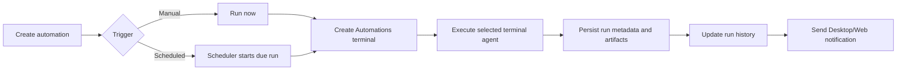

# PRD · APP-017: Atmos Automations

> Product Requirements · WHAT and WHY. Settled direction for local-per-Computer scheduled automation runs powered by Atmos terminal agents.

## Context

- **Problem**: Atmos users can run agent CLIs inside project and workspace terminals, but they cannot schedule repeatable agent work, inspect durable run results, or manage recurring tasks as first-class objects.
- **Why now**: Atmos already has persistent terminals, project/workspace context, local SQLite state, local file storage under `~/.atmos/`, and a multi-Computer connection model. Automations can build on those primitives without adding a hosted scheduler.
- **Product direction**: An automation belongs to the currently connected Atmos Computer. If the user is connected to a remote VPS Computer, creating an automation creates it on that remote Computer.
- **Related specs**: [APP-004 Local Agent Integration](../APP-004_local-agent-integration-acp/TECH.md), [APP-016 Atmos Computer](../APP-016_atmos-computer/TECH.md).

## Goals

1. **Primary**: Let users create scheduled or manually triggered terminal-agent tasks that run on the currently connected Atmos Computer.
2. **Primary**: Make every automation run inspectable after the fact through local run history, terminal evidence, and file-based artifacts.
3. **Secondary**: Let users choose the right execution context: Project, existing Workspace, new Workspace per run, or a standalone automation run directory.
4. **Secondary**: Notify users when automation runs complete, fail, or need attention.

### Automation creation -> run lifecycle

The product flow keeps setup, execution, persistence, and notification visible as separate user-facing steps.



## Users & Scenarios

- **Primary persona**: Agentic Builder who repeatedly asks terminal agents to check, maintain, summarize, or repair a project.
- **Secondary persona**: Remote Computer operator who connects Atmos to a VPS/workstation and wants unattended work to run in that environment.

### Key scenarios

1. A user creates a daily project automation that asks a selected terminal agent to summarize repo health and writes the result into a local run folder.
2. A user targets an existing Workspace so a recurring task runs in the same worktree and leaves a clear output file for review.
3. A user configures an automation to create a new Workspace on every run, so code-changing work is isolated and visible as automation-created.
4. A user creates an automation with no Project or Workspace selected, so the task runs from a standalone `~/.atmos/automations/runs/...` directory.
5. A user connected to a remote Atmos Computer creates an automation and expects the metadata, artifacts, terminal run, and notifications to belong to that remote Computer.

## User Stories

- As an Atmos user, I want to define an automation with a name, instructions, agent, trigger, and run environment, so that recurring agent work can happen without retyping the same prompt.
- As a project owner, I want scheduled automations to run inside my chosen Project or Workspace, so that the agent has the right files and git context.
- As a user running code-changing tasks, I want the option to create a new Workspace for every run, so that automated changes are isolated and easy to review.
- As a user, I want each run's prompt, output log, final result, and run metadata saved locally, so that I can audit what happened later.
- As a user, I want unsupported agents to be unavailable for automations with a clear reason, so that scheduled tasks only use agents that can run non-interactively.
- As a remote Computer user, I want automations to be created on the connected Computer, so that remote VPS automations do not require a separate product flow.
- As a user, I want Desktop/Web and optional push notifications for run outcomes, so that I know when unattended work finishes or fails.

## Functional Requirements

### Must Have

- **M1 · Management entry**: Users can open an **Automations** destination from Management Center.
- **M2 · Creation flow**: Users can create an automation from a setup UI that follows the existing full-screen composer-style setup pattern, with automation-specific title/copy and a required display-name field.
- **M3 · Instructions composer**: Users can enter **Agent Instructions** in the same rich prompt-composer style used by the existing setup flow.
- **M4 · Agent selection**: Users can select from available terminal agents that support non-interactive execution. Agents without verified non-interactive support are unavailable and show explanatory copy.
- **M5 · Trigger configuration**: Users can configure a manual run and one scheduled trigger. Scheduled presets include hourly, daily, weekly, and monthly, with preset-specific time inputs. Users can also enter a custom cron expression.
- **M6 · Local-per-Computer ownership**: Automation definitions, run state, and artifacts belong to the currently connected Atmos Computer. No hosted scheduler or cross-Computer automation sync is required for v1.
- **M7 · Metadata persistence**: Automation metadata and run status are persisted in that Computer's local SQLite database.
- **M8 · Artifact persistence**: Prompt, combined terminal output log, final/model output, and run metadata are stored as local files under `~/.atmos/`. Runs without a Project/Workspace use `~/.atmos/automations/runs/{date-time}/{automation-id}/` as their working artifact directory.
- **M9 · Terminal execution**: Each run creates a terminal tab named **Automations** and launches the selected terminal agent in non-interactive mode. Project/Workspace runs use that context; no-target runs use the standalone run directory.
- **M10 · File-based result**: Each run writes the agent's final/model output to a file that users can open from the run detail view.
- **M11 · Run environments**: Users can choose one of four environments: Project, existing Workspace, new Workspace per run, or no Project/Workspace.

  **Trigger / scope decision flow**

  ```mermaid
  flowchart TD
    A["Configure trigger"] --> B{"Manual or scheduled?"}
    B -->|"Manual"| C["No saved schedule"]
    B -->|"Scheduled"| D{"Preset or cron?"}
    D -->|"Hourly / daily / weekly / monthly"| E["Use preset time inputs"]
    D -->|"Cron"| F["Use five-field cron expression"]
    C --> G{"Run environment"}
    E --> G
    F --> G
    G -->|"Project"| H["Run in project path"]
    G -->|"Existing Workspace"| I["Run in selected workspace"]
    G -->|"New Workspace per run"| J["Create automation-labeled workspace"]
    G -->|"No Project"| K["Run in standalone ~/.atmos path"]
  ```

- **M12 · Automation-created workspaces**: When an automation creates a Workspace, the Workspace is marked with `create_source = "automation"`, displays an automation icon label in workspace surfaces, and uses the automation display name as the default Workspace display name.
- **M13 · Run history**: Users can see automation definitions, latest status, next scheduled run, historical runs, and per-run outcome states: running, completed, failed, cancelled, or interrupted.

  **Run outcome state transitions**

  ```mermaid
  stateDiagram-v2
    [*] --> running: terminal window created
    running --> completed: agent exits successfully
    running --> failed: startup or agent failure
    running --> cancelled: user cancels active run
    running --> interrupted: terminal/window disappears
    completed --> [*]
    failed --> [*]
    cancelled --> [*]
    interrupted --> [*]
  ```

- **M14 · Run controls**: Users can run an automation now, pause/resume its schedule, and cancel an active run when cancellation is still possible.
- **M15 · Notifications**: Desktop/Web notifications are sent for completed, failed, cancelled, and interrupted runs. A push-server setting controls whether automation outcomes also send push notifications.
- **M16 · Remote Computer behavior**: When the UI is connected to a remote Atmos Computer, creating and managing automations affects that remote Computer's local DB, terminal sessions, and `~/.atmos/` artifact files.

### Nice to Have

- **N1 · Templates**: Starter automations for repo health summary, CI triage, dependency update scouting, stale branch cleanup, changelog draft, and workspace health checks.
- **N2 · Webhook/event triggers**: Event-triggered runs from external systems after scheduled/manual runs are stable.
- **N3 · Artifact retention controls**: User-configurable cleanup for old run directories and logs.
- **N4 · Prompt test mode**: A one-off test run or dry run before saving a schedule.
- **N5 · Rich custom-agent controls**: Add automation-specific controls for user-defined terminal agents beyond the existing terminal-agent command/flag settings.

## Out of Scope

- **Hosted automation scheduler** — v1 runs on the selected Atmos Computer; no cloud scheduler/control-plane dispatch is required.
- **Cross-Computer synchronization** — automations do not automatically copy between local and remote Computers.
- **Team-owned service identity** — v1 uses the user's local Computer environment and configured agent credentials.
- **Full integration platform** — Slack, Linear, Sentry, PagerDuty, and similar event/action integrations are future scope.
- **Mobile automation management** — v1 targets Desktop/Web usage.
- **Guaranteed wake-from-sleep execution** — v1 does not wake the Computer and does not backfill missed schedule ticks from while the Atmos Server was offline/asleep.

## Success Metrics

- **Leading**: Users create at least one automation from Management Center and successfully complete a manual run.
- **Leading**: Scheduled automations produce durable result files that users open from run history.
- **Leading**: Automation-created Workspaces are distinguishable in workspace surfaces and can be reviewed without confusion.
- **Lagging**: Users keep recurring automations enabled across multiple days instead of deleting them after the first run.
- **Qualitative**: Users describe Automations as a reliable way to "have Atmos check this for me later" rather than as a hidden background process.

## Risks & Open Questions

- **Risk**: Non-interactive agent behavior varies by CLI, so unsupported or partially supported agents may create inconsistent user expectations.
- **Risk**: Scheduled runs execute terminal agents in non-interactive auto-accept mode, so target context, run history, and result review must be explicit.
- **Risk**: New Workspace per run can create clutter unless labeling, history, and cleanup are clear.
- **Risk**: Users may expect cloud-style execution while the owning Computer is offline; v1 must communicate local-per-Computer ownership clearly.

## Milestones

- **Phase 1 · Local scheduled runs**: Management Center entry, creation flow, agent filtering, manual/scheduled triggers, local metadata, local artifacts, terminal execution, run history, and Desktop/Web notifications.
- **Phase 2 · Workspace isolation**: New Workspace per run, automation-created workspace labeling, stronger run review, and cleanup/retention controls.
- **Phase 3 · Expanded triggers and templates**: Webhook/event triggers, starter templates, richer custom-agent automation controls, and richer notification routing.
