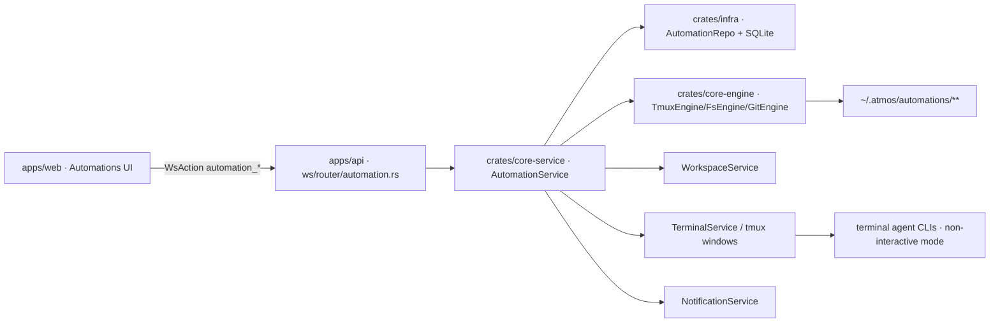

# TECH · APP-017: Atmos Automations

> Technical Design · HOW. Implements PRD APP-017: Atmos Automations.

## Scope summary

APP-017 adds local-per-Computer automations that schedule or manually run terminal-agent CLI tasks from Atmos. The first version is implemented inside the current Atmos Server on the currently connected Computer, stores durable metadata in local SQLite, stores prompt/output/log artifacts under `~/.atmos/`, executes through tmux-backed terminal tabs named **Automations**, and exposes management through WebSocket-first Desktop/Web UI. This design addresses PRD M1-M16. Templates, webhook/event triggers, retention cleanup, prompt dry-run mode, richer custom-agent automation controls, and long-lived automation memory remain deferred.

## Architecture overview



Touched areas:

- `crates/infra`: automation tables, SeaORM entities, repositories.
- `crates/core-engine`: small tmux helper additions for automation window creation, interrupt, and command injection.
- `crates/core-service`: `AutomationService`, scheduler, runner, automation agent resolver, artifact helpers, notification integration.
- `apps/api`: WebSocket actions/events, router module, AppState wiring, scheduler startup.
- `apps/web`: Management Center item, Automations page, setup composer, run history/detail, WS API types/store, workspace source labels.
- `packages/ui`: no new primitive required for M1; use existing controls and lucide icons from app code.

External/runtime dependencies:

- Local `tmux` for terminal-backed execution, already required by the terminal subsystem.
- Installed terminal-agent binaries. Built-in command defaults come from the same shared terminal agent definitions used by the existing Agent Select UI; user overrides/custom agents come from `~/.atmos/agent/terminal_code_agent.json`.
- Local SQLite through existing `infra::DbConnection`.
- Optional push servers configured by existing notification settings.

## Product decisions resolved in TECH

| PRD fork | Decision |
|----------|----------|
| Missed scheduled runs | Do not catch up missed ticks. If Atmos Server was not running or the Computer was asleep/offline, no run row exists. On startup, compute the next future `next_run_at` and continue from there. |
| Concurrency | Different automations do not block each other, even when they target the same Project or Workspace. Only the same automation is prevented from re-entering while one of its runs is still active. |
| Terminal tab policy | Each run creates its own terminal window named **Automations**. Runs are tracked by tmux session + window index, so concurrent runs do not rely on unique visible tab names. |
| Memory layout | No separate memory file in M1. The automation definition stores only `instructions.md`; recurring context should be written by the user into those instructions. Long-lived editable memory can be added later if product usage proves it is needed. |
| Required run artifacts | M1 writes only `prompt.md`, `output.log`, `final.md`, and `run.json`. `run.json` is also the runner sentinel/status file. |
| Execution permissions | No separate permission mode. Automation runs the selected terminal agent with its configured non-interactive auto-accept/yolo flags so scheduled work is not blocked by permission prompts. |

## PRD coverage map

| Requirement | Technical coverage |
|-------------|--------------------|
| M1 | `apps/web/src/app-shell/LeftSidebarManagementCenter.tsx` adds Automations route. |
| M2 | `apps/web/src/features/automations/components/AutomationSetup.tsx` reuses the welcome composer layout with display-name input. |
| M3 | Setup uses `PromptComposer` from `apps/web/src/features/welcome/components/PromptComposer.tsx`. |
| M4 | Backend automation agent resolver reuses shared terminal agent definitions plus user terminal-agent settings, then returns only installed + non-interactive-capable agents as selectable. |
| M5 | `AutomationSchedule` model supports manual run plus hourly/daily/weekly/monthly/custom cron scheduled trigger. |
| M6 | Scheduler and data live in the connected Atmos Server process; no hosted scheduler or cross-Computer sync. |
| M7 | `automation` and `automation_run` SQLite tables persist definitions and run status. |
| M8 | Artifact helper writes prompt, output log, final result, and run metadata under `~/.atmos/automations/`. |
| M9 | Runner creates a per-run **Automations** terminal window and runs a non-interactive agent command in the chosen cwd. |
| M10 | `final.md` is required and linked from run detail. |
| M11 | `target_kind` covers `project`, `workspace`, `new_workspace`, and `standalone`. |
| M12 | Workspace creation path passes `create_source = "automation"` and frontend displays the automation label. |
| M13 | WS list/detail APIs expose definitions, latest status, next run, and historical runs with `running`, `completed`, `failed`, `cancelled`, or `interrupted` outcomes. |
| M14 | WS run controls map to service methods: run now, pause, resume, cancel. |
| M15 | `NotificationService` gets automation outcome settings and emits local and optional push notifications. |
| M16 | Relay/local connection choice is transparent; actions execute on whichever Atmos Server the UI is connected to. |

## Module-by-module design

### crates/infra

Add migration:

- `crates/infra/src/db/migration/m20260526_000026_create_automation_tables.rs`
- Register it in `crates/infra/src/db/migration/mod.rs` after `m20260514_000025_add_project_logo_path`.

Add entities:

- `crates/infra/src/db/entities/automation.rs`
- `crates/infra/src/db/entities/automation_run.rs`

Add repository:

- `crates/infra/src/db/repo/automation_repo.rs`

Repository responsibilities stay data-only:

- CRUD automation definitions.
- Persist run rows and status transitions.
- Atomically claim due scheduled automations.
- Query list/detail/run history pages.
- Query active `running` runs during startup recovery.

No WebSocket or scheduler logic belongs in `infra`.

### crates/core-engine

Reuse:

- `crates/core-engine/src/tmux/session.rs` for tmux sessions/windows.
- `crates/core-engine/src/tmux/mod.rs` `send_keys`, `capture_pane`, `kill_window`, window lookup helpers.
- `crates/core-engine/src/fs` helpers for directory creation and file writes where useful.
- `crates/core-engine/src/git` for resolving project/workspace paths through existing service APIs.

Add only small tmux capabilities if missing:

```rust
impl TmuxEngine {
    pub fn ensure_window_named(
        &self,
        session_name: &str,
        cwd: Option<&Path>,
        window_name: &str,
    ) -> Result<u32>;

    pub fn send_text_to_window(
        &self,
        session_name: &str,
        window_index: u32,
        text: &str,
    ) -> Result<()>;

    pub fn interrupt_window(
        &self,
        session_name: &str,
        window_index: u32,
    ) -> Result<()>;
}
```

`send_text_to_window` should use the existing hex-safe input path from `crates/core-engine/src/tmux/control.rs` instead of interpolating arbitrary prompt text into shell commands.

### crates/core-service

Add:

- `crates/core-service/src/service/automation/mod.rs`
- `crates/core-service/src/service/automation/scheduler.rs`
- `crates/core-service/src/service/automation/runner.rs`
- `crates/core-service/src/service/automation/agents.rs`
- `crates/core-service/src/service/automation/artifacts.rs`
- Exports in `crates/core-service/src/service/mod.rs` and `crates/core-service/src/lib.rs`.

`AutomationService` owns business rules:

```rust
pub struct AutomationService {
    db: Arc<DatabaseConnection>,
    workspace_service: Arc<WorkspaceService>,
    terminal_service: Arc<TerminalService>,
    notification_service: Arc<NotificationService>,
    tmux_engine: TmuxEngine,
    event_tx: broadcast::Sender<AutomationEvent>,
}
```

Primary methods:

```rust
impl AutomationService {
    pub async fn list_automations(&self, req: AutomationListReq) -> Result<AutomationList>;
    pub async fn get_automation(&self, guid: &str) -> Result<AutomationDetail>;
    pub async fn create_automation(&self, req: AutomationCreateReq) -> Result<AutomationDetail>;
    pub async fn update_automation(&self, req: AutomationUpdateReq) -> Result<AutomationDetail>;
    pub async fn delete_automation(&self, guid: &str) -> Result<()>;

    pub async fn run_now(&self, guid: &str) -> Result<AutomationRunDetail>;
    pub async fn pause_schedule(&self, guid: &str) -> Result<AutomationDetail>;
    pub async fn resume_schedule(&self, guid: &str) -> Result<AutomationDetail>;
    pub async fn cancel_run(&self, run_guid: &str) -> Result<AutomationRunDetail>;

    pub async fn list_runs(&self, req: AutomationRunListReq) -> Result<AutomationRunList>;
    pub async fn get_run(&self, run_guid: &str) -> Result<AutomationRunDetail>;
    pub async fn read_artifact(&self, req: AutomationArtifactGetReq) -> Result<AutomationArtifact>;
    pub async fn schedule_preview(&self, req: AutomationSchedulePreviewReq) -> Result<SchedulePreview>;
    pub fn agent_capabilities(&self) -> Vec<AutomationAgentCapability>;
    pub fn subscribe_events(&self) -> broadcast::Receiver<AutomationEvent>;
}
```

Validation rules:

- `display_name` is required and trimmed length must be 1-80 Unicode scalar values.
- `instructions` is required for create/update and is stored in the definition artifact folder, not duplicated into SQLite.
- `target_kind = "project"` requires `project_guid`.
- `target_kind = "workspace"` requires `workspace_guid`; service resolves and validates the parent project.
- `target_kind = "new_workspace"` requires `project_guid`; `workspace_guid` must be null.
- `target_kind = "standalone"` requires no project/workspace.
- `agent_id` must resolve through the shared built-in terminal agent definitions or the user's `terminal_code_agent.json`, be enabled, be installed, and have non-interactive flags configured.
- Custom cron uses a five-field local-time expression (`minute hour day-of-month month day-of-week`) for M1.

### Scheduler

`AutomationScheduler` is started once from `apps/api/src/main.rs` after `AutomationService` is constructed. Startup recovery runs inside `AutomationService::start_scheduler()` before the first scheduler tick.

Behavior:

1. Tick every 30 seconds.
2. On startup and on each tick, normalize enabled schedules whose `next_run_at` is in the past to the next future fire time. No run row is created for ticks that happened while Atmos Server was not running.
3. Ask `AutomationRepo::list_due_scheduled_automations(now_utc, limit = 10)` for currently due automations.
4. For each due automation, advance `next_run_at` to the next future occurrence before trying to start the run.
5. For each advanced automation:
   - If the same automation already has a `running` run, skip this occurrence and emit an `AutomationDefinitionUpdated` event with the new `next_run_at`.
   - Otherwise create a `running` run row and spawn its runner task. `AutomationService` uses an in-process start lock plus the persisted `running` row check to prevent same-automation re-entry.
   - If the run cannot be started before a run row exists (for example agent binary missing, target missing, or instructions unreadable), create a failed scheduled run with `failure_kind = "start_failed"`, pause the schedule, emit a header-visible definition update, and require the user to resume the automation manually after fixing the issue.

Concurrency:

- Different automation definitions are allowed to run concurrently.
- Project and Workspace targets do not create locks. Two different automations can target the same Project or Workspace at the same time.
- Only the same automation is protected from re-entry. `AutomationRunNow` returns an `already_running` service error when that automation already has a `running` run.
- New-workspace-per-run remains the recommended isolation path for automations that may mutate the same codebase.

Startup recovery:

- `AutomationService::recover_running_runs()` queries DB rows whose status is `running`.
- For each row, read the small `run.json` file from `run_json_path` and parse it fully. `run.json` must never contain prompt text, terminal output, or model output.
- If `run.json.status` is `completed`, `failed`, or `cancelled`, sync that terminal status back into SQLite.
- If `run.json.status` is still `running`, check whether the recorded tmux window still exists.
- If the tmux window exists, keep the run as `running` and restart the lightweight watcher.
- If the tmux window is missing, or `run.json` is missing/unparseable, mark the run `interrupted`.
- Existing artifact files are preserved and linked from run detail.

### Runner lifecycle

M1 intentionally does not define a general-purpose state machine. A run is created as `running` and then reaches exactly one terminal status:

- `completed`: shell wrapper observed agent exit code `0` and `final.md` exists.
- `failed`: shell wrapper observed non-zero exit code or wrapper-level failure.
- `cancelled`: user requested cancellation and the runner stopped the terminal process.
- `interrupted`: Atmos Server or the terminal window disappeared before a terminal status was written.

Runner steps:

1. Resolve target cwd.
2. Create the run artifact directory.
3. Write `prompt.md` by combining automation instructions, target metadata, and an explicit final-output expectation.
4. Insert the run row with `status = "running"` and initialize `run.json` with the same running metadata.
5. Build a shell command from the resolved terminal-agent command and automation prompt wrapper.
6. Create a per-run tmux window named **Automations** and store its tmux session + window index on the run row.
7. Send the generated command to that window.
8. Poll `run.json` until complete, failed, cancelled, or timed out.
9. Persist final status in SQLite.
10. Emit `AutomationEvent::RunUpdated`.
11. Notify Desktop/Web and optional push server for `completed`, `failed`, `cancelled`, or `interrupted`.

The agent process runs inside tmux, not as a detached background `tokio::process::Command`, because M9 requires visible terminal evidence. The agent CLI does not need to emit a special completion event. Completion comes from the shell wrapper observing the process exit code and atomically writing the final `run.json`.

`run.json` is a small fixed-schema status file, not a log. It stores ids, status, timestamps, exit code, and artifact paths. The wrapper writes it via `run.json.tmp` + atomic rename so the API reads either the old complete JSON or the new complete JSON.

Cancellation:

- If status is `running`, set `cancellation_requested = true`, send Ctrl-C to the tmux window, wait up to 5 seconds, then kill the tmux window if the process does not stop.
- For user-requested cancellation, the service writes `status = "cancelled"` if the wrapper does not get a chance to write it first.

### Automation agent resolver

<!-- updated 2026-05-26: reuse the existing terminal-agent selection source instead of maintaining a separate automation catalog. -->

Do not maintain a second built-in agent list for automations. The built-in terminal agent defaults live in the repo-level manifest `resources/terminal-agents/builtin_agents.json`, which is adapted for the existing Agent Select UI by `apps/web/src/features/agent/lib/terminal-agent-definitions.ts` and included by `crates/core-service/src/service/automation/agents.rs`. User command/flag overrides and custom terminal agents are read from the existing `~/.atmos/agent/terminal_code_agent.json` settings file.

`apps/web/src/features/wiki/components/AgentSelect.tsx` may continue to expose `buildCommand` for interactive terminal launches, but automation does not call that frontend helper. Automation resolves the same agent definitions server-side, appends the prompt-file/stdin wrapping required for scheduled execution, and rejects agents that are disabled, missing an executable, or lacking non-interactive flags.

Add resolver helpers in `crates/core-service/src/service/automation/agents.rs`:

```rust
pub struct AutomationAgentCapability {
    pub agent_id: String,
    pub label: String,
    pub installed: bool,
    pub automation_supported: bool,
    pub unavailable_reason: Option<String>,
}

pub fn automation_agent_capabilities() -> Result<Vec<AutomationAgentCapability>>;
pub fn resolve_automation_agent(agent_id: &str) -> Result<AutomationAgentCommandSpec>;
```

The resolver checks `PATH` for the executable at request time and returns unsupported rows with a reason. The UI may display unsupported agents disabled, but `AutomationCreate` rejects them server-side.

Command template rules:

- Always use the agent's non-interactive auto-accept/yolo mode so automation runs do not block on prompts.
- Reuse the existing terminal agent command and flags exactly as configured, then add only the automation-specific prompt-file/stdin wrapper.
- Capture combined terminal output into `output.log`.
- Do not shell-interpolate the prompt. Write `prompt.md` and pass file content through the resolved command as a quoted argument or safe stdin redirection.

### Workspace integration

Update existing workspace source handling:

- `crates/infra/src/db/entities/workspace.rs`: comment and allowed values become `manual | issue_only | automation`.
- `crates/core-service/src/service/workspace.rs`: add a service method or internal parameter that allows trusted callers to pass `create_source = "automation"` without exposing arbitrary sources to normal workspace create requests.
- `crates/infra/src/db/repo/workspace_repo.rs`: keep filtering `issue_only` by default; do not filter `automation`.
- `apps/web/src/shared/types/domain.ts`, `apps/web/src/api/ws-api.ts`, `apps/web/src/app-shell/sidebar/WorkspaceKanbanTypes.ts`, and `apps/web/src/features/project/store/project-store-mappers.ts`: add `"automation"` to the `createSource` union/mapping.

For `target_kind = "new_workspace"`:

- `AutomationRunner` calls `WorkspaceService` before terminal execution.
- Branch name format: `automation/{slug(display_name)}-{run_short_guid}`.
- Workspace `display_name` defaults to the automation display name.
- Workspace `create_source` is `automation`.
- The run row stores `created_workspace_guid`.

Frontend workspace surfaces show an automation icon label when `createSource === "automation"`.

### Notifications

Extend `crates/core-service/src/service/notification.rs`:

```rust
pub struct NotificationSettings {
    pub browser_notification: bool,
    pub desktop_notification: bool,
    pub notify_on_permission_request: bool,
    pub notify_on_task_complete: bool,
    pub notify_on_automation_outcome: bool,
    pub push_automation_outcomes: bool,
    pub push_servers: Vec<PushServerConfig>,
}
```

Defaults:

- `notify_on_automation_outcome = true`
- `push_automation_outcomes = false`

Add an automation-specific notification path:

```rust
pub struct AutomationNotificationPayload {
    pub title: String,
    pub body: String,
    pub automation_guid: String,
    pub automation_display_name: String,
    pub run_guid: String,
    pub status: AutomationRunStatus,
    pub result_path: Option<String>,
}
```

`NotificationService::on_automation_run_outcome(...)`:

- Broadcasts client notification only when `browser_notification || desktop_notification` and `notify_on_automation_outcome`.
- Sends push only when `push_automation_outcomes` and the push server is enabled.
- Push body should include status and automation name, not model output or file contents.

The settings storage remains `~/.atmos/notification_settings.json`. Existing REST endpoints under `/hooks/notification/settings` are extended because notification settings already use REST; automation definitions/runs do not add REST endpoints.

### apps/api

Add service wiring:

- `apps/api/src/app_state.rs`: include `automation_service: Arc<AutomationService>` in `AppServices` and `AppState`.
- `apps/api/src/main.rs`: construct `AutomationService` after `WorkspaceService`, `TerminalService`, and `NotificationService`; call `recover_running_runs()`; start scheduler; forward automation events to WebSocket clients.
- `apps/api/src/api/ws/router/mod.rs`: add `mod automation;` and route new `WsAction` variants.
- `apps/api/src/api/ws/router/automation.rs`: parse request payloads and call `AutomationService`.
- `apps/api/src/api/ws/message.rs`: add automation actions, events, and request/response DTOs or re-export a `message/automation.rs` module if the enum file becomes too large.

No new REST route is added for automation CRUD or run control.

### apps/web

Add feature folder:

```text
apps/web/src/features/automations/
  components/
    AutomationPage.tsx
    AutomationSetup.tsx
    AutomationSetupControls.tsx
    AutomationList.tsx
    AutomationRunHistory.tsx
    AutomationRunDetail.tsx
    AutomationTriggerPicker.tsx
    AutomationEnvironmentPicker.tsx
    AutomationAgentPicker.tsx
  hooks/
    use-automations.ts
  store/
    automation-store.ts
  types.ts
```

Add route:

- `apps/web/src/app/[locale]/(app)/automations/page.tsx`

Update Management Center:

- `apps/web/src/app-shell/LeftSidebarManagementCenter.tsx`: add `{ id: "automations", label: "Automations", icon: Workflow, path: "/automations" }`.

Setup UI:

- Reuse `PromptComposer` and the visual full-screen setup shell from `apps/web/src/features/welcome/components/WelcomeComposerCard.tsx`.
- The setup page title/copy is automation-specific.
- Add a required display-name input above or adjacent to the composer.
- Replace `WelcomeComposerControls` with `AutomationSetupControls`:
  - Project picker.
  - Workspace picker or "new workspace each run".
  - Standalone/no-target option.
  - Trigger picker.
  - Agent picker.

Run history/detail:

- List automation definitions with latest status and next run time.
- Run detail links `final.md`, `output.log`, and terminal tab attachment metadata.
- Use `app_open` WS action to open artifact files in the OS where appropriate.
- Subscribe to `automation_run_updated` and `automation_definition_updated` events to refresh state.

Notification UI:

- `apps/web/src/features/settings/store/notification-settings-store.ts` adds the two automation settings fields.
- `apps/web/src/features/settings/components/NotifySettingsSection.tsx` adds toggles for automation outcomes and automation push forwarding.
- Existing browser/desktop notification helpers handle `automation_notification`.

## Data model

### Rust enums

```rust
#[derive(Debug, Clone, Serialize, Deserialize, PartialEq, Eq)]
#[serde(rename_all = "snake_case")]
pub enum AutomationTargetKind {
    Project,
    Workspace,
    NewWorkspace,
    Standalone,
}

#[derive(Debug, Clone, Serialize, Deserialize, PartialEq, Eq)]
#[serde(rename_all = "snake_case")]
pub enum AutomationScheduleKind {
    Hourly,
    Daily,
    Weekly,
    Monthly,
    Cron,
}

#[derive(Debug, Clone, Serialize, Deserialize, PartialEq, Eq)]
#[serde(rename_all = "snake_case")]
pub enum AutomationRunStatus {
    Running,
    Completed,
    Failed,
    Cancelled,
    Interrupted,
}

#[derive(Debug, Clone, Serialize, Deserialize, PartialEq, Eq)]
#[serde(rename_all = "snake_case")]
pub enum AutomationTriggerKind {
    Manual,
    Scheduled,
}
```

### SQLite schema

```sql
CREATE TABLE automation (
  guid TEXT PRIMARY KEY NOT NULL,
  created_at DATETIME NOT NULL,
  updated_at DATETIME NOT NULL,
  is_deleted BOOLEAN NOT NULL DEFAULT 0,

  display_name TEXT NOT NULL,
  agent_id TEXT NOT NULL,

  target_kind TEXT NOT NULL,
  project_guid TEXT NULL,
  workspace_guid TEXT NULL,

  schedule_enabled BOOLEAN NOT NULL DEFAULT 0,
  schedule_paused BOOLEAN NOT NULL DEFAULT 0,
  schedule_kind TEXT NULL,
  schedule_expr TEXT NULL,
  schedule_timezone TEXT NOT NULL,
  next_run_at DATETIME NULL,

  instructions_path TEXT NOT NULL,
  artifact_root TEXT NOT NULL,

  last_run_guid TEXT NULL,
  last_status TEXT NULL,
  run_count INTEGER NOT NULL DEFAULT 0
);

CREATE INDEX idx_automation_schedule_due
ON automation (schedule_enabled, schedule_paused, next_run_at);

CREATE INDEX idx_automation_target
ON automation (target_kind, project_guid, workspace_guid);
```

```sql
CREATE TABLE automation_run (
  guid TEXT PRIMARY KEY NOT NULL,
  created_at DATETIME NOT NULL,
  updated_at DATETIME NOT NULL,
  is_deleted BOOLEAN NOT NULL DEFAULT 0,

  automation_guid TEXT NOT NULL,
  trigger_kind TEXT NOT NULL,
  status TEXT NOT NULL,
  failure_kind TEXT NULL,
  error_message TEXT NULL,

  target_kind TEXT NOT NULL,
  project_guid TEXT NULL,
  workspace_guid TEXT NULL,
  created_workspace_guid TEXT NULL,
  cwd TEXT NOT NULL,

  run_dir TEXT NOT NULL,
  prompt_path TEXT NOT NULL,
  output_path TEXT NOT NULL,
  result_path TEXT NOT NULL,
  run_json_path TEXT NOT NULL,

  terminal_display_name TEXT NOT NULL DEFAULT 'Automations',
  tmux_session_name TEXT NULL,
  tmux_window_name TEXT NULL,
  tmux_window_index INTEGER NULL,

  started_at DATETIME NOT NULL,
  completed_at DATETIME NULL,
  exit_code INTEGER NULL,
  cancellation_requested BOOLEAN NOT NULL DEFAULT 0,

  FOREIGN KEY (automation_guid) REFERENCES automation(guid)
);

CREATE INDEX idx_automation_run_automation_created
ON automation_run (automation_guid, created_at DESC);

CREATE INDEX idx_automation_run_status
ON automation_run (status, updated_at DESC);

CREATE INDEX idx_automation_run_active_automation
ON automation_run (automation_guid, status);
```

### Artifact layout

```text
~/.atmos/automations/
  definitions/
    {automation_guid}/
      instructions.md
  runs/
    {YYYY-MM-DD-HH-mm-ss}/
      {automation_guid}/
        prompt.md
        run.json
        output.log
        final.md
```

Notes:

- The standalone/no-target run cwd is exactly `~/.atmos/automations/runs/{date-time}/{automation-guid}/`.
- Project/workspace runs still write artifacts to this directory, but run the agent from the project/workspace cwd.
- If the same automation creates two runs in the same second, append `-{run_short_guid}` to the timestamp folder and store the actual path in SQLite.
- `instructions.md` is the definition-level source of truth; `prompt.md` is the exact rendered prompt sent to the agent for that run.

`run.json` schema:

```json
{
  "run_guid": "run_xxx",
  "automation_guid": "auto_xxx",
  "status": "running",
  "started_at": "2026-05-26T10:00:00Z",
  "completed_at": null,
  "exit_code": null,
  "final_path": "/Users/example/.atmos/automations/runs/2026-05-26-10-00-00/auto_xxx/final.md",
  "output_path": "/Users/example/.atmos/automations/runs/2026-05-26-10-00-00/auto_xxx/output.log"
}
```

Allowed `run.json.status` values are `running`, `completed`, `failed`, `cancelled`, and `interrupted`.

## Transport

Atmos remains WebSocket-first. Add variants to `WsAction` in `apps/api/src/api/ws/message.rs` and matching string union entries in `apps/web/src/features/connection/hooks/use-websocket.ts`.

### WebSocket actions

```ts
type AutomationListRequest = {
  include_paused?: boolean;
  query?: string;
};

type AutomationGetRequest = {
  automation_guid: string;
};

type AutomationCreateRequest = {
  display_name: string;
  instructions: string;
  agent_id: string;
  target: AutomationTargetInput;
  schedule: AutomationScheduleInput | null;
};

type AutomationUpdateRequest = {
  automation_guid: string;
  display_name?: string;
  instructions?: string;
  agent_id?: string;
  target?: AutomationTargetInput;
  schedule?: AutomationScheduleInput | null;
};

type AutomationRunNowRequest = {
  automation_guid: string;
};

type AutomationCancelRunRequest = {
  run_guid: string;
};

type AutomationRunListRequest = {
  automation_guid: string;
  limit?: number;
  page_token?: string;
};

type AutomationArtifactGetRequest = {
  run_guid: string;
  artifact: "prompt" | "output" | "final" | "run_json";
};

type AutomationSchedulePreviewRequest = {
  schedule: AutomationScheduleInput;
  timezone: string;
  count?: number;
};
```

New `WsAction` variants:

- `AutomationList`
- `AutomationGet`
- `AutomationCreate`
- `AutomationUpdate`
- `AutomationDelete`
- `AutomationRunNow`
- `AutomationPause`
- `AutomationResume`
- `AutomationCancelRun`
- `AutomationRunList`
- `AutomationRunGet`
- `AutomationArtifactGet`
- `AutomationAgentCapabilities`
- `AutomationSchedulePreview`

### WebSocket events

Add to `WsEvent` in `apps/api/src/api/ws/message.rs`:

- `AutomationDefinitionUpdated`
- `AutomationRunUpdated`
- `AutomationNotification`

Event payloads:

```ts
type AutomationDefinitionUpdatedEvent = {
  automation_guid: string;
  change: "created" | "updated" | "deleted" | "paused" | "resumed" | "schedule_normalized" | "next_run_advanced" | "paused_after_start_failure";
  automation?: AutomationSummary;
};

type AutomationRunUpdatedEvent = {
  automation_guid: string;
  run_guid: string;
  status: "running" | "completed" | "failed" | "cancelled" | "interrupted";
  run: AutomationRunSummary;
};

type AutomationNotificationEvent = AutomationNotificationPayload;
```

### Response DTOs

Canonical frontend shape:

```ts
type AutomationSummary = {
  guid: string;
  displayName: string;
  agentId: string;
  targetKind: "project" | "workspace" | "new_workspace" | "standalone";
  projectGuid: string | null;
  workspaceGuid: string | null;
  scheduleEnabled: boolean;
  schedulePaused: boolean;
  scheduleKind: "hourly" | "daily" | "weekly" | "monthly" | "cron" | null;
  scheduleExpr: string | null;
  scheduleTimezone: string;
  nextRunAt: string | null;
  lastRunGuid: string | null;
  lastStatus: AutomationRunStatus | null;
  runCount: number;
};

type AutomationRunSummary = {
  guid: string;
  automationGuid: string;
  triggerKind: "manual" | "scheduled";
  status: AutomationRunStatus;
  failureKind: string | null;
  errorMessage: string | null;
  targetKind: AutomationSummary["targetKind"];
  projectGuid: string | null;
  workspaceGuid: string | null;
  createdWorkspaceGuid: string | null;
  runDir: string;
  resultPath: string;
  outputPath: string;
  terminalDisplayName: "Automations";
  tmuxSessionName: string | null;
  tmuxWindowName: string | null;
  tmuxWindowIndex: number | null;
  startedAt: string;
  completedAt: string | null;
  exitCode: number | null;
};
```

## Security & permissions

- Automation state is local to the connected Atmos Server. Relay mode only changes transport; it does not move data to the control plane.
- Validate every project/workspace GUID through `ProjectService`/`WorkspaceService` before writing definitions or running.
- Artifact paths must be built from the automation/run GUIDs, then canonicalized under `~/.atmos/automations/`. Reject paths that escape that root.
- Definition files and run artifacts should be created with user-only permissions where the platform supports it (`0600` for files, `0700` for directories on Unix).
- Do not store model output, prompt bodies, or logs in SQLite; store paths only.
- Push notifications must not include prompt text, code snippets, or model output.
- Agent command wrapping must avoid raw shell interpolation of user instructions. The prompt is written to a file first.
- Automation runs intentionally use non-interactive auto-accept/yolo agent modes. User consent happens when the automation is created and scheduled, not during every run.
- Cancellation is best-effort because terminal agents may ignore interrupts. User-requested stops are recorded as `cancelled`; unplanned loss of the server/window is recorded as `interrupted`.

## Rollout plan

1. Add `automation` and `automation_run` migration/entities/repo in `crates/infra`.
2. Add automation agent resolver, schedule parser, artifact helper, and service types in `crates/core-service`.
3. Implement `AutomationService` CRUD/list/detail without scheduler; expose WS actions behind normal routing.
4. Add frontend Automations page, Management Center item, setup UI, and definition CRUD.
5. Implement runner for manual runs in standalone/project/workspace contexts, with artifact files and run detail.
6. Add scheduler tick loop, pause/resume, schedule preview, no-catch-up scheduling, and startup recovery.
7. Add new-workspace-per-run integration and `create_source = "automation"` labels.
8. Add cancellation and terminal attach metadata in run detail.
9. Add automation outcome notifications and notification settings fields.
10. Add tests: repo migration tests, schedule parser tests, runner command generation tests, WS handler tests, and frontend store/component tests.

## Risks & tradeoffs

- **CLI drift**: terminal-agent flags can change. Keep built-in command defaults in one shared terminal-agent definition file and cover automation wrapping with command-generation tests; unsupported agents are disabled with reasons.
- **Local scheduler limitations**: the Computer must be awake and the Atmos Server must be running. Missed ticks are not backfilled.
- **Concurrent runs**: different automations can mutate the same Project/Workspace at the same time. This keeps scheduling simple and avoids hidden locks, but users should choose new-workspace-per-run for higher-risk code-changing tasks.
- **Yolo runs**: scheduled agents can mutate files without pausing for permission prompts. Keep target context, run history, and output artifacts visible; use new-workspace-per-run for higher-risk code-changing automations.
- **Server restart during run**: M1 recovers only runs that already have DB rows and run directories. It reads small `run.json` files and checks tmux windows; if the terminal disappeared before a final status was written, the run becomes `interrupted`.
- **Workspace clutter**: new-workspace-per-run is powerful but can create many workspaces. Labels make source visible; retention/archive automation is deferred.

Rollback path:

- Disable scheduler startup in `apps/api/src/main.rs` to stop scheduled execution while preserving definitions and manual inspection.
- Keep WS CRUD read-only if runner has issues.
- The migration is additive; old clients ignore the new tables and workspace source value should map unknown sources to manual display if needed.

## Dependencies & compatibility

- Depends on APP-016 behavior for remote Computer routing: the connected server owns DB, terminals, and `~/.atmos/`.
- Reuses APP-004 terminal-agent integration conceptually but does not run ACP sessions directly.
- Requires the existing tmux terminal stack.
- Add `cron = "0.12"` plus timezone support such as `chrono-tz = "0.10"` to `crates/core-service/Cargo.toml`.
- Minimum Atmos version is the release that includes migration `m20260526_000026_create_automation_tables`.

## Open questions deferred from M1

- Artifact retention and cleanup policy.
- Webhook/event triggers.
- Richer custom-agent automation controls beyond the existing `terminal_code_agent.json` command/flag settings.
- Optional long-lived automation memory if recurring usage shows a clear need.
- Strong sandboxing for scheduled writes beyond the selected Project/Workspace boundary.
