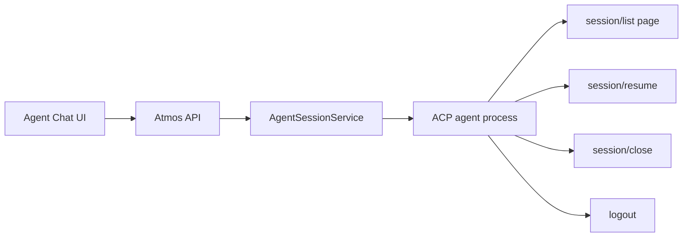

# Brainstorm · APP-018: ACP Protocol Upgrade

## Problem Frame

Atmos's ACP integration had two competing ownership models:

- ACP agents already own durable session identity, history, auth state, config options, and cleanup semantics.
- Atmos still owned a local Agent Chat session table, local title generation, and resume semantics that could drift from the agent.

The product goal is to make Atmos a protocol-aligned ACP client. Agent Chat should ask the selected agent for its native sessions, resume by ACP session id, and keep only runtime connection state locally.

## Implementation Options

| Option | Pros | Cons | Risk |
| --- | --- | --- | --- |
| Keep local DB history and add ACP fields | Small UI diff; preserves offline browsing | Keeps two sources of truth; stale sessions remain possible; conflicts with no-backcompat direction | High |
| Replace history with ACP `session/list` but keep local titles | Faster transition; UI can keep existing title flows | Agent metadata still fights local metadata; title generator remains unnecessary | Medium |
| Make ACP the only durable session source | Cleanest ownership; best long-term protocol compatibility; removes title/session DB debt | Requires API/UI/session lifecycle refactor; offline history disappears | Medium |
| Add a background control connection cache | Lower repeated list/logout latency | More process lifecycle and auth edge cases; not needed for v1 | Medium |

Recommended option: make ACP the only durable session source, with short-lived control operations for list/logout and runtime-only active WS sessions.

## Assumptions

- There are no existing users whose local ACP chat rows must be preserved.
- ACP `session/list` is cursor-based and Atmos should request one page at a time.
- ACP does not define a client page-size parameter; Atmos can cap oversized unpaginated responses defensively.
- Some agents will not support every capability, so unsupported states must be explicit.
- File-tool access is allowed only when Atmos can tie the runtime session to a trusted workspace/project context.
- `session/resume` should restore agent context; it does not imply Atmos can replay prior message transcripts.

## Request / Response Sketches

ACP-native session list, one page only:

```http
GET /api/agent/sessions?registry_id=codex&cursor=cursor-1
```

```json
{
  "registry_id": "codex",
  "items": [
    {
      "registry_id": "codex",
      "acp_session_id": "native-123",
      "title": "Fix workspace setup",
      "cwd": "/Users/example/project",
      "updated_at": "2026-05-26T12:00:00Z"
    }
  ],
  "next_cursor": "cursor-2",
  "unsupported_reason": null
}
```

Native resume creates only an Atmos runtime attachment:

```http
POST /api/agent/session/resume
```

```json
{
  "registry_id": "codex",
  "acp_session_id": "native-123",
  "workspace_id": "workspace-1",
  "cwd": "/Users/example/project"
}
```

Expected WS readiness event:

```json
{
  "type": "session_ready",
  "runtime_session_id": "runtime-uuid",
  "acp_session_id": "native-123"
}
```

Dependency check before implementation:

```bash
cargo info agent-client-protocol
cargo info agent-client-protocol-schema
cargo tree -p agent-client-protocol
```

## Flow Sketch



## Unresolved Questions

- Should Agent Management show auth-required list failures as a banner or route directly into the auth modal?
- Should history default to all sessions for an agent, or filter by current workspace cwd when present?
- If an agent supports `session/list` but not `session/resume`, should rows be disabled or hidden?
- Should Atmos later cache control connections for agents with slow startup?
- How much agent implementation/capability detail belongs in user UI versus diagnostics?

## Proposed Next Steps

1. Re-check published ACP crates and pin the highest compatible SDK/schema pair.
2. Write PRD/TECH/TEST for the protocol-owned session lifecycle.
3. Implement SDK migration and nullable usage compatibility first.
4. Replace local session history with ACP list/resume/close/logout.
5. Remove local session DB/title generator once all callers are gone.
6. Add targeted tests for pagination, failed resume, unsupported states, nullable usage, and file-access boundaries.
