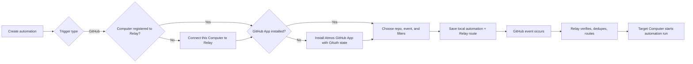
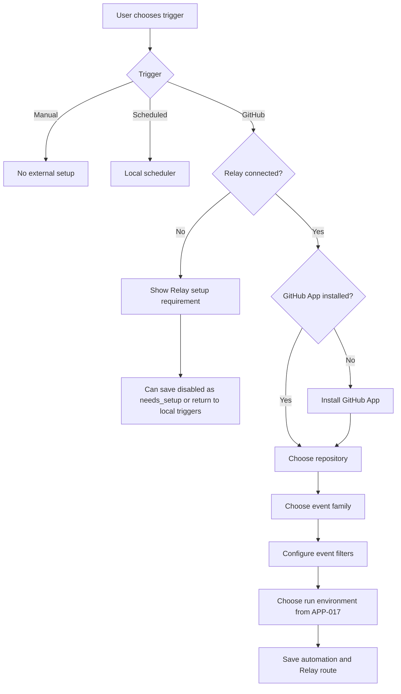
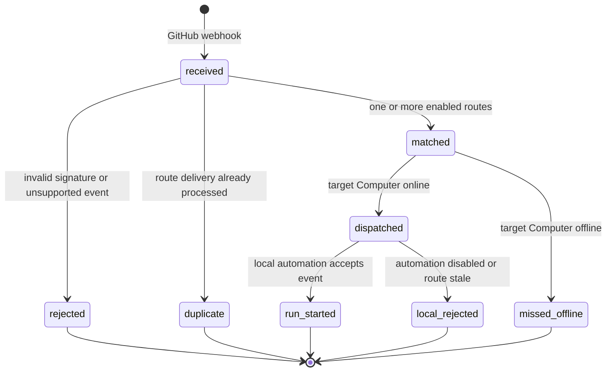

# PRD · APP-018: GitHub Automation Triggers

> Product Requirements · WHAT and WHY. Settled direction for triggering Atmos Automations from GitHub events through an official GitHub App and Atmos Relay.

## Context

- **Problem**: APP-017 automations can run manually or on a schedule, but users cannot tell Atmos to react when work happens in GitHub, such as a PR opening, a comment arriving, a branch receiving a push, or a workflow failing.
- **Why now**: APP-016 provides a Relay path to reach a registered Atmos Computer without exposing the user's local server publicly. APP-017 provides durable automation definitions, terminal execution, run history, and notifications.
- **Product direction**: GitHub webhook triggers are cloud ingress triggers. They require the target Atmos Computer to be registered with Atmos Relay. Execution, artifacts, prompts, and run history remain local to that Computer. Relay setup and route management use the same Atmos Relay Access Token that manages the user's registered Computers; the Computer's `server_secret` is not a control-plane write credential.
- **Related specs**: [APP-016 Atmos Computer](../APP-016_atmos-computer/TECH.md), [APP-017 Atmos Automations](../APP-017_atmos-automations/TECH.md), [APP-019 Relay Stable Tenant Identity](../APP-019_relay-stable-tenant-identity/TECH.md), [APP-005 GitHub Integration](../APP-005_github-integration/PRD.md).

## Goals

1. Let users trigger an Atmos automation from selected GitHub repository events.
2. Keep the local-first execution model intact: GitHub and Relay trigger the run, but the target Atmos Computer runs the terminal agent and stores results locally.
3. Make the required Relay and GitHub App setup explicit, understandable, and recoverable.
4. Provide safe, deduplicated, auditable event delivery without treating untrusted GitHub payload text as trusted instructions.

### GitHub trigger setup and execution flow

Diagram summary: GitHub setup creates a Relay route, but execution remains on the selected Atmos Computer.

## Users & Scenarios

- **Primary persona**: Agentic Builder who wants repository events to launch local agent work without keeping a browser tab open.
- **Secondary persona**: Maintainer who uses a remote Atmos Computer/VPS as an always-on automation host for repository triage.
- **Admin persona**: GitHub organization owner who controls whether the Atmos GitHub App can be installed on selected repositories.

### Key scenarios

1. A user creates an automation that runs when a pull request is opened in a selected repository and asks the agent to triage the PR.
2. A user creates an automation that runs when a PR comment containing a configured phrase is added by a specific person or group.
3. A user creates an automation that runs when a branch receives a push, with branch filters such as `main` or `release/*`.
4. A user creates an automation that runs when a GitHub Actions workflow completes with failure, so the agent can inspect logs and propose a fix.
5. A local-only user selects GitHub trigger and sees a clear setup requirement instead of a silent failure.

## User Stories

- As an Atmos user, I want to install the Atmos GitHub App from the automation setup flow, so that GitHub can send events to Atmos without manual webhook configuration.
- As an Atmos user, I want to choose a repository and event type, so that only relevant GitHub activity triggers my automation.
- As a maintainer, I want to filter comments by author and text pattern, so that only intentional commands or review signals start agent work.
- As a user, I want GitHub event context included in the automation run, so that the agent knows which PR, branch, comment, or workflow triggered it.
- As a security-conscious user, I want webhook text treated as untrusted input, so that comments or PR bodies cannot silently rewrite the automation's instructions.
- As a local-only user, I want to understand that GitHub webhooks require Relay, so that I can choose whether to connect this Computer or use manual/scheduled triggers instead.
- As a user, I want duplicate GitHub deliveries not to create duplicate automation runs, so that retries from GitHub are safe.
- As a user, I want GitHub integrations to follow the same Access Token identity as my registered Computers, so that changing identity does not silently transfer repository access or routes.

## Functional Requirements

### Must Have

- **M1 · Trigger type**: The Automations setup flow includes a **GitHub** trigger type alongside manual and scheduled triggers.
- **M2 · Relay requirement**: GitHub triggers can only be enabled when the current Atmos Computer is registered with Atmos Relay. If not registered, the UI explains the requirement and offers the existing Computer registration flow.
- **M3 · GitHub App connection**: Users can connect/install the official Atmos GitHub App from the setup flow and return to Atmos after installation. The install flow uses a short-lived Relay setup session and GitHub user authorization during installation so Relay can verify that the installation belongs to the user completing setup.
- **M4 · Repository selection**: Users can select a repository from the GitHub App installation scope or from locally known GitHub Projects that are verified against the installation.
- **M5 · Event selection**: Users can configure at least these event families: pull request, PR comment, push to branch, and GitHub Actions workflow completion.
- **M6 · Event filters**: Users can configure event-specific filters:
  - Pull request: opened, reopened, ready for review, closed/merged.
  - PR comment: any comment, comment contains text, comment by selected users.
  - Push: branch exact match or simple glob.
  - Workflow run: completed with success, failure, cancelled, or any conclusion.
- **M7 · Local ownership**: The full automation definition, prompt/instructions, run history, terminal execution, and artifacts remain local to the selected Atmos Computer.
- **M8 · Relay route**: Relay stores only the route metadata needed to match GitHub events to `tenant_id`, `server_id`, and `automation_guid`; Relay does not store automation instructions or run artifacts.
- **M9 · Event delivery**: When a matching GitHub event arrives and the target Computer is online, Relay delivers a structured trigger event to that Computer and the local `AutomationService` starts a run.
- **M10 · Offline behavior**: If the target Computer is offline, v1 records the delivery as missed/offline and does not backfill the run later.
- **M11 · Deduplication**: Duplicate GitHub webhook deliveries do not create duplicate automation runs for the same route. If one GitHub delivery intentionally matches multiple routes, each route may start its own automation once.
- **M12 · Run context**: Each GitHub-triggered run includes a structured event context with repository, event type, action, sender, PR/branch/workflow identifiers, URLs, and selected payload excerpts.
- **M13 · Untrusted payload handling**: GitHub payload text such as PR bodies and comments is clearly marked as untrusted input in the run prompt/context.
- **M14 · Run history attribution**: Run history shows that a run was triggered by GitHub, including event family, repository, and a link to the source PR/comment/workflow when available.
- **M15 · Disable/delete cleanup**: Disabling or deleting a GitHub-triggered automation disables or removes the corresponding Relay route so future GitHub events do not trigger it.
- **M16 · Setup incomplete state**: Users may save a GitHub-triggered automation before Relay route sync succeeds, but it remains disabled with a visible `needs_setup` status until the GitHub App installation and Relay route are active.
- **M17 · Access Token identity**: GitHub App installations and Relay routes belong to the same stable Relay tenant identity as registered Computers. APP-019 defines Access Token rotation for preserving that tenant. If the user directly replaces the local Access Token with another token, Atmos treats it as an identity switch: old GitHub routes are not transferred, and affected local GitHub-triggered automations become `needs_setup` until setup is completed under the new token.

### Nice to Have

- **N1 · Local polling fallback**: A separate delayed polling trigger for users who do not connect Relay.
- **N2 · GitLab provider**: Reuse the external trigger model for GitLab.
- **N3 · Manual repository webhook mode**: Internal or advanced-user mode for a per-repository webhook URL without installing the GitHub App.
- **N4 · Short TTL replay**: Optionally queue a small number of offline deliveries for replay when the Computer reconnects.
- **N5 · Comment command templates**: Built-in comment patterns such as `/atmos review` or `/atmos fix-ci`.

## Trigger / Scope Decision Flow

Diagram summary: GitHub triggers add Relay/GitHub prerequisites before the normal APP-017 run environment choice.

## Event Delivery Lifecycle

Diagram summary: Relay only dispatches route-level matches; the local service still accepts or rejects the run before execution.

## Out of Scope

- **Running automations in Relay**: Relay never executes agents and never stores run outputs.
- **GitHub polling fallback**: Local-only polling is a later trigger type, not v1 GitHub webhook behavior.
- **Guaranteed offline replay**: v1 records missed/offline deliveries but does not run them later.
- **User-created GitHub Apps**: v1 uses the official Atmos GitHub App; bring-your-own App is future scope.
- **Marketplace billing**: Publishing or monetizing the GitHub App through GitHub Marketplace is not part of this feature.
- **GitHub Enterprise Server**: GitHub.com first; GHES support can be added after production behavior is stable.
- **Cross-tenant repository sharing**: A route only belongs to the tenant and Computer that created it.
- **Generic Checks API triggers**: v1 uses GitHub Actions `workflow_run` for workflow completion. Checks API `check_run` / `check_suite` support is future scope.

## Success Metrics

- **Leading**: Users complete Relay connection plus GitHub App installation from the automation flow without leaving the setup in an unrecoverable state.
- **Leading**: A GitHub PR/comment/push/workflow event creates exactly one automation run per matching route when the target Computer is online.
- **Leading**: Run history clearly shows GitHub attribution and source links.
- **Lagging**: Users keep GitHub-triggered automations enabled across multiple repositories without duplicate or accidental runs.
- **Quality**: Invalid signatures, duplicate deliveries, and offline Computers are observable in logs or delivery status without exposing secrets or raw payloads unnecessarily.

## Risks & Open Questions

- **Risk**: GitHub App installation requires repository or organization admin permissions, so non-admin users may be blocked during setup.
- **Risk**: Webhook payloads contain user-authored text that may be prompt-injection content. The UI and runner must treat that text as untrusted context.
- **Risk**: Users may expect cloud execution because setup uses Relay; copy must state that the selected Computer still runs the automation.
- **Risk**: GitHub retries failed webhook deliveries, so deduplication must be correct before enabling real event runs.
- **Tradeoff**: Requesting GitHub user authorization during App installation adds setup complexity, but avoids trusting a spoofable `installation_id` redirect parameter.
- **Tradeoff**: v1 allows overlapping routes to fire multiple automations for the same GitHub event. The UI should warn about overlaps but not block them because advanced users may intentionally fan out work.
- **Tradeoff**: Losing or replacing the Access Token cannot automatically migrate GitHub routes because Atmos has no separate login identity to prove ownership. This is stricter, but it avoids unsafe cross-token transfer of repository-triggered automation rights.

## Milestones

- **Phase 1 · Internal dogfood**: Relay webhook endpoint, signature validation, delivery log, route schema, and manual route creation for one test repository.
- **Phase 2 · Product setup flow**: GitHub App install/setup callback, repository selection, trigger picker UI, local automation trigger persistence, and route sync.
- **Phase 3 · Run execution**: Event delivery to online Computers, local run start, GitHub run attribution, and notifications.
- **Phase 4 · Hardening**: Duplicate delivery tests, offline delivery visibility, route cleanup, payload redaction, and rate-limit protection.
