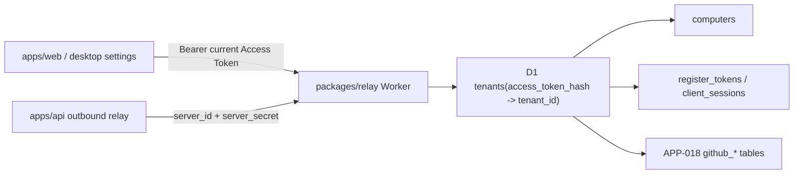

# TECH · APP-019: Relay Stable Tenant Identity

> Technical Design · HOW. Implements PRD APP-019: Relay Stable Tenant Identity.

## Scope summary

APP-019 changes the Relay control-plane identity model from `tenant_id = sha256(access_token)` to stable opaque tenant ids with Access Tokens stored as credentials. It addresses PRD M1-M10. It does not add login accounts, lost-token recovery, or per-Computer server secret rotation. APP-018 GitHub routes should depend on this model rather than carrying their own token-transfer logic.

## Architecture overview



Touched areas:

- `packages/relay/migrations/`: migrate tenant schema and tenant-scoped foreign keys.
- `packages/relay/src/index.ts`: tenant lookup, tenant creation, rotation endpoint, session cleanup.
- `packages/relay/README.md` and `packages/relay/AGENTS.md`: update identity model.
- `apps/web/src/features/connection/`: Settings rotation action and identity-switch copy.
- `crates/runtime-manager/src/computer_client_settings.rs`: local token write semantics if the desktop/local API owns the settings write.
- APP-018 implementation: GitHub tables reference stable `tenant_id`.

## Decisions resolved in TECH

| Fork | Decision |
|------|----------|
| Tenant primary key | Use generated stable ids, e.g. `tn_` + high-entropy base64url. |
| Access Token role | Credential only; store `access_token_hash` as a unique value on `tenants`. |
| Rotation auth | `Authorization: Bearer <current_token>` plus body `new_token`. |
| Old token behavior | Old token stops authenticating immediately after rotation. |
| Registered Computers | Keep `server_id` and `server_secret` valid; no re-registration. |
| Short-lived sessions | Revoke register tokens, client sessions, and setup sessions on rotation. |
| Lost token | No transfer. User creates a new tenant identity. |

## Module-by-module design

### packages/relay migrations

Current schema:

```sql
CREATE TABLE tenants (
  token_hash TEXT PRIMARY KEY,
  created_at INTEGER NOT NULL
);
```

Target schema:

```sql
CREATE TABLE tenants (
  tenant_id TEXT PRIMARY KEY,
  access_token_hash TEXT NOT NULL UNIQUE,
  created_at INTEGER NOT NULL,
  updated_at INTEGER NOT NULL,
  rotated_at INTEGER
);

CREATE INDEX idx_tenants_access_token_hash
  ON tenants(access_token_hash);
```

Tenant-scoped tables continue to use `tenant_id TEXT NOT NULL`, but the value changes from token hash to stable tenant id:

- `register_tokens.tenant_id`
- `computers.tenant_id`
- `client_sessions.tenant_id`
- APP-018 `github_setup_sessions.tenant_id`
- APP-018 `github_app_installations.tenant_id`
- APP-018 `github_event_routes.tenant_id`
- APP-018 `github_webhook_deliveries.tenant_id`

Migration approach:

1. Rename the legacy `tenants` table to `tenants_legacy`.
2. Create the new `tenants` table.
3. For each legacy tenant row, generate a stable `tenant_id` in the Worker migration helper or SQL migration.
4. Rebuild each tenant-scoped table by joining old `tenant_id` values to `tenants_legacy.token_hash` and the new `tenants.access_token_hash`.
5. Drop legacy tables only after all rows have been copied and counted.

Sketch:

```sql
ALTER TABLE tenants RENAME TO tenants_legacy;

CREATE TABLE tenants (
  tenant_id TEXT PRIMARY KEY,
  access_token_hash TEXT NOT NULL UNIQUE,
  created_at INTEGER NOT NULL,
  updated_at INTEGER NOT NULL,
  rotated_at INTEGER
);

-- For D1 SQL-only migration, randomblob is acceptable for legacy ids.
INSERT INTO tenants(tenant_id, access_token_hash, created_at, updated_at)
SELECT 'tn_' || lower(hex(randomblob(16))), token_hash, created_at, created_at
FROM tenants_legacy;
```

For child tables, prefer table rebuilds over in-place `UPDATE` so the resulting schema can add indexes and foreign keys consistently:

```sql
CREATE TABLE computers_new (
  server_id TEXT PRIMARY KEY,
  tenant_id TEXT NOT NULL,
  secret_hash TEXT NOT NULL,
  revoked INTEGER NOT NULL DEFAULT 0,
  display_name TEXT,
  created_at INTEGER NOT NULL,
  last_seen_at INTEGER,
  updated_at INTEGER,
  registration_meta TEXT,
  FOREIGN KEY (tenant_id) REFERENCES tenants(tenant_id)
);

INSERT INTO computers_new(...)
SELECT c.server_id, t.tenant_id, c.secret_hash, c.revoked, c.display_name,
       c.created_at, c.last_seen_at, c.updated_at, c.registration_meta
FROM computers c
JOIN tenants_legacy old ON old.token_hash = c.tenant_id
JOIN tenants t ON t.access_token_hash = old.token_hash;

DROP TABLE computers;
ALTER TABLE computers_new RENAME TO computers;
```

Repeat the same pattern for `register_tokens` and `client_sessions`. APP-018 migrations should be written against the new stable-tenant schema; if APP-018 tables already exist in an environment, add them to the same rebuild pattern.

Indexes:

```sql
CREATE INDEX idx_register_tokens_tenant ON register_tokens(tenant_id);
CREATE INDEX idx_computers_tenant ON computers(tenant_id);
CREATE INDEX idx_client_sessions_tenant ON client_sessions(tenant_id);
CREATE INDEX idx_client_sessions_server ON client_sessions(server_id);
```

### packages/relay runtime

Update tenant lookup:

```ts
async function tenantFromRequest(request: Request, env: Env): Promise<string | null> {
  const token = bearerToken(request);
  if (!token) return null;
  const accessTokenHash = await secretHash(token);
  const row = await env.CP_DB.prepare(
    "SELECT tenant_id FROM tenants WHERE access_token_hash = ? LIMIT 1",
  ).bind(accessTokenHash).first<{ tenant_id: string }>();
  return row?.tenant_id ?? null;
}
```

Tenant creation:

- `POST /v1/tenants` remains unauthenticated and rate-limited.
- Body stays `{ "token": "<access token>" }`.
- Relay generates `tenant_id = "tn_" + randomBase64Url(18)` and stores `access_token_hash = sha256(token)`.
- If `access_token_hash` already exists, return `409 tenant_exists`.

Rotation endpoint:

```http
POST /v1/tenants/rotate_token
Authorization: Bearer <current_access_token>
Content-Type: application/json

{
  "new_token": "<new access token>"
}
```

Response:

```json
{
  "ok": true,
  "rotated_at": 1760000000000
}
```

Rules:

- Current token must resolve to a tenant.
- `new_token` must pass the same length/entropy validation as tenant creation.
- `sha256(new_token)` must not already exist in `tenants.access_token_hash`.
- `new_token` must not equal the current token.
- Use a D1 batch/transaction so credential update and short-lived cleanup commit together.
- Delete or invalidate short-lived tenant-scoped rows:
  - `register_tokens`
  - `client_sessions`
  - APP-018 `github_setup_sessions`
- Keep durable rows:
  - `computers`
  - APP-018 `github_app_installations`
  - APP-018 `github_event_routes`
  - APP-018 `github_webhook_deliveries`
- Do not modify `computers.secret_hash`; server outbound connections keep working.

Pseudo-transaction:

```ts
const now = Date.now();
await env.CP_DB.batch([
  env.CP_DB.prepare(
    "UPDATE tenants SET access_token_hash = ?, updated_at = ?, rotated_at = ? WHERE tenant_id = ?",
  ).bind(newHash, now, now, tenantId),
  env.CP_DB.prepare("DELETE FROM register_tokens WHERE tenant_id = ?").bind(tenantId),
  env.CP_DB.prepare("DELETE FROM client_sessions WHERE tenant_id = ?").bind(tenantId),
  env.CP_DB.prepare("DELETE FROM github_setup_sessions WHERE tenant_id = ?").bind(tenantId),
]);
```

If APP-018 tables are not yet deployed, `github_setup_sessions` cleanup should be feature-detected or added with APP-018's migration.

### apps/web

Settings should expose two separate actions:

- **Rotate Access Token**: generate or accept a new token, call `POST /v1/tenants/rotate_token` with the current locally stored token, then write the new token locally only after success.
- **Switch Identity**: replace the local token without calling rotation. Copy must state that existing Computers/GitHub routes from the old token will not follow.

Client flow:

1. Read current token from the existing connection store / `~/.atmos/computer-client.json` sync.
2. Generate a new token with the existing token generator.
3. Call Relay rotation endpoint.
4. On success, persist the new token and reload/list Computers.
5. On failure, keep the old token and show a recoverable error.

### crates/runtime-manager

`computer_client_settings.rs` remains the local source for Access Token and control-plane URL. If rotation is performed through local API/Desktop, expose an atomic write helper:

```rust
pub fn replace_access_token_after_rotation(new_token: String) -> Result<ComputerClientSettings>;
```

The helper should:

- Preserve the control-plane URL.
- Write only after Relay rotation succeeds.
- Avoid logging the old or new token.

### APP-018 GitHub route integration

APP-018 GitHub tables must use stable `tenant_id` values. Rotation should not rewrite GitHub route rows; the tenant id remains unchanged.

GitHub setup/session behavior:

- Active setup sessions are short-lived and should be deleted on rotation.
- Existing installations/routes remain.
- Incoming webhooks after rotation continue to dispatch to the same `server_id` because routes still point to the same tenant and Computer.

## Data model

```ts
type Tenant = {
  tenant_id: string;
  access_token_hash: string;
  created_at: number;
  updated_at: number;
  rotated_at?: number;
};
```

Control-plane auth invariant:

```text
Bearer Access Token -> sha256(token) -> tenants.access_token_hash -> tenants.tenant_id
```

Durable ownership invariant:

```text
tenant_id is stable and is the only value referenced by tenant-owned rows.
```

## Transport

Relay uses REST because this is the public control plane, not an Atmos app business WebSocket flow.

| Method | Path | Auth | Purpose |
|--------|------|------|---------|
| `POST` | `/v1/tenants` | none, rate-limited | Create a tenant with stable `tenant_id` and Access Token credential. |
| `POST` | `/v1/tenants/rotate_token` | Bearer current Access Token | Replace the tenant Access Token credential. |
| Existing | `/v1/register_tokens`, `/v1/computers`, `/v1/computers/:id/*` | Bearer Access Token | Same behavior, but tenant lookup returns stable `tenant_id`. |

Error codes:

- `unauthorized`
- `invalid_token`
- `new_token_exists`
- `new_token_same_as_current`
- `rotation_failed`
- `rate_limited`

## Security & permissions

- Never log raw Access Tokens, token hashes, register tokens, client tokens, or server secrets.
- Rotation requires the current Access Token; no old token means no transfer.
- Old token stops working immediately because `access_token_hash` changes.
- Short-lived sessions are revoked so clients reconnect under the new token.
- Registered Computers keep `server_secret`; this is a separate server socket credential.
- Use constant-time comparisons where tokens or hashes are compared in process.
- Rate-limit tenant creation and rotation by IP and, when authenticated, by tenant id.

## Rollout plan

1. Add D1 migration for stable `tenants.tenant_id` and table rebuilds for APP-016 tenant-scoped tables.
2. Update `tenantFromRequest` and all control-plane queries to use stable `tenant_id`.
3. Update `POST /v1/tenants` to generate stable tenant ids.
4. Add `POST /v1/tenants/rotate_token` with cleanup of short-lived rows.
5. Update `packages/relay/README.md` and `packages/relay/AGENTS.md`.
6. Add Settings UX for rotate vs switch identity.
7. Update APP-018 implementation to create GitHub rows with stable tenant ids.
8. Dogfood against a copied D1 database with legacy tenants before production migration.

## Risks & tradeoffs

- **Risk**: Legacy migration can orphan rows if a table is missed. Mitigate with row-count checks per tenant-scoped table.
- **Risk**: Revoking client sessions can briefly disconnect web/desktop clients. This is acceptable for secret rotation and should recover by creating a new session.
- **Tradeoff**: No lost-token transfer. This is strict, but it matches the no-login identity model.
- **Tradeoff**: Stable tenant id adds one migration now but removes route/table rewrite complexity from APP-018 and future providers.
- **Rollback**: Before production migration, snapshot/export D1. If migration fails, restore the snapshot and redeploy the previous Worker. After migration, do not run old Worker code that expects `tenants.token_hash`.

## Dependencies & compatibility

- Updates APP-016 Relay identity model.
- Blocks APP-018 production GitHub route storage if token rotation support is required before GitHub launch.
- Existing registered Computers remain compatible because `server_id` and `server_secret` are unchanged.
- Existing local `~/.atmos/computer-client.json` remains compatible because it stores the raw Access Token and control-plane URL, not `tenant_id`.

## Open questions

- [ ] Should Settings display the stable `tenant_id` for support/debugging?
- [ ] Should rotation history be a separate table in v1 or only `rotated_at` on `tenants`?
