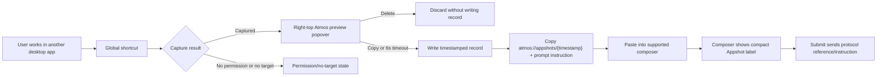

# PRD · APP-021: Appshots Cross-App Snapshot

> Product Requirements · WHAT and WHY. Settled direction for user-triggered cross-app desktop snapshots as persisted local records with lightweight clipboard references.

## Context

- **Problem**: Atmos users often need to bring context from another desktop app into Atmos, but the current workaround is manual description, screenshots, or ad hoc copy-paste.
- **Why now**: Atmos has a Tauri desktop shell with native Rust commands, which can request OS-level screen and accessibility permissions that the web app cannot access.
- **Related specs**: `APP-009_desktop-tauri`, `APP-004_local-agent-integration-acp`, `APP-016_atmos-computer`.

## Goals

1. Primary - let a Desktop user press a global native shortcut from any app, capture that app's current window context, and see a short-lived Appshot preview in Atmos.
2. Primary - persist accepted Appshots as timestamped local record directories under `~/.atmos/appshots/records/{timestamp}/`.
3. Primary - copy only an Atmos protocol reference plus a fixed prompt instruction to the clipboard, so agents read the record from disk instead of receiving a pasted content dump.
4. Primary - let supported Atmos composers, starting with Welcome and Automation setup, recognize `atmos://appshots/{timestamp}` references on paste, render them as compact labels, and submit the protocol reference/instruction as prompt text.
5. Secondary - preserve useful structure from the target UI through accessibility data and a screenshot preview.
6. Secondary - make platform limitations and permission requirements obvious before the user expects the feature to work.

## Users & Scenarios

- **Primary persona**: An Atmos desktop user working with an agent while also using another desktop app such as Cursor, a browser, a design tool, a database client, or a terminal.
- **Scenario 1**: The user presses the global Appshot shortcut while another app is focused, sees a right-top Atmos popover with a screenshot preview, and either copies, deletes, or lets it auto-save/copy after six seconds.
- **Scenario 2**: The user pastes the copied `atmos://appshots/{timestamp}` reference into a supported Atmos composer such as Welcome or Automation setup, sees a compact Appshot label, and submits a prompt that tells the agent where the local record lives.
- **Scenario 3**: The user opens the Header Appshots button near Open in Web, reads the short feature explanation, reviews recent Appshot records, copies an older record, or deletes a stale record.
- **Scenario 4**: The user has not granted Screen Recording, Accessibility, or shortcut permissions yet and needs a clear recovery path instead of a silent failure.

## User Stories

- As an Atmos desktop user, I want a global shortcut that works while another app is focused, so that I can capture context without first switching to Atmos.
- As an Atmos desktop user, I want a brief preview popover with copy and delete controls, so that I can reject bad captures and keep useful ones with minimal interruption.
- As a Welcome or Automation setup user, I want pasted Appshot references to appear as compact labels, so that the composer stays readable.
- As an agent user, I want the submitted prompt to include the Appshot protocol reference and a fixed instruction pointing at the local records directory, so that the agent can read the stored screenshot, metadata, and text itself.
- As a returning user, I want a Header Appshots history popover, so that I can copy or delete recent records without recapturing.
- As a privacy-conscious user, I want the capture to happen only when I trigger it, so that Atmos is not continuously watching other apps.
- As a user on an unsupported platform or missing permission, I want a clear explanation and recovery path, so that I know whether the issue is permissions, platform support, or target app accessibility quality.

## Functional Requirements

### Must Have

- **M1**: Desktop users can trigger Appshot capture from any focused app through a native global shortcut. The requested chord is `Fn + Cmd + Option`; implementation must validate whether modifier-only registration is possible on each target OS.
- **M2**: After a successful capture, Atmos shows a small right-top popover with a screenshot preview, a Copy button, and a Delete button.
- **M3**: The capture popover auto-resolves after 6 seconds with a visible countdown. Hover pauses the countdown and auto-accept; mouse leave resumes it. Delete discards the capture without writing a record. Copy or timeout writes the record and copies a protocol reference.
- **M4**: Accepted captures are written under `~/.atmos/appshots/records/{timestamp}/`, where `{timestamp}` is a 13-digit Unix epoch millisecond id.
- **M5**: Each record directory uses three canonical files: `snapshot.png` for the captured window image, `context.md` for normalized accessibility/text content, and `metadata.json` for app name, window title, platform, quality, capture time, warnings, and file paths.
- **M6**: The clipboard text is not the full Appshot content. It contains `atmos://appshots/{timestamp}` plus a fixed prompt instruction that tells the agent where the record is stored.
- **M7**: Supported Atmos composers that submit prompts to agents, starting with the Welcome page composer and Automation setup composer, detect `atmos://appshots/{timestamp}` references, replace the visible pasted reference with a compact Appshot label, and preserve the protocol prompt text for submission.
- **M8**: Pasting the same protocol text outside supported Atmos composers behaves like normal text.
- **M9**: Header right action controls include an Appshots button immediately to the left of Open in Web in Desktop runtime.
- **M10**: The Header Appshots popover explains the feature and lists recent local records sorted newest first by timestamp.
- **M11**: History loads record filenames first and displays concrete content for the first 10 records; users can click More to reveal the next page.
- **M12**: Each visible history item shows app name, capture time, screenshot thumbnail, truncated text, Copy, and Delete.
- **M13**: Copy from history writes the same `atmos://appshots/{timestamp}` plus fixed prompt instruction to the clipboard. Delete removes the entire `~/.atmos/appshots/records/{timestamp}/` directory.
- **M14**: Captured sensitive fields are omitted or redacted where the platform exposes secure text semantics.
- **M15**: Appshot capture is available only through explicit user action; Atmos does not run background capture or automatic periodic sampling.
- **M16**: Non-Desktop runtimes and unsupported desktop platforms show an unsupported state rather than a broken control.
- **M17**: When Appshots require missing macOS permissions, Atmos identifies the missing permission, explains why it is needed, provides an Open System Settings action for the relevant pane, and re-checks permission status after the user returns.

### Nice to Have

- **N1**: User-configurable global shortcut if `Fn + Cmd + Option` conflicts or cannot be registered as a complete chord.
- **N2**: OCR or vision-model fallback when accessibility data is poor.
- **N3**: Manual redaction tools for screenshot regions or accessibility tree nodes before copying.
- **N4**: Windows and Linux platform backends with parity to the macOS user flow.
- **N5**: Appshot label support in every Atmos rich composer beyond the Welcome and Automation setup composers.

## Out of Scope

- **Reading app memory or private data stores** - Appshots only use screenshot and OS accessibility surfaces granted by the user.
- **Continuous monitoring** - v1 is user-triggered capture only.
- **Remote browser capture** - hosted web and relay clients cannot access local OS accessibility APIs directly.
- **Guaranteed offscreen content extraction** - accessibility trees may expose offscreen nodes, but this is target-app dependent and not a product guarantee.
- **Full automation or control of other apps** - this spec captures context only; it does not click, type, or manipulate the target app.
- **Cross-platform parity in v1** - macOS is the first-class target; Windows and Linux can be designed behind the same abstraction but need not ship fully in the first release.
- **Full-content clipboard copy** - v1 copies a lightweight protocol reference and prompt instruction, not the full Appshot body.
- **Cloud sync** - records are local under `~/.atmos/appshots/records/`; syncing or sharing records is out of scope.

## Success Metrics

- Leading: At least one internal dogfood workflow can capture another app from a global shortcut, accept or auto-accept the preview, paste an `atmos://appshots/{timestamp}` reference into a supported composer such as Welcome or Automation setup, and submit it to an agent.
- Leading: Permission-denied states produce an actionable UI path on macOS, including a settings-opening action and a successful status refresh after authorization.
- Quality: Saved Appshot records include `metadata.json`, `snapshot.png`, `context.md`, and at least one non-empty content source in supported happy-path cases.
- Quality: Welcome and Automation setup composers show compact Appshot labels instead of the full protocol/prompt text, while submit-time prompt text includes the protocol reference and fixed instruction.
- Quality: Header history can page through records 10 at a time and copy/delete any visible record.
- Safety: Captured Appshot record content is not written to application logs.
- Qualitative: Dogfood users report that the agent receives enough context to answer basic "what is on this screen?" questions for common Electron/WebView/native apps.

## Risks & Open Questions

- **Risk**: Users may overestimate what accessibility can read from canvas, games, virtualized lists, or self-drawn controls.
- **Risk**: `Fn + Cmd + Option` may not be registerable as a modifier-only global shortcut through standard OS shortcut APIs; a lower-level event tap may require extra permissions and careful conflict handling.
- **Risk**: The capture action can accidentally capture Atmos unless native code tracks the last external window.
- **Risk**: Record directories can accumulate screenshots and text over time; history deletion and future retention cleanup must be predictable.
- **Open**: Should timeout auto-accept also show a toast after the popover disappears?
- **Open**: Should history deletion be immediate or require confirmation for records newer than the current session?

## Milestones

- Phase 1 - macOS capture prototype behind a Desktop-only feature flag, with permission status, System Settings recovery actions, and normalized record generation.
- Phase 2 - Global shortcut and right-top capture preview popover with 6-second auto-accept, Copy, and Delete.
- Phase 3 - Record persistence under `~/.atmos/appshots/records/{timestamp}/` with `snapshot.png`, `context.md`, `metadata.json`, and clipboard protocol generation as `atmos://appshots/{timestamp}` plus fixed instruction.
- Phase 4 - Welcome and Automation setup composer paste detection, compact Appshot label rendering, deletion, tooltip/metadata display, and submit-time preservation of protocol prompt text.
- Phase 5 - Header Appshots button/history popover with paged recent records, thumbnails, truncated text, Copy, and Delete.
- Phase 6 - Dogfood hardening: redaction rules, size limits, logging audit, and unsupported platform states.
- Phase 7 - Evaluate configurable shortcuts, additional composer surfaces, and Windows/Linux backends as follow-up work.
