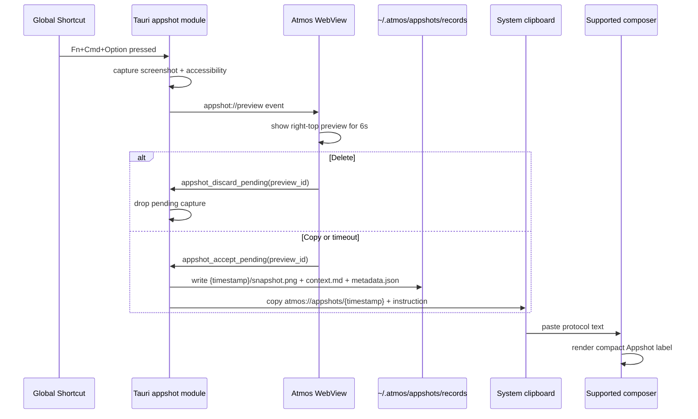

# TECH · APP-021: Appshots Cross-App Snapshot

> Technical Design · HOW. Implements PRD APP-021: Appshots Cross-App Snapshot.

## Scope summary

This design adds user-triggered cross-app snapshots to Atmos Desktop, shows a short-lived preview, persists accepted captures as local timestamped records, and copies a lightweight `atmos://appshots/{timestamp}` protocol reference. Atmos consumers, starting with the Welcome page composer and Automation setup composer, detect pasted references and render compact Appshot labels while submitting the protocol reference plus fixed agent instruction. It addresses PRD M1-M17. N1 configurable shortcut, N2 OCR, N3 manual redaction, N4 full Windows/Linux parity, and N5 broader all-composer support are deferred unless explicitly pulled into implementation.

## Architecture overview

Appshot capture is a desktop-native capability. The web app cannot read other windows or OS accessibility trees, and the local API process is not the foreground desktop app. The first implementation therefore lives in the Tauri process. Native capture creates a pending in-memory Appshot, emits a preview event to the WebView, and resolves the pending capture by delete, explicit copy, or a 6-second auto-accept timeout.



No new loopback REST endpoint is required. The clipboard artifact is a protocol reference and fixed prompt instruction, not the full Appshot body. The first line is:

```text
atmos://appshots/{timestamp}
```

where `{timestamp}` is a 13-digit Unix epoch millisecond id. The clipboard text must also include a fixed instruction:

```text
atmos://appshots/1760000000000
Appshot record is stored locally at ~/.atmos/appshots/records/1760000000000/. Read metadata.json, context.md, and snapshot.png in that directory before answering. Inspect snapshot.png when visual context matters.
```

The record, not the clipboard, is the source of truth.

## Module-by-module design

### apps/desktop/src-tauri

Add a new native module:

```text
apps/desktop/src-tauri/src/appshot/
  mod.rs
  types.rs
  clipboard.rs
  protocol.rs
  records.rs
  shortcut.rs
  pending.rs
  macos.rs
  unsupported.rs
```

- `types.rs` owns serializable request/response structs shared by all platform backends.
- `protocol.rs` formats and parses `atmos://appshots/{timestamp}` clipboard text.
- `records.rs` owns `~/.atmos/appshots/records/` storage, listing, detail reading, copy, and deletion.
- `shortcut.rs` owns the Appshot trigger. On macOS v1 this is a modifier-only gesture listener, not a traditional hotkey registration.
- `pending.rs` stores pending captures for Copy/Delete/timeout resolution.
- `clipboard.rs` writes protocol text to the system clipboard. Prefer `tauri-plugin-clipboard-manager` if the implementation does not already have a supported clipboard API.
- `macos.rs` implements screenshot and accessibility capture behind `#[cfg(target_os = "macos")]`.
- `unsupported.rs` returns structured unsupported status for platforms without a backend.
- `commands.rs` exposes thin Tauri commands and delegates into `appshot`.
- `main.rs` registers the new commands in `tauri::generate_handler!`.

<!-- updated 2026-05-28: implementation keeps v1 target resolution inside macos.rs; no separate tracker module is required until last-non-Atmos-window recovery is added. Target resolution now uses NSWorkspace/CoreGraphics first so screenshot capture is not coupled to System Events accessibility traversal. -->

New commands:

```rust
#[tauri::command]
pub async fn appshot_status() -> Result<AppshotStatus, String>;

#[tauri::command]
pub async fn appshot_accept_pending(preview_id: String) -> Result<AppshotAcceptResponse, String>;

#[tauri::command]
pub async fn appshot_discard_pending(preview_id: String) -> Result<(), String>;

#[tauri::command]
pub async fn appshot_list_records() -> Result<Vec<AppshotRecordListItem>, String>;

#[tauri::command]
pub async fn appshot_read_records(req: AppshotReadRecordsRequest)
    -> Result<Vec<AppshotRecordDetail>, String>;

#[tauri::command]
pub async fn appshot_copy_record(timestamp: String) -> Result<AppshotCopyResponse, String>;

#[tauri::command]
pub async fn appshot_delete_record(timestamp: String) -> Result<(), String>;

#[tauri::command]
pub async fn appshot_open_permissions(req: AppshotOpenPermissionsRequest) -> Result<(), String>;
```

The product flow is trigger-driven:

1. Native trigger listener observes the configured Appshot gesture and calls capture with `target: "frontmost"` or a platform-specific active-window target.
2. Native plays a short capture affordance against the target window bounds: a transparent always-on-top overlay shows a blue breathing border and a camera-flash frame, then closes before the real screenshot is taken so `snapshot.png` does not include the affordance.
3. Native stores a pending capture under an opaque `preview_id`.
4. Native emits an app event to the main WebView, for example `appshot://preview`, with metadata, source window bounds, and screenshot preview bytes.
5. Web UI calls `appshot_accept_pending` on Copy or after the 6-second timer.
6. Web UI calls `appshot_discard_pending` on Delete.

Native must also own a 6-second timeout for each pending capture so auto-accept still happens if the WebView event is delayed or the UI timer is interrupted. Delete must win if it arrives before the timeout resolves.

#### Record directory layout

Accepted Appshots are stored as directories, not single JSON blobs:

```text
~/.atmos/appshots/records/
  1760000000000/
    snapshot.png
    context.md
    metadata.json
```

- Directory name is the 13-digit Unix epoch millisecond timestamp and is the stable record id.
- `snapshot.png` is the captured window image, resized to a bounded desktop-friendly maximum edge before persistence so local records do not store multi-megabyte Retina captures by default. The preview popover and history popover use generated thumbnails from this file; clicking a history thumbnail lazily loads a larger view into the shared composer image preview overlay. Accepted records keep the three-file contract stable; if screenshot capture fails but a degraded text-only record is still accepted, write a placeholder PNG and mark `screenshot.available = false` in `metadata.json`.
- `context.md` is agent-readable Markdown with the normalized accessibility tree, focused element, extracted text, warnings, and short capture notes.
- `metadata.json` is structured data for UI and tooling. It includes timestamp, paths, platform, app name, bundle id/process id, window title/id, screenshot dimensions, capture quality, permission states, warnings, and byte counts.
- Writes should be atomic: write into a temp directory under `~/.atmos/appshots/tmp/`, then rename to `records/{timestamp}` after all files are complete. Deletion removes the whole record directory.

#### Global modifier gesture

The requested trigger is `Fn + Option + Command`. Treat it as a modifier-only gesture, not a traditional global shortcut. Do not build macOS v1 on Tauri/global-shortcut or Carbon-style hotkey registration because those APIs usually model a shortcut as modifier flags plus one non-modifier key.

Preferred macOS implementation:

- Install a listen-only global event tap for modifier state changes, for example `CGEventTapCreate(..., kCGEventTapOptionListenOnly, CGEventMaskBit(kCGEventFlagsChanged), ...)`.
- If the event tap path is not viable in Rust bindings, use `NSEvent.addGlobalMonitorForEvents(matching: .flagsChanged)` behind a small Swift/Objective-C bridge.
- Subscribe only to `flagsChanged` / modifier events for the Appshot trigger. Do not monitor normal `keyDown` text input for this feature.
- Derive the active modifier state from event flags and key codes. Track `function`, `option`, and `command` as booleans.
- Fire only on the transition from "not all required modifiers down" to "all required modifiers down".
- Keep a `fired` latch until any required modifier is released, plus a short cooldown such as 800 ms, so repeated `flagsChanged` events cannot create duplicate captures.
- If Atmos is frontmost when the gesture fires, return a no-target preview/status instead of capturing Atmos. A future tracker can recover the last non-Atmos foreground window if dogfood proves that flow is needed.

Pseudo-code:

```rust
struct ModifierGestureState {
    function_down: bool,
    option_down: bool,
    command_down: bool,
    fired: bool,
    last_fire_at_ms: Option<u64>,
}

fn on_flags_changed(flags: ModifierFlags, state: &mut ModifierGestureState) {
    state.function_down = flags.function;
    state.option_down = flags.option;
    state.command_down = flags.command;

    let gesture_down = state.function_down && state.option_down && state.command_down;
    if gesture_down && !state.fired && cooldown_elapsed(state.last_fire_at_ms) {
        state.fired = true;
        state.last_fire_at_ms = Some(now_ms());
        take_appshot_for_frontmost_or_last_non_atmos_window();
    }

    if !gesture_down {
        state.fired = false;
    }
}
```

Implementation notes:

- `Fn` / Globe behavior can vary by keyboard and macOS settings. `appshot_status` must report when the function modifier cannot be observed, and the feature must not silently remap the gesture to `Option + Command`.
- The implemented macOS listener uses Accessibility-trusted global modifier events; Input Monitoring is not treated as a required permission for the Appshot gesture. Permission failure is a normal disabled state with recovery UI.
- The listener should be registered during Desktop app startup and torn down on app shutdown. If macOS disables the event tap, re-enable it once and then report a degraded trigger status if it repeatedly fails.

The trigger must capture the currently focused external app, not the Atmos window.

#### Permission recovery flow

Permissions are part of the Appshot UX, not a terminal error path. Any missing permission reported by `appshot_status` or a capture attempt must produce a visible recovery state with a one-click settings action when the platform supports it.

Required macOS permission surfaces:

- Accessibility: needed for `AXUIElement` traversal and the implemented global modifier listener.
- Screen Recording / Screen & System Audio Recording: needed for window screenshots.

Native owns settings navigation:

1. `appshot_status()` returns `permissions` and `trigger.permissions`, each with display text, `granted`, why it is needed, and an optional recovery action.
2. Web UI renders missing permissions in the preview error state and Header Appshots popover with an "Open System Settings" action.
3. Clicking the action calls `appshot_open_permissions({ target })`.
4. Native opens the best available macOS System Settings destination for that target. Prefer a direct Privacy & Security pane deep link after validating it on the supported macOS versions; fall back to the Privacy & Security root pane plus manual instructions if a direct pane cannot be opened.
5. When Atmos regains focus, and once per second for up to 10 seconds after opening settings, Web UI calls `appshot_status()` again so the state updates immediately after authorization.

Do not hardcode System Settings URL schemes in `apps/web`; macOS pane identifiers and labels are native compatibility details. The web layer only receives `AppshotSettingsTarget` and user-facing fallback instructions from Tauri.

### macOS backend

Use macOS-native APIs through target-specific Rust bindings:

- Active app/window: use `NSWorkspace.frontmostApplication()` for app identity and `CGWindowListCopyWindowInfo` for top-level visible window metadata, bounds, owner pid, and window id. This lookup must be fast and independent from Accessibility tree traversal. Fall back to the previous System Events lookup only if native metadata is unavailable.
- Screenshot: v1 uses `screencapture -R` with validated CoreGraphics window bounds; later hardening can move to ScreenCaptureKit or CoreGraphics per-window capture. Never fall back to full-screen capture when the focused window bounds are unknown.
- Accessibility tree: v1 may use System Events traversal over the frontmost app/window; later hardening can replace this with direct `AXUIElementCreateApplication`, focused window lookup, and recursive `AXUIElementCopyAttributeValue`. Accessibility timeout or syntax/runtime failure must only degrade the record to screenshot-only/accessibility-unavailable; it must not prevent app metadata or `snapshot.png` from being captured.
- Permissions:
  - Appshot trigger listener: preflight the chosen `flagsChanged` listener path and surface missing Accessibility permission as `AppshotPermissionState`.
  - Accessibility: preflight with the AX trust APIs and open System Settings when missing.
  - Screen Recording: preflight/request with CoreGraphics/ScreenCaptureKit-supported APIs and open the relevant System Settings pane when missing.

Traversal rules:

- Cap depth, total nodes, and total text bytes using request limits. The macOS v1 defaults are depth 8, 420 nodes, 24 KB raw accessibility tree, and 28 KB final `context.md`.
- Include role, name/title, value, description, URL, bounds, focused, enabled, selected, and settable flags when exposed.
- Redact values for secure text fields and password-like roles.
- Skip invisible, zero-size, or structurally empty nodes unless they have useful text or focus state.
- Preserve partial failures in `warnings` instead of throwing away the whole appshot.

### Windows/Linux backends

For v1, compile stubs can return:

```rust
AppshotStatus {
    supported: false,
    platform: "windows" | "linux",
    reason: Some("Appshots are currently available on macOS desktop builds only."),
    trigger: AppshotTriggerStatus {
        mode: AppshotTriggerMode::Unsupported,
        enabled: false,
        required_modifiers: vec![],
        last_error: Some("No native Appshot backend for this platform."),
        permissions: vec![],
    },
    permissions: vec![],
}
```

The module boundary should still match the future target design:

- Windows: UI Automation plus Windows Graphics Capture.
- Linux: AT-SPI2 plus xdg-desktop-portal/PipeWire on Wayland or X11 capture APIs on X11.

### apps/web shared appshot feature

Add feature-local protocol/history helpers and UI components:

```text
apps/web/src/features/appshot/
  components/AppshotCapturePreview.tsx
  components/AppshotsHeaderButton.tsx
  components/AppshotsHistoryPopover.tsx
  components/AppshotRecordRow.tsx
  lib/appshot-client.ts
  lib/appshot-protocol.ts
  types.ts
```

- `appshot-client.ts` checks `isTauriRuntime()` from `apps/web/src/shared/lib/desktop-runtime.ts` before invoking native commands.
- `AppshotCapturePreview` listens for native preview events and renders the right-top 6-second popover with screenshot thumbnail, live countdown, Copy, and Delete. When source bounds are available, the card animates from the captured app's screen position into the Atmos right-top corner. Hovering the preview pauses the frontend countdown and native auto-accept; leaving the preview resumes both from the remaining time.
- `AppshotsHeaderButton` is inserted immediately to the left of the existing Open in Web button in `apps/web/src/app-shell/header-action-controls.tsx`.
- `AppshotsHistoryPopover` explains Appshots, lists recent local records, and shows missing-permission recovery actions before the history list when Appshots are disabled by permissions.
- `AppshotRecordRow` renders app name, capture time, thumbnail from `snapshot.png`, truncated `context.md`, Copy, and Delete. Clicking the thumbnail opens the shared image preview overlay used by the composer image viewer.
- `appshot-protocol.ts` owns `APPSHOT_PROTOCOL_PREFIX = "atmos://appshots/"`, `parseAppshotProtocol(text)`, `formatAppshotPrompt(timestamp)`, and `summarizeAppshotRecord`.
- The parser accepts protocol text when the first line matches `atmos://appshots/<13-digit timestamp>` after normalizing line endings. Random Appshot URLs elsewhere in text do not become composer labels.
- `appshot-client.ts` exposes `openAppshotPermissionTarget(target)` and refreshes `appshot_status` when the window regains focus after a settings action.

Clipboard text example:

```text
atmos://appshots/1760000000000
Appshot record is stored locally at ~/.atmos/appshots/records/1760000000000/. Read metadata.json, context.md, and snapshot.png in that directory before answering. Inspect snapshot.png when visual context matters.
```

The first line is a stable protocol marker, not a route that must be navigable in v1. The second line is fixed prompt text generated by Atmos, not user-authored content.

#### Header history popover

`HeaderActionControls` already owns the Open in Web popover. Add the Appshots button immediately before that trigger when `isDesktopRuntime` is true.

History loading flow:

1. `appshot_list_records()` returns a lightweight sorted list of record IDs by reading subdirectory names from `~/.atmos/appshots/records/` and sorting descending.
2. Web state keeps the full timestamp list and a visible count, initially 10.
3. Web calls `appshot_read_records({ timestamps: visibleTimestamps })` for the visible IDs only.
4. Clicking More increases the visible count by 10 and reads the next page details.
5. Copy calls `appshot_copy_record(timestamp)`.
6. Delete calls `appshot_delete_record(timestamp)` and removes the row locally after success.

This keeps startup cheap because the app does not parse every `context.md` and `metadata.json` before the user asks for more rows.

### apps/web shared prompt composers

Update the existing shared composer token system in `apps/web/src/features/welcome/components/PromptComposer.tsx` and each supported submit path that reuses it:

- Extend `TOKEN_REGEX` with an Appshot token shape, for example `[#appshot:<id>]`.
- On paste, before plain text insertion, detect `parseAppshotProtocol(text)`.
- If detected, prevent default paste, insert a non-editable Appshot chip, serialize it as `[#appshot:<timestamp>]`, and fire `onTextChange`.
- Best effort: in Desktop runtime, read `metadata.json` for the timestamp to label the chip with app/window names. If the record cannot be read, label it with the timestamp and keep the pasted protocol text.
- The visible chip label should be compact, for example `Appshot · Cursor · Cursor Agents`.
- Tooltip should show safe metadata only: app name, window title, captured time, quality. Do not show the full tree in a hover tooltip.
- Deleting the chip removes the serialized Appshot token from composer text.

Update `apps/web/src/features/welcome/lib/welcome-page-helpers.tsx`:

- Extend `resolvePromptPlaceholders(text, attachments)` or add a sibling resolver so `[#appshot:<timestamp>]` expands to the protocol reference plus fixed prompt instruction.
- Existing placeholder behavior for `@file`, `/skill`, and image attachments must remain unchanged.

Update `apps/web/src/features/welcome/components/WelcomePage.tsx`:

- Use the serialized Appshot token from `PromptComposer` during submit-time resolution.
- Ensure both `initialRequirement` and `queueAgentRun({ prompt })` receive the expanded protocol prompt text, not the compact token.

Update `apps/web/src/features/automations/components/AutomationSetup.tsx`:

- Reuse the same `PromptComposer` features as Welcome for Appshot chips, `@file` mentions, `/skill` chips, and image paste.
- Resolve Appshot and file placeholders before create/update requests.
- Send image attachment payloads with automation create/update so the backend can write them under the automation definition directory and replace `[#img-n]` placeholders with concrete local file paths.

### apps/api

No new API route is needed for capture or parsing. The Welcome page already resolves composer placeholders before workspace creation and queued agent run:

- Submit flow: `apps/web/src/features/welcome/components/WelcomePage.tsx`
- Placeholder resolver: `apps/web/src/features/welcome/lib/welcome-page-helpers.tsx`

Do not create a parallel REST endpoint for Appshot capture or history. The OS capture and local record file operations happen inside the Tauri process.

### crates/core-service and crates/infra

Appshot persistence itself remains local filesystem state owned by the Tauri desktop layer under `~/.atmos/appshots/records/{timestamp}/`; no Appshot database table or loopback API route is required for v1.

Automation setup needs one service-layer extension because it reuses the same rich composer image-paste path as workspace creation:

- Add optional image attachment payloads to automation create/update requests.
- Write attachments under `~/.atmos/automations/definitions/{automation_guid}/attachments/`.
- Replace `[#img-n]` placeholders in saved automation instructions with concrete local attachment paths before validation/persistence.

No infra migration is required. If a later version syncs Appshot history or exposes it through the loopback API, introduce a separate PRD/TECH update before adding database tables or API routes.

## Data model

Rust structs in `apps/desktop/src-tauri/src/appshot/types.rs`:

```rust
#[derive(Debug, Clone, Serialize, Deserialize)]
#[serde(rename_all = "snake_case")]
pub enum AppshotPlatform {
    Macos,
    Windows,
    Linux,
    Unknown,
}

#[derive(Debug, Clone, Serialize, Deserialize)]
#[serde(rename_all = "snake_case")]
pub enum AppshotQuality {
    ScreenshotAndAccessibility,
    ScreenshotOnly,
    AccessibilityOnly,
    MetadataOnly,
    Unsupported,
}

#[derive(Debug, Clone, Serialize, Deserialize)]
pub struct AppshotPendingPreview {
    pub preview_id: String,
    pub app_name: String,
    pub window_title: Option<String>,
    pub captured_at: String,
    pub quality: AppshotQuality,
    pub screenshot_preview_base64: Option<String>,
    pub permissions: Vec<AppshotPermissionState>,
    pub warnings: Vec<String>,
    pub expires_in_ms: u64,
}

#[derive(Debug, Clone, Serialize, Deserialize)]
pub struct AppshotStatus {
    pub supported: bool,
    pub platform: AppshotPlatform,
    pub reason: Option<String>,
    pub trigger: AppshotTriggerStatus,
    pub permissions: Vec<AppshotPermissionState>,
}

#[derive(Debug, Clone, Serialize, Deserialize)]
pub struct AppshotAcceptResponse {
    pub timestamp: String,
    pub record_dir: String,
    pub protocol_text: String,
    pub metadata: AppshotRecordMetadata,
}

#[derive(Debug, Clone, Serialize, Deserialize)]
pub struct AppshotCopyResponse {
    pub timestamp: String,
    pub protocol_text: String,
    pub copied: bool,
}

#[derive(Debug, Clone, Serialize, Deserialize)]
pub struct AppshotReadRecordsRequest {
    pub timestamps: Vec<String>,
}

#[derive(Debug, Clone, Serialize, Deserialize)]
pub struct AppshotPendingAutoAcceptRequest {
    pub preview_id: String,
    pub held: bool,
    pub resume_in_ms: Option<u64>,
}

#[derive(Debug, Clone, Serialize, Deserialize)]
pub struct AppshotRecordListItem {
    pub timestamp: String,
    pub record_dir: String,
}

#[derive(Debug, Clone, Serialize, Deserialize)]
pub struct AppshotRecordDetail {
    pub timestamp: String,
    pub metadata: AppshotRecordMetadata,
    pub context_preview: String,
    pub snapshot_url: Option<String>,
}

#[derive(Debug, Clone, Serialize, Deserialize)]
pub struct AppshotRecordMetadata {
    pub timestamp: String,
    pub captured_at: String,
    pub platform: AppshotPlatform,
    pub app_name: String,
    pub bundle_id: Option<String>,
    pub process_id: Option<u32>,
    pub window_title: Option<String>,
    pub window_id: Option<String>,
    pub quality: AppshotQuality,
    pub record_dir: String,
    pub snapshot_path: String,
    pub context_path: String,
    pub metadata_path: String,
    pub screenshot: AppshotScreenshotMetadata,
    pub warnings: Vec<String>,
    pub context_bytes: usize,
}

#[derive(Debug, Clone, Serialize, Deserialize)]
pub struct AppshotScreenshotMetadata {
    pub available: bool,
    pub width: Option<u32>,
    pub height: Option<u32>,
    pub media_type: String,
}

#[derive(Debug, Clone, Serialize, Deserialize)]
#[serde(rename_all = "snake_case")]
pub enum AppshotPermissionName {
    Accessibility,
    ScreenRecording,
}

#[derive(Debug, Clone, Serialize, Deserialize)]
#[serde(rename_all = "snake_case")]
pub enum AppshotSettingsTarget {
    Accessibility,
    ScreenRecording,
    PrivacySecurity,
}

#[derive(Debug, Clone, Serialize, Deserialize)]
pub struct AppshotPermissionRecoveryAction {
    pub label: String,
    pub target: AppshotSettingsTarget,
    pub manual_steps: Vec<String>,
}

#[derive(Debug, Clone, Serialize, Deserialize)]
pub struct AppshotPermissionState {
    pub name: AppshotPermissionName,
    pub display_name: String,
    pub granted: bool,
    pub required_for: Vec<String>,
    pub recovery_action: Option<AppshotPermissionRecoveryAction>,
}

#[derive(Debug, Clone, Serialize, Deserialize)]
pub struct AppshotOpenPermissionsRequest {
    pub target: AppshotSettingsTarget,
}

#[derive(Debug, Clone, Serialize, Deserialize)]
#[serde(rename_all = "snake_case")]
pub enum AppshotTriggerMode {
    MacosModifierGesture,
    RegularHotkeyFallback,
    Unsupported,
}

#[derive(Debug, Clone, Serialize, Deserialize)]
pub struct AppshotTriggerStatus {
    pub mode: AppshotTriggerMode,
    pub enabled: bool,
    pub required_modifiers: Vec<String>,
    pub last_error: Option<String>,
    pub permissions: Vec<AppshotPermissionState>,
}
```

`context.md` is Markdown rather than JSON so a human or agent can read it directly:

```markdown
# Appshot Context

- App: Cursor
- Window: Cursor Agents
- Captured at: 2026-05-28T10:24:00Z
- Quality: screenshot_and_accessibility

## Focused Element

...

## Accessibility Tree

- window "Cursor Agents"
  - group "HTML content"
    - button "New Chat"

## Warnings

- Some secure text fields were redacted.
```

`metadata.json` is for UI and automation. It should not duplicate the full accessibility tree; it points to `context.md` and `snapshot.png`.

TypeScript mirrors in `apps/web/src/features/appshot/types.ts`. Keep names aligned through serde `snake_case` JSON rather than inventing a second shape.

Supported composer serialized state:

```ts
type AppshotComposerRef = {
  timestamp: string;
  token: `[#appshot:${string}]`;
};
```

## Transport

### Native events and Tauri invoke

Native emits preview events to the main WebView:

```ts
type AppshotPreviewEvent = {
  preview_id: string;
  app_name: string;
  window_title?: string;
  captured_at: string;
  quality: string;
  screenshot_preview_base64?: string;
  source_bounds?: { x: number; y: number; width: number; height: number };
  permissions: AppshotPermissionState[];
  warnings: string[];
  expires_in_ms: 6000;
};
```

Preview controls:

```ts
await invoke<AppshotAcceptResponse>("appshot_accept_pending", { previewId });
await invoke<void>("appshot_discard_pending", { previewId });
await invoke<void>("appshot_set_pending_auto_accept", { req: { preview_id, held, resume_in_ms } });
```

History controls:

```ts
const list = await invoke<AppshotRecordListItem[]>("appshot_list_records");
const rows = await invoke<AppshotRecordDetail[]>("appshot_read_records", {
  req: { timestamps: list.slice(0, 10).map((item) => item.timestamp) },
});
await invoke<AppshotCopyResponse>("appshot_copy_record", { timestamp });
await invoke<void>("appshot_delete_record", { timestamp });
```

### Agent prompt

No new Agent WebSocket message is required. Welcome submit expands `[#appshot:<timestamp>]` into:

```text
atmos://appshots/{timestamp}
Appshot record is stored locally at ~/.atmos/appshots/records/{timestamp}/. Read metadata.json, context.md, and snapshot.png in that directory before answering. Inspect snapshot.png when visual context matters.
```

### REST

No new REST endpoint.

## Security & permissions

- Capture is user-triggered only.
- The modifier listener must observe only modifier state changes needed for the Appshot gesture. It must not collect typed characters or persist raw keyboard events.
- Appshot content must not be included in `write_log`, tracing logs, desktop logs, or API logs.
- Secure text fields are redacted when the platform exposes secure field semantics.
- Permission-denied responses are normal results with `status.permissions`, not internal errors. Every required denied permission must include a recovery action or explicit manual steps.
- The clipboard protocol text is plain text; users can paste it anywhere. Atmos consumers should show a compact label only in surfaces that explicitly support Appshot parsing.
- Welcome and Automation setup composers must show a compact chip before submit and allow deletion.
- Hosted web, relay web, and non-Tauri browser sessions must not show a working capture control.
- `snapshot.png`, `context.md`, and `metadata.json` can contain sensitive screen content. Delete must remove the whole record directory.
- Remote relay clients must not trigger native capture on a remote machine through the API. Appshots are local Desktop-only in v1.

## Rollout plan

1. Add the appshot Rust module and unsupported status stubs for all platforms.
2. Implement macOS permission preflight, settings-opening commands, manual fallback instructions, and status refresh after returning from System Settings.
3. Implement the macOS modifier-only trigger listener in `shortcut.rs`, including latch, cooldown, disabled-state reporting, and event tap re-enable handling.
4. Implement macOS window tracking for the last non-Atmos foreground window.
5. Implement macOS screenshot capture with structured fallback when Screen Recording is missing.
6. Implement macOS accessibility traversal with depth/node/text caps and secure-field redaction.
7. Add `protocol.rs`, `records.rs`, and clipboard write support for `atmos://appshots/{timestamp}` prompt text.
8. Add pending capture state, 6-second auto-accept, and accept/delete commands.
9. Add the right-top `AppshotCapturePreview` UI.
10. Add `apps/web/src/features/appshot` client/protocol/history helpers and unit tests.
11. Add the Header Appshots button immediately left of Open in Web, plus paged history popover.
12. Extend Welcome `PromptComposer` paste handling and Appshot chip rendering.
13. Extend Welcome submit-time placeholder resolution so agent prompts receive protocol prompt text.
14. Run dogfood on common native, Electron, Tauri, browser, and self-drawn app cases.
15. Remove or keep the feature flag based on dogfood results.

## Risks & tradeoffs

- **Tradeoff**: Capture lives in Tauri instead of `apps/api` because only the foreground native app process can reliably observe OS window state and request desktop permissions.
- **Tradeoff**: macOS ships first because its accessibility and screen capture APIs are the most predictable for this workflow.
- **Tradeoff**: macOS uses a modifier-state listener instead of a normal hotkey registration because `Fn + Option + Command` has no non-modifier key.
- **Risk**: Accessibility trees vary by target app. The UI and prompt must label partial capture quality clearly.
- **Risk**: `Fn` / Globe may be intercepted by macOS settings or unavailable on some external keyboards. `appshot_status` must surface this explicitly and product review should decide whether a configurable fallback chord is needed.
- **Risk**: Global event taps can be disabled by permission changes, secure input modes, or OS behavior. The listener must recover once, then expose a disabled/degraded state rather than silently failing.
- **Risk**: Active-window detection can still pick the wrong target on fast focus changes. The preview must include app/window title so users can delete bad captures before persistence.
- **Risk**: Appshot records can grow large over time. The history UI ships delete controls in v1; retention policy can be a follow-up.
- **Risk**: Hidden composer state can drift from visible chip tokens. Submit-time resolution must treat missing IDs as recoverable and avoid sending dangling tokens silently.
- **Risk**: Native timeout and UI Copy/Delete can race. Pending state must resolve exactly once, with Delete winning if it arrives before auto-accept starts.
- **Rollback path**: Disable the feature flag and leave native commands/PromptComposer Appshot parsing unused. Existing Welcome, Automation, and Agent Chat flows keep working.

## Dependencies & compatibility

- Depends on Desktop Tauri runtime from `APP-009_desktop-tauri`.
- Integrates first with `apps/web/src/features/welcome/components/PromptComposer.tsx` consumers: Welcome page and Automation setup.
- Still works with agent execution because Welcome submit expands the Appshot chip into protocol prompt text before `queueAgentRun`, and Automation setup expands the same chip before saving instructions used by terminal automation runs.
- Minimum v1 platform: macOS Desktop.
- Windows and Linux compile with unsupported status until their backends are implemented.

## Open questions

- [ ] Exact macOS screenshot API choice: ScreenCaptureKit vs. CoreGraphics per-window image, based on OS support and permission behavior during implementation.
- [ ] Whether `Fn` / Globe is observable reliably enough across built-in and common external keyboards, or needs a configurable fallback chord.
- [ ] Whether timeout auto-accept should show a notification after the preview disappears.
- [ ] Final `context.md` size caps after dogfood with real accessibility trees.
