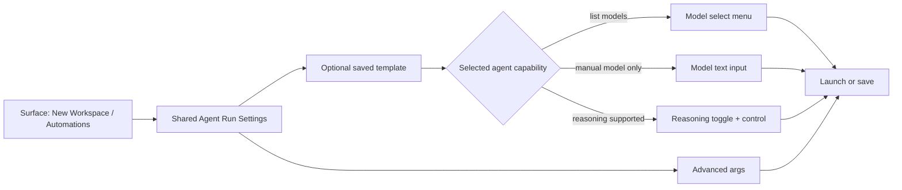

# PRD · APP-024: Terminal Agent Run Config

> Product Requirements · WHAT and WHY. Settled direction for shared per-run terminal-agent configuration across New Workspace and Automations.

## Context

- **Problem**: Atmos lets users pick a terminal agent, but not reliably choose a per-run model, reasoning depth, advanced native CLI args, or reusable run-config templates. The workaround is to edit `~/.atmos/agent/terminal_code_agent.json` or clone multiple custom agents with different flags.
- **Why now**: APP-017 Automations needs non-default agent models without mutating global CLI defaults, and the same capability belongs in the New Workspace flow. If Atmos solves this only inside Automations, the next terminal-agent-backed surface will repeat the same design problem.
- **Product direction**: Treat agent run settings as a shared product capability, not an automation-only field set. Static built-in agent capability facts live in `resources/terminal-agents/builtin_agents.json`. User-saved reusable run-config templates live in Settings / Code Agent and persist in `function_settings.json`.
- **Related specs**:
  - [APP-017 Atmos Automations](../APP-017_atmos-automations/PRD.md)
  - [APP-004 Local Agent Integration](../APP-004_local-agent-integration-acp/TECH.md)
  - [APP-015 Canvas Terminal Agent Integration](../APP-015_canvas-terminal-agent-integration/PRD.md) as a future consumer, not an M1 dependency

## Goals

1. **Primary**: Let users choose non-default terminal-agent model / reasoning settings for a specific run without editing global agent defaults.
2. **Primary**: Make the capability reusable across multiple terminal-agent-backed surfaces, starting with New Workspace and Automations.
3. **Secondary**: Let users save and reuse Code Agent Run Config templates from Settings.
4. **Secondary**: Preserve an advanced override path for one-off native CLI flags without forcing users to maintain duplicate custom agent definitions.

### Shared run-settings flow

## Users & Scenarios

- **Primary persona**: Agentic Builder who already uses terminal agents and wants better control over which model actually runs.
- **Secondary persona**: Remote Computer operator who expects model availability and CLI capabilities to reflect the connected Atmos Computer, not the browser machine.

### Key scenarios

1. A user creates a workspace from the welcome flow, chooses Cursor Agent, selects a non-default model from a live model list, and wants the first terminal session to open with that exact model.
2. A user creates an automation with Claude Code, selects a specific model and high effort, and expects every scheduled run to use that configuration without editing global CLI flags.
3. A user saves a reusable run-config template such as `Claude Sonnet High` in Settings / Code Agent, then reuses it from both New Workspace and Automations.
4. A user selects Codex, which supports manual `--model` but does not expose a reliable model list, and wants to type a model string directly.
5. A user unchecks structured model or reasoning controls and intentionally supplies those flags through advanced args instead.
6. A user connected to a remote Atmos Computer expects the visible agent capabilities and model lists to come from the remote Computer's installed CLIs and credentials.
7. A user keeps the existing single Agent button in the composer UI, hovers it to confirm the active model / reasoning / extra-args summary, and opens per-agent configuration from the agent picker without adding new inline controls to the main layout.

## User Stories

- As a terminal-agent user, I want to choose a specific model for one run, so that I do not have to rewrite my global agent defaults.
- As an automation user, I want my selected model and reasoning settings saved with the automation, so that unattended runs behave predictably.
- As a New Workspace user, I want the first launched agent terminal to honor the model and advanced args I selected in the setup UI.
- As a user of agents with different CLI semantics, I want Atmos to show me a select menu, text input, or no control based on what that agent actually supports.
- As a user, I want to manage reusable run-config templates in Settings / Code Agent instead of recreating the same model / reasoning selections every time.
- As a user of custom agents, I want an advanced override path even when Atmos cannot fully understand the agent's native schema.

## Functional Requirements

### Must Have

- **M1 · Shared run-settings concept**: Atmos defines one reusable **Terminal Agent Run Config** concept for terminal-agent-backed actions. It includes:
  - selected `agent_id`
  - optional structured model field
  - optional structured reasoning field
  - optional advanced args

- **M2 · Initial surface coverage**: The first release wires the shared run-settings capability into:
  - the **New Workspace** flow
  - the **Automations** setup flow from APP-017

  Future surfaces should adopt the same capability instead of inventing their own agent-setting schema, but they are not required for M1.

- **M3 · Settings management for saved run configs**: Settings / Code Agent includes a **Code Agent Run Configs** management section where users can:
  - create a saved run-config template
  - edit a saved run-config template
  - delete a saved run-config template

- **M4 · Saved-template reuse**: In New Workspace and Automations, users can start from:
  - a blank/default run config
  - or a saved run-config template for the selected agent

  Selecting a saved template pre-fills the form, but editing the current run does not silently mutate the saved template.
  In the Automation editor, the saved-template picker and structured agent-settings area also expose hover help that explains the automation stores its own run-config snapshot, so later saved-template edits do not automatically update that automation.
  M1 default tooltip copy is:
  `Saved configs are starting templates. This automation saves its own agent run settings, so later changes to the saved config won't update this automation automatically.`

- **M5 · Capability-aware agent metadata**: Atmos can resolve, for each available built-in terminal agent on the connected Computer, whether it supports:
  - interactive launch
  - non-interactive automation execution
  - explicit model selection
  - live model listing
  - separate reasoning / thinking controls

  Static built-in capability metadata and list-model command metadata come from `resources/terminal-agents/builtin_agents.json`, while runtime availability still depends on the connected Computer.

- **M6 · Model selection UX**:
  - If the selected agent supports live model listing and listing succeeds, the user gets a **select menu** of models.
  - If the selected agent supports explicit model selection but model listing is unsupported, unavailable, or fails, the user gets a **text input** for the model id.
  - If the selected agent does not support explicit model selection, Atmos does not show a structured model field.

- **M7 · Optional structured model / reasoning controls**:
  - Structured **model** and **reasoning** controls are optional, not mandatory.
  - The UI exposes them with explicit opt-in controls such as checkboxes or toggles.
  - If a user turns a structured control off, Atmos clears that structured field and lets the user handle the equivalent native flags through advanced args if they choose.

- **M8 · Advanced args escape hatch**: Users can optionally provide advanced per-run CLI args for a specific automation or New Workspace launch without editing the global agent definition in `terminal_code_agent.json`.

- **M9 · Conflict validation and safety**:
  - Atmos validates run settings before save or launch.
  - If a structured model field is enabled, advanced args cannot also provide the same agent's model flag.
  - If a structured reasoning field is enabled, advanced args cannot also provide the same reasoning flag family.
  - Atmos rejects advanced args that would override Atmos-required prompt delivery, output parsing, or execution-mode behavior.

- **M10 · Persistence and inspectability**:
  - Saved run-config templates are stored in `function_settings.json` under the existing user settings scope.
  - Automations persist their effective run settings as part of the automation definition.
  - Automation run history shows the effective run-settings snapshot used for that run.
  - The New Workspace flow carries its selected run settings through to the first agent terminal launch for that workspace.
  - Automation setup copy makes it clear that saved templates are reusable starting points, while the automation itself saves its own effective snapshot.

- **M11 · Failure handling and fallback**:
  - If live model listing fails, Atmos shows actionable copy and falls back safely where possible instead of blocking the entire setup flow.
  - If an agent is unsupported for a given surface, Atmos disables or hides the incompatible controls with explanatory copy.

- **M12 · Backward compatibility**:
  - Existing automation definitions with only `agent_id` continue to run using current defaults.
  - Existing New Workspace flows that do not set run settings continue to launch the default agent command as they do today.

- **M13 · Shared entry interaction**:
  - New Workspace and Automation setup keep a single always-visible **Agent icon button** as the main entry point; M1 does not add a second visible Run Config button, chip, or inline field group to those composer layouts.
  - Hovering or focusing the current Agent button shows a compact run-config summary tooltip for the selected agent.
  - The summary tooltip shows only the active segments in this order: `Agent label · model · reasoning · N Extra args`.
  - Example summary: `Cursor · Claude Sonnet 4.8 · High · 2 Extra args`.
  - Clicking the Agent button opens the existing agent picker.
  - Each agent item in that picker exposes a secondary **Config** icon button on the right side for configuring run settings for that specific agent.
  - The picker's primary item click continues to select the agent itself; the per-item Config action opens the agent run-config editor for that agent.

### Nice to Have

- **N1 · Code Review adoption**: Reuse the same capability in the Code Review flow as the next adopting surface after M1.
- **N2 · Wider surface adoption**: Reuse the same capability in other terminal-agent-backed flows such as Wiki or Canvas terminal-agent entry points.
- **N3 · Custom-agent capability hints**: Let advanced users declare model / reasoning capability hints for custom agents inside `terminal_code_agent.json`.
- **N4 · Manual refresh controls**: Add explicit refresh / retry for live model catalogs when a CLI login state changes mid-session.

## Out of Scope

- **Full raw command editing in normal setup flows** — M1 provides structured settings plus advanced args, not a full command editor as the primary path.
- **Universal per-agent dynamic schemas** — Atmos does not attempt to expose every native CLI flag as a first-class form field in M1.
- **Hosted model catalog normalization** — Atmos does not build a hosted provider model registry; it asks the installed local/remote CLIs directly.
- **Cross-Computer sync of saved run-config templates** — templates are user-local to the connected Atmos Server in M1.
- **Removing `terminal_code_agent.json` customization** — global command overrides remain supported; M1 only adds a per-run layer above them.

## Success Metrics

- **Leading**: Users can create or edit an automation with an explicit non-default model without cloning a second agent definition.
- **Leading**: Users can launch a New Workspace session with an explicit non-default model from the setup UI.
- **Leading**: Users can create, reuse, and edit saved run-config templates in Settings / Code Agent.
- **Leading**: Supported agents show either a model select menu, model text input, or a clear unsupported state instead of exposing a one-size-fits-none control.
- **Qualitative**: Users describe the feature as “pick the model I want for this run” rather than “edit the code-agent config file first”.
- **Qualitative**: Internal dogfood stops depending on duplicated agent definitions solely for model switching.

## Risks & Open Questions

- **Risk**: Agent CLIs change flags or list-model output formats, which can break structured controls.
- **Risk**: Some CLIs require authentication or have slow model-list commands, making live catalogs uneven across agents.
- **Risk**: Custom agents cannot all be modeled cleanly with the shared fields, so the advanced-args escape hatch must stay understandable.
- **Risk**: Users may expect every terminal-agent-backed surface to adopt the shared settings immediately; M1 only commits New Workspace and Automations.
- **Open**: How far should structured support go for custom agents before Atmos should rely on advanced args only?

## Milestones

- **Phase 1 · Shared capability foundation**: Shared run-settings schema, built-in capability metadata in `resources`, saved run-config templates in Settings, model-selection fallback behavior, New Workspace integration, and Automation integration.
- **Phase 2 · Reuse and ergonomics**: Code Review adoption first, then broader surface reuse, better custom-agent capability hints, and richer model-catalog refresh behavior.
