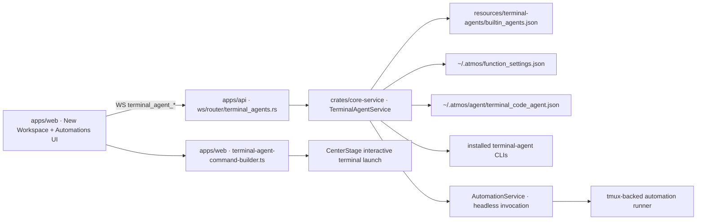

# TECH · APP-024: Terminal Agent Run Config

> Technical Design · HOW. Implements PRD APP-024: Terminal Agent Run Config.

## Scope summary

APP-024 adds a shared **Terminal Agent Run Config** layer above the existing terminal-agent manifest and custom agent settings. It introduces:

- static built-in capability and list-model metadata in `resources/terminal-agents/builtin_agents.json`
- reusable saved run-config templates stored in `function_settings.json`
- shared web UI controls for New Workspace and APP-017 Automations
- invocation builders for both interactive New Workspace launches and non-interactive APP-017 automation runs
- conflict validation between structured model / reasoning fields and `extra_args`

This design addresses PRD M1-M12. Code Review adoption, custom-agent capability hints, and broader surface reuse remain deferred.

## Product decisions resolved in TECH

| PRD fork | Decision |
|----------|----------|
| M1 surface scope | Ship the shared capability in **New Workspace** and **Automations** only. Code Review is the first planned follow-up surface. |
| Static vs. user-owned data | Built-in capability metadata lives in `resources/terminal-agents/builtin_agents.json`. User-saved reusable run-config templates live in `function_settings.json` under `agent_cli.saved_run_configs`. |
| Template persistence | Saved templates are reusable seeds for form state. Automations persist a full run-config snapshot and do not depend on a mutable template reference at execution time. |
| Structured field toggles | Structured `model` and `reasoning` are UI-level opt-in fields. Persisted config stores only the resulting values; unchecked fields are saved as absent / null. |
| Advanced args format | Persist and validate advanced args as argv tokens (`string[]`), not raw shell fragments. |
| Extra-args conflict policy | If structured model or reasoning is enabled, the equivalent flags are blocked in `extra_args`. If structured fields are absent, users may provide those flags manually through `extra_args`. |
| Custom agents in M1 | Custom agents remain **advanced-args-first** in M1 unless a later feature adds explicit capability hints for them. |
| Automation snapshot UX | Automation setup shows a hover tooltip near the saved-template picker and/or structured model section explaining that the automation saves its own run-config snapshot and does not live-bind to later template edits. Reuse one canonical M1 copy string so the message stays consistent across create and edit flows. |
| `opencode` live catalog | Treat `opencode` as manual-model-input in M1. Its advertised `models` command is not yet reliable enough for a first-class live catalog path. |

## Architecture overview



Key design fact: capability and model-catalog probing happen server-side on the connected Atmos Computer, but interactive terminal commands for New Workspace are still compiled client-side before Center Stage opens a terminal. APP-024 therefore needs:

- one shared **data model**
- one shared **capability registry**
- one shared **saved-template settings store**
- two **mode-specific invocation builders**

For Automations specifically, the UI must surface snapshot semantics at selection time instead of expecting users to infer them from persistence behavior. The cheapest M1 implementation is a hover tooltip attached to the saved-template control, with optional duplicate placement near the structured model / reasoning section if that tests clearer in the form layout.

Canonical M1 tooltip copy:

`Saved configs are starting templates. This automation saves its own agent run settings, so later changes to the saved config won't update this automation automatically.`

## Layer and file plan

### resources/terminal-agents

Keep `resources/terminal-agents/builtin_agents.json` as the base command manifest and extend it with static capability metadata for built-in agents.

Example shape:

```json
{
  "id": "cursor",
  "label": "Cursor Agent",
  "cmd": "agent",
  "params": "--force --print --trust --output-format stream-json --stream-partial-output",
  "interactiveParams": "--force",
  "promptStrategy": "arg",
  "stdoutParser": "cursor_stream_json",
  "modelSupport": "explicit",
  "reasoningSupport": {
    "mode": "encoded_in_model"
  },
  "modelList": {
    "supported": true,
    "command": ["agent", "--list-models"],
    "parser": "cursor_lines"
  }
}
```

Static metadata in `resources` covers only built-in facts that are safe to commit:

- whether the built-in agent supports structured model selection
- whether the built-in agent supports structured reasoning / effort selection
- whether the built-in agent exposes a model-list command
- what command argv to use for model listing
- what parser key to use for the returned output

`resources` does **not** store:

- user-saved run-config templates
- live model-catalog cache data
- automation-specific selections
- New Workspace one-shot selections

### crates/core-service

Add a new shared terminal-agent service area instead of keeping APP-017 logic buried inside `automation/agents.rs`:

```text
crates/core-service/src/service/terminal_agents/
  mod.rs
  adapters.rs
  capabilities.rs
  models.rs
  saved_configs.rs
  invocation.rs
  terminal_agent_manifest.rs
```

`crates/core-service/src/service/automation/agents.rs` becomes a thin wrapper over the new shared service or is removed after the callers migrate.

Core shared types:

```rust
#[derive(Debug, Clone, Serialize, Deserialize, Default)]
pub struct TerminalAgentRunConfig {
    pub model: Option<String>,
    pub reasoning: Option<TerminalAgentReasoningSelection>,
    #[serde(default)]
    pub extra_args: Vec<String>,
}

#[derive(Debug, Clone, Serialize, Deserialize)]
pub struct TerminalAgentReasoningSelection {
    pub mode: TerminalAgentReasoningMode,
    pub value: String,
}

#[derive(Debug, Clone, Copy, Serialize, Deserialize, PartialEq, Eq)]
#[serde(rename_all = "snake_case")]
pub enum TerminalAgentReasoningMode {
    None,
    Enum,
    Manual,
    EncodedInModel,
}

#[derive(Debug, Clone, Serialize, Deserialize, Default)]
pub struct TerminalAgentReasoningSupport {
    pub mode: TerminalAgentReasoningMode,
    pub arg: Option<String>,
    pub options: Vec<String>,
    pub placeholder: Option<String>,
    pub value_style: TerminalAgentReasoningValueStyle,
}

#[derive(Debug, Clone, Copy, Serialize, Deserialize, PartialEq, Eq)]
#[serde(rename_all = "snake_case")]
pub enum TerminalAgentReasoningValueStyle {
    Value,
    FlagOnly,
}

#[derive(Debug, Clone, Copy, Serialize, Deserialize, PartialEq, Eq)]
#[serde(rename_all = "snake_case")]
pub enum TerminalAgentModelInputMode {
    None,
    Manual,
    Catalog,
}
```

Saved template type:

```rust
#[derive(Debug, Clone, Serialize, Deserialize)]
pub struct TerminalAgentSavedRunConfig {
    pub id: String,
    pub name: String,
    pub agent_id: String,
    pub config: TerminalAgentRunConfig,
}
```

Capability DTO:

```rust
pub struct TerminalAgentCapability {
    pub agent_id: String,
    pub label: String,
    pub installed: bool,
    pub interactive_supported: bool,
    pub automation_supported: bool,
    pub model_input_mode: TerminalAgentModelInputMode,
    pub reasoning_mode: TerminalAgentReasoningMode,
    pub supports_extra_args: bool,
    pub unavailable_reason: Option<String>,
}
```

Model catalog DTO:

```rust
pub struct TerminalAgentOptions {
    pub agent_id: String,
    pub status: TerminalAgentOptionsStatus,
    pub models: Vec<TerminalAgentOption>,
    pub message: Option<String>,
    pub source: TerminalAgentOptionsSource,
}
```

Trait / adapter pattern:

```rust
pub trait TerminalAgentAdapter: Send + Sync {
    fn supports_agent(&self, agent_id: &str) -> bool;
    fn capability_overrides(&self) -> TerminalAgentAdapterCapabilities;
    fn list_models(&self, executable: &str, spec: &TerminalAgentModelListSpec) -> Result<TerminalAgentOptions>;
    fn build_structured_args(
        &self,
        mode: TerminalAgentInvocationMode,
        run_config: &TerminalAgentRunConfig,
    ) -> Result<Vec<String>>;
    fn conflicting_extra_args(
        &self,
        mode: TerminalAgentInvocationMode,
        run_config: &TerminalAgentRunConfig,
        extra_args: &[String],
    ) -> Result<()>;
    fn reserved_flags(&self, mode: TerminalAgentInvocationMode) -> &'static [&'static str];
}
```

The adapter owns only agent-specific behavior:

- how to list models
- how to parse list-model output
- how to map structured `model` and `reasoning` into flags
- which extra args conflict with structured fields
- which flags are fully reserved and cannot be overridden

The generic service owns:

- loading built-in and custom definitions
- loading and saving reusable templates from function settings
- installed / enabled checks
- surface-specific support filtering
- shared validation and shell-word parsing
- combining base manifest args with adapter-produced args

### apps/api

Add a generic WebSocket router instead of keeping model / capability probing inside the automation router:

```text
apps/api/src/api/ws/router/terminal_agents.rs
```

Add WS actions in `apps/api/src/api/ws/message.rs`:

- `TerminalAgentCapabilitiesGet`
- `TerminalAgentModelsGet`

Request shapes:

```ts
type TerminalAgentCapabilitiesGetRequest = {
  purpose: "interactive" | "automation";
};

type TerminalAgentModelsGetRequest = {
  agent_id: string;
  refresh?: boolean;
};
```

Response shapes:

```ts
type TerminalAgentCapability = {
  agent_id: string;
  label: string;
  installed: boolean;
  interactive_supported: boolean;
  automation_supported: boolean;
  model_input_mode: "none" | "manual" | "catalog";
  reasoning_mode: "none" | "enum" | "manual" | "encoded_in_model";
  supports_extra_args: boolean;
  unavailable_reason: string | null;
};

type TerminalAgentOption = {
  id: string;
  label: string;
  group?: string | null;
  is_default?: boolean;
};

type TerminalAgentOptions = {
  agent_id: string;
  status: "ok" | "unsupported" | "auth_required" | "error";
  models: TerminalAgentOption[];
  message: string | null;
  source: "live" | "cache";
};
```

No new REST route is added. Capability and catalog probing belong to the existing WebSocket-first application shell.

### function_settings.json and settings APIs

Reuse the existing function-settings path instead of creating a new top-level file:

- `apps/web/src/api/ws/settings-api.ts`
- `apps/web/src/features/settings/store/function-settings-store.ts`
- `apps/api/src/api/ws/router/settings.rs`

Extend `FunctionSettings` with an `agent_cli` section:

```ts
interface FunctionSettings {
  agent_cli?: {
    center_fix_terminal_default_agent?: string;
    saved_run_configs?: TerminalAgentSavedRunConfig[];
  };
}
```

No dedicated CRUD WS actions are required in M1. The existing `function_settings_get` and `function_settings_update` flow is sufficient:

- read full `agent_cli.saved_run_configs`
- update the saved template array as a single value

### apps/web · Settings / Code Agent

Extend the existing settings area rather than adding a separate product surface:

- `apps/web/src/features/settings/components/CodeAgentSettingsSection.tsx`

Add a third management section after Built-in Agents and Custom Agents:

- **Saved Run Configs**

This section supports:

- create template
- edit template
- delete template

Suggested implementation split:

```text
apps/web/src/features/settings/components/
  CodeAgentSettingsSection.tsx
  CodeAgentRunConfigSettingsSection.tsx
```

Each saved template row shows:

- template name
- agent label
- short summary of configured model / reasoning / advanced args

Editing uses the same shared form logic as New Workspace and Automations, but in a settings-management wrapper.

### apps/web · shared run-config UI

Add a shared UI / builder feature instead of duplicating agent-config behavior across Welcome and Automations:

```text
apps/web/src/features/agent-run-config/
  components/
    AgentRunConfigForm.tsx
    AgentRunConfigTemplatePicker.tsx
    AgentModelField.tsx
    AgentReasoningField.tsx
    AgentAdvancedArgsField.tsx
  hooks/
    use-terminal-agent-capabilities.ts
    use-terminal-agent-model-catalog.ts
  lib/
    terminal-agent-command-builder.ts
    terminal-agent-run-config.ts
    terminal-agent-run-config-validation.ts
```

This shared feature is used by:

- `apps/web/src/features/welcome/components/WelcomePage.tsx`
- `apps/web/src/features/automations/components/AutomationSetup.tsx`
- `apps/web/src/features/settings/components/CodeAgentRunConfigSettingsSection.tsx`

The shared form behavior is:

- select an agent
- optionally select a saved template for that agent
- optionally enable `model`
- optionally enable `reasoning`
- edit `extra_args`

UI note: the model and reasoning toggles are view-state only. Persisted config simply stores the resulting `model` / `reasoning` values or `null` / absent values.

### apps/web · New Workspace flow

Current path:

- `WelcomePage.tsx` creates the workspace
- `queueAgentRun(...)` stores a pending client-side launch request
- `CenterStage.tsx` consumes the request and opens the terminal

Change that path to carry structured run config instead of a prebuilt command string.

Update:

- `apps/web/src/features/workspace/store/workspace-creation-store.ts`

Replace:

```ts
command?: string;
```

with:

```ts
agentRunConfig?: TerminalAgentRunConfigInput | null;
```

Pending launch shape:

```ts
type PendingWorkspaceAgentRun = {
  workspaceId?: string | null;
  projectId?: string | null;
  prompt: string;
  agent?: {
    id: string;
    label: string;
    command: string;
    iconType: "built-in" | "custom";
  };
  agentRunConfig?: TerminalAgentRunConfigInput | null;
  createdAt: number;
};
```

`WelcomePage.tsx`:

- keeps selecting an agent id as today
- adds shared run-settings controls via `AgentRunConfigForm`
- loads reusable templates from `function_settings_get`
- queues structured run config instead of flattening everything into `launchCommand`

`CenterStage.tsx`:

- resolves the selected agent and current custom settings
- calls `terminal-agent-command-builder.ts`
- appends the prompt using the existing prompt-strategy semantics
- opens the interactive terminal with the final command

### apps/web · Automations

Replace the automation-specific capability model with the shared one:

- `apps/web/src/features/automations/hooks/use-automations.ts`
- `apps/web/src/features/automations/hooks/use-automation-setup-form.ts`
- `apps/web/src/features/automations/components/AutomationSetup.tsx`
- `apps/web/src/features/automations/components/AutomationAgentPicker.tsx`

Automation UI behavior:

- load `TerminalAgentCapability[]` with `purpose = "automation"`
- render shared `AgentRunConfigForm`
- allow a saved-template picker that pre-fills form state
- persist `agent_id + agent_config` snapshot
- keep APP-017's unsupported-agent messaging, but derive it from the shared capability DTO

### apps/web · command builder

Add `apps/web/src/features/agent-run-config/lib/terminal-agent-command-builder.ts`.

It replaces ad hoc command concatenation in:

- `apps/web/src/features/wiki/components/AgentSelect.tsx`
- `apps/web/src/features/welcome/hooks/use-welcome-agent-options.ts`
- `apps/web/src/app-shell/CenterStage.tsx`

Builder responsibilities:

- resolve built-in defaults from `TERMINAL_AGENT_DEFINITIONS`
- apply custom `cmd` / `flags` overrides from `code_agent_custom_get`
- apply structured `model` / `reasoning` when present
- apply validated `extra_args`
- append the prompt according to the agent's interactive prompt strategy

The interactive web builder and the Rust headless builder are intentionally separate implementations because they run in different runtimes. To control drift:

- both consume the same manifest capability metadata
- both use adapter-specific fixtures for expected argv output
- tests assert parity for a representative matrix of built-in agents

## Built-in agent coverage in M1

M1 does not need identical behavior across every built-in agent. It needs consistent UI semantics backed by verified adapters.

| Agent id | Structured model in M1 | Live model catalog in M1 | Structured reasoning in M1 |
|----------|------------------------|--------------------------|----------------------------|
| `cursor` | yes | yes (`agent --list-models`) | encoded in model id |
| `kiro` | yes | yes (`kiro-cli chat --list-models --format json`) | none |
| `commandcode` | yes | yes (`cmd --list-models`) | none |
| `kilocode` | yes | yes (`kilo models`) | `variant` |
| `pi` | yes | yes (`pi --list-models`) with auth-aware fallback | `thinking` |
| `claude` | yes | no | `effort` |
| `codex` | yes | no | none |
| `gemini` | yes | no | none |
| `devin` | yes | no | none |
| `droid` | yes | no first-class live catalog | `effort` |
| `kimi` | yes | no | `thinking` |
| `amp` | no structured model field in M1 | no | `effort` |
| `opencode` | yes | no first-class live catalog in M1 | `variant` |
| unknown custom agent | no structured model field | no | none |

This table is a runtime policy, not a user-facing promise that every CLI behaves identically.

## Module-by-module design

### crates/core-service · terminal agent service

Main entrypoints:

```rust
pub fn terminal_agent_capabilities(
    purpose: TerminalAgentInvocationMode,
) -> Result<Vec<TerminalAgentCapability>>;

pub fn terminal_agent_options(
    agent_id: &str,
    refresh: bool,
) -> Result<TerminalAgentOptions>;

pub fn saved_terminal_agent_run_configs() -> Result<Vec<TerminalAgentSavedRunConfig>>;
pub fn save_terminal_agent_run_configs(configs: &[TerminalAgentSavedRunConfig]) -> Result<()>;

pub fn build_interactive_terminal_command(
    agent_id: &str,
    run_config: &TerminalAgentRunConfig,
    prompt: &str,
) -> Result<String>;

pub fn build_automation_invocation(
    agent_id: &str,
    run_config: &TerminalAgentRunConfig,
    input: AutomationCommandInput,
) -> Result<AutomationAgentInvocation>;
```

Validation rules:

- `model` is allowed only when the agent's `model_input_mode != none`
- `reasoning` is allowed only when the selected agent's `reasoning_mode` matches the provided `reasoning.mode`
- the actual reasoning arg name, value style, and any fixed options come from that agent's `reasoningSupport` metadata in `resources`
- `extra_args` must already be tokenized or parseable into a token array
- `extra_args` cannot include reserved flags such as prompt-delivery flags, output-format flags, or mode-switching flags required by Atmos for the target invocation mode
- if `model` is present, adapter-specific model flags are rejected from `extra_args`
- if `reasoning` is present, adapter-specific reasoning flags are rejected from `extra_args`
- empty strings are normalized away before persistence

Server-side model catalogs are cached in memory for 5 minutes per agent id. Cache is best-effort only:

- `refresh = true` bypasses cache
- failed catalog probes do not poison the cache for longer than a short TTL
- catalogs are never persisted to disk in M1

Error mapping:

- unsupported agent / unsupported catalog -> `status = "unsupported"`
- CLI auth missing / catalog intentionally unavailable due to auth state -> `status = "auth_required"`
- command timeout / parse failure -> `status = "error"`

### apps/api · WS routing

`apps/api/src/api/ws/router/terminal_agents.rs` calls the shared service and returns JSON DTOs to the web shell.

Automation request DTOs are extended in `apps/api/src/api/ws/message.rs`:

```ts
type TerminalAgentRunConfigInput = {
  model?: string | null;
  reasoning?: {
    mode: "effort" | "thinking" | "variant";
    value: string;
  } | null;
  extra_args?: string[];
};

type AutomationCreateRequest = {
  display_name: string;
  instructions: string;
  agent_id: string;
  agent_config?: TerminalAgentRunConfigInput | null;
  target: AutomationTargetInput;
  schedule?: AutomationScheduleInput | null;
  trigger?: AutomationTriggerInput | null;
};
```

`AutomationUpdateRequest`, `AutomationDetail`, and `AutomationRunSummary` get corresponding `agent_config` or `agent_config_snapshot` fields.

### crates/infra

No new generic table is needed in M1. Persistence is required only for APP-017 automation definitions and runs.

Add migration after `m20260607_000029_add_automation_run_agent_snapshot.rs`:

```text
crates/infra/src/db/migration/m20260609_000030_add_automation_agent_run_config.rs
```

Schema changes:

```sql
ALTER TABLE automation
ADD COLUMN agent_config_json TEXT NULL;

ALTER TABLE automation_run
ADD COLUMN agent_config_json TEXT NULL;
```

Notes:

- Keep `agent_id` and `agent_label` as independent queryable columns.
- Store the full run-settings snapshot in `agent_config_json` for run history and debugging.
- Existing rows remain valid with `NULL` config and continue to use current defaults.

Update entities and repo methods:

- `crates/infra/src/db/entities/automation.rs`
- `crates/infra/src/db/entities/automation_run.rs`
- `crates/infra/src/db/repo/automation_repo.rs`

### function_settings.json data model

Extend the existing settings shape rather than inventing a second user-settings file:

```json
{
  "agent_cli": {
    "center_fix_terminal_default_agent": "codex",
    "saved_run_configs": [
      {
        "id": "cfg_claude_sonnet_high",
        "name": "Claude Sonnet High",
        "agent_id": "claude",
        "config": {
          "model": "claude-sonnet-4.6",
          "reasoning": {
            "mode": "effort",
            "value": "high"
          },
          "extra_args": []
        }
      }
    ]
  }
}
```

Saved-template rules:

- `name` is user-visible and required.
- `agent_id` is required.
- `config` is the same shape used by New Workspace and Automations.
- deleting a template does not mutate existing automation definitions or run history.

### apps/web · Settings / Code Agent saved-template management

In `CodeAgentSettingsSection.tsx`, add a saved-template section with:

- list rows
- add button
- edit button
- delete button
- save button for dirty edits

A template editor uses the shared `AgentRunConfigForm` in a settings-specific wrapper. Template creation flow:

1. choose `agent_id`
2. choose template `name`
3. optionally enable structured `model`
4. optionally enable structured `reasoning`
5. add `extra_args`
6. save back into `agent_cli.saved_run_configs`

### apps/web · shared run-config form behavior

`AgentRunConfigForm` props should include:

```ts
type AgentRunConfigFormProps = {
  purpose: "interactive" | "automation";
  selectedAgentId: string;
  value: TerminalAgentRunConfigInput;
  savedTemplates: TerminalAgentSavedRunConfig[];
  onChange: (value: TerminalAgentRunConfigInput) => void;
  onSelectTemplate: (templateId: string | null) => void;
};
```

Behavior:

- templates are filtered by `agent_id`
- selecting a template hydrates current form state from the saved template
- modifying the hydrated fields does not change the saved template unless the user is in Settings and explicitly saves it there
- model checkbox off -> `value.model = null`
- reasoning checkbox off -> `value.reasoning = null`

`AgentAdvancedArgsField` may use a textarea or tokenized input, but normalization must happen before persistence or launch. Persisted value is always `string[]`.

## Data model

### Shared frontend shape

```ts
type TerminalAgentRunConfigInput = {
  model?: string | null;
  reasoning?: {
    mode: "effort" | "thinking" | "variant";
    value: string;
  } | null;
  extra_args?: string[];
};

type TerminalAgentSavedRunConfig = {
  id: string;
  name: string;
  agent_id: string;
  config: TerminalAgentRunConfigInput;
};
```

### Shared Rust shape

```rust
#[derive(Debug, Clone, Serialize, Deserialize, Default)]
pub struct TerminalAgentRunConfig {
    pub model: Option<String>,
    pub reasoning: Option<TerminalAgentReasoningSelection>,
    #[serde(default)]
    pub extra_args: Vec<String>,
}

#[derive(Debug, Clone, Serialize, Deserialize)]
pub struct TerminalAgentSavedRunConfig {
    pub id: String,
    pub name: String,
    pub agent_id: String,
    pub config: TerminalAgentRunConfig,
}
```

### Automation persistence

```sql
ALTER TABLE automation
ADD COLUMN agent_config_json TEXT NULL;

ALTER TABLE automation_run
ADD COLUMN agent_config_json TEXT NULL;
```

Example automation definition snapshot:

```json
{
  "model": "claude-sonnet-4.6",
  "reasoning": {
    "mode": "effort",
    "value": "high"
  },
  "extra_args": ["--allowed-tools", "Bash(git *) Edit"]
}
```

## Transport

### WebSocket messages

New generic messages:

```ts
// request
{ action: "terminal_agent_capabilities_get", payload: { purpose: "interactive" } }

// response
{ action: "terminal_agent_capabilities_get", payload: { agents: TerminalAgentCapability[] } }

// request
{ action: "terminal_agent_models_get", payload: { agent_id: "cursor", refresh: false } }

// response
{ action: "terminal_agent_models_get", payload: TerminalAgentOptions }
```

Extended automation messages:

- `automation_create`
- `automation_update`
- `automation_get`
- `automation_run_get`

Each gains `agent_config` or `agent_config_snapshot` where appropriate.

No dedicated template CRUD WS actions are added in M1. Saved-template management reuses:

- `function_settings_get`
- `function_settings_update`

### No REST

Do not add a REST route for this feature. Capability probing, settings updates, and automation definition changes belong to the existing WS channel.

## Security & validation

- Model catalog probing runs on the connected Atmos Server, not in the browser, so remote Computer installs and credentials are respected.
- `extra_args` are validated before persistence or launch. Reserved flags differ by mode and adapter.
- Users may add advanced args, but they may not override Atmos-required:
  - prompt delivery flags
  - output parser flags
  - invocation-mode flags such as `--print`, `--prompt`, `--json`, or other reserved non-interactive controls
- If structured `model` is present, `extra_args` may not also contain the adapter's model flag.
- If structured `reasoning` is present, `extra_args` may not also contain the adapter's reasoning flag family.
- If structured `model` or `reasoning` is absent, users may supply the native flags through `extra_args` instead.
- Catalog probing uses a bounded timeout such as 8 seconds. Long-running or hung CLIs must not freeze the UI indefinitely.
- Catalog results are metadata only. Atmos does not persist secrets, auth tokens, or full CLI output from model-list commands.

## Rollout plan

1. Extend `resources/terminal-agents/builtin_agents.json` with static capability and model-list metadata.
2. Introduce `crates/core-service/src/service/terminal_agents/` and migrate APP-017 automation resolution onto it without changing UI yet.
3. Add generic WS endpoints for terminal-agent capabilities and model catalogs in `apps/api`.
4. Extend `FunctionSettings` and Settings / Code Agent with saved run-config template management.
5. Add shared web `agent-run-config` UI and builder modules.
6. Wire the New Workspace flow (`WelcomePage` -> `workspace-creation-store` -> `CenterStage`) to carry structured run config instead of prebuilt commands.
7. Add automation schema columns and API DTO changes, then wire `AutomationSetup` to persist `agent_config` snapshots while reusing saved templates as form seeds.
8. Expose config snapshots in automation run detail and validation errors in the relevant forms.
9. Add adapter, parser, builder, template, and UI tests.

## Risks & tradeoffs

- **Dual-runtime builders**: interactive launches still compile commands in TypeScript, while automations compile invocations in Rust. Shared manifest metadata and fixture-based parity tests are required to control drift.
- **CLI drift**: agent CLIs can change flag names or model-list output formats. Keep adapters isolated and test them directly.
- **Catalog reliability**: some CLIs are slow, auth-sensitive, or poorly structured for machine parsing. M1 intentionally supports live catalogs only where the current CLI behavior is reliable enough.
- **Custom-agent partial parity**: custom agents cannot automatically inherit every shared control. M1 keeps them usable through advanced args rather than pretending full capability knowledge.
- **Validation strictness**: too weak and users can break invocation semantics; too strong and legitimate flags become impossible. Start with a conservative reserved-flag set and expand carefully.
- **Template drift**: if automations stored only template ids, later settings edits would silently rewrite behavior. M1 avoids that by persisting snapshots on automation definitions and runs.

Rollback path:

- Keep the shared capability endpoints read-only if launch integration regresses.
- Leave `agent_config_json` nullable and additive so old clients still work.
- New Workspace can temporarily fall back to current default-agent launch behavior if the shared builder path regresses.
- Saved-template UI can be hidden while preserving the underlying `agent_cli.saved_run_configs` data if the management UX regresses.

## Dependencies & compatibility

- Depends on APP-017 for the automation consumer.
- Reuses:
  - `resources/terminal-agents/builtin_agents.json`
  - `apps/web/src/features/agent/lib/terminal-agent-definitions.ts`
  - `apps/web/src/features/wiki/components/AgentSelect.tsx`
  - `apps/web/src/app-shell/CenterStage.tsx`
  - `apps/web/src/features/welcome/components/WelcomePage.tsx`
  - `apps/web/src/features/workspace/store/workspace-creation-store.ts`
  - `apps/web/src/features/settings/components/CodeAgentSettingsSection.tsx`
  - `apps/web/src/api/ws/settings-api.ts`
  - `apps/web/src/features/settings/store/function-settings-store.ts`
- Existing user overrides in `~/.atmos/agent/terminal_code_agent.json` remain authoritative for custom commands and base flags.
- Existing automations and New Workspace launches remain compatible with `NULL` / absent run config.

## Open questions

- Should model-catalog cache live only in memory, or is a short persisted cache worth the added complexity?
- If custom-agent capability hints land later, should they live in `terminal_code_agent.json` alongside custom agent definitions or in `function_settings.json`?
- When Code Review adopts this capability, should it reuse the exact same saved-template set or support surface-specific favorites?
