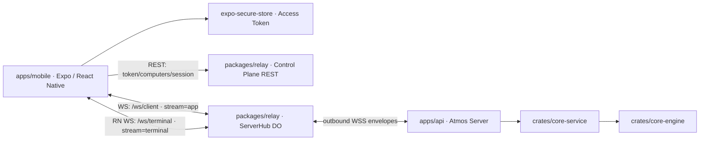

# TECH · APP-025: Mobile App

> Technical Design · HOW. Implements the APP-025 PRD direction for a real mobile Atmos client with terminal-first development and a minimal mobile Git Changes & Commit workflow.

## Scope summary

Build a real Expo / React Native mobile app at `apps/mobile` for independent agentic builders. M1 is a terminal-first client for a remote Atmos Computer: Access Token onboarding, Computer selection, workspace list home, remote-path project import, mobile-friendly create-workspace flow, terminal creation/attach, fixed terminal shortcuts, and a minimal Changes & Commit flow for changed-file diff review plus commit/push. The phone never runs `apps/api`; all business operations target a remote Atmos Server through APP-016 Relay.

Explicitly out of scope for M1:

- PWA or responsive mobile web.
- Full Web/Desktop parity.
- Right sidebar parity beyond Changes & Commit.
- Canvas, multi-pane desktop workspace layout, automations management, review UI, notes/TODO panels, PR panels, commit history, and broad settings.
- Offline data workflows.
- Special lost-phone security beyond Access Token reset/rotation.

## Decisions

| Fork | Decision |
|------|----------|
| Product route | Option A: terminal-first Expo MVP. |
| Standard UI | Use Expo UI native controls for app chrome, lists, forms, menus, sheets, dialogs, and settings where practical. |
| Terminal renderer | M1 uses a local WebView/xterm terminal island inside the native app. The surrounding shell remains native Expo UI. |
| Mobile terminal layout | Show exactly one active terminal at a time. Do not implement Web-style terminal tabs containing multiple mosaic windows. |
| Terminal over Relay | Add a dedicated relay terminal stream. Do not rely on the existing `/ws/terminal/{session_id}` direct URL in remote mode. |
| App data transport | Reuse APP-016 `/ws/client` for normal Atmos WS actions. Add no mobile-only business REST routes. |
| Control plane | Reuse existing Relay control-plane REST for Access Token registration, register tokens, Computer list, and client sessions. |
| Token storage | Store long-lived Access Token in `expo-secure-store`; keep short-lived relay `client_token` in memory and recreate it on app launch. |
| Workspace home | Workspace list is the first post-auth screen. Settings, Computer selection, and Access Token switching live in a settings drawer. |
| Project import | Remote server filesystem path selection through existing FS/project validation actions. |
| Mobile workspace create | Keep the default form short: Project, workspace title, and visible base branch. Put generated branch, GitHub Issue/PR import, priority, status, and labels behind advanced panels. |
| Mobile Git surface | Include only the Web right sidebar's Changes/files diff/commit slice: changed-file list, single-file diff, whole-file stage/unstage, commit message, commit, push, and refresh. Exclude right-sidebar commit history, PR, notes, TODO, review, AI commit-message generation, chunk patch controls, and discard flows in M1. |
| Settings Computer actions | M1 settings exposes Computer list/switching, rename, revoke, Access Token switch, and Access Token reset/rotation. |
| Terminal socket ownership | React Native owns the terminal WebSocket and forwards batched terminal bytes/events into the WebView renderer. The WebView never opens relay sockets. |
| Platform | M1 code targets iOS and Android from the start. Internal dogfood starts on iOS; Android still requires emulator smoke coverage before M1 acceptance. |

Why WebView for the terminal: terminal emulation is its own browser-grade rendering problem. xterm-style rendering already handles ANSI, selection, reflow, cursor behavior, and IME edge cases better than a fresh React Native renderer. The app still feels native because the terminal is isolated to one content surface and all controls around it are Expo UI.

## Architecture overview



Runtime shape:

```text
apps/mobile
  ├─ native Expo UI shell
  ├─ main app WS client       -> Relay /ws/client       -> apps/api ws_service
  ├─ terminal WS client       -> Relay /ws/terminal     -> apps/api TerminalService
  ├─ terminal WebView island  -> local xterm renderer only
  └─ control-plane client     -> Relay REST /v1/...     -> D1 / ServerHub
```

No new server-side product state is introduced. Projects, workspaces, terminal sessions, and tmux state remain owned by the selected Atmos Server.

## Module-by-module design

### apps/mobile

Create a new workspace app:

```text
apps/mobile/
  app.json
  babel.config.js
  metro.config.js
  package.json
  tsconfig.json
  app/
    _layout.tsx
    index.tsx
    onboarding.tsx
    settings.tsx
    workspace/[workspaceId].tsx
  src/
    api/
      control-plane-client.ts
      mobile-ws-client.ts
      terminal-ws-client.ts
      ws-actions.ts
      types.ts
    features/
      onboarding/
      computers/
      workspaces/
      projects/
      git/
        ChangesScreen.tsx
        ChangedFilesList.tsx
        FileDiffView.tsx
        CommitSheet.tsx
        git-store.ts
      terminal/
        TerminalScreen.tsx
        TerminalWebView.tsx
        TerminalShortcutBar.tsx
        terminal-shortcuts.ts
        webview/
          index.html
          terminal-bridge.ts
    providers/
      AppProviders.tsx
      query-client.ts
    stores/
      session-store.ts
      computer-store.ts
      terminal-store.ts
      ui-store.ts
    lib/
      access-token.ts
      relay-url.ts
      storage.ts
```

Dependencies:

- `expo`, `expo-router`
- `@expo/ui`
- `@tanstack/react-query`
- `react-hook-form`
- `zod`
- `zustand`
- `nativewind`
- `expo-secure-store`
- `expo-crypto`
- `expo-network`
- `react-native-webview`

Providers:

- `AppProviders.tsx`
  - `QueryClientProvider`
  - connection/session bootstrap
  - `expo-network` -> TanStack Query `onlineManager`
  - React Native `AppState` -> TanStack Query `focusManager`
- `session-store.ts`
  - Access Token load/save through `expo-secure-store`
  - selected Computer id and UI prefs through Zustand persist + AsyncStorage
  - relay client session kept in memory

Expo UI usage:

- Use Expo UI universal/native controls for lists, forms, buttons, menus, sheets, dialogs, and settings surfaces.
- Use NativeWind for surrounding layout, spacing, and terminal shell styling where Expo UI does not own the primitive.
- Do not recreate `@workspace/ui` shadcn components in mobile M1.

Screens:

- `app/onboarding.tsx`
  - Create or paste Access Token.
  - Register token on Relay through `POST /v1/tenants`.
  - Show guided Atmos Server startup/register instructions based on existing hosted web onboarding.
  - Poll/list Computers until at least one is online.
- `app/index.tsx`
  - Workspace list home.
  - Pull data through `project_workspace_bootstrap`.
  - Surface disconnected state when Relay/main WS is unavailable.
- `app/settings.tsx`
  - Settings drawer route.
  - Computer list/switching.
  - Computer rename and revoke.
  - Access Token switch/rotate/reset.
  - Control plane URL override for dev/staging.
- `app/workspace/[workspaceId].tsx`
  - Terminal-first workspace screen.
  - Terminal picker/switcher.
  - One active terminal renderer visible at a time.
  - New terminal action.
  - Fixed shortcut bar.
  - Changes & Commit action that opens the mobile Git surface for the current workspace/project repo.

Mobile Git surface:

- `features/git/ChangesScreen.tsx`
  - Native mobile screen or sheet reachable from the workspace/project development surface.
  - Shows staged, unstaged, and untracked sections.
  - Provides refresh, file diff open, stage/unstage, commit, and push actions.
- `features/git/ChangedFilesList.tsx`
  - Mobile-specific list optimized for phone scanning.
  - Reuses pure Git DTOs where practical; does not import Web `ChangeSection`.
- `features/git/FileDiffView.tsx`
  - Single-file diff view only.
  - Prioritizes readable inline/mobile-width rendering over desktop side-by-side review.
- `features/git/CommitSheet.tsx`
  - Commit message input.
  - Commit and push affordances with explicit loading/error states.
- `features/git/git-store.ts`
  - Zustand state for selected changed file, loaded diff, pending stage/commit/push actions, and local UI filters.

Do not reuse the Web right-sidebar shell. `apps/web/src/app-shell/RightSidebar.tsx`, Web editor open behavior, and desktop split/sidebar assumptions remain Web-owned. Mobile reuses the underlying Git WS semantics, not the desktop component hierarchy.

### packages/shared

Add pure shared DTO/type exports only if needed:

```text
packages/shared/src/api/
  atmos-ws-types.ts
  project-workspace-types.ts
  git-types.ts
```

Add a small terminal core package when implementation starts:

```text
packages/shared/src/terminal/
  protocol.ts
  snapshot.ts
  output.ts
  input.ts
  title.ts
  theme.ts
  links.ts
```

Rules:

- No fetch/WebSocket clients in `packages/shared`.
- No React Native imports.
- Prefer moving existing pure DTOs from `apps/web/src/api/ws-api-types.ts` into shared types when mobile and web both need them, including Git changed-file and file-diff response shapes.
- If this becomes noisy, keep M1 mobile DTOs local in `apps/mobile/src/api/types.ts` and defer extraction. Do not block the app scaffold on perfect type sharing.
- `packages/shared/src/terminal/protocol.ts`
  - Owns terminal message types shared by Web and Mobile: `TerminalSize`, `TerminalSnapshot`, terminal input/report/resize/close/destroy messages, and terminal created/attached/output/error messages.
- `packages/shared/src/terminal/snapshot.ts`
  - Owns snapshot restore payload generation currently embedded in `apps/web/src/features/terminal/components/Terminal.tsx`.
  - Exports a pure helper that returns the xterm payload for alternate-screen, cursor restore, scrollback clear, and mouse tracking restore.
- `packages/shared/src/terminal/output.ts`
  - Owns terminal write chunk cloning/coalescing currently in `apps/web/src/features/terminal/lib/terminal-runtime-utils.ts`.
  - Mobile uses the same batching semantics when forwarding `write_b64` chunks into WebView.
- `packages/shared/src/terminal/input.ts`
  - Owns `wrapBracketedPaste`, `isTerminalEmulatorReport`, and shortcut sequence constants.
  - Runtime-specific clipboard access remains in Web/Mobile shells.
- `packages/shared/src/terminal/title.ts`
  - Owns OSC title helpers such as `extractCommandName` and `shortenPath`.
- `packages/shared/src/terminal/theme.ts`
  - Owns serializable xterm theme tokens. Web and the mobile WebView renderer can each adapt those tokens to their host styling.
- `packages/shared/src/terminal/links.ts`
  - Owns only pure token/path parsing.
  - File existence checks and open behavior must be injected by each host because Web currently uses `fsApi`, editor stores, toasts, and desktop URL helpers.

Do not move Web component chrome into shared:

- `apps/web/src/features/terminal/components/Terminal.tsx` stays a Web terminal host.
- `apps/web/src/features/terminal/components/TerminalChrome.tsx` stays Web UI.
- `apps/web/src/features/terminal/components/TerminalGrid.tsx` stays Web/Desktop workspace UI.
- `apps/web/src/features/terminal/hooks/use-terminal-websocket.ts` may inform a future host-neutral `TerminalSocketClient`, but the hook itself stays Web-specific because Mobile owns terminal sockets from React Native.

### packages/relay

Extend the APP-016 relay without putting business logic in the Worker.

Files:

- `packages/relay/src/index.ts`
- `packages/relay/src/server-hub.ts`
- `packages/relay/src/http-gateway.ts` only if shared auth helpers need factoring

Changes:

1. `POST /v1/computers/:id/client_sessions`
   - Accept `client_kind: "web" | "desktop" | "mobile"`.
   - Continue returning `ws_url`, `gateway_url`, `client_token`, `expires_at`.
   - Add `terminal_ws_url` as an additive field.

2. Add `/ws/terminal`
   - Query: `server_id`, `token`, `client_type=mobile`.
   - Auth: same `client_sessions` lookup as `/ws/client`.
   - DO peer metadata includes a stream discriminator:

```ts
type PeerMeta =
  | { role: "server"; server_id: string }
  | { role: "client"; sid: string; stream: "app" | "terminal" };
```

3. Route terminal frames
   - Client frames from `/ws/client` continue to become `stream: "app"`.
   - Client frames from `/ws/terminal` become `stream: "terminal"`.
   - Server frames with `stream: "terminal"` route back only to the matching terminal client sid.
   - Relay still treats `body` as opaque; it does not parse terminal messages, commands, paths, or output.

Envelope:

```ts
interface RelayEnvelope {
  v: 1;
  stream: "app" | "http" | "system" | "terminal";
  kind: "frame" | "request" | "response" | "external_event" | "external_event_ack";
  from?: string;       // "client:<sid>" | "server"
  to?: string;         // "server" | "client:<sid>"
  request_id?: string;
  body?: string;       // opaque JSON string for terminal stream
}
```

### apps/api

Files:

- `apps/api/src/relay/ingest.rs`
- `apps/api/src/relay/mod.rs`
- new `apps/api/src/relay/terminal.rs`
- `apps/api/src/api/ws/terminal_handler.rs`
- new `apps/api/src/api/ws/terminal_stream.rs`

Design:

- Extract terminal socket logic from `terminal_handler.rs` into a reusable terminal stream adapter.
- Keep the existing direct `/ws/terminal/{session_id}` route working for Web/Desktop local mode.
- Add relay handling for `stream == "terminal"` in `relay/ingest.rs`.

Terminal stream adapter:

```rust
pub enum TerminalStreamInput {
    Open(TerminalOpenRequest),
    Input { session_id: String, data: String },
    Report { session_id: String, data: String },
    Resize { session_id: String, cols: u16, rows: u16 },
    Close { session_id: String },
    Destroy { session_id: String },
}

pub struct TerminalOpenRequest {
    pub session_id: String,
    pub workspace_id: String,
    pub shell: Option<String>,
    pub attach: bool,
    pub tmux_window_name: Option<String>,
    pub cwd: Option<String>,
    pub project_name: Option<String>,
    pub workspace_name: Option<String>,
    pub terminal_name: Option<String>,
    pub cols: Option<u16>,
    pub rows: Option<u16>,
}
```

Terminal stream output:

```rust
#[serde(tag = "type", rename_all = "snake_case")]
pub enum TerminalStreamOutput {
    TerminalCreated {
        session_id: String,
        workspace_id: String,
        snapshot: Option<TmuxPaneSnapshot>,
    },
    TerminalAttached {
        session_id: String,
        workspace_id: String,
        snapshot: Option<TmuxPaneSnapshot>,
    },
    TerminalOutput {
        session_id: String,
        data_b64: String,
    },
    TerminalClosed { session_id: String },
    TerminalDestroyed { session_id: String },
    TerminalError { session_id: Option<String>, error: String },
}
```

`data_b64` keeps relay text envelopes safe for arbitrary terminal bytes. The WebView terminal bridge decodes it before writing to xterm.

### crates/core-service

Reuse existing terminal service:

- `crates/core-service/src/service/terminal.rs`
- `crates/core-service/src/service/terminal/types.rs`

No DB schema changes and no new business service are required for M1. If extraction from `terminal_handler.rs` reveals duplicated terminal-open logic, add helper methods on `TerminalService` only when they reduce duplicate code between direct WS and relay terminal stream.

### crates/core-engine

No new core-engine capability is required. The mobile app reuses existing FS/Git/tmux capabilities through:

- `crates/core-engine/src/fs/mod.rs`
- `crates/core-engine` Git validation used by project/workspace flows
- Existing `crates/core-engine` Git status, diff, stage/unstage, commit, and push operations used by the Web right sidebar.
- `TmuxEngine` through `TerminalService`

### apps/api WebSocket protocol

Mobile normal app state uses existing WS actions in `apps/api/src/api/ws/message.rs`:

- `project_workspace_bootstrap`
- `project_create`
- `project_validate_path`
- `workspace_create`
- `workspace_list`
- `workspace_mark_visited`
- `fs_get_home_dir`
- `fs_list_dir`
- `fs_search_dirs`
- `fs_validate_git_path`
- `git_get_status`
- `git_changed_files`
- `git_file_diff`
- `git_stage`
- `git_unstage`
- `git_commit`
- `git_push`
- `workspace_setup_progress` notifications
- `workspace_gitignore_sync_failed` notifications
- `terminal_workspace_candidates`

<!-- updated 2026-06-19: implementation uses a shared WS action to list active terminal sessions and tmux windows for the single-terminal mobile picker. This is not a mobile-only REST shortcut; Web/Desktop remain eligible to use the same action for terminal manager surfaces. -->

Do not add mobile-only duplicates for project/workspace/import/Git flows. If mobile needs a smaller payload later, add a shared WS action and make Web eligible to use it too.

## Data model

### Mobile local state

```ts
type MobileSessionState = {
  controlPlaneUrl: string;
  accessTokenStored: boolean;
  selectedServerId: string | null;
  activeClientSession: RelayClientSession | null;
};

type RelayClientSession = {
  serverId: string;
  wsUrl: string;
  terminalWsUrl: string;
  gatewayUrl: string;
  clientToken: string;
  expiresAt: number;
};

type MobileUiPrefs = {
  lastWorkspaceId?: string;
  settingsDrawerOpen?: boolean;
};
```

Storage:

- Access Token: `expo-secure-store`.
- `controlPlaneUrl`, `selectedServerId`, UI prefs: AsyncStorage through Zustand persist.
- `activeClientSession.clientToken` and `activeClientSession.terminalWsUrl`: memory only; create a new client session on cold launch or server switch. `terminalWsUrl` is read only by `terminal-ws-client.ts` and is never injected into WebView.

### Project import and workspace create

Reuse existing payloads:

```ts
type ProjectCreatePayload = {
  name: string;
  main_file_path: string;
  sidebar_order?: number;
  border_color?: string;
};

type WorkspaceCreatePayload = {
  project_guid: string;
  name: string;
  display_name?: string | null;
  branch: string;
  base_branch?: string | null;
  initial_requirement?: string | null;
  auto_extract_todos?: boolean;
  priority?: string | null;
  workflow_status?: string | null;
  label_guids?: string[];
};
```

Mobile import flow:

1. `fs_get_home_dir`
2. `fs_list_dir` with `dirs_only=true`
3. `fs_search_dirs` for path search
4. `fs_validate_git_path` or `project_validate_path`
5. `project_create`

Mobile create-workspace field layout:

| Surface | Fields | Behavior |
|---------|--------|----------|
| Primary | `project_guid` | Required when the user is not already inside a project/workspace context. Defaults to the current project when scoped. |
| Primary | Workspace title | Required in M1 manual mobile create. Sent as `display_name`; also used to generate the initial `name` / `branch` slug. |
| Primary | `base_branch` | Visible compact selector, defaulted from remote branches with `main` preferred when available. The full branch search list can open from this control. |
| Advanced · Git naming | `branch` / `name` | Auto-generated from title and editable only when the user expands advanced Git naming. |
| Advanced · GitHub import | `github_issue`, `github_pr`, `auto_extract_todos` | Same functional capability as Web, but hidden by default because it is a slower mobile flow. |
| Advanced · Metadata | `priority`, `workflow_status`, `label_guids` | Defaults to `no_priority`, `in_progress`, and empty labels. |
| Not surfaced in M1 form | `initial_requirement`, `attachments`, `sidebar_order` | Send `null`, empty array, and `0` respectively. These remain API-compatible but are not useful enough for the first mobile form. |

This deliberately diverges from the Web dialog by requiring a title for manual mobile create. The backend shape is unchanged; the mobile client avoids an avoidable failed submit and keeps branch editing out of the first-run path.

### Mobile Changes & Commit state

Mobile includes the minimum Git slice users need after agent-assisted work: inspect changed files, open one diff, stage/unstage whole files, commit, push, and refresh. It does not implement the rest of the Web right sidebar.

```ts
type MobileChangedFile = {
  path: string;
  status: string; // Existing API uses Git porcelain-like codes: M, A, D, R, C, U, ?
  staged: boolean;
  additions: number;
  deletions: number;
};

type MobileGitFileDiffResponse = {
  file_path: string;
  old_content: string;
  new_content: string;
  status: string;
  compare_ref: string | null;
};

type MobileFileDiffViewModel = {
  filePath: string;
  status: string;
  hunks: Array<{
    oldStart: number;
    oldLines: number;
    newStart: number;
    newLines: number;
    lines: Array<{
      kind: "context" | "added" | "removed";
      content: string;
      oldLineNumber?: number;
      newLineNumber?: number;
    }>;
  }>;
};

type MobileChangesState = {
  repoPath: string;
  stagedFiles: MobileChangedFile[];
  unstagedFiles: MobileChangedFile[];
  untrackedFiles: MobileChangedFile[];
  hasUnpushedCommits: boolean;
  selectedFilePath: string | null;
  diffResponseByPath: Record<string, MobileGitFileDiffResponse>;
  commitMessage: string;
  isRefreshing: boolean;
  isCommitting: boolean;
  isPushing: boolean;
};
```

Implementation rules:

- The repo path comes from the current project/workspace context and must be explicit in every Git WS action payload.
- File rows are grouped as staged, unstaged, and untracked to match the mental model from the Web Changes tab.
- `git_file_diff` reuses the existing `old_content` / `new_content` response. Mobile may derive `MobileFileDiffViewModel` locally for inline rendering.
- File selection opens `FileDiffView`; do not open the Web editor or a desktop side pane.
- Stage/unstage is whole-file only in M1.
- `git_commit` uses the existing Atmos Git commit behavior. Do not add mobile-only selected-file commit semantics for M1.
- Push is available after commit and when status indicates outgoing commits; errors remain visible in the commit sheet.
- Destructive discard, chunk-level stage/restore, AI commit message generation, commit history, PR panels, notes/TODO, and review surfaces remain out of scope.

### Mobile terminal focus model

Mobile does not reuse the Web terminal grid/mosaic model. A mobile workspace screen has one active terminal renderer, plus a native picker for choosing another terminal/window when more than one exists.

Rules:

- Do not render multiple terminal panes side by side.
- Do not create a mobile equivalent of a Web terminal tab that contains multiple mosaic windows.
- If the selected workspace/project has multiple known tmux windows or persisted Web terminal panes, show a native terminal picker before attaching.
- The picker entries should prefer existing tmux/window metadata: display label, `tmuxWindowName`, agent label if known, and dynamic title when available.
- Choosing an entry attaches that one terminal into the single WebView renderer.
- Creating a new terminal replaces the visible renderer with the new terminal after creation; the previous terminal remains available through the picker.
- Mobile may remember the last selected terminal per workspace, but it must still fall back to the picker if that terminal no longer exists.

Mobile state shape:

```ts
type MobileTerminalEntry = {
  id: string;
  workspaceId: string;
  label: string;
  tmuxWindowName?: string;
  sessionId?: string;
  agentLabel?: string;
  dynamicTitle?: string;
  isNew?: boolean;
};

type MobileTerminalState = {
  entriesByWorkspaceId: Record<string, MobileTerminalEntry[]>;
  activeEntryIdByWorkspaceId: Record<string, string | null>;
};
```

Implementation note: reuse shared terminal protocol/types and xterm renderer utilities where practical, but keep Web `TerminalGrid`, `react-mosaic-component`, Canvas pinning, Web toolbar/context menu, Web editor file-open behavior, Next/theme chrome, and multi-pane layout persistence out of `apps/mobile`.

Reuse boundary:

- Reuse terminal core, not the Web terminal component.
- Mobile's terminal surface is a native Expo shell around one WebView/xterm renderer.
- React Native owns terminal WebSocket, reconnect, token/session lifecycle, Computer switching, and disconnected state.
- The WebView owns xterm rendering, local search if added later, terminal focus, and terminal input capture.
- The WebView receives renderer events such as `write_b64`; it does not receive Access Token, `client_token`, or `terminal_ws_url`.

### Terminal shortcuts

M1 fixed shortcut catalog:

```ts
type TerminalShortcut =
  | { id: "esc"; label: "Esc"; sequence: "\u001b" }
  | { id: "tab"; label: "Tab"; sequence: "\t" }
  | { id: "up" | "down" | "left" | "right"; label: string; sequence: string }
  | { id: "ctrl-c" | "ctrl-d" | "ctrl-l" | "ctrl-a" | "ctrl-e"; label: string; sequence: string }
  | { id: "agent-continue" | "agent-yes" | "agent-no"; label: string; insertText: string; submit: boolean }
  | { id: "workspace-new-terminal" | "workspace-switch-terminal" | "workspace-list"; label: string; action: string };
```

Rules:

- Modifier/chord shortcuts send immediately.
- Agent text shortcuts insert text into the terminal input bridge; destructive/ambiguous snippets do not auto-submit unless explicitly marked.
- Workspace actions are native UI actions, not shell commands.
- No user-customizable shortcuts in M1.

## Transport

### Control-plane REST

These are existing APP-016 control-plane routes, with one additive response field:

| Method | Route | Mobile use |
|--------|-------|------------|
| `POST` | `/v1/tenants` | Create/register Access Token hash. |
| `POST` | `/v1/tenants/rotate_token` | Access Token reset/rotation. |
| `POST` | `/v1/register_tokens` | Generate command/env for registering an Atmos Server. |
| `GET` | `/v1/computers` | Settings drawer Computer list. |
| `PATCH` | `/v1/computers/:id` | Rename Computer from M1 settings. |
| `POST` | `/v1/computers/:id/revoke` | Revoke Computer from M1 settings. |
| `POST` | `/v1/computers/:id/client_sessions` | Create mobile relay client session. |

`client_sessions` response becomes:

```ts
type ClientSessionResponse = {
  client_token: string;
  expires_at: number;
  ws_url: string;
  gateway_url: string;
  terminal_ws_url: string;
};
```

REST justification: these are existing APP-016 control-plane routes for bootstrap/session issuance. Business workflows remain WS-first.

### Main app WebSocket

Mobile connects to `ws_url` from `client_sessions`:

```text
wss://relay.atmos.land/ws/client?server_id=<id>&token=<client_token>&client_type=mobile
```

Message shape reuses existing `WsMessage::Request`:

```ts
type WsRequest = {
  type: "request";
  payload: {
    request_id: string;
    action: string;
    data?: unknown;
  };
};
```

Mobile client files:

- `apps/mobile/src/api/mobile-ws-client.ts`
- `apps/mobile/src/api/ws-actions.ts`

Changes & Commit actions use the same main app WS connection:

| Action | Mobile payload | Mobile use |
|--------|----------------|------------|
| `git_get_status` | `{ path }` | Load branch/conflict/unpushed summary and drive commit/push affordances. |
| `git_changed_files` | `{ path, base_branch?, use_preferred_compare? }` | Load staged, unstaged, and untracked file groups for the list. |
| `git_file_diff` | `{ path, file_path, base_branch?, against_index? }` | Load one selected file diff. For staged files, pass `against_index=true` when matching Web semantics require the staged version. |
| `git_stage` | `{ path, files }` | Stage whole files only. |
| `git_unstage` | `{ path, files }` | Unstage whole files only. |
| `git_commit` | `{ path, message }` | Commit through existing Atmos Git commit behavior. |
| `git_push` | `{ path }` | Push committed changes. |

M1 intentionally does not call `git_stage_patch_chunk`, `git_restore_patch_chunk`, `git_discard_unstaged`, `git_discard_untracked`, or `git_generate_commit_message` from mobile UI. Those remain available to Web but are out of mobile MVP scope.

### Terminal WebSocket over Relay

The React Native layer connects to `terminal_ws_url` from `client_sessions` through `apps/mobile/src/api/terminal-ws-client.ts`:

```text
wss://relay.atmos.land/ws/terminal?server_id=<id>&token=<client_token>&client_type=mobile
```

First message:

```ts
type TerminalOpenMessage = {
  type: "terminal_open";
  session_id: string;
  workspace_id: string;
  attach?: boolean;
  tmux_window_name?: string;
  cwd?: string;
  project_name?: string;
  workspace_name?: string;
  terminal_name?: string;
  cols?: number;
  rows?: number;
};
```

Subsequent messages:

```ts
type TerminalClientMessage =
  | TerminalOpenMessage
  | { type: "terminal_input"; session_id: string; data: string }
  | { type: "terminal_report"; session_id: string; data: string }
  | { type: "terminal_resize"; session_id: string; cols: number; rows: number }
  | { type: "terminal_close"; session_id: string }
  | { type: "terminal_destroy"; session_id: string };
```

Server messages:

```ts
type TerminalServerMessage =
  | { type: "terminal_created"; session_id: string; workspace_id: string; snapshot?: unknown }
  | { type: "terminal_attached"; session_id: string; workspace_id: string; snapshot?: unknown }
  | { type: "terminal_output"; session_id: string; data_b64: string }
  | { type: "terminal_closed"; session_id: string }
  | { type: "terminal_destroyed"; session_id: string }
  | { type: "terminal_error"; session_id?: string; error: string };
```

The terminal WS client owns auth, reconnect/backoff, close handling, resize messages, and connection state. It forwards output to `TerminalWebView.tsx` in batches rather than per byte:

```ts
type TerminalRendererEvent =
  | { type: "write_b64"; session_id: string; chunks: string[] }
  | { type: "terminal_error"; session_id?: string; error: string }
  | { type: "terminal_closed"; session_id: string };
```

Batching keeps the bridge practical for terminal output bursts while preserving native ownership of network state.

### Terminal candidate picker action

<!-- updated 2026-06-19: added the concrete main-WS action backing PRD M11 / TEST S17. -->

Before opening a terminal stream, mobile asks the main app WS for candidates:

| Action | Payload | Mobile use |
|--------|---------|------------|
| `terminal_workspace_candidates` | `{ workspace_id, project_name?, workspace_name? }` | Return active terminal sessions plus attachable tmux windows for the selected workspace. |

The response is:

```ts
type TerminalWorkspaceCandidate = {
  id: string;
  workspace_id: string;
  label: string;
  session_id?: string | null;
  tmux_session?: string | null;
  tmux_window_name?: string | null;
  tmux_window_index?: number | null;
  session_type?: string | null;
  project_name?: string | null;
  workspace_name?: string | null;
  terminal_name?: string | null;
  cwd?: string | null;
  active: boolean;
};

type TerminalWorkspaceCandidatesResponse = {
  candidates: TerminalWorkspaceCandidate[];
};
```

The API handler derives candidate windows from `TerminalService::list_session_details()` and `TmuxEngine::list_windows()`. Missing tmux sessions are treated as an empty candidate set rather than a hard failure, so a workspace with no terminals can still create a new mobile terminal.

## Terminal WebView island

Files:

- `apps/mobile/src/features/terminal/TerminalWebView.tsx`
- `apps/mobile/src/features/terminal/webview/index.html`
- `apps/mobile/src/features/terminal/webview/terminal-bridge.ts`

Responsibilities:

- Load only bundled local HTML/JS. No remote navigation.
- Receive only renderer events, `sessionId`, and display params from React Native.
- Decode `write_b64` chunks and write bytes to xterm.
- Post terminal readiness, focus, resize, and error events back to React Native.
- Accept native shortcut bar messages:

```ts
type NativeToTerminal =
  | { type: "send_sequence"; sequence: string }
  | { type: "insert_text"; text: string; submit?: boolean }
  | { type: "resize"; cols: number; rows: number }
  | { type: "focus" };
```

Non-goals:

- Do not embed the web app shell.
- Do not load `app.atmos.land` in the terminal WebView.
- Do not open Relay WebSockets from inside WebView.
- Do not persist Access Token, `client_token`, or `terminal_ws_url` inside WebView local storage.

## Security & permissions

- Access Token is user-owned and stored in `expo-secure-store`.
- Short-lived `client_token` is held in memory only.
- Relay Worker stores only Access Token hashes / client token hashes as APP-016 already defines.
- `register_token`, `client_token`, Access Token, and `server_secret` must never be logged.
- WebView terminal receives no Access Token, `client_token`, or `terminal_ws_url`; it only receives renderer events and shortcut instructions from React Native.
- Relay does not inspect terminal command text beyond opaque envelope routing.
- Lost-phone recovery is Access Token reset/rotation from another client; no M1 biometric gate.
- Mobile must show a disconnected state when network/Relay is unavailable and must not queue terminal input while disconnected.

## Rollout plan

1. Scaffold `apps/mobile` with Expo Router, TypeScript, Expo UI, NativeWind, Query provider, and empty auth/app/settings/workspace routes.
2. Implement Access Token generation/storage and control-plane client using existing `/v1/tenants`, `/v1/register_tokens`, `/v1/computers`, and `/v1/computers/:id/client_sessions`.
3. Add `client_kind=mobile` support and additive `terminal_ws_url` response in `packages/relay/src/index.ts`.
4. Add `/ws/terminal` stream routing in `packages/relay/src/index.ts` and `packages/relay/src/server-hub.ts`.
5. Extract shared terminal stream handling from `apps/api/src/api/ws/terminal_handler.rs`; add relay terminal handling in `apps/api/src/relay/terminal.rs` and `apps/api/src/relay/ingest.rs`.
6. Extract small shared terminal core helpers under `packages/shared/src/terminal/*`; keep Web `Terminal.tsx` and `TerminalGrid.tsx` as Web-owned hosts.
7. Implement mobile main WS client and workspace home using `project_workspace_bootstrap`.
8. Implement remote-path project import using existing FS/project validation actions.
9. Implement create-workspace mobile flow using existing `workspace_create` plus setup progress notifications.
10. Implement the mobile Changes & Commit surface using existing Git WS actions: changed-file list, single-file diff, whole-file stage/unstage, commit, push, and refresh.
11. Implement native-owned terminal WS client, single-terminal WebView renderer island, native terminal picker, and fixed native shortcut bar.
12. Wire disconnected states, server switching, Computer rename/revoke, and Access Token switching in the settings drawer.
13. Run iOS simulator smoke checks first, dogfood against a real remote Atmos Computer on iOS, then run Android emulator smoke checks before M1 acceptance.

## Risks & tradeoffs

- **Risk: terminal over Relay adds another stream mode.** Mitigation: keep it as an opaque `stream="terminal"` transport in the existing ServerHub envelope instead of adding business logic to Worker.
- **Risk: Web terminal layout assumptions leak into mobile.** Mitigation: mobile owns a separate single-active-terminal state model and uses a picker whenever multiple terminal candidates exist.
- **Risk: over-sharing the existing Web terminal component slows Mobile.** Mitigation: extract protocol/runtime helpers only; keep DOM, Next, `@workspace/ui`, `react-mosaic-component`, Canvas, and editor integration in Web.
- **Risk: Web right-sidebar assumptions leak into mobile.** Mitigation: mobile implements a focused Changes & Commit surface and reuses only Git WS semantics, not `RightSidebar`, editor opening, commit history, PR, notes, TODO, or review panels.
- **Risk: phone diff review is too cramped.** Mitigation: M1 renders one selected file at a time with mobile-width inline diff; desktop side-by-side and multi-file review stay out of scope.
- **Risk: mobile Git actions can be too easy to trigger accidentally.** Mitigation: M1 supports whole-file stage/unstage, commit, and push with explicit loading/error states, but excludes destructive discard and chunk-level patch controls.
- **Risk: WebView terminal may have keyboard/IME quirks.** Mitigation: native shortcut bar handles the most important interactions, and the terminal renderer stays swappable behind `TerminalWebView`.
- **Risk: main app WS and terminal WS can disagree on connection state.** Mitigation: app-level connection banner is disconnected if either the selected Computer main WS or the active terminal stream is unavailable.
- **Risk: Expo UI API maturity changes.** Mitigation: keep screen-level components thin and isolate Expo UI wrappers under `apps/mobile/src/features/*/components/`.
- **Tradeoff: React Native owns terminal WebSockets instead of WebView.** Chosen because auth, reconnect, app foreground/background, and global disconnected state belong with the native shell. The bridge adds batching complexity, but avoids hidden WebView network state and keeps tokens out of the renderer.
- **Tradeoff: no offline cache.** Chosen because M1 value is controlling a live remote Computer; stale data would be misleading.
- **Tradeoff: no custom shortcuts in M1.** Chosen to keep first-run terminal ergonomics simple and measurable.
- **Rollback path:** disable the mobile app release without server-side migration rollback. Relay terminal stream changes are additive; existing Web/Desktop `/ws/client` and direct `/ws/terminal/{session_id}` remain compatible.

## Dependencies & compatibility

- Depends on APP-016 Atmos Computer Relay and Access Token model.
- Reuses APP-020 stable tenant identity behavior.
- Reuses APP-024 terminal-agent run config only indirectly; Agent CLIs run inside terminal in M1.
- Reuses existing `apps/api` Git WS actions and `crates/core-engine` Git operations for changed files, file diff, stage/unstage, commit, and push.
- Requires an Atmos Server version that supports relay terminal stream if mobile terminal is enabled.
- External docs referenced:
  - [Expo UI](https://docs.expo.dev/versions/latest/sdk/ui/)
  - [Expo Router](https://docs.expo.dev/router/introduction/)
  - [Expo SecureStore](https://docs.expo.dev/versions/latest/sdk/securestore/)
  - [Expo Crypto](https://docs.expo.dev/versions/latest/sdk/crypto/)
  - [react-native-webview](https://docs.expo.dev/versions/latest/sdk/webview/)
  - [TanStack Query React Native](https://tanstack.com/query/v5/docs/framework/react/react-native)
  - [React Hook Form Controller](https://react-hook-form.com/docs/usecontroller/controller)
  - [Zustand persist](https://zustand.docs.pmnd.rs/reference/integrations/persisting-store-data)

## Open questions

None after the latest product clarification. Reconcile this TECH once `PRD.md` is authored.
