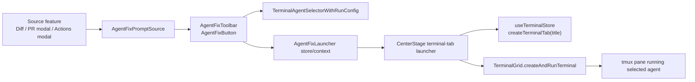

# TECH · APP-026: Agent Fix Launcher

> Technical Design · HOW. Implements PRD APP-026: Agent Fix Launcher.

## Scope summary

APP-026 is a Web/Desktop feature. It adds reusable Agent Fix UI variants and a Center Stage-backed terminal launcher that can create a new terminal tab, apply a source-provided title, build an interactive terminal-agent command, and run it with the source prompt.

Addresses PRD M1-M12. There are no M1 Nice to Have items. No new database tables, no new REST routes, and no new backend prompt service. The feature reuses APP-024 terminal-agent run config and existing WebSocket-backed GitHub/review data already loaded by each source surface.

## Architecture overview



The design deliberately separates:

- **source ownership**: prompt generation, domain metadata, lifecycle callbacks
- **shared UI**: toolbar/button presentation, agent config popover, copy/launch states
- **launcher ownership**: Center Stage terminal tab creation, activation, and terminal command dispatch

## Product decisions resolved in TECH

| Decision | Resolution |
|----------|------------|
| New tab vs reuse | Agent Fix creates a new terminal tab by default for clarity and source traceability. |
| Terminal tab naming | `createTerminalTab` gains an optional title parameter; Agent Fix passes source titles. |
| Agent selector reuse | Use `TerminalAgentSelectorWithRunConfig`; do not import the welcome-specific `WelcomeAgentSelector` into shared surfaces. |
| Settings popover content | Show only the reusable agent selector/run-config UI. Do not add source previews or prompt summaries. |
| Agent default memory | Persist one global last-used Agent Fix agent id. Do not store per-source family defaults in M1. |
| Prompt generation | Shared components accept `getPrompt`; they do not build prompts. |
| Transport | No new REST. No new WS unless a source later needs more data to build a prompt. Existing source APIs remain source-owned. |
| Review Session lifecycle | Existing tracked review fix runs can wrap the shared toolbar but keep `ReviewAgentRunModel` ownership in `code-review` / `diff`. |

## Module-by-module design

### apps/web/src/features/agent-fix

Create a new feature folder because the capability spans unrelated features but depends on agent/terminal feature APIs. Do not put this under `shared/`; it is not a pure shared rendering primitive.

```text
apps/web/src/features/agent-fix/
  AGENTS.md
  components/
    AgentFixToolbar.tsx
    AgentFixButton.tsx
    AgentFixSettingsPopover.tsx
  hooks/
    use-agent-fix-config.ts
    use-agent-fix-actions.ts
  lib/
    agent-fix-command.ts
    agent-fix-prompt.ts
    agent-fix-titles.ts
  store/
    agent-fix-launcher-store.ts
  types.ts
```

#### Public types

```ts
export type AgentFixContextScope = "workspace" | "project";

export interface AgentFixContextRef {
  contextId: string;
  scope: AgentFixContextScope;
}

export interface AgentFixPromptResult {
  prompt: string;
  terminalTabTitle?: string;
  terminalPaneLabel?: string;
  clipboardText?: string;
}

export interface AgentFixPromptSource {
  id: string;
  family: "diff" | "review_session" | "pr_review" | "ci_job" | "custom";
  context: AgentFixContextRef | null;
  label: string;
  description?: string;
  disabledReason?: string | null;
  getPrompt: () => Promise<AgentFixPromptResult | string>;
  onCopied?: (result: AgentFixPromptResult) => void | Promise<void>;
  onStarted?: (result: AgentFixPromptResult) => void | Promise<void>;
  onError?: (error: unknown) => void;
}

export interface AgentFixLaunchRequest {
  source: AgentFixPromptSource;
  agentId: string;
  agentRunConfig: TerminalAgentRunConfigInput | null;
  terminalTabTitle?: string;
  terminalPaneLabel?: string;
}
```

`getPrompt` can return a string for simple sources or a structured result for sources that need different clipboard text or title defaults.

### Agent options and run config

Add `useAgentFixConfig` rather than copy-pasting `useWelcomeAgentOptions` again. It should reuse the same lower-level inputs:

- `codeAgentCustomApi.get()` from `@/api/ws-api`
- `AGENT_OPTIONS` and `getInteractiveAgentParams` from `@/features/wiki/components/AgentSelect`
- `useFunctionSettingsStore` for built-in/custom overrides and saved run configs
- `TerminalAgentSelectorWithRunConfig` from `@/features/agent/components/TerminalAgentSelectorWithRunConfig`

The hook returns:

```ts
{
  availableAgents: AgentMenuOption[];
  selectedAgent: AgentMenuOption | null;
  selectedAgentId: string;
  setSelectedAgentId: (id: string) => void;
  runConfigByAgentId: Record<string, TerminalAgentRunConfigInput | null | undefined>;
  setRunConfigForAgent: (agentId: string, config: TerminalAgentRunConfigInput | null) => void;
}
```

Persist only a small global preference:

```ts
export interface AgentFixUiPrefs {
  lastAgentId: string | null;
}
```

Recommended location:

- `apps/web/src/shared/stores/use-ui-pref-hooks.ts`

Add:

```ts
export function useAgentFixLastAgentId(): [string | null, (id: string) => void]
```

Rules:

- initialize `selectedAgentId` from `lastAgentId` when that agent is available
- otherwise fall back to the current default agent resolution
- update `lastAgentId` when the user launches Agent Fix or explicitly selects an agent in the Agent Fix settings popover
- persist only `agentId`; do not persist per-surface choices or run configs in APP-026 M1

### Components

#### `AgentFixToolbar`

Use for bottom action bars and inline panels.

Props:

```ts
interface AgentFixToolbarProps {
  source: AgentFixPromptSource;
  variant?: "bottom" | "inline";
  className?: string;
}
```

Layout:

- left icon settings button (`Settings2`)
- divider
- Copy Prompt button (`Copy`)
- primary Agent Fix button (`Bot` / selected `AgentIcon`)

Behavior:

- settings opens `AgentFixSettingsPopover`
- Copy Prompt calls `resolvePrompt(source)` and clipboard write
- Agent Fix resolves prompt, validates context, calls launcher store
- narrow containers use fixed-height controls and truncation; text must not overflow

#### `AgentFixButton`

Use for dense row actions and hover/focus replacements.

Props:

```ts
interface AgentFixButtonProps {
  source: AgentFixPromptSource;
  mode?: "icon" | "label" | "compact";
  className?: string;
}
```

It exposes:

- primary click = Agent Fix
- optional adjacent/embedded settings affordance when space allows
- tooltip with disabled reason or selected agent summary

For the GitHub Actions failed-job row, use CSS group hover/focus to swap the time label area with `AgentFixButton`. The action must also appear on keyboard focus, not only hover.

#### `AgentFixSettingsPopover`

Wraps `TerminalAgentSelectorWithRunConfig` with `variant="menu"` or a small popover composition. The implementation should avoid `WelcomeAgentSelector` because that component is welcome-flow-specific. It can reuse the same option shape and run-config handlers.

The popover must not show prompt/source preview content. Its job is only selecting/configuring the agent.

### Terminal launcher

The terminal launcher must live at the app-shell/Center Stage boundary because only Center Stage has:

- active file state
- URL tab params
- terminal grid refs
- `createTerminalTab`
- `setActiveTerminalTab`
- `runWhenTerminalGridReady`

Replace the review-specific runner pattern with a generic one, then keep a compatibility wrapper for review if needed.

New store:

```ts
export type AgentFixTerminalRunner = (
  request: ResolvedAgentFixLaunchRequest,
) => Promise<void> | void;

export const useAgentFixLauncherStore = create<{
  runner: AgentFixTerminalRunner | null;
  setRunner: (runner: AgentFixTerminalRunner | null) => void;
}>(...)
```

`ResolvedAgentFixLaunchRequest`:

```ts
interface ResolvedAgentFixLaunchRequest {
  context: AgentFixContextRef;
  prompt: string;
  agent: AgentMenuOption;
  runConfig: TerminalAgentRunConfigInput | null;
  terminalTabTitle: string;
  terminalPaneLabel: string;
}
```

Center Stage registers:

```ts
const handleRunAgentFixInTerminal = React.useCallback(async (request) => {
  if (!effectiveContextId || effectiveContextId !== request.context.contextId) return;
  setActiveFile(null, effectiveContextId);
  const nextTab = createTerminalTab(effectiveContextId, { title: request.terminalTabTitle });
  setActiveTerminalTab(effectiveContextId, nextTab.id);
  setUrlParams({ tab: nextTab.id, wikiPage: null });
  const command = buildInteractiveAgentCommand({
    agentId: request.agent.id,
    launchCommand: request.agent.launchCommand,
    prompt: request.prompt,
    runConfig: request.runConfig,
  });
  runWhenTerminalGridReady(nextTab.id, (grid) => {
    void grid.createAndRunTerminal({
      label: request.terminalPaneLabel,
      command,
      agent: {
        id: request.agent.id,
        label: request.agent.label,
        command: request.agent.command,
        iconType: request.agent.iconType,
      },
    });
  }, 40);
}, [...]);
```

If `request.context.scope === "project"`, the same `effectiveContextId` already represents the project id on the project route. No separate terminal store scope is needed for M1.

### Terminal tab title support

Current `useTerminalStore.createTerminalTab(workspaceId)` always uses `getNextTerminalTabTitle(existingTabs)`.

Update types:

```ts
interface CreateTerminalTabOptions {
  title?: string;
}

createTerminalTab: (workspaceId: string, options?: CreateTerminalTabOptions) => TerminalCenterTab;
```

Implementation rule:

- if `options.title` is present, sanitize and de-duplicate it
- otherwise keep current `Term - N` behavior
- preserve the fixed tab behavior for the first tab

Suggested helper:

```ts
export function getUniqueTerminalTabTitle(
  existingTabs: TerminalCenterTab[],
  preferredTitle: string,
): string
```

Rules:

- trim whitespace
- cap to a short UI-safe length, e.g. 40 chars
- if duplicate, append ` 2`, ` 3`, etc.
- do not mutate existing titles

Affected files:

- `apps/web/src/features/terminal/store/terminal-store-types.ts`
- `apps/web/src/features/terminal/store/use-terminal-store.ts`
- `apps/web/src/features/terminal/store/terminal-store-helpers.ts`
- tests in `apps/web/src/features/terminal/store/__tests__/terminal-store-new-tab.test.ts`

### Prompt resolution

`resolveAgentFixPrompt(source)`:

1. reject if `source.disabledReason` exists
2. await `source.getPrompt()`
3. normalize string vs structured result
4. trim prompt for command launch
5. reject empty prompt
6. derive fallback titles:
   - tab title: `source.label`
   - pane label: selected agent label or `Agent Fix`

Clipboard text defaults to `prompt`.

### Source integrations

#### Diff inline prompt annotations

Files:

- `apps/web/src/features/diff/components/DiffCopyAnnotation.tsx`
- `apps/web/src/features/diff/components/useDiffPromptStash.tsx`

Current behavior supports note input, stash, and copy. Add Agent Fix without removing Copy Prompt:

- convert current copy prompt builder into a `getPrompt` source
- show `AgentFixToolbar` in the annotation footer or replace the Copy button group with the toolbar when space allows
- pass `terminalTabTitle` like `Fix diff: ${basename(filePath)}`
- preserve Stash behavior

Also replace the current copy-only merged prompt chip from `useDiffPromptStash`:

- `stashedPromptChip` becomes an Agent Fix entry point for the merged prompt
- Copy Prompt still copies the merged prompt exactly as today
- Agent Fix launches the selected agent with the same merged prompt
- after a successful copy or launch, clear the copied/launched stashed prompts using the same cleanup semantics the copy path uses today
- do not generalize this into arbitrary batch prompts for PR or CI in M1

#### PR reviewer comments

Files:

- `apps/web/src/features/github/components/PRDetailModal.tsx`
- `apps/web/src/features/github/lib/pr-detail-modal-parts.tsx`

Add prompt sources around `ReviewCommentThreadView` / review thread rendering:

- include PR owner/repo/number
- file path
- line/original line
- diff hunk when available
- reviewer comments in chronological order
- branch/base metadata from the loaded PR detail when available

Use `AgentFixToolbar` when a thread card has enough vertical space; otherwise use `AgentFixButton` in the thread header/action row.

#### Failed GitHub Actions jobs

File:

- `apps/web/src/features/github/components/ActionsDetailModal.tsx`

Add Agent Fix for `job.conclusion === "failure"`:

- source family: `ci_job`
- title: `Fix CI: ${job.name ?? effectiveRun.workflowName}`
- prompt includes owner/repo, workflow name, run id, branch/SHA, failed job, failed steps, selected step metadata if applicable, and GitHub URLs when available
- row action appears by replacing the time label on hover/focus
- failed step rows can remain view/open-only in M1; APP-026 does not add generic batch failed-step prompts

#### Review Session toolbar

Files:

- `apps/web/src/features/diff/components/review/FixActionsMenu.tsx`
- `apps/web/src/features/code-review/hooks/use-review-context.ts`
- `apps/web/src/features/code-review/store/review-terminal-runner-store.ts`

Do not remove tracked review run semantics. Either:

1. adapt `FixActionsMenu` to render `AgentFixToolbar` while `useReviewContext` still owns `createAgentRun("fix", "terminal_cli")`, or
2. leave `FixActionsMenu` specialized in M1 and only share lower-level selector/launcher pieces.

The implementation should prefer option 1 only if it does not regress active-run status, Mark failed, artifact creation, or finalize behavior.

## Command building

Use existing:

- `buildInteractiveAgentCommand` from `@/features/agent/lib/terminal-agent-run-config`
- `TerminalAgentRunConfigInput`
- `AgentMenuOption.launchCommand`

Do not use the older wiki `buildCommand` path for new generic Agent Fix launches. It is still used by current review code until that code is migrated.

## Security & permissions

- Prompts can contain source code, CI logs, reviewer comments, and file paths. Do not persist generic Agent Fix prompt text in a new store.
- Do not log prompt bodies to console or debug logs.
- Clipboard writes use existing browser permissions and show failure toasts.
- Terminal launch is local to the active Atmos Computer/project/workspace context. If the active route no longer matches `source.context`, fail closed with a toast rather than launching in the wrong repo.
- GitHub URLs included in prompts are already visible in the corresponding UI. Do not add tokens or raw API responses.

## Rollout plan

1. Add terminal tab title option and tests while preserving default tab naming.
2. Add `agent-fix` feature folder with prompt resolution, config hook, toolbar/button UI, and launcher store.
3. Register generic runner from `CenterStage` and keep the existing review runner working.
4. Add the global last-used Agent Fix agent preference.
5. Wire diff annotation Agent Fix and verify Copy Prompt/Stash are unchanged.
6. Replace the diff merged prompt copy-only chip with an Agent Fix entry point that still supports Copy Prompt.
7. Wire PR review comment Agent Fix inside `PRDetailModal`.
8. Wire failed GitHub Actions job Agent Fix inside `ActionsDetailModal`.
9. Evaluate whether `FixActionsMenu` should adopt `AgentFixToolbar`; only migrate if tracked review behavior remains identical.
10. Run focused tests and manual smoke in workspace + project routes.

## Risks & tradeoffs

- **Tradeoff · feature folder vs shared**: Use `features/agent-fix` because the code depends on agent and terminal feature APIs. Putting it under `shared` would violate shared boundaries.
- **Tradeoff · new tab every time**: This creates more tabs, but it makes launch provenance obvious and avoids mutating an existing terminal session.
- **Tradeoff · one global agent default**: Per-surface defaults may feel smarter later, but one global last-used agent avoids hidden state and matches the requested M1 behavior.
- **Risk · stale context**: A modal may remain open while route context changes. The launcher validates context before launch.
- **Risk · prompt builders drift**: Each source owns prompt quality. Keep small source-specific prompt helpers near the source component and test them.
- **Risk · review migration**: Review Session fix runs have lifecycle semantics. Do not force migration to the shared toolbar if it weakens status tracking.

## Dependencies & compatibility

- Depends on APP-024 shared run-config components already present in `TerminalAgentSelectorWithRunConfig`.
- Compatible with Desktop because the flow reuses existing terminal grids and command dispatch.
- No backend migration.
- No new external binary dependency beyond the selected terminal agent CLI already configured by the user.

## Open questions

- [ ] Should PR review comment threads use toolbar always or a compact button in the header? Implementation should pick based on layout fit.
- [ ] Should CI prompts include all failed steps or only the failed job summary in M1? Recommended: include failed steps metadata, not raw logs unless already loaded in the modal.
