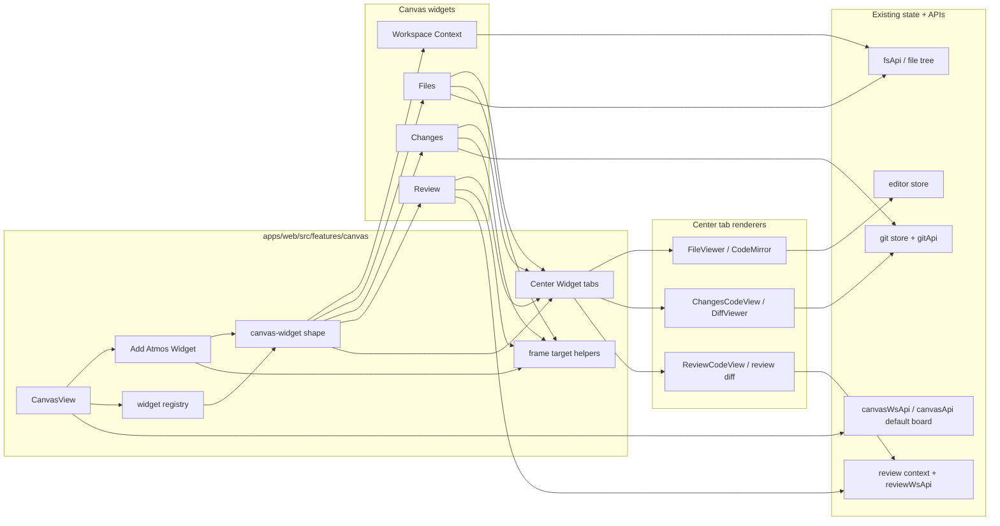

# TECH - APP-027: Canvas Workspace Surfaces

> Technical Design - HOW. Implements PRD APP-027: Canvas Workspace Surfaces.

## Scope summary

This design adds a centralized Canvas-side **Add Atmos Widget** flow, typed Canvas widgets for Workspace Context / Files / Changes / Review, and a reusable tabbed **Center Widget** for file and diff content. It addresses PRD M1-M19. N1-N5 are deferred except where implementation naturally creates reusable helpers.

The design is frontend-first. It does not add a new backend table, route, WebSocket action, or terminal runtime path. Widget layout, frame placement, source references, and Center tabs persist in the existing Canvas document from APP-014.

## Architecture overview



## Design decisions

- **D1 - Canvas-only creation**: non-terminal widgets are created from a centralized Add Atmos Widget control in Canvas. Do not add new pin controls to Files, Changes, Review, editor, or diff source UI.
- **D2 - Terminal exception**: the existing terminal pin-to-Canvas flow remains unchanged because it already exists and has terminal-specific ownership semantics.
- **D3 - Typed widgets, not arbitrary embeds**: add one `canvas-widget` shape type with a finite `widgetType` union.
- **D4 - Center as tab host**: File, Diff, grouped Changes diff, and Review Diff are Center Widget tabs, not top-level Add Atmos Widget entries.
- **D5 - References only**: widget props store source identity, layout, frame placement through tldraw parentage, and Center tab references. Content remains in existing workspace files, editor store, git store/API, and review services.
- **D6 - Frame-aware creation**: Add flow can target an existing frame. Widget-originated Center creation inherits the source widget's parent frame.
- **D7 - Active mounting for heavy tabs**: CodeMirror, grouped diff, and review diff internals mount only when the Center Widget and tab are active. Inactive Center tabs render summaries.
- **D8 - Existing transport only**: use existing Canvas board persistence and existing WS/API clients. Do not add REST or WebSocket routes for this spec.
- **D9 - Unsupported interaction fallback (M20)**: widget bodies reuse existing app panels whose clickable elements wire to main-app navigation. Each widget body is wrapped in a Canvas host boundary that intercepts app-route navigation and routes it to a notice modal instead of leaving the board. Widgets may also call an explicit `notifyUnsupported` API for actions they know Canvas cannot host. The card chrome (Reveal Source, Close, Refresh) sits **outside** this boundary and keeps normal navigation. Supported interactions (Center tabs, terminal focus) are wired through dedicated callbacks and never reach the interceptor, so they keep working. App-route navigation via `useAppRouter` is the intercepted vector in phase 1; query-param-only switches are out of scope for this fallback.

## Module-by-module design

### apps/web/src/features/canvas

Add the Canvas widget model and creation flow:

- `lib/canvas-widget-shape.ts`
  - Defines `CANVAS_WIDGET_SHAPE_TYPE = "canvas-widget"`.
  - Defines `CanvasWidgetShapeProps`.
  - Normalizes legacy/missing props on document load.
  - Provides helpers for pin keys, source labels, default dimensions, and source reveal paths.
- `lib/canvas-center-tabs.ts`
  - Defines Center tab source types.
  - Provides tab key generation, tab dedupe, active tab selection, and title/icon resolution.
- `lib/canvas-widget-frame.ts`
  - Lists eligible tldraw frame shapes.
  - Resolves the selected target frame for Add Atmos Widget.
  - Resolves inherited frame from a source widget by checking its parent shape.
  - Reparents created widgets into the frame when needed.
- `lib/canvas-widget-placement.ts`
  - Places new widgets near viewport center or inside the selected/inherited frame.
  - Finds space beside the source widget when creating a related Center Widget.
- `components/CanvasAddAtmosWidgetDialog.tsx`
  - Step 1: choose Project / Workspace.
  - Step 2: choose component: Workspace Context, Files, Changes, Review.
  - Step 3: choose target frame or "No frame".
  - Creates the selected widget in Canvas; it does not create File/Diff tabs directly.
- `components/CanvasWidgetCard.tsx`
  - Shared HTMLContainer renderer.
  - Header with source label, title, compact status text, source reveal, refresh, and close/remove actions.
  - Handles `editor.markEventAsHandled`, pointer containment, and focus behavior consistently with `CanvasTerminalCard`.
- `components/widgets/`
  - `CanvasWorkspaceContextWidget.tsx`
  - `CanvasFilesWidget.tsx`
  - `CanvasChangesWidget.tsx`
  - `CanvasReviewWidget.tsx`
  - `CanvasCenterWidget.tsx`
- `lib/canvas-widget-registry.ts`
  - Maps widget type to icon, default size, summary renderer, live renderer, and source reveal resolver.
- `hooks/use-add-atmos-widget.ts`
  - Creates widgets from the Add Atmos Widget dialog.
  - Persists through the live tldraw editor when Canvas is mounted.
- `hooks/use-open-canvas-center-tab.ts`
  - Called by Files / Changes / Review widgets.
  - Finds a matching Center Widget by Project / Workspace context and frame context.
  - Adds or focuses a tab when one exists.
  - Creates a Center Widget inside the inherited frame when none exists.

`CanvasView.tsx` extends `shapeUtils` with `CanvasWidgetShapeUtil` beside `CanvasTerminalShapeUtil` and renders the Add Atmos Widget control in Canvas chrome.

### apps/web/src/features/workspace

Reuse existing context data and components:

- `WorkspaceNotePanel.tsx` remains the note editor/preview source.
- `TaskListPanel.tsx` remains the task list source.
- Add a small `WorkspaceRequirementPanel` only if the existing requirement UI is not already extractable.
- Add `WorkspaceContextSurface.tsx` as a presentational composition that accepts explicit context props:

```ts
interface WorkspaceContextSurfaceProps {
  contextId: string | null;
  effectivePath: string | null;
  sections: Array<"notes" | "tasks" | "requirements">;
  compact?: boolean;
  active?: boolean;
}
```

The right place for API/file access remains `useWorkspaceContextStore`. The surface does not duplicate task, requirement, or note persistence.

### apps/web/src/features/files

The existing `FileTreePanel` uses global `useFileTreeStore`, which is appropriate for the app sidebar but not enough for multiple Canvas cards with different source contexts.

Refactor toward a scoped presentation split:

- Keep `FileTreePanel.tsx` as the sidebar container.
- Add `FileTreeSurface.tsx` for shared rendering.
- Add `useScopedFileTree.ts` or an equivalent local hook for Canvas that fetches tree data for an explicit `{ projectId, workspaceId, rootPath, showHidden }`.

`CanvasFilesWidget` uses `FileTreeSurface` with explicit data. Opening a file calls `useOpenCanvasCenterTab` with a `file` tab source. It does not create a standalone File widget and it does not add controls to the existing right sidebar Files panel.

### apps/web/src/features/editor

File content lives inside Center Widget tabs:

- `CanvasCenterWidget` stores tabs in `CanvasCenterWidgetSource.tabs`.
- When a file tab becomes active, it calls `useEditorStore.openFile(path, workspaceId, { preview: false, line, column })`.
- The active file tab renders `FileViewer` with the corresponding `OpenFile`.
- The tab passes `surfaceActive={isActive}` so background editors can pause expensive behavior.
- Dirty state, save, binary preview, markdown preview, and unsupported-file handling remain owned by `FileViewer` and `CodeMirrorEditor`.

No new editor-tab pin action is added to center-stage UI.

### apps/web/src/features/diff

Diff content lives inside Center Widget tabs:

- Grouped changes diff tab renders `ChangesCodeView`.
- Single-file changes diff tab renders `DiffViewer`.
- Grouped review diff tab renders `ReviewCodeView`.
- Single-file review diff tab renders `DiffViewer` with review source path semantics.
- Shared scaffold, file tree, and diff settings remain reused.

Add optional explicit context props to diff components where current implementations depend on global context. Do not add new pin actions to diff headers or center-stage diff tabs.

Center tab source shape:

```ts
type CanvasCenterTab =
  | {
      id: string;
      kind: "file";
      title: string;
      path: string;
      line?: number;
      column?: number;
      mode: "edit" | "preview";
    }
  | {
      id: string;
      kind: "changes-group";
      title: string;
      repoPath: string;
      groupPath: string;
    }
  | {
      id: string;
      kind: "changes-file";
      title: string;
      repoPath: string;
      filePath: string;
      originalPath?: string;
    }
  | {
      id: string;
      kind: "review-group";
      title: string;
      groupPath: string;
      reviewSessionGuid?: string;
      revisionGuid?: string;
    }
  | {
      id: string;
      kind: "review-file";
      title: string;
      repoPath: string;
      filePath: string;
      originalPath: string;
      reviewSessionGuid?: string;
      revisionGuid?: string;
    };
```

### apps/web/src/features/git and app-shell/sidebar

Changes cards should reuse git status and change-section UI without copying the sidebar implementation:

- Extract a `ChangesSurface` from the right sidebar changes tab and `ChangeSection`.
- Accept explicit `repoPath`, `contextId`, and allowed action set.
- Opening changed files or groups calls `useOpenCanvasCenterTab`.
- Phase 1 can expose stage / unstage / open diff. Discard remains available only if the existing confirmation path is reused unchanged.
- Do not add any new Canvas action to the existing right sidebar Changes tab.

### apps/web/src/features/diff/review

Review cards should be navigational and status-oriented:

- Reuse `ReviewView` parts, `FrozenFileList`, `CommentCard`, and `ReviewContextProvider`.
- Show current session title, revision, open comment count, reviewed file count, changed-after-review count, changed files, and open comments.
- Opening review content calls `useOpenCanvasCenterTab`.
- Inline comment editing belongs in Center Widget review diff tabs, not the compact Review widget unless existing components make it free.
- Do not add any new Canvas action to the existing right sidebar Review tab.

### Unsupported interaction fallback (M20)

Reused panels (`FileTreePanel`, `ChangeSection`, `ReviewView`, `AgentStatusPopoverContent`, `UsagePopover`, `AgentChatPanel`) contain clickable elements that navigate the main app through `useAppRouter`. Inside a Canvas widget there is no main-app shell to navigate, so those clicks must degrade gracefully.

- `apps/web/src/shared/hooks/app-navigation-intercept.tsx` (new, generic)
  - `AppNavigationInterceptor = (target: { path: string; kind: "push" | "replace" }) => boolean` (returns `true` when it handled/blocked navigation).
  - `AppNavigationInterceptProvider` and `useAppNavigationInterceptor()`.
  - No feature imports; stays a generic shared primitive.
- `apps/web/src/shared/hooks/use-app-router.ts` (modify)
  - `push` / `replace` consult `useAppNavigationInterceptor()` first; if an interceptor returns `true`, navigation is skipped. Behaviour is unchanged when no provider is present.
- `apps/web/src/features/canvas/store/canvas-runtime-store.ts` (modify)
  - Add `unsupportedInteractionNotice: { widgetLabel: string | null; targetPath: string | null } | null` plus `showUnsupportedInteraction(notice)` and `dismissUnsupportedInteraction()`. `reset()` clears it.
- `apps/web/src/features/canvas/components/CanvasWidgetHost.tsx` (new)
  - `CanvasWidgetHostProvider` wraps each widget body. It builds an interceptor that calls `showUnsupportedInteraction({ widgetLabel, targetPath })` and returns `true`, and exposes `useCanvasWidgetHost().notifyUnsupported()` for explicit known-unsupported actions.
- `apps/web/src/features/canvas/components/CanvasUnsupportedInteractionDialog.tsx` (new)
  - Reads the notice from the runtime store and renders a small portal modal (above the `z-[150]` Canvas overlay) with an explanation and a dismiss action.
- `CanvasWidgetCard` wraps `renderBody()` in `CanvasWidgetHostProvider`; `CanvasView` mounts `CanvasUnsupportedInteractionDialog` once.

### packages/ui

No new business logic belongs in `packages/ui`. If shared primitives are needed, limit them to presentational card/header/toolbar primitives with no API calls.

## Data model

The existing Canvas document stores tldraw records. The new shape stores only widget references. Frame placement is represented by normal tldraw parentage: a widget inside a frame has the frame shape as its parent.

```ts
type CanvasWidgetType =
  | "workspace-context"
  | "files"
  | "changes"
  | "review"
  | "center";

type CanvasContextRef = {
  contextScope: "project" | "workspace";
  projectId: string | null;
  workspaceId: string | null;
  projectName: string;
  workspaceName: string | null;
  localPath: string;
  repoPath: string | null;
};

type CanvasWidgetSourceRef =
  | { type: "workspace-context"; context: CanvasContextRef; sections: Array<"notes" | "tasks" | "requirements"> }
  | { type: "files"; context: CanvasContextRef; rootPath: string; showHidden?: boolean }
  | { type: "changes"; context: CanvasContextRef; group?: "all" | "staged" | "unstaged" | "untracked" | "compare" }
  | { type: "review"; context: CanvasContextRef; sessionGuid?: string; revisionGuid?: string }
  | { type: "center"; context: CanvasContextRef; tabs: CanvasCenterTab[]; activeTabId: string | null };

type CanvasWidgetShapeProps = {
  w: number;
  h: number;
  widgetType: CanvasWidgetType;
  title: string;
  source: CanvasWidgetSourceRef;
  isPinned: boolean;
  pinKey: string;
  lastActivatedAt: number | null;
  displayMode: "auto" | "compact" | "expanded";
};
```

Pin keys should be stable and source-specific:

```text
workspace-context:<scope>:<contextId>:<sections>
files:<scope>:<contextId>:<rootPath>
changes:<scope>:<contextId>:<group>
review:<scope>:<contextId>:<sessionGuid>:<revisionGuid>
center:<scope>:<contextId>:<frameId-or-unframed>
```

Center tab keys should be stable inside a Center Widget:

```text
file:<path>:<line-or-0>:<column-or-0>
changes-group:<groupPath>
changes-file:<filePath>
review-group:<groupPath>:<revisionGuid-or-current>
review-file:<filePath>:<revisionGuid-or-current>
```

## Center Widget matching and frame behavior

When a Canvas widget requests a Center tab:

1. Resolve the source widget's context (`project` or `workspace`).
2. Resolve inherited frame:
   - if the source widget's parent is a frame shape, use that frame id;
   - otherwise use `unframed`.
3. Search current page for a Center Widget with the same context and same frame context.
4. If found, add/focus the tab.
5. If not found, create a Center Widget in the inherited frame or unframed area, then add/focus the tab.

The Add Atmos Widget dialog uses the same frame helper, but the frame is selected explicitly by the user instead of inherited from a source widget.

## Transport

No new transport is introduced.

- Canvas document load/save: existing `canvasWsApi` / `canvasApi` from APP-014.
- File tree and file content: existing `fsApi` / editor store.
- Git status and diffs: existing `gitApi` / git stores.
- Review data and actions: existing review WebSocket APIs and review context.

Any new REST endpoint for this spec is a design violation unless a later TECH amendment explicitly justifies it.

## Security & permissions

- File content and git data use existing workspace/project access checks.
- Widget source references and Center tab references must not include file contents, diff bodies, tokens, or review message bodies.
- Logs should record widget type and source identifiers only, not file content.
- Destructive git actions in Changes widgets must reuse existing confirmations and existing git store methods.
- Source reveal must validate that referenced paths still belong to the recorded workspace/project root.

## Rollout plan

1. Add `canvas-widget` shape schema, registry, shared card chrome, normalization helpers, and unit tests for source refs / pin keys.
2. Add Add Atmos Widget dialog with Project / Workspace selection, component selection, and frame selection. Wire only inside Canvas chrome.
3. Add frame helper and widget placement helpers.
4. Ship Workspace Context and Files widgets.
5. Add Center Widget and file tabs opened from Files widgets.
6. Add Changes widget and Center diff tabs.
7. Add Review widget and Center review diff tabs.
8. Harden source reveal, active mounting, frame inheritance, and terminal regression coverage.

## Risks & tradeoffs

- **Tradeoff**: keeping terminal as `canvas-terminal` avoids a broad migration but temporarily leaves terminal outside the generic widget model. This is acceptable because terminal has unique xterm lifecycle rules and an existing pin flow.
- **Tradeoff**: File and Diff are not add-menu widgets. This reduces menu complexity and keeps center-stage content grouped, but requires tab orchestration.
- **Risk**: current sidebar/review components depend on global app context. Mitigation: extract scoped surfaces before mounting them in Canvas.
- **Risk**: multiple CodeMirror and diff tabs can be expensive. Mitigation: summary rendering for inactive Center widgets/tabs and live mounting only for active tabs.
- **Risk**: source references can go stale when workspaces are deleted, renamed, or archived. Mitigation: show a recoverable broken-reference state with remove and source-relink affordances.
- **Rollback path**: hide Add Atmos Widget and disable new widget creation. Existing terminal cards and Canvas documents continue to load because `canvas-terminal` remains unchanged.

## Dependencies & compatibility

- Depends on APP-014 Canvas persistence and overlay.
- Coexists with APP-015 Canvas agent bridge; agent commands do not need widget support in phase 1.
- Coexists with APP-022 canvas terminal new-tab behavior.
- Minimum runtime is the existing web Canvas runtime with tldraw enabled.

## Open questions

- [ ] Whether phase 1 allows destructive git discard inside Changes widgets or limits Canvas to non-destructive review/navigation actions.
- [ ] Whether Review widgets require a pinned `sessionGuid` or can always follow the active review session for a context.
- [ ] Whether Center Widget should be manually addable from Add Atmos Widget in phase 1 or only created on demand.
