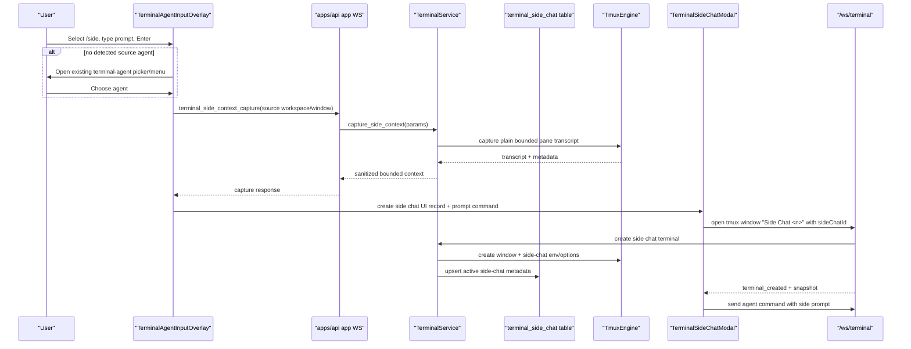

# TECH · APP-030: Terminal Side Chat

> Technical Design · HOW. Implements PRD APP-030: Terminal Side Chat.

## Scope summary

APP-030 adds a terminal-only `/side` slash command that launches an isolated side chat terminal seeded from the source pane's bounded tmux transcript. It addresses PRD M1-M14. Capture preview, explicit agent override when an agent is already detected, hidden-dot activity badges, and mobile UI are deferred.

A database migration is required for backend side-chat metadata. No new REST endpoint is required. The feature uses:

- the existing app WebSocket request router for bounded source-context capture,
- new app WebSocket messages for backend side-chat registry list/update/close actions,
- the existing `/ws/terminal/{session_id}` websocket for side terminal streaming,
- the existing `Terminal` component for rendering,
- new frontend side-chat state and shell components that intentionally do not expose `TerminalGrid` split/menu/hotkey behavior,
- tmux user options as runtime discovery metadata for live side-chat windows.

## Architecture overview



Layer summary:

```text
apps/web Terminal AI Input
  -> apps/api main WebSocket router
  -> crates/core-service TerminalService
  -> crates/core-engine TmuxEngine capture
  -> crates/infra terminal_side_chat repository

apps/web TerminalSideChatModal
  -> apps/api terminal WebSocket handler
  -> crates/core-service TerminalService create/attach/destroy
  -> crates/infra terminal_side_chat repository
```

## Product decisions resolved in TECH

| Fork | Decision |
|------|----------|
| Capture source | Capture from backend tmux, not xterm buffer, so hidden scrollback and detached/restored panes behave consistently. |
| Capture format | Return plain text only. Do not feed ANSI escape sequences into the agent prompt. |
| Capture limits | Use byte budgets as the public contract. Default final prompt transcript budget is 98,304 bytes after UTF-8 normalization; the backend may internally read a larger tmux tail window, but line counts are metadata only. |
| Side mode chip | Hover/focus on the `/side` chip shows a compact metadata popover. It never renders the full transcript. |
| Side terminal rendering | Reuse `Terminal` directly in a dedicated modal shell. Do not reuse `TerminalGrid` for M1 because grid context menu, split logic, hotkeys, layout persistence, and pinning are product anti-goals. |
| Overlay scope | Render side chat UI inside the source terminal surface, not at the app root. Canvas terminal side chats are clipped to the current terminal card/shape and cannot move onto the broader canvas. |
| Hidden lifecycle | Hide unmounts the modal terminal and keeps the tmux window alive; restore reattaches by the known side tmux window name and rehydrates from the terminal snapshot path. |
| Agent selection | Reuse the same source-pane agent detection used by the terminal header. If no source agent is detected at submit time, open the existing terminal-agent picker/menu; only fail inline when no runnable agent can be selected. |
| Color allocation | Pick a random bright/light color and reject colors already used by active side chats. Avoid dark colors because the hidden dots must stay visible on terminal surfaces. |
| Side chat identity | Generate a unique side chat id before terminal creation. Pass it through terminal WebSocket creation, inject it into the tmux window environment, and store it on the side chat UI record. |
| Agent status integration | Agent hooks remain the source of running/permission notifications. Hook payloads carry side-chat metadata when present so the footer agent status panel can restore/focus the side chat by id instead of navigating only by normal pane id. |
| Persistence | Persist side-chat metadata in the backend local registry and mirror identity/source metadata into tmux window options. tmux remains the live process/content source; the backend registry restores UI handles after route changes, reloads, and client switches. |
| Cleanup | Close removes the backend registry record and destroys the side tmux window. Source terminal destruction cascades to every child side chat from that source before/with the source close path. Reconciliation removes stale registry records for missing tmux windows. |

## Module-by-module design

### crates/infra

Files:

- `crates/infra/src/db/migration/m20260702_000031_create_terminal_side_chat.rs`
- `crates/infra/src/db/migration/mod.rs`
- `crates/infra/src/db/entities/terminal_side_chat.rs`
- `crates/infra/src/db/entities/mod.rs`
- `crates/infra/src/db/repo/terminal_side_chat_repo.rs`
- `crates/infra/src/db/repo/mod.rs`

Add a `terminal_side_chat` table for active side-chat metadata. This table is a local runtime registry, not chat history.

Columns:

- `guid`, `created_at`, `updated_at`, `is_deleted` from the standard base entity shape.
- `workspace_guid`: workspace/context id that owns both source and side tmux windows.
- `project_name`, `workspace_name`: optional display metadata used for restored labels.
- `side_chat_id`: stable id generated before side terminal creation.
- `source_pane_id`: stable parent pane identity, typically `<workspace_id>:<source_tmux_window_name>`.
- `source_tmux_window_name`: parent tmux window name.
- `source_surface_kind`: `"center"` or `"canvas"`.
- `source_surface_ref_json`: optional JSON for `terminalTabId`, `boardId`, or `shapeId`.
- `side_tmux_window_name`: side chat tmux window name.
- `agent_ref_json`: optional display metadata only, such as agent id/label/icon.
- `color_hex`: bright dot color allocated by the frontend and persisted by the backend.
- `status`: `"open"`, `"hidden"`, or `"closing"`.
- `closed_at`: nullable timestamp set when the record is cleaned up.

Indexes:

- unique `side_chat_id` where active,
- index on `(workspace_guid, is_deleted)`,
- index on `(workspace_guid, source_tmux_window_name, is_deleted)`,
- index on `(workspace_guid, side_tmux_window_name, is_deleted)`.

Repository methods:

```rust
pub struct UpsertTerminalSideChatInput {
    pub side_chat_id: String,
    pub workspace_guid: String,
    pub project_name: Option<String>,
    pub workspace_name: Option<String>,
    pub source_pane_id: String,
    pub source_tmux_window_name: String,
    pub source_surface_kind: String,
    pub source_surface_ref_json: Option<String>,
    pub side_tmux_window_name: String,
    pub agent_ref_json: Option<String>,
    pub color_hex: String,
    pub status: String,
}

impl TerminalSideChatRepo<'_> {
    pub async fn upsert_active(&self, input: UpsertTerminalSideChatInput) -> Result<terminal_side_chat::Model>;
    pub async fn list_active_by_workspace(&self, workspace_guid: &str) -> Result<Vec<terminal_side_chat::Model>>;
    pub async fn list_active_by_source(&self, workspace_guid: &str, source_tmux_window_name: &str) -> Result<Vec<terminal_side_chat::Model>>;
    pub async fn update_status(&self, side_chat_id: &str, status: &str) -> Result<Option<terminal_side_chat::Model>>;
    pub async fn soft_delete(&self, side_chat_id: &str) -> Result<()>;
    pub async fn soft_delete_by_source(&self, workspace_guid: &str, source_tmux_window_name: &str) -> Result<Vec<terminal_side_chat::Model>>;
}
```

The repo must never store captured transcript text, resolved user prompts, launch commands, environment variables, API keys, auth data, or terminal output snapshots.

### crates/core-engine

File: `crates/core-engine/src/tmux/capture.rs`

Add a plain-text capture helper so agent prompts do not receive ANSI escape sequences:

```rust
pub fn capture_pane_text(
    &self,
    session_name: &str,
    window_index: u32,
    approximate_lines: i32,
) -> Result<String>
```

Implementation notes:

- Use `tmux capture-pane -p -N -S -<approximate_lines> -E -` without `-e`.
- tmux capture is line-addressed; service/API limits are byte-addressed. Treat `approximate_lines` as an implementation detail for reading enough recent scrollback before byte selection.
- Preserve trailing spaces only where tmux returns them, then trim one trailing newline like existing capture helpers.
- Keep existing ANSI-preserving snapshot capture unchanged for terminal hydration.

### crates/core-service

Files:

- `crates/core-service/src/service/terminal.rs`
- optionally `crates/core-service/src/service/terminal/management.rs`
- `crates/core-service/src/service/terminal/types.rs`

Add service-facing request/response types:

```rust
pub struct CaptureSideContextParams {
    pub workspace_id: String,
    pub project_name: Option<String>,
    pub workspace_name: Option<String>,
    pub source_tmux_window_name: String,
    pub max_prompt_bytes: Option<u32>,
}

pub struct CapturedSideContext {
    pub workspace_id: String,
    pub project_name: Option<String>,
    pub workspace_name: Option<String>,
    pub tmux_session: String,
    pub tmux_window_name: String,
    pub tmux_window_index: u32,
    pub captured_lines: u32,
    pub captured_bytes: u32,
    pub prompt_budget_bytes: u32,
    pub omitted_older_bytes: u32,
    pub omitted_middle_bytes: u32,
    pub truncated_bytes: bool,
    pub text: String,
}
```

Add `TerminalService::capture_side_context(params)`.

Rules:

- Resolve the tmux session using the same human-readable naming fallback as `create_session` / `attach_session`.
- Resolve `source_tmux_window_name` to a window index with `TmuxEngine::find_window_index_by_name`.
- Reject empty source window names and source windows outside the resolved workspace session.
- Use default `max_prompt_bytes = 98_304`; clamp to an implementation-defined safe range such as `8_192..=131_072`.
- Internally read a larger raw tmux tail window, for example up to `raw_capture_bytes = 524_288`, by choosing a conservative line count and then truncating sanitized UTF-8 text by bytes.
- If sanitized text fits the prompt budget, return it unchanged.
- If sanitized text exceeds the prompt budget, build a byte-bounded transcript that keeps the most recent output, preserves a small earliest-available prefix when possible, and inserts omission markers with byte counts. This reduces the chance of losing command/setup context while keeping the tail, where terminal failures usually surface.
- Do not log captured transcript text. Logs may include workspace id, tmux session, window name, byte counts, line count metadata, and truncation flags.

Add side-chat registry service types:

```rust
#[derive(Debug, Clone, PartialEq, Eq, serde::Serialize, serde::Deserialize)]
#[serde(rename_all = "snake_case")]
pub enum TerminalSideChatStatus {
    Open,
    Hidden,
    Closing,
}

pub struct TerminalSideChatRecord {
    pub side_chat_id: String,
    pub workspace_id: String,
    pub project_name: Option<String>,
    pub workspace_name: Option<String>,
    pub source_pane_id: String,
    pub source_tmux_window_name: String,
    pub source_surface_kind: String,
    pub source_surface_ref_json: Option<String>,
    pub side_tmux_window_name: String,
    pub agent_ref_json: Option<String>,
    pub color_hex: String,
    pub status: TerminalSideChatStatus,
    pub created_at: chrono::NaiveDateTime,
    pub updated_at: chrono::NaiveDateTime,
}

pub struct UpsertTerminalSideChatParams {
    pub side_chat_id: String,
    pub workspace_id: String,
    pub project_name: Option<String>,
    pub workspace_name: Option<String>,
    pub source_pane_id: String,
    pub source_tmux_window_name: String,
    pub source_surface_kind: String,
    pub source_surface_ref_json: Option<String>,
    pub side_tmux_window_name: String,
    pub agent_ref_json: Option<String>,
    pub color_hex: String,
    pub status: TerminalSideChatStatus,
}
```

Add service methods:

```rust
impl TerminalService {
    pub async fn upsert_side_chat_record(&self, params: UpsertTerminalSideChatParams) -> Result<TerminalSideChatRecord>;
    pub async fn list_side_chat_records(&self, workspace_id: &str) -> Result<Vec<TerminalSideChatRecord>>;
    pub async fn set_side_chat_status(&self, workspace_id: &str, side_chat_id: &str, status: TerminalSideChatStatus) -> Result<TerminalSideChatRecord>;
    pub async fn close_side_chat(&self, workspace_id: &str, side_chat_id: &str) -> Result<()>;
    pub async fn cleanup_side_chats_for_source(&self, workspace_id: &str, source_tmux_window_name: &str) -> Result<usize>;
    pub async fn reconcile_side_chat_records(&self, workspace_id: &str) -> Result<Vec<TerminalSideChatRecord>>;
}
```

Service rules:

- `upsert_side_chat_record` validates ids, side/source tmux window names, status, bright `color_hex`, and source surface payload size before calling the repo.
- `list_side_chat_records` calls `reconcile_side_chat_records` first, then returns active backend records for the workspace.
- `reconcile_side_chat_records` treats tmux as the live-process source of truth:
  - records whose side tmux window no longer exists are soft-deleted,
  - side tmux windows with `@atmos_terminal_kind=side_chat` but no backend row are synthesized into backend records with `status = Hidden` and a generated bright fallback color,
  - records whose source tmux window no longer exists are closed through `close_side_chat` so side processes do not outlive their parent terminal.
- `close_side_chat` destroys the side tmux window when it exists, then soft-deletes the backend record. If the tmux window is already gone, the method still soft-deletes the record.
- `cleanup_side_chats_for_source` finds every active record for the source tmux window, destroys each side tmux window, and soft-deletes each record. This method is called by the normal source terminal destroy/close path before or during parent close.
- Closed side chats are not retained as history beyond the soft-deleted row needed for normal local DB behavior. Product UI and list APIs return active records only.

Extend terminal creation params for side-chat identity:

```rust
#[derive(Debug, Clone, PartialEq, Eq, serde::Serialize, serde::Deserialize)]
#[serde(rename_all = "snake_case")]
pub enum TerminalKind {
    Standard,
    SideChat,
}

pub struct CreateSessionParams {
    pub session_id: String,
    pub workspace_id: String,
    pub shell: Option<String>,
    pub cols: Option<u16>,
    pub rows: Option<u16>,
    pub project_name: Option<String>,
    pub workspace_name: Option<String>,
    pub window_name: Option<String>,
    pub cwd: Option<String>,
    pub terminal_kind: TerminalKind,
    pub side_chat_id: Option<String>,
    pub source_tmux_window_name: Option<String>,
}
```

Creation rules:

- Default existing terminal creation paths to `TerminalKind::Standard` with `side_chat_id = None`.
- Side chat creation uses `TerminalKind::SideChat` with a frontend-generated id such as `side_<uuid-or-nanoid>`.
- Validate `side_chat_id` for side chat creation: non-empty, bounded length, ASCII URL-safe characters. Reject side chat creation if the id is missing or malformed.
- Preserve the existing tmux environment values: `ATMOS_MANAGED=1`, `ATMOS_CONTEXT_ID=<workspace_id>`, and `ATMOS_PANE_ID=<workspace_id>:<side_tmux_window_name>`.
- For side chat windows only, add:
  - `ATMOS_TERMINAL_KIND=side_chat`
  - `ATMOS_SIDE_CHAT_ID=<side_chat_id>`
  - `ATMOS_SOURCE_PANE_ID=<workspace_id>:<source_tmux_window_name>` when the source window is known
- Also set tmux user options on the side chat window so Atmos can rediscover side chats after page reload without reading process env:
  - `@atmos_terminal_kind=side_chat`
  - `@atmos_side_chat_id=<side_chat_id>`
  - `@atmos_context_id=<workspace_id>`
  - `@atmos_source_pane_id=<workspace_id>:<source_tmux_window_name>`
  - `@atmos_source_tmux_window_name=<source_tmux_window_name>`
- Do not put captured transcript text, user prompts, tokens, or secrets in environment variables.
- After a side chat tmux window is created successfully, return the final side tmux window name to the frontend. The frontend then calls `terminal_side_chat_upsert`, which maps to `upsert_side_chat_record` with the side id, source mapping, side tmux window name, status, color, and display metadata. If the record already exists from a retry, update it in place.

Add a small tmux metadata helper in `crates/core-engine/src/tmux/mod.rs` or a sibling module:

```rust
pub struct TmuxWindowAtmosMetadata {
    pub terminal_kind: Option<String>,
    pub side_chat_id: Option<String>,
    pub context_id: Option<String>,
    pub source_pane_id: Option<String>,
    pub source_tmux_window_name: Option<String>,
}
```

Use tmux user options (`set-window-option -t <session>:<index> @atmos_* <value>`) in addition to the backend registry. These options live with the tmux window, disappear when the side chat window is destroyed, and let reconciliation recover live side chats if a backend write was interrupted.

### apps/api

Files:

- `apps/api/src/api/ws/message/terminal.rs`
- `apps/api/src/api/ws/router/terminal.rs`

Extend the existing main app WebSocket router with a request/response pair:

```rust
pub struct TerminalSideContextCaptureRequest {
    pub workspace_id: String,
    pub project_name: Option<String>,
    pub workspace_name: Option<String>,
    pub source_tmux_window_name: String,
    pub max_prompt_bytes: Option<u32>,
}

pub struct TerminalSideContextCaptureResponse {
    pub workspace_id: String,
    pub project_name: Option<String>,
    pub workspace_name: Option<String>,
    pub tmux_window_name: String,
    pub tmux_window_index: u32,
    pub captured_lines: u32,
    pub captured_bytes: u32,
    pub prompt_budget_bytes: u32,
    pub omitted_older_bytes: u32,
    pub omitted_middle_bytes: u32,
    pub truncated_bytes: bool,
    pub text: String,
}
```

Suggested action name: `terminal_side_context_capture`.

Why app WS instead of terminal WS: capture is a one-shot request tied to source pane metadata and should complete before a side terminal is created. The side terminal stream itself remains on `/ws/terminal`.

Add backend registry app WS messages:

```rust
pub struct TerminalSideChatRecordDto {
    pub side_chat_id: String,
    pub workspace_id: String,
    pub project_name: Option<String>,
    pub workspace_name: Option<String>,
    pub source_pane_id: String,
    pub source_tmux_window_name: String,
    pub source_surface_kind: String,
    pub source_surface_ref_json: Option<String>,
    pub side_tmux_window_name: String,
    pub agent_ref_json: Option<String>,
    pub color_hex: String,
    pub status: String,
    pub created_at: String,
    pub updated_at: String,
}

pub struct TerminalSideChatListRequest {
    pub workspace_id: String,
}

pub struct TerminalSideChatUpsertRequest {
    pub record: TerminalSideChatRecordDto,
}

pub struct TerminalSideChatStatusRequest {
    pub workspace_id: String,
    pub side_chat_id: String,
    pub status: String,
}

pub struct TerminalSideChatCloseRequest {
    pub workspace_id: String,
    pub side_chat_id: String,
}
```

Suggested action names:

- `terminal_side_chat_list`: reconciles backend records with tmux and returns active records.
- `terminal_side_chat_upsert`: stores or refreshes metadata after the side tmux window exists.
- `terminal_side_chat_status_update`: updates `open` / `hidden` / `closing`.
- `terminal_side_chat_close`: closes one side chat and removes its registry record.

Do not add REST. This is an interactive workspace/terminal feature and fits the existing WebSocket-first rule.

Extend terminal WebSocket creation query parsing in `apps/api/src/api/ws/terminal_handler.rs`:

```rust
pub struct TerminalWsQuery {
    // existing fields...
    pub terminal_kind: Option<TerminalKind>,
    pub side_chat_id: Option<String>,
    pub source_tmux_window_name: Option<String>,
    pub source_pane_id: Option<String>,
}
```

Map those fields into `TerminalSessionConfig` and `CreateSessionParams` only for create/new-pane flows. Attach/restore does not rewrite tmux env, but the side chat UI record keeps the same `sideChatId`.

The terminal WebSocket creation path should set tmux env/options, then the frontend calls `terminal_side_chat_upsert` after `terminal_created` with the final `sideTmuxWindowName` and UI metadata. If the frontend crashes between terminal creation and upsert, the next `terminal_side_chat_list` reconciliation can synthesize a backend record from tmux window options with a hidden status and fallback color.

### crates/core-engine agent hooks

Files:

- `crates/core-engine/src/agent_hooks/claude_code.rs`
- `crates/core-engine/src/agent_hooks/codex.rs`
- `crates/core-engine/src/agent_hooks/cursor.rs`
- `crates/core-engine/src/agent_hooks/gemini.rs`
- `crates/core-engine/src/agent_hooks/factory_droid.rs`
- `crates/core-engine/src/agent_hooks/kiro.rs`
- `crates/core-engine/src/agent_hooks/opencode.rs`
- `crates/core-engine/src/agent_hooks/ampcode.rs`
- `crates/core-engine/src/agent_hooks/pi.rs`
- `crates/core-engine/src/agent_hooks/hermes.rs`

Update Atmos-managed hook templates to include optional side-chat headers when the env exists:

- `X-Atmos-Terminal-Kind: $ATMOS_TERMINAL_KIND`
- `X-Atmos-Side-Chat-Id: $ATMOS_SIDE_CHAT_ID`
- `X-Atmos-Source-Pane: $ATMOS_SOURCE_PANE_ID`

Existing installed hooks that have not been refreshed may continue to omit these headers; status navigation then falls back to the existing `context_id` / `pane_id` behavior.

### apps/api terminal discovery

Files:

- `apps/api/src/api/ws/message/terminal.rs`
- `apps/api/src/api/ws/router/terminal.rs`
- `crates/core-service/src/service/terminal_overview.rs`

Extend the existing terminal workspace candidate/discovery response with optional side-chat metadata read from tmux window user options:

```rust
pub struct TerminalWorkspaceCandidate {
    // existing fields...
    pub terminal_kind: Option<String>,
    pub side_chat_id: Option<String>,
    pub source_pane_id: Option<String>,
    pub source_tmux_window_name: Option<String>,
}
```

Rules:

- Normal terminal windows return `terminal_kind = None` or `"standard"`.
- Side chat windows return `terminal_kind = "side_chat"` and `side_chat_id`.
- Discovery must not return transcript text, prompt text, or process environment values other than the explicit side-chat metadata stored in tmux window options.
- Backend reconciliation uses this discovery response to confirm that persisted side chat records still point at live tmux windows; frontend restore consumes the reconciled backend records.

### apps/api agent hooks

Files:

- `apps/api/src/api/hooks/mod.rs`
- `crates/core-service/src/service/agent_hooks.rs`

Extend `extract_atmos_context` to parse the new headers:

```rust
pub struct AtmosContext {
    pub context_id: Option<String>,
    pub pane_id: Option<String>,
    pub terminal_kind: Option<String>,
    pub side_chat_id: Option<String>,
    pub source_pane_id: Option<String>,
}
```

Propagate these fields through `AgentHookSession` and `AgentHookStateUpdate`.

### apps/web slash command plumbing

Files:

- `apps/web/src/features/welcome/hooks/use-welcome-slash-search.ts`
- `apps/web/src/features/welcome/hooks/use-welcome-slash-navigation.ts`
- `apps/web/src/features/welcome/components/SlashCommandPopover.tsx`
- `apps/web/src/features/terminal/components/TerminalAgentInputOverlay.tsx`
- `apps/web/src/features/terminal/components/TerminalAgentInputShell.tsx`
- `apps/web/src/features/terminal/components/TerminalAgentInputPopovers.tsx`
- `apps/web/src/features/welcome/components/PromptComposer.tsx` only if the chip is implemented as editor-token rendering

Add a small, explicit slash-command model separate from skills/projects/agents:

```ts
export type ComposerSlashCommand = {
  id: "side";
  token: "/side";
  label: string;
  description: string;
  scope: "terminal";
};
```

`TerminalAgentInputOverlay` passes `extraCommands={[SIDE_CHAT_COMMAND]}` to the shared slash search/navigation/popover path. Welcome composer passes no terminal-only commands, so `/side` is absent there by construction.

On selecting `/side`:

- clear the slash query from the editor,
- set `selectedMode = "side"`,
- show a mode chip in `TerminalAgentInputShell`,
- show a compact chip popover on hover/focus with source terminal name, detected agent or "choose on submit" state, and prompt byte budget,
- keep focus in the prompt editor.

Prefer rendering the `/side` chip outside the serialized composer text. That keeps the user prompt clean and avoids having to strip `/side` later. If implementation chooses editor-token rendering instead, add a dedicated `/side` token kind and ensure `resolveTerminalAgentPrompt` removes it before building the final side prompt.

The chip popover is informational. It must not dump the captured transcript. Capture happens on submit, and the full transcript can be long or sensitive.

### apps/web side chat state and UI

New files:

```text
apps/web/src/features/terminal/store/terminal-side-chat-store.ts
apps/web/src/features/terminal/store/terminal-side-chat-registry-client.ts
apps/web/src/features/terminal/lib/terminal-side-chat-context.ts
apps/web/src/features/terminal/lib/terminal-side-chat-colors.ts
apps/web/src/features/terminal/components/TerminalSideChatModeChip.tsx
apps/web/src/features/terminal/components/TerminalSideChatLayer.tsx
apps/web/src/features/terminal/components/TerminalSideChatModal.tsx
apps/web/src/features/terminal/components/TerminalSideChatDots.tsx
```

State shape:

```ts
type TerminalSideChatStatus = "open" | "hidden" | "closing";

type TerminalSideChatSourceSurface =
  | { kind: "center"; terminalTabId?: string | null }
  | { kind: "canvas"; boardId?: string | null; shapeId?: string | null };

type TerminalSideChat = {
  id: string; // stable sideChatId; reused for WS creation, env, hook metadata, and UI lookup
  workspaceId: string;
  localPath?: string | null;
  projectName?: string | null;
  workspaceName?: string | null;
  sourcePaneId: string;
  sourceTmuxWindowName: string;
  sourceSurface: TerminalSideChatSourceSurface;
  sideTmuxWindowName: string;
  sessionId?: string;
  agent?: TerminalPaneAgent | null;
  launchCommand?: string;
  initialCommandSent: boolean;
  color: string;
  status: TerminalSideChatStatus;
  createdAt: number;
  updatedAt: number;
};
```

The frontend store is an in-memory render state. It may keep `launchCommand` until the initial command is sent, but the long-lived registry lives in the backend. Do not use `localStorage`, IndexedDB, or Zustand persistence as the source of truth for side-chat records.

Backend-persisted fields are the DTO fields from `terminal_side_chat_upsert`: ids, workspace/source placement, side tmux window name, agent display metadata, color, status, and timestamps.

Never send to the backend registry:

- captured transcript text,
- resolved user prompt,
- launch command after the initial command is sent,
- API keys, auth data, environment variables, or terminal output snapshots.

State restoration:

- Route/context switches within one app session keep the in-memory record and preserve `open` vs `hidden`.
- Full page reload calls `terminal_side_chat_list`, which reconciles backend records against tmux discovery and restores surviving side chats as hidden dots by default. This avoids surprise modals while making the side chat discoverable.
- Records whose side tmux window no longer exists are removed by backend reconciliation before the frontend renders dots.
- Records whose source tmux window no longer exists are closed and removed by backend reconciliation so side processes cannot outlive their parent terminal.
- Records whose source terminal surface is not currently mounted remain in the store but do not render a dot until the source surface appears again; agent status navigation can still use the record to route back.

`TerminalSideChatLayer` renders:

- zero or more `TerminalSideChatModal` instances for `status === "open"`,
- `TerminalSideChatDots` next to the collapsed AI Input handle for `status === "hidden"`.
- random bright/light dot colors from `terminal-side-chat-colors.ts`, excluding colors already assigned to active side chats.

The layer is mounted inside the source terminal surface:

- center-stage terminal panes mount the layer inside the terminal pane content wrapper,
- Canvas terminal cards mount the layer inside `CanvasTerminalCard` / the terminal shape wrapper,
- the layer must not portal to `document.body` or any app-level overlay root,
- the source terminal wrapper owns `position: relative` and `overflow: hidden` so side chat UI is clipped to that terminal area.

`TerminalSideChatModal`:

- renders one `Terminal`,
- uses absolute positioning within the source terminal surface and no drag affordance,
- sizes with container-relative constraints such as `max-width: calc(100% - 16px)` and `max-height: calc(100% - 16px)`,
- first mount uses `isNewPane={true}` and `terminalName={sideTmuxWindowName}`,
- restore mount uses `tmuxWindowName={sideTmuxWindowName}` and `isNewPane={false}`,
- first mount passes `terminalKind="side_chat"`, `sideChatId={id}`, `sourcePaneId`, and `sourceTmuxWindowName` through the terminal WebSocket URL builder,
- after `terminal_created`, calls `terminal_side_chat_upsert` with backend-persistable metadata before sending the initial command,
- sends `launchCommand + "\r"` exactly once after `onSessionReady`,
- header actions:
  - Hide: call `terminal_side_chat_status_update(status="hidden")`, mark hidden locally, unmount modal terminal, leave tmux window alive,
  - Close: call `terminal_side_chat_close` / `TerminalRef.destroy()`, mark `closing`, remove store record after backend close and terminal destroy/disconnect cleanup.

Do not wrap this in `TerminalGrid`, do not attach `TerminalGridContextMenu`, and do not call `useTerminalGridHotkeys`.

### apps/web backend registry sync

File: `apps/web/src/features/terminal/store/terminal-side-chat-registry-client.ts`

Reconciliation flow:

1. On app boot and whenever a workspace/project terminal context mounts, call `terminal_side_chat_list(workspaceId)`.
2. The backend reconciles records against tmux discovery and returns active side chat records only.
3. For a full page reload, normalize returned records to `hidden` in the frontend even if the backend status was `open`. For same-session route/context switches, preserve in-memory `open` vs `hidden` unless the backend reports the record was closed.
4. If the backend returns a synthesized record with a color collision, allocate a random unused bright color and immediately call `terminal_side_chat_upsert` to persist the repaired color.
5. If no source terminal surface is currently mounted, keep the record in memory for navigation but do not render a dot until the source surface appears.

Close vs Hide persistence:

- Hide updates backend `status = "hidden"` and keeps the side tmux window alive.
- Restore updates backend `status = "open"` and reattaches by `sideTmuxWindowName`; full reload still normalizes UI to hidden.
- Close calls backend `terminal_side_chat_close`, which destroys the side tmux window and soft-deletes the registry record. The frontend removes the dot/modal only after the backend reports success or already-missing.
- Source terminal destruction calls `cleanup_side_chats_for_source` from the normal terminal close path. This destroys all child side tmux windows and removes their backend records before/with parent close.
- If the source tmux window disappears externally, the next backend reconciliation closes the child side chats and removes their records instead of leaving hidden non-rendered handles.

### apps/web side prompt construction

File: `apps/web/src/features/terminal/lib/terminal-side-chat-context.ts`

Build a deterministic final prompt:

````text
You are starting a side chat from an Atmos terminal transcript.
Use the transcript as context only. Do not assume access to hidden agent memory, prior tool state, or messages that are not shown here.

Source:
- Project: <projectName or unknown>
- Workspace: <workspaceName or unknown>
- Terminal window: <sourceTmuxWindowName>
- Captured bytes: <captured_bytes>
- Prompt budget bytes: <prompt_budget_bytes>
- Captured lines: <captured_lines metadata>
- Truncated: <yes/no>

Transcript:
```terminal
<captured text>
```

User prompt:
<resolved prompt>
````

Use `buildInteractiveAgentCommand` from `apps/web/src/features/agent/lib/terminal-agent-run-config.ts` when possible:

```ts
buildInteractiveAgentCommand({
  agentId: sideChat.agent.id,
  launchCommand: quickOpenLaunchCommand,
  prompt: finalPrompt,
  runConfig: null,
});
```

M1 does not expose side-chat run-config editing. If the source pane already has an agent run-config in future, pass it through deliberately under a later PRD/TECH update.

### apps/web integration points

Files:

- `apps/web/src/features/terminal/components/terminal-mosaic-workspace-pane-window.tsx`
- `apps/web/src/features/terminal/components/terminal-mosaic-scoped-pane-window.tsx`
- `apps/web/src/features/terminal/components/TerminalAgentInputOverlay.tsx`
- `apps/web/src/features/terminal/components/TerminalAgentInputShell.tsx`
- `apps/web/src/features/terminal/lib/terminal-ws-url.ts`
- `apps/web/src/features/canvas/components/CanvasTerminalCard.tsx`

Pass source pane data into `TerminalAgentInputOverlay`:

- `workspaceId`
- `workspaceInfo`
- `sourceTmuxWindowName`
- `sourceAgent` from the same detection path used by the terminal header, such as `pane.agent ?? toolbarAgent`
- matching `quickOpenAgents` launch command

Side submit validation:

- source pane must have `tmuxWindowName`,
- prompt must be non-empty after attachments are resolved,
- a source agent must resolve to a known launch command, or the existing terminal-agent picker/menu must complete with a runnable selection,
- generated side chat id must exist before terminal creation,
- color allocator must return an unused bright/light color.

If no source agent is detected, open the existing agent picker/menu after Enter. Selecting an agent continues the side-chat launch flow; cancelling keeps the `/side` chip and prompt in the composer without touching the source terminal. If validation fails, render inline composer feedback and keep the `/side` chip selected so the user can recover.

Canvas-specific placement:

- `CanvasTerminalCard` should host the side chat layer within the terminal card's visual bounds.
- Hidden side chat dots for a Canvas terminal live beside that card's collapsed AI Input handle, not in a global canvas toolbar.
- Do not make the modal draggable across the canvas. If the card is too small, constrain the modal internally and let the terminal content scroll.

### apps/web agent status integration

Files:

- `apps/web/src/features/agent/store/agent-hooks-store.ts`
- `apps/web/src/features/agent/lib/agent-hook-navigation.ts`
- `apps/web/src/app-shell/Footer.tsx`
- `apps/web/src/features/terminal/store/terminal-side-chat-store.ts`
- `apps/web/src/features/canvas/components/widgets/CanvasAgentStatusWidget.tsx`
- `apps/web/src/features/canvas/lib/canvas-terminal-focus.ts`

Extend `AgentHookSession` / `AgentHookStateUpdate`:

```ts
interface AgentHookSession {
  // existing fields...
  terminal_kind?: "standard" | "side_chat" | string | null;
  side_chat_id?: string | null;
  source_pane_id?: string | null;
}
```

Navigation behavior:

- If `session.terminal_kind === "side_chat"` and `session.side_chat_id` matches a record in `terminal-side-chat-store`, restore/focus that side chat. Hidden side chats become open; open side chats receive focus.
- For center-stage source terminals, first navigate to the source context/pane, then restore the side modal inside that source terminal surface.
- For Canvas source terminals, focus the source Canvas terminal card and restore the side modal within that card.
- If the side chat record is missing but hook metadata includes `side_chat_id`, attempt one reconciliation pass for the session's workspace before falling back to existing `context_id` / `pane_id` navigation.
- The footer status panel may display a small side-chat label/badge for rows with `terminal_kind === "side_chat"`, but it must not add a second hidden-dot activity system.

### i18n

Files:

- `apps/web/messages/en.json`
- `apps/web/messages/zh.json`

Add copy under `terminal.agentInput.sideChat` or the closest existing namespace:

- slash command label and description,
- mode chip accessible label,
- mode chip popover labels,
- side modal title,
- Hide and Close button labels/tooltips,
- hidden dot tooltip,
- optional agent status side-chat label/badge,
- inline errors:
  - no source terminal,
  - no runnable agent,
  - agent selection cancelled or unavailable,
  - capture failed,
  - launch failed,
  - side chat limit reached.

Do not hardcode English copy in React components.

## Data model

A database schema migration creates a backend local registry table:

```sql
CREATE TABLE terminal_side_chat (
  guid TEXT PRIMARY KEY,
  created_at DATETIME NOT NULL,
  updated_at DATETIME NOT NULL,
  is_deleted BOOLEAN NOT NULL DEFAULT false,
  workspace_guid TEXT NOT NULL,
  project_name TEXT NULL,
  workspace_name TEXT NULL,
  side_chat_id TEXT NOT NULL,
  source_pane_id TEXT NOT NULL,
  source_tmux_window_name TEXT NOT NULL,
  source_surface_kind TEXT NOT NULL,
  source_surface_ref_json TEXT NULL,
  side_tmux_window_name TEXT NOT NULL,
  agent_ref_json TEXT NULL,
  color_hex TEXT NOT NULL,
  status TEXT NOT NULL,
  closed_at DATETIME NULL
);
```

Persistence has three local/runtime layers:

- **backend local registry**: `terminal_side_chat` stores active side-chat UI metadata and is the source of truth for reload/client-switch restoration.
- **tmux window metadata**: side chat identity and source mapping live in tmux user options on the side chat window. This is the live-process discovery layer while the tmux server/window exists and the fallback for interrupted backend writes.
- **frontend in-memory store**: current render state, pending launch command, and modal/dot placement for the mounted app instance. It is not persisted to browser storage as the long-term registry.

Terminal process persistence remains tmux-backed through existing `TerminalService` behavior. The backend registry must contain metadata only; it is not chat history.

## Transport

### Main app WebSocket

Context capture request:

```json
{
  "action": "terminal_side_context_capture",
  "payload": {
    "workspace_id": "workspace-guid",
    "project_name": "Atmos",
    "workspace_name": "Main",
    "source_tmux_window_name": "Claude Code",
    "max_prompt_bytes": 98304
  }
}
```

Response:

```json
{
  "workspace_id": "workspace-guid",
  "project_name": "Atmos",
  "workspace_name": "Main",
  "tmux_window_name": "Claude Code",
  "tmux_window_index": 3,
  "captured_lines": 742,
  "captured_bytes": 72104,
  "prompt_budget_bytes": 98304,
  "omitted_older_bytes": 0,
  "omitted_middle_bytes": 0,
  "truncated_bytes": false,
  "text": "..."
}
```

Registry list request:

```json
{
  "action": "terminal_side_chat_list",
  "payload": {
    "workspace_id": "workspace-guid"
  }
}
```

Registry list response:

```json
{
  "workspace_id": "workspace-guid",
  "records": [
    {
      "side_chat_id": "side_abc123",
      "workspace_id": "workspace-guid",
      "project_name": "Atmos",
      "workspace_name": "Main",
      "source_pane_id": "workspace-guid:Claude Code",
      "source_tmux_window_name": "Claude Code",
      "source_surface_kind": "center",
      "source_surface_ref_json": "{\"terminalTabId\":\"main\"}",
      "side_tmux_window_name": "Side Chat abc123",
      "agent_ref_json": "{\"id\":\"claude-code\",\"label\":\"Claude Code\"}",
      "color_hex": "#6ee7b7",
      "status": "hidden",
      "created_at": "2026-07-02T00:00:00Z",
      "updated_at": "2026-07-02T00:00:00Z"
    }
  ]
}
```

Registry upsert/status/close requests use the DTOs defined in the apps/api section. They never include transcript text, resolved prompts, launch commands, terminal snapshots, or env values.

### Terminal WebSocket

No new terminal stream protocol is required. `TerminalSideChatModal` uses the existing URL builder:

- first open: `terminal_name=Side Chat <short-id>`, `isNewPane=true`, `terminal_kind=side_chat`, `side_chat_id=<sideChatId>`, `source_pane_id=<sourcePaneId>`, and `source_tmux_window_name=<sourceTmuxWindowName>`,
- restore: `tmux_window_name=Side Chat <short-id>` and attach mode by existing URL semantics,
- close: prefer `terminal_side_chat_close` so backend cleanup and tmux destroy happen together; `TerminalRef.destroy()` remains the local terminal-view cleanup path after backend close succeeds.

## Security & permissions

- Capture only from the workspace's resolved tmux session. Do not accept arbitrary tmux session names from the frontend.
- Do not log transcript text.
- Bound transcript size by bytes before returning to the frontend.
- Treat captured output as sensitive local data because terminal output can include secrets.
- Treat `side_chat_id` as a local opaque identifier. It is safe to log for debugging, but it must not encode prompt text, transcript text, file paths, secrets, or user-entered content.
- Persist only side-chat metadata needed for restoration. Do not persist transcript text, resolved prompts, or launch commands after the initial command is sent.
- Backend registry rows are local to the connected Atmos Server/runtime. Do not sync them to cloud history or cross-device stores in M1.
- Keep the source metadata explicit in the prompt so the side agent knows it is looking at a transcript, not hidden memory.
- Do not add a network/cloud persistence path for side transcripts or side-chat registry metadata in M1.

## Rollout plan

1. Add `terminal_side_chat` migration, SeaORM entity, repo, and core-service registry methods.
2. Add backend plain tmux capture and `TerminalService::capture_side_context` with Rust tests for bounds and window resolution.
3. Add `terminal_side_context_capture` plus side-chat registry list/upsert/status/close messages to the app WS terminal router.
4. Generalize slash popover plumbing for terminal-only extra slash commands and add `/side` only to `TerminalAgentInputOverlay`.
5. Extend terminal creation/query params so side chat windows receive `ATMOS_TERMINAL_KIND=side_chat`, `ATMOS_SIDE_CHAT_ID`, and source pane metadata.
6. Add tmux window user options and discovery response fields for side-chat metadata.
7. Wire `close_side_chat`, `cleanup_side_chats_for_source`, and `reconcile_side_chat_records` into side close, source terminal close, and workspace mount flows.
8. Extend agent hook templates, `AtmosContext`, hook DTOs, frontend hook store, and status navigation to carry side-chat metadata.
9. Add side-chat prompt builder, color allocator, backend registry client, modal, dots, and terminal shell.
10. Wire source pane metadata from terminal pane windows into the AI Input overlay.
11. Add localized copy in `en.json` and `zh.json`.
12. Add Rust/Bun tests for slash visibility, chip popover, prompt construction, bright color allocation, agent picker fallback, side identity propagation, backend registry reconciliation/cleanup, and side submit validation.
13. Add Playwright/agent-browser coverage for the user-visible workflow.

## Risks & tradeoffs

- **Tradeoff**: using backend tmux capture instead of xterm buffer adds a backend WS request, but it gives consistent scrollback and detached-window behavior.
- **Tradeoff**: byte budgets keep the API consistent, while tmux itself is line-addressed. The service therefore over-captures a raw tail window and performs byte selection after sanitization.
- **Tradeoff**: the M1 unknown-agent fallback uses the existing picker/menu only when detection fails. Explicitly changing a detected source agent remains a later ergonomic enhancement.
- **Risk**: transcript content may include secrets. Bounds and no-log rules are mandatory, but the user is still intentionally sending terminal text to the selected agent CLI.
- **Risk**: any bounded transcript can omit earlier context. The M1 selector keeps both a small earliest-available prefix and the recent tail; full preview/trim remains a later option for cases where the user needs exact control.
- **Risk**: existing installed agent hooks may not send the new side-chat headers until the user refreshes/reinstalls hooks. The UI must fall back to existing `pane_id` navigation instead of breaking.
- **Risk**: backend registry entries can go stale when tmux windows are closed outside Atmos. Reconciliation must treat tmux discovery as authoritative and remove stale records.
- **Risk**: parent terminal close can leak child side tmux windows if it bypasses the side-chat service. The normal terminal destroy/close path must call `cleanup_side_chats_for_source`, and reconciliation must close side chats whose source tmux window disappeared externally.
- **Risk**: hiding unmounts the terminal view and detaches websocket streaming. The tmux window keeps running; restore relies on existing snapshot hydration.
- **Rollback path**: remove `/side` from terminal AI Input commands. Existing side tmux windows can still be closed from terminal manager/tmux if a partial rollout created them; backend `terminal_side_chat` rows can be soft-deleted by reconciliation or a one-off migration if the feature is fully reverted.

## Dependencies & compatibility

- Requires tmux availability for context capture and side terminal persistence.
- Works in browser dev, desktop, and relay mode as long as the connected Atmos Server owns the source terminal tmux session.
- Does not change `resources/terminal-agents/builtin_agents.json`.
- Does not change mobile.

## Open questions

- [ ] Should Phase 2 expose a capture preview for security-sensitive workflows?
- [ ] What is the exact source of truth for terminal header agent detection if `pane.agent` and toolbar-derived agent disagree?
- [ ] What is the maximum number of simultaneous side chats before the UI should force cleanup?
