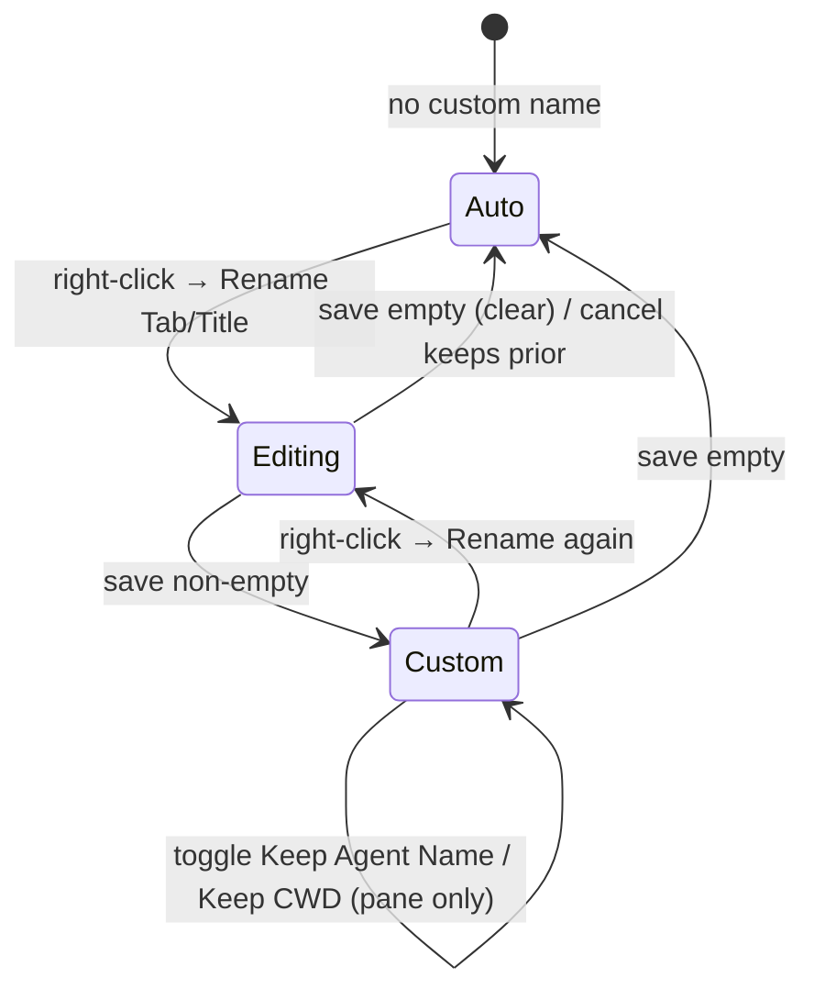

# APP-033 · Terminal Custom Naming — PRD

> **WHAT & WHY.** Users can manually name terminal tabs and terminal panes. The custom name wins over auto-generated names, persists across refresh, and can be cleared by saving an empty value.

Related: [APP-002 Terminal Multiplexing](../APP-002_terminal-multiplexing/TECH.md), [APP-003 Web Terminal Dynamic Title](../APP-003_web-terminal-dynamic-title/TECH.md), [APP-022 Canvas Terminal New Tab](../APP-022_canvas-terminal-new-tab/TECH.md).

---

## 1. Users & motivation

Developers who split the terminal into multiple panes/tabs and run several agents or long tasks in parallel. Auto titles (`Term`, `Terminal 2`, `claude`, `.../src/api`) collide and shift as commands change, so users lose track of "which pane does what". They want a stable, human-chosen label.

## 2. User stories

- As a user, I right-click a **terminal tab** and choose **Rename Tab** to type a custom tab name.
- As a user, I right-click a **terminal pane** and choose **Rename Title** to type a custom pane name.
- As a user, I toggle **Keep Agent Name** on a pane so, when an agent is detected, its icon + name still appears *after* my custom name.
- As a user, I toggle **Keep CWD** on a pane so the current directory still appears *after* my custom name.
- As a user, I clear a custom name by saving an empty value, returning the tab/pane to its automatic name.
- As a user, my custom names and toggles survive a browser refresh.

## 3. Functional requirements

### Must have

- **M1 — Tab rename entry point.** The terminal tab right-click menu includes **Rename Tab**, which opens an inline second-level input pre-filled with the current custom name (empty if none). Enter / blur saves; Escape cancels.
- **M2 — Pane rename entry point.** The terminal pane right-click (grid) menu includes **Rename Title**, opening the same style of second-level input.
- **M3 — Custom name priority.** A non-empty custom name is the top display source:
  - Tab bar shows `customTitle` instead of the auto tab title (including for the fixed `Term` tab).
  - Pane toolbar shows `customLabel` as the leading text.
- **M4 — Empty clears.** Saving an empty/whitespace-only value removes the override; the tab/pane reverts to its existing automatic name and (for panes) the normal agent/CWD display.
- **M5 — Pane toggles.** The pane menu (and the inline rename input) shows two checkboxes, **Keep Agent Name** and **Keep CWD**. **Both default to on** (checked) when the user opens the rename input.
  - They are only meaningful when a custom pane name is set.
  - The two are **mutually exclusive at display time**, matching today's `getTerminalDisplayMeta` behavior: **agent wins over CWD**. When an agent is detected, the CWD is hidden even if Keep CWD is on.
  - Resolution (after the custom name, at most one suffix):
    - **Keep Agent Name** on + an agent detected → append the agent icon + agent label. (CWD suppressed.)
    - Else **Keep CWD** on + a CWD/command title available → append the CWD/command title.
    - Else → only the custom name is shown.
- **M6 — Persistence.** `customTitle`, `customLabel`, `keepAgentName`, and `keepCwd` are written into the persisted terminal layout document and restored on load, so a refresh keeps them.
- **M7 — Display-only.** Custom naming never changes the tmux window name, pane `label`, tab `title` used for uniqueness, or any backend session identity.

### Should have

- **S1 — Normalization.** Custom names are trimmed, internal whitespace collapsed, and capped at 40 characters (reusing the existing tab-title cap).
- **S2 — i18n.** All new menu labels, the input placeholder, and toggle labels use `next-intl` keys in both `en.json` and `zh.json` under the existing `Terminal.chrome` namespace.

### Won't have (v1)

- Custom naming for Project Wiki / Code Review scoped panes.
- A "keep agent/CWD" style toggle for tabs.
- Syncing custom names to the shell prompt or server-side tmux window titles.

## 4. Display precedence

### Tab

```
displayTabTitle = customTitle?.trim() || (isFixedTab ? "Term" : autoTitle)
```

### Pane

At most one auto suffix is shown after the custom name — **agent wins over CWD** (same priority as the existing auto path):

```
if customLabel?.trim():
    parts = [customLabel]
    if keepAgentName and detectedAgent:      # agent wins, CWD suppressed
        parts += agent icon + agent.label
    elif keepCwd and dynamicCwdTitle:
        parts += dynamicCwdTitle
    displayPane = join(parts)                 # custom name always first
else:
    displayPane = getTerminalDisplayMeta(...)   # unchanged auto behavior

# keepAgentName and keepCwd both default to true
```

## 5. UX flow



## 6. Success criteria

- A renamed tab and pane keep their names and toggle states after a full browser refresh.
- Clearing a name restores the exact previous auto behavior.
- Toggling Keep Agent Name / Keep CWD changes only what is appended after the custom name, never the tmux window or session.

## 7. Non-scope

See §3 "Won't have" and [BRAINSTORM §5](./BRAINSTORM.md). No new REST endpoints — persistence rides the existing terminal layout document (WebSocket-first / existing layout save path).
