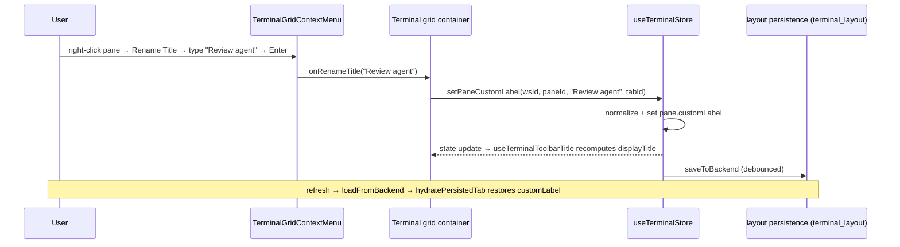

# APP-033 · Terminal Custom Naming — TECH

> **HOW.** Add display-only custom-name fields to the tab and pane models, thread them through the existing terminal layout persistence, extend the title composition in `useTerminalToolbarTitle`, and add rename/toggle UI to the tab and pane context menus. No backend/protocol changes — persistence reuses the existing terminal layout document.

Implements [PRD.md](./PRD.md). All paths under `apps/web` unless noted.

---

## 1. Architecture overview

```mermaid
flowchart TD
    subgraph UI
        TAB[CenterStageTabBar → TerminalExtraTab\n+ new tab context menu] -->|setTabCustomTitle| STORE
        PANEMENU[TerminalGridContextMenu\n+ Rename Title / Keep Agent Name / Keep CWD] -->|setPaneCustomLabel / setPaneTitleFlags| STORE
    end
    STORE[useTerminalStore] -->|saveToBackend debounce| PERSIST[terminal layout document\nworkspace/project terminal_layout]
    STORE --> HOOK[useTerminalToolbarTitle]
    HOOK -->|displayTitle + showAgentIcon| PANEVIEW[terminal-mosaic-workspace-pane-window]
    STORE --> TABVIEW[tab bar renders customTitle || title]
    PERSIST -->|loadFromBackend → hydratePersistedTab / getWorkspaceTerminalTabs| STORE
```

The custom fields are pure display metadata that live next to the existing identity fields. `label` / `tmuxWindowName` / `title` are untouched, so tmux attach, pane uniqueness (`getUniqueAgentName`, `getNextWindowName`), and tab dedup keep working exactly as today.

## 2. Data model changes

### 2.1 Pane — `apps/web/src/features/terminal/types/index.ts`

Add three optional fields to `TerminalPaneProps`:

```ts
export interface TerminalPaneProps {
  // ...existing...
  /** User custom display name. Highest-priority display source. Persisted. Empty/undefined = no override. */
  customLabel?: string;
  /**
   * When a customLabel is set, also show the detected agent icon + label after it.
   * Defaults to true (see §5 for how undefined is treated). Agent wins over CWD. Persisted.
   */
  keepAgentName?: boolean;
  /**
   * When a customLabel is set and no agent suffix is shown, also show the dynamic CWD/command
   * title after it. Defaults to true. Suppressed when the agent suffix is shown. Persisted.
   */
  keepCwd?: boolean;
}
```

`dynamicTitle` stays transient (not persisted). The new fields ARE persisted.

### 2.2 Tab — `apps/web/src/features/terminal/store/terminal-store-helpers.ts`

Add to `TerminalCenterTab`:

```ts
export interface TerminalCenterTab {
  id: string;
  title: string;      // auto name, still used for dedup/uniqueness
  closable: boolean;
  customTitle?: string; // user override, display-only, persisted
}
```

### 2.3 Persisted schema — `apps/web/src/features/terminal/lib/terminal-layout-document.ts`

- `PersistedTerminalPane = Omit<TerminalPaneProps, "sessionId" | "dynamicTitle">` — automatically inherits `customLabel` / `keepAgentName` / `keepCwd`. No type change needed, but see §4 (whitelist).
- `PersistedTerminalTabDocument`: add `customTitle?: string`.
- `normalizePersistedTerminalTabs`: preserve `customTitle` (`customTitle: tab.customTitle`). The fixed-tab branch keeps forcing `title: "Term"`, but must NOT drop `customTitle`.
- No schema version bump required (additive, optional fields; old documents simply have them undefined). Keep `TERMINAL_LAYOUT_SCHEMA = "terminal-layout.v1"`.

## 3. Store actions — `terminal-store-types.ts` + `use-terminal-store.ts`

New actions (all call the existing debounced `saveToBackend(workspaceId, isProjectContext)` after mutating, mirroring `setDynamicTitle`/`setTmuxWindowName`):

```ts
// normalize(): trim, collapse whitespace, cap 40; returns undefined when empty
setTabCustomTitle: (workspaceId: string, terminalTabId: string, title: string) => void;
setPaneCustomLabel: (workspaceId: string, paneId: string, label: string, terminalTabId?: string) => void;
setPaneTitleFlags: (
  workspaceId: string,
  paneId: string,
  flags: { keepAgentName?: boolean; keepCwd?: boolean },
  terminalTabId?: string,
) => void;
```

Behavior:

- `setTabCustomTitle`: writes `customTitle` on the tab in `workspaceTerminalTabs[workspaceId]`; empty normalized value → set `customTitle = undefined`.
- `setPaneCustomLabel`: writes `customLabel` on `workspacePanes[scopeKey][paneId]`; empty → `undefined`. Uses `getScopeKey(workspaceId, terminalTabId)`.
- `setPaneTitleFlags`: shallow-merges the provided flags onto the pane.
- Each action is a no-op (no save) if the target tab/pane is missing or the value is unchanged.

## 4. Persistence wiring — `buildPersistedTerminalWorkspaceLayout`

The serializer explicitly whitelists pane fields into `cleanPanes` — it must be extended:

```ts
cleanPanes[id] = {
  id: pane.id,
  label: pane.label,
  workspaceId: pane.workspaceId,
  tmuxWindowName: pane.tmuxWindowName,
  agent: pane.agent,
  projectName: pane.projectName,
  workspaceName: pane.workspaceName,
  isNewPane: pane.isNewPane,
  customLabel: pane.customLabel,     // NEW
  keepAgentName: pane.keepAgentName, // NEW
  keepCwd: pane.keepCwd,             // NEW
};
```

And each `persistedTabs.push({...})` (both the cached-tab branch and the live branch) must include `customTitle: tab.customTitle`.

`hydratePersistedTab` copies persisted panes with `...pane`, so the new fields survive hydration automatically. Confirm the spread keeps `customLabel`/`keepAgentName`/`keepCwd` and does not overwrite them (it only overrides `label`, `tmuxWindowName`, `sessionId`, `isNewPane`, `workspaceId`).

`getWorkspaceTerminalTabs` / `getAllDefaultPanesForWorkspace` need no change beyond carrying the extra fields through the object spreads already in place.

## 5. Display composition — `hooks/use-terminal-toolbar-title.ts`

Extend the hook input and return value:

```ts
useTerminalToolbarTitle(options: {
  baseTitle: string;
  configuredAgents: TerminalPaneAgent[];
  pinnedAgent?: TerminalPaneAgent;
  storeWrite: TerminalToolbarStoreWrite;
  customLabel?: string;      // NEW
  keepAgentName?: boolean;   // NEW
  keepCwd?: boolean;         // NEW
})
```

Logic (leaves `getTerminalDisplayMeta` unchanged). Note the flags **default to true** — treat `undefined` as `true` so pre-existing panes and freshly renamed panes keep agent/CWD context by default. Agent and CWD are **mutually exclusive** (agent wins):

```ts
const auto = getTerminalDisplayMeta({ baseTitle, dynamicTitle: mergedDynamic, configuredAgents, agent: mergedAgent });
const custom = customLabel?.trim();

if (!custom) {
  return { displayTitle: auto.displayTitle, toolbarAgent: auto.toolbarAgent, onTitleChange };
}

// undefined => on (default true)
const wantAgent = keepAgentName !== false;
const wantCwd = keepCwd !== false;

const showAgent = wantAgent && !!auto.toolbarAgent;
// CWD only when the agent suffix is NOT shown (mutually exclusive, agent wins)
const cwdSuffix =
  !showAgent && wantCwd && isPathLikeTitle(mergedDynamic) ? shortenPath(mergedDynamic) : undefined;

const displayTitle = [custom, showAgent ? auto.toolbarAgent!.label : undefined, cwdSuffix]
  .filter(Boolean)
  .join("  ");

return { displayTitle, toolbarAgent: showAgent ? auto.toolbarAgent : undefined, onTitleChange };
```

- `toolbarAgent` controls whether the icon renders in `TerminalTitleWithAgent`; returning `undefined` when `keepAgentName` is off (or no agent detected) hides the icon.
- At most one suffix (`agent label` **or** `cwd`) is ever appended, never both.
- `isPathLikeTitle` / `shortenPath` already exist in `packages/shared/src/terminal/title.ts`.

The pane window passes the new pane fields into the hook — `terminal-mosaic-workspace-pane-window.tsx` (and its scoped twin `terminal-mosaic-scoped-pane-window.tsx`):

```ts
const { displayTitle, toolbarAgent, onTitleChange } = useTerminalToolbarTitle({
  baseTitle: pane.label,
  configuredAgents,
  storeWrite,
  customLabel: pane.customLabel,
  keepAgentName: pane.keepAgentName,
  keepCwd: pane.keepCwd,
});
```

## 6. UI — context menus

### 6.1 Pane menu — `components/TerminalGridContextMenu.tsx`

- Add a **Rename Title** entry as a `DropdownMenuSub`; the sub-content hosts a small controlled `<input>` (Enter/blur → save, Escape → close) **plus** the two checkboxes below it, so the user can rename and adjust the toggles in one place. This mirrors the inline rename pattern already used in `WorkspaceContent.tsx`.
- Add two `DropdownMenuCheckboxItem`s: **Keep Agent Name** and **Keep CWD**. Their checked state is `keepAgentName !== false` / `keepCwd !== false` (undefined = checked, matching the default-on behavior in §5). Mute/disable them when no custom name is set (they are display-only no-ops then).
- The two are display-exclusive (agent wins). Both may be checked simultaneously in the UI — the runtime composition (§5) simply hides CWD whenever an agent is present. No need to force radio-style mutual exclusion in the checkboxes.
- Extend props with the current values + callbacks rather than only the `TerminalGridContextMenuAction` enum (the enum stays for value-less actions):

```ts
customLabel?: string;
keepAgentName?: boolean;
keepCwd?: boolean;
onRenameTitle: (value: string) => void;      // "" clears
onToggleKeepAgentName: (next: boolean) => void;
onToggleKeepCwd: (next: boolean) => void;
```

The grid component that renders `TerminalGridContextMenu` resolves the focused pane id and wires these to `setPaneCustomLabel` / `setPaneTitleFlags`.

### 6.2 Tab menu — `app-shell/CenterStageTabBar.tsx` (`TerminalExtraTab`)

- There is **no** terminal-tab context menu today (only a file-tab menu). Add an `onContextMenu` handler on the terminal tab trigger that opens a small `DropdownMenu`/`ContextMenu` with a single **Rename Tab** `DropdownMenuSub` → input (same pattern as §6.1).
- The tab bar renders `tab.customTitle || tab.title`. Keep `closeAriaLabel` using the effective display title.
- Save calls `setTabCustomTitle(workspaceId, tab.id, value)`; empty clears.

## 7. i18n keys (namespace `Terminal.chrome`)

Add to `apps/web/messages/en.json` and `apps/web/messages/zh.json`:

| Key | en | zh |
|-----|----|----|
| `contextMenu.renameTab` | Rename Tab | 重命名标签 |
| `contextMenu.renameTitle` | Rename Title | 重命名标题 |
| `contextMenu.keepAgentName` | Keep Agent Name | 保留 Agent 名称 |
| `contextMenu.keepCwd` | Keep CWD | 保留当前目录 |
| `contextMenu.renamePlaceholder` | Enter a name… | 输入名称… |

(Final Chinese wording to be confirmed during implementation; must be natural, not English copy.)

## 8. Sequence — rename a pane



## 9. Risks & mitigations

| Risk | Mitigation |
|------|-----------|
| Forgetting to add new fields to the `cleanPanes` whitelist → names silently not persisted | Explicit checklist item in TEST (persist-and-refresh scenario); the whitelist is the single serialization choke point. |
| Fixed `Term` tab overwrites `customTitle` in `normalizePersistedTerminalTabs` / `buildPersistedTerminalWorkspaceLayout` | Force `title` for the fixed tab but keep `customTitle` untouched; display uses `customTitle || "Term"`. |
| Toggles confusing when no custom name set | Disable/mute the checkboxes until a custom name exists (M5). |
| Scoped pane twin (`terminal-mosaic-scoped-pane-window.tsx`) not updated | Update both pane window components; TEST covers a split/scoped pane. |
| Custom name accidentally used as tmux window name | Never write `customLabel` into `label`/`tmuxWindowName`; getters for window name ignore `customLabel`. |

## 10. Rollout

- Pure additive frontend change; no migration. Old layout documents load with the new fields `undefined` (= no override).
- No feature flag needed; ships with the web app.
