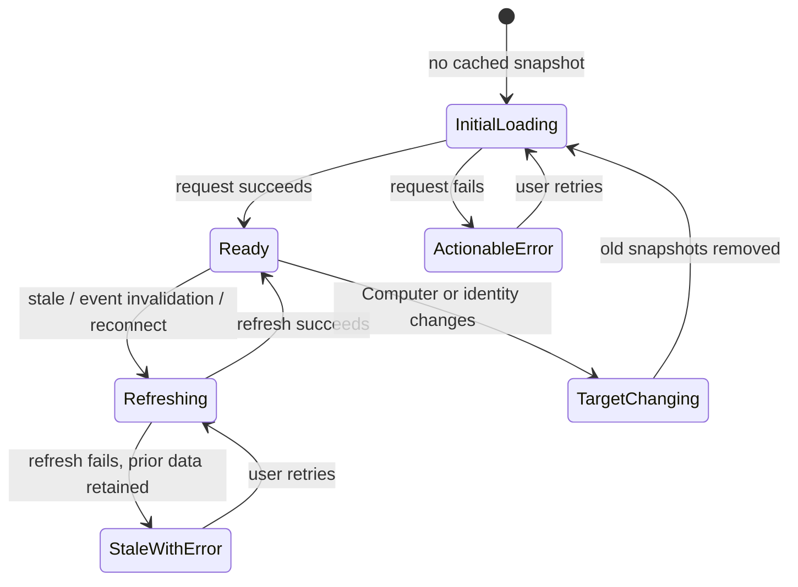

# PRD · APP-035: TanStack Query Data Layer

> Product Requirements · WHAT and WHY. Establish a consistent server-state experience in the Atmos web app without forcing streams or client state into a query cache.

## Context

- **Problem:** The web app loads and refreshes server-backed data through a mix of feature-local state, Zustand stores, manual caches, polling, and imperative refresh functions. Users can encounter avoidable loading flashes, stale panels after mutations, inconsistent recovery from errors, and unsafe transitions between Atmos Computers.
- **Why now:** The requested UX initiative is supported by a current-code audit, not by a measured production incident: server-backed surfaces have expanded across local browser, Desktop, and Relay modes, while the web app carries duplicated cache and race-control behavior. The mobile app already demonstrates TanStack Query with WebSocket-backed reads.
- **Product direction:** Adopt TanStack Query as the default owner of cacheable server-state snapshots and mutations in `apps/web`. Keep Zustand for client-owned state and complex orchestration, and keep long-lived WebSocket streams outside Query.
- **Related specs:** [APP-001 Atmos Core](../APP-001_atmos-core/PRD.md), [APP-016 Atmos Computer](../APP-016_atmos-computer/PRD.md), [APP-025 Mobile App](../APP-025_mobile-app/PRD.md), and [APP-034 Terminal Workspace Caching](../APP-034_terminal_caching/PRD.md).

## Goals

1. **Primary:** Make server-backed screens feel consistent and responsive by reusing recent data, deduplicating equivalent reads, and avoiding empty-state flashes during ordinary refreshes.
2. Keep all visible server-state snapshots fresh after relevant mutations and WebSocket notifications.
3. Prevent data from one Atmos Computer or authentication context from appearing under another.
4. Give users consistent pending, error, retry, and recovery behavior across migrated domains.
5. Reduce duplicated cache and race-control behavior without changing Atmos transport semantics.
6. Deliver the migration incrementally so each domain remains usable and releasable throughout the transition.

## Users & Scenarios

- **Primary persona:** Agentic Builders moving frequently among Projects, Workspaces, Git changes, settings, automations, and multiple Atmos Computers.
- **Secondary persona:** Atmos maintainers adding or changing frontend API integrations and needing one predictable server-state contract.

### Key scenarios

1. A user revisits a recently viewed server-backed surface and sees useful cached data immediately while freshness is checked in the background.
2. A user performs a mutation in one panel and every other mounted consumer of the affected data converges on the authoritative state without manual refresh.
3. A user switches from Computer A to Computer B and never sees Projects, Git state, settings, or diagnostics from Computer A under the new target.
4. A Relay or local WebSocket disconnects and reconnects; cacheable snapshots recover without duplicate request storms while terminal and Agent Chat streams retain their existing lifecycle.
5. A maintainer adds a cacheable API read and can identify its key scope, freshness policy, error behavior, and invalidation sources without inventing a feature-local cache.

## User Stories

- As an Agentic Builder, I want recently loaded data to remain visible during background refresh so that navigation does not repeatedly interrupt my work.
- As an Agentic Builder, I want changes made in one surface to appear in other relevant surfaces so that I can trust the current state.
- As a user of multiple Atmos Computers, I want each Computer's data isolated so that I never act on stale information from another machine.
- As a user on an unstable connection, I want recoverable errors and reconnects to preserve context and retry safely.
- As a maintainer, I want a standard server-state pattern so that new features do not add another bespoke cache, polling loop, or stale-response guard.

## Functional Requirements

### Must Have

- **M1 — Explicit server-state boundary.** Every migrated operation is classified as a cacheable query, mutation, notification event, stream, or client-owned state. Every cacheable server snapshot uses TanStack Query after its domain cuts over, including data returned by WebSocket request/response actions; transport type is not an exemption. Any deferred read requires an explicit inventory rationale.
- **M2 — Consistent cached-read experience.** Equivalent concurrent reads share one in-flight request. Recently successful data remains available during ordinary background refresh unless the product workflow requires an explicit blocking state.
- **M3 — Mutation freshness.** A successful mutation updates or invalidates every affected cached snapshot. Failed optimistic mutations restore the last authoritative state and expose a recoverable error.
- **M4 — WebSocket push integration.** Existing WebSocket notifications continue to deliver real-time signals. Relevant events update or invalidate cached snapshots; event streams are not replaced with HTTP polling.
- **M5 — Connection and identity isolation.** Cache identity includes the active Atmos Computer and any identity-bearing authentication context. Target switch, logout, and credential changes prevent old-context data from rendering in the new context.
- **M6 — Reconnect and retry safety.** Cacheable WebSocket reads only run when their transport is usable. A reconnect refreshes stale data without unbounded retries, duplicate request storms, or interruption of unrelated streams.
- **M7 — Consistent user feedback.** Migrated surfaces expose predictable initial-loading, background-refresh, mutation-pending, empty, error, and retry states. Existing inline-feedback conventions remain in force.
- **M8 — Incremental migration without functional regression.** Local browser, Desktop, and Relay workflows remain supported after every migration phase. A domain has one declared server-state owner before its legacy cache or store slice is removed.
- **M9 — Transport preservation.** The migration reuses existing REST and WebSocket API clients. It adds no duplicate REST endpoint solely to make a query hook easier to implement.
- **M10 — Auditable coverage.** Every API domain entering migration has a reviewable record of what moved, what remains deferred or excluded, and whether duplicate server-state ownership has been removed.
- **M11 — Measured rollout.** Before each user-visible domain cutover, a representative journey records current request and loading behavior; the same journey is checked after cutover for deduplication, continuity, freshness, and regressions.

### Nice to Have

- **N1 — Cross-app convention alignment.** Web and mobile use compatible terminology and key-scoping principles where they access the same Atmos Computer data, without requiring a shared runtime package.
- **N2 — Development diagnostics.** Development builds can inspect query state and invalidation behavior without exposing sensitive payloads or adding production UI.

## Out of Scope

- **Terminal PTY traffic and process output** — bidirectional streams are not server-state snapshots.
- **Agent Chat runtime WebSocket** — conversation, tool, permission, and output streaming retain their dedicated lifecycle.
- **Terminal DOM/runtime caching** — APP-034 intentionally keeps mounted terminal resources in Zustand and the DOM.
- **Editor buffers, navigation, layout, selections, and unsaved document state** — these remain client-owned.
- **Live document editing state** — Query may own load/save boundaries, but not the active editing model.
- **Connection bootstrap orchestration** — token hydration, client-session setup, and transport establishment stay imperative; they may trigger cache lifecycle actions.
- **Persistent browser query cache** — server snapshots are memory-only in this version.
- **New backend protocols or persistence** — this is a frontend data-ownership migration.
- **Immediate migration of every API operation** — unused APIs, OS integration commands, lifecycle commands, and complex domains may remain deferred with an explicit owner.
- **Mobile feature migration** — APP-025 is a behavioral reference; this spec changes the web app.

## Success Metrics

- **Correctness:** zero cross-computer or cross-auth cache leaks in automated target-switch and credential-change scenarios.
- **Deduplication:** concurrent consumers of the same migrated key produce one underlying request in deterministic tests.
- **Freshness:** every migrated mutation and mapped WebSocket event has an automated assertion proving affected consumers converge without manual refresh.
- **Perceived continuity:** representative back-navigation and background-refresh journeys keep the previous successful data visible rather than rendering an empty surface.
- **Recovery:** reconnect tests finish with bounded request counts and current data; no unhandled promise rejection or infinite retry loop occurs.
- **Migration quality:** no migrated domain retains two active server-state caches after its compatibility phase ends.
- **Regression:** existing web typecheck, scoped Bun tests, E2E smoke, and affected domain tests pass at each rollout phase.
- **Qualitative:** exploratory review finds loading, stale, empty, and retry states understandable without relying on developer tooling.

## Product Decisions

- Choose the hybrid direction from `BRAINSTORM.md`: Query owns cacheable server snapshots; Zustand and local React state retain client state and orchestration.
- Use an incremental domain rollout rather than a big-bang wrapper migration.
- Include both REST and WebSocket request/response snapshots; transport type alone does not determine server-state ownership.
- Treat idempotent WebSocket data-fetch actions as Query reads across all included domains; components and stores do not keep calling them as independent imperative fetches after cutover.
- Remove or isolate old-target server snapshots on target or identity change. Fast return to an old target is secondary to correctness in v1.
- Preserve WebSocket notifications and streams. Query consumes their freshness signals but does not replace them.
- Allow optimistic mutations only when rollback behavior is deterministic; otherwise retain current data and refetch authoritatively after success.

### User-visible server-state lifecycle

## Risks & Open Questions

- **Risk — temporary dual ownership:** A migration phase can create two caches for the same snapshot and produce races. Each domain needs an explicit cutover point.
- **Risk — unfamiliar background refresh:** Users may interpret retained data as final. Migrated surfaces must distinguish refresh activity when it matters to the action being taken.
- **Risk — broad scope:** Project, Git, filesystem, review, settings, and automation stores encode different orchestration semantics. The rollout must not treat them as mechanical hook conversions.
- **Risk — target-switch expectations:** Removing old-target snapshots favors safety but can make returning to a Computer less instant until it refetches.
- **Baseline assumption for review:** The pilot measures system diagnostics, settings bootstrap, and usage overview; Project/Workspace and Git receive their own baseline before later cutovers.
- **Diagnostics assumption for review:** Initial implementation uses tests and logs only; Query Devtools remain a later Nice to Have.
- **Cross-app assumption for review:** Web and mobile align conventions only; shared key factories require a separate justification.

## Milestones

- **Phase 1 — Foundation and pilot:** establish the server-state contract, connection isolation, and low-coupling pilot surfaces. This is the first releasable milestone, not completion of APP-035.
- **Phase 2 — Shared bootstrap and settings:** replace duplicated single-flight/settings caches and standardize mutation freshness.
- **Phase 3 — Core workspace data:** migrate Project/Workspace, Git, and filesystem snapshots domain by domain.
- **Phase 4 — Extended features:** migrate GitHub, reviews, skills, automations, usage, local models/services, and remaining eligible reads.
- **Phase 5 — Cleanup and measurement:** remove superseded caches, close inventory gaps, compare representative UX baselines, and document intentionally deferred operations. APP-035 is complete only when all included domains have reached cutover/cleanup, every included REST and WebSocket snapshot read is Query-owned, and M1–M11 are verified; explicitly deferred and excluded operations do not block completion.
