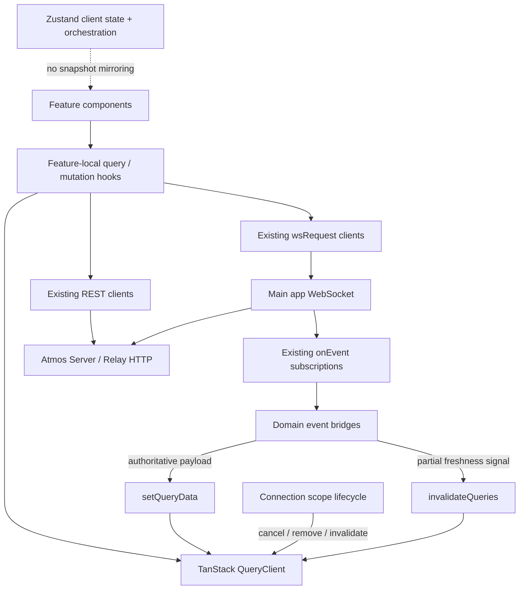

# TECH · APP-035: TanStack Query Data Layer

> Technical Design · HOW. Implements [PRD APP-035](./PRD.md) M1–M11 and defines an incremental server-state migration for `apps/web`.

## Scope summary

Add TanStack Query to the web app as a transport-independent server-state cache. Existing REST and WebSocket clients remain the transport boundary; feature-local query and mutation hooks become the React consumption boundary. Connection-scoped keys, explicit target-change cleanup, and WebSocket event bridges provide freshness and isolation.

This design changes no Rust crate, database schema, API route, or WebSocket action. Terminal PTY, Agent Chat, chunk streams, editor buffers, connection bootstrap, and retained terminal runtime state remain outside Query. Mobile code is a convention reference only.

## Decisions

| Fork | Decision | Rationale |
|------|----------|-----------|
| Coverage | Migrate cacheable server state, not every API function | Query models snapshots and mutations; streams and client state need different ownership |
| Transport | Support REST and WebSocket request/response query functions | Cache semantics do not depend on HTTP |
| Rollout | Foundation → pilot → domain migrations → cleanup | Prevents a long-lived big-bang branch and isolates regressions |
| Cache identity | Computer root uses active instance id, connection epoch, and Relay session revision; Relay control-plane root uses normalized URL plus auth revision | Prevents cross-target, cross-session, and cross-credential reuse without putting secrets in keys |
| Target switch | Cancel and remove all Computer-scoped queries before loading the new target | Correctness and privacy take priority over instant return to an old target |
| Reconnect | Keep same-target cache, then selectively invalidate stale domains after reconnect | Avoids empty flashes and blanket refetch storms |
| Push events | Patch cache only when an event carries a complete authoritative value; otherwise invalidate | Prevents partial payloads from becoming false snapshots |
| Zustand | Keep client state and orchestration; do not mirror Query snapshots into Zustand | One server-state owner per domain |
| Mutations | Optimistic only when rollback is deterministic; otherwise invalidate after success | Avoids speculative state for destructive or multi-step workflows |
| Persistence | Memory-only Query cache | Avoids stale or sensitive snapshots in browser storage |

## Architecture overview



Provider order in `apps/web/src/app/layout.tsx`:

```text
WorkbenchIntlProvider
  QueryProvider
    QueryFocusBridge
    UpdateNotification
    WebSocketProvider
      DesktopStartupPrefetchBootstrap
      TmuxCheckProvider
      ...
```

`QueryProvider` must wrap `WebSocketProvider` because connection handlers, startup prefetch, and event subscriptions need access to the shared client. It remains inside `WorkbenchIntlProvider`; Query itself owns no user-facing copy.

## Module-by-module design

### Dependency

- Add the latest compatible `@tanstack/react-query` through Bun to `apps/web/package.json`.
- Do not add persistence or devtools packages in the initial implementation.
- `apps/mobile` keeps its existing dependency and provider; no package extraction is required.

### `apps/web/src/providers/app/query-client.ts`

Own the web QueryClient factory and browser client accessor:

```ts
export function createAtmosWebQueryClient(): QueryClient;
export function getAtmosWebQueryClient(): QueryClient;
```

Default query policy:

```ts
{
  staleTime: 15_000,
  retry: 1,
  refetchOnWindowFocus: false,
  refetchOnReconnect: false,
}
```

Mutation default: `retry: 0`.

Rules:

- Tests call `createAtmosWebQueryClient()` for isolated clients.
- Browser lifecycle and event modules call `getAtmosWebQueryClient()`; they do not create additional clients.
- The browser singleton is not persisted and must not prefetch during server rendering.
- WebSocket-backed query options override retry to avoid retrying while the WebSocket store reports `disconnected` or `reconnecting`.

### `apps/web/src/providers/app/query-provider.tsx`

- Client component that obtains the single browser QueryClient and renders `QueryClientProvider`.
- Mount in `apps/web/src/app/layout.tsx` above `WebSocketProvider`.
- Do not expose Query Devtools in production. A later N2 decision may add a development-only dynamic import.

### `apps/web/src/providers/app/query-focus-bridge.tsx`

- Set TanStack `focusManager` from `document.visibilityState`.
- Set `onlineManager` from browser `online` / `offline` events.
- Do not equate browser online status with main WebSocket readiness.
- Relay HTTP queries may opt into `refetchOnWindowFocus`; Computer WebSocket queries rely on connection-state enablement and the reconnect bridge.
- Reuse the same visibility and online listeners currently used to prompt WebSocket reconnect where possible; avoid two listeners issuing duplicate connects.

### `apps/web/src/api/query/query-scope.ts`

Introduce connection-scope values without including credentials:

```ts
interface ComputerQueryScope {
  activeInstanceId: ConnectionInstanceId;
  connectionEpoch: number;
  relaySessionRevision: number;
}

interface RelayQueryScope {
  relayUrl: string;
  authRevision: number;
}
```

Changes:

- Extend `apps/web/src/features/connection/store/connection-store.ts` with `connectionEpoch` and `bumpConnectionEpoch()`.
- Extend `apps/web/src/features/connection/lib/atmos-computer-store.ts` with in-memory `relayAuthRevision`, `relaySessionRevision`, and their bump actions.
- Increment `relayAuthRevision` when access token, Relay URL, or Relay secret changes identity-bearing request credentials. Do not increment for display-name or selected-computer changes.
- Increment `relaySessionRevision` whenever `relayGatewayHttpBase` or `relayClientToken` changes, including session hydration and same-Computer Relay re-registration. Never put either value in a key.
- Increment `connectionEpoch` only for an intentional target/identity transition, not a transient reconnect to the same target.
- The centralized `connectionEpoch` is the only writer for Query scope. Existing `useProjectStore.connectionEpoch` remains a private stale-response guard during compatibility, is never used in a Query key, and is removed after Project migration.
- A `relaySessionRevision` change cancels/removes the previous active Computer root before system HTTP reads resume. This intentionally sacrifices same-session cache retention when gateway credentials rotate.

### `apps/web/src/api/query/query-keys.ts`

All key factories return readonly tuples:

```ts
const queryKeys = {
  computer: {
    root: (scope: ComputerQueryScope) =>
      [
        "atmos",
        "computer",
        scope.activeInstanceId,
        scope.connectionEpoch,
        scope.relaySessionRevision,
      ] as const,
    system: (scope: ComputerQueryScope) =>
      [...queryKeys.computer.root(scope), "system"] as const,
    settingsBootstrap: (scope: ComputerQueryScope) =>
      [...queryKeys.computer.root(scope), "settings", "bootstrap"] as const,
    projectBootstrap: (scope: ComputerQueryScope) =>
      [...queryKeys.computer.root(scope), "projects", "bootstrap"] as const,
    git: (scope: ComputerQueryScope, repoPath: string) =>
      [...queryKeys.computer.root(scope), "git", repoPath] as const,
    files: (scope: ComputerQueryScope, rootPath: string) =>
      [...queryKeys.computer.root(scope), "files", rootPath] as const,
  },
  relay: {
    root: (scope: RelayQueryScope) =>
      ["atmos", "relay", scope.relayUrl, scope.authRevision] as const,
  },
};
```

Key rules:

- Include every identifier that changes the result: Computer scope, Project/Workspace, repository path, filters, cursor, and comparison options.
- Normalize paths and Relay origins before key construction.
- Never include access tokens, Relay client tokens, secrets, attachment contents, file contents, or mutation payloads.
- Use object key segments only for small serializable filter objects with stable field names.
- Query keys describe resources, not component names.

### `apps/web/src/api/query/computer-query-options.ts`

Provide shared helpers, not domain-specific mega-hooks:

- `computerQueryEnabled(scope, connectionState)` returns true only for a complete scope and `connected` WebSocket.
- `wsQueryOptions(...)` applies the Computer key, `enabled`, and connection-aware retry policy around existing API functions.
- Do not hide domain `staleTime`, polling, or invalidation decisions in a generic wrapper.

### `apps/web/src/app-shell/bootstrap/connection-target-lifecycle.ts`

Update `prepareConnectionTargetChange()`:

1. Capture the old Computer scope.
2. Cancel all in-flight queries under `["atmos", "computer"]`.
3. Remove all Computer-scoped query data.
4. Synchronize the new `activeInstanceId`.
5. Increment centralized `connectionEpoch`.
6. Run the remaining client-store resets and restore per-instance editor preferences.

Capture the old scope before calling `bootstrapActiveInstance()`, which synchronizes the new target in current code. `ConnectionBootstrapper.tsx`, `app-connection-bootstrap.ts`, and `hosted-connection-actions.ts` continue to enter through this lifecycle rather than reproducing cleanup.

Credential reset/logout additionally:

1. Increment `relayAuthRevision`.
2. Remove all `["atmos", "relay"]` queries.
3. Remove all Computer queries and reconnect through the existing connection flow.

Concrete identity/session integration points:

- `apps/web/src/features/atmos-computer/components/AtmosComputerSection.tsx`
- `apps/web/src/features/welcome/components/HostedWelcomeGate.tsx`
- `apps/web/src/features/connection/lib/sync-computer-client-settings.ts`
- `apps/web/src/features/connection/lib/hydrate-relay-session.ts`
- `apps/web/src/features/connection/lib/hosted-connection-actions.ts`
- `useAtmosComputerStore.resetRelaySession()`

Credential setters must call one shared identity-transition action rather than relying on every component to remember cache cleanup. Relay session hydration must call one atomic session setter for WebSocket URL, gateway base, and client token so `relaySessionRevision` changes once per accepted session.

Transient same-target reconnect:

- Do not bump epoch and do not clear successful cache data.
- On `connected`, invalidate only registered reconnect-sensitive domain roots.
- Active queries refetch; inactive queries remain stale until next use.

When Relay gateway credentials rotate during that reconnect, treat it as a session transition: bump `relaySessionRevision`, remove the previous Computer root, and load under the new root.

Replace `reloadActiveConnectionData()` with domain invalidation or `ensureQueryData()` once Project bootstrap is migrated. Keep a compatibility call only while `useProjectStore` remains the owner.

### `apps/web/src/app-shell/bootstrap/legacy-server-state-reset.ts`

M5 applies before every domain has migrated. Add an explicit compatibility reset registry for legacy Computer-scoped snapshots that current target cleanup misses, including `useGitStore`, `useWikiStore`, `useLocalServicesStore`, review snapshots, and server-backed settings caches. Add narrow `resetForConnectionChange()` actions where absent.

- Call this registry from `prepareConnectionTargetChange()` after query cancellation and before the new target renders.
- Never reset `useTerminalCacheStore`, retained terminal runtimes, per-instance UI preferences, or unsaved editor buffers except where existing target-switch behavior already requires it.
- Remove each legacy reset entry when that domain reaches Query cutover.
- A domain cannot claim M8 compatibility while its old snapshot can survive a target switch.

### `apps/web/src/api/query/reconnect-invalidation.ts`

Define the reconnect-sensitive root registry:

```ts
export function reconnectInvalidationKeys(scope: ComputerQueryScope): QueryKey[];
export async function invalidateAfterComputerReconnect(
  client: QueryClient,
  scope: ComputerQueryScope,
): Promise<void>;
```

Initial roots: system diagnostics, settings bootstrap, and usage overview. Add Project/Workspace, Git, files, and extended domains only at their cutover. The function invalidates each root once, with `refetchType: "active"`.

### `apps/web/src/providers/app/websocket-provider.tsx`

- Keep WebSocket connection ownership and existing notification subscriptions.
- Add one reconnect bridge that detects a transition from a non-connected state into `connected` and calls `invalidateAfterComputerReconnect()` once for the current scope.
- Remove imperative `useProjectStore.fetchProjects()` only after Project bootstrap cutover.
- Remove imperative settings loads only after each settings domain has a Query owner.
- Keep `useAgentHooksStore.init()` until Agent Hooks receives a separate design; it is deferred in this spec.

`QueryFocusBridge` only updates TanStack `focusManager` / `onlineManager`; it never calls `connect()`. `WebSocketProvider` retains the sole visibility/online reconnect listener, eliminating duplicate connection attempts.

### `apps/web/src/providers/app/server-state-event-bridge.tsx`

Mount one bridge beside `WebSocketProvider` for domains that have cut over. It composes idempotent feature-local subscription functions and owns their cleanup.

- Pilot: move `usage_overview_updated` ownership out of `UsagePopover.tsx` and `Footer.tsx` into the bridge.
- Later domain cutovers remove equivalent component-level subscriptions before enabling the domain bridge.
- Stream/chunk listeners may remain with their workflow owner and are not registered as snapshot bridges.
- A test asserts that mounting multiple consumers does not increase domain subscription count.

### `apps/web/src/app-shell/bootstrap/DesktopStartupPrefetchBootstrap.tsx`

- During compatibility, retain existing Project-store prefetch.
- After Project bootstrap cutover, replace `fetchProjects()` and store-idle polling with `queryClient.prefetchQuery()` / `ensureQueryData()` using the active Computer scope.
- Preserve the existing Desktop timeout and non-blocking fallback.

### Feature-local query ownership

Queries and mutations live with their domain:

```text
apps/web/src/features/<domain>/hooks/use-<resource>-query.ts
apps/web/src/features/<domain>/hooks/use-<operation>-mutation.ts
apps/web/src/features/<domain>/lib/<domain>-query-options.ts
apps/web/src/features/<domain>/lib/<domain>-query-events.ts
```

Rules:

- Query functions call `apps/web/src/api/*`; they do not call raw `fetch` or construct WebSocket hosts.
- Reusable options factories may live in feature `lib/`; React hooks live in feature `hooks/`.
- Components render Query state directly. Do not copy `data`, `isLoading`, or `error` into local state.
- Non-React imperative consumers use the same options through `queryClient.fetchQuery()`, `ensureQueryData()`, `getQueryData()`, or mutations exposed by a domain service.
- A temporary Zustand facade may keep action orchestration, but it must not retain a second copy of Query-owned server data.

## Server-state ownership contract

### Queries

- Idempotent server snapshots use `useQuery` or `useInfiniteQuery`.
- Initial load may block the owned surface; background refresh keeps the last successful data.
- Pagination cursors are part of the key/page parameter, not hook-local cache maps.
- Poll only when the remote state lacks an event and the operation has an explicit interval. Polling stops when the terminal state is reached.

### Mutations

Default lifecycle:

```text
mutation starts
  → expose pending state at the initiating control
  → call existing REST or WS client
  → on success: set authoritative response and/or invalidate affected resource roots
  → on failure: restore optimistic snapshot when one exists
  → expose recoverable inline/error feedback
```

- Destructive, long-running, and multi-resource operations default to authoritative refetch, not optimism.
- Success feedback remains inline where the initiating control can show completion.
- Error toasts remain valid for cross-context or background failures.
- Mutations do not retry by default.

### WebSocket events

Each migrated domain exports one idempotent subscription function. The function returns cleanup and may:

- call `setQueryData` when the payload is the complete current snapshot;
- call `invalidateQueries` when the payload is partial, ordering-sensitive, or only a freshness signal;
- update client-only progress state outside Query for incremental output;
- never start a second event subscription per mounted consumer.

Initial event map:

| Event | Query action | Non-query state |
|-------|--------------|-----------------|
| `workspace_setup_progress` | Invalidate affected workspace/project snapshot at completion or identity change | Keep incremental setup progress in orchestration state |
| `workspace_delete_progress` | Invalidate Project bootstrap when deletion completes | Keep toast/progress lifecycle |
| `workspace_gitignore_sync_failed` | Invalidate gitignore settings if needed | Keep error feedback |
| `usage_overview_updated` | `setQueryData` when payload is complete | None |
| `token_usage_updated` | Invalidate token usage overview | None |
| `local_model_state_changed` | Invalidate model list/status | Keep download progress event handling if incremental |
| `automation_definition_updated` | Patch or invalidate automation definition/list | None |
| `automation_run_updated` | Patch run detail and invalidate run list | None |
| `automation_run_output` | No Query append | Keep stream buffer |
| `llm_provider_test_chunk` | No Query action | Keep mutation-local stream buffer |
| `git_commit_message_chunk` | No Query action | Keep generation stream buffer |
| `canvas_agent_dispatch` | No Query action | Keep bridge lifecycle |

## Data model and transport

No server-side data model or protocol changes.

Frontend-only concepts:

```ts
type ApiOperationClass =
  | "query"
  | "mutation"
  | "event"
  | "stream"
  | "client-state"
  | "deferred";

interface ApiMigrationEntry {
  domain: string;
  operation: string;
  transport: "rest" | "websocket-request" | "websocket-event" | "dedicated-stream";
  classification: ApiOperationClass;
  legacyOwner: string;
  queryKeyRoot?: string;
  invalidatedBy?: string[];
  phase: "pilot" | "domain" | "deferred" | "excluded";
}
```

These fields define both the human-readable matrix and the typed development/test inventory below. Production UI never reads the inventory.

### `apps/web/src/api/query/api-operation-inventory.ts`

For M10/M11, commit a typed development/test inventory rather than relying on Markdown parsing:

```ts
export const apiOperationInventory = [
  // one entry per exported operation in a domain before that domain cuts over
] as const satisfies readonly ApiMigrationEntry[];
```

- The module has no side effects and is not imported by production UI.
- Inventory tests reject duplicate operation ids, missing owner/classification/phase fields, Query entries without a key root, and event-driven entries without `invalidatedBy`.
- Each migration PR enumerates all exports in its affected API modules. The inventory is not required to auto-discover future exports across the entire app; code review and the domain test fixture update it when a module changes.
- Baseline evidence for M11 is recorded in `TEST.md` Coverage Status or the domain's implementation log before and after cutover.

### Transport invariants

- Existing functions in `apps/web/src/api/rest-api.ts`, `apps/web/src/api/relay.ts`, `apps/web/src/api/ws-api.ts`, and `apps/web/src/api/ws/*` remain transport adapters.
- `wsRequest()` remains the request/response primitive and may wait for an in-progress connection. Query hooks still use `enabled: connectionState === "connected"` to prevent speculative requests.
- No new REST endpoint or WebSocket action is introduced by APP-035.
- Direct feature-level `fetch`, `send`, or `wsRequest` calls should be consolidated into the existing domain API module when that domain migrates.
- Name collisions such as REST `agentApi` and WS `agentApi` should be resolved during that domain's migration with explicit aliases; this is a client naming cleanup, not a protocol change.

## Migration matrix

The typed inventory expands each grouped row to individual exported operations before cutover.

| Domain / operation group | Class | Legacy owner | Target owner | Invalidated by / freshness source | Phase | Status |
|--------------------------|-------|--------------|--------------|-----------------------------------|-------|--------|
| Tmux, runtime, GH CLI status, terminal overview, WS connections | Query | Hook/component local state | System query hooks | reconnect; explicit user refresh | Pilot | planned |
| Canvas default board load/save | Query + mutation | `use-canvas-board` and mixed REST/WS callers | Canvas query hooks after one transport is chosen | successful save | Deferred decision | deferred |
| Settings bootstrap and function settings | Query + mutation | `settingsBootstrapCache` + Zustand | Settings bootstrap query + selectors/mutations | mutation success; reconnect | Pilot | planned |
| Usage overview | Query + mutation + event | `Footer`, `UsagePopover`, synthetic event | Usage query hooks + single event bridge | `usage_overview_updated`; mutation success; reconnect | Pilot | planned |
| Token usage | Query + event | `TokenUsageDialog` local state | Token usage query hook | `token_usage_updated` | Extended | planned |
| ACP session list | Infinite query | `use-acp-session-list` refs/state | Agent session infinite query | session create/logout; explicit refresh | Extended | planned |
| Project/Workspace bootstrap and CRUD | Query + mutations + events | `useProjectStore` | Project/Workspace queries; thin UI selection store | workspace progress completion; CRUD | Core | planned |
| Git status, changed files, diffs, branches | Queries + mutations | `useGitStore`, `useGitInfoStore` | Git query hooks; orchestration-only store | Git mutations; reconnect; workspace changes | Core | planned |
| Files, tree, search | Queries + mutations | `useFileTreeStore`, editor callers | Filesystem queries; editor buffer remains Zustand | filesystem mutations; workspace changes | Core | planned |
| GitHub PR/CI/actions | Queries + mutations + polling | Hook-local state + `github-pr-cache` | GitHub query hooks + consolidated WS API | GitHub mutations; terminal CI polling rule | Extended | planned |
| Review sessions/files/comments | Queries + mutations | `use-review-context` | Review queries + thin workflow orchestration | review mutations | Extended | planned |
| Skills | Queries + mutations | Component local state | Skills query hooks | install/enable/delete/sync | Extended | planned |
| Automations definitions/runs | Queries + mutations + events/stream | Hook-local state + WS sync | Automation queries/event bridge; output stream local | `automation_definition_updated`; `automation_run_updated` | Extended | planned |
| Local models/services | Queries + mutations + events | Zustand stores | Query hooks; progress events local | `local_model_state_changed`; scan/stop | Extended | planned |
| Agent registry/custom agents | Queries + mutations | Agent manager hook state | Agent registry query hooks | install/remove/config mutations | Extended | planned |
| Terminal layout persistence | Mixed query/mutation + client runtime | `useTerminalStore` | Requires separate layout/runtime design | Existing save/load lifecycle | Deferred | deferred |
| Agent Hooks sessions/status | Query + mutations + events | `useAgentHooksStore` | Requires separate live-lifecycle design | `agent_hook_state_changed`; sessions cleared | Deferred | deferred |
| Connection/client-session/token hydration | Orchestration | Connection stores/libs | Existing imperative lifecycle | identity/session transition actions | Excluded | excluded |
| Terminal PTY, Agent Chat, output chunks | Streams | Dedicated sockets/event buffers | Existing owners | Dedicated transport events | Excluded | excluded |
| Editor buffers, layout, navigation, terminal DOM cache | Client state | Zustand/React/DOM | Existing owners | Client actions | Excluded | excluded |
| OS open commands and Preview Next routes | Command/local HTTP | API helpers | Existing owners unless separately justified | Explicit command | Excluded | excluded |

Before a domain moves from `planned` to `complete`, its implementation review must enumerate every exported operation in that domain and assign one row/classification. Unused operations may remain deferred; they must not receive empty Query wrappers for coverage statistics.

## Pilot design

The first implementation slice includes:

1. Query provider, client defaults, key factories, connection epoch, auth revision, and target cleanup.
2. `TmuxCheckProvider` / `useTmuxCheck` migrated to a system-status query.
3. Runtime/GH CLI/terminal overview consumers migrated where they share the same low-coupling system API pattern.
4. Settings bootstrap read migrated from `settingsBootstrapCache` to one query with selectors for each section.
5. Function-settings mutation parity, including stale-response and rollback tests.
6. Usage overview event bridge as the first authoritative push-to-cache example.

Canvas is not in the committed pilot until REST versus WebSocket write ownership is resolved. Project/Workspace bootstrap begins after the pilot proves connection isolation and imperative prefetch behavior.

## Compatibility and store cutover

Each domain uses four states:

1. **Inventoried:** operations and owners documented; no runtime change.
2. **Compatibility:** Query hooks exist, but legacy consumers still use the old owner. No consumer reads both.
3. **Cutover:** all consumers read Query; legacy mutations route through Query invalidation.
4. **Cleaned:** old snapshot fields, caches, timers, stale-response ids, and duplicate event emissions are removed.

Merge rule: a consumer must switch atomically from legacy data to Query data. Compatibility code may duplicate transport adapters, but it may not mirror or synchronize two caches.

During the pilot, Project prefetch remains entirely legacy-owned. The provider foundation does not create a Project Query, so `WebSocketProvider`, `DesktopStartupPrefetchBootstrap`, and `reloadActiveConnectionData()` cannot duplicate a Query request. All three switch atomically in the Project cutover commit.

Examples:

- `settingsBootstrapCache` remains until all four bootstrap sections have Query consumers and equivalent mutation race tests, then is removed.
- `github-pr-cache.ts` is removed only when every PR-list consumer uses the same GitHub key factory.
- `useProjectStore` retains selection and setup orchestration after its Project/Workspace snapshot fields move to Query.
- `useGitStore` retains action orchestration only if imperative consumers still need it; status/diff snapshots must have one owner.
- `useTerminalCacheStore` is never part of this cutover.

## Error, loading, and refresh behavior

- Initial query with no data: render the domain's existing skeleton or empty loading state.
- Background fetch with data: retain data; show only a local refresh indicator where freshness matters.
- Query failure with prior data: retain data, mark it stale, and offer retry without replacing the whole surface.
- Query failure without data: render an actionable error state.
- Mutation pending: disable or annotate the initiating control; prevent accidental duplicate submission.
- Mutation failure: restore optimistic data when used; otherwise retain authoritative cache and show error.
- Target switch: old data disappears before the new target can render; the new target may show initial loading.
- Reconnect: keep previous data visible until invalidation resolves.

## Security & privacy

- Do not put tokens, secrets, file contents, attachment bodies, prompts, or terminal output in query keys.
- Do not enable cache persistence, dehydration, or server-rendered prefetch for Computer data.
- Clear Relay and Computer caches on logout and identity-bearing credential changes.
- Query diagnostics must redact payloads or remain disabled; production Devtools are out of scope.
- Preserve existing REST authorization and WebSocket authentication; Query adds no authorization layer.
- Do not log complete query data during invalidation or retry handling.

## Testing hooks required by implementation

- Export pure key factories and scope transitions for Bun unit tests.
- Allow isolated QueryClient creation with test defaults (`retry: false`, `gcTime: 0`).
- Keep event-to-cache decisions in feature-local pure handlers that can receive a QueryClient.
- Expose no production-only test API.
- Preserve request functions as mockable module boundaries.

## Rollout plan

1. **Foundation:** add dependency, client/provider/focus bridge, scope stores, key factories, and lifecycle tests. Mount provider with no migrated domain.
2. **System pilot:** migrate Tmux/runtime/GH CLI/overview reads and prove deduplication, retained data, errors, and target isolation.
3. **Settings pilot:** migrate bootstrap selectors and function settings mutation; remove bootstrap cache only after parity tests pass.
4. **Event pilot:** migrate usage overview and its WebSocket cache patch; verify one subscription and bounded refetch.
5. **Project/Workspace:** move bootstrap and CRUD freshness; replace Desktop imperative prefetch; keep selection/setup progress orchestration.
6. **Git and filesystem:** split query resources by repository/root; migrate mutations; remove stale-response ids and duplicated store snapshots.
7. **Extended domains:** GitHub, review, skills, automations, usage/token usage remainder, local models/services, Agent registry.
8. **Cleanup:** close operation inventory, remove direct transport calls and superseded caches, run full regression and exploratory UX review.

No feature flag is required for the inert provider foundation. Domain cutovers should be independently revertible by commit/PR; a temporary internal flag is permitted only for a domain whose old and new owners cannot be shipped separately.

## Risks & tradeoffs

- **Dual-cache race:** Compatibility work can accidentally synchronize Query and Zustand. Mitigation: one owner per consumer and an explicit cutover checklist.
- **Retry storm:** Query retry can overlap WebSocket reconnect. Mitigation: connected-only enablement, one retry maximum, and no global refetch-on-reconnect.
- **Cross-target leak:** A missing scope segment can reuse data. Mitigation: only key factories may create Computer/Relay roots; target change clears all Computer queries.
- **Over-invalidation:** Broad roots can refetch expensive Git/filesystem queries. Mitigation: domain/resource key factories and event-specific maps.
- **Partial event overwrite:** Progress payloads may look like snapshots. Mitigation: patch only complete authoritative DTOs; otherwise invalidate or keep local progress state.
- **Imperative consumer breakage:** Stores and bootstrappers call actions outside React. Mitigation: shared query options plus `fetchQuery`/`ensureQueryData`, not hook-only APIs.
- **Background freshness ambiguity:** Retained data can appear current during refresh. Mitigation: domain-level fetching indicators where actions depend on freshness.
- **Bundle/runtime cost:** Query adds frontend runtime code. Tradeoff accepted to remove duplicated cache machinery and standardize behavior.
- **Rollback:** Revert the affected domain cutover and restore its legacy owner. Provider and key infrastructure can remain inert.

## Dependencies & compatibility

- Builds on APP-001's intended Query + WebSocket invalidation model.
- Must preserve APP-016 local/Relay target semantics and credential switching.
- Must not alter APP-034 terminal runtime caching.
- Uses the current Next.js/React web stack and existing API clients.
- No minimum server version change and no external service dependency.

## Assumptions for review

- Pilot surfaces are system status, settings bootstrap, and usage overview; Canvas waits for transport consolidation.
- Target and identity changes remove old Computer snapshots; inactive per-Computer cache retention is not part of v1.
- Query Devtools are not added initially.
- Web/mobile align conventions only; shared key factories require a later decision.
