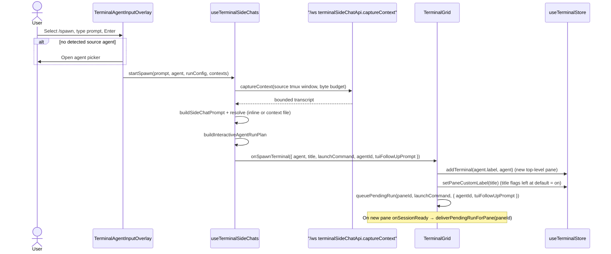

# TECH · APP-039: Terminal `/spawn` Command

> HOW. Implements PRD APP-039 by reusing the `/side` (APP-030) pipeline and redirecting
> delivery from a side-chat modal to a new terminal pane in the mosaic grid.

## Scope summary

`/spawn` is a client-only web feature. No backend, migration, or REST change. It reuses:

- The terminal AI protocol-token model (chip + submit-time detection).
- The side-chat context capture WS API (`terminalSideChatApi.captureContext`).
- The side-chat prompt builders (`buildSideChatPrompt`, context-file fallback).
- The interactive run-plan builder (`buildInteractiveAgentRunPlan`) and pending-run delivery.
- The terminal store pane creation + custom-label title mechanism.

The only genuinely new behavior is: build a `PendingTerminalRun` and deliver it to a **new
mosaic pane** whose display title is pinned to `<prompt head> · By Spawn`.

## Flow

## Key decisions

| Topic | Decision |
|-------|----------|
| Command wiring | Reuse the existing overlay slash pipeline. `/spawn` is added to the `slashCommands` memo when the `onSpawn` prop is present. |
| Protocol token | New `atmos://spawn/<contextId>` prefix, parallel to `atmos://side-chat/`. Detection uses `hasKnownSpawnCommand` / `extractSpawnContextIds`; tokens are stripped by the shared strip helpers. This satisfies M2/M7 (raw text never triggers). |
| Shared overlay state | `/side` and `/spawn` share the agent selector and pending-prompt state. A `pendingCommandKind: "side" \| "spawn"` disambiguates which runner (`runSideChat` vs `runSpawn`) fires after agent selection. `isContextCommandActive = isSideCommandActive \|\| isSpawnCommandActive` gates the agent selector and reset effect. |
| Context + prompt | Reused verbatim from `/side` (`captureContext`, `buildSideChatPrompt`, inline/context-file resolution). Rules and byte budgets are identical, per PRD M3. |
| Delivery target | `useTerminalSideChats` gains an optional `onSpawnTerminal(request)` callback and returns `startSpawn`. The pane window supplies `onSpawnTerminal = spawnTerminalWithRun` from `TerminalGrid`. |
| New pane | `spawnTerminalWithRun` always calls `addTerminal(agent.label, agent)` (fresh top-level pane, no reuse), unlike `createAndRunTerminal` which may reuse a single fresh pane. |
| Title | `buildSpawnTerminalTitle(userPrompt)` = whitespace-collapsed prompt sliced to `SPAWN_TITLE_PROMPT_MAX_CHARS = 24` + `" · By Spawn"`. Applied via `setPaneCustomLabel` **only** — the title flags are left untouched, so (like Rename terminal) `keepAgentName`/`keepCwd` default to on and `useTerminalToolbarTitle` renders `<custom> · <agent>` (or `<custom> · <cwd>` when no agent). Only the custom-label portion is capped at 40 (`CUSTOM_NAME_MAX_LENGTH`); 24 + 11 = 35 ≤ 40. The agent/cwd suffix is appended by the display layer and not capped. |
| Scope | Only the default-scope pane window (`terminal-mosaic-workspace-pane-window.tsx`) passes `onSpawn`/`onSpawnTerminal`. Scoped pane windows omit them, so `/spawn` is absent there (PRD non-goal). |

## Touched files

| File | Change |
|------|--------|
| `apps/web/src/features/terminal/lib/terminal-ai-context-protocol.ts` | Add `SPAWN_PROTOCOL_PREFIX`, `formatSpawnProtocol`, `parseSpawnProtocolToken`, `extractSpawnContextIds`, `hasKnownSpawnCommand`; strip spawn tokens in the shared strip helper. |
| `apps/web/src/features/welcome/components/PromptComposer.tsx` | Add spawn token to `CHIP_TOKEN_PATTERN`; render the "Spawn" chip; add `insertSpawnCommand` / `applySpawnCommandAtRange`; include spawn token in `removeContextToken`. |
| `apps/web/messages/{en,zh}.json` | Add `terminal.agentInput.spawnCommand.description` and `terminal.agentInput.selectionContext.spawnChip`. |
| `apps/web/src/features/terminal/components/TerminalAgentInputOverlay.tsx` | Add `onSpawn` prop, `/spawn` slash entry, `isSpawnCommandActive`, `pendingCommandKind`, `runSpawn`, and a submit branch that routes side vs spawn. |
| `apps/web/src/features/terminal/hooks/use-terminal-side-chats.tsx` | Add `onSpawnTerminal` option, `SpawnTerminalRequest` type, `startSpawn`, and `buildSpawnTerminalTitle`. |
| `apps/web/src/features/terminal/components/terminal-mosaic-workspace-pane-window.tsx` | Thread `spawnTerminalWithRun` prop → `onSpawnTerminal`; pass `onSpawn={startSpawn}` to the overlay. |
| `apps/web/src/features/terminal/components/TerminalGrid.tsx` | Add `spawnTerminalWithRun` (addTerminal + setPaneCustomLabel + queuePendingRun; title flags left at default) and pass it to the pane window. |

## Risks

- **Shared overlay state**: `/side` and `/spawn` reuse the same agent-selection and
  pending-prompt state. Mitigation: `pendingCommandKind` disambiguates the runner; the reset
  effect keys off `isContextCommandActive`.
- **Title truncation on multibyte prompts**: `slice(0, 24)` counts UTF-16 code units, so
  some CJK-heavy prompts show fewer visual characters. Acceptable for a title; stays under
  the 40-char custom-label cap.
- **Prompt wording says "side chat"**: the reused capture prompt refers to a side chat even
  for spawned panes. Accepted per PRD (rules intentionally match `/side`); revisit only if it
  confuses agents.

## Follow-ups

- Optional: spawn-specific prompt wording ("spawned terminal" instead of "side chat").
- Optional: extend `/spawn` to scoped grids / canvas terminal cards if demand appears.
