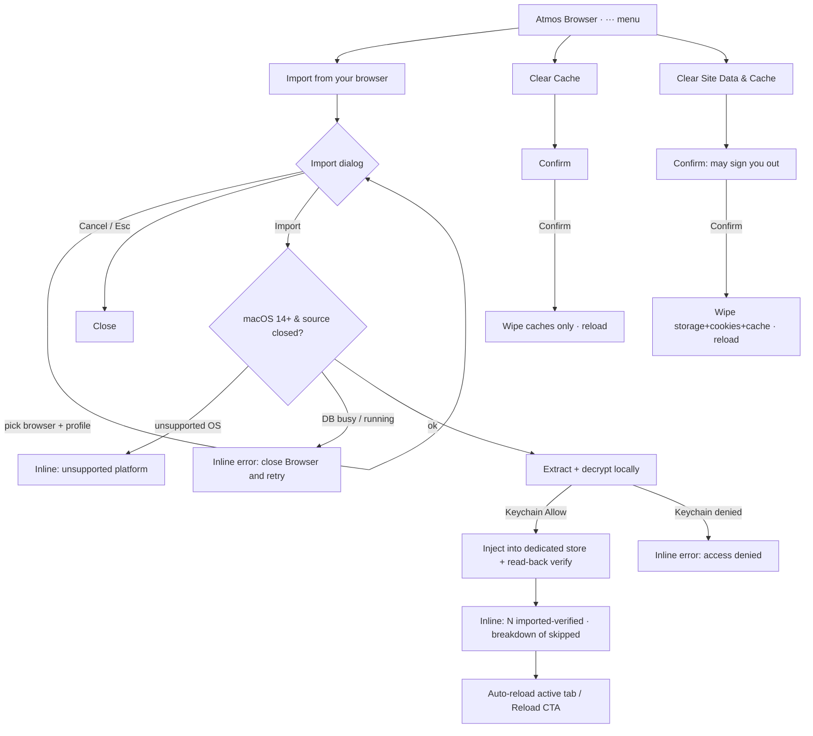

# APP-041 · Browser Cookie Sync — PRD

> **WHAT & WHY.** Architecture lives in [`TECH.md`](./TECH.md); verification in [`TEST.md`](./TEST.md).

## 1. Summary

Let a desktop user import their existing browser sessions (cookies) from Chrome / Chromium-family
browsers and Firefox into **Atmos Browser** with a near one-click flow, so authenticated pages and
agent browsing "just work" without re-login.

Bundled in the same browser-chrome cleanup:

- **Toolbar overflow menu** — collapse the crowded tab-bar chrome buttons into a `···` menu.
- **Clear Cache** and **Clear Site Data & Cache** — reset the Atmos Browser store, each behind a
  confirm popover.

Primary focus is Cookie Sync; the other two are UI reorganization + small utilities.

## 2. Why now

- Atmos Browser starts logged out every session; re-auth friction blocks real use and agent flows.
- The toolbar has accumulated buttons and Cookie Sync adds more — it needs a tidy home.
- Clearing cache/site data is a natural companion to importing (reset a bad session).

## 3. Users & stories

| As a… | I want… | So that… |
|-------|---------|----------|
| Developer using Atmos Browser | to import my Chrome session for a site | I don't re-login to preview authenticated pages |
| Agent operator | the built-in browser to already be logged in | agents can act on sites I'm authenticated to |
| Privacy-conscious user | to clearly opt in, per browser, locally | my session cookies stay on my machine and out of Atmos telemetry |
| Any user | a clean toolbar + a quick way to reset browser state | the browser stays usable and resettable |

## 4. Core concept — the Atmos Browser store is isolated from the app

Atmos Browser renders target sites in a **dedicated WebKit data store**, separate from the store
that holds Atmos's own app state (onboarding, layout, tabs, handoff, etc.). Cookie import, Clear
Cache, and Clear Site Data all operate **only** on this dedicated browsing store. Clearing browser
data must never touch Atmos's own app state. See [`TECH.md`](./TECH.md) §3.

## 5. Scope (Must Have)

### 5.1 Cookie Sync (primary)

- **MH-1** An **Import from your browser** entry in the Atmos Browser `···` menu (desktop, macOS 14+).
- **MH-2** Import dialog modeled on the Atlas pattern:
  - **From** selector listing detected source browsers + profiles (e.g. "Google Chrome 用户1"). The
    selector shows only an opaque profile handle + display name — never a filesystem path.
  - A hint: **"Close <Browser> completely before importing."**
  - A **Cookies** toggle (on by default). *(Passwords intentionally omitted — see Non-Goals.)*
  - **Cancel** / **Import** actions; Import is disabled while an operation is in flight.
- **MH-3** Supported sources on MVP (macOS): **Chrome, Edge, Brave** (Chromium family) and
  **Firefox**.
- **MH-4** On Import: extract cookies locally, decrypt (Chromium via Keychain key; Firefox plain),
  and inject into the dedicated Atmos Browser store so all browser tabs/windows share them.
- **MH-5** **Verified result feedback** inline in the dialog: a cookie counts only as *imported*
  after it is written **and** read back from the store by identity. The dialog reports
  imported-verified plus a breakdown of skipped/failed categories (expired, decrypt failure, parse
  failure, unsupported such as partitioned, injection failure). Errors (browser still open, Keychain
  denied, no profile, unsupported platform) produce a clear, actionable message — not a silent
  failure.
- **MH-6** **Reload contract:** the command succeeds only after all injections complete and are
  verified. Because already-loaded pages will not re-authenticate on their own, on success the UI
  auto-reloads the active browser tab (or shows an explicit "Reload to apply" inline CTA). It must
  not silently reload every window and lose uncommitted user input.
- **MH-7** **Local-pipeline guarantee:** the extraction/decryption/import pipeline never sends
  cookie data to Atmos Server, relay, telemetry, logs, or any non-cookie-scope endpoint. After
  import, WebKit sends the imported cookies to their matching target sites as normal browsing —
  that is the feature working as intended, not a leak. (See §8 wording.)

### 5.2 Toolbar overflow menu

- **MH-8** In the tab bar, keep **Favorites** and **Hide/Show toolbar** as direct buttons.
- **MH-9** Move all other chrome controls into a `···` menu: **Open in window**,
  **Return to embedded**, **Move to center**, **Maximize/Minimize** (each only when applicable to
  the current surface), plus **Import from your browser**, **Clear Cache**, **Clear Site Data &
  Cache** (desktop only).
- **MH-10** Menu items appear only when their action is available (cookie/clear items desktop +
  macOS 14+ only; move-to-center only when embedded).

### 5.3 Clear Cache / Clear Site Data (PRD-revised — replaces the earlier single "Clear Cache")

- **MH-11** **Clear Cache** removes only cache-class data (disk/memory/fetch caches) from the
  dedicated browsing store. Cookies and web storage are preserved; the user stays logged in.
- **MH-12** **Clear Site Data & Cache** removes cache **and** web storage (localStorage, IndexedDB,
  service workers, WebSQL) and cookies from the dedicated browsing store. Its confirm copy states
  **"This may sign you out of sites."**
- **MH-13** Each action requires a **secondary confirm popover** before running, and after clearing
  must handle already-loaded surfaces (reload or clearly refresh), not merely delete then show
  success. Result is reflected inline (button state / brief confirmation), **not** a success toast
  (per repo Inline-Feedback rule). Both actions operate only on the dedicated browsing store, never
  on Atmos's own app state.

## 6. Non-Goals (MVP)

- Windows and Linux extraction (Windows Chrome uses App-Bound Encryption; separate phase). On
  unsupported platforms the cookie/clear menu items are hidden or return `UnsupportedPlatform`.
- macOS < 14 (the identified-data-store API is unavailable; do **not** fall back to the default
  store). Feature is hidden / `UnsupportedPlatform` there.
- **Safari** as a source (sandboxed store needs Full Disk Access).
- Continuous / automatic / background sync — MVP is on-demand only.
- Importing **passwords**, bookmarks, or history.
- Per-domain / selective cookie import (import all for the chosen profile).
- Faithful import of **partitioned / CHIPS / container** cookies — these are safely **skipped**
  (counted as `skipped_unsupported`), never silently downgraded to unpartitioned cookies.

## 7. UX flow

## 8. Privacy statement (exact wording)

> The cookie extraction, decryption, and import pipeline does not send cookies to Atmos Server,
> relay, telemetry, or any endpoint outside the cookie's own scope. After import, WebKit sends the
> imported cookies to their matching target sites according to normal cookie scope. Atmos creates no
> intermediate plaintext cookie files, but WebKit persists imported persistent cookies in the
> dedicated browsing store on disk, as any browser does.

## 9. Success signals

- A user logged into a site in Chrome can Import, and the active tab reloads logged-in — no typing.
- Import reports an accurate imported-verified count and a skipped breakdown.
- No cookie data appears in any Atmos Server request, relay traffic, telemetry, or debug log.
- A localStorage sentinel written by the Atmos app **survives** both Clear actions.
- Toolbar shows only Favorites + Hide-toolbar outside; everything else under `···`.

## 10. Risks (product-level)

| Risk | Impact | Mitigation |
|------|--------|-----------|
| Clearing browser data wipes app state | Data loss | Dedicated browsing store; clear never touches app store (MH-13) |
| User leaves source browser open | Import fails | Explicit hint + clear retry error |
| Keychain prompt confuses user | Abandoned import | Explain why in dialog copy; single prompt |
| Some cookies fail / are unsupported | Partial session | Verified counts + skipped breakdown; safe-skip partitioned |
| Users expect Windows/old-macOS support | Disappointment | Gate to macOS 14+; `UnsupportedPlatform` message |
| Importing session cookies is sensitive | Trust | Local pipeline, explicit opt-in, per-profile, dedicated capability |
