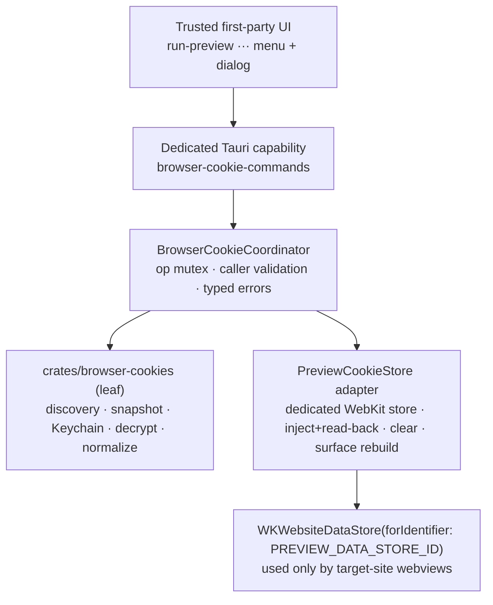
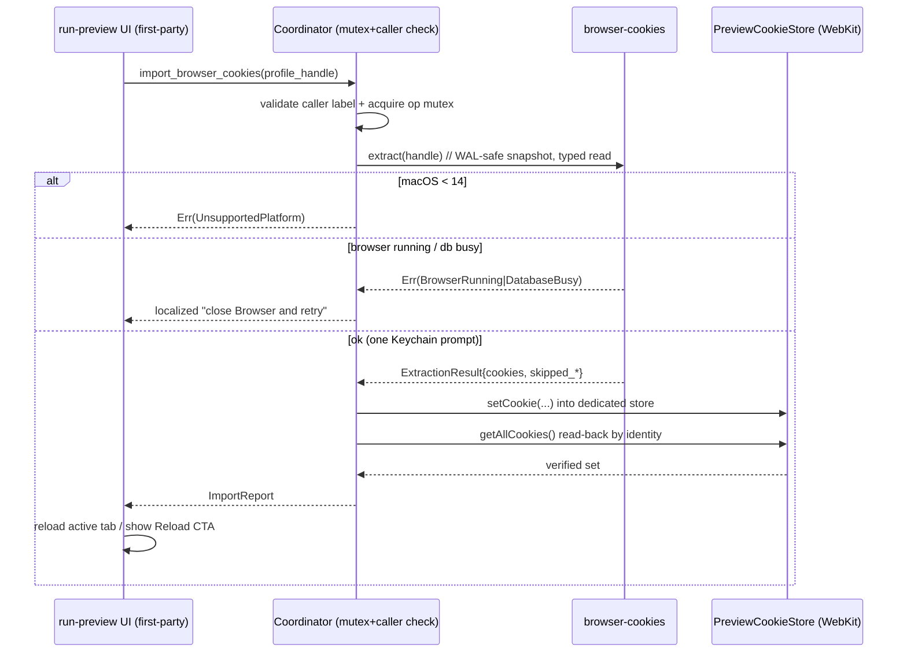

# APP-041 · Browser Cookie Sync — TECH

> **HOW.** Requirements in [`PRD.md`](./PRD.md); verification in [`TEST.md`](./TEST.md).
> Scope: macOS **14+** MVP. Sources: Chrome / Edge / Brave (Chromium) + Firefox.
>
> This revision incorporates the APP-041 architecture review. Key corrections vs the first draft:
> a **dedicated** WebKit data store (not the default one), a **dedicated Tauri capability** with
> caller validation, a **high-fidelity cookie model** with read-back verification, a **WAL-safe
> SQLite snapshot** read via typed BLOB API (no `sqlite3` subprocess), split **Clear Cache /
> Clear Site Data** semantics, and an explicit **reload contract**.

## 1. Architecture overview

Everything is **local** and desktop-only. No WebSocket, no REST, nothing crosses the network —
consistent with the repo transport rules (desktop-native, on-device operation).



| Layer | Location | Responsibility |
|-------|----------|----------------|
| UI | `apps/web/src/features/run-preview` | `···` menu, Import dialog, confirm popovers, inline result, reload |
| Capability | `apps/desktop/src-tauri/capabilities` + `permissions` | dedicated capability limited to trusted first-party webviews |
| Coordinator | `apps/desktop/src-tauri/src/browser_cookies/` | command handlers, serialized ops, caller-label validation, DTO/error mapping |
| Extraction | **new** `crates/browser-cookies` | profile discovery, WAL-safe SQLite snapshot, Keychain key, decrypt, normalize |
| Store adapter | `apps/desktop/src-tauri` (macOS native) | dedicated WebKit store: inject + read-back verify, clear, surface rebuild |

Layering: crates never import apps. `crates/browser-cookies` is a leaf capability consumed by
`apps/desktop`; **`ai-usage` is refactored to depend on it too** (see §7). Native store work stays
in the app because it needs Wry/WebKit handles.

## 2. Where cookies live — dedicated data store (fixes Blocker #1)

### 2.1 Problem in the first draft

Atmos Browser renders target sites in the **external child webview** (`preview_bridge::mod.rs`,
`add_child(WebviewBuilder::new(label, WebviewUrl::External(url)))`) and the **detached window**
(`open_preview_detached_window`). Neither, nor the `main` window, sets a `data_store_identifier`, so
they all share the **default** `WKWebsiteDataStore`. Injecting into / clearing the default store
would read/wipe **Atmos's own app state** (localStorage, IndexedDB, service workers used by the app
shell). That is a data-loss blocker.

### 2.2 Fix

Introduce a stable `PREVIEW_DATA_STORE_ID` (a fixed UUID constant) and apply it **only** to the
webviews that actually browse target sites:

- external child in `open_preview_surface` (`add_child`)
- detached window in `open_preview_detached_window`

The first-party surfaces — `main`, `agent-chat`, and the `preview-browser*` **host** windows that
load the app UI — keep the default store and are never touched by import/clear.

```text
Wry/Tauri builder:  WebviewBuilder / WebviewWindowBuilder
      .data_store_identifier(PREVIEW_DATA_STORE_ID)   // target-site webviews only
```

On macOS this maps to `WKWebsiteDataStore(forIdentifier:)`, which is **macOS 14+**. Below 14 the
API is unavailable; the feature returns `UnsupportedPlatform` and is hidden in the UI. **Do not**
silently fall back to the default store (that reintroduces the blocker). This macOS-14+ gate is a
hard MVP constraint.

### 2.3 Single source of truth

All three paths — the webview builders, injection, and clearing — obtain the store through one
`PreviewCookieStore` adapter so they can never diverge on which store is used.


## 3. Security boundary — dedicated capability (fixes Blocker #2)

### 3.1 Problem

`capabilities/desktop-app-commands.json` targets **windows** (`main`, `agent-chat`,
`preview-browser`, `preview-browser-*`) and permits `remote.urls` including `http://localhost:*`,
`http://127.0.0.1:*`, and `https://*.atmos.land`. Because it targets windows (not webviews) and the
target-site external child webview lives inside those host windows, previewed content served from
**allowlisted origins** (localhost dev servers, `*.atmos.land`) could invoke the new commands and
trigger a Keychain prompt, import sessions, or run destructive clears. Arbitrary sites (e.g.
`github.com`) are not in `remote.urls` and cannot invoke — but allowlisted preview content is the
realistic threat.

### 3.2 Fix

Create a **separate** capability + permission set just for these commands:

- New `capabilities/browser-cookie-commands.json`:
  - Target specific **`webviews`** (not `windows`): only trusted first-party UI labels
    (`main`, `preview-browser`, `preview-browser-*` host UI). Explicitly **exclude** the
    target-site child/detached webview labels (`preview_surface_label(...)`) and
    `preview-inspector*`.
  - **No `remote.urls`** block → local (app-protocol) content only.
- New `permissions/browser-cookie-commands.toml` allowing exactly:
  `list_importable_browsers`, `import_browser_cookies`, `clear_browser_cache`,
  `clear_browser_site_data`.
- **Defense in depth in Rust:** each command re-validates the calling webview label against an
  allowlist and rejects otherwise (`Busy`/`Forbidden`). The capability is the gate; the Rust check
  is the backstop. Reference: Tauri v2 capabilities (https://v2.tauri.app/security/capabilities/).

Negative tests (see TEST.md) assert that the target-site child webview, `preview-inspector*`, and
remote/localhost preview content cannot invoke these commands.

## 4. Extraction — `crates/browser-cookies`

Pure, unit-testable capability. No Tauri, no app deps. Reads a **consistent snapshot** and returns
**high-fidelity** cookies with per-row failure accounting.

### 4.1 Types (fixes High #3 — cookie fidelity)

```rust
pub enum BrowserKind { Chrome, Edge, Brave, Firefox }

pub enum SameSite { Unspecified, None, Lax, Strict }  // Unspecified != None

pub struct CookieIdentity {          // uniqueness / read-back key
    pub name: String,
    pub domain: String,
    pub path: String,
    pub partition_key: Option<String>,
}

pub struct ImportedCookie {
    pub identity: CookieIdentity,
    pub value: String,               // decrypted plaintext
    pub host_only: bool,             // domain had no leading dot
    pub secure: bool,
    pub http_only: bool,
    pub same_site: SameSite,
    pub expires: Option<i64>,        // unix secs; None => session cookie
    pub has_expires: bool,           // explicit session vs persistent
}

pub struct ProfileHandle(pub String); // opaque; never a filesystem path

pub struct BrowserProfile {
    pub handle: ProfileHandle,
    pub browser: BrowserKind,
    pub display_name: String,        // e.g. "用户1"
    pub running: bool,               // best-effort process check
}

pub struct ExtractionResult {
    pub cookies: Vec<ImportedCookie>,          // decoded, importable candidates
    pub skipped_expired: usize,
    pub skipped_decrypt: usize,
    pub skipped_parse: usize,
    pub skipped_unsupported: usize,            // partitioned / CHIPS / container
}

pub enum ExtractError {
    UnsupportedPlatform, ProfileNotFound, BrowserRunning, KeychainDenied,
    KeychainUnavailable, DatabaseBusy, InvalidSchema, Io(String),
}

pub fn list_profiles() -> Vec<BrowserProfile>;
pub fn extract(handle: &ProfileHandle) -> Result<ExtractionResult, ExtractError>;
```

Fidelity rules:

- **SameSite**: preserve `Unspecified` distinctly from explicit `None`. Chromium `samesite`
  (`-1/0/1/2`) and Firefox `sameSite` map into the four-state enum; never coerce Unspecified→None.
- **`__Host-` / `__Secure-` prefixes**: enforce constraints. `__Host-` requires host-only + Secure +
  path `/` and **no Domain** — if source data violates this, the cookie is `skipped_unsupported`
  rather than injected with an illegal shape (WebKit would reject it anyway).
- **Partitioned / CHIPS / container**: MVP cannot faithfully represent a partition key in the target
  store → **safe-skip** as `skipped_unsupported`. Never downgrade to an unpartitioned cookie (that
  would widen its send scope — a privacy regression).
- **host-only vs domain**: derived from the leading-dot on `host_key`/`host`; carried explicitly so
  injection sets Domain only for domain cookies.

### 4.2 Discovery (macOS)

| Browser | Cookies DB (prefer first) | Keychain service |
|---------|---------------------------|------------------|
| Chrome | `<Profile>/Network/Cookies` → fallback `<Profile>/Cookies` | `Chrome Safe Storage` |
| Edge | `<Profile>/Network/Cookies` → `<Profile>/Cookies` | `Microsoft Edge Safe Storage` |
| Brave | `<Profile>/Network/Cookies` → `<Profile>/Cookies` | `Brave Safe Storage` |
| Firefox | `<profile>/cookies.sqlite` | n/a (unencrypted) |

Modern Chromium prefers `Network/Cookies`; check it **before** the legacy `<Profile>/Cookies`
(fixes part of #4). Chromium profiles + display names come from `Local State`
(`profile.info_cache`); Firefox from `profiles.ini`. Reuse the discovery tables already proven in
`ai-usage` (Chrome/Edge/Brave/Arc/Chromium/Dia/Atlas variants, profile priority).

### 4.3 WAL-safe snapshot + typed read (fixes #4)

Two supported modes; MVP uses **(a)**:

- **(a) Require browser closed.** First a best-effort process guard (`running`), then open the DB
  **read-only via `rusqlite`**. Treat SQLite `BUSY`/locked as `DatabaseBusy` **only in combination**
  with the process check — do not equate `BUSY` alone with "running". `immutable=1` is **not** used
  (it ignores WAL and can miss the newest cookies).
- **(b) (later) Import while running.** Copy `Cookies`, `Cookies-wal`, `Cookies-shm` to a temp dir,
  open the copy so WAL is applied to a consistent snapshot, delete the copy immediately after read.

Read via **`rusqlite` typed BLOB API** — never a `sqlite3` subprocess piping plaintext cookies
through stdout (the current `ai-usage` approach; a value-leak and quoting risk). Columns:
Chromium `cookies(host_key, name, encrypted_value, path, expires_utc, is_secure, is_httponly,
samesite, is_persistent[, top_frame_site_key for CHIPS partition detection])`;
Firefox `moz_cookies(host, name, value, path, expiry, isSecure, isHttpOnly, sameSite[,
originAttributes])`. Convert Chromium `expires_utc` (µs since 1601) → unix secs; detect partitioned
rows and route to `skipped_unsupported`.

### 4.4 Chromium decryption

Reuse the crypto already in `ai-usage`: Keychain passphrase → `PBKDF2-HMAC-SHA1(pass, "saltysalt",
1003, 16)` → AES-128-CBC (IV = 16×`0x20`), strip `v10`/`v11` prefix, strip optional 32-byte SHA-256
host-hash prefix. macOS has no ABE (`v20` is Windows-only). Per-row failures increment the relevant
`skipped_*` and continue. Prefer reading the Keychain key via the Security framework rather than a
`security` subprocess where practical (validated by the Keychain spike, §11).


## 5. Injection, clearing & reload — `PreviewCookieStore` adapter

All native store work goes through one adapter that owns `PREVIEW_DATA_STORE_ID`.

### 5.1 Injection with read-back verification (fixes #5-counting / High #3)

```text
store = dedicated WKWebsiteDataStore(forIdentifier: PREVIEW_DATA_STORE_ID)  // macOS 14+ else Unsupported
for cookie in candidates:
    props = NSHTTPCookie properties { Name, Value, Domain(if !host_only), Path,
             Secure, Expires(if has_expires), HTTPOnly, SameSite }
    store.httpCookieStore.setCookie(cookie)   // async completion, main thread
await all completions
existing = store.httpCookieStore.getAllCookies()      // read back
imported_verified = candidates matched in `existing` by CookieIdentity
```

A cookie is counted **imported_verified only if it round-trips** by identity. Ones that WebKit
silently rejects (illegal `__Host-` shape, attribute conflicts) fall into `failed_injection`.
`setCookie`'s completion does **not** by itself prove acceptance. WebKit calls run on the main
thread; completions are awaited with a bounded join.

Injection targets the dedicated store directly and needs **no open browser window**; open surfaces
pick cookies up on their next request/reload (see §5.3).

### 5.2 Clear — split semantics (fixes #5)

Both operate on the **dedicated** store only, never the app's default store.

| Command | WebKit data types |
|---------|-------------------|
| `clear_browser_cache` | disk cache, memory cache, fetch cache **only** |
| `clear_browser_site_data` | caches **+** localStorage, IndexedDB, service workers, WebSQL, **+** cookies |

`removeDataOfTypes:modifiedSince:` with `distantPast`, awaited. `clear_browser_site_data` is the
destructive one whose confirm copy warns it "may sign you out of sites".

### 5.3 Reload contract (fixes #6)

Target sites render in the external child / detached webview; already-loaded pages do not
re-authenticate by themselves. Therefore:

- The command returns success **only after** injection completions + read-back (or clear) finish.
- On success the coordinator asks the UI to **reload the active browser tab** (or the UI shows a
  "Reload to apply" inline CTA). After a clear, affected surfaces are reloaded/refreshed rather than
  left showing stale in-memory state (which could otherwise re-persist storage).
- Never blanket-reload every window (would drop uncommitted user input). Product copy: "Cookie store
  updated; changes apply on the next request or reload."

## 6. Coordinator, commands & IPC types

`BrowserCookieCoordinator` (in `apps/desktop/src-tauri/src/browser_cookies/`) wraps all four
commands with a single **async mutex** (serialize import/import and import/clear — fixes races),
validates the caller webview label, and maps `ExtractError` → stable typed error codes. It never
returns `Err(String)` and never exposes filesystem paths or cookie values to the frontend.

| Command | Args | Returns |
|---------|------|---------|
| `list_importable_browsers` | – | `Vec<BrowserProfileDto>` (handle, browser, display_name, running) |
| `import_browser_cookies` | `{ profile_handle }` (opaque) | `ImportReport` |
| `clear_browser_cache` | – | `{ ok }` |
| `clear_browser_site_data` | – | `{ ok }` |

```rust
struct BrowserProfileDto { profile_handle: String, browser: String, display_name: String, running: bool }

struct ImportReport {
    discovered: usize,
    imported_verified: usize,
    skipped_expired: usize,
    skipped_decrypt: usize,
    skipped_parse: usize,
    skipped_unsupported: usize,   // partitioned/CHIPS/container safe-skipped
    failed_injection: usize,
}

enum CookieCmdError {            // serialized as a stable `code`
    UnsupportedPlatform, ProfileNotFound, BrowserRunning, KeychainDenied,
    KeychainUnavailable, DatabaseBusy, Busy /*op in progress*/, Forbidden /*caller*/,
    Io, InvalidSchema,
}
```

Import accepts only an **opaque `profile_handle`**; the Rust side re-runs discovery and resolves the
canonical path internally (frontend never learns the path). The frontend localizes by `code` via
next-intl and never renders raw native error text (fixes IPC hardening finding).

### 6.1 Sequence



## 7. Reuse & refactor `ai-usage` (fixes reuse finding)

`crates/ai-usage/src/support/browser.rs` already implements profile discovery, Keychain access,
Chromium v10/v11 decrypt (PBKDF2/AES + host-hash strip), and Firefox/Chromium SQLite queries — but
it is **header-oriented**: dedupes by name, **drops** path/expiry/Secure/HttpOnly/SameSite/host-only,
and reads via a `sqlite3` subprocess. It is therefore unsuitable as the import API directly.

Plan: sink the **generic discovery / snapshot / query / decrypt primitives** down into
`crates/browser-cookies`, then make **`ai-usage` depend on the new crate** and keep only its
provider-domain filtering + Cookie-header assembly. This removes duplication and upgrades `ai-usage`
to the typed BLOB read at the same time. This refactor is in-scope for the MVP crate extraction.

## 8. Security & privacy

- **Local pipeline (MH-7):** extraction/decryption/import happen entirely on-device; cookies are
  never serialized to Atmos Server, relay, telemetry, or logs. After import, WebKit sends cookies to
  matching target sites as normal browsing (see PRD §8 wording).
- No intermediate plaintext files; never log cookie names/values (canary-tested). WebKit persists
  imported persistent cookies in the dedicated store on disk.
- Explicit, per-profile opt-in; a single Keychain prompt for Chromium.
- Dedicated capability + Rust caller validation (§3). Clears are destructive → confirm popovers and
  operate only on the dedicated browsing store.

## 9. Dependencies & config

- New `crates/browser-cookies`: `rusqlite` (bundled, typed BLOB), `aes`, `cbc`, `pbkdf2`, `sha1`,
  `sha2`, `hex`, `serde`, plus Security-framework/Keychain access. **No `rookie` and no `sqlite3`
  subprocess** for MVP — rusqlite + Security.framework + existing crypto give better control over
  attributes, errors, and the security boundary. (Revisit only if a spike shows a gap.)
- `apps/desktop/src-tauri/Cargo.toml`: add `objc2-web-kit` for `WKWebsiteDataStore` /
  `WKHTTPCookieStore` / `NSHTTPCookie`. `objc2`, `objc2-app-kit`, `keyring`, Tauri `unstable` are
  already present.
- Add `capabilities/browser-cookie-commands.json` + `permissions/browser-cookie-commands.toml`;
  register the four commands; wire `data_store_identifier(PREVIEW_DATA_STORE_ID)` on the two
  target-site webview builders in `preview_bridge/mod.rs`.

## 10. Frontend wiring (`apps/web/src/features/run-preview`)

### 10.1 Toolbar overflow menu (PRD MH-8..10)

- `PreviewBrowserTabBar.tsx` `chromeControls` currently renders inline: favorites list,
  `onOpenInWindow`, `onReturnToEmbedded`, toolbar toggle, `onMoveToCenter`, `onToggleMaximized`.
- New layout: **outside** = `favoritesList` + toolbar toggle only. **Inside `···`**
  (`DropdownMenu` from `@workspace/ui`) = Open in window / Return to embedded / Move to center /
  Maximize-Minimize (each only when its handler exists), separator, then **Import from your
  browser**, **Clear Cache**, **Clear Site Data & Cache** (desktop + macOS 14+ only).
- Extend `PreviewBrowserChromeControls` additively: `cookieToolsAvailable`, `onImportCookies`,
  `onClearCache`, `onClearSiteData`. Web/mobile callers omit them → items hidden.

### 10.2 Import dialog

New `BrowserCookieImportDialog.tsx` (Atlas-style): title, **From** browser+profile selector (opaque
handle + display name), "Close <Browser> completely before importing" hint, **Cookies** toggle
(default on; no Passwords), Cancel / Import. Import disabled while in flight (anti double-submit),
Escape/Cancel close. On success show `ImportReport` inline (imported-verified + skipped breakdown)
and trigger the reload contract; on error show localized copy by `code`. All strings via
`useTranslations`; update **both** `messages/en.json` and `messages/zh.json` (zh localized, parity).

### 10.3 Clear confirm popovers (PRD MH-11..13)

Clear Cache and Clear Site Data & Cache each open a confirm `Popover`; Site-Data copy warns "may
sign you out". On confirm, invoke the command, then reload/refresh affected surfaces. Result inline;
**no success toast** (repo Inline-Feedback rule). Errors may toast.

## 11. Feasibility validation (researched — see notes)

The original review asked for four spikes. Most were resolved by documentation + the resolved
dependency versions + existing in-repo code, without a runtime spike. Findings:

1. **Dedicated WebKit store — CONFIRMED by docs + versions.**
   - `WebviewWindowBuilder`/`WebviewBuilder::data_store_identifier` (macOS) was added in **Tauri
     2.2.0** (PR #11798); Atmos resolves **tauri 2.10.2 / wry 0.54.2** with the `unstable` feature,
     so the API is available on **both** builders Atmos uses (child via `WebviewBuilder`, detached
     via `WebviewWindowBuilder`). Tauri 2.4.0 added `AppHandle::fetch_data_store_identifiers` +
     `remove_data_store` (macOS/iOS) for management.
   - It maps to `WKWebsiteDataStore(forIdentifier:)`, a **persistent** store retrievable across app
     relaunch by its identifier (WebKit blog, "Building Profiles with new WebKit API"), available
     **macOS 14+**. Same identifier ⇒ shared store; the default store (no identifier) is a separate
     instance ⇒ isolated. This is exactly the §2 design.
2. **Cookie fidelity — CONFIRMED achievable by API.** `NSHTTPCookie` exposes name/value/domain/
   path/secure/expires/HTTPOnly and `sameSitePolicy` (macOS 10.15+); `__Host-`/`__Secure-` rules are
   standard and enforced by WebKit — which is exactly why the design counts a cookie only after the
   §5.1 **read-back verification** (rejects surface as `failed_injection`). No design unknown remains;
   per-state acceptance is asserted by tests S-INJ-1/3, not a spike.
3. **Keychain prompt — CONFIRMED mechanism.** A non-owning app reading the `<Browser> Safe Storage`
   item triggers the standard macOS Keychain ACL prompt (Allow / Always Allow / Deny). "Always
   Allow" persists **per app code-signing identity**; unsigned / ad-hoc / re-signed **dev** builds
   get a new identity each rebuild and therefore re-prompt, while a stably-signed **release** build
   persists the grant. Prefer the Security framework over a `security` subprocess.
4. **SQLite / WAL / schema — CONFIRMED by docs + in-repo code.** `crates/ai-usage/src/support/
   browser.rs` already decrypts Chromium v10/v11 and reads `Cookies`; modern profiles use
   `Network/Cookies` (checked first, §4.2); `immutable=1` ignoring WAL is documented SQLite behavior
   (hence not used, §4.3). No spike needed; the work is refactoring these into typed BLOB reads.

**Remaining runtime confirmations (small, ~1 hour total, not blockers to spec finalization):**

- Exact wry 0.54 behavior of `data_store_identifier` on macOS **< 14** (ignore vs error) so the
  gate degrades to `UnsupportedPlatform` cleanly — answerable by reading wry source, else a 5-min
  check on a 13.x VM.
- One empirical pass that a stably-signed release build yields a **single** persisted Keychain
  grant, and a real cookie round-trip across all SameSite states (this is just running S-INJ-1/3 on
  hardware — normal implementation testing, not exploratory de-risking).

Conclusion: the architecture is validated; crate internals can be finalized. The two items above are
ordinary implementation-time checks, not open feasibility risks.

## 12. Rollout & phasing

1. **MVP:** macOS 14+ · Chrome/Edge/Brave/Firefox · on-demand import into a dedicated store ·
   dedicated capability · Clear Cache / Clear Site Data · `ai-usage` refactor onto the new crate.
2. **Phase 2:** Windows (App-Bound Encryption — extension/supported path) and Linux
   (Secret Service/kwallet); import-while-running snapshot mode (§4.3b).
3. **Phase 3:** Safari source (Full Disk Access onboarding); per-domain selective import;
   partitioned-cookie fidelity; optional continuous sync.

## 13. Risks (engineering)

| Risk | Mitigation |
|------|-----------|
| Wry `data_store_identifier` on macOS <14 (ignore vs error) | Confirm wry 0.54 degradation path; gate to 14+ → `UnsupportedPlatform`; never fall back to default store |
| `objc2-web-kit` cookie/data-store API unfamiliar | Spike inject + read-back + clear behind the adapter |
| Main-thread + async completion in Rust | Marshal to main thread; bounded join on completions |
| Cookie format drift / partitioned / Apple-Passwords v10 | Typed per-row accounting; safe-skip; report `skipped_*` |
| Locked DB vs WAL confusion | Process guard + read-only rusqlite; no `immutable=1`; `BUSY`≠running alone |
| Keychain denial | `KeychainDenied` → actionable copy; no partial silent state |
| Op races (import/clear) | Single async mutex in the coordinator |
| Sensitive commands reachable from preview content | Dedicated capability (webviews-scoped, no remote.urls) + Rust caller check |
