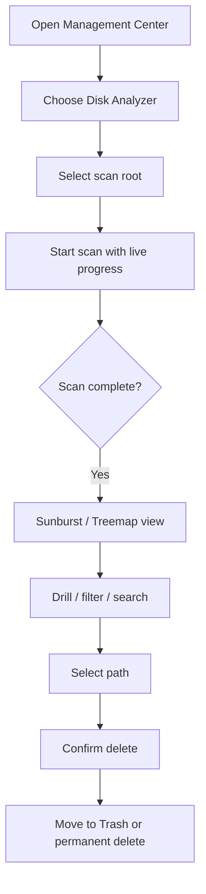

# PRD · APP-042: Disk Analyzer

> Product Requirements · WHAT and WHY. Local disk usage analysis and safe cleanup inside Management Center.

## Context

- **Problem**: Developers cannot see which folders (including Atmos projects, workspaces, and caches) dominate disk from inside Atmos; they leave the app and risk destructive deletes without project context.
- **Why now**: Management Center already aggregates machine-local tooling; Atmos knows project/workspace paths and can mark them in a usage tree.
- **Related specs**: builds on Management Center patterns from `APP-017_atmos-automations`; local-computer boundary from `APP-016_atmos-computer`.

## Goals

1. Primary — Users can scan a local path, visualize hierarchical disk usage, identify Atmos project/workspace directories, and reclaim space via trash-first delete.
2. Secondary — Users get free-space context and suggested cleanup targets without leaving Atmos.

## Users & Scenarios

- **Primary persona**: Agentic Builder on Desktop / local Web whose disk fills with build caches, `node_modules`, worktrees, and old project clones.
- **Trigger**: Open Management Center → Disk Analyzer → scan home (or chosen path) → drill into large nodes → filter Atmos projects → trash selected paths.
- **Secondary**: Quickly check remaining free space before creating more workspaces or installing local models.

## Must Have

| ID | Requirement |
|----|-------------|
| M1 | Management Center exposes a **Disk Analyzer** item that opens `/disk-analyzer`. |
| M2 | Users can start a scan on a chosen absolute path; default root is the user home directory. |
| M3 | Scan computes **allocated disk usage** (not merely apparent size) for files and directories via parallel recursive walk. Common large cache directories are **not** skipped. |
| M4 | Scan builds a hierarchical tree (`name`, `path`, `size` bytes, `children`, `is_dir`, `is_project` / workspace marker) and streams progress to the client. |
| M5 | Frontend visualizes the tree with Apache ECharts: **Sunburst** (default) and **Treemap**, with a view toggle. |
| M6 | Users can drill into nodes (zoom) and navigate back via breadcrumbs. |
| M7 | Hover/detail shows path, size, share of parent/root, and file/dir counts where available. |
| M8 | Atmos project and workspace directories are visually highlighted and can be filtered to “projects/workspaces only”. |
| M9 | Users can search/filter by name and minimum size; sort by size or name. |
| M10 | Users can delete a selected file/directory: default **Move to Trash**, optional permanent delete checkbox, with confirmation dialog showing estimated reclaimed bytes. |
| M11 | All scan/delete operations stay on the local Atmos Server filesystem (no cloud upload of tree data). |
| M12 | UI copy is internationalized (en + zh). |

## Nice to Have

| ID | Requirement |
|----|-------------|
| N1 | Remaining disk space gauge for the scanned volume. |
| N2 | Cleanup suggestions for common developer artifacts (e.g. temp, old builds, package caches) based on scan results. |
| N3 | Color mode toggle: size gradient vs file-type colors. |
| N4 | Sort by modified time. |
| N5 | Global search entry for Disk Analyzer. |
| N6 | Cancel an in-progress scan. |

## Success metrics

- A user can open Disk Analyzer from Management Center and complete a home-directory scan with visible progress without leaving Atmos.
- Project/workspace nodes are recognizable in the chart and filterable.
- Trash delete recovers the reported size from the next scan (or volume free space increases) without requiring terminal commands.
- No scan payloads leave the local machine.

## Out of scope

- Cloud-synced disk reports or multi-machine comparison dashboards.
- Scanning the *browser* machine when connected to a remote Relay computer (the scan always targets the Atmos Server host; remote UX may warn, but remote browser-disk scanning is out of scope).
- Block-level defragmentation, disk repair, or volume formatting.
- Automatic unattended cleanup without user confirmation.
- Replacing the existing Files sidebar browser or generic `fs_delete_path` editor delete flow.

## Assumptions

- First ship targets Desktop and local Web against a loopback Atmos Server (macOS/Linux primary).
- Permanent delete is opt-in and never the default.
- Visualization may prune tiny siblings for chart performance while preserving accurate parent totals.
