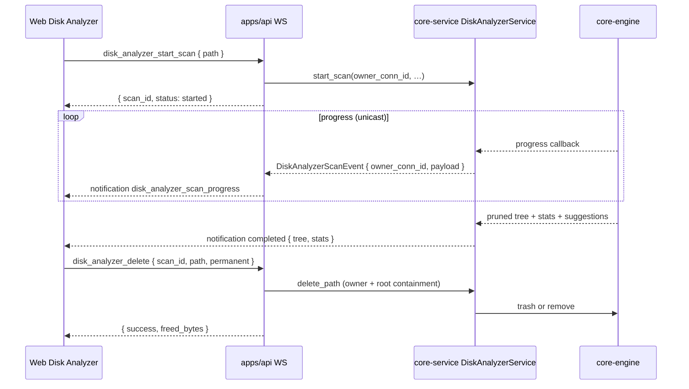

# TECH · APP-042: Disk Analyzer

> Technical design · HOW. Implements PRD Must Haves for local disk scan, WS progress, ECharts visualization, and trash-first delete.

## Architecture

```text
apps/web features/disk-analyzer  (ECharts Sunburst/Treemap + filters/delete)
        ↑ WS request / unicast notification (owner_conn_id)
    apps/api api/ws  (thin DiskAnalyzer* handlers + event forwarder)
        ↑
crates/core-service DiskAnalyzerService
  (sessions, ownership, project roots, TTL/limits, delete bounds)
        ↑
crates/core-engine disk_analyzer / fs
  (parallel walk, hardlink dedup, size tree, trash/delete, volume info)
```



## Layer mapping

| PRD | Layer | Change |
|-----|-------|--------|
| M1 | `apps/web` | Management Center item, route `/disk-analyzer`, `CurrentView`, center-stage render |
| M2–M4, M11 | `core-engine` + `core-service` + `apps/api` WS | Scanner, owned scan session, unicast progress, tree DTO |
| M5–M9, M12 | `apps/web` | Feature UI, ECharts, i18n |
| M8 | `core-service` | Mark nodes whose path equals known project + workspace roots |
| M10 | `core-engine` + service + web | Trash crate / permanent delete + confirm dialog; delete requires `scan_id` and stays under session root |
| N1 | `core-engine` + web | Volume free/total via `fs4` |
| N2 | engine (pre-prune) + web | Suggestion list from unpruned tree |

## Decisions

| ID | Decision | Why |
|----|----------|-----|
| D1 | WebSocket over Atmos Server, not Tauri-only | Matches Management Center features; Desktop and local Web share one capability. |
| D2 | Allocated size = Unix `blocks * 512` (and best-effort equivalent elsewhere) | Matches “disk usage, not apparent size”. Hard links counted once via `(dev, ino)`. |
| D3 | Do **not** skip caches (`node_modules`, `.git`, `target`, etc.) | Explicit PRD requirement for cleanup discovery. |
| D4 | Follow directory entries; do **not** follow directory symlinks into cycles | Avoid infinite walks; count symlink files as their link metadata size only. |
| D5 | Sessions live in `DiskAnalyzerService` keyed by `scan_id`, bound to `owner_conn_id`; progress is **unicast** | Prevent cross-connection path leakage and cancel/delete abuse. |
| D5b | Max ~8 sessions + 30m TTL eviction | Bound memory from retained trees. |
| D6 | Trash by default via `trash` crate; permanent delete requires `permanent: true`; trash errors do not fall back to permanent | Safer default; matches PRD. |
| D7 | Add `echarts` (+ `echarts-for-react`) to `apps/web` | Recharts lacks first-class Sunburst; PRD requires ECharts. |
| D8 | Business logic in `core-service`; API stays thin (parse/route/adapt notifications) | Matches Atmos backend dependency flow. |

## Data model (in-memory, no DB migration)

```rust
struct DiskNode {
  name: String,
  path: String,
  size: u64,          // allocated bytes
  is_dir: bool,
  is_project: bool,   // project or workspace root match
  file_count: u64,
  dir_count: u64,
  children: Vec<DiskNode>,
}

struct ScanProgress {
  scan_id: String,
  status: "running" | "completed" | "cancelled" | "failed",
  files_scanned: u64,
  bytes_scanned: u64,
  current_path: Option<String>,
  percent: Option<f32>, // best-effort; may be null while walking
  error: Option<String>,
}

struct DiskVolumeInfo {
  path: String,
  total_bytes: u64,
  available_bytes: u64,
}
```

Visualization prune rules (serialization):

- Always keep directory nodes needed to reach large contributors.
- Per directory, keep top `N` children by size (default 40); collapse remainder into an `__other__` synthetic child preserving leftover bytes/counts.
- Parent `size` remains the true aggregated total.
- Cleanup suggestions are computed **before** prune so cache dirs collapsed into `__other__` still surface.

Project marking:

- Collect absolute paths for all projects + workspaces known to Atmos.
- Mark node `is_project=true` when `path` equals one of those roots (normalized).

## WebSocket protocol

### Actions (`WsAction`)

| Action | Request | Response |
|--------|---------|----------|
| `DiskAnalyzerStartScan` | `{ path?: string, max_children?: number }` | `{ scan_id, root_path }` |
| `DiskAnalyzerCancelScan` | `{ scan_id }` | `{ ok: true }` — owner connection only |
| `DiskAnalyzerGetTree` | `{ scan_id, path?: string, max_children?: number }` | `{ tree, stats }` — owner only; snapshot then prune outside lock |
| `DiskAnalyzerDelete` | `{ scan_id, path, permanent?: bool }` | `{ success, path, freed_bytes, permanent }` — owner only; path must canonicalize under session root |
| `DiskAnalyzerDiskInfo` | `{ path?: string }` | `DiskVolumeInfo` |

Default `path` for start/info = home directory from existing `FsEngine::get_home_dir`.

### Events (`WsEvent`)

- `DiskAnalyzerScanProgress` — payload `ScanProgress` (+ optional `tree`/`stats`/`suggestions` when `status=completed`)
- Delivered via `WsManager::send_to(owner_conn_id)`, never broadcast.

## Frontend design

- Route: `apps/web/src/app/(app)/disk-analyzer/page.tsx` via `createAppPage`.
- Feature: `apps/web/src/features/disk-analyzer/`
  - `components/DiskAnalyzerPage.tsx` — layout: toolbar, progress, chart, side details
  - `components/DiskUsageChart.tsx` — ECharts sunburst/treemap; HTML-escaped tooltips
  - `hooks/use-disk-analyzer.ts` — WS start/cancel/listen/delete/info; match `scanId` via ref; diskInfo best-effort
  - `lib/tree-adapters.ts` — DiskNode → ECharts data; filters keep empty filtered children
- Shell wiring: Management Center, document title, global search.
- i18n: `AppShell.chrome…` + `appShell.documentTitle` / `appShell.globalSearchItems` + top-level `DiskAnalyzer.*` (`scanFailed`, `atmosProject`, etc.).

## Backend module layout

- `crates/core-engine/src/disk_analyzer/mod.rs` — walk, hardlink dedup, prune, suggestions, delete, disk info.
- Dependencies: `jwalk`, `trash`, `fs4`, existing `serde`/`dirs`; `uuid` is a **dev-dependency** for fixture dirs.
- `crates/core-service/src/service/disk_analyzer.rs` — `DiskAnalyzerService` owns sessions + events.
- API handlers under `apps/api/src/api/ws/router/disk_analyzer.rs` + message DTOs; unicast forwarder in `main.rs`.

## Security / privacy

- Operations are local filesystem only; do not upload trees.
- Scan sessions are bound to the initiating WebSocket `conn_id`; cancel/get_tree/delete require ownership.
- Progress/completion notifications are unicast to the owner only.
- Delete requires `scan_id`; path must canonicalize under that session’s root; refuse filesystem roots via portable `parent().is_none()` (covers `/` and drive roots).
- Permanent delete requires explicit flag + UI confirmation.
- Chart tooltips escape HTML to avoid XSS from path/name content.

## Performance

- Parallel walk via `jwalk` (Rayon under the hood).
- Progress emit throttled (~250ms) to avoid WS floods.
- Pruned tree for chart; optional `DiskAnalyzerGetTree` for deeper path (Arc snapshot, prune outside lock).
- Delete runs on `spawn_blocking`.
- Cancel sets an atomic flag checked during walk.
- Session retention: max 8 + 30m TTL.

## Rollout

1. Engine scanner + unit tests on fixture trees (sizes, hardlinks, project marks, prune, suggestions-before-prune, cancel, delete bounds).
2. `DiskAnalyzerService` + WS actions/events + unicast forwarder.
3. Web feature + Management Center entry + i18n.
4. Delete (trash/permanent) + confirm UI.
5. Nice-to-haves: disk info gauge, cleanup suggestions, cancel, global search.

## Risks

| Risk | Mitigation |
|------|------------|
| Huge home dirs freeze UI | Prune serialization; virtualize details list; show progress early |
| Permission errors mid-scan | Skip unreadable entries; count in `error_count` (including `process_read_dir` Errs) |
| Remote Relay users scan wrong machine | Copy warning when connection is remote computer; still valid for remote Atmos Computer cleanup |
| `trash` unsupported on some targets | Return error; never fall back to permanent |
| ECharts bundle size | Dynamic import chart component |
| Cross-client path leakage | Owner binding + unicast |

## Testing notes

- Rust: fixture directory with nested files, hard links (Unix), symlink, unreadable dir (best-effort), project path marking, prune totals, delete outside-root rejection, portable root refuse.
- Bun: tree adapter filters/sorts and ECharts mapping; parent-match keeps filtered (empty) children.
- Manual/agent-browser: Management Center entry, scan progress, chart switch, delete confirm.
- Allocated-size tests assert hierarchical aggregation; hardlink fixture distinguishes allocation from double-counting logical paths.
