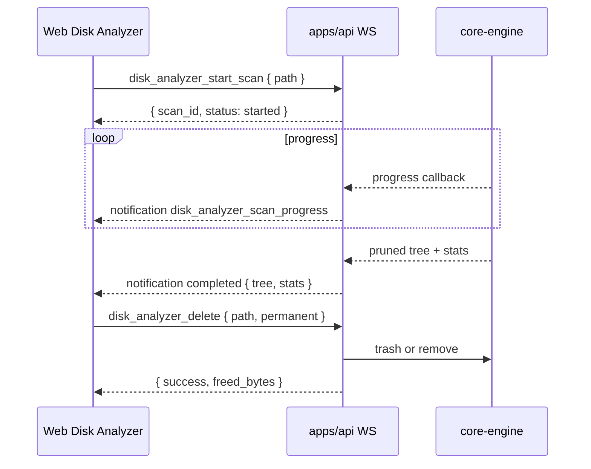

# TECH · APP-042: Disk Analyzer

> Technical design · HOW. Implements PRD Must Haves for local disk scan, WS progress, ECharts visualization, and trash-first delete.

## Architecture

```text
apps/web features/disk-analyzer  (ECharts Sunburst/Treemap + filters/delete)
        ↑ WS request / notification
apps/api api/ws  (DiskAnalyzer* actions + DiskAnalyzerScanProgress event)
        ↑
crates/core-service (optional: resolve project/workspace path set)
        ↑
crates/core-engine disk_analyzer / fs  (parallel walk, size tree, trash/delete, volume info)
```



## Layer mapping

| PRD | Layer | Change |
|-----|-------|--------|
| M1 | `apps/web` | Management Center item, route `/disk-analyzer`, `CurrentView`, center-stage render |
| M2–M4, M11 | `core-engine` + `apps/api` WS | Scanner, scan session, progress events, tree DTO |
| M5–M9, M12 | `apps/web` | Feature UI, ECharts, i18n |
| M8 | `core-service` / API | Mark nodes whose path equals/prefixes known project + workspace roots |
| M10 | `core-engine` + API + web | Trash crate / permanent delete + confirm dialog |
| N1 | `core-engine` + web | Volume free/total via platform APIs |
| N2 | web (+ light heuristics in engine stats) | Suggestion list from tree |

## Decisions

| ID | Decision | Why |
|----|----------|-----|
| D1 | WebSocket over Atmos Server, not Tauri-only | Matches Management Center features; Desktop and local Web share one capability. |
| D2 | Allocated size = Unix `blocks * 512` (and best-effort equivalent elsewhere) | Matches “disk usage, not apparent size”. |
| D3 | Do **not** skip caches (`node_modules`, `.git`, `target`, etc.) | Explicit PRD requirement for cleanup discovery. |
| D4 | Follow directory entries; do **not** follow directory symlinks into cycles | Avoid infinite walks; count symlink files as their link metadata size only. |
| D5 | Keep scan session in API memory keyed by `scan_id`; broadcast pruned visualization tree | Million-file homes cannot ship full leaf JSON safely. |
| D6 | Trash by default via `trash` crate; permanent delete requires `permanent: true` | Safer default; matches PRD. |
| D7 | Add `echarts` (+ `echarts-for-react` if helpful) to `apps/web` | Recharts is present but lacks first-class Sunburst; PRD requires ECharts. |

## Data model (in-memory, no DB migration)

```rust
struct DiskNode {
  name: String,
  path: String,
  size: u64,          // allocated bytes
  is_dir: bool,
  is_project: bool,   // project or workspace root match
  file_count: u64,
  dir_count: u64,
  children: Vec<DiskNode>,
}

struct ScanProgress {
  scan_id: String,
  status: "running" | "completed" | "cancelled" | "failed",
  files_scanned: u64,
  bytes_scanned: u64,
  current_path: Option<String>,
  percent: Option<f32>, // best-effort; may be null while walking
  error: Option<String>,
}

struct DiskVolumeInfo {
  path: String,
  total_bytes: u64,
  available_bytes: u64,
}
```

Visualization prune rules (serialization):

- Always keep directory nodes needed to reach large contributors.
- Per directory, keep top `N` children by size (default 40); collapse remainder into an `__other__` synthetic child preserving leftover bytes/counts.
- Parent `size` remains the true aggregated total.

Project marking:

- Collect absolute paths for all projects + workspaces known to Atmos.
- Mark node `is_project=true` when `path` equals one of those roots (normalized).

## WebSocket protocol

### Actions (`WsAction`)

| Action | Request | Response |
|--------|---------|----------|
| `DiskAnalyzerStartScan` | `{ path?: string, max_children?: number }` | `{ scan_id, root_path }` |
| `DiskAnalyzerCancelScan` | `{ scan_id }` | `{ ok: true }` |
| `DiskAnalyzerGetTree` | `{ scan_id, path?: string, max_children?: number }` | `{ tree, stats }` (subtree or root) |
| `DiskAnalyzerDelete` | `{ path, permanent?: bool }` | `{ success, path, freed_bytes, permanent }` |
| `DiskAnalyzerDiskInfo` | `{ path?: string }` | `DiskVolumeInfo` |

Default `path` for start/info = home directory from existing `FsEngine::get_home_dir`.

### Events (`WsEvent`)

- `DiskAnalyzerScanProgress` — payload `ScanProgress` (+ optional `tree`/`stats` when `status=completed`)

Long-running pattern mirrors `local_model` / workspace setup: start returns immediately; progress/completion arrives as notifications.

## Frontend design

- Route: `apps/web/src/app/(app)/disk-analyzer/page.tsx` via `createAppPage`.
- Feature: `apps/web/src/features/disk-analyzer/`
  - `components/DiskAnalyzerPage.tsx` — layout: toolbar, progress, chart, side details
  - `components/DiskUsageChart.tsx` — ECharts sunburst/treemap switch
  - `hooks/use-disk-analyzer.ts` — WS start/cancel/listen/delete/info
  - `lib/tree-adapters.ts` — DiskNode → ECharts data; filters/sort
- Shell wiring: `use-context-params`, `LeftSidebarManagementCenter`, `center-stage-support`, `DocumentTitle`, LeftSidebar expanded management check, global search (N5).
- i18n: `AppShell.chrome.managementCenter.items.diskAnalyzer` + `DiskAnalyzer.*` namespaces in `en.json` / `zh.json`.

## Backend module layout

- Prefer `crates/core-engine/src/disk_analyzer/mod.rs` (keep `fs` focused on browse/edit).
- Dependencies: `jwalk` (parallel walk; Rayon under the hood), `trash`, `fs2`, existing `serde`/`dirs`.
- API handlers under `apps/api/src/api/ws/router/disk_analyzer.rs` + message DTOs.
- Scan sessions: `Arc<Mutex<HashMap<scan_id, ScanSession>>>` on `WsMessageService` or a small dedicated manager in API (no persistence).

## Security / privacy

- Operations are local filesystem only; do not upload trees.
- Reject delete of `/` and empty paths; expand/`canonicalize` carefully; refuse escape outside requested roots only if we introduce a sandbox later (v1 allows any path the server process can read/write, same as existing FS WS).
- Permanent delete requires explicit flag + UI confirmation.

## Performance

- Parallel walk via `jwalk` (Rayon under the hood).
- Progress emit throttled (~200–500ms) to avoid WS floods.
- Pruned tree for chart; optional `DiskAnalyzerGetTree` for deeper path.
- Cancel sets an atomic flag checked during walk.

## Rollout

1. Engine scanner + unit tests on fixture trees (sizes, project marks, prune, cancel).
2. WS actions/events + API wiring.
3. Web feature + Management Center entry + i18n.
4. Delete (trash/permanent) + confirm UI.
5. Nice-to-haves: disk info gauge, cleanup suggestions, cancel, global search.

## Risks

| Risk | Mitigation |
|------|------------|
| Huge home dirs freeze UI | Prune serialization; virtualize details list; show progress early |
| Permission errors mid-scan | Skip unreadable entries; record error count in stats |
| Remote Relay users scan wrong machine | Copy warning when connection is remote computer; still valid for remote Atmos Computer cleanup |
| `trash` unsupported on some targets | Fall back error with clear message; permanent remains explicit opt-in |
| ECharts bundle size | Dynamic import chart component |

## Testing notes

- Rust: fixture directory with nested files, symlink, unreadable dir (best-effort), project path marking, prune totals.
- Bun: tree adapter filters/sorts and ECharts mapping.
- Manual/agent-browser: Management Center entry, scan progress, chart switch, delete confirm.
