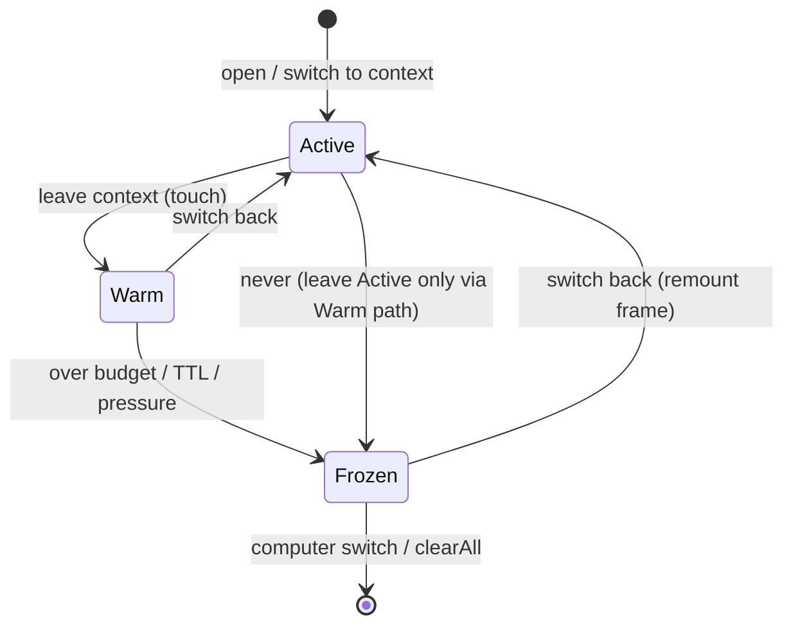

# TECH · APP-043: Workspace Surface Cache

> Technical Design · HOW. Implements PRD APP-043: Workspace Surface Cache. Addresses M1–M12. N1–N3: hooks or ship-if-cheap; not required for cutover.

## Scope summary

Frontend-only redesign of how the web workbench hosts Workspace/Project **center surfaces** across context switches. Replaces APP-034’s `useTerminalCacheStore` and terminal-only multi-render path with a unified **Workspace Surface Cache (WSC)** and **WorkspaceFrameHost**.

Out of scope: backend PTY protocol changes, mobile shell, Canvas multi-frame host, dual-path compatibility with APP-034 APIs.

## Architecture overview

```text
AppShell (singleton)
├── LeftSidebar          # selection only; no per-workspace clone
├── WorkspaceFrameHost   # multi-instance center frames
│   ├── Frame[contextId=A]  tier=active|warm  visibility=visible|hidden
│   ├── Frame[contextId=B]  tier=warm         visibility=hidden
│   └── (Frozen contexts: no Frame mounted; identity stores retained)
├── RightSidebar         # singleton; rebinds to activeContextId
└── Global chrome

useWorkspaceSurfaceCacheStore  # tiers, budgets, mountPlan, touch/freeze
per-context identity stores    # terminals tabs/layouts, editors, github, browser
TanStack Query                 # server snapshots (APP-035), not DOM lifecycle
```



## Design decisions

| ID | Decision |
|----|----------|
| **D1** | **Supersede APP-034 completely.** Remove `use-terminal-cache-store.ts`. New settings namespace only; **do not read** `terminal.max_cached_*`. |
| **D2** | **Singleton shell, multi-instance center frames only.** |
| **D3** | **Route `effectiveContextId` is active identity truth.** WSC `activeContextId` mirrors it. |
| **D4** | **Frame exists only for Active + Warm.** Frozen: no React frame; **retain** tab/layout/openFile identity (see D10). |
| **D5** | **Switch is synchronous for chrome** (frame visibility + last tab identity). Hydrate/attach never gates first paint. |
| **D6** | **Surface policies + mount plan are declarative** in `workspace-surface-policies.ts` + WSC `mountPlan`. |
| **D7** | **Right sidebar single-mounted**; viewState keyed by context. |
| **D8** | **No historical compatibility layer.** |
| **D9** | **One delivery** (store + host + policies + settings + tests). |
| **D10** | **Frozen = Option A (identity-preserving detach).** Unmount heavy DOM; **do not** call today’s full `evictWorkspaceRuntime` on freeze (it deletes tabs/layouts/`persistedTerminalLayouts`). Introduce `detachWorkspaceFrontend(contextId)` that drops live attach/hydration flags only. Full wipe only on `clearAll` / computer switch / explicit workspace delete. |
| **D11** | **Per-frame `frameActiveTab`; only Active writes URL.** Warm frames never read global URL tab for panel visibility. |
| **D12** | **Light panels default narrow:** mount only last-active or session-opened light surfaces inside a frame; not “all light panels always mounted while warm.” |
| **D13** | **project-wiki / code-review are per-frame surfaces**, not host-level singletons bound to `effectiveContextId`. |

---

## 1. Frame active tab & URL ownership (M5 / M6 / multi-frame safety)

### 1.1 Contract table

| Frame state | `frameActiveTab` source | Writes URL (`?tab=` / wikiPage / editor active) | Panel visibility uses |
|-------------|-------------------------|--------------------------------------------------|------------------------|
| **Active** | URL tab **or** editor active file for this `contextId` (same resolution rules as today’s CenterStage, but **scoped to this context**) | **Yes** — only this frame | `frameActiveTab` |
| **Warm** | That context’s `lastCenterTab` / `ContextViewState` (updated whenever the frame was last Active, and when user changes tabs while it is Active) | **No** | `frameActiveTab` from viewState — **never** global URL |
| **Warm → Active** | On activation: take Warm `frameActiveTab` / `lastCenterTab` and **push once** to URL (and editor active file if file tab) | **Yes (one sync write)** | After URL catch-up, Active rules |
| **Frozen → Active** | Remount frame; `frameActiveTab` from retained `lastCenterTab` + tab meta; push URL once | **Yes (one sync write)** | Same as Active after push |

### 1.2 Invariants

1. A Warm frame **must not** use `activeValue` derived from URL + global `effectiveContextId` for `hidden` decisions. That is the APP-034 pitfall amplified across full frames.
2. Host exposes `activeContextId` only; each frame owns local `frameActiveTab` state (initialized from viewState / URL when becoming Active).
3. Tab bar in a Warm frame may render for identity, but interactions that would change tabs are disabled or no-op unless the frame is Active (product: user cannot click hidden frame).
4. On Active→Warm, host/frame **writes** `lastCenterTab = frameActiveTab` into viewState / existing `setCenterStageLastTab(contextId, …)` before hide.

### 1.3 Panel visibility rule (per frame)

```ts
// Inside WorkspaceCenterFrame for contextId
const isActiveFrame = contextId === activeContextId;
const frameActiveTab = isActiveFrame
  ? resolveActiveTabFromUrlAndEditor(contextId) // Active path
  : readLastCenterTab(contextId);              // Warm path

// each panel:
hidden = !isActiveFrame || panelTabId !== frameActiveTab
// terminal multi-tab inside frame:
hidden = !isActiveFrame || frameActiveTab !== terminalTabId
```

Warm frames stay mounted but all panels stay `hidden` relative to viewport (frame itself is `hidden`); internally they still key off **their** `frameActiveTab` so re-show does not flash the wrong panel.

---

## 2. Host vs Frame ownership

| Responsibility | Host (`WorkspaceFrameHost` / residual CenterStage shell) | Frame (`WorkspaceCenterFrame`) |
|----------------|----------------------------------------------------------|--------------------------------|
| Mirror URL → `activeContextId` / WSC `setActive` + `touch(prev)` | ✓ | |
| Mount set = `{active} ∪ warm` | ✓ | |
| URL tab / wikiPage writes | ✓ coordinator: only when change originates from **Active** frame | Request via callback `onRequestUrlTabChange` |
| Tab bar UI | | ✓ |
| Center panels (terminal, files, wiki, GH, browser, project-wiki, code-review) | | ✓ |
| Per-context last-tab pending restore | Coordinates activate push | Holds per-frame pending until meta ready |
| Global hotkeys that change center tab | ✓ only if target is Active | |
| Pending agent-fix / workspace agent run landing | ✓ targets `activeContextId` only | Receives apply when active |
| Canvas terminal close / pin events | ✓ routes to owning context’s terminal store; never wrong frame focus | May expose grid ref for active only |
| Setup-blocking progress UI | ✓ replaces **center region** when **active** workspace is blocking | Frozen/warm frames unmounted or not shown under block |
| Dialogs (unsaved close, terminal close confirm) | ✓ host-level, context-tagged | Triggers only |
| `enforceMountBudgets` / freeze | ✓ calls WSC | Applies `mountPlan` props |
| Right sidebar | Outside host (AppShell); rebinds active only | |

**Anti-pattern to avoid:** host effects that still assume a single CenterStage tree and read only `effectiveContextId` for panel state while multiple frames exist.

---

## 3. Frozen semantics (Option A) — aligned with PRD 150ms

### 3.1 Problem with full `evictWorkspaceRuntime`

Current `evictTerminalWorkspaceRuntimeState` deletes for that workspace:

- `workspaceTerminalTabs`, active terminal tab ids
- panes / layouts / maximized
- `persistedTerminalLayouts` for the scope
- project-wiki / code-review pane maps
- hydrated/loaded flags

That **wipes terminal strip identity**, so Frozen return cannot paint a correct multi-tab strip in 150ms without backend hydrate. **PRD forbids this path for ordinary freeze.**

### 3.2 New terminal API

```ts
// use-terminal-store.ts
detachWorkspaceFrontend(workspaceId: string): void
// Clears live-only state:
// - hydratedTerminalScopes / initializing* for that workspace
// - tmuxWindowsCache optional
// - does NOT delete workspaceTerminalTabs, panes, layouts, persistedTerminalLayouts,
//   workspaceActiveTerminalTabIds, projectWiki*, codeReview* identity maps
// - disposes any frontend xterm controllers still registered for that id (if any global registry)

evictWorkspaceRuntime(workspaceId: string): void
// Existing full wipe — ONLY for clearAll / computer switch / workspace deleted from product
```

### 3.3 Freeze pipeline

```text
freeze(contextId):
  1. Persist lastCenterTab + any frame viewState
  2. Remove contextId from warm[]; frame unmounts (React)
  3. detachWorkspaceFrontend(contextId)  // NOT full evict
  4. Demount is automatic (no frame); mountPlan drops all entries for contextId
  5. Identity remains: terminal tabs, openFiles, github/browser tab meta, lastCenterTab
```

### 3.4 Frozen → Active first paint (≤150ms)

From **local identity only**:

- Tab strip = union of fixed tabs eligibility + `workspaceTerminalTabs[id]` + openFiles + github/browser meta
- Active tab chrome = `lastCenterTab` if still present in meta, else fallback terminal/overview
- Content: remount heavy surface; terminal may show in-panel loading until re-attach; **strip must not be empty** if tabs were known

Warm path still owns full buffer continuity (M6). Frozen does **not** require xterm buffer continuity — only identity + fast chrome (PRD success metrics).

---

## 4. Budget coordinator & mount plan (M3 / M4)

### 4.1 State shape

```ts
type MountKey =
  | `terminal:${contextId}:${tabId}`
  | `editor:${contextId}:${filePath}`
  | `browser:${contextId}:${tabValue}`
  | `light:${contextId}:${"overview"|"wiki"|GithubTabValue}`
  | `named-terminal:${contextId}:${"project-wiki"|"code-review"}`;

interface MountPlan {
  /** Keys allowed to keep React heavy trees mounted (Active + Warm frames only). */
  mounted: Set<MountKey>;
}

// On WSC store:
mountPlan: MountPlan;
enforceMountBudgets: (reason: BudgetRunReason) => void;
```

Replace ad-hoc `mountedTerminalTabsByContext` with **mountPlan-driven** mounts inside each frame (can keep a thin adapter during refactor, but single source of truth is mountPlan).

### 4.2 Who runs coordinator

| Trigger (`BudgetRunReason`) | Caller |
|-----------------------------|--------|
| Context switch (`setActive` / `touch` / `freeze`) | WSC actions (sync end of action) |
| Open/close file, terminal tab, browser tab | Feature store mutation → `enforceMountBudgets("surface_change")` (microtask ok) |
| Settings budget change | WSC setters after persist |
| TTL sweep | `sweepExpired` then enforce |
| Memory pressure (N2) | optional listener → `enforceMountBudgets("memory_pressure")` |

**Owner:** pure function `computeMountPlan(snapshot, budgets) → MountPlan` in `workspace-surface-policies.ts`; WSC stores result; FrameHost/Frames **only read** `mountPlan`.

### 4.3 Eviction order (within enforce)

When over caps, demount in this order (never demount Active context’s **active** surface):

1. Warm **browser** DOMs (oldest context first)
2. Warm **editor** DOMs beyond per-ws / global editor caps (keep `OpenFile`)
3. Warm **secondary** terminal tab DOMs (non-`frameActiveTab` terminals); keep tab meta + layout in store
4. Warm **light** panels that are not `lastCenterTab`
5. If still over **warm workspace** cap or global terminal pane hard cap: **freeze** oldest unprotected warm workspace (Option A detach)
6. **Last resort:** freeze/demount protected victims only if absolute hard cap still exceeded; log `EvictReason` + user-visible: no toast required; dev diagnostics if N3

### 4.4 Single-pane demount vs freeze workspace

| Action | Effect |
|--------|--------|
| Demount one surface | Remove key from `mountPlan`; unmount that React subtree only; identity retained |
| Freeze workspace | Unmount entire frame; `detachWorkspaceFrontend`; drop all mount keys for context; tier=frozen |

---

## 5. Warm pause matrix (CPU / correctness)

`hidden` ≠ paused. For every Warm frame (`isActiveFrame === false`), enforce:

| Subsystem | Warm behavior |
|-----------|----------------|
| Terminal `fit` / ResizeObserver-driven fit | **Paused**; run fit only on Active transition |
| Terminal write → xterm render | **Throttle or coalesce**; still accept backend data into buffer if attach kept |
| Terminal focus / selection overlays | **Disabled** |
| CodeMirror | `surfaceActive=false` (existing); no focus; defer expensive extensions if any |
| Browser panel | `isActive=false`; no focus; prefer freeze network timers if panel supports; demount under browser cap first |
| Wiki / overview polling or refresh intervals | **Paused** unless that light surface is also last tab **and** product requires background refresh (default: pause all) |
| GitHub detail polling | **Paused** when frame warm |
| Global hotkeys | Host handles; **must not** dispatch to hidden frame handlers |
| Focus traps / dialogs | Only Active frame |
| `document` paste / drag targets | Active only |

Checklist for implementers: grep Warm path for `setInterval`, query `refetchInterval`, and xterm `onRender` while hidden.

---

## 6. Protection (`isProtected`) — locked minimum set

```ts
function isProtected(contextId: string): boolean {
  if (contextId === getActiveContextId()) return true; // Active never frozen via budget
  if (hasDirtyOpenFile(contextId)) return true;        // OpenFile.isDirty
  if (hasLiveAgentOrBusyPane(contextId)) return true;  // existing pane agent / busy indicators
  if (isPinned(contextId)) return true;                // N1 only; no-op if unshipped
  return false;
}
```

**Hard-cap last resort:** if every warm victim is protected and caps still exceeded, freeze the **oldest protected warm** context, reason `hard_cap_protected`. Product: rare; dirty buffers remain in editor store (DOM may remount); live agent terminal may need reattach (identity kept under Option A). Document in UI only if dogfood shows pain (no new modal required for v1).

---

## 7. Surface policies (final)

| Surface | Active | Warm | Frozen |
|---------|--------|------|--------|
| Terminal center tabs | Live attach; mount per mountPlan | Keep DOM if in mountPlan; pause matrix | DOM gone; **tabs/layouts/persisted layouts retained**; reattach on demand |
| project-wiki / code-review named terminals | **Per-frame** TerminalGrid (not host singleton) | Same as terminal if mountPlan allows | Identity maps retained; detach frontend |
| File editors | Active file + editor LRU ≤ per-ws cap | Same LRU; pause CM | DOM gone; openFiles + dirty retained |
| Browser | Live; global cap | Cap demounts first | Meta retained |
| Overview / Wiki / GitHub | Mount **only if** `frameActiveTab` is that surface **or** surface was opened this session and still in a small per-frame light LRU (max 1 light besides last tab) | Same; pause polling | Remount + Query |

---

## 8. Switch path (executable)

```text
on effectiveContextId change (Host):
  mark wsc-switch-start
  prev = WSC.activeContextId
  WSC.setActiveContextId(next)     // next leaves warm if present
  if prev && prev !== next:
    write lastCenterTab(prev) from prev frame’s frameActiveTab
    WSC.touch(prev)               // may freeze LRU victim via enforceMountBudgets
  ensure Frame(next) mounted
  show Frame(next); hide others
  // Activate:
  tab = readLastCenterTab(next) ?? fallback
  push URL once from tab (Active contract)
  mark wsc-switch-chrome-ready
  microtask: primeWorkspace(next); Query prefetch; enforceMountBudgets if needed
  // Content readiness is async; mark wsc-switch-surface-ready when active surface reports ready
```

**Non-blocking restore:** never await `isTerminalWorkspaceReady` / editor hydration before chrome + URL push. If tab meta missing transiently, keep per-frame pending without blanking host.

---

## 9. Module design

### 9.1 Store

**New:** `apps/web/src/features/workspace/store/use-workspace-surface-cache-store.ts`

```ts
type SurfaceTier = "active" | "warm" | "frozen";

interface WarmEntry {
  contextId: string;
  lastAccessed: number;
  pinned?: boolean;
}

interface WorkspaceSurfaceCacheState {
  activeContextId: string | null;
  warm: WarmEntry[];
  mountPlan: MountPlan;
  maxWarmWorkspaces: number;                    // default 4
  maxGlobalTerminalPanes: number;               // default 16
  maxGlobalMountedEditors: number;              // default 10
  maxMountedEditorsPerWorkspace: number;        // default 5
  maxGlobalBrowsers: number;                    // default 2
  warmTtlMs: number;                            // default 3_600_000
  setActiveContextId: (id: string | null) => void;
  touch: (id: string) => void;
  freeze: (id: string, reason: EvictReason) => void;
  enforceMountBudgets: (reason: BudgetRunReason) => void;
  sweepExpired: () => void;
  clearAll: () => void;
  loadSettings: () => Promise<void>;
  // budget setters → functionSettingsApi workspace_surface.*
}
```

**Invariants**

1. `activeContextId ∉ warm[]`
2. `warm.length ≤ maxWarmWorkspaces` after touch/settings
3. `mountPlan` only references Active∪Warm contexts
4. `freeze` never uses full `evictWorkspaceRuntime` (uses `detachWorkspaceFrontend`)

### 9.2 Frame components

- `apps/web/src/app-shell/WorkspaceFrameHost.tsx`
- `apps/web/src/app-shell/WorkspaceCenterFrame.tsx`
- `apps/web/src/app-shell/workspace-surface-policies.ts` — `computeMountPlan`, `isProtected`, pause helpers
- Refactor `CenterStage.tsx` / `CenterStagePanels.tsx` / `center-stage-support.tsx` into host + frame

### 9.3 Terminal store changes

- Add `detachWorkspaceFrontend`
- Keep `evictWorkspaceRuntime` for clearAll / delete only
- Freeze path must not call full evict

### 9.4 Settings (M10) — semantic change, no silent migration

| New key | Default | Replaces concept |
|---------|---------|------------------|
| `workspace_surface.max_warm_workspaces` | `4` | `terminal.max_cached_workspaces` (warm frames, not “kick whole context if panels high” alone) |
| `workspace_surface.max_global_terminal_panes` | `16` | Was per-workspace panel kick from cache; now **global mounted pane** cap |
| `workspace_surface.max_mounted_editors_per_workspace` | `5` | new |
| `workspace_surface.max_global_mounted_editors` | `10` | new |
| `workspace_surface.max_global_browsers` | `2` | new |
| `workspace_surface.warm_ttl_ms` | `3600000` | TTL (same order of magnitude as APP-034) |

**Settings UI copy must explain:** warm workspaces vs global heavy-surface caps. **Do not** silently map old values into new keys. Old keys unused; may delete from schema in same delivery.

### 9.5 clearAll hooks (M12) — named integration points

Call `useWorkspaceSurfaceCacheStore.getState().clearAll()` (unmount frames + empty warm + empty mountPlan + full terminal/editor cleanup as needed) from the **same places** that reset APP-035 / connection scope, including at least:

- `activeInstanceId` change in connection store subscribers / existing computer-switch cleanup
- Logout / session teardown paths that already clear project bootstrap
- Any existing “reset client state on target switch” helper used by APP-035 inventory

Also run full `evictWorkspaceRuntime` for all known contexts **or** a bulk terminal store reset already used on computer switch — identity must not leak across computers.

Align with APP-035: surface cache clear is **in addition to** query cache scope reset, not a substitute.

### 9.6 Prefetch (M9)

Left sidebar workspace row `onPointerEnter` debounced ~100ms → `primeWorkspace` + optional git query prefetch. Does **not** insert into warm.

### 9.7 Visibility fit (M8)

On Warm/Frozen → Active, `useLayoutEffect` on active terminal/editor: explicit `fit()` / layout refresh.

---

## Data model (client)

```ts
interface ContextViewState {
  contextId: string;
  lastCenterTab: string | null;
  sidebarSection?: string;
  fileTreeExpanded?: string[];
  lightOpened?: string[]; // session light surfaces eligible for warm mount
}

type EvictReason =
  | "lru_warm_cap"
  | "ttl"
  | "global_terminal_cap"
  | "global_editor_cap"
  | "global_browser_cap"
  | "hard_cap_protected"
  | "memory_pressure"
  | "computer_switch"
  | "manual";

type BudgetRunReason =
  | "switch"
  | "surface_change"
  | "settings"
  | "ttl"
  | "memory_pressure"
  | "clear";
```

---

## Transport

None. No new REST/WebSocket APIs. Terminal attach uses existing paths after Frozen remount.

---

## Security & permissions

- clearAll on computer/auth switch prevents cross-target frame leak.
- No sensitive buffers in eviction logs.

---

## Performance budgets

| Path | Target |
|------|--------|
| Warm → Active, terminal last surface | ≤ 100ms focusable |
| Warm → Active, file last surface | ≤ 150ms editor chrome |
| Frozen → Active chrome (strip + last tab identity) | ≤ 150ms **from local identity** |
| Frozen primary content (local reattach) | ≤ 500ms typical |
| `touch` + `enforceMountBudgets` sync | ≤ 4ms typical |

Marks: `wsc-switch-start` / `wsc-switch-chrome-ready` / `wsc-switch-surface-ready` (debug-gated).

---

## Rollout plan (single delivery, internal order)

1. `detachWorkspaceFrontend` + unit tests vs full evict difference.
2. WSC store + `computeMountPlan` / `isProtected` / enforce tests.
3. FrameHost + per-frame tab/URL contract; migrate CenterStage body.
4. Per-frame project-wiki / code-review; light-panel narrow policy.
5. Pause matrix + fit-on-activate + non-blocking restore.
6. Settings schema/UI; remove APP-034 store + inventory references.
7. clearAll wired to computer-switch chain; TEST automation.

---

## Risks & tradeoffs

- **Risk:** Frame/URL desync. **Mitigation:** §1 contract + only Active writes URL.
- **Risk:** Warm CPU. **Mitigation:** §5 pause matrix + browser/editor caps.
- **Risk:** Option A retains more memory than full evict for Frozen. **Tradeoff:** required for Frozen 150ms strip identity; caps + warm TTL limit how many identity-heavy contexts linger.
- **Tradeoff:** Sidebar single mount may flash; accepted.
- **Rollback:** revert delivery; no server migration.

---

## Dependencies & compatibility

- **Supersedes APP-034** completely (code, settings, `api-operation-inventory` notes).
- **Depends on** terminal/editor/github/browser stores, APP-035 query isolation patterns.
- **No** dual-read of APP-034 keys.

---

## Open questions (residual)

- [ ] N1 pin control placement (workspace list menu vs none in v1).
- [ ] Whether warm TTL refreshes on background terminal output — **default no** (only user visit / touch).
- [ ] Exact pane field names for `hasLiveAgentOrBusyPane` — bind to current terminal pane agent indicator fields during impl.

---

## File touch list (expected)

- `apps/web/src/app-shell/CenterStage.tsx`
- `apps/web/src/app-shell/CenterStagePanels.tsx`
- `apps/web/src/app-shell/center-stage-support.tsx`
- `apps/web/src/app-shell/WorkspaceFrameHost.tsx` (new)
- `apps/web/src/app-shell/WorkspaceCenterFrame.tsx` (new)
- `apps/web/src/app-shell/workspace-surface-policies.ts` (new)
- `apps/web/src/features/workspace/store/use-workspace-surface-cache-store.ts` (new)
- `apps/web/src/features/terminal/store/use-terminal-store.ts` (+ detach)
- `apps/web/src/features/terminal/store/terminal-store-helpers.ts`
- `apps/web/src/features/terminal/store/use-terminal-cache-store.ts` (remove)
- `apps/web/src/features/settings/components/SettingsModal.tsx`
- Function settings schema / `settings-api.ts` types
- `apps/web/src/api/query/api-operation-inventory.ts` (drop APP-034 ownership notes)
- Connection / instance-switch cleanup call sites
- Tests: store, policies, optional `e2e/tests/specs/APP-043_workspace-surface-cache.e2e.ts`
