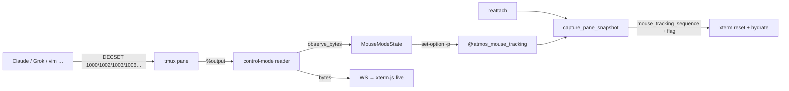

# TECH · APP-046: Terminal TUI Mouse Tracking

> Technical Design · HOW. Observe DEC mouse modes on the tmux control-mode stream, persist on the pane, and reattach with an exact (or complete heuristic) DECSET sequence for xterm.js.

Implements [PRD.md](./PRD.md). Builds on APP-002 reattach and APP-025 shared snapshot helpers.

---

## 1. Architecture overview



**Ghostty comparison**: Ghostty keeps mode bits in-process for one PTY. Atmos cannot; reattach recreates xterm. Persistence on the **tmux pane** bridges disconnects.

## 2. Mode model (xterm.js exclusivity)

Event modes are exclusive (last enable wins), matching `@xterm/xterm` `CoreMouseService`:

| DECSET | Event |
|--------|--------|
| 9 | X10 |
| 1000 | Normal (VT200) |
| 1002 | Button / drag |
| 1003 | **Any** (hover) |
| 1000/1002/1003 reset | None |

Format is independent: default / utf8 (1005) / **sgr (1006)** / urxvt (1015) / sgr_pixels (1016). Optional focus (1004).

### Default restore sequence (unobserved heuristic)

```text
\x1b[?1000h\x1b[?1002h\x1b[?1003h\x1b[?1006h
```

**Must include `1003`.** Omitting it leaves DRAG → click works, hover does not.

## 3. Backend

### 3.1 `core-engine` — `crates/core-engine/src/tmux/mouse_modes.rs`

- `MouseEventMode`, `MouseFormat`, `MouseModeState`
- `observe_bytes(&[u8]) -> bool` — scan CSI `?…h` / `?…l` (incl. multi-param `?1000;1002;1003;1006h`)
- `encode_persist()` / `decode_persist()` — e.g. `any+sgr`, `button+sgr`, `none`
- `restore_sequence()` — exact DECSET for current state
- `resolve_mouse_tracking_restore(observed, alternate, current_command) -> (bool, Option<String>)`
- Constants: `ATMOS_MOUSE_TRACKING_OPTION`, `DEFAULT_TUI_MOUSE_RESTORE`

### 3.2 Persist API — `TmuxEngine`

| Method | Target |
|--------|--------|
| `get_pane_mouse_tracking(session, window)` | `display-message -p '#{@atmos_mouse_tracking}'` |
| `set_pane_mouse_tracking(...)` | `set-option -pt session:window.0 …` |
| `get/set_pane_mouse_tracking_by_id(%N)` | control-mode reader (pane id only) |

Unset / empty → `None` (never observed).  
`none` → observed inactive.

### 3.3 Control-mode reader — `core-service` `terminal/runtime.rs`

On each pane `%output` (after DCS passthrough unwrap):

1. `mouse_modes.observe_bytes(&data)`
2. If changed → `set_pane_mouse_tracking_by_id`
3. Seed tracker at start from `get_pane_mouse_tracking_by_id`

**Also run observe while visual output is suppressed** during attach init (resize/refresh): apps often re-enable mouse on SIGWINCH; dropping those sequences would leave the option stale.

### 3.4 Snapshot — `TmuxPaneSnapshot`

```rust
pub restore_mouse_tracking: bool,
pub mouse_tracking_sequence: Option<String>,
```

Resolution:

| Observed | Result |
|----------|--------|
| `Some(active)` | `restore=true`, sequence = `restore_sequence()` |
| `Some(none)` | `restore=false`, no sequence |
| `None` | heuristic via `should_restore_tui_mouse_tracking(alternate, cmd)` → default sequence with 1003 |

Heuristic true when:

- `alternate` screen, **or**
- `is_inline_mouse_tui_command` (`grok` / `grok-*` basename)

### 3.5 API surface

- WS `terminal_created` / `terminal_attached` snapshot: serde fields on `TmuxPaneSnapshot` (additive).
- REST capture page JSON: include `mouse_tracking_sequence` next to `restore_mouse_tracking` (`apps/api` system handlers).

No new REST write API.

## 4. Frontend / shared

### 4.1 Protocol — `packages/shared/src/terminal/protocol.ts`

```ts
restore_mouse_tracking?: boolean;
mouse_tracking_sequence?: string | null;
```

### 4.2 Restore helpers — `packages/shared/src/terminal/snapshot.ts`

- `ENABLE_TUI_MOUSE_TRACKING` includes **1003**
- `mouseTrackingRestoreSequence(snapshot)` prefers `mouse_tracking_sequence`, else flag/alternate → default
- `buildTerminalSnapshotRestorePayload` appends that sequence after cell hydrate
- Mobile uses the same helper (APP-025)

### 4.3 Web Terminal — `apps/web/.../Terminal.tsx`

- `handleAttached`: `mouseTrackingRestoreSequence(snapshot)` after `term.reset()`
- OSC 9999 `CMD_START` for Grok whitelist: still writes `ENABLE_TUI_MOUSE_TRACKING` (with 1003) as belt-and-suspenders
- `CMD_END`: `DISABLE_TUI_MOUSE_TRACKING` (includes 1003l)

### 4.4 Duplicate constant

`apps/web/.../terminal-runtime-utils.ts` keeps ENABLE/DISABLE + `mouseTrackingRestoreSequence` in sync with `@atmos/shared`.

## 5. Layer rules

| Layer | Responsibility |
|-------|----------------|
| `core-engine` | Parse, persist format, resolve, tmux option I/O |
| `core-service` | Feed live stream into tracker |
| `apps/api` | Pass snapshot fields to clients |
| `packages/shared` | Client restore payload contract |
| `apps/web` / `apps/mobile` | Apply sequence to xterm |

## 6. Rollout

1. Ship backend observe + snapshot fields (backward compatible: old clients ignore sequence, still get flag).
2. Ship shared/web ENABLE with 1003 + sequence preference.
3. No migration: pane option is optional and self-healing on next DECSET.

## 7. Risks & mitigations

| Risk | Mitigation |
|------|------------|
| First attach never saw DECSET | Heuristic default includes 1003 |
| set-option spam | Only on state change |
| Init suppress miss | Observe during suppress |
| Downgrade via incomplete ENABLE | Default and CMD_START include 1003; prefer exact sequence when present |
| Wheel stolen on non-TUI | Heuristic + observed-none; no blanket enable |

## 8. Verification pointers

- Unit: `cargo test -p core-engine mouse_modes`
- Unit: `bun test packages/shared/src/terminal/snapshot.test.ts`
- Manual: Claude/Grok hover after refresh (see [TEST.md](./TEST.md))
