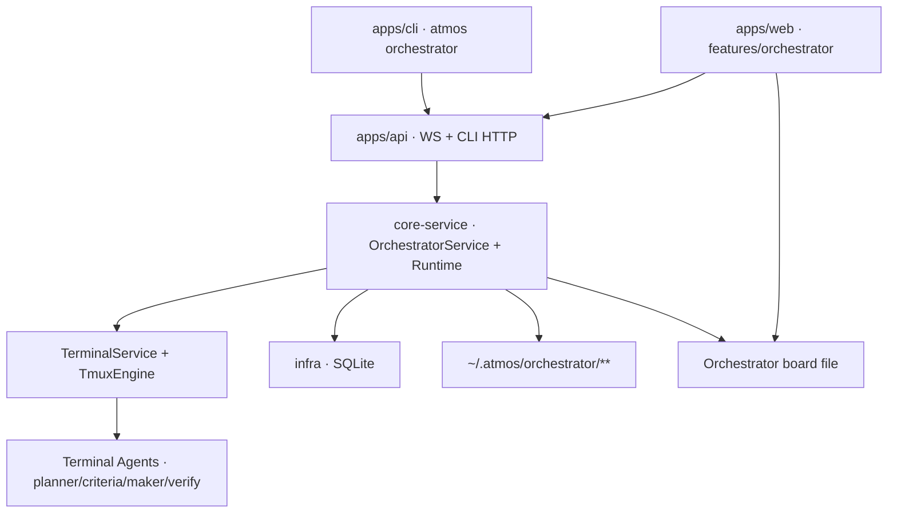

# TECH · APP-048: Orchestrator (Loop / Graph Agent Orchestration)

> Technical Design · HOW. Implements [PRD APP-048](./PRD.md). Addresses **M1–M26**, **M3b**, **M6b**, **M8b**, **M11b**, **M14b**, **M16b**, **M17b**, **M18b**, **M19b**, **M22b**. Nice-to-haves **N1–N9** deferred unless noted.
>
> **Post-review revision**: auto-topology, role_invoke I/O, mid-flight budgets, join completeness, Spec integrity, work state, chrome scan fields, Phase-1 Graph bar.

## Scope summary

First-class **Orchestrator** on the connected Atmos Computer:

- Dedicated UI + board (Canvas **engine** reuse; **separate** document namespace).
- Durable Run / Judgment Spec / Evidence / Verdict (SQLite + `~/.atmos/orchestrator/`).
- **Runtime** enforces mode, Spec, budgets (mid-flight), join completeness, maker≠checker tiers, artifact contracts.
- **Loop** + **Graph** peer executors; Graph Phase-1 bar = sequence + verify + join fail-closed (hang/missing).
- All intelligent roles = **Terminal Agents** (not `crates/llm` providers).
- WS-first UI; HTTP for CLI.

Out of scope: APP-017 scheduling, ACP mesh, multi-Computer runs, auto-resume after process death, nested Loop-in-Graph, token FinOps.

---

## Architecture overview



| Layer | Responsibility |
|-------|----------------|
| `crates/infra` | run/spec/verdict/evidence tables + repos |
| `crates/core-engine` | tmux capture/send helpers |
| `crates/core-service` | OrchestratorService, Runtime, Loop/Graph, role_invoke, sensors, Spec |
| `apps/api` | WsAction/Event, CLI HTTP |
| `apps/web` | orchestrator feature, chrome, layout intents |
| `apps/cli` + `skills/atmos-orchestrator` | agent-facing ops |

**Not used**: ACP `/ws/agent` as worker path; `crates/llm` generate_text for planner/criteria/verify.

---

## Product decisions resolved in TECH

| Topic | Decision |
|-------|----------|
| Navigation | Management Center **Orchestrator** + `/orchestrator` (+ project-scoped deep link OK) |
| Board storage | `~/.atmos/orchestrator/boards/{id}.atmos.tldr`, schema `atmos-orchestrator-board.1` — never ordinary canvas dir |
| Intelligence | Terminal Agents only; forced `loop\|graph` **skips planner** (M17b) |
| Auto topology (M6b) | `ModeProposal.graph` or diamond expand; compile fail → effective mode Loop + reason |
| Run home cwd | All roles default cwd = run binding (workspace path / project root / standalone dir). Never random. |
| Child workspace | Opt-in via CLI/Runtime: create under Project with `create_source = "orchestrator"`, link `run_id`; merge or abandon APIs |
| Parallel makers | Default **forbid** multi-maker write on **home** worktree without child isolation + merge/verify node; compile fails |
| Spec confirm | Human / high-critical / required llm_judge / **weaken** → user confirm; auto only all-required sensors + low/medium |
| Spec churn | `max_spec_versions=3`; weaken needs confirm |
| Budgets M1 | `max_iterations=8`, `max_wall_ms=45m`, `max_maker_invocations=12`; **mid-flight wall watchdog**; tokens deferred |
| No-progress | `progress_key = hash(sorted failing criterion_ids + sensor exit signatures)` × 3 ticks → `failed` + `no_progress` |
| Pause | N3 only; M1 cancel |
| Graph Phase-1 | Executor: sequence, verify fresh, join completeness; UI: linear run strip + optional thin topology |
| Nested Loop-in-Graph | Out of M1 |
| Join | All required inbound terminal; hang/timeout → fail; expected count |
| role_invoke | File-only accept (atomic rename); timeouts; one repair; no fence-as-sole-accept |
| Independence | Tier B prefer distinct verify agent when ≥2 installed |
| Carry Spec | `carry_from_run_id` may reuse Spec if goal unchanged + user confirm |
| CLI | HTTP like APP-015 |

---

## PRD coverage map

| PRD | TECH |
|-----|------|
| M1–M3c | routes, board, run home cwd, child workspace lifecycle, empty state |
| M4–M6b | mode lock, ModeProposal + graph, demote Loop |
| M7–M8b | LoopEngine, GraphEngine, compile, isolation rules |
| M9 | reject set_mode when running; carry_from |
| M10–M15, M11b, M14b | criteria, Spec schema, integrity, churn |
| M16–M16b | Runtime, budgets, tiers |
| M17–M19b | terminal roles, skip planner, no ACP/llm brain |
| M18b | chrome composition |
| M20–M25, M22b | run model, layout intents, cancel |
| M26 | § Agent-facing CLI & Skill + **workspace** verbs; skill-dir; context get includes home/children |

---

## Module-by-module design

### crates/infra

Migration e.g. `m20260731_000034_create_orchestrator_tables.rs`:

- `orchestrator_run` — goal, requested/effective mode, status, stop_reason, **target_kind, project_guid, workspace_guid (home)**, board_id, locked_spec_*, mode_reason, budget_json, graph_json, carry_from, artifact_dir, agent ids, timestamps
- `orchestrator_run_workspace` — run_id, workspace_guid, kind home|child, purpose, status active|merged|abandoned, base_ref, path cache, created_at
- `orchestrator_role_binding` — run_id, role?, node_id?, workspace_guid (active cwd bind)
- `orchestrator_judgment_spec` — run_id, version, risk_tier, requires_user_confirm, confirmed_*, body_path, created_at
- `orchestrator_verdict` — run_id, spec version, iteration/node_id, result, criterion_results_json, summary
- `orchestrator_evidence` — run_id, verdict_id?, kind, path, meta_json

Repo: data-only CRUD + status transitions with optimistic checks.

### crates/core-engine

Reuse tmux send/capture/window env. Env always:

`ATMOS_PANE_ID`, `ATMOS_ORCH_RUN_ID`, `ATMOS_ORCH_ROLE=orchestrator|criteria|maker|verify`, optional `ATMOS_ORCH_NODE_ID`.

### crates/llm

**Out of brain path.** Do not call `llm::generate_text` / feature providers for propose_mode, draft_spec, or judge. AgentCli spawn code in `llm_text_generation.rs` may be **referenced** only as process-launch pattern for Terminal Agents.

### crates/core-service

```
service/orchestrator/
  mod.rs runtime.rs loop_engine.rs graph_engine.rs graph_compile.rs
  criteria.rs role_invoke.rs sensors.rs agents_resolve.rs
  artifacts.rs work_state.rs board.rs events.rs schemas.rs integrity.rs
```

```rust
pub struct OrchestratorService {
    db: Arc<DatabaseConnection>,
    terminal_service: Arc<TerminalService>,
    workspace_service: Arc<WorkspaceService>,
    tmux: TmuxEngine,
    event_tx: broadcast::Sender<OrchestratorEvent>,
}
```

#### Terminal roles

| Role | env | UI label | Artifact |
|------|-----|----------|----------|
| planner | `orchestrator` | **Planner** | `mode_proposal.json` |
| criteria | `criteria` | Criteria | `specs/v{n}.json` |
| maker | `maker` | Maker | side effects + work_state |
| verify | `verify` | Verify | verdicts / judge JSON |

#### role_invoke contract (P0)

1. Resolve agent for role (run override → defaults → maker fallback; verify prefers non-maker if Tier B).
2. Write prompt under `runs/{id}/prompts/{role}-{invocation_id}.md`.
3. Launch non-interactive if capable; else visible pane with `orchRole` meta.
4. **Accept only** final artifact path after **atomic publish**: write `*.json.tmp` → validate schema → `rename` to final.
5. **Do not** accept JSON fence/stdout as sole success path in M1 (optional: use as repair input only).
6. Timeouts (defaults): planner/criteria **120s**; maker **idle/wall per budget**; verify **180s** (knobs overridable).
7. Invalid → one repair re-invoke → then `worker_failed` / `artifact_invalid`.
8. **Done rule (locked)**: accept when **(a)** final artifact validates **and** **(b)** process has exited with code 0 **or** a sibling `role.done` file exists with `{"ok":true,"artifact":"<relative-path>"}` written **after** the final artifact rename. Prefer file+exit; `role.done` supports long-lived interactive panes that cannot exit.

#### Runtime rules

| Rule | Behavior |
|------|----------|
| Mode lock | User loop/graph → skip planner; auto → require valid ModeProposal |
| Auto graph | mode=graph requires compilable graph in proposal or template expand; else demote Loop |
| Spec start | start_run needs locked Spec |
| Complete | all required acceptance pass ∧ no rejection ∧ no blocked_human ∧ no unverified required |
| Confidence ban | no maker self-pass |
| Spec write | maker cannot update Spec; FS deny maker write to `specs/`, `verdicts/` |
| Sensor integrity | `integrity.rs` watches Spec-declared paths; unauthorized mutation → fail closed |
| Verify | new window, role=verify, adversarial system prompt; Tier B agent pick |
| criteria_gap | set `refining_spec`; **park/cancel active makers**; Criteria only; weaken → confirm |
| Human block | `blocked_human`; park makers |
| Cancel | flag → interrupt all run panes → wait ≤5s → force kill → `cancelled` |
| Wall budget | pre-dispatch **and** watchdog timer cancels roles mid-flight |
| Maker budget | each maker start counts; fan-out included |
| Join | see Graph |
| Restart | any `running` → `interrupted` + orphan pane reclaim by `ATMOS_ORCH_RUN_ID` |
| No-progress | progress_key ×3 → `failed`+`no_progress` |

#### LoopEngine

```
tick:
  budget/cancel checks
  dispatch maker (work_state + Spec summary + last feedback)
  wait (idle timeout / wall)
  update work_state.json
  run sensors (required) → optional llm_judge → human gates
  verdict (pass|fail|criteria_gap|blocked_human|unverified)
  branch
```

#### GraphEngine + compile

**Compile fail-closed if:**

- executable edge missing kind or endpoints
- cycle without `max_cycles ≥ 1`
- no entry / unreachable required nodes (fail M1)
- multi-maker **write** nodes same worktree without isolation flag
- exceeds max_nodes / max_fanout (defaults e.g. 32 nodes / fanout 4)
- graph empty when mode=graph

**Join readiness:**

```
required_preds = control inbounds where required=true (default true)
all terminal ∈ {succeeded, failed, cancelled, timed_out, skipped}
if any required failed|cancelled|timed_out → join failed
if any required still running past node_timeout → join failed (not silent partial)
if expected_count != observed terminal → fail
reduce/synthesize only after join success
```

Node kinds: `maker | sensor | verify | reduce | human | join` (join may be implicit multi-inbound—document one approach and stick to it; prefer explicit `join` for clarity).

**Isolation & cwd:**

- Default `cwd` for every role = **run home path** resolved from binding.
- Graph `maker` with `writes: true` (default) and concurrent peers → require `isolation: "worktree"` and a bound `workspace_guid` (child) **or** compile error.
- Planner/Criteria/Verify usually stay on **home** unless explicitly bound to a child (e.g. verify child branch before merge).
- Child create uses `WorkspaceService` with `create_source = "orchestrator"` (mirror APP-017 automation source labeling).

#### Work state

`work_state.json` + `attempts/v{n}.md`: files touched, commands, last fail summary, git head. Loop makers read; parallel makers get **partitioned** slices; verify gets Spec + evidence **not** maker chat transcripts.

#### Sensors

```rust
enum SensorKind {
  Command { argv: Vec<String>, cwd: PathBuf, pass_exit_codes: Vec<i32>, timeout_ms: u64 },
  FileExists { path: PathBuf },
  FileRegex { path: PathBuf, pattern: String },
  GitDiffStat { /* optional */ },
}
```

Default sensor `timeout_ms=120_000`. No shell string concat. Capture truncated stdout/stderr to evidence.

#### Independence resolver

```
if risk high/critical → Tier C rules
else if count_installed_agents >= 2 → prefer verify_agent != maker_agent
else Tier A only + UI badge "same agent as maker"
```

### apps/api

**WsAction:** OrchestratorRunCreate/Get/List/Cancel/Start, ProposeMode, DraftSpec, ConfirmSpec, UpdateSpecDraft, HumanVerdict, AttachEvidence, BoardGet, AgentCapabilities.

**WsEvent:** RunUpdated, SpecUpdated, VerdictRecorded, NodeUpdated, EvidenceAttached, RoleActivityUpdated.

**HTTP CLI:** full path table in § Agent-facing CLI & Skill below (not a vague `/*`).

Idempotency: start/confirm should be safe to retry (status checks).

### apps/web

```
features/orchestrator/
  components/  Entry, RunView, SpecCard, ModePicker, RunHeader,
               RunStrip, HitlStrip, Board, TerminalCard, RoleChrome,
               CopyAgentInstructions  # M26 / APP-015-style clipboard
  hooks/ store/ lib/ (chrome composition, layout intent)
```

**Layout intents** implement PRD M22. **Running graph**: lock palette.  
**Copy agent instructions** (Must): same product duty as APP-015 M19 — clipboard = short prompt + skill dir (not full SKILL body).

**Chrome composition** (pure helper unit-tested):

```
scan line: [RoleGlyph][RoleShort] [ActivityIcon] [Agent] [Instance]
tooltip: full role + goal + run id
```

i18n: `orchestrator.role.planner|criteria|maker|verify` + `*.short` + activity strings (en/zh).

---

## Agent-facing CLI & Skill (M26) — full design

This is how **Terminal Agents and operators** drive Orchestrator without inventing protocols. Pattern mirrors **APP-015** (skill progressive disclosure + intent-level CLI + HTTP to API). UI remains WS-first; agents do **not** open `/ws` for orchestration.

### Mental model for agents

```text
User / outer agent
    │  (optional) atmos orchestrator skill-dir → read SKILL.md
    ▼
atmos orchestrator <verb>     ──HTTP──►  apps/api /api/orchestrator/v1/*
    │                                      │
    │                                      ▼
    │                               OrchestratorService + Runtime
    │                                      │
    │                         spawn role panes (planner/criteria/maker/verify)
    │                                      │
    └──── ground truth: run artifacts under
         ~/.atmos/orchestrator/runs/{run_id}/
         (mode_proposal, specs, evidence, verdicts, work_state)
```

| Channel | Who | Purpose |
|---------|-----|---------|
| **CLI HTTP** | Any terminal agent / shell | Create/inspect/control runs; draft/confirm Spec; attach evidence; compile graph |
| **WS** | Browser Orchestrator UI only | Live RunUpdated / NodeUpdated / chrome |
| **Role artifacts** | Planner/Criteria/Maker/Verify panes | Structured I/O Runtime trusts (not free-form chat) |
| **ACP / crates/llm** | — | **Not** used for Orchestrator brain/workers |

**Who owns the outer reply loop:** the **user’s Terminal Agent session** (or human) that called CLI remains the conversation owner. Orchestrator roles are **delegated workers** with bounded contracts—not decentralized handoffs that steal the chat (OpenAI manager/tools pattern). Runtime owns lifecycle/stop; agents propose artifacts only.

**Tick is Runtime-owned:** agents do **not** call a public `tick` verb every loop. After `run start`, the server runner drives LoopEngine/GraphEngine. Agents may `run get` / `events` / read artifacts to observe. (Internal test hooks may expose tick; not agent-facing M1.)

### Skill package: `skills/atmos-orchestrator/`

System skill (sync like canvas): `skills/system-skills-manifest.json` + `~/.atmos/skills/.system/atmos-orchestrator/`.

```text
skills/atmos-orchestrator/
  SKILL.md                         # progressive: when/how, default workflows, compact verb table, anti-patterns
  references/
    command-reference.md           # full flags, HTTP map, error codes, --json shapes
    schemas.md                     # ModeProposal, JudgmentSpec, Verdict, role.done (link TECH types)
    roles-and-artifacts.md         # env, pane chrome, who may write what, fresh verify
    workspace-isolation.md         # home cwd, create/use/merge/abandon, when to isolate
    workflows.md                   # create→spec→start Loop; Graph path; HITL; criteria_gap; isolate-merge
    anti-patterns.md               # PRD forbidden list in agent-facing language
```

**Progressive disclosure (industry + APP-015):**

1. Startup: only skill name/description (~100 tokens).
2. When user/agent needs Orchestrator: load `SKILL.md` via skill-dir path.
3. Load `references/*` only when needed (schemas, full flags, Graph).

**SKILL.md must teach (not optional):**

- Prerequisites: `atmos` on PATH; local API up; auth like other CLI; **run home Project/Workspace**.
- Decision tree: babysit one agent vs create Orchestrator run; Loop vs Graph; never invent Spec.
- **Cwd rules**: always start from run home; use `workspace create` only when isolation is justified; merge/abandon before treating work as done on home.
- Default workflow: create run (bound to workspace) → draft Spec → start → poll get → cancel if needed.
- Isolation workflow: detect need → `workspace create` → `workspace use` for role/step → work → `workspace merge` or `abandon`.
- Verb table (below) including **workspace** verbs.
- Role boundaries: maker cannot write Spec; verify fresh context; sensors-first.
- Context acquisition: `context get` (home + children + active cwd), artifact paths, `work_state.json`.
- Spawn: Runtime spawns roles into bound cwd; agents should **not** freestyle multi-tmux meshes or orphan worktrees.
- Errors + recovery.
- Reporting: run id, mode, Spec version, stop_reason, workspace_guids, evidence paths.

### Discoverability

| Affordance | Behavior |
|------------|----------|
| `atmos orchestrator skill-dir` | Local only (no HTTP). Print skill install dir + one-line prompt to read `SKILL.md` (canvas pattern). Alias: `skill-path`. |
| Orchestrator UI “Copy agent instructions” | Clipboard: brief prompt + skill directory path (APP-015 M19 equivalent). **Must** for M26 product parity. |
| System skill sync | API startup installs under `~/.atmos/skills/.system/atmos-orchestrator/`. |

Clipboard prompt template (exact string in impl TECH polish; intent):

```text
Read the Atmos Orchestrator skill in this directory and use `atmos orchestrator` to manage multi-step runs (Loop/Graph), Judgment Specs, and evidence. Do not invent completion without Spec + sensors.
<absolute skill dir>
```

### CLI command tree

```text
atmos orchestrator
  skill-dir | skill-path          # local
  status                          # API health + orchestrator capability summary
  run create | list | get | start | cancel | watch?
  spec draft | get | confirm | update
  evidence attach | list
  graph compile | get
  context get                     # compact context bundle for agents
  agents list                     # eligible terminal agents for roles
  workspace get | list | create | use | merge | abandon
```

Global flags (align canvas/CLI): `--api-url`, auth token env, `--json` machine output, `--timeout-ms`.

#### Verb contracts (agent-facing)

| Verb | HTTP | Purpose | Key flags / body |
|------|------|---------|------------------|
| `skill-dir` | *(none)* | Print skill path + prompt | — |
| `status` | `GET /api/orchestrator/v1/status` | API up, feature enabled, defaults | — |
| `run create` | `POST /api/orchestrator/v1/runs` | Create draft run | `--goal`, `--mode auto\|loop\|graph`, **`--project` / `--workspace` / `--standalone` (home)**, `--budget-*`, role agent ids, `--carry-from` |
| `run list` | `GET /api/orchestrator/v1/runs` | History | `--limit`, `--status` |
| `run get` | `GET /api/orchestrator/v1/runs/{id}` | Full detail + artifact paths + workspace bindings | `--run` |
| `run start` | `POST .../runs/{id}/start` | Lock mode+Spec and start runner | `--run` |
| `run cancel` | `POST .../runs/{id}/cancel` | Cancel | `--run` |
| `spec draft` | `POST .../runs/{id}/spec/draft` | Invoke Criteria role **in home cwd** | `--run` |
| `spec get` | `GET .../runs/{id}/spec` | Current Spec body | `--run`, `--version` |
| `spec confirm` | `POST .../runs/{id}/spec/confirm` | User/agent confirm locked draft | `--run`, `--version` |
| `spec update` | `PATCH .../runs/{id}/spec` | Human/agent edit **pre-lock** body | `--run`, `--file` JSON |
| `evidence attach` | `POST .../runs/{id}/evidence` | Attach file/meta | `--run`, `--file`, `--kind`, `--criterion` |
| `evidence list` | `GET .../runs/{id}/evidence` | List evidence | `--run` |
| `graph compile` | `POST .../runs/{id}/graph/compile` | Validate/store graph | `--run`, `--file` optional |
| `graph get` | `GET .../runs/{id}/graph` | Compiled graph | `--run` |
| `context get` | `GET .../runs/{id}/context` | **Agent context pack** (home + children + active cwd) | `--run`, optional `--role` / `--node` |
| `agents list` | `GET .../agents` | Role-eligible agents | — |
| `workspace get` | `GET .../runs/{id}/workspace` | Home + active binding for role/node | `--run`, `--role?`, `--node?` |
| `workspace list` | `GET .../runs/{id}/workspaces` | Home + all child workspaces for run | `--run` |
| `workspace create` | `POST .../runs/{id}/workspaces` | Create isolated child under Project | `--run`, `--purpose`, `--base-branch?`, `--name?` |
| `workspace use` | `POST .../runs/{id}/workspace/use` | Bind role/node/next-step to workspace | `--run`, `--workspace`, `--role?`, `--node?` |
| `workspace merge` | `POST .../runs/{id}/workspaces/{ws}/merge` | Merge/promote child → home (or base) | `--run`, `--workspace`, `--strategy?` |
| `workspace abandon` | `POST .../runs/{id}/workspaces/{ws}/abandon` | Discard child isolation | `--run`, `--workspace` |

**Not public M1:** `tick`, `set-mode` after start (mode change = new run). Optional `run watch` streams events via HTTP SSE or poll—if deferred, agents poll `run get` every N seconds (document N=2–5s).

#### Response shape (`--json`)

```ts
// success
{ "ok": true, "data": { /* RunDetail | Spec | ... */ } }
// error
{ "ok": false, "error": { "code": "ORCH_*", "message": string, "hint"?: string, "run_id"?: string } }
```

Exit codes: `0` ok; `1` generic; `2` usage; `3` auth; `4` not found; `5` conflict (e.g. start without Spec); `6` validation (graph compile, Spec schema).

#### Error codes (skill table)

| Code | Meaning | Agent recovery |
|------|---------|----------------|
| `ORCH_API_OFFLINE` | Cannot reach API | Start local Atmos / check `--api-url` |
| `ORCH_UNAUTHORIZED` | Auth failed | Fix CLI token |
| `ORCH_NOT_FOUND` | Bad run id | `run list` |
| `ORCH_SPEC_REQUIRED` | Start without Spec | `spec draft` / confirm |
| `ORCH_SPEC_CONFIRM_REQUIRED` | High risk / human / weaken | User confirm or `spec confirm` after review |
| `ORCH_MODE_LOCKED` | Illegal mode change | `run create --carry-from` |
| `ORCH_GRAPH_COMPILE_FAILED` | Fake/bad edges | Fix graph or use `--mode loop` |
| `ORCH_BUDGET` | Wall/iter/makers | `run get` stop_reason; new run |
| `ORCH_FORBIDDEN_ROLE_WRITE` | Maker tried Spec write | Use criteria path only |
| `ORCH_ARTIFACT_INVALID` | Role JSON failed | Read skill schemas; re-draft |
| `ORCH_WORKSPACE_REQUIRED` | Isolation needed but no Project | Bind project or use home-only mode |
| `ORCH_WORKSPACE_NOT_CHILD` | Merge target not run-linked | `workspace list` |
| `ORCH_MERGE_CONFLICT` | Merge failed | Report paths; user/agent resolve then retry |
| `ORCH_CWD_FORBIDDEN` | Role cwd outside home/children | `workspace use` valid id |

### Context acquisition (`context get`)

Agents must not guess. `context get` returns a compact bundle:

```ts
{
  run_id, status, requested_mode, mode, mode_reason, stop_reason?,
  goal,
  home: {
    target_kind: "project" | "workspace" | "standalone",
    project_guid?, workspace_guid?, cwd: string  // absolute path — default for all roles
  },
  workspaces: Array<{
    workspace_guid, path, kind: "home" | "child",
    create_source?: "orchestrator", purpose?, status: "active" | "merged" | "abandoned"
  }>,
  active_bindings: Array<{ role?, node_id?, workspace_guid, cwd }>,
  spec: { version, path, risk_tier, requires_user_confirm, summary },
  budget: Budget & { remaining_wall_ms?, iterations_used? },
  artifacts: { root, mode_proposal?, work_state?, specs_glob, evidence_glob },
  roles_active: Array<{ role, agent_id, activity, pane_hint?, cwd }>,
  last_verdict?: { result, summary, criterion_ids },
  graph?: { entry, node_count, compile_ok },
  skill_dir_hint: string
}
```

Also document: agents can **read files** under `artifacts.root` with ordinary tools; Runtime is source of truth for status.

### Workspace lifecycle (M3c) — service design

```text
Run home (user-selected Project / Workspace / standalone)
    │
    ├─ role default cwd ──────────────────────────► home.cwd
    │
    └─ workspace create (task needs isolation)
           │  WorkspaceService.create(... create_source="orchestrator",
           │    metadata: { orch_run_id, purpose })
           ▼
       child workspace (worktree path)
           │
           ├─ workspace use --role maker --node N
           │     role_invoke launches with cwd=child.path
           ▼
       workspace merge  ──► home (or base branch) + child status=merged
         or abandon     ──► child status=abandoned (no silent leave-behind)
```

**Rules:**

1. `workspace create` requires run `target_kind` of `project` or `workspace` with resolvable `project_guid`. Standalone runs may only create dirs under the run artifact tree (not full Atmos Workspace)—document as limited isolation.
2. Child rows stored in SQLite: `orchestrator_run_workspace` (`run_id`, `workspace_guid`, `kind`, `purpose`, `status`, `base_ref`, timestamps).
3. `role_invoke` resolves cwd: binding for (run, role, node) → else home.cwd.
4. Sensors default to **active maker cwd** when judging that maker’s work; Spec may pin sensor cwd to `home` for integration tests after merge.
5. Merge strategy M1: reuse existing git/workspace merge primitives where possible (fast-forward / open PR / apply patch—exact strategy enum in impl; product requires **explicit user-visible success/fail**).
6. On run `cancel` / `abandon` all open children: do **not** auto-delete worktrees without policy; mark abandoned and surface in UI for cleanup (retention Nice later).

### Spawn & delegation (what agents teach)

Skill text (normative):

1. **Prefer** `run create --workspace …` (or project) so **home cwd** is the user’s place of work.
2. **Prefer** Runtime-spawned roles over manually opening random terminals; cwd always home or bound child.
3. When Runtime starts a role, it sets env, prompt file, and **cwd**; worker produces contracted artifact only.
4. **When to isolate (task judgment):** parallel writers; destructive/experimental changes; branch-per-feature before merge. Then: `workspace create` → `workspace use` → work → `workspace merge` | `abandon`.
5. **When not to isolate:** simple linear fix, Spec sensors on home tree, Criteria/Planner by default.
6. **Delegation contract** (planner graph units): objective, output schema, boundaries, `isolation` + optional `workspace_guid`.
7. **Verify** must not receive maker chat; only Spec + evidence; often on **home** after merge, or on child if verifying branch before merge (explicit bind).
8. **Maker** reads `context get` / `work_state.json` + Spec path; never edits `specs/`.
9. Do not `git worktree add` outside Orchestrator CLI—untracked orphans are forbidden.

### Interaction loops (agent playbooks)

**A. Outer agent helps user set up a run**

```text
skill-dir → read SKILL.md
run create --goal "…" --mode auto --workspace <user workspace>
context get   # confirm home.cwd
spec draft    # Criteria runs in home.cwd
spec get / confirm as needed
run start
loop: run get / context get until terminal status
if need isolation mid-task:
  workspace create --purpose "…"
  workspace use --role maker
  # Runtime next maker tick uses child cwd
  … later workspace merge or abandon
if blocked_human: tell user
if failed: report stop_reason + evidence + workspace list
```

**B. Role worker (prompt injected by Runtime)** — not free-form CLI invent:

```text
Read prompt file + schemas.md
Write only contracted artifact via atomic rename
Exit 0 (or write role.done)
```

**C. HITL**

Human uses UI; agents may `run get` and must not invent `spec_met`.

### HTTP API table (authoritative for CLI)

Base: `/api/orchestrator/v1`  
Auth: same CLI bearer as `atmos canvas` / existing atmos CLI.

| Method | Path | Notes |
|--------|------|-------|
| GET | `/status` | |
| GET | `/agents` | |
| POST | `/runs` | create |
| GET | `/runs` | list query |
| GET | `/runs/{id}` | |
| POST | `/runs/{id}/start` | |
| POST | `/runs/{id}/cancel` | |
| GET | `/runs/{id}/context` | |
| POST | `/runs/{id}/spec/draft` | |
| GET | `/runs/{id}/spec` | |
| POST | `/runs/{id}/spec/confirm` | |
| PATCH | `/runs/{id}/spec` | draft only |
| POST | `/runs/{id}/evidence` | multipart or path ref |
| GET | `/runs/{id}/evidence` | |
| POST | `/runs/{id}/graph/compile` | |
| GET | `/runs/{id}/graph` | |
| GET | `/runs/{id}/workspace` | home + active |
| GET | `/runs/{id}/workspaces` | list children |
| POST | `/runs/{id}/workspaces` | create child |
| POST | `/runs/{id}/workspace/use` | bind role/node |
| POST | `/runs/{id}/workspaces/{ws}/merge` | |
| POST | `/runs/{id}/workspaces/{ws}/abandon` | |

Timeouts: default CLI 120s; `spec draft` / role-heavy / merge ops may use 180–300s (`--timeout-ms`).

### Relation to ordinary Canvas skill

- `atmos canvas` remains for **diagrams / ordinary boards**.
- Orchestrator agents should **not** simulate Loop/Graph via canvas document scripts.
- Cross-link in both skills: “multi-step agent runs → Orchestrator; free-form diagrams → Canvas.”

---

## Data model

```ts
type OrchMode = "auto" | "loop" | "graph";
type EffectiveMode = "loop" | "graph";

type RunStatus =
  | "drafting_spec"
  | "awaiting_spec_confirm"
  | "running"
  | "blocked_human"
  | "refining_spec"
  | "completed"
  | "failed"
  | "cancelled"
  | "interrupted";

type StopReason =
  | "spec_met"
  | "budget_iterations"
  | "budget_wall"
  | "budget_makers"
  | "no_progress"
  | "user_cancel"
  | "criteria_unsatisfiable"
  | "graph_compile_failed"
  | "worker_failed"
  | "artifact_invalid"
  | "join_incomplete"
  | "interrupted_environment";

type RoleActivity =
  | "queued" | "active" | "waiting_user" | "succeeded" | "failed" | "cancelled";

interface Budget {
  max_iterations: number;        // 8
  max_wall_ms: number;           // 2_700_000
  max_maker_invocations: number; // 12
  max_spec_versions: number;     // 3
}

interface ModeProposal {
  mode: EffectiveMode;
  reason: string;
  plan_complexity: "low" | "high";
  topology_hint?: "linear" | "diamond" | "custom";
  /** Required when mode=graph unless diamond template can expand from named_units */
  graph?: CompiledGraph;
  named_units?: string[];
}

interface Criterion {
  id: string;
  description: string;
  kind: "sensor" | "llm_judge" | "human";
  required: boolean;
  sensor?: SensorSpec;
  falsify?: string;
  evidence_required?: string[];
  immutable_paths?: string[];  // sensor integrity
  sole_source?: "sensor" | "llm_judge" | "human";
}

interface JudgmentSpecBody {
  goal_summary: string;
  risk_tier: "low" | "medium" | "high" | "critical";
  acceptance: Criterion[];
  rejection: Criterion[];
  judgment_order: Array<"sensor" | "llm_judge" | "human">;
}

type VerdictResult =
  | "pass" | "fail" | "criteria_gap" | "blocked_human" | "unverified";

interface GraphNode {
  id: string;
  kind: "maker" | "sensor" | "verify" | "reduce" | "human" | "join";
  label: string;
  shape_id?: string;
  agent_id?: string;
  fresh_context?: boolean; // verify default true
  writes?: boolean;        // maker default true
  isolation?: "none" | "worktree";
  node_timeout_ms?: number;
}

interface GraphEdge {
  id: string;
  from: string;
  to: string;
  kind: "control" | "data";
  required?: boolean; // default true for control
  max_cycles?: number;
}
```

**Artifacts**

```text
~/.atmos/orchestrator/
  boards/{board_id}.atmos.tldr
  runs/{run_id}/
    run.json
    events.jsonl
    mode_proposal.json
    work_state.json
    attempts/v{n}.md
    specs/v{n}.json
    graph.compiled.json
    prompts/...
    nodes/{node_id}/...          # per-node isolation
    roles/{role}/{inv_id}/...    # optional alternate
    evidence/...
    verdicts/...
```

---

## Transport

WS payloads include agent ids:

```ts
OrchestratorRunCreate: {
  goal, requested_mode, target_kind, project_guid?, workspace_guid?,
  budget?, carry_from_run_id?,
  maker_agent_id?, planner_agent_id?, criteria_agent_id?, verify_agent_id?
}
```

Events include `orchRole`, `nodeId?`, `activity` for chrome.

---

## Security & permissions

- Local Computer only.
- Sensor argv structured; deny dangerous patterns.
- Maker cannot write Spec/verdict dirs; integrity on sensor paths.
- Evidence under run dir; path traversal rejected.
- No secrets in info logs.

---

## Terminal role chrome (M18b)

Pane meta:

```ts
{ orchRunId, orchRole, orchNodeId?, orchInstanceLabel?, activity: RoleActivity }
```

Composition rules: Role glyph+short, Activity icon, Agent, Instance (mandatory if duplicate role). Accents optional; glyph required for a11y. Truncation priority: Role → Activity → Agent → Instance → goal.

Ephemeral: after planner/criteria success, UI may collapse panes to Roles rail (M22b).

---

## Board / layout

| Intent | Primary | Secondary |
|--------|---------|-----------|
| Setup | Spec + mode + agents | empty board |
| Run Loop | Maker + iteration | Spec mini |
| Run Graph | **RunStrip** + active terminal | topology minimap |
| HITL | HitlStrip | dim PTYs |
| Review | Evidence + Spec + stop | collapsed PTYs |

Running: graph edit locked. Draft: orch-flow-node + executable edges only; no product widgets.

---

## Background runner

One runner per `run_id`. Wall watchdog task. On cancel/interrupt: multi-pane kill hygiene. Server restart: reclaim orphans, mark interrupted—**no auto-resume**.

---

## Rollout plan

1. Infra + repos  
2. Runtime pure logic (complete gate, budgets, no-progress, join, compile, demote Loop)  
3. Artifacts + integrity + atomic role_invoke fixtures  
4. LoopEngine service tests  
5. GraphEngine sequence/verify/join tests (M8b bar)  
6. Terminal spawn + orchRole meta + chrome unit tests  
7. WS + web entry/RunView/Spec/RunStrip/Hitl  
8. Layout intents + running lock  
9. CLI full verb set + HTTP handlers + skill package (`SKILL.md` + references) + skill-dir + UI Copy agent instructions  
10. Dogfood flag / polish / i18n  

---

## Risks & tradeoffs

| Item | Mitigation |
|------|------------|
| Terminal Agent JSON flake | atomic files + timeouts + one repair |
| Mid-flight cost | wall watchdog |
| Parallel write | compile forbid shared-tree multi-writer |
| Ceremony | skip planner on forced mode; sensor auto-confirm |
| Same-agent judge | Tier B/C |
| Rollback | flag off; no canvas writes |

**Explicit non-goals M1:** auto-resume, token ledger, arbitrary multi-Computer workspaces.  
**In M1:** run home cwd for all roles + **child workspace create / use / merge / abandon** via CLI+Runtime (not free-form orphan worktrees).

---

## Dependencies

APP-014/015 patterns, APP-002 tmux, terminal agent manifests, APP-017 agent invocation patterns. Orthogonal: ACP, crates/llm features.

---

## Open questions

- [ ] Exact max focused PTY count (propose 2).  
- [ ] Default planner/criteria agent = maker vs last-used.  
- [ ] Merge strategy enum defaults (ff-only vs merge commit vs open PR) — product default propose **merge commit or existing workspace merge path**.

---

## Appendix · Forbidden → enforcement

| Forbidden | Enforcement |
|-----------|-------------|
| Maker self-done | Verdict pipeline only |
| Maker edits Spec | API + FS |
| Soften Spec w/o confirm | Spec diff weaken detector |
| Unverified complete | VerdictResult + complete gate |
| LLM sole-pass sensor clause | schema sole_source + Runtime |
| Edit grader files | integrity.rs |
| Shared-context-only verify | new pane + prompt |
| Silent join / partial | join completeness |
| Multi-writer same tree | compile |
| Auto empty graph | M6b demote |
| ACP / llm brain | architecture tests |
| Role-less chrome | UI composition tests |
