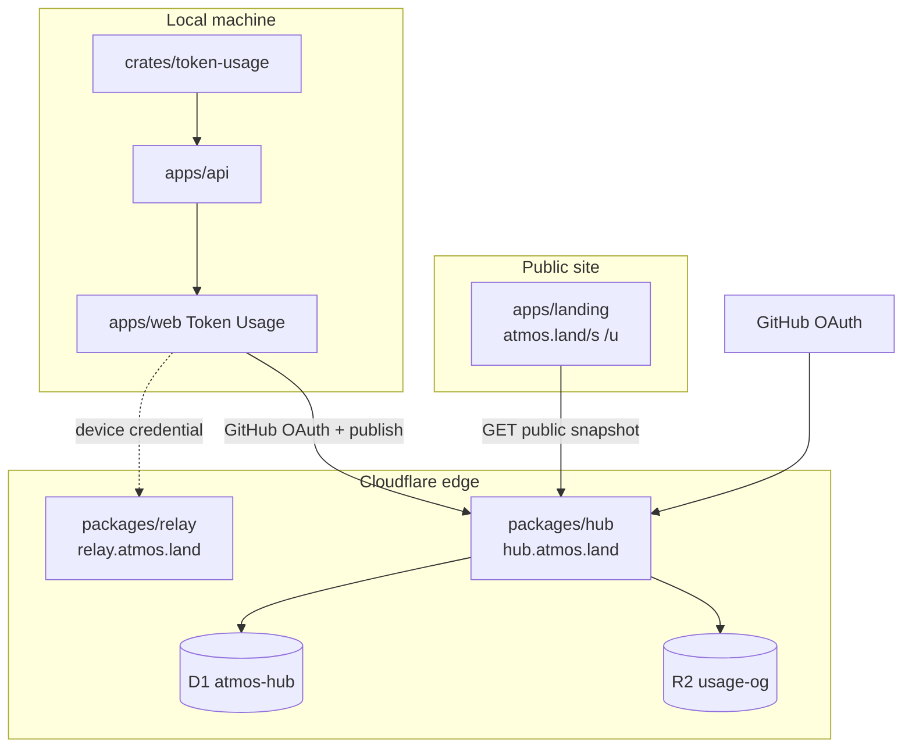

# TECH · APP-056: Usage Share, Users & Devices

> Technical Design · HOW. Implements PRD APP-056 Phase 1 (accounts + snapshot share) and defines the Phase 2 ownership seam without implementing full Computer migration in Phase 1.

## Scope summary

| In Phase 1 | Out of Phase 1 (later) |
|------------|------------------------|
| `packages/hub` + Better Auth + Drizzle + D1 + optional R2 | Email magic link / more OAuth providers |
| GitHub **and** Google social login | Continuous multi-device usage rollup |
| Device mint / rotate / revoke via Hub session | Server-side OG canvas render |
| Relay: user-owned Computers; device credential Bearer | Leaderboards / year-in-review |
| Snapshot publish + public `/s/:id`, `/u/:handle` | Org/team accounts |
| Web Token Usage “Publish page” + Settings devices UI | Hosted sandbox compute |

This spec **does** change Relay **identity** (user_id + device credentials) but **does not** put usage-share product routes into Relay. **No backward compatibility** with user-generated Access Token tenants.


## Naming (why not `cloud`)

**Do not** name this package/service `cloud`. The word is reserved as the **product umbrella** for future hosted compute (cloud Agents, sandboxes, managed runtime). This Phase 1 surface is only **accounts + public shares**.

| Layer | Name | Domain | Responsibility |
|-------|------|--------|----------------|
| Product umbrella (marketing) | **Atmos Cloud** (optional later) | — | Hosted product tier narrative, not a single Worker |
| Identity & social control plane | **`packages/hub`** | `hub.atmos.land` | GitHub accounts, sessions, usage shares, profiles, later billing/entitlements |
| Connection fabric | **`packages/relay`** | `relay.atmos.land` | Computers, WS, gateway, GitHub trigger ingress |
| Hosted agent compute (future) | **`packages/sandbox`** (or `hosted-runtime`) | `run.atmos.land` / `sandbox.atmos.land` | Provision sandbox, runtime, agent execution |
| Public pages | **`apps/landing`** | `atmos.land/s`, `/u` | SEO/OG HTML |

**Hub vs future sandbox:** Hub authenticates the user and may later call “create run” APIs; it does **not** host PTY/agent processes. Sandbox/runtime is a separate blast-radius and scaling domain.

**Env var:** `NEXT_PUBLIC_ATMOS_HUB_URL` (not `…_CLOUD_URL`).


## Terminology (Better Auth vs product)

| Term | Meaning in this spec |
|------|----------------------|
| **User** / `user_id` | Better Auth **`user`** row. **Canonical owner** of devices, shares, Computers, installs. All FKs use `user_id`. |
| **Session** | Better Auth browser session (login cookie). Not a Relay Bearer. |
| **Account** (Better Auth table) | **OAuth provider link only** (`account` table: GitHub/Google subject + tokens). **Not** billing, **not** the product owner id. |
| **Atmos Account** (product copy) | Marketing/UI name for “signed-in Atmos user”. Maps to `user`, never to Better Auth `account` row id. |
| **Device** | Machine credential under `user_id`; Relay Bearer. |
| **Billing account / subscription** | Out of scope; if added later, separate table (e.g. `subscriptions`) keyed by `user_id` — still not Better Auth `account`. |

**Rule:** Never name a column `account_id` for the product owner. Use **`user_id`** (= `user.id`). When you mean OAuth link rows, say **provider account** or table `account`.

## Hub membership rules

**Hub** is Atmos’s **hosted control plane** Worker. Package: `packages/hub`. Host: `hub.atmos.land`.

### In scope for this package (now and later)

- Third-party auth (**GitHub + Google** via Better Auth; no email/password v1).
- Accounts, sessions, handles, avatars.
- Features that need **public internet** without the user’s local Atmos Server (usage share APIs, public profile JSON, OG asset hosting).
- Device credential lifecycle (mint/rotate/revoke) and later entitlements/billing metadata.
- OAuth callbacks and session cookies for `app.atmos.land` / `atmos.land`.

### Out of scope for this package

| Concern | Owner |
|---------|--------|
| Local overview / tokscale | `crates/token-usage`, `apps/api` |
| Computer online presence, WS, HTTP gateway | `packages/relay` |
| GitHub **webhook → automation dispatch** | `packages/relay` (APP-019); ownership may reference `user_id` later |
| Hosted Agent sandbox / managed runtime | Future `packages/sandbox` (or `hosted-runtime`) |
| Product UI chrome | `apps/web`, `apps/landing` (landing only renders public share HTML) |

### Growth rule

New Hub modules are fine when they pass the membership test (user-owned + public multi-tenant + control data). **Do not** grow Hub into a second “Atmos Server” or a sandbox host. Prefer new packages when traffic mix or blast radius diverges (compute, long-lived WS to user machines, GPU/CPU isolation).

### Canonical identifiers

| Item | Value |
|------|--------|
| Package path | `packages/hub` |
| Worker name | `atmos-hub` |
| Public API host | `https://hub.atmos.land` |
| D1 binding name | `DB` on database `atmos-hub` |
| Client env | `NEXT_PUBLIC_ATMOS_HUB_URL` |
| Session cookie | Better Auth session on Hub only (not used as Relay Bearer) |

## Architecture overview



### Domain map

| Host | Owner package | Role |
|------|---------------|------|
| `relay.atmos.land` | `packages/relay` | Computers, WS, gateway, GitHub **webhook/trigger** ingress |
| `hub.atmos.land` | `packages/hub` | Accounts, sessions, usage shares, public JSON |
| `app.atmos.land` | `apps/web` | Product UI; local usage; publish controls |
| `atmos.land` | `apps/landing` | Marketing + public share/profile HTML + OG meta |

### Decisions

| Fork | Decision |
|------|----------|
| New service location | Monorepo `packages/hub` Cloudflare Worker (Hono-style router OK) |
| Database | **Separate D1** `atmos-hub` + Drizzle; Relay keeps its own D1 with raw SQL |
| Auth framework | **Better Auth** on Hub only |
| Auth providers v1 | **GitHub + Google** social only |
| Session | Better Auth session cookie (`HttpOnly; Secure; SameSite=Lax`); CSRF/origin rules per Better Auth + Hub allowlist |
| ORM | **Drizzle** for Hub (auth tables + business tables). Relay: **no ORM** |
| Snapshot source | Client builds JSON from local `TokenUsageOverview` after redaction |
| OG | Client may `PUT` PNG to hub → R2 |
| Product identity root | **User** (`user_id` = Better Auth `user.id`) |
| Relay client credential | **Hub-minted device credential** (Bearer), not user-generated Access Token |
| Computer ownership | **`user_id`** on Relay; any active device of that user may manage |

## Package layout

```
packages/hub/
├── AGENTS.md
├── README.md
├── package.json
├── wrangler.toml              # name atmos-hub, route hub.atmos.land
├── drizzle.config.ts
├── src/
│   ├── index.ts               # Worker fetch router
│   ├── env.ts
│   ├── db/
│   │   ├── client.ts          # drizzle(D1)
│   │   └── schema.ts          # Better Auth tables + devices + usage_shares + profiles
│   ├── auth/
│   │   └── index.ts           # betterAuth({ … socialProviders github, google })
│   ├── devices.ts             # mint / rotate / revoke / list
│   ├── usage-shares.ts
│   ├── public.ts
│   ├── relay-sync.ts          # service calls into Relay for user/device projection
│   ├── redaction.ts
│   └── cors.ts
└── test/
```

Web client additions (illustrative paths):

- `apps/web/src/features/account/` — session probe, login redirect, logout
- `apps/web/src/app-shell/TokenUsageShareDialog.tsx` — Publish page section
- `apps/web/src/features/quota-usage/lib/build-usage-share-snapshot.ts` — redaction builder

Landing:

- `apps/landing/src/app/s/[shareId]/page.tsx`
- `apps/landing/src/app/u/[handle]/page.tsx`
- metadata helpers for OG

## Data model

### Hub D1 (`atmos-hub`) — Drizzle + Better Auth

Better Auth owns core identity tables (names follow Better Auth defaults; pin versions in implementation):

- `user`, `session`, `account` (provider links), `verification`

Hub business tables (Drizzle):

```sql
-- devices: machine credentials minted by Hub (replaces user Access Token)
CREATE TABLE devices (
  device_id TEXT PRIMARY KEY,              -- dev_...
  user_id TEXT NOT NULL,               -- Better Auth user.id
  credential_hash TEXT NOT NULL UNIQUE,   -- sha256(device_credential)
  label TEXT,                              -- "MacBook", "CI"
  app_device_id TEXT,                      -- optional stable install fingerprint
  created_at INTEGER NOT NULL,
  last_seen_at INTEGER,
  rotated_at INTEGER,
  revoked_at INTEGER
);

CREATE INDEX idx_devices_user ON devices(user_id);

CREATE TABLE usage_shares (
  share_id TEXT PRIMARY KEY,
  user_id TEXT NOT NULL,
  visibility TEXT NOT NULL,                -- 'unlisted' | 'public'
  title TEXT,
  period_start TEXT,
  period_end TEXT,
  include_cost INTEGER NOT NULL DEFAULT 0,
  snapshot_json TEXT NOT NULL,
  schema_version INTEGER NOT NULL DEFAULT 1,
  og_object_key TEXT,
  published_at INTEGER NOT NULL,
  updated_at INTEGER NOT NULL,
  revoked_at INTEGER
);

CREATE INDEX idx_usage_shares_user ON usage_shares(user_id, updated_at);

CREATE TABLE user_profiles (
  user_id TEXT PRIMARY KEY,
  handle TEXT NOT NULL UNIQUE,
  handle_changed_at INTEGER,
  primary_share_id TEXT,
  profile_public INTEGER NOT NULL DEFAULT 0,
  updated_at INTEGER NOT NULL
);
```

`user_id` everywhere = Better Auth `user.id`.  
Handle default: GitHub login if present, else Google-derived slug; one rename / 30 days.

### Relay D1 — identity rewrite (raw SQL migrations; no ORM)

**Supersedes** APP-016/020 product assumption that Access Token possession is the tenant root.

Target:

```sql
-- users are not stored on Relay; `user_id` is an opaque foreign id from Hub (Better Auth user.id)
CREATE TABLE devices (
  device_id TEXT PRIMARY KEY,
  user_id TEXT NOT NULL,
  credential_hash TEXT NOT NULL UNIQUE,
  label TEXT,
  created_at INTEGER NOT NULL,
  last_seen_at INTEGER,
  revoked_at INTEGER
);

CREATE TABLE computers (
  server_id TEXT PRIMARY KEY,
  user_id TEXT NOT NULL,          -- owner
  enrolled_by_device_id TEXT,        -- audit
  secret_hash TEXT NOT NULL,
  revoked INTEGER NOT NULL DEFAULT 0,
  display_name TEXT,
  created_at INTEGER NOT NULL,
  last_seen_at INTEGER,
  updated_at INTEGER,
  registration_meta TEXT,
  app_device_id TEXT
);

-- github_* tables: tenant_id → user_id (same opaque id)
-- register_tokens / client_sessions: user_id (+ optional device_id)
```

**Removed product APIs:** `POST /v1/tenants` with user-chosen token; user-facing “generate Access Token”.  
**Relay does not run Better Auth.** It only verifies **device credential** hashes (projected from Hub) or Hub-signed service assertions.

### Snapshot JSON schema (v1)

Server **rejects** unknown top-level keys and any field matching denylist (`prompt`, `path`, `cwd`, `messages`, `content`, raw arrays of chat, etc.).

```ts
type UsageShareSnapshotV1 = {
  schema_version: 1;
  generated_at: number;
  range?: { start?: string; end?: string };
  summary: {
    total_tokens: number;
    total_messages: number;
    active_days: number;
    total_cost_usd?: number | null;
  };
  by_day: Array<{
    date: string;
    total_tokens: number;
    message_count: number;
    total_cost_usd?: number | null;
  }>;
  by_client: Array<{
    client_id: string;
    total_tokens: number;
    message_count: number;
    total_cost_usd?: number | null;
  }>;
  by_model: Array<{
    client_id: string;
    provider_id: string;
    model_id: string;
    total_tokens: number;
    message_count: number;
    total_cost_usd?: number | null;
  }>;
  partial_warnings?: string[];
};
```

Size cap: **256 KiB** UTF-8.

## Auth & device credential flows

### Stack

| Piece | Choice |
|-------|--------|
| Framework | **Better Auth** on `packages/hub` |
| DB adapter | **Drizzle** → D1 (`atmos-hub`) |
| Providers | **GitHub**, **Google** only in Phase 1 |
| Password / email OTP | Not enabled |
| Relay | No Better Auth; device credential hash only |

```ts
// packages/hub/src/auth/index.ts (illustrative)
betterAuth({
  database: drizzleAdapter(db, { provider: "sqlite" }),
  socialProviders: {
    github: { clientId, clientSecret, scope: ["read:user", "user:email"] },
    google: { clientId, clientSecret, scope: ["openid", "email", "profile"] },
  },
  baseURL: "https://hub.atmos.land",
  trustedOrigins: ["https://app.atmos.land", "https://atmos.land", /* dev */],
});
```

Mount Better Auth handler under `/api/auth/*` (or `/v1/auth/*` — pick one in implementation and keep stable).

**Secrets:** `BETTER_AUTH_SECRET`, `GITHUB_CLIENT_ID`, `GITHUB_CLIENT_SECRET`, `GOOGLE_CLIENT_ID`, `GOOGLE_CLIENT_SECRET`.  
**Do not** reuse APP-019 GitHub App install secrets for product login if avoidable.

### Login

1. App opens Hub Better Auth social sign-in (GitHub or Google).
2. Callback on `hub.atmos.land` establishes session cookie.
3. `GET /v1/me` (session) returns `{ user_id, handle, display_name, avatar_url, providers[] }`.

### Device enroll (replaces Access Token generation)

```http
POST /v1/devices
Cookie: <hub session>
Content-Type: application/json

{ "label": "MacBook Pro", "app_device_id": "<optional stable install id>" }
```

Response **once**:

```json
{
  "device_id": "dev_…",
  "device_credential": "<high-entropy secret, show once>",
  "user_id": "…"
}
```

Hub:

1. Inserts `devices` row with `credential_hash`.
2. **Projects** to Relay via authenticated service call (`relay-sync`): upsert Relay `devices(user_id, device_id, credential_hash)`.
3. Client stores credential in existing local settings path (replace `computer-client` access token field with device credential + device_id + user_id).

**Auto-enroll policy (recommended):** first Relay-related Settings open while logged in with no local device credential → prompt “Trust this device” → enroll.

### Device rotate (session-first)

```http
POST /v1/devices/:device_id/rotate
Cookie: <hub session>
```

Optional headless:

```http
POST /v1/devices/:device_id/rotate
Authorization: Bearer <current device_credential>
```

Rules:

- New credential minted; old hash replaced; `rotated_at` set.
- Relay projection updated in the same logical operation (Hub then Relay; retry Relay if needed).
- Computers **unchanged** (`user_id` stable).
- Short-lived register/client sessions for that device (or whole account — prefer **account-wide client session revoke on rotate of any device** only if simpler; default: revoke sessions created by that device_id when tracked).

### Device revoke

```http
POST /v1/devices/:device_id/revoke
Cookie: <hub session>
```

Sets `revoked_at`; Relay rejects credential; Computers remain unless user deletes them.

### Relay API auth (new contract)

| Old | New |
|-----|-----|
| Bearer user Access Token → tenant | Bearer **device_credential** → `devices` → `user_id` |
| `POST /v1/tenants` user token register | **Removed** |
| `POST /v1/tenants/rotate_token` | **Removed**; use Hub device rotate |
| Computers by `tenant_id` | Computers by **`user_id`** |

Relay management endpoints (`register_tokens`, `GET /v1/computers`, client_sessions, github setup) authorize with device credential and authorize rows where `user_id` matches.

**Service auth Hub→Relay:** `Authorization: Bearer <RELAY_HUB_SYNC_SECRET>` or mTLS-equivalent Worker secret on routes under `/v1/internal/…` (not public).

### Computer register (unchanged envelope, new owner)

1. Device credential → `POST /v1/register_tokens` (as today shape).
2. Server consumes register token → computer row with `user_id` from the device’s user.
3. `server_secret` remains server-local for `/ws/server`.

### Headless VPS

From logged-in app:

```http
POST /v1/computers/enroll_tokens
Cookie: session
{ "label": "prod-vps" }
→ { "register_command": "atmos computer start --token …", "expires_at": … }
```

Hub or Relay issues one-time `register_token` bound to `user_id` (not to a user-copied long-lived token).

### CSRF / CORS

- Browser Hub mutations: session cookie + Better Auth CSRF / `Origin` allowlist.
- Device credential is **not** a cookie; CLI/Desktop send `Authorization: Bearer`.
- CORS credentials for `app.atmos.land` ↔ `hub.atmos.land`.

### What we do not do

- Do not use Hub session cookie as Relay Bearer across hosts.
- Do not let users mint arbitrary Access Tokens as identity.
- Do not put Better Auth on Relay.
- Do not require login for pure local Server without Relay.

## HTTP API (hub)

All JSON. Public routes unauthenticated; owner routes require session.

| Method | Path | Auth | Notes |
|--------|------|------|-------|
| GET | `/healthz` | — | liveness |
| * | `/api/auth/*` | — | Better Auth (GitHub + Google) |
| POST | `/v1/auth/logout` | session | if not covered by Better Auth signOut |
| GET | `/v1/me` | session | user profile + providers |
| PATCH | `/v1/me` | session | handle rename (one / 30d) |
| GET | `/v1/devices` | session | list devices |
| POST | `/v1/devices` | session | enroll; returns `device_credential` **once** |
| POST | `/v1/devices/:id/rotate` | session or current device Bearer | new credential once |
| POST | `/v1/devices/:id/revoke` | session | |
| POST | `/v1/computers/enroll_tokens` | session | one-time VPS/register helper |
| GET | `/v1/usage/shares` | session | list owner shares |
| POST | `/v1/usage/shares` | session | create share |
| GET | `/v1/usage/shares/:share_id` | session | owner detail |
| PATCH | `/v1/usage/shares/:share_id` | session | update |
| DELETE | `/v1/usage/shares/:share_id` | session | soft revoke |
| PUT | `/v1/usage/shares/:share_id/og` | session | PNG → R2 |
| GET | `/v1/public/shares/:share_id` | — | public/unlisted read |
| GET | `/v1/public/u/:handle` | — | profile |

### Create share body

```json
{
  "visibility": "unlisted",
  "title": "My 2026 usage",
  "include_cost": false,
  "snapshot": { "schema_version": 1, "...": "..." }
}
```

Response:

```json
{
  "share_id": "sh_…",
  "url": "https://atmos.land/s/sh_…",
  "visibility": "unlisted",
  "published_at": 1760000000000
}
```

### Public share response

Omit owner-only fields. Include:

```json
{
  "share_id": "sh_…",
  "visibility": "public",
  "title": "…",
  "owner": { "handle": "aruni", "display_name": "…", "avatar_url": "…" },
  "period_start": "…",
  "period_end": "…",
  "include_cost": false,
  "snapshot": { },
  "og_image_url": "https://…",
  "published_at": 0,
  "updated_at": 0,
  "provenance": "local_aggregate_snapshot"
}
```

Rate limits (per IP / per user isolate maps, same pattern as relay):

- OAuth start: 20/min/IP
- Publish/update: 30/hour/account
- Public GET: high, cacheable (`Cache-Control: public, max-age=60` for public; `private, max-age=0` for unlisted optional)

## Client design (`apps/web`)

### Redaction builder

```ts
function buildUsageShareSnapshot(
  overview: TokenUsageOverviewResponse,
  opts: { includeCost: boolean },
): UsageShareSnapshotV1
```

Rules:

- Map only known fields from overview.
- Drop `cost` fields when `!includeCost`.
- Cap `by_day` / `by_model` arrays to sane limits (e.g. 400 days, 50 models) for payload size.
- Never include partial_warnings that might embed paths (if any do, strip).

### Share popover UX

1. **Image share** (existing) — no login  
2. **Publish page** — requires Hub session (GitHub or Google)  
   - 401 → “Sign in with GitHub” / “Sign in with Google”  
   - Else publish/update + copy URL + optional OG upload  

### Connection / Settings UX

- Remove primary “Generate Access Token” identity flow.
- **Sign in** → **Trust this device** (enroll) → device credential stored.
- **Rotate device credential** / **Revoke other devices** while signed in.
- VPS: **Add Computer** → one-time command from session.

Env:

- `NEXT_PUBLIC_ATMOS_HUB_URL=https://hub.atmos.land`

### CORS + credentials

Browser calls hub with `credentials: 'include'` for cookie session. Hub `Access-Control-Allow-Credentials: true` and explicit origin (not `*`).

## Landing public pages

- Fetch `GET {HUB}/v1/public/shares/:id` on server (or client with loading state).
- Render summary cards + simple heatmap (can port a slim presentational subset; avoid pulling entire app-shell).
- `generateMetadata` sets title, description, `og:image`.
- Revoked/missing → 404 page.

Profile `/u/[handle]`:

- If `profile_public` and primary share public → show; else 404 or minimal “not public”.

## Phase 2 ownership seam (design only)

Goal: Access Token is no longer the identity root.


## Security

| Topic | Rule |
|-------|------|
| Tokens | Never log OAuth codes, session tokens, Access Tokens, GitHub client secrets |
| Snapshot | Server schema allowlist; size cap; no HTML stored raw for XSS — JSON only, landing escapes |
| Cookie | Better Auth session Secure + HttpOnly; logout revokes session |
| Origin | Strict allowlist for OAuth return and CORS |
| Unlisted | Security through unguessable `share_id` entropy (≥ 128 bits random); not a secret ACL for highly sensitive data — product copy says aggregates only |
| R2 OG | Private bucket + Worker signed public URL or public bucket with unguessable keys |
| Separation | Hub ≠ Relay D1; public share read cannot yield `server_secret` or device credentials |
| Device credential | Treat like a password hash at rest; show plaintext only once at mint/rotate |

## Rollout

1. Create D1 `atmos-hub`, R2 bucket, wrangler route `hub.atmos.land`.
2. Configure GitHub OAuth App callback `https://hub.atmos.land/v1/auth/github/callback`.
3. Deploy Worker; apply migrations.
4. Ship landing routes behind feature flag or soft launch.
5. Ship web publish UI with `NEXT_PUBLIC_ATMOS_HUB_URL`.
6. Document in `packages/hub/README.md` + root AGENTS index entry.

### Feature flag

Optional flags: `NEXT_PUBLIC_ATMOS_HUB_URL` empty disables Hub features; enroll required only when using Relay/share publish.

## Testing notes (see TEST.md)

- Cloud unit/integration with miniflare or wrangler vitest.
- Redaction builder pure unit tests in web or shared package.
- Manual: OAuth on real GitHub App staging.
- agent-browser: public page layout + app publish flow when harness available.

## Identity model summary (Phase 1 ships this)

```text
User (Better Auth `user`)
  ├── sessions (browser)
  ├── devices (device_credential) ──Bearer──► Relay management APIs
  ├── usage_shares
  └── (via Relay projection) computers, github installs, routes
```

APP-016/APP-020 **token-tenant product identity is superseded**. Keep useful pieces (stable ids, rotate without dropping computers) but the root is **`user_id`**, not a user-copied token.

Local-only Server without Relay: unchanged; no Hub login required.

## Non-goals in code

- Do **not** add usage-share product routes to `packages/relay`.
- Do **not** require Hub session for local `token_usage.overview`.
- Do **not** upload tokscale raw sessions.
- Do **not** keep user-generated Access Token as a supported identity.
- Do **not** run Better Auth inside Relay.
- APP-019 install remains on Relay but **user_id** ownership replaces token-tenant.

## Related files (current)

- `apps/web/src/app-shell/token-usage-share-card.ts`
- `apps/web/src/app-shell/TokenUsageShareDialog.tsx`
- `apps/web/src/app-shell/TokenUsagePage.tsx`
- `crates/token-usage/src/models.rs`
- `packages/relay/src/index.ts` (boundary only)
- `packages/relay/src/github-app.ts` (OAuth patterns to mirror carefully)
