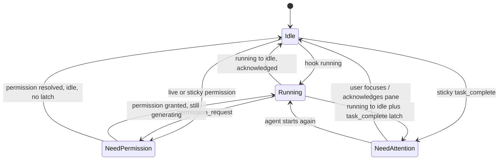

# PRD · APP-058: Agent Status Workspace Grouping

> Product Requirements · WHAT and WHY. Settled direction for grouping workspaces by live Agent activity in the left sidebar and Task kanban.

## Context

- **Problem**: Builders with many workspaces cannot scan which Agents are idle, running, waiting on permission, or sitting in post-run need-attention after the Agent goes idle.
- **Why now**: List-surface Agent marks already exist; grouping modes already exist for metadata. The missing piece is a grouping mode that uses Agent activity.
- **Related specs**: APP-044 (sidebar grouping modes + persistence). Does not change ACP/hook protocol (APP-004).

## Goals

1. Primary — Users can group the left-sidebar workspace list **By Agent** into four live buckets: Need permission, Need attention, Running, Idle.
2. Secondary — Task kanban uses the same mode, same buckets, and the same assignment rules so the two surfaces do not drift.

## Users & Scenarios

- **Primary persona**: Agentic builder running several Agents across worktrees.
- **Key scenarios**:
  1. Switch sidebar Group By to **By Agent**; workspaces waiting on permission sit at the top so they can be approved first.
  2. After an Agent finishes (running → idle) and the pane has not been focused, that workspace appears under **Need attention**.
  3. Open Task kanban with the same grouping; columns match the sidebar buckets and update as hook/attention state changes.
  4. Switch back to By Status / By Project without losing those modes.

## User Stories

- As a builder, I want to group workspaces by Agent activity so I can find the ones that need me without scanning every row.
- As a builder, I want Task kanban columns to follow the same Agent grouping so I can triage from either surface.
- As a builder, I want permission waits and post-run attention in separate buckets so I know whether to approve or to review.

## Functional Requirements

### Must Have

- **M1: Grouping mode `agent`** — Add **By Agent** to the existing Group By menu (sidebar footer and Task kanban). Persist via `workspace_sidebar.grouping_mode`. Do not overload workflow **By Status**.
- **M2: Four buckets** — Every workspace maps to exactly one bucket:

  | Bucket key | Label | Rule |
  |------------|-------|------|
  | `permission` | Need permission | Live hook state is `permission_request`, **or** sticky attention reason is `permission_request` |
  | `attention` | Need attention | Sticky attention reason is `task_complete` (running → idle / “down”), and the row is not in `permission` or `running` |
  | `running` | Running | Live hook state is `running` and not `permission` |
  | `idle` | Idle | Otherwise (no live activity, no sticky attention) |

  Priority: permission > running > attention > idle. A still-running Agent with a leftover `task_complete` latch stays **Running** (need attention is “after down”).
- **M3: No extra statuses in v1** — Do not add connecting / error / paused / queued buckets. Current list-surface Agent model only has idle, running, permission_request, plus sticky permission and task_complete.
- **M4: Empty buckets visible** — Like workflow Status grouping, always show all four groups/columns even when empty.
- **M5: Live rebucket** — When hook state or sticky attention changes, sidebar groups and kanban columns move the workspace without reload.
- **M6: Task kanban parity** — `taskGroupBy=agent` and Task Group By menu include By Agent. Columns, labels, and membership use M2. Drag-and-drop onto Agent columns is **disabled** (status is derived, not a writable workspace field).
- **M7: Two-column parity** — Settings → Layout gets a **By Agent group uses second column** toggle, matching Time / Status / Priority / Label / Group.
- **M8: Copy & i18n** — English sentence case. Chinese locales translated (do not paste English into `zh.json`). Mode label **By Agent** so it does not collide with **By Status**.

### Nice to Have

- **N1**: Filter chips for Agent buckets (independent of grouping).
- **N2**: Per-bucket counts in the Group By menu.
- **N3**: Mobile grouping UI.

## Out of Scope

- **New Agent runtime states** — No backend hook protocol change.
- **Persisting Agent status on the workspace row** — Derived from live stores.
- **Dragging to change Agent status** — Not a user-assignable field.
- **Changing attention filter behavior** — The existing “need attention” list filter stays; grouping does not use the filter-mode glyph override (a running Agent stays in Running even if the filter overlay would show a bell).
- **Mobile first-class grouping** — Web/desktop sidebar + Task kanban only.
- **Creating a workspace from an Agent column** — Create-from-column stays Status-only.

## Success Metrics

- Leading: Users who switch Group By to By Agent at least once in a session with ≥2 live Agent states.
- Qualitative: “I can open the sidebar and immediately see who needs permission vs who just finished.”

## Risks & Open Questions

- **Risk**: “Status” vs “Agent” naming collision. Mitigated by **By Agent** copy (M8).
- **Risk**: Pinned section still extracts pinned workspaces from grouped lists (existing behavior). Call this out so it is not treated as a bug.
- **Open**: None blocking implementation. N1 deferred.

## Milestones

- Phase 1 — Bucket helper + grouping/kanban wiring + persistence/i18n (M1–M6, M8).
- Phase 2 — Two-column layout toggle (M7).
- Phase 3 — Tests.

