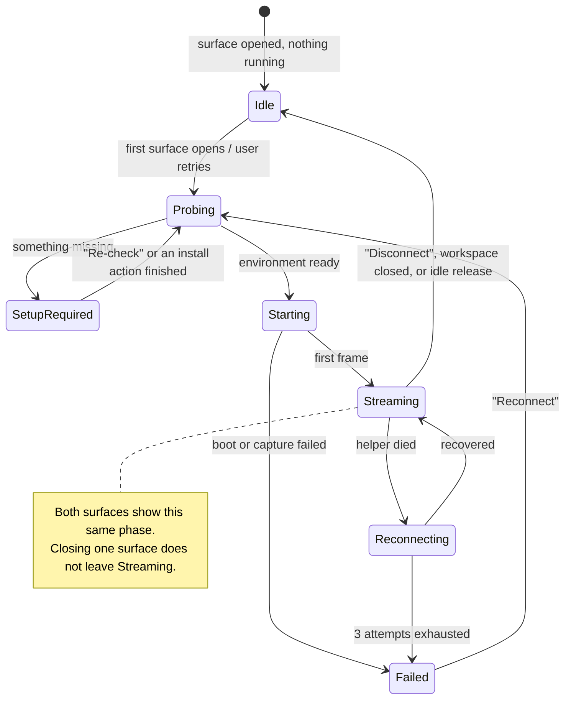

# PRD · APP-058: Workspace Device Preview

> WHAT & WHY. Surface name: **Device** (`设备`). v1 = local iOS Simulator on macOS inside Atmos Desktop.
> Decisions and dependency evidence: [BRAINSTORM.md](./BRAINSTORM.md). Design: [TECH.md](./TECH.md).

## One-liner

While developing a mobile app in an Atmos workspace, see and touch the running simulator **inside the workspace** — and let the agent touch the same screen the human is touching.

## Users and stories

| User | Story |
|------|-------|
| Mobile developer | "I change RN code in the worktree and see the result without leaving Atmos or hunting for the `Simulator.app` window." |
| Mobile developer, cold machine | "My Mac has no iOS runtime. Atmos tells me exactly what's missing and gives me the button, instead of a wall of shell commands." |
| Agent | "I can list devices, tap, type, gesture, and take a screenshot on the same stream the human sees, so I can verify my own change." |
| Reviewer | "Someone else's workspace opens on my machine and the Device surface either works or explains itself; it never shows a black rectangle." |

## Must have (v1)

| Id | Requirement |
|----|-------------|
| **M1** | Two entry points into one session: a right-sidebar tab **Device** (visibility toggle in Settings) and an openable/closable center-stage surface tab **Device**. Both show the same phase, the same device, and the same stream. Opening the second surface never starts a second capture process. |
| **M2** | One active device per workspace (worktree). Switching devices replaces the active one on both surfaces. Two workspaces — and two Desktop instances — cannot claim the same device; the second attempt is refused with a named holder and an explicit "take over" action. |
| **M3** | Opening a surface probes the local environment first. Anything missing stops on an Atmos setup card that states the observed facts (Xcode path, runtimes, devices) and offers 1–2 real buttons. No shell snippet is ever the primary call to action, and probing never boots a device. |
| **M4** | When the environment is ready, one action streams the device: last-used device for this workspace, otherwise a sensible default iPhone (created if none exists). The native `Simulator.app` windows are hidden and Atmos is brought forward. |
| **M5** | Pixels and input in the panel: tap, drag/swipe, scroll, keyboard, plus Home / lock / rotate / disconnect controls. Input coordinates are normalized `0–1` and identical to the agent's coordinate space. |
| **M6** | Agent CLI `atmos device` with `list`, `attach`, `tap`, `type`, `gesture`, `button`, `rotate`, `screenshot`, `ax`, `logs`, `kill` — `--json` for every verb. The agent drives the **same** session as the panel. |
| **M7** | Failure is always explained and never black: capture-vs-Xcode mismatch, WebRTC that cannot connect, a crashed helper, an Intel Mac, a non-macOS machine, and hosted web without Atmos Desktop each have a named state with a next step. During any fallback the last frame or a skeleton stays on screen. |
| **M8** | The helper is never exposed beyond this machine and never reachable without the session token, and the user is never asked to start it. |
| **M9** | Resource behaviour is bounded: at most 2 warm sessions per machine, hidden surfaces throttle the stream, and a fully hidden session is released after an idle period without shutting the device down. |
| **M10** | For Expo / React Native worktrees only: **Open in simulator** starts Metro in a visible terminal pane in that worktree, installs, and launches on the active device. |

## Nice to have (not v1 acceptance)

| Id | Item |
|----|------|
| N1 | Remembering per-workspace device *and* orientation |
| N2 | `atmos device event-log` passthrough for richer agent debugging |
| N3 | Drag-and-drop a file from the workspace onto the device |
| N4 | A "device is busy elsewhere" toast that deep-links to the holding workspace |

## Out of scope (v1)

| Item | Why |
|------|-----|
| **Android** (emulator or physical) | No installable Expo-published capture package exists; the unscoped npm name belongs to a third party. Follow-up spec — see [BRAINSTORM D4](./BRAINSTORM.md#d4-android) |
| **Remote Mac host** for non-macOS workspaces | Needs a new Relay stream class; only useful after local iOS works. Follow-up spec — see [BRAINSTORM D5](./BRAINSTORM.md#d5-remote-mac) |
| iOS physical devices | The helper captures a Simulator framebuffer |
| Shipping iOS system images, or replacing the Xcode Platforms installer | Size and license |
| Embedding `Simulator.app` in a window | Not permitted by Apple |
| Embedding `expo-device-hub`, or depending on `@expo/hub-*` | Wrong product surface; packages unpublished |
| A second frame-capture protocol (screenshot polling, window grabbing) | Explicit non-goal |
| Multiple simultaneously active devices per workspace | v1 is one; other devices are listed and switchable |
| Device farm / cloud simulators | Not our product |
| Camera injection, CoreAnimation debug flags | Upstream supports them; not exposed in v1 |
| The surface on Canvas | Workspace surface, not a canvas card |
| Hosted web (no Atmos Desktop) | Shows a "Requires Atmos Desktop" state by design |

## User-visible states

## Setup card content rules

Every missing-prerequisite state uses one card shape: **title** (what happened) → **reason** (the one specific missing thing) → **observed facts** (read-only: Xcode version, `xcode-select -p`, installed runtimes, available devices) → **1–2 primary buttons** → secondary "Re-check".

| State | Primary action |
|-------|----------------|
| No `xcrun simctl` | Open the Xcode download page (system browser); secondary: install Command Line Tools |
| Xcode present, no iOS runtime | Open Xcode → Settings → Platforms |
| No bootable iPhone | Create a default iPhone (no trip to `Simulator.app` → Devices) |
| Capture incompatible with this Xcode | Update the capture helper; explain that iOS capture uses Xcode private API |
| Intel Mac | State that Apple Silicon is required |
| Not macOS | State that iOS simulators only run on macOS; no hint that Xcode could be installed here |
| Hosted web, no Atmos Desktop | State that the Device surface needs Atmos Desktop |

Rules that apply to all of them: no `sdkmanager …` / `xcrun …` command string as the primary CTA; no generic terminal drop-out; the button either performs an Atmos-wrapped action with progress in the card, or opens the right system location.

## Copy and i18n

- All strings live under `device.*` in `apps/web/messages/en.json` and `apps/web/messages/zh.json`; both locales change together, and the Chinese strings are localized rather than copied English.
- English labels use sentence case: `Device`, `Disconnect`, `Shut down device`, `Open in simulator`.
- Product copy may name `Simulator.app`, `Xcode`, and `Android Studio` as the things the user no longer needs to switch to, or as the source of an install. It does not compare Atmos to other agent development environments.
- Status is inline in the panel and its toolbar. No success toasts for connect/disconnect — the surface itself is the feedback.

## Success metrics

| Metric | Target |
|--------|--------|
| Time from opening the surface on a warm machine (device already booted) to first frame | < 3 s |
| Time on a cold machine (device needs booting) to first frame | < 45 s, and never a silent wait — `Starting` shows progress |
| Share of missing-prerequisite states that end on a card with a working button (no terminal) | 100 % |
| Black-screen occurrences during any documented fallback | 0 |
| Agent tap → visible change on the human's surface | same stream, no second helper process |

## Dependencies

| Dependency | Note |
|-----------|------|
| Atmos Desktop (Electron), macOS arm64 | v1 host; `apps/desktop-electron` |
| Xcode + at least one iOS runtime | User-installed; Atmos only probes and guides |
| `@expo/serve-sim` (pinned) | Capture helper, installed on demand — [TECH §4](./TECH.md#4-helper-distribution) |
| [APP-052](../APP-052_desktop-use/TECH.md) | Automation TCC grant UX to reuse for hiding simulator windows |
| [APP-016](../APP-016_atmos-computer/TECH.md) | Only for the remote-Mac follow-up, not v1 |
