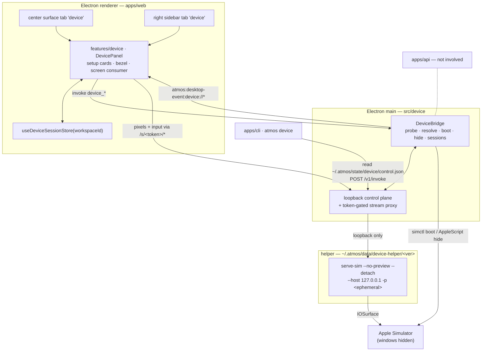

# TECH · APP-058: Workspace Device Preview

> HOW. Domain: **device**. v1 = local iOS Simulator, macOS arm64, inside Atmos Desktop.
> Requirements: [PRD.md](./PRD.md). Decisions and measured dependency facts: [BRAINSTORM.md](./BRAINSTORM.md).

## 1. Scope

| Area | Change |
|------|--------|
| `apps/desktop-electron/src/device/` | **new** — DeviceBridge: probe, device resolution, boot, window hiding, helper install, session + port ownership, loopback control plane and stream proxy |
| `apps/desktop-electron/src/ipc/handlers.ts` | register `device_*` commands (same family as `desktop_use_*`) |
| `apps/desktop-electron/resources/device-helper/helper-manifest.json` + `scripts/prepare-package.ts` | pinned helper manifest staged into `extraResources` (**not** the helper payload) |
| `apps/web/src/features/device/` | **new** — panel, setup cards, bezel, screen consumer, `useDeviceSessionStore` |
| `apps/web/src/app-shell/*` | register the center surface tab + right-sidebar tab |
| `apps/web/src/features/settings/*` | `rsShowDevice` visibility row + WebRTC opt-in |
| `apps/cli/src/commands/device.rs` | `atmos device …` over the loopback control plane |
| `apps/web/messages/{en,zh}.json` | `device.*` copy |
| `NOTICE` | helper attribution (Apache-2.0 + embedded WebRTC) |
| `apps/api` | **no change.** The server is not in this path |

## 2. Architecture



Three entry points (center surface, sidebar surface, CLI), one session, one helper process, one stream.

## 3. Control plane

### 3.1 Panel ↔ main (preload IPC)

Commands via `window.__ATMOS_DESKTOP__.invoke(cmd, args)` → `atmos:desktop-invoke` → `ipc/handlers.ts`:

| Command | Args | Returns |
|---------|------|---------|
| `device_probe` | `{ workspaceId, force? }` | `ProbeResult` |
| `device_attach` | `{ workspaceId, deviceId? }` | `SessionView` (existing session returned unchanged) |
| `device_input` | `{ workspaceId, op, … }` | `{ ok }` — toolbar Home / lock / rotate |
| `device_disconnect` | `{ workspaceId }` | `{ ok }` |
| `device_shutdown` | `{ workspaceId }` | `{ ok }` — explicit `simctl shutdown` |
| `device_hide_native` | `{ workspaceId }` | `{ hidden: boolean }` |
| `device_visibility` | `{ workspaceId, visible }` | `{ ok }` — drives throttle + idle release (§6.3) |
| `device_open_in_simulator` | `{ workspaceId }` | `{ ok }` — P5 |
| `device_install_helper` | `{}` | `{ version }` — progress via events |
| `device_setup_action` | `{ action }` | `{ ok }` — `install_clt` \| `open_xcode_platforms` \| `open_xcode_download` \| `create_default_iphone` |

Events pushed with `webContents.send("atmos:desktop-event:device://<name>")`, consumed with `desktopListen`:

| Event | Payload |
|-------|---------|
| `device://probe` | `ProbeResult` |
| `device://status` | `SessionView` — `{ phase, workspaceId, device, streamBaseUrl, transport, codec, size, lastError }` |
| `device://log` | `{ workspaceId, step, message }` — structured progress for the card, never raw PTY output |

`streamBaseUrl` is always a proxy URL (§3.3). The renderer never learns the helper port.

Hosted web has no `window.__ATMOS_DESKTOP__` (`isElectronShell()` in `apps/web/src/shared/lib/desktop-bridge.ts`). The panel then renders the "Requires Atmos Desktop" state and issues no invokes.

### 3.2 CLI ↔ main (loopback + discovery file)

`~/.atmos/state/device/control.json`, mode `0600`, written on first session and removed on quit (`state/` = session & discovery per [atmos-home-layout](../../../agents/references/runtime/atmos-home-layout.md)):

```json
{
  "protocol": "atmos-device/v1",
  "base_url": "http://127.0.0.1:52413",
  "port": 52413,
  "token": "<control-plane token, per Desktop run>",
  "updated_at": "2026-08-13T12:00:00Z"
}
```

`POST {base_url}/v1/invoke` with `Authorization: Bearer <token>`:

```json
{ "op": "tap", "workspaceId": "ws_…", "args": { "x": 0.5, "y": 0.42 } }
```

The CLI never spawns a helper, never talks to the helper directly, and never reaches `apps/api`. This mirrors `browser/browser-use-control.ts` + `crates/browser-use/src/backends/embedded.rs`.

### 3.3 Stream proxy (required, not optional)

One loopback HTTP server in main serves both namespaces:

| Route | Auth | Consumer |
|-------|------|----------|
| `/v1/invoke` | `Bearer` control-plane token | CLI |
| `/s/<sessionToken>/{config,stream.avcc,stream.mjpeg,ws,ax,foreground,logs,stream-settings}` | the session token **in the path** | renderer |

Per-session tokens are random per attach and are capabilities: a token only reaches its own session's helper, and only the allow-listed paths are forwarded. The token lives in the path (not a header) so the browser `WebSocket` constructor needs no custom auth, and `/ws` upgrades are piped through the same server.

Rationale: the helper has no authentication of its own, and WebSocket ignores CORS, so a loopback-only helper is still reachable by any local process or malicious page ([BRAINSTORM D6](./BRAINSTORM.md#d6-helper-authentication)).

## 4. Helper distribution

Engine model, mirroring `desktop-use` ([BRAINSTORM D3](./BRAINSTORM.md#d3-helper-distribution)).

```text
apps/desktop-electron/resources/device-helper/helper-manifest.json   → extraResources (staged by scripts/prepare-package.ts)
{
  "helper": "@expo/serve-sim",
  "version": "0.1.37",
  "tarball_sha256": "<pinned>",
  "requires": { "os": "darwin", "arch": "arm64", "node": ">=20" }
}

~/.atmos/data/device-helper/0.1.37/                                  → installed payload
```

Rules:

- Install is triggered by `device_install_helper` (from the setup card) or lazily by the first `device_attach`; progress is reported on `device://log`. It is never a user shell step and never mentions `npx`.
- The download is verified against `tarball_sha256` before extraction; a mismatch fails with `helper_integrity_failed` and installs nothing.
- Resolution order: `ATMOS_DEVICE_HELPER_DIR` (tests) → `~/.atmos/data/device-helper/<manifest version>` → not installed.
- `ATMOS_DEVICE_DEV=1` additionally allows a monorepo `node_modules` path for Desktop engineers. Off by default; never surfaced in UI copy.
- The payload is an ESM entry plus a native addon, **not** a standalone binary. It is launched with Electron as Node (`ELECTRON_RUN_AS_NODE=1`, precedent: `appshot/trigger-event-tap.ts`).
- A newer helper can be shipped by bumping the manifest, which is the fix path for an Xcode major bump (§7.1).
- `NOTICE` gains one entry covering `@expo/serve-sim` (Apache-2.0) and the WebRTC framework embedded in its payload.

## 5. Spawn contract

```bash
serve-sim --no-preview --detach -q \
  --host 127.0.0.1 -p <ephemeral> \
  --transport http --codec auto \
  -- <udid>
```

| Flag | Why |
|------|-----|
| `--no-preview` | **security**: the preview server exposes a token-gated shell-exec route. Acceptance asserts that port is not listening |
| `--detach -q` | daemonize and return machine-readable startup info |
| `--host 127.0.0.1` | verified to exist with this default; passed explicitly. `/health` is still checked for a loopback bind as a backstop → `helper_bind_not_loopback` kills the process |
| `-p <ephemeral>` | OS-assigned loopback port, never the upstream defaults (3100/3200). Two workspaces never share a port; the two surfaces of one workspace always do |
| `--transport webrtc` | only when the user opted in; on failure the session falls back (§7.2) |

Helper endpoints consumed: `/health`, `/config`, `/stream.avcc` (H.264) or `/stream.mjpeg`, `/ws` (input), `/ax`, `/foreground`, `/logs`, `/stream-settings` (live fps/quality/dimension throttle).

Spawn environment: `PATH` includes `DEVELOPER_DIR`; `HOME` preserved (CoreSimulator); `ATMOS_LOCAL_TOKEN` and any git/GitHub token explicitly stripped.

## 6. Sessions

### 6.1 Model

```ts
type DeviceSession = {
  workspaceId: string;          // Atmos workspace = one git worktree
  platform: "ios";              // adapter seam for the Android follow-up
  deviceId: string;             // udid
  phase: Phase;
  child: { pid: number };
  helperPort: number;           // loopback, never leaves main
  sessionToken: string;         // capability for /s/<token>/*
  transport: "http" | "webrtc";
  codec: "h264" | "mjpeg";
  visibleSurfaces: number;      // center + sidebar
  lastVisibleAt: number;
  health: "ok" | "stale" | "dead";
};
```

`Phase = idle | probing | setup_required | starting | streaming | reconnecting | failed`. Both surfaces read one `useDeviceSessionStore(workspaceId)` slice, filled only by `device://*` events — the store never derives phase locally, so the two surfaces cannot disagree.

### 6.2 Exclusivity

A machine-wide claim table maps `deviceId → { workspaceId, instanceId }`. `device_attach` on a claimed device returns `device_in_use` with the holder (and an instance marker when another Desktop holds it). Take-over kills the holder's session, re-claims, and writes an audit log line. Cross-instance claims are detected through the claim file plus `serve-sim --list`.

### 6.3 Lifecycle and resource governance

| Trigger | Effect |
|---------|--------|
| First surface opens | probe → resolve → boot if needed → hide native windows → spawn helper → stream |
| Second surface opens | attaches the existing `streamBaseUrl`; no probe, no spawn |
| One surface closes/hides | stream continues |
| All surfaces hidden | `POST /stream-settings` throttle (≤ 5 fps, ≤ 720 px) within 5 s |
| All surfaces hidden ≥ **10 min** | kill helper, release claim, phase → `idle`; **device stays booted** |
| More than **2** warm sessions | least-recently-visible session is killed |
| Workspace closed / worktree deleted | kill helper, release claim; device stays booted |
| "Disconnect" | kill helper only |
| "Shut down device" | `simctl shutdown` |
| Desktop `before-quit` | kill all sessions, `serve-sim --kill`, remove `control.json` and claims |
| Desktop start | reconcile via `serve-sim --list`, kill leftovers from previous runs |

Orphan recovery uses the helper's own `--list` / `--kill`; no separate pid-file store.

### 6.4 Boot and window hiding

1. `simctl boot <udid>` unless already `Booted`; wait for `Booted`, timeout 90 s, progress on `device://log`.
2. Hide **all** `Simulator` windows via a pinned AppleScript, then `BrowserWindow.show()` + `focus()`. This path needs **Automation TCC**; the grant flow reuses the `desktop-use` grant overlay pattern (`apps/desktop-electron/src/desktop-use/grant-overlay.ts`) with an `automation` purpose added.
3. Hiding is best-effort: failure never rolls back streaming; the panel shows a non-blocking note.

## 7. Probe and degradation

### 7.1 Probe

Runs in main, 8 s budget, result on `device://probe`. Pure functions over an injected command runner (§9).

| Check | Pass condition | Code on failure |
|-------|----------------|-----------------|
| Host OS | `darwin` | `platform_not_macos` |
| Arch | `arm64` | `helper_arch_unsupported` |
| `xcrun simctl` | exits 0 | `missing_simctl` |
| iOS runtime | ≥ 1 `isAvailable` iOS runtime in `simctl list runtimes -j` | `missing_ios_runtime` |
| Bootable iPhone | ≥ 1 iPhone device on an available runtime | `missing_iphone_device` |
| Helper | manifest version installed and executable | `helper_not_installed` |
| Capture smoke (only when a device is already `Booted`) | helper `/health` 200 within 2 s | `capture_xcode_mismatch` \| `capture_failed` |

Probing never boots a device and never opens `Simulator.app`.

Device resolution: last-used for this workspace (still present, runtime still available) → otherwise the first available iPhone `simctl` lists under the newest installed runtime → otherwise `simctl create` on that runtime's default iPhone type. No curated tier ranking ([BRAINSTORM D9](./BRAINSTORM.md#d9-default-device-selection)).

### 7.2 Degradation ladder

| Condition | Ladder | Never |
|-----------|--------|-------|
| WebRTC opted in but no connection/first frame | → HTTP H.264 → HTTP MJPEG | black screen; the last frame or skeleton holds until the first HTTP frame |
| Capture fails with `SimulatorKit`/`IOSurface`/`dlopen` signatures | retry once as `--transport http --codec mjpeg` → stop on the mismatch card recording `{ xcodeVersion, helperVersion, osVersion }` | `simctl io screenshot` polling, window grabbing, or any second capture protocol |
| Helper process dies | `reconnecting`, restart same device up to 3× → `failed` with "Reconnect" | silent stall |
| Missing prerequisite | `setup_required` card | spawning anything |

The mismatch card's primary action is **Update capture helper** (manifest-driven, §4) — not "update Atmos Desktop", because the helper upgrades independently.

## 8. Surfaces

Exact registration points, verified against the current tree.

### 8.1 Right sidebar

| File | Change |
|------|--------|
| `apps/web/src/shared/lib/nuqs/searchParams.ts` | add `"device"` to `RightSidebarTab` + `RIGHT_SIDEBAR_TABS` |
| `apps/web/src/app-shell/RightSidebar.tsx` | add to `BASE_TABS` + a content block gated on `rsShowDevice` |
| `apps/web/src/features/settings/store/layout-settings-store.ts` | `rsShowDevice` ↔ `right_sidebar_show_device` (server function settings, same as `rsShowBrowser`) |
| `apps/web/src/features/settings/components/RightSidebarLayoutSettingsSection.tsx` | one `SettingsToggleRow` |

`rsShowDevice` defaults **off** while only P1 has landed, and flips to **on** with P2 (§10) so no release ships a surface that cannot stream.

### 8.2 Center stage

An **openable/closable** surface tab, not a fixed tab. `FixedTab` is not touched (it stays `overview | terminal | wiki | project-wiki | code-review`).

| File | Change |
|------|--------|
| `apps/web/src/app-shell/center-stage-shared-tabs.tsx` | add `"device"` to `CenterStageSurfaceTabVariant` (tab chrome/icon) |
| `apps/web/src/app-shell/CenterStageTabBar.tsx` | tab descriptor + "open Device" entry in the new-tab menu |
| `apps/web/src/app-shell/CenterStage.tsx` | resolve/close/tab-change routing for the tab value |
| `apps/web/src/app-shell/workspace-center-frame.tsx` | mount `DevicePanel` |
| `apps/web/src/app-shell/center-stage-tab-activation-stack.ts` | include the value in `buildOpenCenterTabValues` |
| `apps/web/src/features/device/store/use-device-center-tab.ts` | which workspaces have the tab open (one per workspace, `localStorage`) |

Tab value is the literal `device` scoped per workspace frame — there is exactly one per workspace, so no `browser:{ctx}:{id}`-style composite id is needed.

**Do not copy the browser session model.** `browser` deliberately keys one context per surface and clones on "move to center". A device is an exclusive physical resource, so both surfaces share `useDeviceSessionStore(workspaceId)` and one `streamBaseUrl`.

### 8.3 Panel composition

`apps/web/src/features/device/`:

```text
components/DevicePanel.tsx        phase router, toolbar (width-adaptive), bezel
components/DeviceScreen.tsx       consumes /config + /stream.avcc|/stream.mjpeg + /ws
components/DeviceSetupCard.tsx    all setup_required / failed states
lib/device-stream-client.ts       pure: frame decode plumbing, input encoding, 0–1 normalization
store/use-device-session-store.ts one slice per workspaceId, filled by device://* events
```

The bezel (notch, home indicator) is decorative and must not intercept gestures. Only `DeviceScreen` draws pixels. Sidebar toolbar keeps device name / status / disconnect; center adds rotate / Home / "Open in simulator".

## 9. Testability seams (required by design, not by TEST.md)

| Seam | Shape |
|------|-------|
| `CommandRunner` | `(cmd, args, opts) => Promise<{ code, stdout, stderr }>` injected into probe/resolve/boot so all of §7.1 and device resolution are pure and fixture-driven |
| Fixtures | real `simctl list -j` / `simctl list runtimes -j` captures + mismatch stderr samples, checked in under `apps/desktop-electron/src/device/__fixtures__/` |
| Fake bridge, two entry points | `ATMOS_DEVICE_FAKE=<fixture>` makes main serve a scripted bridge (probe results, phases, synthetic frames) for Electron smoke runs; the same command/event shape is injected as a preload-shaped `window.__ATMOS_DESKTOP__` stub via Playwright `addInitScript` for browser-level e2e. Both drive every phase with no Xcode |
| Degradation ladder | a pure reducer `(state, event) => nextState` — the WebRTC→HTTP→MJPEG and reconnect logic is unit-testable without processes |
| Proxy | route allow-list + token check are pure functions |

## 10. Rollout

| PR | Contents | Mergeable when | Excludes |
|----|----------|----------------|----------|
| **P0** | Spike only, no product code: answers Q1–Q5 in [BRAINSTORM](./BRAINSTORM.md#open-questions-must-be-answered-by-the-p0-spike-before-product-code) and appends a "Contract record" section | The record documents ABI load, `--detach` JSON, `--host` behaviour, `/config` + `/stream.avcc` + `/ws` + `/ax` shapes | everything else |
| **P1** | Probe + both surfaces + all setup cards + hosted-web state + `rsShowDevice` (default off) + fake bridge + fixture unit tests + i18n | Opening either surface shows a real probe result; missing prerequisites stop on a card with working buttons; nothing spawns | streaming, boot |
| **P2** | Helper manifest + install + spawn + proxy + `DeviceScreen` + input + degradation ladder + loopback assertions + NOTICE; flip `rsShowDevice` default on | An already-booted simulator streams and is touchable in both surfaces; no `npx`; documented fallbacks never black-screen | boot, window hiding |
| **P3** | `simctl boot` / create-default / last-used, AppleScript hide + Automation grant, claim table + take-over, warm cap + idle release + throttle, quit/orphan reconciliation | Cold machine reaches a frame with one action; no orphan helpers after quit | CLI |
| **P4** | `apps/cli/src/commands/device.rs` + control plane `/v1/invoke` | Agent drives the human's session; `--json` contract holds | remote, Android |
| **P5** | Expo/RN detection + "Open in simulator" + Metro pane | One action installs and launches on the active device | — |

Dependencies: P0 → P1 → P2 → P3 → P4 → P5. `atmos device` ships through the standard CLI release flow (`atmos-cli-release`); the panel itself never depends on the CLI, so no minimum-CLI gate is required for the surface.

## 11. Agent CLI contract

`atmos device <verb>`, implemented in `apps/cli/src/commands/device.rs`, every verb `POST /v1/invoke`.

| Verb | Args | Notes |
|------|------|-------|
| `list` | `--platform` | probe view + which device is active for this workspace |
| `attach` | `--id <udid>` | omit → last-used/default; existing session is a no-op returning the same session |
| `tap` | `--x --y` | normalized `0–1`, origin top-left |
| `type` | `--text` / `--stdin` | |
| `gesture` | `--kind swipe\|pinch --x1 --y1 --x2 --y2 --duration-ms` | |
| `button` | `--name home\|lock\|siri\|volume_up\|volume_down` | |
| `rotate` | `--orientation portrait\|portrait_upside_down\|landscape_left\|landscape_right` | |
| `screenshot` | `--out <path>` / `--json` | single frame; the agent's read path. Not a stream fallback |
| `ax` | | accessibility tree, each node carrying **both** `rect` (px) and `normalizedRect` (`0–1`) so agent input needs no conversion |
| `logs` | `--tail <n>` | passthrough of helper `/logs` |
| `kill` | `--shutdown-device` | |

Rules:

- Out-of-range coordinates are **rejected**, never silently clamped → `coord_out_of_range`.
- Workspace resolution: `--workspace` → otherwise the single active session → otherwise `workspace_ambiguous` listing candidates. There is no server-side "currently selected workspace" to fall back on.
- Exit codes: `0` ok; `2` `setup_required` / `device_in_use` / `workspace_ambiguous` / session errors; `1` transport or auth failure.
- `list` returns `ok: true` with the probe payload even when prerequisites are missing; only `attach` fails on them.

```json
{
  "ok": true,
  "op": "tap",
  "workspaceId": "ws_…",
  "device": { "platform": "ios", "id": "AAAA-…", "name": "iPhone 17 Pro" },
  "result": { "x": 0.5, "y": 0.42 }
}
```

## 12. Storage

| Path | Contents | Mode |
|------|----------|------|
| `~/.atmos/state/device/control.json` | CLI discovery: proxy `base_url`, `port`, control token | `0600` |
| `~/.atmos/state/device/claims.json` | `deviceId → { workspaceId, instanceId, since }` | `0600` |
| `~/.atmos/state/device/last-device/<workspace_id>.json` | last-used device per workspace | `0600` |
| `~/.atmos/data/device-helper/<version>/` | installed helper payload | — |
| `apps/desktop-electron/resources/device-helper/helper-manifest.json` | pinned version + integrity | in-bundle |

Nothing is written inside a worktree; no helper URL is written to git, wiki, or skill files.

## 13. Security

| Rule | Enforcement |
|------|-------------|
| Helper reachable only through the proxy | ephemeral loopback port never leaves main; per-session token in the proxy path; path allow-list |
| Helper bound to loopback | explicit `--host 127.0.0.1`; `/health` bind assertion; non-loopback → kill + `helper_bind_not_loopback` |
| No preview server | `--no-preview` always; the upstream preview carries a token-gated shell-exec route |
| No credential leakage into the helper | `ATMOS_LOCAL_TOKEN` and git tokens stripped from the child environment |
| Workspace isolation | proxy tokens and claims are keyed by `workspaceId`; there is no "forward to an arbitrary port" API |
| Take-over is explicit and audited | user action only, with an audit log line |
| Accessibility trees may contain typed text | returned verbatim to the agent over `--json`; the UI does not render the whole tree by default |
| Probe stays local | device lists are never uploaded |

## 14. Risks

| Risk | Mitigation |
|------|-----------|
| Native addon does not load under Electron's Node ABI | **P0 spike Q1 gates the whole approach**; fallback is a matching Node runtime, otherwise the feature is re-scoped |
| Xcode major bump breaks capture | manifest-driven helper upgrade (§4) + mismatch card + MJPEG retry; accepted limit: the scoped tarball has no Swift sources, so we cannot rebuild locally |
| Upstream helper churn (3 published versions, active repo) | version pinned with integrity; upgrades are a deliberate manifest change with a re-run of the P0 contract record |
| Simulator + capture is power-hungry | warm cap 2, throttle on hide, idle release at 10 min, native resolution only while visible |
| Automation TCC denied | hiding degrades to a non-blocking note; streaming is unaffected |
| Bundle/signing complexity | avoided by not bundling the payload (§4) |
| Two Desktop instances fight over a device | claim file + `serve-sim --list` reconciliation + explicit take-over |
| Android/remote scope creep | both are follow-up specs; the `DeviceAdapter` seam and proxy are the only extension points v1 must keep |

## 15. Follow-up seams

| Follow-up | What v1 must leave in place |
|-----------|----------------------------|
| Android | `platform` field + a `DeviceAdapter` interface (`probe`, `resolve`, `boot`, `spawn`, `input`) so a second adapter needs no redesign; WebCodecs capability probe belongs to that spec |
| Remote Mac | `streamBaseUrl` is already an indirection, so a Relay-backed base URL substitutes cleanly. That spec must force H.264 with `--max-dimension` / `--video-fps` / `--video-bitrate` caps and must not enable MJPEG across a network |
