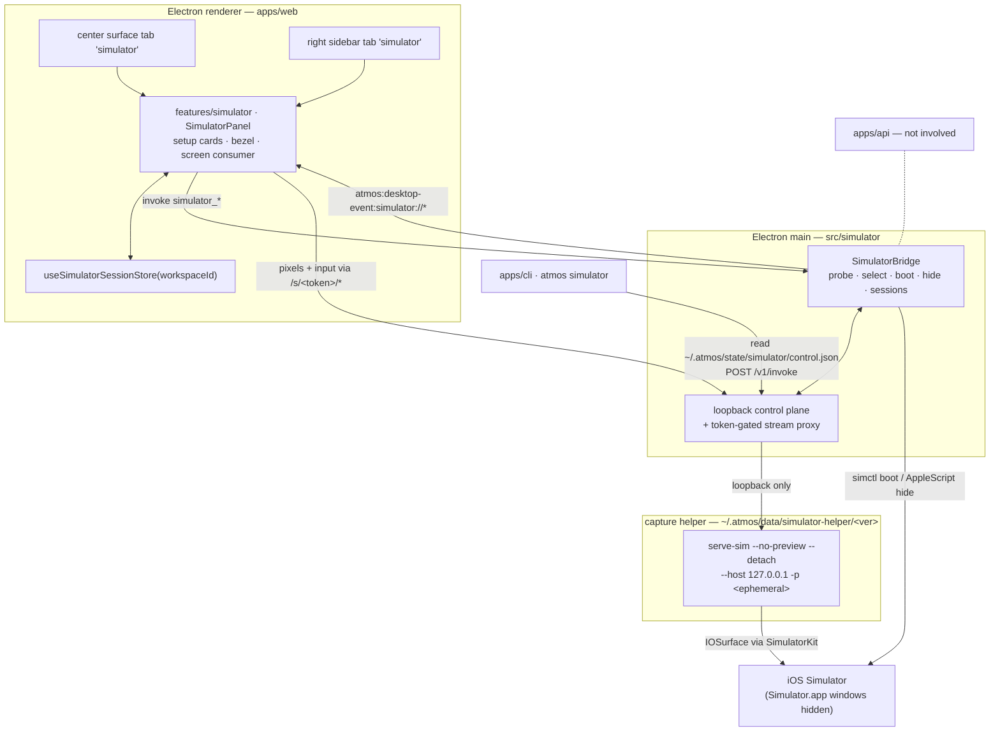

# TECH · APP-058: Workspace Simulator

> HOW. Domain: **simulator** — one word in code, IPC, CLI, paths, error codes, and copy.
> Target: local iOS Simulator, macOS 14+ arm64, inside Atmos Desktop. Delivered as **one branch**.
> Requirements: [PRD.md](./PRD.md). Measured contracts: [BRAINSTORM Contract record](./BRAINSTORM.md#contract-record-spike-closed-2026-08-13-static-analysis-of-the-pinned-artifact).

## 1. Scope

| Area | Change |
|------|--------|
| `apps/desktop-electron/src/simulator/` | **new** — SimulatorBridge: probe, selection, boot, window hiding, helper install, session + port ownership, loopback control plane and stream proxy |
| `apps/desktop-electron/src/ipc/handlers.ts` | register `simulator_*` commands (same family as `desktop_use_*`) |
| `apps/desktop-electron/resources/simulator-helper/helper-manifest.json` + `scripts/prepare-package.ts` | pinned helper manifest staged into `extraResources` (**not** the helper payload) |
| `apps/desktop-electron` mac entitlements + `electron-builder.yml` | `com.apple.security.cs.disable-library-validation` (§13) |
| `apps/web/src/features/simulator/` | **new** — panel, setup cards, bezel, screen consumer, `useSimulatorSessionStore` |
| `apps/web/src/app-shell/*` | register the center surface tab + right-sidebar tab |
| `apps/web/src/features/settings/*` | `rsShowSimulator` visibility row + WebRTC opt-in |
| `apps/cli/src/commands/simulator.rs` | `atmos simulator …` over the loopback control plane |
| `apps/web/messages/{en,zh}.json` | `simulator.*` copy |
| `NOTICE` | helper attribution (Apache-2.0 + embedded WebRTC) |
| `apps/api` | **no change.** The server is not in this path |

Naming is normative. No identifier, path, event name, error code, i18n key, or string in this feature may contain `device`, `phone`, `mobile`, or `emulator`, except when quoting Apple's own CLI vocabulary in diagnostic text (`simctl` runtime identifiers, device-type strings) or naming `Simulator.app`.

## 2. Architecture



Three entry points (center surface, sidebar surface, CLI), one session, one helper process, one stream.

## 3. Control plane

### 3.1 Panel ↔ main (preload IPC)

Commands via `window.__ATMOS_DESKTOP__.invoke(cmd, args)` → `atmos:desktop-invoke` → `ipc/handlers.ts`:

| Command | Args | Returns |
|---------|------|---------|
| `simulator_probe` | `{ workspaceId, force? }` | `ProbeResult` |
| `simulator_attach` | `{ workspaceId, simulatorId? }` | `SessionView` (existing session returned unchanged) |
| `simulator_input` | `{ workspaceId, op, … }` | `{ ok }` — toolbar Home / lock / rotate |
| `simulator_disconnect` | `{ workspaceId }` | `{ ok }` |
| `simulator_shutdown` | `{ workspaceId }` | `{ ok }` — explicit `simctl shutdown` |
| `simulator_hide_windows` | `{ workspaceId }` | `{ hidden: boolean }` |
| `simulator_visibility` | `{ workspaceId, visible }` | `{ ok }` — drives throttle + idle release (§6.3) |
| `simulator_open_project` | `{ workspaceId }` | `{ ok }` — "Open in simulator" (Metro + install + launch) |
| `simulator_install_helper` | `{}` | `{ version }` — progress via events |
| `simulator_setup_action` | `{ action }` | `{ ok }` — `install_clt` \| `open_xcode_platforms` \| `open_xcode_download` \| `create_default_iphone` |
| `simulator_take_over` | `{ workspaceId, simulatorId }` | `SessionView` |

Events pushed with `webContents.send("atmos:desktop-event:simulator://<name>")`, consumed with `desktopListen`:

| Event | Payload |
|-------|---------|
| `simulator://probe` | `ProbeResult` |
| `simulator://status` | `SessionView` — `{ phase, workspaceId, simulator, streamBaseUrl, transport, codec, size, lastError }` |
| `simulator://log` | `{ workspaceId, step, message }` — structured progress for the card, never raw process output |

`streamBaseUrl` is always a proxy URL (§3.3). The renderer never learns the helper port.

Hosted web has no `window.__ATMOS_DESKTOP__` (`isElectronShell()` in `apps/web/src/shared/lib/desktop-bridge.ts`). The panel then renders the "Requires Atmos Desktop" state and issues no invokes.

### 3.2 CLI ↔ main (loopback + discovery file)

`~/.atmos/state/simulator/control.json`, mode `0600`, written on first session and removed on quit (`state/` = session & discovery per [atmos-home-layout](../../../agents/references/runtime/atmos-home-layout.md)):

```json
{
  "protocol": "atmos-simulator/v1",
  "base_url": "http://127.0.0.1:52413",
  "port": 52413,
  "token": "<control-plane token, per Desktop run>",
  "updated_at": "2026-08-13T12:00:00Z"
}
```

`POST {base_url}/v1/invoke` with `Authorization: Bearer <token>`:

```json
{ "op": "tap", "workspaceId": "ws_…", "args": { "x": 0.5, "y": 0.42 } }
```

The CLI never spawns a helper, never talks to the helper directly, and never reaches `apps/api`. This mirrors `browser/browser-use-control.ts` + `crates/browser-use/src/backends/embedded.rs`.

### 3.3 Stream proxy (mandatory)

One loopback HTTP server in main serves both namespaces:

| Route | Auth | Consumer |
|-------|------|----------|
| `/v1/invoke` | `Bearer` control-plane token | CLI |
| `/s/<sessionToken>/…` | the session token **in the path** | renderer |

Per-session tokens are random per attach and act as capabilities: a token only reaches its own session's helper, and only the allow-listed upstream paths are forwarded. The token lives in the path (not a header) so the browser `WebSocket` constructor needs no custom auth, and `/ws` upgrades are piped through the same server.

This is required, not defensive styling: the helper performs **no Origin check and has no token** ([BRAINSTORM C6](./BRAINSTORM.md#c6--security-confirmed-not-assumed)), and WebSocket ignores CORS, so a loopback-only helper is still reachable by any local process or page.

## 4. Capture helper distribution

Engine model, mirroring `desktop-use` ([BRAINSTORM D3](./BRAINSTORM.md#d3-capture-helper-distribution)).

```text
apps/desktop-electron/resources/simulator-helper/helper-manifest.json   → extraResources
{
  "helper": "@expo/serve-sim",
  "version": "0.1.37",
  "tarball_sha256": "<pinned>",
  "requires": { "os": "darwin", "arch": "arm64", "min_macos": "14.0", "node": ">=20" }
}

~/.atmos/data/simulator-helper/0.1.37/                                  → installed payload
```

Rules:

- Install is triggered by `simulator_install_helper` (from the setup card) or lazily by the first `simulator_attach`; progress is reported on `simulator://log`. It is never a user shell step and never mentions `npx`.
- The download is verified against `tarball_sha256` before extraction; a mismatch fails with `helper_integrity_failed` and installs nothing.
- Resolution order: `ATMOS_SIMULATOR_HELPER_DIR` (tests) → `~/.atmos/data/simulator-helper/<manifest version>` → not installed.
- `ATMOS_SIMULATOR_DEV=1` additionally allows a monorepo `node_modules` path for Desktop engineers. Off by default; never surfaced in UI copy.
- The payload is an ESM entry plus a **Node-API** native addon, not a standalone binary, so it is launched with Electron as Node (`ELECTRON_RUN_AS_NODE=1`; precedent `appshot/trigger-event-tap.ts`). ABI compatibility is not version-sensitive ([BRAINSTORM C1](./BRAINSTORM.md#c1--native-addon-abi-node-api-loads-under-electron)).
- A newer helper ships by bumping the manifest, which is the fix path for an Xcode major bump (§7.2).
- `NOTICE` gains one entry covering `@expo/serve-sim` (Apache-2.0) and the WebRTC framework embedded in its payload.

## 5. Spawn contract and handshake

```bash
serve-sim --no-preview --detach -q \
  --host 127.0.0.1 -p <ephemeral> \
  --transport http --codec auto \
  -- <udid>
```

| Flag | Why |
|------|-----|
| `--no-preview` | **security**: the preview server carries a token-gated `/exec` shell route. Acceptance asserts the preview port is not listening |
| `--detach -q` | daemonize; returns the pid |
| `--host 127.0.0.1` | honoured by the helper server, which also defaults to loopback ([BRAINSTORM C3](./BRAINSTORM.md#c3--bind-surface-and-the-host-flag)); passed explicitly anyway |
| `-p <ephemeral>` | OS-assigned loopback port, never the upstream defaults (3100/3200). Two workspaces never share a port; the two surfaces of one workspace always do |
| `--transport webrtc` | only when the user opted in; on failure the session falls back (§7.2) |

**Handshake — do not hardcode endpoint paths.** After spawn, read the helper's own atomically written record and use the URLs it publishes:

```text
$TMPDIR/serve-sim/server-<udid>.json   (mode 0600)
{ "pid", "port", "device", "url", "streamUrl", "wsUrl", "streamSettings"? }
```

`stream-settings` is derived the way upstream does it — replace the last path segment of `streamUrl`. Endpoint addressing differs between the helper's preview and in-process modes, so the published URLs are the only stable contract ([BRAINSTORM C4](./BRAINSTORM.md#c4--startup-handshake-and-discovery)). Startup failures are written by the helper to `server-<udid>.log` next to that record; the setup card summarises it and never dumps it raw.

Spawn environment: `PATH` and `DEVELOPER_DIR` set for the selected Xcode (the addon resolves `SimulatorKit` / `CoreSimulator` at runtime via `dlopen` + `xcode-select`); `HOME` preserved (CoreSimulator); `ATMOS_LOCAL_TOKEN` and any git/GitHub token explicitly stripped.

### 5.1 Input protocol (decoded, [BRAINSTORM C5](./BRAINSTORM.md#c5--input-protocol-over-ws))

Client → helper over `/ws`: one **opcode byte** followed by a **JSON body**. On connect the helper pushes a config frame (width, height, orientation) and re-pushes it on orientation change.

| Opcode | Operation | JSON body |
|--------|-----------|-----------|
| 3 | touch | `{ type: "begin" \| "move" \| "end", x, y, edge? }` |
| 4 | button | `{ button }` or `{ page, usage, phase }` |
| 5 | multi-touch / pinch | `{ type, x1, y1, x2, y2 }` |
| 6 | key | `{ type, usage }` |
| 7 | orientation | `{ orientation }` |
| 9 | memory warning | — |
| 11 | scroll | `{ dx, dy, x, y }` |
| 12 | software keyboard | — |

Coordinates are normalized `0–1` on the wire and scaled by the captured size inside the helper, so the panel and `atmos simulator` share one coordinate space with no conversion layer. Opcodes 8 and 10 (CoreAnimation debug, digital crown) exist upstream and are deliberately not exposed.

## 6. Sessions

### 6.1 Model

```ts
type SimulatorSession = {
  workspaceId: string;          // Atmos workspace = one git worktree
  runtimeKind: "ios";           // adapter seam for a future platform spec
  simulatorId: string;          // udid
  phase: Phase;
  child: { pid: number };
  helperPort: number;           // loopback, never leaves main
  sessionToken: string;         // capability for /s/<token>/…
  streamUrl: string;            // as published by the helper record
  wsUrl: string;
  transport: "http" | "webrtc";
  codec: "h264" | "mjpeg";
  visibleSurfaces: number;      // center + sidebar
  lastVisibleAt: number;
  health: "ok" | "stale" | "dead";
};
```

`Phase = idle | probing | setup_required | starting | streaming | reconnecting | failed`. Both surfaces read one `useSimulatorSessionStore(workspaceId)` slice, filled only by `simulator://*` events — the store never derives phase locally, so the two surfaces cannot disagree.

### 6.2 Exclusivity

A machine-wide claim table maps `simulatorId → { workspaceId, instanceId }`. `simulator_attach` on a claimed simulator returns `simulator_in_use` with the holder (and an instance marker when another Desktop holds it). `simulator_take_over` kills the holder's session, re-claims, and writes an audit log line. Cross-instance claims are detected through the claim file plus `serve-sim --list`.

### 6.3 Lifecycle and resource governance

| Trigger | Effect |
|---------|--------|
| First surface opens | probe → select → boot if needed → hide `Simulator.app` windows → spawn helper → stream |
| Second surface opens | attaches the existing `streamBaseUrl`; no probe, no spawn |
| One surface closes/hides | stream continues |
| All surfaces hidden | throttle via `stream-settings` (≤ 5 fps, ≤ 720 px) within 5 s |
| All surfaces hidden ≥ **10 min** | kill helper, release claim, phase → `idle`; **simulator stays booted** |
| More than **2** warm sessions | least-recently-visible session is killed |
| Workspace closed / worktree deleted | kill helper, release claim; simulator stays booted |
| "Disconnect" | kill helper only |
| "Shut down simulator" | `simctl shutdown` |
| Desktop `before-quit` | kill all sessions, `serve-sim --kill`, remove `control.json` and claims |
| Desktop start | reconcile via `serve-sim --list`, kill leftovers from previous runs |

Orphan recovery uses the helper's own `--list` / `--kill`; no separate pid-file store.

### 6.4 Boot and window hiding

1. `simctl boot <udid>` unless already `Booted`; wait for `Booted` (the helper's own path uses `simctl bootstatus`), timeout 90 s, progress on `simulator://log`.
2. Hide **all** `Simulator.app` windows via a pinned AppleScript, then `BrowserWindow.show()` + `focus()`. This path needs **Automation TCC**; the grant flow reuses the `desktop-use` grant overlay pattern (`apps/desktop-electron/src/desktop-use/grant-overlay.ts`) with an `automation` purpose added.
3. Hiding is best-effort: failure never rolls back streaming; the panel shows a non-blocking note.

## 7. Probe and degradation

### 7.1 Probe

Runs in main, 8 s budget, result on `simulator://probe`. Pure functions over an injected command runner (§9).

| Check | Pass condition | Code on failure |
|-------|----------------|-----------------|
| Host OS | `darwin` | `platform_not_macos` |
| Architecture | `arm64` | `helper_arch_unsupported` |
| macOS version | ≥ 14.0 (helper `minos`) | `macos_too_old` |
| `xcrun simctl` | exits 0 | `missing_simctl` |
| iOS runtime | ≥ 1 `isAvailable` iOS runtime in `simctl list runtimes -j` | `missing_ios_runtime` |
| Bootable iPhone | ≥ 1 iPhone on an available runtime | `missing_iphone` |
| Capture helper | manifest version installed and executable | `helper_not_installed` |
| Capture smoke (only when something is already `Booted`) | helper `/health` 200 within 2 s | `capture_xcode_mismatch` \| `capture_failed` |

Probing never boots anything and never opens `Simulator.app`.

Selection: last used for this workspace (still present, runtime still available) → otherwise the first available iPhone `simctl` lists under the newest installed runtime → otherwise `simctl create` on that runtime's default iPhone type. No curated tier ranking ([BRAINSTORM D9](./BRAINSTORM.md#d9-default-simulator-selection)).

### 7.2 Degradation ladder

| Condition | Ladder | Never |
|-----------|--------|-------|
| WebRTC opted in but no connection/first frame | → HTTP H.264 → HTTP MJPEG | black screen; the last frame or skeleton holds until the first HTTP frame |
| Capture fails with `SimulatorKit` / `IOSurface` / `dlopen` signatures | retry once as `--transport http --codec mjpeg` → stop on the mismatch card recording `{ xcodeVersion, helperVersion, osVersion }` | `simctl io screenshot` polling, window grabbing, or any second capture protocol |
| Helper process dies | `reconnecting`, restart the same simulator up to 3× → `failed` with "Reconnect" | silent stall |
| Missing prerequisite | `setup_required` card | spawning anything |

The mismatch card's primary action is **Update capture helper** (manifest-driven, §4) — not "update Atmos Desktop", because the helper upgrades independently. Note the accepted limit: the pinned scoped package ships no Swift sources, so the helper cannot be rebuilt locally against a new Xcode.

## 8. Surfaces

Exact registration points, verified against the current tree.

### 8.1 Right sidebar

| File | Change |
|------|--------|
| `apps/web/src/shared/lib/nuqs/searchParams.ts` | add `"simulator"` to `RightSidebarTab` + `RIGHT_SIDEBAR_TABS` |
| `apps/web/src/app-shell/RightSidebar.tsx` | add to `BASE_TABS` + a content block gated on `rsShowSimulator` |
| `apps/web/src/features/settings/store/layout-settings-store.ts` | `rsShowSimulator` ↔ `right_sidebar_show_simulator` (server function settings, same as `rsShowBrowser`), default on |
| `apps/web/src/features/settings/components/RightSidebarLayoutSettingsSection.tsx` | one `SettingsToggleRow` |

### 8.2 Center stage

An **openable/closable** surface tab. `FixedTab` is not touched (it stays `overview | terminal | wiki | project-wiki | code-review`).

| File | Change |
|------|--------|
| `apps/web/src/app-shell/center-stage-shared-tabs.tsx` | add `"simulator"` to `CenterStageSurfaceTabVariant` (tab chrome/icon) |
| `apps/web/src/app-shell/CenterStageTabBar.tsx` | tab descriptor + "Simulator" entry in the new-tab menu |
| `apps/web/src/app-shell/CenterStage.tsx` | resolve/close/tab-change routing for the tab value |
| `apps/web/src/app-shell/workspace-center-frame.tsx` | mount `SimulatorPanel` |
| `apps/web/src/app-shell/center-stage-tab-activation-stack.ts` | include the value in `buildOpenCenterTabValues` |
| `apps/web/src/features/simulator/store/use-simulator-center-tab.ts` | which workspaces have the tab open (one per workspace, `localStorage`) |

Tab value is the literal `simulator` scoped per workspace frame — exactly one per workspace, so no `browser:{ctx}:{id}`-style composite id is needed.

**Do not copy the browser session model.** `browser` deliberately keys one context per surface and clones on "move to center". A simulator is an exclusive resource, so both surfaces share `useSimulatorSessionStore(workspaceId)` and one `streamBaseUrl`.

### 8.3 Panel composition

`apps/web/src/features/simulator/`:

```text
components/SimulatorPanel.tsx        phase router, width-adaptive toolbar, bezel
components/SimulatorScreen.tsx       consumes streamUrl (avcc|mjpeg) + wsUrl config frame + input
components/SimulatorSetupCard.tsx    all setup_required / failed states
lib/simulator-stream-client.ts       pure: frame plumbing, opcode+JSON input encoding, 0–1 normalization
store/use-simulator-session-store.ts one slice per workspaceId, filled by simulator://* events
```

The bezel (notch, home indicator) is decorative and must not intercept gestures. Only `SimulatorScreen` draws pixels. The sidebar toolbar keeps name / status / disconnect; center adds rotate / Home / "Open in simulator".

## 9. Testability seams (design requirement)

| Seam | Shape |
|------|-------|
| `CommandRunner` | `(cmd, args, opts) => Promise<{ code, stdout, stderr }>` injected into probe/selection/boot so all of §7.1 and selection are pure and fixture-driven |
| Fixtures | real `simctl list -j` / `simctl list runtimes -j` captures, mismatch stderr samples, and a sample helper state record, checked in under `apps/desktop-electron/src/simulator/__fixtures__/` |
| Fake bridge, two entry points | `ATMOS_SIMULATOR_FAKE=<fixture>` makes main serve a scripted bridge (probe results, phases, synthetic frames) for Electron smoke runs; the same command/event shape is injected as a preload-shaped `window.__ATMOS_DESKTOP__` stub via Playwright `addInitScript` for browser-level e2e |
| Degradation ladder | a pure reducer `(state, event) => nextState`, so WebRTC→HTTP→MJPEG and reconnect logic are unit-testable without processes |
| Proxy | route allow-list and token check are pure functions |
| Input encoder | pure `(op, args) => Buffer`, asserted against the opcode table in §5.1 |

## 10. Implementation order (one branch, one PR)

The spike is closed, so the feature ships as a single mergeable unit. These are commit-sized steps with a gate each, not separate PRs. Nothing is user-visible until step 9 flips the surfaces on.

| Step | Work | Gate before moving on |
|------|------|-----------------------|
| 1 | `src/simulator/` skeleton: types, `CommandRunner`, fixtures, probe + selection as pure modules | `bun test` covers every probe code and selection branch |
| 2 | Helper manifest, install with sha256 verification, resolution order, entitlement change in `electron-builder.yml` | manifest install unit-tested; a signed local build loads the addon on macOS 14+ arm64 |
| 3 | Spawn + handshake (state record read), health/loopback assertion, session table, ephemeral ports | `serve-sim --list` shows exactly one helper; non-loopback bind is killed |
| 4 | Loopback control plane + token-gated stream proxy + `control.json` | proxy allow-list/token unit tests; direct helper access refused |
| 5 | `simulator_*` IPC + `simulator://*` events + `useSimulatorSessionStore` | fake bridge drives all phases |
| 6 | `SimulatorScreen` consumer: stream decode, opcode input encoder, config frame | pixels and input work against a real booted simulator |
| 7 | Both surfaces, setup cards, hosted-web state, i18n `simulator.*` (en + zh) | Playwright covers every phase and card |
| 8 | Boot / create-default / last-used, AppleScript hide + Automation grant, claims + take-over, warm cap + throttle + idle release, quit and orphan reconciliation | cold machine reaches a frame; no orphans after quit |
| 9 | `atmos simulator` CLI, "Open in simulator" (Metro pane + install + launch), `NOTICE`, flip `rsShowSimulator` default on | full acceptance in [TEST.md](./TEST.md) |

`atmos simulator` ships through the standard CLI release flow (`atmos-cli-release`). The panel never depends on the CLI, so there is no minimum-CLI gate for the surface.

## 11. Agent CLI contract

`atmos simulator <verb>`, implemented in `apps/cli/src/commands/simulator.rs`, every verb `POST /v1/invoke`.

| Verb | Args | Notes |
|------|------|-------|
| `list` | `--json` | probe view + which simulator is active for this workspace |
| `attach` | `--id <udid>` | omit → last-used/default; an existing session is a no-op returning the same session |
| `tap` | `--x --y` | normalized `0–1`, origin top-left |
| `type` | `--text` / `--stdin` | |
| `gesture` | `--kind swipe\|pinch --x1 --y1 --x2 --y2 --duration-ms` | |
| `button` | `--name home\|lock\|siri\|volume_up\|volume_down` | |
| `rotate` | `--orientation portrait\|portrait_upside_down\|landscape_left\|landscape_right` | |
| `screenshot` | `--out <path>` / `--json` | single frame; the agent's read path. Not a stream fallback |
| `ax` | | accessibility tree, each node carrying **both** `rect` (px) and `normalizedRect` (`0–1`) |
| `logs` | `--tail <n>` | passthrough of the helper's log endpoint |
| `kill` | `--shutdown-simulator` | |

Rules:

- Out-of-range coordinates are **rejected**, never silently clamped → `coord_out_of_range`.
- Workspace resolution: `--workspace` → otherwise the single active session → otherwise `workspace_ambiguous` listing candidates. There is no server-side "currently selected workspace" to fall back on.
- Exit codes: `0` ok; `2` `setup_required` / `simulator_in_use` / `workspace_ambiguous` / session errors; `1` transport or auth failure.
- `list` returns `ok: true` with the probe payload even when prerequisites are missing; only `attach` fails on them.

```json
{
  "ok": true,
  "op": "tap",
  "workspaceId": "ws_…",
  "simulator": { "id": "AAAA-…", "name": "iPhone 17 Pro", "runtime": "com.apple.CoreSimulator.SimRuntime.iOS-19-0" },
  "result": { "x": 0.5, "y": 0.42 }
}
```

## 12. Storage

| Path | Contents | Mode |
|------|----------|------|
| `~/.atmos/state/simulator/control.json` | CLI discovery: proxy `base_url`, `port`, control token | `0600` |
| `~/.atmos/state/simulator/claims.json` | `simulatorId → { workspaceId, instanceId, since }` | `0600` |
| `~/.atmos/state/simulator/last-used/<workspace_id>.json` | last-used simulator per workspace | `0600` |
| `~/.atmos/data/simulator-helper/<version>/` | installed helper payload | — |
| `apps/desktop-electron/resources/simulator-helper/helper-manifest.json` | pinned version + integrity | in-bundle |
| `$TMPDIR/serve-sim/server-<udid>.{json,log}` | helper-owned, read-only to us | helper writes `0600` |

Nothing is written inside a worktree; no helper URL is written to git, wiki, or skill files.

## 13. Security

| Rule | Enforcement |
|------|-------------|
| Helper reachable only through the proxy | ephemeral loopback port never leaves main; per-session token in the proxy path; upstream path allow-list |
| Helper bound to loopback | explicit `--host 127.0.0.1`; `/health` bind assertion covering the helper's whole process, because the bundled `inspect-webkit` CDP bridge binds dual-stack `::` when it starts; non-loopback → kill + `helper_bind_not_loopback` |
| WebKit inspection never enabled | that is the only path that starts the CDP bridge |
| No preview server | `--no-preview` always; the upstream preview carries a token-gated `/exec` shell route |
| No credential leakage into the helper | `ATMOS_LOCAL_TOKEN` and git tokens stripped from the child environment |
| Workspace isolation | proxy tokens and claims are keyed by `workspaceId`; there is no "forward to an arbitrary port" API |
| Take-over is explicit and audited | user action only, with an audit log line |
| Accessibility trees may contain typed text | returned verbatim to the agent over `--json`; the UI does not render the whole tree by default |
| Probe stays local | simulator lists are never uploaded |

### 13.1 Accepted tradeoff: library validation

The helper's native addon is **ad-hoc signed** ([BRAINSTORM C2](./BRAINSTORM.md#c2--new-blocker-found-and-solved-hardened-runtime-library-validation)), so loading it under hardened runtime requires `com.apple.security.cs.disable-library-validation` in the app's mac entitlements and `entitlementsInherit`.

This weakens library validation for the Atmos app as a whole, which is why it is recorded here rather than buried in build config. Compensating controls: the payload is downloaded only from the pinned registry tarball and verified against `tarball_sha256` before extraction; the install directory is under the user's `~/.atmos`; and the manifest version is the only thing that decides what gets loaded. If we later need to drop the entitlement, the alternative is shipping a separately signed helper runner executable — noted as a follow-up, not done here.

## 14. Risks

| Risk | Mitigation |
|------|-----------|
| Xcode major bump breaks capture | manifest-driven helper upgrade (§4) + mismatch card + MJPEG retry; accepted limit: no local rebuild from the scoped tarball |
| Upstream helper churn (3 published versions, active repo) | version pinned with integrity; upgrades are a deliberate manifest change plus a re-run of the contract record |
| Entitlement weakens library validation | §13.1, with compensating controls and a named alternative |
| macOS 14+ / arm64 only | probe states it plainly; no silent failure |
| Simulator + capture is power-hungry | warm cap 2, throttle on hide, idle release at 10 min, native resolution only while visible |
| Automation TCC denied | hiding degrades to a non-blocking note; streaming is unaffected |
| Two Desktop instances fight over one simulator | claim file + `serve-sim --list` reconciliation + explicit take-over |
| Single large branch is hard to review | §10 keeps commits step-sized with a gate each, and the risky logic is pure and unit-tested rather than only manually verified |
| Platform scope creep | Android and remote Mac are separate specs; the `runtimeKind` + adapter seam and the proxy indirection are the only extension points this branch must keep |

## 15. Follow-up seams

| Follow-up | What this branch leaves in place |
|-----------|--------------------------------|
| Additional runtime kinds (e.g. Android) | `runtimeKind` field + a `SimulatorAdapter` interface (`probe`, `select`, `boot`, `spawn`, `input`) so a second adapter needs no redesign |
| Remote Mac host | `streamBaseUrl` is already an indirection, so a Relay-backed base URL substitutes cleanly. That spec must force H.264 with `--max-dimension` / `--video-fps` / `--video-bitrate` caps and must not enable MJPEG across a network |
| Dropping the library-validation entitlement | separately signed helper runner (§13.1) |
