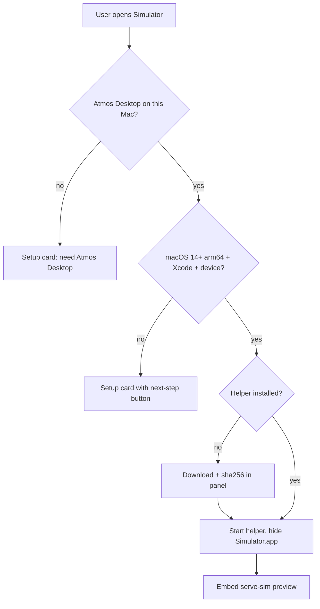

# PRD · APP-060: Vendor serve-sim

> Product Requirements · WHAT and WHY. Settled direction for local iOS Simulator inside Atmos Desktop by embedding a vendored serve-sim preview.

## Context

- **Problem**: Users building iOS / Expo apps in Atmos still leave the workspace to poke Simulator.app. A previous attempt drew a custom phone shell on top of `@expo/serve-sim` and bundled Node into the app; it was fragile and looked wrong.
- **Why now**: serve-sim is Apache-2.0, already has the preview (devices, Home, rotate, tap, AX). Vendoring it and binding loopback makes that page safe to embed. Compiling a binary makes on-demand install under `~/.atmos` possible.
- **Related specs**: inherits the *intent* of the abandoned workspace-simulator work (local Simulator + Desktop entry + setup cards). Overturns its D2 custom canvas, D3 App Resources helper, and “do not embed preview”. Does not depend on that branch.

## Goals

1. Primary — from a workspace in Atmos Desktop on an Apple Silicon Mac with Xcode, the user opens Simulator, Atmos downloads the helper if needed, starts it, and the serve-sim preview fills the panel.
2. Secondary — missing environment is a setup card with a real next step, never a blank panel. Disconnecting kills only our process. Hosted Web tells the truth: you need Desktop.

## Users & Scenarios

- **Primary persona**: Agentic Builder on a Mac, iterating on an iOS / Expo app inside an Atmos workspace.
- **Key scenarios**:
  1. First open on a clean Mac: click Simulator → in-panel download → preview appears. No success toast.
  2. Second open: cached binary, preview in a couple of seconds.
  3. Xcode / runtime / arch missing: a setup card names the gap and offers a button (Install Xcode, not a shell dump).
  4. Hosted `app.atmos.land`: same entry, card says this needs Atmos Desktop.

## User Stories

- As a Desktop user, I want the live Simulator inside my workspace so I do not context-switch to Simulator.app.
- As a Desktop user, I want device switch / Home / rotate / tap / AX from the preview I already know, not a second Atmos chrome.
- As a first-time user, I want a download I can see and retry, not a silent fail.
- As a user without Xcode, I want to be told what to install, not a white panel.
- As a hosted-web user, I want to be told to use Desktop, not a fake cloud Simulator.
- As an agent later, I want the same preview/helper the human is looking at — not a second capture pipeline.

## Functional Requirements

### Must Have

- **M1**: Desktop entry “Simulator” opens a single center-stage tab per workspace.
- **M2**: If the helper binary is missing, download it in the panel with progress; checksum-verify; retry on failure. No success toast.
- **M3**: After the helper is present, start it and embed the serve-sim preview (`url` from its state file, or `http://127.0.0.1:<port>/?device=<udid>`).
- **M4**: Device list, tap, Home, rotate, and AX live in the embedded preview. Atmos does not ship a phone shell, MJPEG canvas, or custom HID toolbar as the main path.
- **M5**: One helper per workspace or project (contexts are isolated). The same context never runs two helpers. Switching models in that preview still happens in the serve-sim UI.
- **M6**: Setup card (not a blank frame) when: not Desktop; not macOS; not arm64; Xcode / `simctl` missing; no iOS runtime / device. Each card has a real button for the next step.
- **M7**: Hosted Web never pretends to boot a Simulator. Copy: need Atmos Desktop.
- **M8**: `simctl boot` will raise Simulator.app. Before and after boot, hide those windows and return focus to Atmos. The user should not have to click Simulator.app.
- **M9**: Disconnect / close tab kills only the process Atmos started. Do not run `serve-sim --kill`.
- **M10**: Agent/CLI that must touch this Simulator in this phase uses the same running helper/preview. No second capture stack.
- **M11**: English UI is sentence case. `en.json` and `zh.json` both updated. No `npx` in copy.

### Nice to Have

- **N1**: Embed mode that hides the Tools column (AX still available via “open preview in browser”). 0.1.37 has no `--panes`; skip unless a later pin adds it.
- **N2**: “Open preview in browser” from the Atmos chrome.
- **N3**: Remember last UDID per workspace.

## Out of Scope

- **Android emulator** — different stack; not this spec.
- **Cloud / remote Simulator** — tunnel later; hosted Web is Desktop-only for this feature.
- **Embedding Simulator.app** — Apple does not allow it.
- **Custom Atmos phone shell / HID layer** as the main preview — that is the rejected path.
- **Runtime `npm install` / `npx serve-sim`** — vendor + GitHub Release only.
- **Cloudflare R2** for the binary — GitHub Releases only.
- **Deprecated Tauri `apps/desktop`** — Desktop work is `apps/desktop-electron` only.
- **Intel Macs** — setup card, no Intel binary in v1.
- **Spawning the helper from a cloud API process** — the API is not on the user's Mac.

## Success Metrics

- Leading: first-open on a ready Mac reaches an embedded preview without leaving Atmos.
- Leading: a Mac without Xcode shows a setup card with an Install action, never a blank iframe.
- Qualitative: device switch / Home / rotate work from the embedded page without an Atmos toolbar.

## Risks & Open Questions

- **Risk**: `/exec` is a host shell. Bound to `127.0.0.1` and gated by serve-sim's token + Origin checks. Do not strip it — the preview is that channel.
- **Risk**: bun-compiled binary still needs `serve-sim-native.node` beside it. Product still `exec`s a binary; we do not load the addon into Electron.
- **Open (TECH)**: exact Release tag / asset names; exact IPC names.

## Milestones

- Phase 1 — M1–M11: vendor, pack, Desktop download/spawn/iframe, setup cards, hide Simulator.app.
- Phase 2 — N1–N3, remote tunnel, agent CLI against the same helper.

