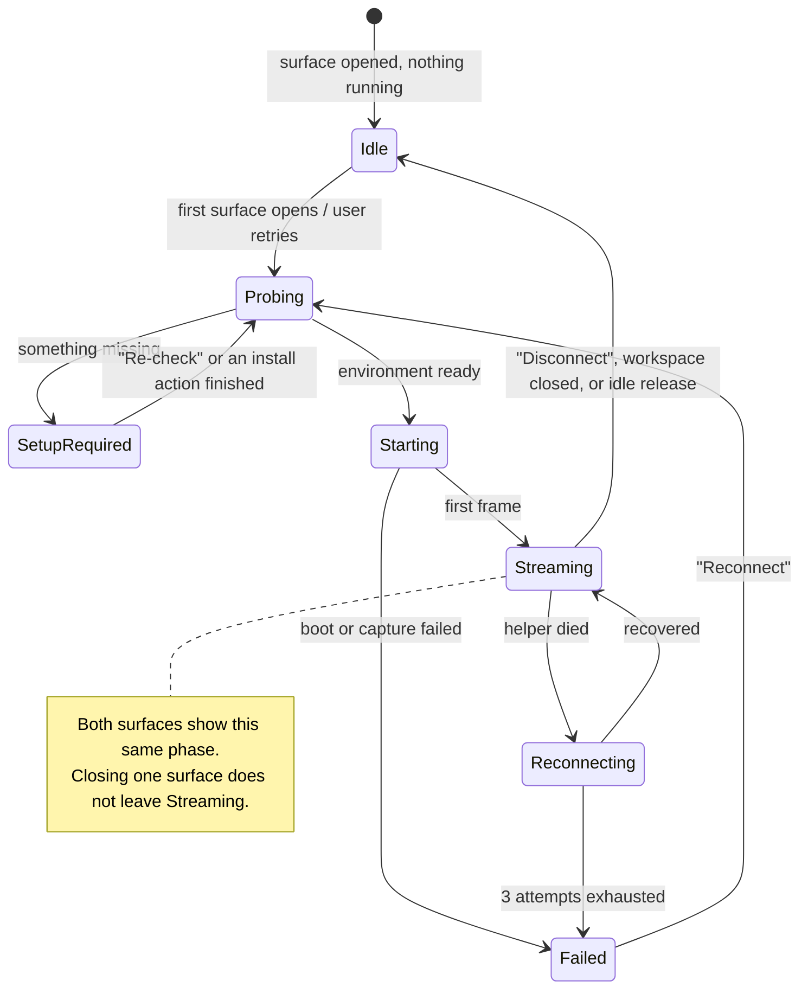

# PRD · APP-060: Workspace Simulator

> WHAT & WHY. Surface name: **Simulator** (`模拟器`) — one word everywhere, product copy included.
> Scope: local iOS Simulator on macOS 14+ arm64 inside Atmos Desktop, delivered as one branch.
> Decisions and measured dependency evidence: [BRAINSTORM.md](./BRAINSTORM.md). Design: [TECH.md](./TECH.md).

## One-liner

While developing an iOS app in an Atmos workspace, see and touch the running simulator **inside the workspace** — and let the agent touch the same screen the human is touching.

## Naming rules (product-facing)

| Rule | Detail |
|------|--------|
| The surface is **Simulator** / `模拟器` | Never "device", "phone", "mobile", or "emulator" in UI copy, tab labels, settings rows, CLI help, or docs |
| Apple's application is always **`Simulator.app`** | Written with `.app` so it can never be confused with our surface |
| i18n namespace is `simulator.*` | `apps/web/messages/en.json` and `apps/web/messages/zh.json` change together, and the Chinese strings are localized rather than copied English |
| English labels use sentence case | `Simulator`, `Disconnect`, `Shut down simulator`, `Open in simulator` — never ALL CAPS |
| Apple's own CLI vocabulary may appear verbatim in *observed facts* | e.g. a runtime identifier or `simctl` device-type string shown as diagnostic text |

## Users and stories

| User | Story |
|------|-------|
| iOS developer | "I change RN code in the worktree and see the result without leaving Atmos or hunting for the `Simulator.app` window." |
| iOS developer, cold machine | "My Mac has no iOS runtime. Atmos tells me exactly what's missing and gives me the button, instead of a wall of shell commands." |
| Agent | "I can list simulators, tap, type, gesture, and take a screenshot on the same stream the human sees, so I can verify my own change." |
| Reviewer | "Someone else's workspace opens on my machine and the Simulator surface either works or explains itself; it never shows a black rectangle." |

## Must have

| Id | Requirement |
|----|-------------|
| **M1** | Two entry points into one session: a right-sidebar tab **Simulator** (visibility toggle in Settings, default on) and an openable/closable center-stage surface tab **Simulator**. Both show the same phase, the same simulator, and the same stream. Opening the second surface never starts a second capture process. |
| **M2** | One active simulator per workspace (worktree). Switching replaces the active one on both surfaces. Two workspaces — and two Desktop instances — cannot claim the same simulator; the second attempt is refused with a named holder and an explicit "take over" action. |
| **M3** | Opening a surface probes the local environment first. Anything missing stops on an Atmos setup card that states the observed facts (macOS version, Xcode path, runtimes, simulators) and offers 1–2 real buttons. No shell snippet is ever the primary call to action, and probing never boots anything. |
| **M4** | When the environment is ready, one action streams the simulator: last-used for this workspace, otherwise a sensible default iPhone (created if none exists). `Simulator.app` windows are hidden and Atmos is brought forward. |
| **M5** | Pixels and input in the panel: tap, drag/swipe, scroll, keyboard, plus Home / lock / rotate / disconnect controls. Input coordinates are normalized `0–1` and identical to the agent's coordinate space. |
| **M6** | Agent CLI `atmos simulator` with `list`, `attach`, `tap`, `type`, `gesture`, `button`, `rotate`, `screenshot`, `ax`, `logs`, `kill` — `--json` for every verb. The agent drives the **same** session as the panel. |
| **M7** | Failure is always explained and never black: capture-vs-Xcode mismatch, WebRTC that cannot connect, a crashed helper, an unsupported macOS version or architecture, a non-macOS machine, and hosted web without Atmos Desktop each have a named state with a next step. During any fallback the last frame or a skeleton stays on screen. |
| **M8** | The capture helper is never exposed beyond this machine, never reachable without the session token, and the user is never asked to start or install it. The feature asks for **at most one** macOS permission — the Automation grant used to hide `Simulator.app` windows — and it is attributed to Atmos. |
| **M9** | Resource behaviour is bounded: at most 2 warm sessions per machine, hidden surfaces throttle the stream, and a fully hidden session is released after an idle period without shutting the simulator down. |
| **M10** | For Expo / React Native worktrees only: **Open in simulator** starts Metro in a visible terminal pane in that worktree, installs, and launches on the active simulator. |

## Nice to have (not acceptance)

| Id | Item |
|----|------|
| N1 | Remember per-workspace simulator *and* orientation |
| N2 | `atmos simulator event-log` passthrough for richer agent debugging |
| N3 | Drag a file from the workspace onto the simulator |
| N4 | A "busy elsewhere" affordance that deep-links to the holding workspace |

## Out of scope

| Item | Why |
|------|-----|
| **Android emulators and physical Android devices** | No installable Expo-published capture package exists; the unscoped npm name belongs to a third party. Separate spec — [BRAINSTORM D4](./BRAINSTORM.md#d4-android) |
| **Remote Mac host** for non-macOS workspaces | Needs a new Relay stream class; only useful after local capture works. Separate spec — [BRAINSTORM D5](./BRAINSTORM.md#d5-remote-mac-host) |
| iOS physical devices | The helper captures a simulator framebuffer |
| Intel Macs and macOS < 14 | The pinned helper is arm64 with `minos 14.0` ([BRAINSTORM C1](./BRAINSTORM.md#c1--native-addon-abi-node-api-loads-under-electron)) |
| Shipping iOS system images, or replacing the Xcode Platforms installer | Size and license |
| Embedding `Simulator.app` in a window | Not permitted by Apple |
| Embedding `expo-device-hub`, or depending on `@expo/hub-*` | Wrong product surface; packages unpublished |
| A second frame-capture protocol (screenshot polling, window grabbing) | Explicit non-goal |
| Multiple simultaneously active simulators per workspace | One; others are listed and switchable |
| Simulator farm / cloud simulators | Not our product |
| Camera injection, CoreAnimation debug flags | Upstream supports them; not exposed here |
| The surface on Canvas | Workspace surface, not a canvas card |
| Hosted web (no Atmos Desktop) | Shows a "Requires Atmos Desktop" state by design |

## User-visible states

## Setup card content rules

One card shape for every state: **title** (what happened) → **reason** (the one specific missing thing) → **observed facts** (read-only: macOS version, architecture, Xcode version, `xcode-select -p`, installed runtimes, available simulators) → **1–2 primary buttons** → secondary "Re-check".

| State | Primary action |
|-------|----------------|
| No `xcrun simctl` | Open the Xcode download page (system browser); secondary: install Command Line Tools |
| Xcode present, no iOS runtime | Open Xcode → Settings → Platforms |
| No bootable iPhone | Create a default iPhone — no trip to `Simulator.app` → Devices |
| Capture incompatible with this Xcode | Check for an Atmos update; explain that capture uses Xcode private API and ships with the app |
| Capture helper missing from the install | Reinstall Atmos — a damaged install, not a user-fixable state |
| Unsupported architecture or macOS version | State that Apple Silicon and macOS 14+ are required |
| Not macOS | State that iOS simulators only run on macOS; no hint that Xcode could be installed here |
| Hosted web, no Atmos Desktop | State that the Simulator surface needs Atmos Desktop |

Rules for all of them: no `xcrun …` / `sdkmanager …` string as the primary CTA; no generic terminal drop-out; the button either performs an Atmos-wrapped action with progress in the card, or opens the right system location. The word `npx` never appears in UI copy.

## Feedback style

Status is inline in the panel and its toolbar. No success toasts for connect, disconnect, rotate, or take-over — the surface itself is the feedback. Toasts are reserved for background failures the panel cannot show.

## Success metrics

| Metric | Target |
|--------|--------|
| Warm machine (simulator already booted) → first frame | < 3 s |
| Cold machine (simulator needs booting) → first frame | < 45 s, and never a silent wait — `Starting` shows progress |
| Missing-prerequisite states that end on a card with a working button (no terminal) | 100 % |
| Black-screen occurrences during any documented fallback | 0 |
| Agent tap → visible change on the human's surface | same stream, no second helper process |

## Dependencies

| Dependency | Note |
|-----------|------|
| Atmos Desktop (Electron), macOS 14+ arm64 | Host; `apps/desktop-electron` |
| Xcode + at least one iOS runtime | User-installed; Atmos only probes and guides |
| `@expo/serve-sim` (pinned) | Capture helper, **bundled in the app** — [TECH §4](./TECH.md#4-capture-helper-distribution). No new entitlement and no extra user authorization — [TECH §13.1](./TECH.md#131-code-signing-and-entitlements-nothing-new-required), [§13.2](./TECH.md#132-user-authorization-exactly-one-prompt-on-atmos) |
| [APP-052](../APP-052_desktop-use/TECH.md) | Automation TCC grant UX to reuse for hiding `Simulator.app` windows |
| [APP-016](../APP-016_atmos-computer/TECH.md) | Only for the future remote-Mac spec, not here |
