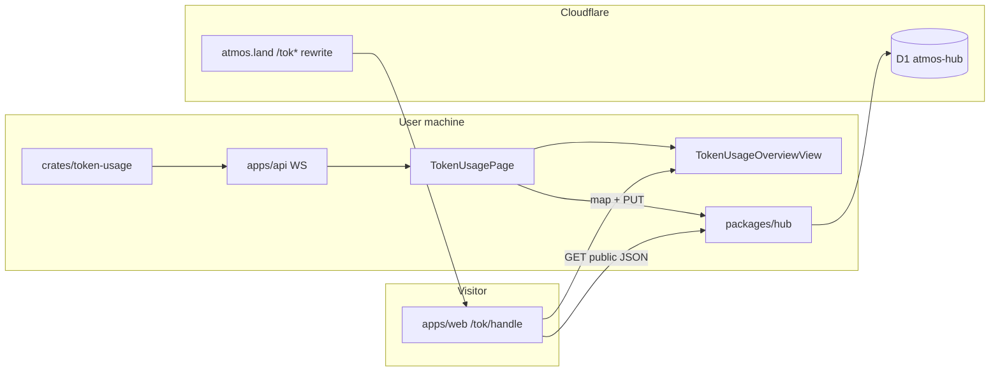

# TECH · APP-061: Token Usage public share

> Technical Design · HOW. Implements PRD APP-061 (M1–M12). N1–N2 optional in the same surfaces if cheap.

## Scope summary

Addresses **M1–M12**. Does **not** implement APP-056 `/s/{share_id}` landing routes, handle rename, multi-share CRUD as a product, or a new shared package.

Touches: `packages/hub` (D1 profile + public JSON), `packages/hub-client` (publish/read helpers), `apps/web` (view extract + `/tok/[handle]` + Token Usage publish UI). No `crates/*` changes. No Relay routes.

Hub HTTPS is the correct transport: the visitor has no local Server / `/ws`. Local overview stays the existing `token_usage_overview_get` WebSocket action.

## Locked decisions

1. User-visible URL: `https://atmos.land/tok/@{handle}` (unlisted: `?k=`).
2. One live document per `user_id`; upsert; manual write only.
3. Handle claimed once (`handle_claimed_at`). Auto-derived APP-056 handles are **not** public until claimed.
4. Charts live only in `apps/web`. Public route is also `apps/web`. No `packages/usage-share-view`.
5. `atmos.land/tok/*` is a Cloudflare rewrite/proxy onto the web Pages project so the address bar stays `atmos.land` (see Routing).
6. Ranking storage: **top 5 + `other`**, percentages against **full** summary totals.
7. Avatar is a stored URL copy of Better Auth `user.image` at publish time; not a link on the public page.

## Architecture overview



| Host | Package | Role |
|------|---------|------|
| `hub.atmos.land` | `packages/hub` | Auth, profile claim, snapshot upsert, public JSON |
| `app.atmos.land` | `apps/web` | Product UI + canonical `/tok/[handle]` implementation |
| `atmos.land` | landing + **path rewrite** | Marketing; `/tok*` served as the web public page |

## Module-by-module design

### packages/hub

- Extend `user_profiles` (see Data model). Stop treating `ensureProfile`’s auto slug as a public handle.
- Replace product use of multi-row `usage_shares` with **one snapshot on the profile** (or a 1:1 row keyed by `user_id` — pick profile columns to avoid two sources of truth).
- Owner routes (cookie or device Bearer via `requireUser`):
  - `GET /v1/me` — add `image` (Better Auth `user.image`).
  - `PUT /v1/me/usage-page` — claim handle (first time), visibility, socials, `include_cost`, snapshot.
  - `POST /v1/me/usage-page/unlisted-secret` — mint/rotate `k` (N1; may ship with Phase 1 because unlisted needs an initial secret).
  - `DELETE /v1/me/usage-page` — visibility `off`, drop snapshot + secret hash.
- Public (unauthenticated):
  - `GET /v1/public/tok/:handle?k=` — 404 if unclaimed, off, or unlisted without valid `k`. `Cache-Control: private, no-store`.
- Server **allowlist-normalize** the snapshot (do not trust client-only redaction). Keep `packages/hub/src/redaction.ts` but switch from denylist-only to the schema below.
- Handle write: `UNIQUE` + catch constraint → `409 username_taken`. Do not rely on a pre-check.

**REST justification**: Hub is already the hosted control plane (APP-056). Public readers and Desktop device-Bearer publishers cannot use local `/ws`.

### packages/hub-client

- `hubMe()` type gains `image`.
- Add `hubGetUsagePage()`, `hubPutUsagePage()`, `hubDeleteUsagePage()`, `hubMintUsagePageSecret()`.
- Add unauthenticated `hubGetPublicTok(handle, k?)` for the public route (or a tiny `fetch` in the page — prefer hub-client so the base URL stays one place).

### apps/web — view extract (M8)

Move, do not copy, the chart stack out of `app-shell` into a feature folder:

```text
apps/web/src/features/token-usage/
  TokenUsageOverviewView.tsx    # today’s OverviewTab + derived series now in-page
  token-usage-dialog-utils.ts
  token-usage-share-payload.ts  # overview → SharePayload (top-5 + other)
  TokenUsagePage.tsx            # local chrome: consent, PNG, publish
```

`TokenUsagePage` keeps WS fetch (`useTokenUsageQuery`), cookie banner, PNG popover, publish controls.

`app/tok/[handle]/page.tsx` (locale-aware if the app router requires it) fetches Hub public JSON and renders:

```text
PublicTokShell
  header: avatar + @handle | social chips
  <TokenUsageOverviewView data={payload} />
  footer: Generated {date} · Generated by Atmos
```

View input is **`TokenUsageSharePayload`**, not the full `TokenUsageOverviewResponse`. Local publish and the public page share that type. Inflate to the existing util day-shape inside the view/mapper so heatmap/stacked/mix keep current behavior.

Do **not** add `packages/usage-share-view`. Future session-share pages get their own feature folder and may reuse only a small `PublicShareFrame` (logo/handle/`k`/footer) **after** a second type exists.

### apps/web — publish UI (M2–M6, M11)

On local Token Usage toolbar (near existing PNG share), signed-in section:

- Handle input with prefix `atmos.land/tok/@`, placeholder `builder`. After claim: read-only `@handle`.
- Visibility: Off / Public / Unlisted.
- Unlisted: show/copy full URL including `k` once; store hash on Hub.
- Optional X / GitHub username fields with locked prefixes `x.com/` and `github.com/`.
- Include cost toggle (default off).
- **Publish** / **Update** / **Turn off**.

Signed out: CTA to existing Hub sign-in.

i18n: `apps/web/messages/en.json` + `zh.json`. English sentence case. Footer: `Generated {date} · Generated by Atmos` / `{date} · 由 Atmos 生成` with Atmos as `<a href="https://atmos.land">`.

### apps/landing

No Token Usage chart implementation. Optional: if the rewrite is not ready, a tiny `/tok/:handle` on landing that **302s** to the web URL is a last-resort fallback — not the product copy.

### crates / apps/api

No change. Local overview stays `token_usage_overview_get`.

## Data model

### Hub D1 — `user_profiles` (Drizzle migration)

```sql
-- Conceptual. Implement via Drizzle; keep user_id PK.
ALTER TABLE user_profiles ADD COLUMN handle_claimed_at INTEGER;
ALTER TABLE user_profiles ADD COLUMN avatar_url TEXT;
ALTER TABLE user_profiles ADD COLUMN github_username TEXT;
ALTER TABLE user_profiles ADD COLUMN x_username TEXT;
ALTER TABLE user_profiles ADD COLUMN usage_visibility TEXT NOT NULL DEFAULT 'off';
-- 'off' | 'public' | 'unlisted'
ALTER TABLE user_profiles ADD COLUMN unlisted_token_hash TEXT;
ALTER TABLE user_profiles ADD COLUMN include_cost INTEGER NOT NULL DEFAULT 0;
ALTER TABLE user_profiles ADD COLUMN snapshot_json TEXT;
ALTER TABLE user_profiles ADD COLUMN snapshot_updated_at INTEGER;
```

- `handle` becomes **nullable**. `UNIQUE` remains (SQLite allows multiple NULLs).
- `ensureProfile` may still insert a row, but **must not** claim a public handle. Existing auto slugs: leave `handle_claimed_at` NULL so `/tok/@that` 404s until the user claims (they may claim the same string).
- Stop using `primary_share_id` / `profile_public` for this product. Leave columns if present; do not teach new code to read them.
- `usage_shares` multi-row API is **not** the product path. Do not create additional rows. Optional follow-up: stop exposing `POST /v1/usage/shares` in UI (may keep for compatibility tests).

### Handle rules (M3)

| Rule | Value |
|------|--------|
| Charset | `^[a-z0-9_]{3,24}$` after trim + lowercasing |
| Placeholder | `builder` (not reserved) |
| Reserved | `atmos`, `admin`, `tok`, `api`, `s`, `u`, `me`, `public`, `www`, `login`, `auth`, `settings`, `support`, `help`, `about`, `legal`, `blog`, `docs` |
| Claim | First successful `PUT` with a handle sets `handle` + `handle_claimed_at` |
| Later | Different handle → `403 handle_immutable` |
| Conflict | Unique violation → `409 username_taken` |

### Social usernames (M11)

Store **username only**. Strip leading `@` and URLs. Reject anything that is not the site’s username charset. Server builds `https://x.com/{u}` and `https://github.com/{u}`. Empty string → NULL. Do not copy GitHub OAuth login automatically.

### Avatar (M9)

On publish/update, copy `user.image` into `user_profiles.avatar_url`. Public page uses that URL (`referrerPolicy=no-referrer`). On error / missing: first letter of handle. Do not upload the bitmap to R2 in v1.

### Snapshot JSON — `TokenUsageSharePayload`

`schema_version: 2` (APP-056 v1 allowlist was never the public product). Max **256 KiB** UTF-8. Hub drops unknown keys.

```ts
type TokenUsageSharePayload = {
  schema_version: 2;
  generated_at: number;
  summary: {
    total_tokens: number;
    total_messages: number;
    active_days: number;
    range_start: string | null;
    range_end: string | null;
    client_count: number;
    model_count: number;
    total_cost_usd?: number; // only if include_cost
    mix: {
      input: number;
      output: number;
      cache_read: number;
      cache_write: number;
      reasoning: number;
    };
  };
  by_client: RankRow[]; // length ≤ 5
  by_model: RankRow[];  // length ≤ 5; include provider_id
  by_day: Array<{
    date: string; // YYYY-MM-DD
    total_tokens: number;
    message_count: number;
    total_cost_usd?: number;
    breakdown: {
      input: number;
      output: number;
      cache_read: number;
      cache_write: number;
      reasoning: number;
    };
    agents: DimRow[]; // top 5 agent keys + other
    models: DimRow[]; // top 5 model keys + other
  }>;
};

type RankRow = {
  id: string;
  total_tokens: number;
  message_count: number;
  provider_id?: string;
  total_cost_usd?: number;
};

type DimRow = {
  id: string; // client_id, model_id, or "other"
  total_tokens: number;
  cost_usd?: number;
};
```

**Top-N mapper** (`token-usage-share-payload.ts`):

- `N = 5` (matches `slice(0, 5)` in `token-usage-dialog-utils.ts`).
- Rank `by_client` / `by_model` by `total_tokens` (and include cost-rank keys in the union when `include_cost`).
- Daily `agents` / `models`: only those keys; residual tokens/cost go to `id: "other"`.
- `summary.total_*` and `client_count` / `model_count` are **full** totals so share % and “N models” stay honest.
- Drop: `query`, cookie consent, `partial_warnings`, `by_month`, `available_years` (derive years from `by_day`), per-row token mix on dim rows, long-tail names.

If `include_cost` is false, strip every cost field before persist **and** before public serve.

### Unlisted secret

- Mint 128+ bits (`k_…` hex/base64url).
- Store **SHA-256** hex in `unlisted_token_hash`. Compare in constant time.
- Public GET: visibility `unlisted` requires `k` query (or `/k_{secret}` if we add it later — v1 = `?k=`).
- Do not put `k` in OG canonical, logs, or `Referer` via outbound footer links (`rel="noreferrer"`).
- Rotate (N1 / Phase 1 if unlisted ships): new plaintext once; old hash replaced.

## Transport

### Owner `PUT /v1/me/usage-page`

Auth: `requireUser`.

```json
{
  "handle": "builder",
  "visibility": "public",
  "include_cost": false,
  "github_username": "alice",
  "x_username": "alice",
  "snapshot": { "schema_version": 2 }
}
```

Response:

```json
{
  "handle": "builder",
  "url": "https://atmos.land/tok/@builder",
  "visibility": "public",
  "unlisted_secret": null,
  "updated_at": 0
}
```

On first transition to `unlisted`, include `unlisted_secret` once (or require the mint route first). Never echo the secret again.

### Public `GET /v1/public/tok/:handle`

`:handle` with or without leading `@`. 404 for unknown / unclaimed / `off` / bad `k`. Body:

```json
{
  "handle": "builder",
  "avatar_url": "https://…",
  "github_username": "alice",
  "x_username": null,
  "visibility": "public",
  "include_cost": false,
  "generated_at": 0,
  "snapshot": { }
}
```

### Local WS

Unchanged: `token_usage_overview_get`.

## Public page + routing (M12)

Route in `apps/web`: `/tok/[handle]` (normalize `@`). Unauthenticated. `generateMetadata` uses the public JSON (N2 if cheap).

**Production hostname**

1. Implement and dogfood on `https://app.atmos.land/tok/@handle`.
2. Add a Cloudflare Worker (or landing `_worker` / path route) on `atmos.land`:
   - Match `/tok*` (and only those HTML navigations).
   - Reverse-proxy to the web Pages origin.
   - Rewrite HTML asset URLs to absolute `https://app.atmos.land/…` so `/_next` does not 404 on `atmos.land`.
   - Do **not** 302 for the happy path (OG + copy stay `atmos.land`).
3. If rewrite + asset prefix cannot be made reliable in the same milestone, ship a **temporary 302** and keep product copy aimed at `atmos.land` once rewrite lands. Do not document `hub.atmos.land/tok`.

Public GET and HTML: `Cache-Control: private, no-store`.

## Security

| Topic | Rule |
|-------|------|
| Snapshot | Server allowlist + 256 KiB + array caps (e.g. 800 days, 5+other dims) |
| Handle | Immutable after claim; unique; reserved list |
| Unlisted | Hash at rest; 404 on mismatch (do not leak “exists but private” vs “unknown” if cheap — same 404) |
| Avatar | Store HTTPS URL only; `` with nosniff-friendly host; fallback on failure |
| Social | Username allowlist; never store free-text hrefs |
| Cookies | Public page does not require Hub session |
| Logs | No `k`, no device credentials |

## Rollout

1. Drizzle migration: nullable handle, claim + snapshot + social columns.
2. Hub: claim/upsert/public GET + tests (`packages/hub/test`).
3. Slim mapper + unit tests in `apps/web`.
4. Move overview view to `features/token-usage`; local page still works.
5. Publish controls on Token Usage; hub-client helpers; `/v1/me` image.
6. Public `/tok/[handle]` shell + view.
7. Cloudflare rewrite `atmos.land/tok*`; verify OG/address bar.
8. Turn off / unlisted / update paths; i18n.

Each step 1–6 is mergeable without the rewrite.

## Risks & tradeoffs

- **Risk**: `atmos.land` rewrite breaks `/_next` assets. **Mitigation**: rewrite asset URLs to `app.atmos.land`; dogfood that host first.
- **Risk**: Auto-derived APP-056 handles look public. **Mitigation**: `handle_claimed_at` gate.
- **Tradeoff**: `?k=` can leak via Referer/history. Accepted for v1; footer uses `noreferrer`; N1 rotate.
- **Tradeoff**: Top-5 by tokens may not be top-5 by cost. Union of keys when cost is included.
- **Tradeoff**: Snapshot on `user_profiles` vs `usage_shares`. **Choose profile** so handle + socials + blob are one row.
- **Rollback**: `usage_visibility=off` or revert Worker route; local Token Usage unaffected.

## Dependencies & compatibility

- Depends on APP-056 Hub auth + `requireUser`.
- Supersedes APP-056 share **product** (landing `/s`, `/u`, multi-share, renameable handle).
- Respects APP-050: no new package.
- Hub `NEXT_PUBLIC_ATMOS_HUB_URL` already required for accounts.

## Open questions

- [ ] Worker vs landing `_worker` for the rewrite — pick at implement time; user-visible URL does not change.
