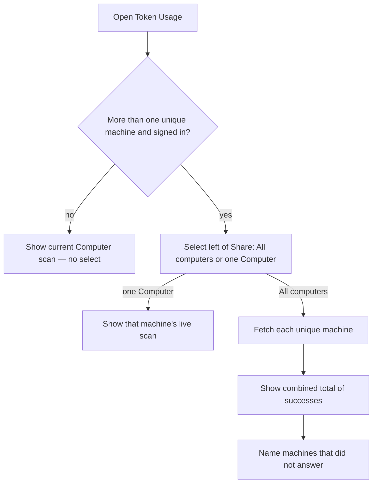
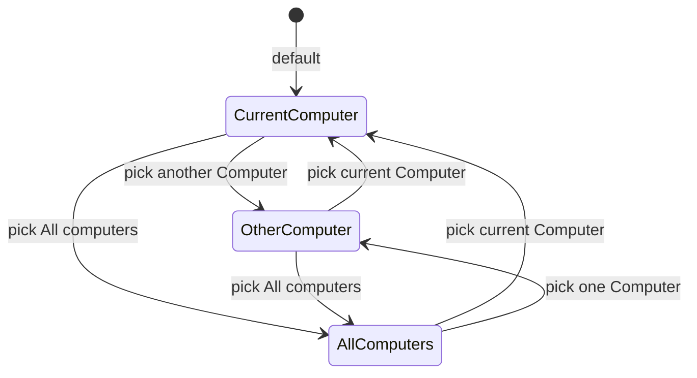

# PRD · APP-063: Token Usage Computer scope

> Product Requirements · WHAT and WHY. Token Usage can show one Atmos Computer or a unique-device total across the account, without switching the workbench Computer.

## Context

- **Problem**: Token Usage is a **live scan of the connected Computer**. A user with a laptop, a desktop, and a VPS only sees the machine they are attached to. Adding the numbers by hand (or switching Computer in the header) is the workaround. The same physical machine can also be registered more than once, so a naive “sum every Computer” would **double-count** one scan.
- **Why now**: Hub accounts already own a list of Atmos Computers (APP-016 / APP-056). Relay can reach those machines. Token Usage still ignores that list.
- **Related specs**:
  - [APP-016](../APP-016_atmos-computer/PRD.md) — Atmos Computer identity and Relay sessions.
  - [APP-056](../APP-056_usage-share-and-accounts/PRD.md) — Hub account owns Computers; **no** continuous usage ingest (that option stays deferred).
  - [APP-061](../APP-061_token-usage-public-share/PRD.md) — local Token Usage + Share/publish. This spec **does not** change the public URL shape; it changes **which overview** the in-app page (and therefore a publish) is looking at.

## Goals

1. **Primary** — On Token Usage, pick **All computers** or one Computer and see the matching live scan.
2. **Primary** — **All computers** is a total of **unique physical machines**, not a sum of every Computer row.
3. **Primary** — Changing this select **does not** change the workbench Computer (terminals, projects, canvas stay put).
4. **Secondary** — Signed-out / single-machine Token Usage stays exactly as it is today.

## Users & Scenarios

- **Primary persona**: Signed-in agentic builder who runs Atmos on more than one machine.
- **Secondary persona**: Same user on a single machine, or signed out — they must not be blocked or confused by empty Computer chrome.

### Key scenarios

1. Builder opens Token Usage on the laptop. Charts are the laptop, as today. They open the select left of Share, pick the desktop Computer, and see **that desktop’s** scan. The laptop workbench stays connected.
2. They pick **All computers**. Charts become the combined unique-device total. One VPS is asleep; totals still appear for the machines that answered, and the page says the VPS was not included.
3. The laptop was re-registered and appears twice in the account Computer list. All computers and the select still treat it as **one** machine.
4. Signed-out, or an account with only one unique machine: no select; Token Usage is unchanged.

Workbench Computer connection is **not** in this state machine.

## User Stories

- As a multi-machine builder, I want to read another Computer’s Token Usage without leaving my current workbench, so I can compare machines without dropping terminals.
- As a multi-machine builder, I want an **All computers** total of unique machines, so I can see my real usage instead of one box.
- As a multi-machine builder, I want All computers to still show a number when some machines are offline, so a sleeping VPS does not hide the machines that did answer.
- As a multi-machine builder, I want the same physical machine counted once, so a re-register does not inflate the total.
- As a signed-out or single-machine user, I want Token Usage to look and work as it does today.

## Functional Requirements

### Must Have

- **M1 · Local-first**: Signed out, offline, or a single unique machine: Token Usage (charts, year / metric / dimension, cookie consent on the current Computer, PNG share, publish chrome) behaves as today. No Computer select.
- **M2 · Select placement**: When the select is shown, it sits **immediately to the left of Share** on the Token Usage toolbar. It does not replace Share.
- **M3 · Select options**: First option is **All computers** (English sentence case; other locales translate the surrounding words, keep **Computer** as the product noun where that locale already does). Then one option per **unique machine**, labeled with the Computer display name. The current Computer is in the list. Duplicate registrations of the same machine collapse to one option.
- **M4 · Page-local scope**: Changing the select changes **only** Token Usage data. Header / Settings Computer, projects, terminals, and canvas stay on the workbench Computer.
- **M5 · Current Computer**: Default selection is the **current** Computer. That view uses the existing live connection. No extra remote hop.
- **M6 · Other Computer**: Picking another Computer shows a **live scan of that machine**, reached through Relay. The workbench connection does not move. Cookie consent / browser-cookie enrichment for the viewing browser is **not** applied to a Computer that is not the current one.
- **M7 · All computers**: Picking All computers shows one merged overview across **unique machines** in scope:
  - Every distinct physical machine in the account Computer list.
  - Plus the current local Computer when it is **not** already that same machine (unregistered Desktop still counts).
- **M8 · Device uniqueness**: Uniqueness is the **physical machine**, not each Computer registration. Same machine, multiple Computer rows → one scan, one select option, one term in All computers.
- **M9 · Partial All computers** (settled): Machines that answer contribute to the total. Machines that are offline, refuse, or time out are **omitted** from the numbers and **named** as not included. The page does not fail the whole All computers view, and it does not invent a cloud “last known” snapshot for the misses.
- **M10 · Other Computer unreachable**: Picking a single Computer that cannot be reached is an **error for that view** (clear that this Computer did not answer). It must not silently show another machine’s scan.
- **M11 · Share follows the page**: PNG share and APP-061 publish/update use the **overview currently on screen** (current Computer, other Computer, or the partial All computers total). Public URL shape is unchanged (still one snapshot per user).
- **M12 · Selector visibility**: Show the select only when the user is signed in **and** there are at least **two unique machines** in scope (M7). Otherwise hide it.

### Nice to Have

- **N1 · Remember last select** for this account on this client (All computers vs a Computer), restoring on the next Token Usage visit.
- **N2 · Retry only the machines that failed** in All computers, without re-scanning successes.
- **N3 · Dedup the Settings / header Computer list** by the same physical-machine rule (Token Usage must not wait on this).

## Out of Scope

- **Switching the workbench Computer from Token Usage** — header/Settings already do that; this page only changes usage scope.
- **Continuous Hub / Relay usage ingest** — APP-056 Option D stays deferred; All computers is a live fan-out, not a stored rollup.
- **Quota Usage** — this is Token Usage only.
- **Changing APP-061 URL, handle, or snapshot schema** beyond “the snapshot is whatever the page is showing”.
- **Mobile-first Token Usage Computer select** — web/desktop Token Usage; mobile can follow later.
- **Team / org rollup** across other people’s Computers.
- **Billing-grade reconciliation** — this remains an on-disk agent/CLI scan, now unioned across machines.
- **Applying this Computer’s browser cookies to another Computer’s scan**.

## Success Metrics

| Metric | Direction |
|--------|-----------|
| Single-machine / signed-out | Token Usage still matches today’s charts with no new chrome |
| Other Computer | User can read a second machine’s usage without the workbench Computer changing |
| All computers | Unique-machine total; a duplicate registration does not inflate tokens |
| Partial All | At least one reachable machine still renders charts; missed Computer names are visible |
| Share | PNG / publish of All computers (or another Computer) matches what the page showed |

## Risks & Open Questions

| Item | Notes |
|------|--------|
| **Risk**: All computers looks complete when a large machine is offline | M9 names misses; copy must not say “all time, all machines” if any were skipped |
| **Risk**: Two Computers share a display name | Uniqueness is still the physical machine; TECH may suffix only if labels collide |
| **Risk**: Share of a partial All computers is published as the public page | M11 is explicit; Update copy should not imply every machine was included if the in-app view said otherwise |
| **Open (TECH)**: How the client talks to a Computer that is not the workbench connection | Product requires live scan over Relay; session vs other transport is TECH |
| **Open (TECH)**: How unique-machine identity is read from the Computer list | Product requires physical-machine uniqueness; wire field is TECH |

BRAINSTORM forks:

| Fork | Decision |
|------|----------|
| 1 Page-local vs workbench switch | **Page-local** (M4) |
| 2 Live Relay vs Hub ingest | **Live Relay** (M6, M7); Hub ingest out of scope |
| 3 Physical machine vs Computer row | **Physical machine** (M8) |
| 4 Partial vs fail vs last-known | **Partial + named misses** (M9) — confirmed |
| 5 Default | **Current Computer** (M5) |
| 6 Share scope | **Whatever the page shows** (M11) |
| 9 Select visibility | **Signed in and ≥ 2 unique machines** (M12) |
| Cookie consent on remote | **Not applied** (M6) |
| Unregistered local in All | **Included** (M7) |
| 7, 8 Transport, representative picker | **TECH** |

## Milestones

- **Phase 1**: M1–M12 — select, page-local live fetch, unique-device All computers, partial misses, share follows the page.
- **Phase 2**: N1 remember select; N2 retry misses; N3 Settings/header dedup if we want the same uniqueness elsewhere.
