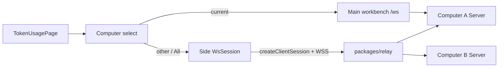
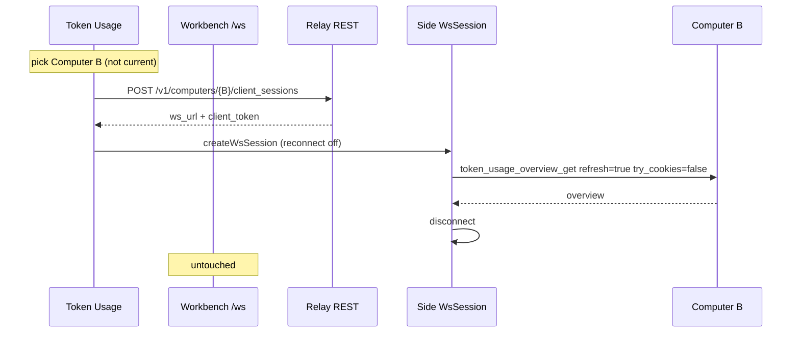

# TECH · APP-063: Token Usage Computer scope

> Technical Design · HOW. Implements PRD APP-063 (M1–M12). N1–N3 deferred.

## Scope summary

Token Usage stays a **live per-Computer scan** (`token_usage_overview_get`). This spec adds a **page-local usage scope**: current Computer (existing main `/ws`), another Computer (short-lived **side** Relay `/ws`), or **All computers** (unique-device fan-out + client merge). No Hub usage store. No new usage REST. No workbench Computer switch.

Addresses **M1–M12**. N1 (remember select), N2 (retry misses), N3 (Settings/header dedup) are Phase 2.

## Architecture overview



Workbench Zustand WS (`apps/web/src/features/connection/hooks/use-websocket.ts`) **never** retargets. Side sessions are owned by Token Usage only.

| Layer | Change |
|-------|--------|
| `packages/relay` | `GET /v1/computers` returns `app_device_id`. Concurrent `client_sessions` per user+`server_id` (do not kick workbench/mobile). |
| `packages/relay-client` | `ComputerRow.app_device_id`. |
| `crates/runtime-manager` | Public `app_device_id()` for local identity. |
| `apps/api` | `GET /api/system/runtime-info` includes `app_device_id`. No new WS action. |
| `apps/web` | Unique-device helper, overview merge, side-session fetch, select + Query keys, i18n. |
| `crates/token-usage` | Unchanged scan. Merge is **client-side**. |



```mermaid
sequenceDiagram
  participant UI as Token Usage
  participant Main as Workbench /ws
  participant Fan as Fan-out pool
  Note over UI: All computers
  UI->>UI: unique devices by app_device_id
  UI->>Main: current device overview
  par other devices cap 3
    Fan->>Fan: side session + overview
  end
  UI->>UI: merge successes; name misses
```

## Module-by-module design

### packages/relay

**List (M8).** `GET /v1/computers` already filters by `user_id`. Extend the SELECT to include `app_device_id` (column from `0008_computer_app_device_id.sql`). No new migration. Null for pre-column rows is allowed.

**Concurrent sessions (M4, M6).** Today `POST /v1/computers/:id/client_sessions` does `DELETE FROM client_sessions WHERE server_id = ? AND user_id = ?` (`packages/relay/src/index.ts`). A Token Usage peek of Computer B would kick every other client of B for this user (workbench, mobile). ServerHub already multiplexes clients (`TAG_CLIENT_ALL`).

Change: **insert** a new session; do **not** delete live siblings. Cap **8** rows per `(user_id, server_id)`; delete oldest `created_at` when over cap. Revoke Computer still deletes all sessions for that `server_id`. Tests in `packages/relay/test/`.

Do **not** put usage merge in the Worker.

### packages/relay-client

`ComputerRow` in `packages/relay-client/src/types.ts`:

```ts
app_device_id: string | null;
```

`64` lowercase hex when present. Tests that fixture rows must include the field (null is fine).

### crates/runtime-manager + apps/api

Export `app_device_id()` from `crates/runtime-manager/src/device_identity.rs` (today `pub(crate) derive_app_device_id`). Add to `GET /api/system/runtime-info` in `apps/api/src/api/system/computer.rs`:

```json
{ "app_device_id": "<64 hex or null>" }
```

Null only if machine id is unavailable. This is existing **bootstrap REST**, not a new usage API. `LocalComputerStatus` in `apps/web/src/features/connection/lib/atmos-computer-local.ts` gains `app_device_id: string | null` for **loopback** status only. When workbench is Relay-attached, current device identity comes from the Computer list row, not this field.

### apps/web — uniqueness (M3, M7, M8, M12)

Pure helper `apps/web/src/features/token-usage/lib/unique-computers.ts`.

```ts
type DeviceKey =
  | `app:${string}`      // app_device_id
  | `server:${string}`   // legacy null app_device_id
  | `local:${string}`;   // unregistered local, not in any group

type UniqueComputer = {
  key: DeviceKey;
  serverId: string | null;       // representative; null only for unregistered local
  label: string;
  isCurrent: boolean;
};
```

**Grouping**

1. Start from `activeComputers(computers)` (drop revoked).
2. Key = `app:${app_device_id}` if it matches `/^[a-f0-9]{64}$/`, else `server:${server_id}`.
3. Representative in a group: prefer `online`, then max `last_seen_at` (null last), then max `created_at`.
4. Label = representative `display_name` (fallback `Computer`). If two groups share a label, suffix ` · {server_id.slice(0, 8)}`.

**Current + unregistered local (M7)**

- If workbench `selectedServerId` / `localServerId` matches a row, that row’s group `isCurrent`.
- Else if loopback `app_device_id` matches a group, that group `isCurrent` (re-register: new `server_id`, same device — do not add a second local).
- Else if a loopback Computer exists (Desktop / local API), append `local:{localServerId ?? "unregistered"}` with the local display name, `isCurrent: true`, `serverId: null`.

**Select visibility (M12):** Hub device credential present **and** `unique.length >= 2`. Otherwise no select (M1).

### apps/web — side session (M5, M6, M10)

New helper `apps/web/src/features/token-usage/lib/fetch-remote-token-usage.ts`.

- **Never** `createClientSession` for the workbench Computer’s `server_id` (M5). That would still churn sessions and can race the main `/ws`.
- Other Computer: `getWebRelayClient(…).createClientSession(serverId, { clientKind: workbenchRelayClientKind() })`.
- `createWsSession` from `@atmos/api-client/ws` with the same browser `platform` as `use-websocket.ts`, **`reconnect.enabled: false`**, `connectWaitMs: 15_000`, `requestTimeoutMs: 60_000` (scan can exceed the workbench 30s default).
- `session.request("token_usage_overview_get", { refresh: true, try_cookies: false, year: null, … })`.
- `disconnect()` in `finally`. Ignore `token_usage_updated` on side sockets.
- Failure (connect, timeout, revoked, 404) → throw. Single-Computer view maps that to the existing overview error chrome (M10). Do **not** fall back to current Computer data.

No gateway HTTP for overview. Action is already WS; gateway is for `/api/system/*`.

### apps/web — All computers merge (M7, M9)

`apps/web/src/features/token-usage/lib/merge-token-usage-overviews.ts`.

Fan-out:

- Current unique device → existing `tokenUsageApi.getOverview` on **main** `/ws` (`refresh: true`; cookie flags only if this device is current **and** the user is on that view — All computers always `try_cookies: false`).
- Other devices with a `serverId` → side session, pool **3**.
- Per device: success or miss (timeout / error). Do not wait past the 60s request timeout.
- If **zero** successes → error (nothing to chart). If ≥1 success → merge and continue (M9).

Merge (contributors = successes only):

| Field | Rule |
|-------|------|
| `summary.total_tokens` / `total_messages` | Sum |
| `summary.total_cost_usd` | Sum iff **every** contributor has non-null cost; else `null` |
| `summary.active_days` | Count of **distinct** `by_day.date` after merge — not sum of `active_days` |
| `summary.range_start` / `range_end` | Min / max of non-null |
| `summary.processing_time_ms` | Max |
| `by_model` | Group `(client_id, provider_id, model_id)`; sum token fields and cost (null cost stays null if any part is null) |
| `by_client` | Group `client_id`; sum tokens/messages/cost; `model_count` from merged `by_model` |
| `by_day` / `by_month` | Group date/month; sum breakdowns; union month `models` |
| `available_years` | Sorted unique union |
| `generated_at` | Max |
| `query` | Same as a full-range local overview (`year: null`, default `group_by`) |
| `partial_warnings` | Unique concat of contributor warnings **plus** one miss line per failed device (display name) |
| `browser_cookie_access` | **Omit** on All and on other-Computer views |

Miss copy is i18n at the UI layer; merge can take `missedLabels: string[]` and the page formats them into `partial_warnings` or a dedicated banner. Prefer a **visible named list** on the Token Usage page (not only buried in `partial_warnings`) so M9 is obvious. Charts still render from the merged overview.

Always try listed representatives — do **not** skip `online: false`. `online` is only the representative tie-break.

### apps/web — Query + UI (M1–M5, M11, M12)

**Keys.** Keep current-Computer data on `queryKeys.computer.tokenUsageOverview` so `token_usage_updated` invalidation stays correct.

Add:

```ts
queryKeys.tokenUsage.scopedOverview(
  relayScope,          // RelayQueryScope
  usageKey,            // "all" | DeviceKey
  filters,
)
```

`TokenUsagePage` selection state (React state, default = current device key; not persisted — N1 later):

- `current` → `useTokenUsageQuery` as today.
- `DeviceKey` of another machine → scoped query → side fetch.
- `all` → scoped query → fan-out + merge.

Mount refresh effect that writes `queryKeys.computer.tokenUsageOverview` stays, but **must not** replace the displayed other/All query. Cookie banner + `setBrowserCookieConsent` only when selection is current (M6).

**Toolbar (M2).** `toolbarEnd` becomes a row: select (if visible) **then** existing `TokenUsageSharePopover`. Select uses `@workspace/ui` `Select`, height `h-8` to match the toolbar. Options: `all` first (**All computers** / localized), then unique devices. Current Computer is a normal option, not a hidden default. Toolbar already has `data-token-usage-share-exclude`; select is chrome, not in the PNG.

**Share (M11).** Popover already receives `overview`. Pass the **displayed** overview (current, remote, or merged). Publish/update uses that object. No APP-061 schema change. Partial All still publishes; miss names should remain in the in-app view. Public page has no Computer select.

**i18n.** `apps/web/messages/en.json` + `zh.json` under `appShell.tokenUsageDialog.computerScope`:

- `allComputers` — EN `All computers` (sentence case); ZH 全部 Computer
- `loadOtherError` — single Computer unreachable
- `missedComputer` — `{name}` not included
- `missedBanner` — short line that All computers is partial
- `noneReached` — zero successes

### packages/ui

No new primitive. Reuse `Select`.

## Data model

No new D1 tables. `computers.app_device_id` already exists.

```ts
type ComputerRow = {
  server_id: string;
  display_name: string | null;
  revoked: number;
  created_at: number;
  last_seen_at: number | null;
  registration_meta: Record<string, unknown> | null;
  online: boolean;
  app_device_id: string | null;
};
```

Usage scope is **client-only** (not persisted).

## Transport

### Existing WS (unchanged)

```ts
// request — current Computer, and each side session
{ action: "token_usage_overview_get", data: { refresh, try_cookies, year, since, until, clients, group_by } }
```

No new `WsAction`.

### Relay REST (existing routes, field / session semantics)

| Call | Change | Why REST |
|------|--------|----------|
| `GET /v1/computers` | Add `app_device_id` | Control-plane list already REST (APP-016). |
| `POST /v1/computers/:id/client_sessions` | Keep concurrent sessions (cap 8) | Same control-plane route; required so a usage peek does not steal the workbench. |

No `/v1/usage/*`. No Computer HTTP overview.

## Security & permissions

- Side sessions use the Hub **device credential** already required to list Computers. User can only open sessions to **their** `server_id`s (existing Relay check).
- `app_device_id` is HMAC of machine id, already in D1. Return it only on the authenticated list / local runtime-info. Never put it on APP-061 public snapshots.
- Side `client_token` lives in memory for the request; do not write `client-session.json` (that file is the workbench session).
- Logs: redact `client_token` / device credential (existing `redactUrl`).
- `try_cookies: false` on every non-current fetch so the viewing browser’s cookies cannot enrich another machine.

## Rollout plan

1. Relay: list `app_device_id`; concurrent client sessions + tests. `relay-client` type + fixtures.
2. `runtime-manager` public `app_device_id()`; runtime-info + `LocalComputerStatus`.
3. Pure `unique-computers` + `merge-token-usage-overviews` Bun tests (double-count, active_days union, cost null, local synthetic).
4. Side-session fetch helper + unit test with a fake `WsSession` (no live Relay).
5. Query keys + `TokenUsagePage` select + i18n; cookie banner gated; share uses displayed overview.
6. Manual: two Computers, All computers with one stopped, confirm miss name and no workbench switch; duplicate `app_device_id` two `server_id`s counted once.

No feature flag: select is hidden unless M12 holds.

## Risks & tradeoffs

- **Tradeoff: client merge vs Hub ingest.** PRD forbids Hub ingest. Merge is deterministic and testable; freshness is “now” for reachable machines only.
- **Tradeoff: side `/ws` vs gateway HTTP.** Overview is a WS action; gateway is `/api/system/*`. Side `WsSession` reuses APP-049. 60s timeout vs workbench 30s because a cold tokscale scan is slow.
- **Tradeoff: concurrent client sessions.** Required so Token Usage does not kick mobile/workbench off the peeked Computer. Cap 8 limits D1 growth. Oldest dropped.
- **Risk: All computers looks complete.** Named miss list + banner (M9). Copy must not claim every machine when any miss exists.
- **Risk: creating a session to a Computer that is also the workbench.** Forbidden in code; uniqueness helper routes current to main `/ws`.
- **Risk: legacy `app_device_id = null`.** Those rows never merge with each other except by `server_id`. Re-register after this ships will have ids.
- **Rollback:** revert web UI first (page works as today). Relay session cap change is backward compatible; list field is additive.

If this breaks in production: hide the select (M12 false) or revert the page; workbench Token Usage is unchanged.

## Dependencies & compatibility

- Depends on: APP-016 (Relay computers + sessions), APP-049 (`createWsSession`), APP-056 (device credential), APP-061 (share consumes whatever overview the page holds).
- Blocks: none.
- Minimum: signed-in Hub device credential + ≥2 unique machines to see chrome; everyone else unchanged.
- Out of this change: Quota Usage, mobile select, Settings list dedup (N3).

## Open questions

- [x] Side `/ws` vs gateway HTTP → **side `/ws`**.
- [x] Representative picker → **online, then `last_seen_at`, then `created_at`**.
- [x] Concurrent sessions vs kick → **concurrent, cap 8**.
- [x] How uniqueness is read → **`app_device_id` on list + local runtime-info**.
- None remaining that block Phase 1.

## Post-implementation: public Computer count + cloud-API dedupe

- Share payload `summary.computer_count` (only when > 1). Hub `normalizeSharePayload` allowlists it. Leaderboard entries copy it from the snapshot.
- Public handle and leaderboard render a superscript after `@handle` with a hover tooltip (`HandleComputerCount`).
- Merge treats `cursor` as a **cloud API** client (`cloud-api-clients.ts`). Matching daily series (same account) keeps one copy; different series (different accounts) still sum. Local clients (claude, codex, …) always sum.
- When the Computer select is hidden, the same toolbar slot shows a hint button: **Sign in** → Settings Account; **Add Computer** → Settings Remote access / Atmos Computer. Tooltip explains how to aggregate local usage.
