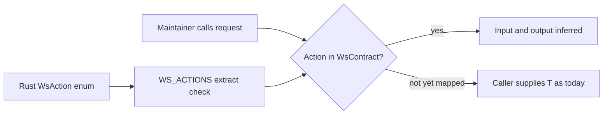

# PRD · APP-064: API Contract Hardening

> Product Requirements · WHAT and WHY. Keep Atmos’s existing three-plane RPC stack. Do **not** add oRPC. Make main `/ws` a real `action → input → output` (and `event → payload`) contract.

## Context

- **Problem**: Maintainers already have a shared action catalog and session kernel, but `request<T>(action, data?: unknown)` still lets the wrong payload or result type compile. A few shared DTOs already disagree with the Rust wire. An oRPC-style framework would add a second contract on top of a stack that is otherwise the right shape.
- **Why now**: APP-048/049/050 shipped the packages and explicitly deferred the per-action map (APP-048 M12). Mobile and web already share the kernel. The next increment is payload typing, not a new framework.
- **Related specs**:
  - [APP-048](../APP-048_api-types/PRD.md) — this spec **supersedes M12** (the MVP non-goal of a per-action map) and takes N2 (notification catalog) as a Must Have. Full DTO codegen remains APP-048 N4.
  - [APP-049](../APP-049_api-client/PRD.md) — kernel `request` / `requestWhenReady` gain contract generics; kernel stays non-UI.
  - [APP-050](../APP-050_shared-package-layering/PRD.md) — package roles unchanged; no new package in v1.
  - [QUALITY-004](../QUALITY-004_architecture-review/TECH.md) F-02 — contract drift; this spec does **not** adopt that audit’s `ts-rs` / `@atmos/protocol` jump.

## Goals

1. **Primary** — Decide and document: Atmos does not introduce oRPC (or tRPC-class RPC) for Computer, Hub, or Relay.
2. **Primary** — `@atmos/api-types` becomes a real contract package: mapped `WsAction` values infer request data and response data at the `request()` call site.
3. **Primary** — Web and mobile keep using the same kernel; feature wrappers (`fsApi`, mobile `wsActions`, …) stay in apps and just become better-typed.
4. **Secondary** — Notification `WsEvent` names are catalogued the same way as actions.
5. **Secondary** — Known shared DTO drift is fixed to the Rust wire.

Non-goals live in Out of Scope, not here.

## Users & Scenarios

- **Primary persona**: Maintainer adding or calling a main `/ws` action from web or mobile.
- **Secondary persona**: Reviewer checking that a new action did not ship with `unknown` payloads.

### Key scenarios

1. Engineer calls `session.request("workspace_create", { project_guid, … })`. TypeScript infers the result as the workspace wire type and rejects a misspelled field. They do not pass `request<WorkspaceModel>(…)`.
2. Engineer types `request("workspace_createe", …)` or `request("git_get_status", { path: 1 })` — both fail at compile time for mapped actions.
3. Mobile `wsActions.workspaceCreate` keeps its app-level defaults and camelCase ergonomics; underneath it uses the shared contract, not a second action list.
4. A new `WsAction` variant still fails `check-actions` until the TS catalog updates (APP-048). Adding it to the typed map is a required follow-up for actions in the Must Have domains; other domains may stay on the untyped overload until later phases.

## User Stories

- As a maintainer, I want `request("git_get_status", data)` to know `data` and the result type so I do not keep a parallel generic at every call site.
- As a mobile engineer, I want to keep a thin feature wrapper and RN adapter, not a new RPC runtime.
- As a reviewer, I want a written rule that Hub, Relay, and Computer stay separate, and that oRPC is not an acceptable “type safety” fix.
- As a maintainer, I want leftover dual-shaped DTOs (attachments, mobile git diff) to match the server JSON we actually send.

## Functional Requirements

### Must Have

- **M1 — No second RPC framework**: Do not add oRPC, tRPC, ts-rest, or a sibling Computer RPC client. No new workspace package for RPC. Document this in `packages/AGENTS.md` during implementation.
- **M2 — Planes unchanged**: Hub HTTPS stays `@atmos/hub-client`. Relay HTTPS stays `@atmos/relay-client`. Computer main `/ws` stays `api-types` + `api-client`. Do not merge hub-client and relay-client. Do not put Computer gateway `/api/system/*` into relay-client.
- **M3 — Kernel stays a kernel**: `@atmos/api-client` does not grow `gitApi` / `workspaceApi` methods. No `@atmos/api-sdk` in this spec.
- **M4 — `WsContract` map**: `@atmos/api-types` exports a mapped type `WsContract` (name may be `WsActionContract` in TECH) from `WsAction` wire names to `{ input, output }`. Source of truth for **names** remains the Rust enum + extract gate (APP-048 M7). The map does not replace that gate.
- **M5 — Typed `request` / `requestWhenReady`**: For `A extends keyof WsContract`, `request(action, data)` types `data` as `input` and the Promise as `output`. Web’s `wsRequest` / `wsRequestForComputerScope` and mobile’s kernel wrapper follow the same inference. Mapped calls do not need a caller-supplied `T`.
- **M6 — Incremental coverage (v1 domains)**: v1 map **must** cover every action whose shared DTOs already live under `packages/api-types/src/ws/dto/` — filesystem, git, github, group, linear, project, workspace — including their request payloads, not only responses. Unmapped actions may keep `request<T>(action, unknown)` until later phases.
- **M7 — Close the string hole for mapped actions**: `request("not_an_action")` must not type-check when the first argument is a string literal outside `WsAction`. TECH may keep an explicit escape hatch (`requestUnchecked` or a documented unmapped overload) so migration is not a big bang.
- **M8 — Feature wrappers stay in apps**: `apps/web/src/api/ws-api.ts`, `apps/web/src/api/ws/*-api.ts`, and `apps/mobile/src/api/ws-actions.ts` remain the namespaced call sites. After M5 they should stop passing redundant `T` for mapped actions.
- **M9 — Wire vs view**: Contract `input`/`output` match **server JSON** (snake_case, nullability). App view models and camelCase helpers stay in apps. Fix known shared-DTO drift in v1: `WorkspaceAttachmentPayload` in api-types must match Rust; mobile must not keep a second `GitFileDiffResponse` once git is mapped.
- **M10 — Notification name catalog**: Export a `WsEvent` string union + iterable list extracted from Rust `pub enum WsEvent`, with the same extract/check pattern as actions (promotes APP-048 N2). Notification **payload** map may be partial in v1.
- **M11 — No product wire change**: Do not reshape JSON to make typing easier. If a TS type is wrong, fix the TS type.

### Nice to Have

- **N1 — Remaining action map**: quota, token usage, permission, agent, automation, review, skills, settings, local model, local services, disk analyzer, simulator, canvas/pt-design, and other leftover `WsAction`s.
- **N2 — Notification payload map** for the 30 events (`event → payload`).
- **N3 — Domain-split contract modules** (`ws/contract/git.ts`, …) with `WS_ACTIONS` / `WsContract` derived from those modules. Not required if a single map file stays reviewable.
- **N4 — Computer REST type inventory** (bootstrap / file / diagnostics only). Generate or share types only if a **second** TypeScript consumer needs them. Not OpenAPI-for-everything.
- **N5 — Full Rust DTO codegen** (APP-048 N4 / QUALITY-004 F-02) if handwritten map cost dominates.

## Out of Scope

- **oRPC / tRPC / ts-rest / OpenAPI-first rewrite** — second stack; wrong default for a WS-first local runtime.
- **`@atmos/api-sdk` or namespaced methods on the session kernel** — feature APIs stay app-owned.
- **Merging hub-client and relay-client**, or a `@atmos/cloud-client`.
- **Terminal PTY protocol** — remains `@atmos/shared/terminal`.
- **Desktop Electron IPC types** — remain in `apps/desktop-electron`.
- **Moving `packages/relay` Worker code into a client package**.
- **TanStack Query / APP-035 cache redesign**.
- **Changing reconnect, pending-map, or no-queue semantics** (APP-049).
- **Generating OpenAPI for Hub, Relay, hooks, and Computer REST as one spec**.
- **User-visible product behavior** — this spec is maintainer/API-layer only. Call results and wire JSON stay the same.

## Success Metrics

- Leading: `request("git_get_status", { … })` infers the git status response in a package type test without a caller `T`.
- Leading: mapped-domain feature wrappers typecheck with no `request<ExplicitT>` for those actions.
- Leading: action extract/check still fails on enum drift; a new event extract/check fails on `WsEvent` drift.
- Lagging: unmapped `WsAction` count trends down (N1), not up, on new features in mapped domains.
- Qualitative: “We did not add oRPC; we finished the contract we already started.”

## Risks & Open Questions

- **Risk**: A 273-entry map bitrots if v1 tries to cover everything. Mitigated by M6 domain cut and an allowed untyped overload.
- **Risk**: Putting web-only wire types (review, automation) into api-types later (N1) slightly extends APP-048’s “second consumer” rule. Accepted for **wire** types; view models stay in apps.
- **Risk**: Reviewers treat mobile `ws-actions.ts` as a dual catalog and try to delete it. It is a feature wrapper (M8).
- **Open (TECH)**: empty-input call shape; exact escape-hatch name; whether `WS_ACTIONS` stays handwritten or becomes `keyof WsContract` once N1 lands.

## Milestones

| Phase | Content |
|-------|---------|
| **0** | Decision freeze: no oRPC, no api-sdk, planes unchanged; AGENTS note |
| **1** | `WsContract` type + typed `request` overloads + tests; map v1 domains (M4–M7, M9 attachments/git diff) |
| **2** | Web `wsRequest` + mobile wrappers use inference (M5, M8) |
| **3** | `WsEvent` extract/check (M10) |
| **4** | N1 remaining action map + N2 event payloads (landed). N3 catalog derivation, N4 REST inventory, N5 ts-rs still deferred |

Phase 1 is the shippable core. Phases 2–3 may land in the same change set if small.
