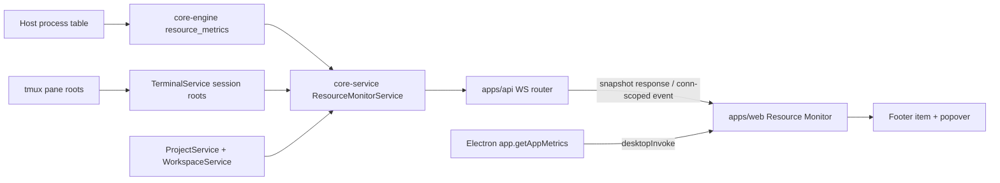

# TECH · APP-066: Resource Monitor

> Technical Design · HOW. Implements PRD APP-066: Resource Monitor.

## Scope summary

This design implements M1–M7 with no new crate, database table, REST endpoint, or persistent history. Rust samples and attributes the active Computer, Electron samples only its local Chromium shell, and `apps/web` composes the two sources. N1–N3 remain deferred.

## Frozen decisions

| Decision | Rule |
|----------|------|
| Package boundary | Add modules to `core-engine` and `core-service`; do not create a `resource-monitor` crate. |
| Source ownership | Server owns host/process attribution. Electron owns shell metrics only. |
| Composition | `apps/web` combines Server and shell snapshots only for the local Computer. |
| Transport | Computer metrics use the main WebSocket. Desktop shell metrics use existing Electron invoke IPC. |
| Live lifecycle | Footer performs an idle snapshot request every 15 seconds; an open popover owns one 2.5-second WS subscription. |
| Subscription delivery | Send full snapshots only to the subscribing connection; never global-broadcast resource events. |
| History | No Server ring buffer or persistence. `apps/web` keeps at most 60 Host points from snapshots already requested by the Footer/subscription. |
| Process types | Resource samples are separate from stop-oriented `ProcessSnapshot`. |
| PID exposure | Root PIDs stay inside Rust services; wire DTOs contain aggregates only. |
| Precision | Attribution is best-effort. Shared and unattributed usage remain visible. |
| CPU meaning | `cpu_percent` is normalized to total logical host capacity, where the host is 0–100%. |
| Memory meaning | On macOS, Host used matches btop: `(active + wired) × page_size` from Mach. Linux/Windows use `total − available`. Process groups use summed RSS/working-set bytes and need not add exactly to Host used. |
| Terminal navigation | Resolve the live pane by ephemeral `session_id`, then navigate through the owning host, Center Space, Terminal tab, and stable tmux deep link. Never guess when the live pane cannot be resolved. |
| Locate feedback | Use a short-lived blue terminal locate signal. Do not reuse agent-attention state, colors, persistence, filters, or API events. |

## Architecture overview



The Server and Electron do not call each other for metrics. When the active connection is Relay, the Server half naturally executes on the remote Computer and the Electron half is omitted.

## Module-by-module design

### `crates/core-engine`

Add `crates/core-engine/src/resource_metrics/mod.rs` and export it from `crates/core-engine/src/lib.rs`.

`ResourceMetricsEngine` owns a reusable `sysinfo::System` behind a lock because process CPU is delta-based. Add the latest compatible `sysinfo` package to `crates/core-engine/Cargo.toml`; do not depend on `runtime-manager`.

Responsibilities:

- Refresh host CPU/memory and the process table once per sample.
- Prime CPU counters on the first call before returning a useful sample.
- Return process identity and resource values without Project, Workspace, or session concepts.
- Capture `pid`, `parent_pid`, `start_time`, `cwd`, process name, CPU, and RSS.
- Normalize process CPU to total logical host capacity.
- Include only data available to the current user; missing process metadata is best-effort, not a whole-snapshot failure.

Add a batched tmux capability beside existing tmux helpers:

```text
tmux list-panes -a -F '#{session_name}\t#{window_index}\t#{pane_pid}'
```

`TmuxEngine::list_pane_processes()` returns all parseable pane roots in one command. Do not invoke tmux once per terminal session and do not use the control-client PID.

Do not modify the public shape of `crates/core-engine/src/local_services/process.rs::ProcessSnapshot`.

### `crates/core-service`

#### Terminal root registry

Update `crates/core-service/src/service/terminal/runtime.rs` so simple PTY startup reads `portable_pty::Child::process_id()` before moving/dropping the child. Return the PID through the existing initialization channel and store it in the internal `SessionHandle`.

Add an internal/public service projection that does not alter `SessionDetail`:

```rust
pub struct TerminalResourceRoot {
    pub session_id: String,
    pub context_id: String,
    pub display_name: Option<String>,
    pub terminal_kind: TerminalKind,
    pub simple_root_pid: Option<u32>,
    pub tmux_session: Option<String>,
    pub tmux_window_index: Option<u32>,
}
```

`TerminalService::list_resource_roots()` returns a clone-only projection. A tmux root is resolved by joining this projection with the batched pane list on `(tmux_session, window_index)`. Duplicate handles for one tmux window produce one process claim while retaining one display session row.

`context_id` can be either a Project GUID or a Workspace GUID. `ResourceMonitorService` must resolve Project first, then Workspace, and must not trust cached display names as identity.

#### Resource monitor service

Add:

```text
crates/core-service/src/service/resource_monitor/
  mod.rs
  attribution.rs
  types.rs
```

`ResourceMonitorService` receives:

- `Arc<ProjectService>`
- `Arc<WorkspaceService>`
- `Arc<TerminalService>`
- `ResourceMetricsEngine`

It exposes:

```rust
pub async fn snapshot(&self) -> Result<ResourceMonitorSnapshot>;
```

The method uses inflight coalescing and a short cache:

1. Return a cached snapshot when it is younger than 500 ms.
2. Acquire one async collection lock.
3. Recheck the cache.
4. Collect one engine sample and one batched tmux pane list.
5. Resolve Project/Workspace roots and active terminal roots.
6. Build an exclusive process assignment and aggregate.
7. Store and return the immutable snapshot.

There is no background job in `core-service`; WS connection ownership remains in `apps/api`.

#### Attribution algorithm

Build `parent_pid -> children` once per sample.

Ownership priority:

1. **Terminal root subtree** — simple PTY PID or tmux pane PID, owned by its resolved context.
2. **Deepest cwd root** — remaining same-user processes whose cwd is inside a Workspace or Project root.
3. **Atmos Server PID** — exactly `std::process::id()`.
4. **Shared Atmos runtime** — unclaimed descendants of the Server PID, including shared tmux/runtime helpers.
5. **Unattributed** — active terminal roots whose context cannot be resolved or whose ownership conflicts.

Every `(pid, start_time)` may be assigned to at most one aggregate. Nested terminal roots use the deepest process root. Project totals are computed from project-direct usage plus unique Workspace/session claims; never sum a session twice merely because it also appears under a Workspace.

Processes that are neither Atmos-managed nor under a Project/Workspace root contribute to host totals only and are not exposed.

Attribution status:

- `complete`: every discovered active terminal root resolved and sampled.
- `partial`: at least one root or context could not be resolved.
- `unsupported`: host metrics work but process attribution is unavailable on the platform.

### `apps/api`

Add `apps/api/src/api/ws/message/resource_monitor.rs` for request DTOs and re-export it from `message.rs`.

Add three actions:

```rust
WsAction::ResourceMonitorGet
WsAction::ResourceMonitorSubscribe
WsAction::ResourceMonitorUnsubscribe
```

Add one event:

```rust
WsEvent::ResourceMonitorUpdated
```

Add `apps/api/src/api/ws/router/resource_monitor.rs`.

`WsMessageService` owns:

- `Arc<ResourceMonitorService>`
- `Mutex<HashMap<String, JoinHandle<()>>>` keyed by `conn_id`

Behavior:

- `resource_monitor_get`: call `snapshot()` and return it.
- `resource_monitor_subscribe`: abort any existing task for the connection, collect and return an immediate snapshot, then start a 2.5-second loop.
- Each loop calls the coalesced service and sends `resource_monitor_updated` through `WsManager::send_to(conn_id, ...)`.
- `resource_monitor_unsubscribe`: abort and remove the task; idempotently return an empty success object.
- `on_disconnect`: perform the same abort/remove operation.
- A failed collection emits structured tracing and keeps the loop alive.
- A missing connection ends the task.

No `spawn_ws_forwarder`, `WsManager::broadcast`, REST route, or `AppState` field is added.

### `packages/api-types`

Add:

```text
packages/api-types/src/ws/dto/resource-monitor.ts
packages/api-types/src/ws/contract/resource-monitor.ts
```

Update:

- `src/ws/actions.ts`
- `src/ws/events.ts`
- `src/ws/contract.ts`
- `src/ws/event-contract.ts`
- generated `fixtures/actions.server.json`
- generated `fixtures/events.server.json`

Every action gets a `WsContract` row. The event payload is the full `ResourceMonitorSnapshot`, not `RefreshNotification`.

Do not add domain methods to `@atmos/api-client`.

### `apps/desktop-electron`

Add:

```text
apps/desktop-electron/src/metrics/desktop-shell-metrics.ts
apps/desktop-electron/src/metrics/desktop-shell-metrics.test.ts
```

The collector accepts an injectable `app.getAppMetrics` reader and logical CPU count. It groups Electron process types:

| Electron type | Atmos group |
|---------------|-------------|
| `Browser` | `main` |
| `Tab` | `renderer` |
| `GPU` | `gpu` |
| `Utility` | `utility` |
| all other values | `other` |

Rules:

- Sum `memory.workingSetSize * 1024`.
- Normalize summed `cpu.percentCPUUsage` by logical CPU count.
- Preserve process count.
- Use `(pid, creationTime)` only internally; do not return PIDs.
- Return `supported: false` rather than throwing when Electron metrics are unavailable.

Add `get_desktop_shell_metrics` to `createAllHandlers` in `src/ipc/handlers.ts`. Existing preload and router bridges already accept arbitrary command names and do not change.

Update the router smoke inventory.

### `apps/web`

#### API and Query

Add `apps/web/src/api/ws/resource-monitor-api.ts`:

- `get()` uses mapped `wsRequest`.
- `subscribe(scope)` and `unsubscribe(scope)` use `wsRequestForComputerScope` so cleanup targets the connection that created the subscription.
- Re-export wire DTOs from `@atmos/api-types`.

Add Computer-scoped Query keys/options under existing query modules. The key includes `activeInstanceId`, `connectionEpoch`, and `relaySessionRevision`.

`ServerStateEventBridge` handles `resource_monitor_updated` by replacing the scoped snapshot query data. It does not invalidate/refetch on every event.

Idle behavior:

- Footer enabled and WS connected: `resource_monitor_get` every 15 seconds.
- Footer hidden: no idle query.

Interactive behavior:

- Opening the popover calls `subscribe` and seeds Query with the returned snapshot.
- Closing, unmounting, or changing Computer scope calls `unsubscribe` for the captured old scope.
- No client `refetchInterval` while subscribed.

#### Desktop source

Add a feature-local desktop shell query. Invoke `get_desktop_shell_metrics` only when:

```text
isElectronShell() && connectionMode === "local"
```

Use a 15-second interval while only the Footer is visible and a 2.5-second interval while the popover is open. Hide the section for hosted web, legacy Tauri, and Relay mode.

The shell snapshot remains app-owned and is not added to `@atmos/api-types`.

#### UI

Add:

```text
apps/web/src/features/resource-monitor/
  components/ResourceMonitorFooterItem.tsx
  components/ResourceMonitorPopover.tsx
  hooks/use-resource-monitor.ts
  lib/resource-monitor-query-events.ts
```

Footer:

- Compact text: CPU percentage and used host memory.
- Sentence case; `CPU` is the acronym exception.
- Uses semantic theme tokens.

Popover:

- Host summary.
- Local-only Desktop shell rows.
- Atmos Server and shared runtime rows.
- Collapsible Project → Workspace → active terminal session hierarchy.
- Unattributed row when non-zero or attribution is partial.
- Loading, stale, unsupported, disconnected, and empty states.
- Scrollable body for many Workspaces.
- Active session rows enrich the Server fallback name with the current frontend terminal title by `session_id`: `customLabel`, then canonical dynamic/OSC/agent display title. Numeric tmux window names are attach identities, not preferred display titles.
- Host summary uses aligned CPU/memory values, bounded usage bars, and one 60-point CPU/memory percentage chart. The chart consumes existing Query/subscription snapshots and creates no additional timer or transport.
- The hierarchy is a dense Name/CPU/Memory table with stable Name/CPU/Memory sorting. Only terminal-session rows are navigation actions.

#### Terminal navigation and locate pulse

```text
Resource session click
  -> resolve session_id in live workspacePanes
  -> capture host / Center Space / Terminal tab / pane / tmux window
  -> close popover without restoring focus to the Footer trigger
  -> switchCenterSpace(..., preserveDeepLink: true)
  -> route to /workspace or /project with tab + terminalTmux
  -> existing CenterStage deep-link waits for the target grid and focuses pane
  -> terminal locate store acknowledges the mounted active pane
  -> one-shot blue ::after border pulse, then generation-safe cleanup
```

New terminal-owned public capability:

```text
apps/web/src/features/terminal/public/pane-location.ts
apps/web/src/features/terminal/store/terminal-pane-locate-store.ts
```

Rules:

- Resolve the owning Center Space from the live pane scope and namespaced tmux window; support default and extra spaces.
- Route Project-direct sessions to `/project` and Workspace sessions to `/workspace`.
- Use the existing `terminalTmux` CenterStage deep link when a tmux window exists. A live simple-PTY pane may be focused by the pending locate request after its tab mounts.
- A locate request becomes active only when the matching pane is on the active surface, so a warm hidden Space cannot consume the pulse.
- Pulse duration is approximately 2.4 seconds, uses the semantic info blue, and provides a non-animated short blue border under reduced motion.
- Agent attention remains a separate sticky green/amber system.

#### Client Host history

```ts
type ResourceHostHistoryPoint = {
  received_at_ms: number; // Query local receive time; avoids remote clock skew
  cpu_percent: number;
  memory_percent: number;
};
```

- Scope key includes `activeInstanceId`, `connectionEpoch`, and `relaySessionRevision`.
- Keep only the current scope and at most 60 points.
- Deduplicate the same snapshot receive timestamp.
- Append only when a valid connected snapshot already reaches Query.
- Closing the popover does not create or keep a second subscriber; hiding/unmounting the Footer drops the in-memory ring.

Add `showResourceMonitor` to layout settings and a Settings → Layout toggle. Default enabled unless the stored setting is explicitly `false`.

Update every web locale:

- `apps/web/messages/en.json`
- `apps/web/messages/zh.json`

## Data model

Canonical Rust models serialize directly to the Server wire shape:

```rust
pub struct ResourceUsage {
    pub cpu_percent: f32,
    pub memory_rss_bytes: u64,
    pub process_count: u32,
}

pub struct ResourceSessionMetrics {
    pub session_id: String,
    pub name: Option<String>,
    pub terminal_kind: String,
    pub usage: ResourceUsage,
}

pub struct ResourceWorkspaceMetrics {
    pub workspace_id: String,
    pub name: String,
    pub usage: ResourceUsage,
    pub sessions: Vec<ResourceSessionMetrics>,
}

pub struct ResourceProjectMetrics {
    pub project_id: String,
    pub name: String,
    pub usage: ResourceUsage,
    pub direct_usage: ResourceUsage,
    pub workspaces: Vec<ResourceWorkspaceMetrics>,
    pub sessions: Vec<ResourceSessionMetrics>,
}

pub struct ResourceHostMetrics {
    pub cpu_percent: f32,
    pub memory_used_bytes: u64,
    pub memory_total_bytes: u64,
    pub logical_cpu_count: u32,
}

pub struct ResourceMonitorSnapshot {
    pub collected_at_ms: u64,
    pub host: ResourceHostMetrics,
    pub server: ResourceUsage,
    pub shared_runtime: ResourceUsage,
    pub projects: Vec<ResourceProjectMetrics>,
    pub unattributed: ResourceUsage,
    pub attribution_status: ResourceAttributionStatus,
}
```

The TypeScript DTO mirrors serde snake_case exactly.

Desktop IPC is intentionally separate:

```ts
type DesktopShellMetricsSnapshot = {
  supported: boolean;
  collected_at_ms: number;
  logical_cpu_count: number;
  total: ResourceUsageView;
  groups: Array<{
    kind: "main" | "renderer" | "gpu" | "utility" | "other";
    usage: ResourceUsageView;
  }>;
};
```

## Transport

### WebSocket requests

```json
{ "action": "resource_monitor_get", "data": {} }
{ "action": "resource_monitor_subscribe", "data": {} }
{ "action": "resource_monitor_unsubscribe", "data": {} }
```

`get` and `subscribe` return `ResourceMonitorSnapshot`; `unsubscribe` returns `{}`.

### WebSocket notification

```json
{
  "event": "resource_monitor_updated",
  "data": { "...": "ResourceMonitorSnapshot" }
}
```

The event is connection-scoped. Missing intermediate events are acceptable because each payload is a complete snapshot.

### Desktop IPC

```text
desktopInvoke("get_desktop_shell_metrics") -> DesktopShellMetricsSnapshot
```

No REST endpoint is introduced.

## Security & privacy

- Existing WS origin and Computer authentication rules apply.
- Wire payloads contain aggregate usage, names already visible in the active Computer, and opaque session IDs.
- Do not return PIDs, command lines, environment variables, usernames, unrelated process names, or host paths.
- Structured logs may include collection status and counts, never full process metadata.
- Relay receives only snapshots requested or subscribed by its own connection.

## Performance budgets

- Interactive interval: 2.5 seconds; server rejects or clamps any future configurable interval below 2 seconds.
- Idle Footer interval: 15 seconds.
- Hidden Footer with no subscriber: no resource collection.
- One process-table refresh per coalesced snapshot.
- One tmux `list-panes -a` call per coalesced snapshot at most.
- No per-session `ps`, `/proc` walk, or tmux command.
- Each PID contributes to at most one exclusive ownership bucket.
- Snapshot payload remains below 256 KiB for 100 active sessions.

## Rollout plan

1. **Spec and contract freeze**: APP-066 quartet + progress log.
2. **Engine and terminal roots**: `sysinfo` collector, process index, batched tmux pane roots, simple PTY PID capture.
3. **Service attribution**: `ResourceMonitorService`, exclusive assignment, cache/coalescing, Rust unit tests.
4. **WS protocol**: actions, connection-owned subscription tasks, disconnect cleanup, api-types extract/contract.
5. **Desktop shell source**: testable Electron collector + IPC handler.
6. **Web integration**: scoped Query/event bridge, idle/live lifecycle, Footer/popover, layout setting, i18n.
7. **Verification and review**: scenario tests, targeted regression, agent-browser Desktop smoke, implementation review and fixes.

## Risks & tradeoffs

- **Tradeoff — process accounting rather than OS isolation**: chosen for cross-platform compatibility and no launch migration; attribution is not billing-grade.
- **Tradeoff — connection-owned subscription in API**: keeps transport identity out of `core-service` and avoids global Relay broadcasts.
- **Tradeoff — summed RSS**: cheap and available across platforms, but shared pages can make group totals exceed host used memory.
- **Risk — first CPU sample**: delta counters need priming. The engine must not publish an uninitialized sample as a healthy snapshot.
- **Risk — detached tmux workloads**: cwd attribution can recover many detached processes; workloads with missing cwd remain shared/unattributed.
- **Risk — duplicate tmux handles**: join and claim by pane root before creating display rows.
- **Risk — process exit/reuse**: key process identity by `(pid, start_time)`.
- **Risk — popover cleanup during Computer switch**: capture the old Computer scope for unsubscribe instead of reading the new active scope.
- **Rollback**: hide the Footer item and remove the new actions/handler. No migration or persisted history needs rollback.

## Dependencies & compatibility

- Depends on current main implementations of APP-016, APP-023, APP-035, APP-048, APP-049, and APP-064.
- Adds the latest compatible `sysinfo` crate to `core-engine`; package-manager dependency, so no root `NOTICE` entry is required.
- Electron 37 provides `app.getAppMetrics()`.
- tmux pane attribution requires `#{pane_pid}`; host totals and cwd attribution remain available when tmux is missing.
- macOS and Linux are full targets. Windows receives host/process sampling and best-effort cwd/ancestry attribution; tmux rows may be absent.

## Open questions resolved

- First UI: Footer item + popover; no center-stage page in v1.
- Session drilldown: active attributed terminal sessions are included in v1.
- History: deferred to N1.
- Remote shell: never merge local Electron into a remote Computer.
- Collector placement: modules in existing crates, not a new crate.
- REST: none.

## Post-implementation update

<!-- updated 2026-08-25: align observed host memory and terminal labels with existing product surfaces -->

- **macOS Host memory**: direct Mach `HOST_VM_INFO64` sampling uses btop's `(active_count + wire_count) × page_size` definition. Falling back to `total − sysinfo.available_memory()` is allowed only when Mach sampling fails and is not considered equivalent on macOS.
- **Terminal titles**: the Server keeps stable aggregate/session identity and a fallback name. `apps/web` joins active `ResourceSessionMetrics.session_id` rows to `useTerminalStore.workspacePanes` and resolves the same local display inputs used by terminal chrome. Titles remain local display state and never enter the shared WS DTO.
