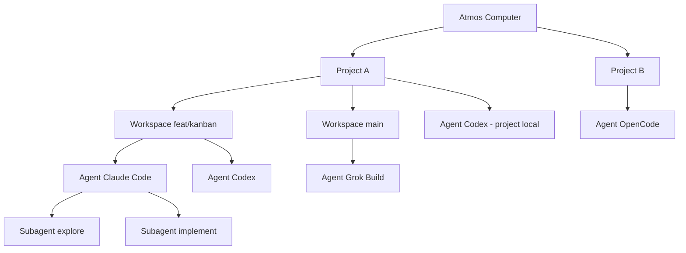
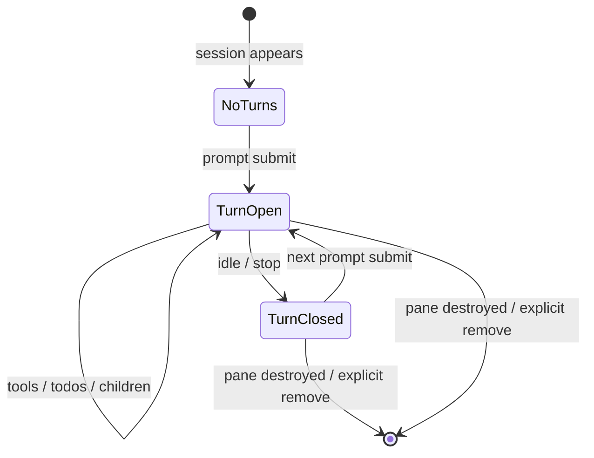

# PRD · APP-067: Agent Observer

> Product Requirements · WHAT and WHY. Settled direction for a computer-scoped fact graph of Agents (Atmos → Project → Workspace → Agent → Subagent), with hook **turns** (prompt → tools → idle) retained after the Agent finishes a round.

## Context

- **Problem**: Builders run Agents in many terminals, workspaces, and projects at once. Atmos already shows *whether* an Agent is idle, running, or waiting on permission. It does not show *what it is doing*, *what it already did*, or *what the user asked*. There is no single board of every Agent on this Computer. Idle is treated as “forget the row,” which erases a multi-turn conversation between prompts.
- **Why now**: Hooks are already installed. Some of them already receive tool / child / permission payloads and drop them. The missing product is an activity model whose history unit is a **turn**, plus a derived graph — not a new agent runtime.
- **Related specs**: APP-058 (sidebar/kanban grouping by coarse Agent **state** — unchanged). APP-014 (Canvas — user-composed board; not this derived graph). APP-051 (idle session **job** still runs; it must not wipe turns). APP-064 (typed WS events). APP-063 (Token Usage Computer picker — **not** copied).

## Goals

1. Primary — One graph of the connected Computer: every live Agent and every Agent that has finished at least one turn on a pane that still exists.
2. Primary — Fold hook payloads into a parallel **activity** model of **turns** (submitted prompt, tools in that round, todos, children). Do not replace `idle` / `running` / `permission_request`.
3. Secondary — Agent nodes stay scannable when collapsed; expanding an Agent unfolds its turns in the node and reveals Subagent nodes. Clicking through still focuses the real terminal pane.

## Users & Scenarios

- **Primary persona**: Agentic builder running several terminal Agents across worktrees and projects on one Computer.
- **Key scenarios**:
  1. Open **Agent Observer** from Launchpad; see Atmos at the top, then only projects/workspaces that have graph members.
  2. One workspace has Claude Code and Codex at the same time — two Agent cards hang off that workspace.
  3. Claude Code finishes a turn (goes Idle). The Agent node **stays**. Expanding it shows the prompt that started that turn and the tools it used.
  4. The user submits a follow-up in the same pane. A **new turn** is appended on the same node (turn 2 prompt + tools). Turn 1 remains.
  5. Claude Code spawns a child; the parent card shows a child count; expand the Agent to see a Subagent node and an animated spawn edge while it runs.
  6. A collapsed Agent card shows name, state, and either the current tool (`Edit Footer.tsx`) or the latest turn’s prompt. Expand to fold/unfold turns. Select to fill the right detail panel.
  7. Permission wait turns the Agent card warning-colored; granting or finishing in the pane returns it to running/idle without leaving the graph.
  8. Click **Open pane** (or double-click the card) to jump to the existing terminal / side-chat pane.

## User Stories

- As a builder, I want every Agent on this Computer on one board so I do not hunt across project sidebars and terminal mosaics.
- As a builder, I want a finished round to stay on the board so I can read what just happened before I send the next prompt.
- As a builder, I want each prompt submit to start a new turn on the same Agent, keeping earlier turns, because one pane is a multi-turn conversation.
- As a builder, I want Agent cards compact by default, with turns and children one expand away.
- As a builder, I want child agents on the graph so a quiet lead session is not mistaken for “done” while background work continues.
- As a builder, I want a click from the graph to the pane that owns the session.

## Functional Requirements

### Must Have

- **M1: Activity model (parallel to state), unit = turn** — For each hook session, maintain activity derived from hook payloads. Do **not** replace `idle` / `running` / `permission_request`. Do **not** put activity fields on `agent_hook_state_changed`.

  A **turn** is one user prompt through to the Agent going idle (or the next prompt, whichever comes first):

  | Event | Turn effect |
  |-------|-------------|
  | Prompt submit (`UserPromptSubmit` / Pi `AgentStart` / equivalent) | Close the previous open turn if any; append a new turn with the submitted text (truncated). |
  | Tool start / finish | Attach to the **current** turn (`current_tool` while in flight; then a recent-tool slot on that turn). |
  | TodoWrite / equivalent | Replace the session’s latest todo list **and** snapshot it onto the current turn. |
  | Child start/stop | Live children hang off the lead; the turn records which child ids it spawned (so history remains after the child node is gone). |
  | Idle / Stop / AgentEnd | Close the current turn (`ended_at`). **Do not delete** the turn or the Agent node. |
  | Next prompt on the same pane | New turn on the **same** Agent node. Earlier turns stay. |

  Per session (lead):

  | Field | Collapsed card | Expanded node / detail |
  |-------|----------------|------------------------|
  | Tool name + icon | yes | yes |
  | Display name (tool label + pane title if any) | yes | yes |
  | State badge | yes | yes |
  | Current tool line (in-flight) | yes, if running | yes |
  | Latest turn prompt | yes, if idle / no current tool | yes |
  | Turn count | yes if > 1 | yes |
  | Turns (prompt + tools + duration) | no | yes — foldable rows, newest first |
  | Todos | `n/m` if present | checklist on the current/latest turn |
  | Live children | count + chevron | Subagent nodes |
  | Elapsed (current turn, while not idle) | yes | yes |
  | Project / workspace labels | via parent nodes | yes |
  | Pane affordance | Open pane | same |

  Missing fields are omitted, not faked. Display name uses the existing pane-title lookup; it is not a new hook field.

- **M2: All installed hook agents** — Fold whatever the vendor documents. Missing events mean omitted UI, never fake data. No v4 empty-body templates.

  | Tool | Documented events we install | Observer fields when payload has them |
  |------|------------------------------|----------------------------------------|
  | Claude Code | SessionStart, UserPromptSubmit, Pre/PostToolUse, PostToolUseFailure, PermissionRequest, Notification, Stop, SessionEnd, SubagentStart/Stop | prompt, tools, todos, children, permission |
  | Codex | SessionStart, UserPromptSubmit, Pre/PostToolUse, PermissionRequest, SubagentStart/Stop, Stop | prompt, tools; children if emitted |
  | Cursor | sessionStart/End, beforeSubmitPrompt, pre/postToolUse, postToolUseFailure, subagentStart/Stop, stop | prompt, tools, children |
  | Gemini | SessionStart, BeforeAgent, Before/AfterTool, AfterAgent, Notification | prompt (BeforeAgent), tools; no children |
  | Antigravity | PreInvocation, Pre/PostToolUse, Stop | prompt if stdin has it, tools; no children |
  | Factory Droid | SessionStart/End, UserPromptSubmit, Pre/PostToolUse, Notification, Stop, SubagentStart/Stop | prompt, tools, children, permission |
  | Kiro | agentSpawn, userPromptSubmit, pre/postToolUse, stop | prompt, tools |
  | OpenCode | session.*, chat.message (user parts), tool.execute.before/after (input.tool + output.args), permission.* | tools, permission, prompt from chat.message parts |
  | Ampcode | session.start, agent.start, tool.call/result, agent.end | prompt if event has it, tools |
  | Pi | SessionStart, before_agent_start (event.prompt), agent_start, ToolCall/Result, AgentEnd, SessionShutdown | prompt from before_agent_start; tools; agent_start does not open a turn |
  | Hermes | on_session_start, pre/post_tool_call, pre/post_llm_call, on_session_end | tools from stdin JSON; prompt omitted unless present |
  | Grok Build | SessionStart, UserPromptSubmit, Pre/PostToolUse, PostToolUseFailure, Notification, Stop, SessionEnd, SubagentStart/Stop | prompt, tools, permission, children |

  A live session with no activity fields still appears as a **state-only** card (name, state, Open pane).

- **M3: Computer-scoped Observer surface** — New Launchpad item **Agent Observer** opens a computer-scoped page (same class as Token Usage / Disk Analyzer), not a per-workspace center tab. Route `/agent-observer` is bookmarkable. The board follows the **currently connected workbench Computer** (local or Relay). No All-computers picker.

- **M4: Graph topology**

  ```text
  Atmos (this connected Computer)
    └── Project          // only projects that currently have ≥1 graph member
          ├── Workspace  // workspace-scoped members
          │     ├── Agent (lead session)
          │     │     └── Subagent*   // live children only; hidden while Agent collapsed
          │     └── Agent …
          └── Agent …    // project-level session (no workspace context_id)
  ```

  Rules:

  1. Root is the connected Computer. One root. Label with the Computer display name when known.
  2. Project and Workspace nodes are **containers**. They are not runnable Agents.
  3. Multiple Agents under the same parent are siblings. No “one agent per workspace” limit.
  4. Subagent nodes parent to their lead Agent, never directly to a Workspace. One level only.
  5. Side-chat sessions are Agent nodes under the same workspace/project as their source pane, visually marked as side chat.
  6. Projects / workspaces with zero graph members are omitted. They return if a member binds to them.
  7. Unresolved `context_id` / path still produces an Agent node, parented to a fallback **Unassigned** project node (not dropped).
  8. Graph membership = live session rows **union** activity records that have at least one turn. Finished Agents with turns stay after Idle.

- **M5: Folding (graph + in-node turns)**

  | Default | Expand reveals |
  |---------|----------------|
  | Project: name + member count; children visible | Collapse hides Workspace/Agent descendants |
  | Workspace: name/branch + count; Agent children visible | Collapse hides Agents |
  | Agent: **collapsed compact card** | (1) foldable **turn rows inside the node** (newest first, last 8 + “+N earlier”); (2) live Subagent nodes on the graph |
  | Each turn row: prompt line + tool count + duration | Expand that turn: tool chips for the turn |
  | Subagent: compact; hidden while parent Agent is collapsed | Spawn edges + child cards |

  Expanding one Agent does not expand every Agent. Collapsing a parent hides descendants without destroying live activity or turns (they reappear on expand). Selecting a node also fills a **right detail panel** with the full turn list so the graph does not have to render 50 turns inside the card.

- **M6: Agent card UI** — Dense, border-led, token-colored status (running / idle / permission / attention). Idle-with-turns is still on the board, muted vs running. Current tool is a single truncated line (`{Tool} {detail}`). Turn prompts are truncated. Tool chips are compact (`bash ×5`, last call duration), not a transcript. Todos are a short checklist (done / in-progress / pending); cap visible rows (5) with “+N more”. No terminal emulator inside the card.

- **M7: Live updates** — Graph membership, card fields, new turns, child spawn/despawn, and edge animation update from hook events without reload. Layout does not rebuild from scratch on every tool tick. Expand/collapse (node height + Subagent add/remove) **does** relayout. New nodes appear next to their parent; a **Relayout** control re-runs the tree layout. User pan/zoom is preserved until Relayout or Fit.

- **M8: Navigation** — Selecting a node highlights it and fills the detail panel. **Open pane** uses the existing hook→pane navigation (including side chat). Subagent Open pane targets the **lead** pane. If the pane is gone, show inline “pane closed” rather than a success toast. A control on an idle Agent can **remove** it from the graph (explicit); that is the same family as footer session remove, not automatic Idle.

- **M9: Copy & i18n** — English sentence case. Chinese locales translated (do not paste English into `zh.json`). Launchpad label **Agent Observer** (distinct from Launchpad **Agents**, which is the agent manager). Empty state explains that Agents appear when hooks fire in a terminal, with a link to hook install / settings if none are installed. Distinguish “connected but quiet” from “no Computer connected.”

- **M10: Existing surfaces keep working** — Sidebar By Agent Status, footer **popover** (session list + counts), attention latches, hook install/uninstall, pane-focus idle dismiss, and idle sweep behave as today **for state chrome**. Those automatic drops must **not** wipe graph turns (see M1 / M4.8). Footer popover **may** show one current-tool or latest-prompt line from activity. Footer running-count does **not** navigate away from the popover to the graph; the Launchpad item (and an “Open Agent Observer” affordance in the popover) does.

### Nice to Have

- **N1**: Follow-camera — pan to the Agent that last received a tool event; disable after the user pans.
- **N2**: Conflict hint — if two live sessions last-touched the same relative file, show a muted note on both cards (no extra edge in v1).
- **N3**: Canvas read-only widget that embeds the same graph or a single Agent card (reuse activity store; do not fork `CanvasAgentStatusWidget` state).
- **N4**: Persist expand/collapse + viewport per Computer in function settings.
- **N5**: Filter chips (running / idle / permission / tool type) on the graph toolbar.

## Out of Scope

- **Transcript / JSONL parsers** — Hooks only. Do not tail vendor session files.
- **New hook install mechanism** — Keep `crates/core-engine/src/agent_hooks` + current versioning. Templates gain richer POST bodies; not a new HTTP path per tool.
- **Controlling Agents from the graph** — No prompt send, no interrupt, no permission-approve in v1 (permission is display + jump-to-pane).
- **Replacing Canvas** — Canvas stays the user-composed infinite board.
- **Persisting activity in SQLite** — In-memory. Survives browser refresh via REST snapshot. Does **not** survive API process restart.
- **Mobile-first graph** — Web/desktop (Electron inherits web). Mobile keeps the existing session list.
- **Time-travel / replay of deleted panes** — Turns live as long as the activity record does. Closing the pane drops the node.
- **Cross-Computer fleet picker** — Follows the connected workbench Computer only (Relay remote is that Computer, not a second picker).
- **v1 activity fold for Cursor / Gemini / Antigravity / …** — State-only cards while the session row exists.

## Success Metrics

- Leading: In a session with ≥2 live Agents, the graph shows both under the correct Project/Workspace within one hook event of start.
- Leading: After an Agent goes Idle, the node is still present with the last turn’s prompt; a second prompt on the same pane appends turn 2 without dropping turn 1.
- Leading: Collapsed Agent cards stay one line (current tool or latest prompt); expanded cards show foldable turns without opening the terminal.
- Qualitative: “I can see every Agent on this Computer, what I asked, and what it did, without clicking through workspaces.”

## Risks & Open Questions

- **Risk**: Tool-event volume. Mitigated by a dedicated activity event, client store separate from state, aggregating consecutive same-name tools, and emitting only when visible fields change.
- **Risk**: Layout jumpiness. Mitigated by incremental node updates, relayout on expand/collapse only, Relayout as an explicit action.
- **Risk**: Adapter / install drift. Mitigated by an install-vs-fold table (M2) so empty payloads stay empty, plus a hook version bump that startup sync can refresh.
- **Risk**: Memory from retained turns. Mitigated by a high safety cap on turns per session and dropping activity when the pane is destroyed — not by deleting history on Idle.
- **Open**: None blocking. N1–N5 deferred.

## Milestones

- Phase 1 — Hook install upgrades + turn fold in adapters + REST snapshot + WS event. Footer popover one-line current tool / latest prompt. No graph yet.
- Phase 2 — Agent Observer page: Atmos → Project → Workspace → Agent. Compact cards, project/workspace folding, idle-with-turns retained, Open pane, Launchpad + i18n.
- Phase 3 — In-node turn folding, Subagent nodes, spawn edges, Relayout, tests.




