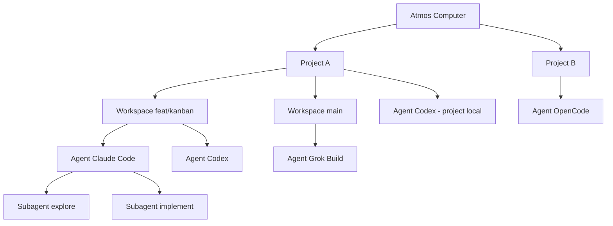

# PRD · APP-067: Agent Activity Graph

> Product Requirements · WHAT and WHY. Settled direction for folding hook activity (tools, children, todos) and rendering a computer-scoped graph: Atmos → Project → Workspace → Agent → Subagent.

## Context

- **Problem**: Builders run Agents in many terminals, workspaces, and projects at once. Atmos already shows *whether* an Agent is idle, running, or waiting on permission. It does not show *what* it is doing — current tool, recent tools, todos, or child agents — and there is no single place to see all of them together.
- **Why now**: Hooks are already installed and already receive tool / child / permission payloads. The data is dropped on the floor. The missing product is an activity model plus a graph, not a new agent runtime.
- **Related specs**: APP-058 (sidebar/kanban grouping by coarse Agent **state** — unchanged). APP-014 (Canvas — a user-composed board; not this derived graph). APP-051 (idle session sweep — reuse). APP-064 (typed WS events).

## Goals

1. Primary — Fold hook payloads into a live activity model (current tool, recent tools, children, todos, permission detail) for v1 tools, and keep the existing state machine for sidebar / footer / attention.
2. Secondary — Show every live session on one React Flow graph rooted at this Atmos Computer, branching to Project, Workspace, Agent, and Subagent.
3. Tertiary — Collapsed cards stay scannable; expanded cards / selected detail show the rest of the hook fields. Clicking through still focuses the real terminal pane.

## Users & Scenarios

- **Primary persona**: Agentic builder running several terminal Agents across worktrees and projects on one Computer.
- **Key scenarios**:
  1. Open **Agent Graph** from Launchpad or the footer running count; see Atmos at the top, then only projects/workspaces that currently have sessions.
  2. One workspace has Claude Code and Codex at the same time — two Agent cards hang off that workspace.
  3. Claude Code spawns a child; the parent card shows a child count; expand to see a Subagent node and an animated spawn edge while it runs.
  4. A collapsed Agent card shows name, tool glyph, state, and the current tool line (`Edit Footer.tsx`). Expand to see recent tools and the TodoWrite list.
  5. Permission wait turns the Agent card warning-colored; granting or finishing returns it to running/idle without leaving the graph.
  6. Click **Open pane** (or double-click the card) to jump to the existing terminal / side-chat pane.

## User Stories

- As a builder, I want every useful hook field captured so the product can show what an Agent is doing, not only that it is “running.”
- As a builder, I want one graph of this Computer so I do not hunt across project sidebars and terminal mosaics.
- As a builder, I want Agent cards compact by default so twenty sessions remain readable, with history and todos one expand away.
- As a builder, I want child agents on the graph so a quiet lead session is not mistaken for “done” while background work continues.
- As a builder, I want a click from the graph to the pane that owns the session.

## Functional Requirements

### Must Have

- **M1: Activity model (parallel to state)** — For each live hook session, maintain activity derived from hook payloads. Do **not** replace `idle` / `running` / `permission_request`. Do **not** put activity fields on `agent_hook_state_changed`.

  Per session (lead) and per known child:

  | Field | Source (when the adapter has it) | Collapsed card | Expanded / detail |
  |-------|----------------------------------|----------------|-------------------|
  | Tool name + icon | session `tool` | yes | yes |
  | Display name | tool label + optional session title | yes | yes |
  | State badge | existing hook state + attention | yes | yes |
  | Current tool line | in-flight PreToolUse / ToolCall / `tool.execute.before` | yes (one line, truncated) | yes |
  | Recent tools | last N completed tool calls, aggregated by name | no (show count if > 0) | yes, newest first |
  | Todos | TodoWrite / equivalent list | no (show `n/m` if present) | yes |
  | Children | SubagentStart/Stop + child `agent_id` | count + chevron | child nodes in the graph |
  | Prompt preview | UserPromptSubmit / AgentStart text, truncated | no | yes |
  | Elapsed | first activity → now while not idle | yes | yes |
  | Project / workspace labels | resolved from `context_id` + project catalog | via parent nodes | yes |
  | Pane affordance | `pane_id` / side-chat | Open pane control | same |

- **M2: v1 adapters** — Activity fold is required for:

  | Tool | Activity fidelity |
  |------|-------------------|
  | Claude Code | tools, children, permission, todos, prompt |
  | Grok Build | tools, children, permission; todos if payload includes them |
  | Codex | tools, prompt; no children |
  | OpenCode | tools, permission |
  | Pi | tools |

  Other installed tools still appear on the graph as **state-only** Agent cards (name, state, elapsed, Open pane) when they have a live session. Missing fields are omitted, not faked.

- **M3: Computer-scoped graph surface** — New Launchpad item **Agent Graph** opens a computer-scoped page (same class as Token Usage), not a per-workspace center tab. Footer running-count / agent overview opens the same page. Route is bookmarkable.

- **M4: Graph topology**

  ```text
  Atmos (this Computer)
    └── Project          // only projects that currently have ≥1 session
          ├── Workspace  // workspace-scoped sessions
          │     ├── Agent (lead session)
          │     │     └── Subagent*
          │     └── Agent …
          └── Agent …    // project-level session (no workspace context_id)
  ```

  Rules:

  1. Root is always the current Atmos Computer. One root.
  2. Project and Workspace nodes are **containers**. They are not runnable Agents.
  3. Multiple Agents under the same parent are siblings. No artificial “one agent per workspace” limit.
  4. Subagent nodes parent to their lead Agent, never directly to a Workspace.
  5. Side-chat sessions are Agent nodes under the same workspace/project as their source pane, visually marked as side chat.
  6. Projects / workspaces with zero sessions are omitted. They return if a new session binds to them.
  7. Unresolved `context_id` / path still produces an Agent node, parented to a fallback **Unassigned** project node (not dropped).

- **M5: Folding (graph + card)**

  | Default | Expand reveals |
  |---------|----------------|
  | Project node shows name + live session count; children visible | Collapse hides Workspace/Agent descendants |
  | Workspace node shows name/branch + count; Agent children visible | Collapse hides Agents |
  | Agent card compact: icon, name, state, current tool, elapsed, child count | In-card: recent tools, todos, prompt preview. Graph: Subagent nodes |
  | Subagent nodes hidden while parent is collapsed | Spawn edges + child cards |

  Expanding one Agent does not expand every Agent. Collapsing a parent hides descendants without destroying their live activity (they reappear on expand).

- **M6: Agent card UI** — Dense, border-led, token-colored status (running / idle / permission / attention). Current tool is a single truncated line (`{Tool} {detail}`). Recent tools are compact chips (`bash ×5`, last call duration), not a transcript. Todos are a short checklist (done / in-progress / pending); cap visible rows (e.g. 5) with “+N more”. No terminal emulator inside the card.

- **M7: Live updates** — Graph membership, card fields, child spawn/despawn, and edge animation update from hook events without reload. Layout does not rebuild from scratch on every tool tick. New nodes appear next to their parent; a **Relayout** control re-runs the tree layout. User pan/zoom is preserved until Relayout or Fit.

- **M8: Navigation** — Selecting a node highlights it and fills a detail panel (or the expanded card). **Open pane** uses the existing hook→pane navigation (including side chat). If the pane is gone, show inline “pane closed” rather than a success toast.

- **M9: Copy & i18n** — English sentence case. Chinese locales translated. Launchpad label **Agent Graph**. Empty state explains that Agents appear when hooks fire in a terminal, with a link to hook install / settings if none are installed.

- **M10: Existing surfaces keep working** — Sidebar By Agent Status, footer counts, attention latches, hook install/uninstall, and idle sweep behave as today. Footer popover **may** show the current tool line from the activity model (same data, no second protocol).

### Nice to Have

- **N1**: Follow-camera — pan to the Agent that last received a tool event; disable after the user pans.
- **N2**: Conflict hint — if two live sessions last-touched the same relative file, show a muted note on both cards (no extra edge in v1).
- **N3**: Canvas read-only widget that embeds the same graph or a single Agent card.
- **N4**: Persist expand/collapse + viewport per Computer in function settings.
- **N5**: Filter chips (running / permission / tool type) on the graph toolbar.

## Out of Scope

- **Transcript / JSONL parsers** — Hooks only. Do not tail vendor session files.
- **New hook install mechanism** — Keep `crates/core-engine/src/agent_hooks` + current versioning. Adapters gain field extraction, not a new HTTP path per tool.
- **Controlling Agents from the graph** — No prompt send, no interrupt, no permission-approve in v1 (permission is display + jump-to-pane).
- **Replacing Canvas** — Canvas stays the user-composed infinite board.
- **Persisting activity in SQLite** — In-memory, same lifetime as hook sessions (idle / stale sweep). Survives browser refresh via REST snapshot; does not survive API process restart.
- **Mobile-first graph** — Web/desktop. Mobile can keep the existing session list.
- **Time-travel / replay** — Live (and recently idle) sessions only.
- **Cross-Computer fleet** — This Computer only. Relay/remote Computers are a later spec.
- **v1 activity fold for Cursor / Gemini / Antigravity / …** — State-only cards if present; adapters can be added later without graph changes.

## Success Metrics

- Leading: In a session with ≥2 live Agents, the graph shows both under the correct Project/Workspace within one hook event of start.
- Leading: Collapsed Agent cards remain one current-tool line; expanded cards show history/todos without opening the terminal.
- Qualitative: “I can see every Agent on this machine and what it is doing without clicking through workspaces.”

## Risks & Open Questions

- **Risk**: Tool-event volume. Mitigated by a dedicated activity event, client store separate from state, and aggregating consecutive same-name tools.
- **Risk**: Layout jumpiness. Mitigated by incremental node updates, local placement for new children, Relayout as an explicit action.
- **Risk**: Adapter payload drift. Mitigated by defensive extractors (skip unknown fields) and per-tool fidelity table (M2) so missing data is empty, not wrong.
- **Open**: Detail as a right-hand panel vs in-card expand only — **lock both**: compact card always; selected node also fills a right detail panel so the graph does not grow vertically.

## Milestones

- Phase 1 — Activity fold in hook adapters + REST snapshot + WS event. Footer popover current-tool line. No graph yet.
- Phase 2 — Agent Graph page: Atmos → Project → Workspace → Agent. Compact cards, folding, Open pane.
- Phase 3 — Subagent nodes, spawn edges, todos, recent-tool chips, Relayout, i18n, tests.


