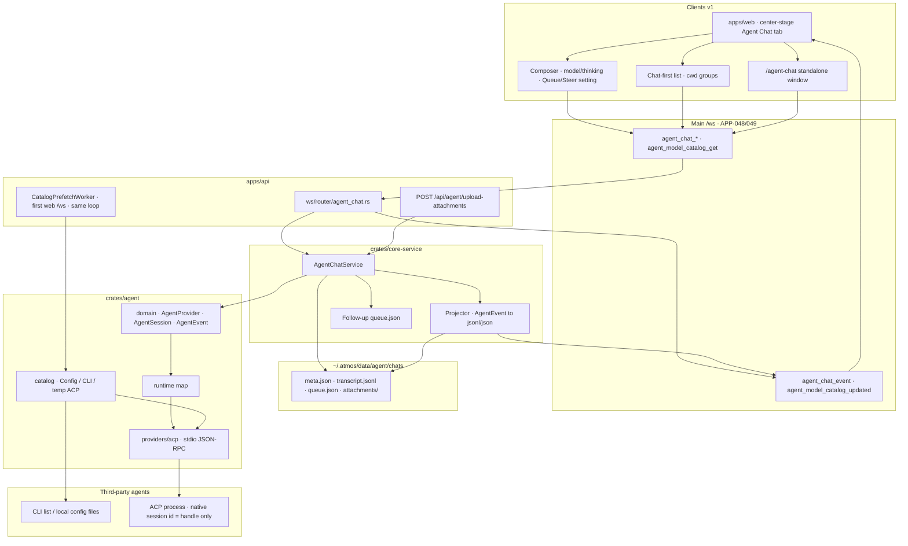

# TECH · APP-067: Atmos Agent Chat

> Technical Design · HOW. Implements PRD APP-067: Atmos Agent Chat.

## Scope summary

Replace ACP-shaped Agent Chat with an Atmos-owned Conversation host. Agent Chat becomes a center-stage tab (plus conversation list and standalone window). History restore reads Atmos rows; provider resume happens only on continue. Live chat rides the main `/ws` kernel. A unified **model catalog** lets the user pick model and thinking depth **before** spawn.

Addresses **M1–M19**. N1–N6 deferred. APP-024 terminal-agent run-config UI stays; its CLI model-list parsers are lifted into the shared catalog so Chat and Terminal do not grow a second parser zoo.

## Decisions locked here

| Fork | Decision |
|------|----------|
| Client transport | Main `/ws` `WsContract` actions + `agent_chat_event` notifications. Delete dedicated `/ws/agent/{session_id}` as the chat model. |
| History hydrate | WS `agent_chat_get` / `agent_chat_messages` snapshot, then subscribe from `after_sequence`. No REST list/get for v1. |
| Persistence | **Files, not SQLite.** One directory per conversation under `~/.atmos/data/agent/chats/`. `meta.json` for identity/runtime; **append-only `transcript.jsonl`** for messages/turns/tools/permissions (Claude/Codex-style). `queue.json` for follow-ups. No conversation tables in `atmos.db`. |
| Steer | Capability-gated same-turn inject. ACP v1 → `supports_steer = false`. ACP v2 concurrent `session/prompt` only if the agent accepts it while running. Never cancel+resend. |
| Follow-up policy | Extend existing `AgentBehaviourSettings` with `followup_policy: "queue" \| "steer"`, default `"queue"`, global for the Atmos session. |
| Pre-spawn catalog | On first web `/ws` (enter app), start **one** in-process prefetch worker for every **user-enabled** agent. Same worker keeps polling; do **not** register an APP-051 `IntervalSpec` timer. Cache TTL **4 hours**. Strategies: CLI discovery, local config files, temporary ACP session (model/mode `configOptions`). |
| IDs | Atmos `guid` UUIDs (same as other tables). Never `chat_id == acp_session_id`. |
| Host model | One Atmos **Agent Chat** document. Wire: `agent_chat_*` + `agent_chat_event`. Id: `chat_id`. Disk: `~/.atmos/data/agent/chats/`. Provider trait: `AgentRuntime`. Clients fold **`AgentEvent[]`**. Turn / Message / Part are projections. |
| Modal host | Remove `ModalAgentChatPanel` as a global host. Keep history sidebar + `/agent-chat` standalone. |
| APP-018 leftover | `session/resume`, `session/close`, capability honesty stay **inside** the ACP adapter. |
| Cursor list argv | Canonical: `cursor-agent --list-models` (already in `builtin_agents.json`). Resolve the executable the same way as other agents (`cmd` / PATH). Do not also ship a `cursor models` spec unless the installed binary’s `--help` requires it. |
| Prefetch poll | Worker sleep **30 minutes**; cache TTL **4 hours**. |
| Delta persist | Projector flushes assistant text to rows at most every **100ms**. |

## Unified Agent host

Clients (Web / Desktop now; Mobile / CLI later) speak one host document and one event log. ACP / CLI / SDK stay behind a provider adapter.

```text
Client  Web / Mobile / CLI / Desktop
              │
              ▼
        Agent Chat          // Atmos chat_id; wire: agent_chat_*
              │
        AgentEvent[]        // one log for persist, WS, and live fold
              │
        Persistence         // meta.json + transcript.jsonl + queue.json
              │
              ▼
        AgentProvider
              │
        Provider runtime    // process handle; not an ACP session id
              │
        Adapter
              │
        ACP / CLI / SDK
```

Do **not** call the host `AgentSession`. That name collides with ACP `session/new`. The provider handle is `AgentRuntime`.

Legacy names that must not grow: `ChatSession`, `ThreadEntry` as SOT, `LiveTurn`, `AgentSessionService` ACP host, `AgentChatPayload` as a second event enum (wire payload is the host `AgentEvent` envelope). `agent_chat_get` and the live fold share `AgentMessage` / `AgentPart`. `FoldedTurn` stays internal to the host for steer/cancel.

## Architecture overview

```text
apps/web  (center-stage tab + list + standalone)
    │  main /ws  (APP-048/049)
    ▼
apps/api  agent_chat router + event adapter
    │
    ▼
crates/core-service  AgentChatService + Projector + Queue
    │
    ▼
crates/agent
    domain/          AgentProvider, AgentRuntime, AgentEvent, AgentModel
    catalog/         strategies: config | cli | acp  + parsers + cache
    providers/acp/   ACP process, stdio JSON-RPC, permission, resume handle
apps/api            first /ws connect starts catalog prefetch worker (same job loops)
```

Two transports stay distinct:

- **Client ↔ Atmos**: main `/ws` (this spec).
- **Atmos ↔ provider**: ACP stdio JSON-RPC (or later CLI/SDK) inside `providers/*`. Never leaked to web.

### Global architecture



Identity split: `conversation.guid` is the chat; `agent_runtime_session.persistence_handle` is the native ACP id and must never be used as the list/tab id.

## Module-by-module design

### crates/agent

Today: `acp_client/` + `manager/`, public `run_acp_session` / `AcpSessionEvent`. Target:

```text
crates/agent/src/
  domain/{capabilities,event,model,session}.rs
  catalog/{mod,cache,spec,strategy,parse}.rs
  catalog/strategies/{config,cli,acp}.rs
  catalog/parse/{line_list,grok,kiro_json,opencode,kimi,aider,cursor,acp_options}.rs
  providers/acp/{adapter,runner,process,tools}   # move current acp_client
  runtime/mod.rs
  manager/   # install / registry / keyring unchanged
```

Public API (no ACP types):

```rust
trait AgentProvider {
    fn id(&self) -> &str;
    async fn capabilities(&self, ctx: &AgentCatalogContext) -> Result<AgentCapabilities>;
    async fn create_session(&self, cfg: AgentSessionConfig) -> Result<Box<dyn AgentSession>>;
    async fn resume_session(&self, handle: AgentPersistenceHandle, cfg: AgentSessionConfig)
        -> Result<Box<dyn AgentSession>>;
}

trait AgentSession {
    async fn prompt(&mut self, input: AgentPrompt) -> Result<AgentTurnHandle>;
    async fn steer(&mut self, input: AgentPrompt) -> Result<()>; // Err if !supports_steer
    async fn cancel(&mut self) -> Result<()>;
    async fn close(&mut self) -> Result<()>;
    async fn set_config(&mut self, update: AgentSessionConfigUpdate) -> Result<()>;
    fn events(&mut self) -> AgentEventStream;
    fn persistence_handle(&self) -> Option<AgentPersistenceHandle>;
}

pub enum AgentEvent {
    SessionStarted { .. },
    TurnStarted { turn_id, .. },
    UserMessage { turn_id, message_id, kind: UserMessageKind, .. },
    AssistantMessageDelta { message_id, delta },
    AssistantMessageCompleted { message_id },
    ThinkingDelta { message_id, delta },
    ThinkingCompleted { message_id },
    ToolCallStarted { tool_call_id, .. },
    ToolCallUpdated { tool_call_id, .. },
    ToolCallCompleted { tool_call_id, .. },
    ToolCallFailed { tool_call_id, .. },
    PlanUpdated { .. },
    PermissionRequested { request_id, .. },
    PermissionResolved { request_id, .. },
    UsageUpdated { .. },
    ConfigChanged { .. },
    TurnCompleted { turn_id, stop: TurnStop },
    TurnFailed { turn_id, .. },
    TurnCanceled { turn_id },
    SessionClosed,
}
```

`UserMessageKind` is `Normal | Steer`. Queue items are **not** provider events until dispatched as a new turn.

ACP mapper (`providers/acp` + `acp_client`) is the only module allowed to import `agent-client-protocol` schema types. It converts `AcpSessionEvent` → `AgentEvent` and maps `steer` to a second `session/prompt` only when capabilities say the agent will accept it while running. Claude `usage_update` null `used`/`size` values are coerced on the stdio JSON-RPC stream (`acp_client::usage_normalize`); do not vendor the schema crate for that.

### crates/infra

**No new SQLite tables** for Conversation. Chat is a file store under `~/.atmos/data/agent/` (see Data model). `atmos.db` stays for Project/Workspace/etc.

Optional: a tiny FS helper in `crates/infra/src/utils/` only if atomic write/rename is not already there. Domain files belong to `core-service`.

### crates/core-service

```text
crates/core-service/src/service/agent_chat/
  mod.rs              # AgentChatService
  store.rs            # meta.json / transcript.jsonl / queue.json / index.json
  apply_event.rs      # AgentEvent → jsonl + outbound AgentChatEvent
  queue.rs            # pending follow-ups in queue.json, dispatch on turn complete
  catalog.rs          # thin wrap of crates/agent catalog + cwd/agent resolution
```

`AgentSessionService` (`crates/core-service/src/service/agent_session.rs`) stops being the chat identity. Runtime spawn/resume becomes `AgentChatService` calling `AgentProvider`. Delete `~/.atmos/data/agent/session_config_snapshots.json` as SOT (selected model lives in `meta.json`).

`terminal_agent_model_catalog` in `crates/core-service/src/service/automation/agents.rs` becomes a facade over `crates/agent` catalog for command-spec agents so APP-024 keeps its WS action but not a second parser.

### apps/api

- New router `apps/api/src/api/ws/router/agent_chat.rs`.
- DTOs in `apps/api/src/api/ws/message/agent_chat.rs` (or `message.rs` module split).
- Map service events → `WsEvent::AgentChatEvent`.
- Delete chat path: `apps/api/src/api/ws/agent_handler.rs`, `POST /api/agent/session`, `POST /api/agent/session/resume`, `GET /api/agent/sessions`.
- Keep `POST /api/agent/upload-attachments` (multipart; WS is a poor fit). Paths stored as attachment parts on send.
- Keep existing `AgentContract` rows: `agent_list` / install / config / registry / custom_agent_*. Logout: WS `agent_logout` if not already mapped; do not keep REST logout as the chat API.

### packages/api-types + api-client

Same PR as Rust: extract actions/events, add `contract/agent-chat.ts`, `dto/agent-chat.ts`, `WsEventContract` row for `agent_chat_event`. Apps call `wsRequest("agent_chat_send", { ... })` with no extra `<T>`. Feature wrappers stay in `apps/web`.

### apps/web

- `CenterTabKind` += `"agent-chat"` in `apps/web/src/app-shell/center-stage-tab-model.ts`. Tab id binds `chat_id`.
- Plus menu New Agent Chat next to New Terminal (`CenterStageTabBar.tsx`). Empty launcher + New Workspace can create a conversation tab (M2).
- Chat chrome: transcript + composer + existing history sidebar, now fed by `agent_chat_list` grouped by `cwd`.
- Remove `ModalAgentChatPanel` from `apps/web/src/app/(app)/layout.tsx`.
- Standalone `apps/web/src/app/agent-chat/page.tsx` takes `chatId` (create if missing).
- Composer: idle send → `agent_chat_send`; busy Enter follows `followup_policy`; one-shot for the other action; Stop → `agent_chat_cancel` (does not send draft).
- New Chat header: agent picker → `agent_model_catalog_get` → model + thinking (if catalog says so) **before** first send.
- Do not import ACP schemas.

**Frontend reuse (do not rewrite the Chat skin):**

| Keep | Adapt (thin mapper) | Replace |
|------|---------------------|---------|
| `@workspace/ui` ai-elements: `Conversation` / `ConversationContent` (stick-to-bottom), `Message` / `MessageContent` / `MessageResponse` (**Streamdown** token animation), `Reasoning`, `Tool` / `Skill`, `Attachments`, `Confirmation`, prompt-input primitives | `AgentChatMessageView`, `AssistantMessageView`, `ToolOrSkillBlock`, `PlanBlockView`, `TerminalBlock`, `SubAgentBlockView` — render `AgentMessage.parts` (`AgentPart`); tool skin may adapt a `tool_call` part locally | `ThreadEntry` / `LiveTurn` / `turnsToThreadEntries`; ACP `/ws/agent` handlers; `thread/reducer.ts` on the live path |
| History sidebar chrome + cwd grouping UI (`AgentChatHistorySidebar*`) | List rows bind `chat_id` + Atmos title/cwd; drop `acp_session_id` as identity | `use-acp-session-list` / ACP `session/list` |
| `AgentPromptComposer`, `MessageQueueDock`, copy/usage/activity chrome | Enter routes via global `followup_policy`; dock reads conversation queue WS | Local dialog-store queue as SOT; idle-only dispatch in the panel |
| `AgentChatPanel` layout (header + list + transcript + composer) | Add center-stage `agent-chat` tab host; keep standalone page | `ModalAgentChatPanel` as global host; `variant: modal` as the product default |

Streaming: keep Streamdown. Deltas arrive as `agent_chat_event` `assistant_message_delta` on main `/ws`. Snapshot `messages` and live `foldMessagesFromEvent` share `@atmos/api-types` `AgentEvent` → `AgentMessage` / `AgentPart`. Fold normalizes think tools into `thinking` parts, todo/switch-mode tools into `plan` parts, and remaining tools onto closed `AgentToolKind`. `AgentPartView` / `ToolView` render parts; host chrome (plan/permission/queue) stays outside the transcript. Do not keep a second socket, `LiveTurn`, `ThreadEntry`, or `ToolCallBlock` on the live path.

## Data model

File-backed, matching local coding agents (Claude Code `~/.claude/projects/**/*.jsonl`, Codex `~/.codex/sessions/**/*.jsonl`, Grok `summary.json` + `chat_history.jsonl`). Not `atmos.db`. Layout follows `agents/references/runtime/atmos-home-layout.md` (`data/` = durable product data):

```text
~/.atmos/data/agent/chats/
  index.json                         # list summaries (rebuildable from meta.json)
  {chat_id}/
    meta.json                        # identity, cwd, provider, runtime, seq
    transcript.jsonl                 # append-only transcript (SOT for turns/messages)
    queue.json                       # pending follow-ups
    attachments/                     # uploaded files referenced by parts
```

Do **not** encode `cwd` in the directory name (Claude’s slash→dash slug is lossy). `cwd` lives in `meta.json` so the Chat-first list can group without guessing.

`meta.json` (atomic write: temp file + rename):

```json
{
  "id": "uuid",
  "created_at": "…",
  "updated_at": "…",
  "deleted": false,
  "title": null,
  "cwd": "/path",
  "workspace_id": null,
  "project_id": null,
  "provider_id": "claude",
  "last_message_at": "…",
  "last_event_seq": 0,
  "persistence_handle": null,
  "runtime_status": "detached",
  "selected_model": null,
  "selected_thinking": null
}
```

`transcript.jsonl`: one JSON object per line, **Atmos `AgentEvent` / message records**, not ACP frames. Fold on read: later line with the same `message_id` / `tool_call_id` wins.

Do not append every token. WS still streams deltas; disk gets:

- user message (including `kind: "steer"`) immediately
- assistant **snapshot** at most every 100ms (same `message_id`)
- tool_call / permission upserts
- turn started/completed/canceled/failed

`queue.json`: JSON array of `{ id, seq, status, prompt, display_prompt, attachments }`. Atomic rewrite.

`index.json`: `{ id, title, cwd, workspace_id, project_id, provider_id, updated_at, last_message_at, deleted }[]`. List reads this. If missing or checksum-fail, rebuild by scanning `*/meta.json`.

`MessagePart` tagged union: `text | thinking | tool_call | tool_result | plan | attachment | error`.

Projector rules:

- Restore = read `meta.json` + fold `transcript.jsonl` + `queue.json`. Do not spawn (`M5`).
- Live tab keeps the folded view in memory; jsonl is the durable log.
- Steer appends a user record `kind=steer` on the **current** turn. Require `expected_turn_id == running turn`.
- `last_event_seq` in `meta.json` increments per outbound client event.
- Soft-delete: `meta.deleted = true` and drop from default `index.json` listings. Directory stays until a later compact.
- One process writes; per-conversation mutex. JSONL append + fsync; JSON files never half-written.

## Model catalog (M19)

Unified types in `crates/agent` (clients see the same JSON via WS):

```rust
pub struct AgentModelCatalog {
    pub agent_id: String,
    pub status: CatalogStatus,          // ok | unsupported | auth_required | error | probing
    pub models: Vec<AgentModel>,
    pub modes: Vec<AgentMode>,          // ACP session modes when advertised
    pub thinking: AgentThinkingSupport, // agent-level default; models may override
    pub strategies_used: Vec<CatalogStrategyKind>,
    pub fetched_at: DateTime<Utc>,
    pub source: CatalogSource,          // cache | live
    pub message: Option<String>,
}

pub struct AgentModel {
    pub id: String,
    pub label: String,
    pub group: Option<String>,
    pub is_default: bool,
    pub thinking: Option<AgentThinkingSupport>,
}

pub enum AgentThinkingSupport {
    None,
    Enum { arg: Option<String>, options: Vec<ThinkingLevel> },
    Manual { arg: String, placeholder: Option<String> },
    EncodedInModel,
    FlagOnly { arg: String },
}

pub enum CatalogStrategyKind { Config, Cli, Acp }
```

### Prefetch worker (enter app)

Not an APP-051 `LocalScheduler` interval (`automation.schedule_tick` style). Catalog work is **session-scoped**: it starts because the user entered the app, and the **same task** keeps looping.

```text
first web /ws connect
  → CatalogPrefetchWorker.ensure_started()   // single-flight
  → loop:
        for each user-enabled agent (concurrency 2):
            if disk/memory cache age < 4h and status=ok → skip
            else probe (config / cli / temp ACP) → write cache
            emit agent_model_catalog_updated
        sleep POLL (~30 min)
        if no web /ws clients remain → exit loop
```

- Trigger: `apps/api/src/api/ws/handlers.rs` after `ws_service.register` for `ClientType::Web` (Desktop uses the same web socket). Later connects are no-ops if the worker is alive.
- Stop: last web connection unregisters, or process shutdown. Sleeping in the same task is the “poll”; do not add `JobId` + `IntervalSpec` in `apps/api/src/main.rs`.
- Enabled set: installed ACP registry agents + custom ACP agents + known agents (`claude` / `codex` / `gemini` / `antigravity`) that are installed and not user-disabled. Terminal-only builtins that are not Chat providers are not prefetched here.
- UI: `agent_model_catalog_get` is cache-first and instant; picker fills as `agent_model_catalog_updated` arrives. Prefetch must not block bootstrap or New Chat.
- `refresh=true` on `agent_model_catalog_get` probes that one agent immediately (still background-safe; UI can show `probing`).

### Cache

- TTL: **4 hours** for `ok` catalogs (memory + disk).
- Error / `auth_required`: 15 minutes (retry on the next worker loop without waiting 4h).
- Disk: `~/.atmos/data/agent/model_catalog/{agent_id}.json`.
- Worker skip rule: `ok` cache younger than 4h is not re-probed.

### Strategies (pluggable, per agent spec)

Each `AgentCommandSpec` lists ordered strategies. Default order: **Config → Cli → Acp**. Skip a step if the spec has no command / no config path / agent is not ACP. Merge: CLI/ACP model ids win; config fills thinking/modes and is the fallback when live list is empty.

1. **ConfigParse** — local files + builtin `reasoningSupport` / static lists. No process. Used when CLI/ACP cannot list, and always as thinking metadata.
2. **CliDiscovery** — run `modelList.command` argv (never a shell string). Timeout ~8s. Auth-looking output → `auth_required`.
3. **AcpProbe** — **temporary** ACP session, not a Conversation. `initialize` + `session/new` in `~/.atmos/data/agent/catalog-probe/{agent_id}/`, read `configOptions` / legacy models+modes (model, mode, thought_level / effort), then `session/close` and kill. Timeout ~15s. Never emit conversation events. Prefer a **live** `AgentSession` if one already exists (read options, do not open a second process).

Previous “ACP only on explicit refresh” is **revoked**: the enter-app worker may open temp ACP sessions in the background. The Chat tab still does not spawn a **conversation** agent until send/continue (`M5`).

### Command spec + documented probes

`AgentCommandSpec` sources: `resources/terminal-agents/builtin_agents.json`, custom agent JSON, ACP launch spec. Adding an agent = spec + parser, not a new Chat path. Parsers under `crates/agent/src/catalog/parse/`.

Documented CLI / config (examples in the product prompt were not exhaustive; this is the v1 table after checking vendor docs). Impl may adjust argv if `--help` on the installed binary disagrees.

| Agent | Live CLI (preferred) | Local config fallback | Thinking / extra |
|-------|----------------------|-----------------------|------------------|
| `cursor` | `cursor-agent --list-models` | — | `EncodedInModel` |
| `grok-build` | `grok models` | — | `--reasoning-effort` manual |
| `opencode` | `opencode models` (`--pure` if plugins must stay off) | `opencode.json` / `~/.config/opencode/opencode.json` `model` | — |
| `kimi` | `kimi provider list --json` | Kimi `config.toml` `[models.*]` / `[providers.*]` | `--thinking` flag; JSON `capabilities` / `support_efforts` |
| `pi` | `pi --list-models` | — | `--thinking` enum |
| `kiro` | `kiro-cli chat --list-models --format json` | — | — |
| `commandcode` | `cmd --list-models` | — | — |
| `kilocode` | `kilo models` | — | — |
| `antigravity` | `agy models` | — | — |
| `codex` | `codex debug models` (JSON catalog; `--bundled` if offline) | `~/.codex/config.toml` `model`, `model_reasoning_effort` | reasoning from catalog `supportedReasoningEfforts` |
| `claude` | no headless `--list-models` (only `/model` / `--model`) | `~/.claude/settings.json` `model`; `claude config get model` | `--effort` enum from builtin spec |
| `gemini` | official Gemini CLI: `--model` aliases, no `--list-models` | Gemini settings / aliases `auto\|pro\|flash\|flash-lite` | — |
| `aider` | `aider --list-models` when present | `.aider.conf.yml` / `~/.aider.conf.yml` | — |
| ACP registry / custom | temp ACP session `configOptions` | agent `default_config` map | thought_level / mode options from ACP |
| `amp` `droid` `devin` `hermes` `openclaw` | none documented | builtin `reasoningSupport` / `modelSupport` only; picker may be manual or hidden | as spec |

`opencode --pure models` stays a valid **variant** on the OpenCode spec if a non-pure `opencode models` pulls plugins; prefer documented `opencode models` first.

### Apply selection

`agent_chat_create` / first `agent_chat_send` copy `selected_model` + `selected_thinking` (+ mode if any) onto `agent_runtime_session` and into `AgentSessionConfig`. Process starts on that model.

<!-- updated 2026-08-29: live configure applies model/mode/thinking -->
`agent_chat_configure` always writes `selected_model` / `selected_thinking` / `selected_mode` on conversation meta. If a runtime is alive it also calls `AgentRuntimeControl::set_config` (ACP `session/set_config_option`, or legacy `session/set_mode`). Changing `provider_id` while a runtime is alive is rejected. Model, thinking, and mode are not blocked.

## Transport

All names are serde snake_case `WsAction` / `WsEvent` variants in `apps/api/src/api/ws/message.rs`.

### Actions

| Action | Input (core) | Output |
|--------|----------------|--------|
| `agent_chat_create` | `workspace_id?`, `project_id?`, `cwd?`, `provider_id`, `model?`, `thinking?`, `title?` | Conversation summary (no spawn) |
| `agent_chat_list` | `workspace_id?`, `project_id?`, `cwd?`, `cursor?`, `limit?` | page of summaries |
| `agent_chat_get` | `chat_id` | conversation + latest turns/messages enough to paint |
| `agent_chat_messages` | `chat_id`, `limit?` | last N folded turns |
| `agent_chat_rename` | `chat_id`, `title` | summary |
| `agent_chat_delete` | `chat_id` | `{ ok }` (soft-delete; close runtime if any) |
| `agent_chat_subscribe` | `chat_id`, `after_sequence?` | `{ last_event_seq }` |
| `agent_chat_unsubscribe` | `chat_id` | `{ ok }` |
| `agent_chat_send` | `chat_id`, `text`, `attachment_paths?` | `{ turn_id }` — idle: new turn; spawns provider if detached |
| `agent_chat_steer` | `chat_id`, `expected_turn_id`, `text` | `{ turn_id }` or error |
| `agent_chat_queue_add` | `chat_id`, `text`, `attachment_paths?` | queue item |
| `agent_chat_queue_update` | `item_id`, `text?`, `status?` | item |
| `agent_chat_queue_reorder` | `chat_id`, `item_ids` | items |
| `agent_chat_queue_delete` | `item_id` | `{ ok }` |
| `agent_chat_cancel` | `chat_id` | `{ ok }` interrupt current turn |
| `agent_chat_permission_respond` | `chat_id`, `request_id`, `option_id` / allow+remember | `{ ok }` |
| `agent_model_catalog_get` | `agent_id`, `refresh?` | `AgentModelCatalog` (cache-first) |

Busy Enter: client reads `followup_policy` and calls `agent_chat_queue_add` or `agent_chat_steer`. One-shot uses the other action. If `supports_steer` is false, hide Steer and force Queue.

Follow-up setting: add `followup_policy` to `agent_behaviour_settings_get` / `_update` (`packages/api-types/src/ws/dto/settings.ts`). Default `"queue"`.

### Event

```json
{
  "type": "agent_chat_event",
  "payload": {
    "chat_id": "…",
    "event_id": "…",
    "sequence": 123,
    "payload": { "type": "assistant_message_delta", "message_id": "…", "delta": "…" }
  }
}
```

Also emit `agent_model_catalog_updated` `{ agent_id, catalog }` when the prefetch worker (or a refresh) writes a live catalog so open pickers update without a second request.

Subscribe is per connection. Fan-out conversation events to every subscriber of that `chat_id` (standalone + center-stage). Unload provider after idle timeout using existing agent behaviour idle setting; conversation rows remain.

### REST (exception)

`POST /api/agent/upload-attachments` stays. Justification: multipart file upload. Send then references returned paths.

No new REST for conversation CRUD.

## Persistence & reconnect

1. Open tab → `agent_chat_get` (fold `meta.json` + `transcript.jsonl`, including last assistant snapshot) → `agent_chat_subscribe(after_sequence: last_event_seq)`.
2. No provider start on get (`M5`).
3. First `agent_chat_send` / `agent_chat_steer` / queue dispatch → `create_session` or `resume_session(persistence_handle)` from `meta.json`.
4. Reload during a running turn: disk has ≤100ms-lag snapshots; subscribe catches new events. If the process died, `runtime_status` is `detached`; UI shows stored messages until the user continues.

## Steer mapping

```text
agent_chat_steer
  → require running turn and expected_turn_id match
  → persist user message kind=steer on that turn
  → AgentSession.steer()
       ACP v1: error unsupported → UI already hid Steer
       ACP v2: session/prompt contributing to foreground work; no TurnStarted
       future Codex provider: turn/steer
  → agent sees text on next model step (non-interruptive)
```

Permission open (`waiting_permission`): queue dispatch waits; steer is allowed and does not resolve the permission (`M14`).

## Security & permissions

- Local Computer only; existing `/ws` origin/host guards apply.
- `cwd` / attachments must stay inside the selected Project or Workspace path (`path_within_root`).
- Permission prompts remain user-gated; do not auto-approve in v1 (N4 later).
- Persistence handle (ACP id) is not shown as the chat identity.
- Catalog CLI runs argv from specs, not a user-supplied shell string.
- Temp ACP catalog probes use an isolated cwd under `~/.atmos/data/agent/catalog-probe/`; they must not write into the user's Project/Workspace. Close/kill even on timeout.

## Rollout plan

1. Conversation file store (`meta.json` / `transcript.jsonl` / `queue.json` / `index.json`) + tests. No UI.
2. `crates/agent` domain + ACP adapter emitting `AgentEvent`. Catalog strategies + parsers + 4h cache. Prefetch worker on first web `/ws`. `agent_model_catalog_get` + `agent_model_catalog_updated`. Facade APP-024 catalog.
3. `AgentChatService` CRUD + restore. WS list/get/rename/delete. Web history sidebar + center-stage tab + plus menu. No live spawn yet.
4. Projector + spawn/resume on send. Permission. `queue.json` + dock. Delete `/ws/agent` and REST session create/list/resume. Standalone on `chat_id`.
5. Steer + `followup_policy`. Hide Steer when unsupported.
6. Remove `ModalAgentChatPanel`. Composer pre-spawn model/thinking. Drop `ThreadEntry` ACP types.

Each step is mergeable; 3 is already a usable read-only history host.

## Risks & tradeoffs

- **Temp ACP probes are heavier than CLI.** Limit concurrency to 2, isolate cwd, and skip agents with a fresh 4h cache. Tradeoff: Chat picker can be full before the user opens New Chat.
- **Enter-app prefetch vs idle Computer.** Worker runs only while a web `/ws` is connected, so a sleeping laptop with no UI does not keep probing.
- **Two catalog WS actions** (`terminal_agent_models_get` vs `agent_model_catalog_get`) in v1. Shared engine underneath; Terminal UI migration is not this spec.
- **JSONL vs SQLite.** Files match Claude/Codex/Grok local transcripts, are greppable, and stay out of `atmos.db`. List uses `index.json`/`meta.json` so we never parse every jsonl to draw the sidebar. N1 search can grep jsonl later.
- **Throttled jsonl snapshots vs per-token lines.** Tokens stay on the WS; disk snapshots lag ≤100ms so files do not explode.
- **Steer support is uneven.** Capability honesty over fake inject.
- **Rollback**: feature-flag the new tab/router; keep old `/ws/agent` until step 4 lands, then delete. No data migration from ACP `session/list`.

If this breaks: users still have Terminal. Soft-deleted conversations remain in SQLite.

## Dependencies & compatibility

- Depends on: APP-048, APP-049, APP-004 (ACP process/permission/registry), APP-064 contract hardening.
- Supersedes in product: APP-018 history identity; APP-004 chat transport.
- Does not block or rewrite: APP-024, APP-030, APP-015/022/027.
- External binaries: whatever `AgentCommandSpec` lists (`grok`, `cursor-agent`, `kimi`, `opencode`, `aider`, …). Missing binary → catalog `error` / `unsupported`, Chat still opens with manual/no model.

## Open questions

None remaining for v1. Cursor argv, prefetch poll, and delta flush are locked in the decisions table. Parser argv tweaks at impl time (binary `--help`) are implementation details, not product forks.
