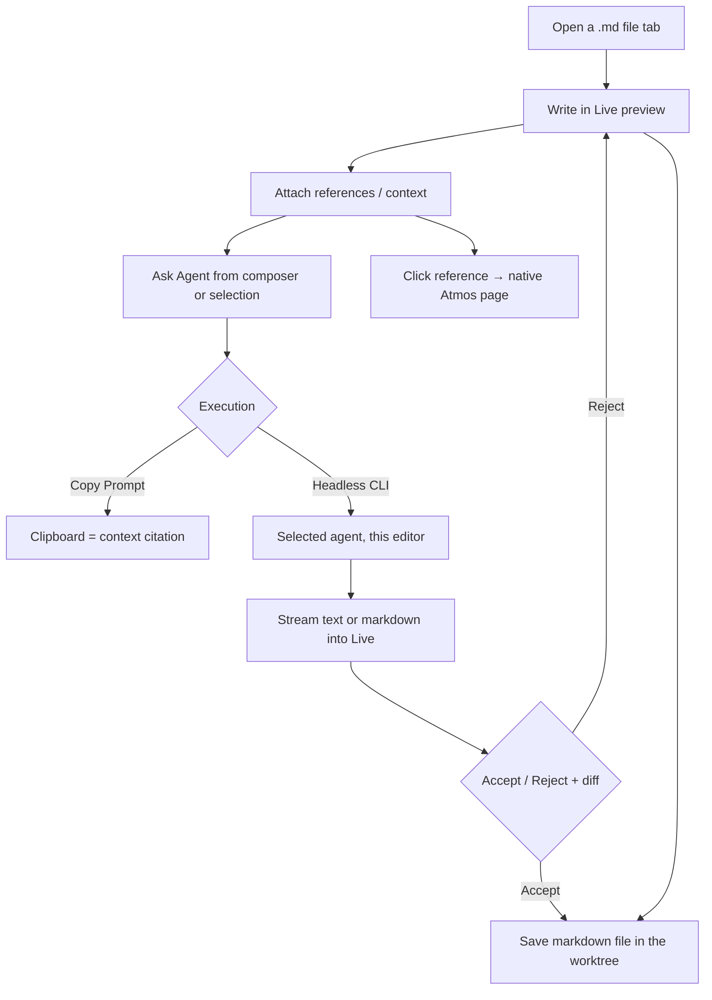

# PRD · APP-067: Document Editor

> Product Requirements · WHAT and WHY. Settled direction for **Live markdown** — an Agent-native live editor on the existing markdown file tab. Implements Option B from [BRAINSTORM.md](./BRAINSTORM.md). Source PRDs: [v1](./source/Atmos-Editor-PRD-v1.md), [v2](./source/Atmos-Editor-PRD-v2.md). Package / feature name: **`md-live`**. Not a Docs workbench.

## Context

- **Problem**: Builders write requirements and plans in Notion, Google Docs, or raw markdown, then paste context into a Terminal Agent. Atmos already has Agents, files, Git, GitHub, Linear, Wiki, Canvas, and PT Design, but no document surface that **authors**, **binds those objects as context**, and **dispatches the same Agents**.
- **Why now**: Composer, terminal-agent headless runs, ACP, and filesystem WS already exist. The missing piece is a writing surface, not a new Agent stack. The two source PRDs converged on that job; this spec locks the cut line against the current codebase.
- **Product name**: **Live** / **Source** on the markdown file tab (sentence case). Spec name: **Document Editor**. Code: `@atmos/md-live` + `features/md-live`. Never brand as **Docs**, never as a second “Editor” next to CodeMirror, and never as Canvas or Wiki.
- **Related specs**:
  - APP-004 / APP-018 — ACP sessions (P1 consumer, not a new protocol)
  - APP-005 / APP-057 — GitHub / Linear as **references**, not embedded clients
  - APP-006 / APP-007 / APP-008 — Wiki stays generated knowledge; Live markdown does not replace it
  - APP-014 / APP-037 — Canvas stays the spatial ops desk
  - APP-017 / APP-024 — terminal-agent catalog + headless execution
  - APP-050 / APP-062 — package isolation pattern (schema package, thin host)
  - APP-063 — product CLI / skills; md-live does not add a second CLI in v1

## Goals

1. **Primary** — Users can create, edit, and save a working document in the current Project or Workspace as a real markdown file.
2. **Primary** — Users can attach Atmos objects as in-document **references** and as **Agent context**, then send a structured prompt without retyping the project.
3. **Primary** — Agent execution in this surface is **PromptComposer + headless CLI**. Copy Prompt is context citation only. The editor does not send into the user’s Terminal and does not ask the agent to write the document file.
4. **Secondary** — Live preview vs source (CodeMirror) on the same `.md` file, lossless for GFM + Atmos refs.
5. **Secondary** — From a reference chip, users jump to the native Atmos page. Live never reimplements GitHub, review, or Diff pages.

Non-goals are listed under Out of Scope, not here.

## Users & Scenarios

- **Primary persona**: Agentic Builder in a Project / Workspace who is writing a requirement, plan, or note and wants an Agent to implement or revise from that document.
- **Secondary persona**: The same user capturing a short prompt / scratch note in a markdown file tab (Live vs Source, no second “Simple” mode).

### Key scenarios

1. In a Workspace, the user chooses **New note**, writes a requirement in Live (untitled until save), then **Save as** into the worktree (directory + filename). They `@`-mention `src/auth/**` and GitHub `#128`, then **Copy Prompt** (context citation) — or **Rewrite** / **Generate** from the docked composer, which runs the selected agent **headless** and streams text or markdown into Live for Accept / Reject.
2. The user selects a paragraph, chooses **Rewrite**. New markdown streams into Live (highlighted). They **Accept** or **Reject**. Accept commits the span; Reject restores the original. Then they save.
3. The user inserts a GitHub issue as a **card** in the document: title, status, and an **Open** button. The button lands on the existing Atmos GitHub issue surface — not an embedded GitHub app. A file mention in a sentence can still be a compact **inline** embed.
4. The user toggles Live preview ↔ Source; headings, lists, tasks, and embed directives remain the same `.md` bytes aside from normal markdown normalization.



## User Stories

- As a builder, I want to write plans as markdown in the current Project / Workspace, so they sit next to the code they describe.
- As a builder, I want the document stored as markdown on disk, so git, `@file`, and terminal agents see the same artifact I am editing.
- As a builder, I want to edit a markdown file in a rendered preview (Obsidian-like), so I do not have to flip to raw source for ordinary writing.
- As a builder, I want to `@` mention files, workspaces, branches, GitHub, and Linear in the composer, so the Agent receives real context rather than pasted paths.
- As a builder, I want to insert Atmos objects as **real embeds** in the document (inline chip *or* block card, with status and action buttons), so a reader can preview and jump without leaving the prose messy — and so later embed kinds can reuse the same slot.
- As a builder, I want **Copy Prompt** to copy the current selection and document context so I can paste it into any Agent — not to tell that Agent to edit this file.
- As a builder, I want Rewrite / Generate to run the selected agent **headless from this editor’s composer**, stream text or markdown into Live, and wait until I Accept or Reject.
- As a builder, I want Agent **code** changes and GitHub / review / patch displays to stay on their existing read-only surfaces, not inside Live.
- As a maintainer, I want no second Agent catalog, Skill system, or session store owned by md-live.

## Functional Requirements

### Must Have

- **M1 · Home**: Live markdown is **not a new workbench**. It upgrades the existing markdown **file tab** in `apps/web/src/features/editor/components/CodeMirrorEditor.tsx`. Live-preview helpers, slash catalog, Atmos chips, and AgentRequest types live under `apps/web/src/features/md-live` and `packages/md-live` (`@atmos/md-live`). CodeMirror remains **source mode** only.
- **M2 · Shell entry**: Opening a Live-eligible `.md` file **defaults to Live** (editable preview). Today the file tab opens markdown in Source (`CodeMirrorEditor` `previewFilePath` starts `null`); this spec changes that default. Keep the Eye / FileText toggle as **Live** vs **Source**. Review reports under `.atmos/reviews/` and `.mdx` stay read-only preview + Source — not the Live editor. No launchpad item and no extra center-stage tool tab in v1.
- **M3 · Worktree markdown**: Source of truth is the UTF-8 `.md` file being edited. **New note** does **not** use a `docs/` folder. It opens an **untitled** Live tab (no disk write yet). Default proposed location is the current Project / Workspace **root** (`{effectivePath}/`). Default proposed name matches Canvas: `Untitled.md`, then `Untitled-1.md`, `Untitled-2.md`, … if that name exists in the chosen directory. The user writes first; **Save** on untitled is **Save as**: pick directory and filename (fields prefilled with those defaults), then `fs_write_file`. Later Cmd-S overwrites that path. Opening any **Live-eligible** worktree `.md` uses the same live editor. Review reports, `.mdx`, GitHub bodies, and patches are not Live-eligible.
- **M4 · No document database**: No SQLite document / EditorAgent tables.
- **M5 · Editing engine**: **Markdown-first live preview** (Obsidian-like WYSIWYM). The file remains markdown. **No** Notion-like block chrome (no drag handles, no nested-block document model). **No** BlockNote. **No** Tiptap paid Notion-like template / AI Toolkit. Library choice in TECH must be MIT and markdown-round-trip tested. **Live must look like Atmos**, not Milkdown Crepe/Nord: same typography and prose as today’s `MarkdownRenderer`; slash, toolbars, Accept/Reject, and embeds use `@workspace/ui`.
- **M6 · GFM writing**: Paragraph, headings, bullet / numbered / task lists, quote, fenced code, GFM table, divider, images as relative worktree files. Undo / redo. Markdown shortcuts (`# `, `- `, `` ``` ``) work in Live the way Obsidian does for common marks.
- **M7 · Live vs Source**: **Live** = rendered, editable preview. **Source** = existing `BaseCodeMirrorEditor`. Same file. Switching does not require a second schema. Source remains the escape hatch for messy markdown.
- **M8 · Save**: Existing file-tab save (Cmd/Ctrl-S, dirty) once the note has a real path. Untitled notes: Cmd-S opens **Save as** (directory + filename). Autosave does not run until a path exists. No new persistence API (`fs_write_file`).
- **M9 · Slash in the document**: `/` in Live inserts **markdown constructs** (heading, list, table, Atmos reference, …). This is not PromptComposer `/`. Composer slash stays in the composer dock only.
- **M10 · Selection / hover toolbar**: Selecting text in Live shows a compact toolbar: turn into heading/list/quote/code, plus Ask / Rewrite / Summarize. Ask fills the docked composer with a `doc-selection` context chip. Rewrite / Generate / Continue start M16 streaming via the selected agent. **Do not** also show `SelectionPopover` on Live (that popover stays on Source / code / wiki / preview as today).
- **M11 · Shared composer (required on Live-eligible markdown tabs)**: Those tabs **dock the existing `PromptComposer`** (Live and Source), same kernel as Welcome and Terminal AI Input (`apps/web/src/features/welcome/components/PromptComposer.tsx`). Do **not** fork a second composer. One shared composer; **surface = `md-live`** registers its own `@` / `/` providers. Renderer-only files (review reports, `.mdx`) do **not** get the dock. This is the v2 split (Welcome / Terminal / Live markdown), not a third input box. Focus owns `/` and Cmd-Enter. The user does **not** run this feature by typing into Terminal.
- **M12 · Default Agent context**: Current file path + body (or excerpt) + selection + current Project / Workspace / branch. Not dumped into the prose.
- **M13 · Composer mentions**: On the Live composer: `@file`, `@folder`, `@workspace`, `@branch`, `@github`, `@linear`. Reuse existing search APIs. Unresolved free text is not treated as a resolved chip.
- **M14 · Atmos embeds**: Live can insert Atmos objects as **Milkdown custom nodes** (ProseMirror atoms + React Node Views), not as styled `<a>` chips. v1 supports two layouts from one registry: **inline** (compact, in a sentence) and **card** (block: title, status/metadata, action buttons such as **Open**). Disk syntax is Generic Directive (`remark-directive`), not a hijacked markdown link — so a card can carry structured attrs and future kinds do not need a new schema. Source / git / Agents still see the directive text plus a public `url` attr when one exists. Ordinary `https://` links stay ordinary links. **Open** navigates to the native Atmos surface. Do **not** iframe GitHub, Diff, Canvas, or Linear inside the card. Unknown `kind`s render a generic fallback card (title + attrs), they do not crash Live.
- **M15 · AgentRequest + adapters**: **Copy Prompt** and **Run with the Agent selected in the composer**. Agent picker **reuses the existing AI Input Agent Select** + APP-024 headless flags. No new Agent catalog. No “Send to current Terminal.” Copy Prompt is a **context citation** (path, selection, mentions) — it does not instruct any Agent to edit this file. Run is headless CLI owned by this editor: do not switch the user to Terminal, do not ask the agent to write `{document.path}`.
- **M16 · In-document streaming + Accept / Reject**: Generate, Rewrite, Continue stream **into Live** (cursor insert, or replace the current selection). The prompt may ask for **plain text** or **formatted markdown**; both preview in real time. While streaming, the incoming span is visually distinct (highlight + a compact **AI** marker). When the stream ends, the user **Accept**s or **Reject**s (all, and per changed block when Milkdown diff UI provides it). Reject restores the pre-stream document. Accept makes the new content the editor buffer; save uses the existing file-tab path. **This editor has one write path:** Accept → save. Do **not** also let the agent edit the document file. Provider = fence extracted from the headless PTY this editor started (TECH D24–D26). Copy never streams. Do **not** scrape the user’s interactive Terminal, use Milkdown Crepe as an Agent runtime, Tiptap AI Toolkit, or BlockNote XL AI. Tool traces are not shown in Live. **Code** diffs stay on Atmos Diff.
- **M17 · Local FS**: Existing `fs_*` on the Computer. No cloud library.
- **M18 · i18n**: en + zh, sentence case English. Namespace `mdLive` (and existing `codeMirror` strings for the toggle).
- **M19 · Wiki unchanged**: **This spec does not change Wiki.** Keep setup, viewer, generate, and source-toggle as they are. Do not share Live, composer, or streaming with Wiki in v1.
- **M20 · Read-only surfaces stay read-only**: Code Review reports, GitHub / PR / issue bodies, and patch/diff hunks **do not** use the live editor — they have no authoring job there. Keep `MarkdownRenderer` (and the review metadata card) for those views. **Extract a dedicated `MarkdownPatchDiff` component** from the current renderer’s pierre `PatchDiff` path so diffs are a real component, not a live-editor node. GitHub and Atmos Diff UIs keep their own components. A ` ```diff ` fence inside a working note is ordinary fenced code in Live.

### Nice to Have

- **N1 · ACP adapter**: Start or continue an ACP chat session with the same AgentRequest (APP-004). Not required to ship M1–M19.
- **N2 · Extra submit-mode chrome** (Copy vs Run) if the shared composer’s existing submit/agent controls are not enough. Prefer reusing AI Input controls. Do **not** add Send to Terminal.
- **N3 · Reference hover previews** beyond title/status if M12 ships click-navigation first.
- **N4 · Open Diff after a headless run that changed other files** — compact affordance only. Not “Open Terminal”, not an in-document code review.
- **N5 · Context side panel** listing implicit + explicit context without putting it in the body.
- **N6 · Create Automation from this document** — handoff to APP-017 setup with instructions prefilled. No md-live-owned scheduler.
- **N7 · Slash commands for Agent actions** (`/summarize`, `/plan`, `/checklist`) as composer fillers, distinct from document `/`.
- **N8 · Dedicated tool tab / `docs/` library chrome** if the file-tab experience is not enough.
- **N9 · Mobile Live markdown** — out of v1.
- **N10 · Share live-preview engine with Wiki** — **out of this spec’s v1**; Wiki stays as today (M19). Only a later spec may reuse Live.

## Out of Scope

- **Notion-like / BlockNote / Tiptap paid template / Tiptap AI Toolkit** — wrong product and/or wrong license.
- **Milkdown/Crepe as the Agent runtime or bundled LLM** — streaming + diff **plugins** are in v1; the token `provider` is Atmos adapters only.
- **Drag-and-drop block reordering as a document model**.
- **New Agent runtime / catalog / Skill / CLI**.
- **Editor-owned session history tables**.
- **Full Git, Diff, Terminal, GitHub, Linear, Canvas, PT Design, Wiki generator** inside the markdown view.
- **Real-time multiplayer**.
- **Cloud document library**.
- **Replacing CodeMirror for non-markdown source files**.
- **Launchpad Docs item in v1**.
- **Send prompt to the user’s current Terminal**.
- **Agent writes the current document file** (dual-write vs Live stream).
- **Mounting Live on review reports, GitHub/PR/issue bodies, or patch displays**.
- **Mobile UI**.
- **Document → GitHub/Linear issue create** as a built-in v1 action.

## Success Metrics

- **Leading**: Users open a Live-eligible `.md` in a real Workspace, edit in Live, and save; the file is visible in the worktree / git status.
- **Leading**: Copy Prompt includes document context plus at least one non-document reference, and does **not** include file-edit instructions.
- **Leading**: Rewrite streams into Live and Accept/Reject works without the user switching to Terminal.
- **Lagging**: Users stop pasting the same requirement into an Agent by hand for planning work that started in this file tab.
- **Qualitative**: Users describe it as “Obsidian-like markdown in the file tab,” not “Notion inside Atmos.”

Aspirational counts are unknown; do not invent adoption percentages.

## Risks & Open Questions

- **Risk**: Live-preview libraries normalize markdown (spacing, list markers). Mitigation: TECH D22 — no-edit open must not dirty or rewrite disk; round-trip fixtures (including a real README) are a ship gate; Source remains the byte escape hatch.
- **Risk**: Document `/` vs composer `/`. Mitigation: TECH D29 — slash is focus-owned.
- **Risk**: Complex GFM tables. Mitigation: edit tables in Source in v1 if Live is weak.
- **Risk**: Agents ignore the stream fence or write the file anyway. Mitigation: TECH D24–D27, D38 — no fence leaves Live unchanged; junk aborts; stream lock; Accept/save is the only document write.
- **Closed in TECH**: Headless PTY + `<!--atmos-md-live-->` extractor; `text` vs `markdown` output hints; no Terminal send; Copy Prompt is citation-only. Composer dock is **on** for Live-eligible markdown tabs (M11).

## BRAINSTORM forks

| Fork | PRD decision |
|------|----------------|
| 1 Persistence | Worktree markdown. New note = untitled buffer; Save as defaults to `{effectivePath}/Untitled.md` (Canvas-style `Untitled-N`); no `docs/` folder; no SQLite document store. |
| 2 Writing engine | **Editable markdown live preview.** No BlockNote, no Notion-like. |
| 3 Agent runtime | Shared composer + **existing Agent Select**; Copy (citation) + headless in this editor (APP-024). No Terminal send. No agent file writes. Stream text or markdown into Live; Accept / Reject. ACP is N1. Wiki unchanged. |
| 4 Shell | Existing `.md` file tab. No launchpad in v1. |
| 5 Naming | Live / Source on the file tab. `@atmos/md-live` + `features/md-live`. Not `docs`, not `features/editor`. |
| 6 Two modes | **Dropped.** Live vs Source replaces Notion-like vs Simple. |
| 7 Transport | Reuse `fs_*`. Headless PTY tap only; no `terminal_input` to the user’s shell. |
| 8 Coexistence | Source stays CodeMirror and is **unmounted** while Live is shown. Live only for Live-eligible `.md`. Review / GitHub / diffs stay dedicated read-only components (`MarkdownPatchDiff`). |

## Milestones

- **Phase 1 — Live edit**: M1–M8, M17–M18, **M20** (`MarkdownPatchDiff` extract + Live-eligible gate).
- **Phase 2 — Slash, toolbar, chips**: M9, M10, M14.
- **Phase 3 — Agent**: M11–M13, M15, **M16** (headless stream `text` \| `markdown` + Accept / Reject).
- **Phase 4 — Nice**: N1–N10.
