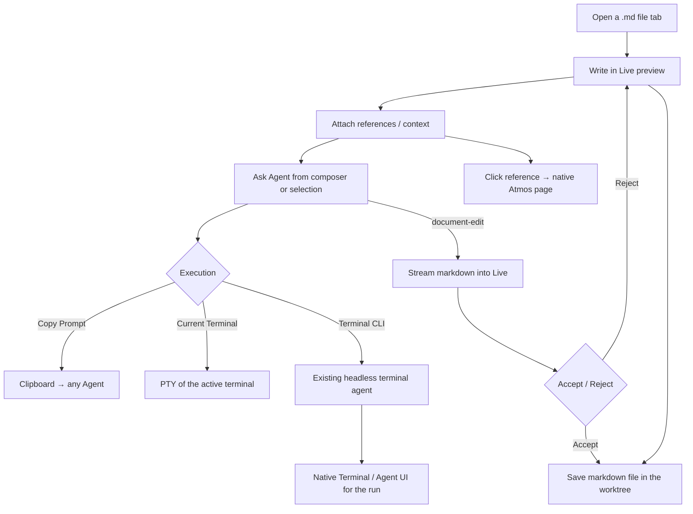

# PRD · APP-067: Document Editor

> Product Requirements · WHAT and WHY. Settled direction for **Docs** — an Agent-native development document editor. Implements Option B from [BRAINSTORM.md](./BRAINSTORM.md). Source PRDs: [v1](./source/Atmos-Editor-PRD-v1.md), [v2](./source/Atmos-Editor-PRD-v2.md).

## Context

- **Problem**: Builders write requirements and plans in Notion, Google Docs, or raw markdown, then paste context into a Terminal Agent. Atmos already has Agents, files, Git, GitHub, Linear, Wiki, Canvas, and PT Design, but no document surface that **authors**, **binds those objects as context**, and **dispatches the same Agents**.
- **Why now**: Composer, terminal-agent headless runs, ACP, and filesystem WS already exist. The missing piece is a writing surface, not a new Agent stack. The two source PRDs converged on that job; this spec locks the cut line against the current codebase.
- **Product name**: **Docs** in the shell (sentence case). Spec / engineering name: **Document Editor**. Never brand as a second “Editor” next to the CodeMirror file editor, and never as Canvas or Wiki.
- **Related specs**:
  - APP-004 / APP-018 — ACP sessions (P1 consumer, not a new protocol)
  - APP-005 / APP-057 — GitHub / Linear as **references**, not embedded clients
  - APP-006 / APP-007 / APP-008 — Wiki stays generated knowledge; Docs does not replace it
  - APP-014 / APP-037 — Canvas stays the spatial ops desk
  - APP-017 / APP-024 — terminal-agent catalog + headless execution
  - APP-050 / APP-062 — package isolation pattern (schema package, thin host)
  - APP-063 — product CLI / skills; Docs does not add a second CLI in v1

## Goals

1. **Primary** — Users can create, edit, and save a working document in the current Project or Workspace as a real markdown file.
2. **Primary** — Users can attach Atmos objects as in-document **references** and as **Agent context**, then send a structured prompt without retyping the project.
3. **Primary** — Agent execution reuses existing Atmos runtimes. Docs is Prompt + Context + Adapter, not an Agent vendor.
4. **Secondary** — Live preview vs source (CodeMirror) on the same `.md` file, lossless for GFM + Atmos refs.
5. **Secondary** — From a reference chip, users jump to the native Atmos page. Docs never reimplements those pages.

Non-goals are listed under Out of Scope, not here.

## Users & Scenarios

- **Primary persona**: Agentic Builder in a Project / Workspace who is writing a requirement, plan, or note and wants an Agent to implement or revise from that document.
- **Secondary persona**: The same user capturing a short prompt / scratch note with minimal chrome (Simple mode).

### Key scenarios

1. In a Workspace, the user opens **Docs**, creates `docs/oauth-plan.md`, writes a requirement, `@`-mentions `src/auth/**` and GitHub `#128`, then **Copy Prompt** and pastes it into Claude Code in a terminal — or **Send to current Terminal**.
2. The user selects a paragraph, chooses **Rewrite**. New markdown streams into Live (highlighted). They **Accept** or **Reject**. Accept commits the span; Reject restores the original. Then they save.
3. The user clicks a GitHub issue reference chip in the document and lands on the existing Atmos GitHub issue surface — not an embedded GitHub UI.
4. The user toggles Live preview ↔ Source; headings, lists, tasks, and Atmos chips remain the same `.md` bytes aside from normal markdown normalization.



## User Stories

- As a builder, I want to write plans as markdown in the current Project / Workspace, so they sit next to the code they describe.
- As a builder, I want the document stored as markdown on disk, so git, `@file`, and terminal agents see the same artifact I am editing.
- As a builder, I want to edit a markdown file in a rendered preview (Obsidian-like), so I do not have to flip to raw source for ordinary writing.
- As a builder, I want to `@` mention files, workspaces, branches, GitHub, and Linear in the composer, so the Agent receives real context rather than pasted paths.
- As a builder, I want to insert the same objects as lightweight references in the document body, so a reader can navigate without leaving the prose messy.
- As a builder, I want Copy Prompt, Send to current Terminal, and Run with a terminal agent, so I am not locked into an Atmos-only Agent.
- As a builder, I want Agent markdown to **stream into Live** and stay pending until I Accept or Reject, so I can see the edit in place before it sticks.
- As a builder, I want Agent **code** changes to stay on the existing Diff / Review surfaces.
- As a maintainer, I want no second Agent catalog, Skill system, or session store owned by Docs.

## Functional Requirements

### Must Have

- **M1 · Home**: Docs is **not a new workbench**. It upgrades the existing markdown **file tab** in `apps/web/src/features/editor/components/CodeMirrorEditor.tsx`. Live-preview helpers, slash catalog, Atmos chips, and AgentRequest types may live under `apps/web/src/features/docs` and/or `packages/docs`. CodeMirror remains **source mode** only.
- **M2 · Shell entry**: Opening a `.md` file already defaults to preview — that preview becomes **editable**. Keep the existing Eye / FileText toggle as **Live** vs **Source**. No launchpad item and no extra center-stage tool tab in v1.
- **M3 · Worktree markdown**: Source of truth is the UTF-8 `.md` file being edited. New working notes may default to `{effectivePath}/docs/{slug}.md` when the user creates a note from a Docs action; opening any worktree `.md` uses the same live editor.
- **M4 · No document database**: No SQLite document / EditorAgent tables.
- **M5 · Editing engine**: **Markdown-first live preview** (Obsidian-like WYSIWYM). The file remains markdown. **No** Notion-like block chrome (no drag handles, no nested-block document model). **No** BlockNote. **No** Tiptap paid Notion-like template / AI Toolkit. Library choice in TECH must be MIT and markdown-round-trip tested. **Live must look like Atmos**, not Milkdown Crepe/Nord: same typography and prose as today’s `MarkdownRenderer`; slash, toolbars, Accept/Reject, and chips use `@workspace/ui`.
- **M6 · GFM writing**: Paragraph, headings, bullet / numbered / task lists, quote, fenced code, GFM table, divider, images as relative worktree files. Undo / redo. Markdown shortcuts (`# `, `- `, `` ``` ``) work in Live the way Obsidian does for common marks.
- **M7 · Live vs Source**: **Live** = rendered, editable preview. **Source** = existing `BaseCodeMirrorEditor`. Same file. Switching does not require a second schema. Source remains the escape hatch for messy markdown.
- **M8 · Save**: Existing file-tab save (Cmd/Ctrl-S, dirty). No new persistence API.
- **M9 · Slash in the document**: `/` in Live inserts **markdown constructs** (heading, list, table, Atmos reference, …). This is not PromptComposer `/`. Composer slash stays in the composer dock only.
- **M10 · Selection / hover toolbar**: Selecting text in Live shows a compact toolbar: turn into heading/list/quote/code, plus Ask / Rewrite / Summarize that reuse the existing selection-popover + composer path (`apps/web/src/features/selection`).
- **M11 · Shared composer (required on Live)**: Live markdown tabs **dock the existing `PromptComposer`**, same kernel as Welcome and Terminal AI Input (`apps/web/src/features/welcome/components/PromptComposer.tsx`). Do **not** fork `EditorPromptComposer`. One shared composer; **surface = `docs`** registers its own `@` / `/` providers (document mentions + agent commands). Chip rendering, keyboard, attachments, and AI context protocol stay shared. This is the v2 “Shared Agent Composer” split (Welcome / Terminal / Editor), not a third input box.
- **M12 · Default Agent context**: Current file path + body (or excerpt) + selection + current Project / Workspace / branch. Not dumped into the prose.
- **M13 · Composer mentions**: On the Live composer: `@file`, `@folder`, `@workspace`, `@branch`, `@github`, `@linear`. Reuse existing search APIs. Unresolved free text is not treated as a resolved chip.
- **M14 · Atmos components**: Inserted and stored as **readable markdown** (links `[title](atmos://doc-ref/...)`). Live renders them as chips via a Milkdown **custom node + React Node View** (not a mark view on every link, not an embedded GitHub/Diff/Canvas app). Click navigates to the native Atmos surface. Source / git / Agents still see the link text.
- **M15 · AgentRequest + adapters**: Copy Prompt, Send to current Terminal, and **Run with the Agent selected in the composer**. Agent picker **reuses the existing AI Input Agent Select** (`WelcomeAgentSelector` / `TerminalAgentSelectorWithRunConfig` + APP-024 run config / headless flags). No new Agent catalog, no Docs-owned selector. Headless CLI is the same path Terminal/Automations already use once an agent is chosen. No Docs-owned Agent runtime.
- **M16 · In-document streaming + Accept / Reject**: Generate, Rewrite, Continue, and similar **document** edits stream markdown **into Live** (cursor insert, or replace the current selection). While streaming, the incoming span is visually distinct (highlight + a compact **AI** marker). When the stream ends, the user **Accept**s or **Reject**s (all, and per changed block when Milkdown diff UI provides it). Reject restores the pre-stream document. Accept makes the new markdown the editor content; save still uses the existing file-tab path. **Provider** yields markdown chunks from Atmos adapters (Copy is non-streaming; Terminal / CLI / later ACP feed chunks). Do **not** use Milkdown Crepe as an Agent runtime, Tiptap AI Toolkit, or BlockNote XL AI. Tool traces stay in Terminal. **Code** diffs stay on Atmos Diff — never as a code review UI inside the markdown view.
- **M17 · Local FS**: Existing `fs_*` on the Computer. No cloud library.
- **M18 · i18n**: en + zh, sentence case English. Namespace `docs` (and existing `codeMirror` strings for the toggle).
- **M19 · Wiki unchanged**: **This spec does not change Wiki.** Keep setup, viewer, generate, and source-toggle as they are. Do not share Live, composer, or streaming with Wiki in v1.

### Nice to Have

- **N1 · ACP adapter**: Start or continue an ACP chat session with the same AgentRequest (APP-004). Not required to ship M1–M19.
- **N2 · Extra submit-mode chrome** (Copy vs current Terminal vs selected Agent) if the shared composer’s existing submit/agent controls are not enough. Prefer reusing AI Input controls over a new picker.
- **N3 · Reference hover previews** beyond title/status if M12 ships click-navigation first.
- **N4 · Agent result card** in the document (summary + “Open Terminal / Diff”) after a headless run completes.
- **N5 · Context side panel** listing implicit + explicit context without putting it in the body.
- **N6 · Create Automation from this document** — handoff to APP-017 setup with instructions prefilled. No Docs-owned scheduler.
- **N7 · Slash commands for Agent actions** (`/summarize`, `/plan`, `/checklist`) as composer fillers, distinct from document `/`.
- **N8 · Dedicated Docs tool tab / `docs/` library chrome** if the file-tab experience is not enough.
- **N9 · Mobile Docs** — out of v1.
- **N10 · Share live-preview engine with Wiki** — **out of this spec’s v1**; Wiki stays as today (M19). Only a later spec may reuse Live.

## Out of Scope

- **Notion-like / BlockNote / Tiptap paid template / Tiptap AI Toolkit** — wrong product and/or wrong license.
- **Milkdown/Crepe as the Agent runtime or bundled LLM** — streaming + diff **plugins** are in v1; the token `provider` is Atmos adapters only.
- **Drag-and-drop block reordering as a document model**.
- **New Agent runtime / catalog / Skill / CLI**.
- **Editor-owned session history tables**.
- **Full Git, Diff, Terminal, GitHub, Linear, Canvas, PT Design, Wiki generator** inside the markdown view.
- **Real-time multiplayer**.
- **Cloud document library**.
- **Replacing CodeMirror for non-markdown source files**.
- **Launchpad Docs item in v1**.
- **Mobile UI**.
- **Document → GitHub/Linear issue create** as a built-in v1 action.

## Success Metrics

- **Leading**: Users create or open a Docs file in a real Workspace and save it; the file is visible in the worktree / git status.
- **Leading**: A prompt copied or sent from Docs includes document context plus at least one non-document reference (`@file` / GitHub / Linear).
- **Lagging**: Users stop pasting the same requirement into Terminal by hand for planning work that started in Docs.
- **Qualitative**: Users describe it as “Obsidian-like markdown in the file tab,” not “Notion inside Atmos.”

Aspirational counts are unknown; do not invent adoption percentages.

## Risks & Open Questions

- **Risk**: Live-preview libraries normalize markdown (spacing, list markers). Mitigation: round-trip fixtures are a ship gate; Source mode always available.
- **Risk**: Document `/` vs composer `/`. Mitigation: document slash only when Live body is focused.
- **Risk**: Complex GFM tables. Mitigation: edit tables in Source in v1 if Live is weak.
- **Open for TECH**: how Terminal/CLI output is parsed into markdown tokens for the streaming plugin (M16). Composer dock is **on** for Live (M11), not optional.

## BRAINSTORM forks

| Fork | PRD decision |
|------|----------------|
| 1 Persistence | Worktree markdown under `{effectivePath}/docs/` by default; no SQLite document store. |
| 2 Writing engine | **Editable markdown live preview.** No BlockNote, no Notion-like. |
| 3 Agent runtime | Shared composer + **existing Agent Select**; Copy / current Terminal / selected-agent headless (APP-024). ACP is N1. Document edits stream in Live; Accept / Reject. Wiki unchanged. |
| 4 Shell | Existing `.md` file tab. No launchpad in v1. |
| 5 Naming | Live / Source on the file tab. `features/docs` for widgets + slash + AgentRequest. |
| 6 Two modes | **Dropped.** Live vs Source replaces Notion-like vs Simple. |
| 7 Transport | Reuse `fs_*` and existing terminal APIs. |
| 8 Coexistence | Source stays CodeMirror; Live replaces read-only `MarkdownRenderer` in the preview pane. |

## Milestones

- **Phase 1 — Live edit**: M1–M8, M17–M18. Editable preview + Source toggle + save.
- **Phase 2 — Slash, toolbar, chips**: M9, M10, M14.
- **Phase 3 — Agent**: M11–M13, M15, **M16 streaming + Accept / Reject**.
- **Phase 4 — Nice**: N1–N10.
