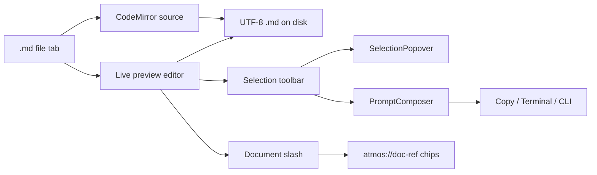

# TECH · APP-067: Document Editor

> Technical Design · HOW. Implements PRD APP-067: Document Editor. Addresses **M1–M19**. N1–N10 deferred unless noted as cheap.

## Scope summary

Make the existing markdown **file-tab preview editable** (Obsidian-like live preview). Disk format stays UTF-8 `.md`. Source mode stays `BaseCodeMirrorEditor`. Add document `/`, a selection toolbar, Atmos chips as markdown links, and Agent adapters on the existing composer / selection-popover paths. No BlockNote, no Notion-like chrome, no new tab, no new `WsAction`.

## Architecture overview

```text
apps/web  features/editor/CodeMirrorEditor.tsx
            Live pane  →  MarkdownLiveEditor (replaces read-only MarkdownRenderer)
            Source pane →  BaseCodeMirrorEditor (unchanged)
apps/web  features/docs                 # slash catalog, chips, adapters, optional composer dock
apps/web  features/selection            # reuse SelectionPopover
apps/web  shared/components/markdown    # chip renderers / remark plugins if still used read-only
          │
packages/docs  @atmos/docs              # URI, markdown transforms, AgentRequest
          │                             # MUST NOT import api-*, PromptComposer, apps/*
          ▼
existing fs_* + terminal WS + GitHub/Linear APIs
```



### Why not BlockNote / a new Docs tab

Markdown tabs **already default to preview** (`CodeMirrorEditor` + `MarkdownRenderer`). The gap is edit-in-preview, not a third workbench. BlockNote’s SoT is `Block[]` and its markdown helpers are lossy.

### Engine

**Milkdown** (`@milkdown/crepe` or kit + slash/tooltip plugins), MIT, markdown-first (remark + ProseMirror). Slash and tooltip are plugins, not a Notion document model.

Ban: `@blocknote/*`, `@tiptap-pro/*`, Tiptap Notion-like template, Tiptap AI Toolkit.

Ship gate: open → save round-trip fixtures for GFM (headings, lists, tasks, fenced code, quotes, simple tables, images, links) plus `[](atmos://doc-ref/...)`. Source mode is the escape hatch if a construct does not round-trip.

If Milkdown fails that gate in implementation, pick another **MIT markdown-first** editor; do not fall back to BlockNote.

### Why no new `WsAction`

Same as before: `fs_read_file` / `fs_write_file` already persist the tab.

### Resolved decisions

| ID | Decision |
|----|----------|
| D1 | Home = existing `.md` file tab. No `"docs"` center kind and no launchpad in v1. |
| D2 | `@atmos/docs` holds URI + markdown transforms + `AgentRequest`. Host chrome in `features/docs` + `CodeMirrorEditor` preview pane. |
| D3 | Persist the markdown string. Never persist ProseMirror/Milkdown JSON as the file. |
| D4 | New-note default `{effectivePath}/docs/{slug}.md` only when using an explicit New note action. Opening `README.md` uses the same Live editor. |
| D5 | Two views only: Live vs Source (existing toggle). No Notion-like vs Simple. |
| D6 | Milkdown (or successor MIT markdown-first lib). No drag-handle product chrome. |
| D7 | **One `PromptComposer`**, three surfaces: `welcome` \| `terminal` \| `docs`. Do not copy the component. Docs Live **always** docks it (same shell pattern as `TerminalAgentInputOverlay` / `TerminalAgentInputShell`). Document-body `/` = Milkdown slash (insert markdown). Composer `/` and `@` = PromptComposer providers registered for `docs` only. Keyboard, chips, attachments, AI context protocol stay shared. |
| D8 | Selection toolbar + existing `SelectionPopover`. AI context kind `doc-selection`. Ask/Rewrite can fill the **docked** composer or start M16 streaming. |
| D9 | Adapters: `copy`, `terminal-current`, `terminal-cli`. **Agent identity for CLI/headless = the same Agent Select as Terminal AI Input** (`WelcomeAgentSelector` and/or `TerminalAgentSelectorWithRunConfig` in `features/agent` + `AGENT_OPTIONS`). No Docs-specific picker. ACP is N1. |
| D10 | Headless run: selected agent + existing APP-024 `terminal-agent-run-config` (headless flags). Same resolver family as Automations. **Do not** create an automation row. Do not invent a second agent catalog. |
| D11 | Agent writes file while dirty → Keep mine / Load disk / Cancel. |
| D12 | AgentRequest body cap 100 KiB; else path + section + selection. |
| D13 | Images: relative worktree files, ``. |
| D14 | i18n: `docs` + existing `codeMirror` preview toggle keys. English sentence case (`Live`, `Source`). |
| D15 | Frontmatter: Source-editable. Live may hide YAML behind a one-line title if present; do not invent a properties UI in v1. |
| D16 | Atmos chips = **Milkdown custom node**, not a mark view on every `<a>`. Markdown stays `[title](atmos://doc-ref/...)`. Plugin stack: remark matcher → `$node` (inline atom) → `parseMarkdown` / `toMarkdown` → `$view` with React (`@milkdown/react` `useNodeViewFactory`). Do not use ProseMirror mark views (Milkdown maintainers discourage them). Unknown URIs stay ordinary links. Click navigates to native Atmos surfaces. |
| D17 | In-document AI uses Milkdown **`plugin/streaming` + `plugin/diff`** (MIT kit). `startStreamingCmd` with `insertAt: 'cursor'` (generate/continue) or `'selection'` (rewrite). `endStreamingCmd` with `diffReview: true` (or `diffReviewOnEnd`). UI: streaming highlight + **AI** marker; then **Accept** / **Reject** (per block and all). Labels sentence case. **Provider** = Atmos adapter markdown chunks, never Crepe’s own model. Register `docRef` (and table / image / code_block) in `diffComponentConfig.customBlockTypes`. Esc cancels the stream (`keep: false` restores). Pending stream is not a successful save; Accept then existing Cmd-S. Code/tool traces never enter Live. |
| D18 | **Atmos UI, not Crepe/Nord skin.** Milkdown is the editor engine only. Do **not** ship `@milkdown/crepe/theme/crepe.css`, `nord.css`, or Georgia/Open Sans. Live prose must match existing `MarkdownRenderer` (`prose prose-[14px]`, Geist, `prose-invert` in dark). Slash, selection toolbar, Accept/Reject bar, and chips use `@workspace/ui` via Milkdown React slash/tooltip/node-view factories (`examples/react-slash`, `react-tooltip`, `react-custom-component`). Map any required `--crepe-*` (if a kit plugin still reads them) onto Atmos tokens (`background`, `foreground`, `muted`, `accent`, `border`, `primary`) from `DESIGN.md` / `globals.css`. Light/dark follows `next-themes` like the rest of web. Code blocks prefer the existing Shiki `CodeBlock` look, not Crepe’s default CodeMirror chrome. |

## Module-by-module design

### packages/docs (`@atmos/docs`)

```text
packages/docs/
  package.json          # name @atmos/docs; exports "."
  AGENTS.md
  src/
    index.ts
    schema.ts           # reserved; v1 is markdown string + remark plugins, not BlockNote
    markdown/
      serialize.ts
      parse.ts
      roundtrip.test.ts
    reference/
      uri.ts            # parse / format atmos://doc-ref/...
      types.ts
    request/
      types.ts          # AgentRequest, AgentExecutionTarget
      render-prompt.ts  # AgentRequest → clipboard / PTY text
      render-prompt.test.ts
    isolation.test.ts   # forbidden imports
```

Public API (illustrative):

```ts
export function parseDocRefUri(href: string): DocRef | null;
export function formatDocRefUri(ref: DocRef): string;
export function applyMarkdownTransform(
  markdown: string,
  selection: { from: number; to: number },
  op: "heading1" | "heading2" | "heading3" | "bullet" | "ordered" | "task" | "quote" | "code",
): string;
export function renderAgentPrompt(request: AgentRequest): string;
```

**Round-trip ship gate:** Milkdown `markdown → editor → markdown` on fixtures. A no-op open → save must not scramble GFM or `atmos://doc-ref` links. If it does, fix plugins or keep that construct Source-only.

Host renders `doc-ref` chips (React Node View). Package stays free of `@workspace/ui`.

### Atmos chips (Milkdown plugin)

Same pattern as Milkdown’s iframe / custom-component examples. Do **not** override all links.

```text
markdown: [GitHub #128](atmos://doc-ref/github/issue/128)
        ↓ remark (match atmos://doc-ref/…)
     mdast custom node
        ↓ parseMarkdown
     ProseMirror inline atom `docRef`
        ↓ $view + React
     DocsReferenceChip  (click → existing GitHub/file/… route)
        ↓ toMarkdown
     same markdown link (ship gate)
```

| Piece | Owns |
|-------|------|
| URI parse/format, slash insert snippet | `@atmos/docs` |
| `$node` + parse/toMarkdown | `@atmos/docs` or host plugin using those helpers |
| React chip, navigation, hover title/status | `apps/web/src/features/docs` (`DocsReferenceChip.tsx`) |
| Slash item “GitHub / File / …” | Milkdown slash plugin in host |

v1 chip kinds: GitHub issue, Linear issue, file, folder, workspace, branch. Agent / Canvas / PT Design / Diff may be navigate-only chips if the target exists. Fetching title/status is best-effort; failure shows the markdown title text.

Optional later: `remark-directive` leaf (`:github{#128}`) if links prove too easy to “unwrap” into plain `<a>`. Prefer links first so Source and Agents see normal GFM.

### In-document streaming + review (M16)

```text
Selection toolbar or composer
        ↓  AgentRequest (outputHint: document-edit)
Atmos adapter (CLI / terminal / later ACP)
        ↓  markdown chunks (not tool JSON)
Milkdown startStreamingCmd  insertAt: cursor | selection
        ↓  live highlight + AI marker
endStreamingCmd  diffReview: true
        ↓  plugin/diff decorations
Accept / Reject  →  editor markdown
        ↓  existing file-tab save
disk .md
```

Use `@milkdown/kit/plugin/streaming` and `@milkdown/kit/plugin/diff` (plus `diffComponent` for Accept/Reject chrome). Crepe `Feature.AI` is **optional chrome only** if it is cheaper than hand-rolling the bottom bar; its `provider` callback **must** be wired to Atmos. Do not enable Crepe AI’s default network LLM.

Insert rules (Milkdown defaults, keep unless they fight GFM):

| Cursor | Stream behavior |
|--------|-----------------|
| Empty paragraph | Replace with streamed blocks |
| Paragraph / heading | First line merges; rest new blocks |
| Selection non-empty | Replace that range (`insertAt: 'selection'`) |
| Code block / table cell | Plain text (newlines as Milkdown documents) |

Diff chrome: keep Milkdown’s **behavior** (decorations + Accept/Reject). Restyle `.milkdown-diff-*` with Atmos tokens (success/muted surfaces, not Crepe cream/green). Bottom bar is an Atmos pill (`Button` / existing popover language): **Accept**, **Reject**, **Accept all**, **Reject all** — sentence case, not `ACCEPT`.

### Visual language (D18)

Crepe’s default theme (Georgia titles, Open Sans, warm paper) is **out**. Two layers:

| Layer | Look like | How |
|-------|-----------|-----|
| Document (h1–h3, lists, quote, table, inline code) | Current file-tab / Wiki `MarkdownRenderer` | Same Tailwind `prose` classes on the Milkdown root |
| Chrome (slash list, bubble toolbar, AI marker, Accept bar, chips) | `@workspace/ui` | React plugin views; lucide icons already used in web |

```css
/* apps/web: scope to the Live pane only */
.docs-live.milkdown {
  --crepe-color-background: var(--background);
  --crepe-color-on-background: var(--foreground);
  --crepe-color-surface: var(--card);
  --crepe-color-primary: var(--primary);
  --crepe-font-title: var(--font-geist-sans), ui-sans-serif, sans-serif;
  --crepe-font-default: var(--font-geist-sans), ui-sans-serif, sans-serif;
  --crepe-font-code: var(--font-geist-mono), ui-monospace, monospace;
}
```

Do not import Crepe theme CSS. If a plugin assumes Crepe class names, wrap minimally and override; do not let Nord/Crepe leak into the workbench.

If the adapter cannot stream (Copy Prompt): no in-doc stream; clipboard only. If CLI output is one final blob: one streaming session with that blob still ends in diff review (better than a modal).

Frontmatter:

No required `atmos` frontmatter. Optional YAML is Source-editable (D15). Files without frontmatter open as today.

### crates / apps/api

**No schema migrations. No new WsAction.** Path safety is the existing FS engine allowlist (workspace/project paths).

If a future N1 ACP adapter needs a new action, that belongs to the ACP feature, not a `docs_*` namespace.

### apps/web — host

| Area | Path |
|------|------|
| Feature | `apps/web/src/features/docs/` |
| Live editor | `components/MarkdownLiveEditor.tsx` — client-only Milkdown; mounted from `CodeMirrorEditor` when `isPreview && isMarkdown` |
| Slash | Milkdown slash plugin; items from `@atmos/docs` catalog (GFM + insert `doc-ref`) |
| Toolbar | Selection toolbar in Live; Ask/Rewrite start streaming (`insertAt: 'selection'`) then diff review |
| Streaming | Milkdown `plugin/streaming` + `plugin/diff`; provider = Atmos adapter markdown chunks |
| Chips | `components/DocsReferenceChip.tsx` — click → existing navigation |
| Persistence | existing file-tab `saveFile` / `updateFileContent` |
| Adapters | `lib/docs-adapters.ts` |
| Mentions | `hooks/use-docs-composer-mentions.ts` |
| AGENTS.md | short feature note + pointer to this spec |

App shell:

- **Do not** add launchpad or `CenterTabKind` `"docs"` in v1.
- `CodeMirrorEditor.tsx`: swap the read-only `MarkdownRenderer` in the preview pane for `MarkdownLiveEditor`; keep the Eye / FileText control; relabel copy to Live / Source if needed (`apps/web/messages/*.json` `codeMirror.*`).
- Composer dock **under the Live pane** on markdown tabs (required). Reuse `PromptComposer` + the **same Agent Select** as Terminal AI Input. Surface `docs` mention/slash providers; do not copy Welcome/Terminal composer files.

Composer submit: expand chips, build `AgentRequest`, run adapter using the **currently selected agent** (headless/CLI) or copy / current-terminal as submit modes already used by AI Input. Selection Ask/Rewrite can also start M16 streaming into Live.

### packages/ui

No new primitive required. Chips and toolbars use existing `@workspace/ui` in the host.

### packages/AGENTS.md

Add decision-tree row:

> **Docs markdown transforms / `atmos://doc-ref` / AgentRequest?** → `@atmos/docs` (APP-067). Live UI host is the markdown file tab. Not Wiki, not `@workspace/ui`.

## Data model

### On-disk markdown

```text
{effectivePath}/docs/oauth-plan.md
```

```md
# GitHub OAuth

Implement login using [GitHub #128](atmos://doc-ref/github/issue/128).

See also [src/auth/github.ts](atmos://doc-ref/file/src/auth/github.ts).
```

### Reference URI

```text
atmos://doc-ref/github/issue/{number}
atmos://doc-ref/linear/issue/{identifier}
atmos://doc-ref/file/{relativePath}
atmos://doc-ref/folder/{relativePath}
atmos://doc-ref/workspace/{workspaceId}
atmos://doc-ref/branch/{branchName}
atmos://doc-ref/agent/{sessionId}
atmos://doc-ref/canvas/{fileStem}
atmos://doc-ref/pt-design/{fileStem}
atmos://doc-ref/diff/{workspaceId}
```

Relative paths are POSIX, worktree-relative. Serializer emits a readable title as the markdown link text; the URI is the stable id. Unknown URIs render as plain links.

Do **not** overload existing `atmos://context/...` (composer chips) or terminal-selection protocols.

### AgentRequest (package type)

```ts
type DocsExecutionTarget =
  | { kind: "copy" }
  | { kind: "terminal-current"; sessionId: string }
  | { kind: "terminal-cli"; agentId: string; sessionId?: string };

type AgentRequest = {
  instruction: string;
  document: { path: string; markdown: string; truncated: boolean };
  selection?: { markdown: string; heading?: string };
  references: DocRef[];
  workspace?: { id: string; name: string; path: string };
  project?: { id: string; name: string; path: string };
  branch?: string;
  execution: DocsExecutionTarget;
  outputHint: "document-edit" | "text" | "action";
};
```

`renderAgentPrompt` produces the clipboard / PTY payload:

```text
[Instructions]
...

[Document]
Path: ...
...

[Selection]
...

[References]
- GitHub #128 ...
- File src/auth/github.ts

[Workspace]
...
```

### In-memory editor

Dirty = Live/Source markdown !== last saved file content (existing file-tab dirty). Live vs Source is a view, not extra dirt.

## Transport

### Files (existing WS)

```ts
wsRequest("fs_read_file", { path })
wsRequest("fs_write_file", { path, content })
wsRequest("fs_list_dir", { path })
wsRequest("fs_create_dir", { path })
```

List documents: `fs_list_dir` on `{effectivePath}/docs` (non-recursive v1; TECH may recurse one level if cheap). Also allow opening an arbitrary `.md` via **Open in Docs**.

### Terminal current (existing)

Web terminal already sends `{ type: "terminal_input", session_id, data }` on the terminal websocket (`apps/web/src/features/terminal/hooks/use-terminal-websocket.ts`, `crates/core-service/.../send_input`). Adapter appends the rendered prompt plus a trailing newline. If no active terminal: disable the action with copy “Open a terminal first.”

### Terminal CLI headless (existing pieces, new glue)

1. Resolve installed non-interactive agents with the same helpers as Automations / `terminal-agent-run-config.ts`.
2. Ensure a terminal tab in the current Project / Workspace (reuse TerminalGrid / create-session path Wiki already uses for generate).
3. Launch the agent with headless flags + the rendered prompt (prompt file in the worktree or temp under the workspace — prefer writing `{effectivePath}/.atmos/docs-prompt.md` **only if** the CLI requires a file; delete is not required in v1; putting the prompt in the command line is OK when the agent supports a prompt flag).
4. Docs chrome: pending state + “Open Terminal” for the **run**. Document-edit adapters additionally feed **markdown** chunks into Milkdown streaming (D17). Do **not** stream tool-call JSON or terminal logs into Live.

### REST

None. File bootstrap is WS `fs_*` (interactive session already connected). Do not add `/api/docs`.

## Security & permissions

- File reads/writes go through existing FS engine (cannot escape the Computer’s allowed roots).
- Prompt text may include secrets the user wrote; Copy Prompt is explicit user action. Do not log full document bodies in debug logs (follow `agents/references/debug-logging.md` redaction).
- Headless agents use the same yolo / permission flags as APP-024 — Docs does not add a parallel permission UI.
- Reference hover/list uses existing GitHub/Linear credentials; Docs does not store tokens.

## Rollout plan

1. **Package skeleton**: `@atmos/docs` with markdown parse/serialize + round-trip tests (plain GFM, then references). Isolation test. Register in workspace `package.json` / `packages/AGENTS.md`.
2. **Live editor in the preview pane**: Milkdown replacing `MarkdownRenderer` for editable `.md` tabs. Source toggle unchanged. **Phase 1 shippable.**
3. **Slash + selection toolbar** (GFM transforms + Ask/Rewrite via SelectionPopover).
4. **Atmos chips** as `atmos://doc-ref` links.
5. **Shared composer + Agent Select**: dock `PromptComposer` on Live; reuse AI Input agent picker; Copy / current Terminal / selected-agent headless (APP-024).
6. **Streaming + diff review (M16)**: `plugin/streaming` + `plugin/diff`; provider from adapters; Accept / Reject; `docRef` in `customBlockTypes`.
7. Dogfood; N1 ACP if cheap.

Each of 1–3 is a mergeable PR. 4–6 can be one PR if small, else split by adapter.

## Risks & tradeoffs

- **Tradeoff · Live vs Source**: Live is default (already true for markdown tabs). Source is the byte-level escape hatch. Rollback = keep preview read-only.
- **Tradeoff · Milkdown vs BlockNote**: Milkdown is markdown-first MIT. BlockNote is a block product with lossy md.
- **Tradeoff · no new Docs tab**: Smallest change that removes “preview is read-only.” A library chrome can wait (N8).
- **Tradeoff · no Editor session store**: History lives in Terminal/ACP. Users may want “prompts I sent from this doc.” Defer until proven; do not invent `EditorAgentRun`.
- **Risk · PromptComposer size**: Adding mention kinds must not require a rewrite. Follow existing `CHIP_TOKEN_PATTERN` / `onAtTrigger` extension style. Prefer `doc-ref` chips via `[#ctx:doc-ref:id]` or new `@file:`-like tokens — **do not** explode the regex without tests.
- **Risk · naming collision**: Imports from `@/features/editor` must remain CodeMirror-only. PR review grep: Docs code must not live there.
- **Risk · Wiki confusion**: Docs default folder is `docs/`, Wiki stays `.atmos/wiki/`. Never write into the wiki catalog.
- **Risk · streaming vs dirty save**: User must not Cmd-S a half-stream. Disable save or treat in-flight stream as not committed until Accept / stream end + review.
- **Tradeoff · Crepe AI chrome vs own bar**: Prefer Milkdown streaming+diff plugins; reuse Crepe AI **layout** only if it does not pull a vendor LLM.

## Dependencies & compatibility

- Depends on: existing `fs_*` WS, PromptComposer, terminal PTY, APP-024 run config, APP-005/057 list APIs for mentions.
- Does not block other specs. Wiki, Canvas, PT Design unchanged.
- Minimum Atmos: current main; no CLI version pin (no new `atmos` subcommand).
- External: Milkdown MIT (`@milkdown/kit` including `plugin/streaming` + `plugin/diff`, `@milkdown/react`). No BlockNote. No Tiptap Cloud / AI Toolkit.

## PRD coverage

| PRD | TECH |
|-----|------|
| M1–M2 home | D1; `CodeMirrorEditor` preview pane |
| M3–M4 files | D3, D4, existing file save |
| M5–M7 engine | D5, D6 Milkdown + Source |
| M8 save | existing dirty |
| M9–M10 slash/toolbar | D7, D8 |
| M11–M13 composer | D7 shared `PromptComposer` surface `docs`; Agent Select reused |
| M14 chips | D16 Milkdown `$node` + React `$view`; URI scheme |
| M15 adapters | D9, D10 — AI Input Agent Select + APP-024 headless |
| M16 streaming + Accept/Reject | D17; streaming + diff plugins |
| M17 FS | existing |
| M18 i18n | D14 |
| M19 Wiki | not in v1 |
| N* | deferred |

## Open questions

- [ ] Prompt file vs CLI argv for headless agents that cap argv length — implementers pick per agent definition already in APP-024; prefer prompt flag when present.
- [ ] Recurse `docs/**` vs flat `docs/*.md` in the in-Docs file list — default **flat + one subdirectory** if the first implementation stays small.
