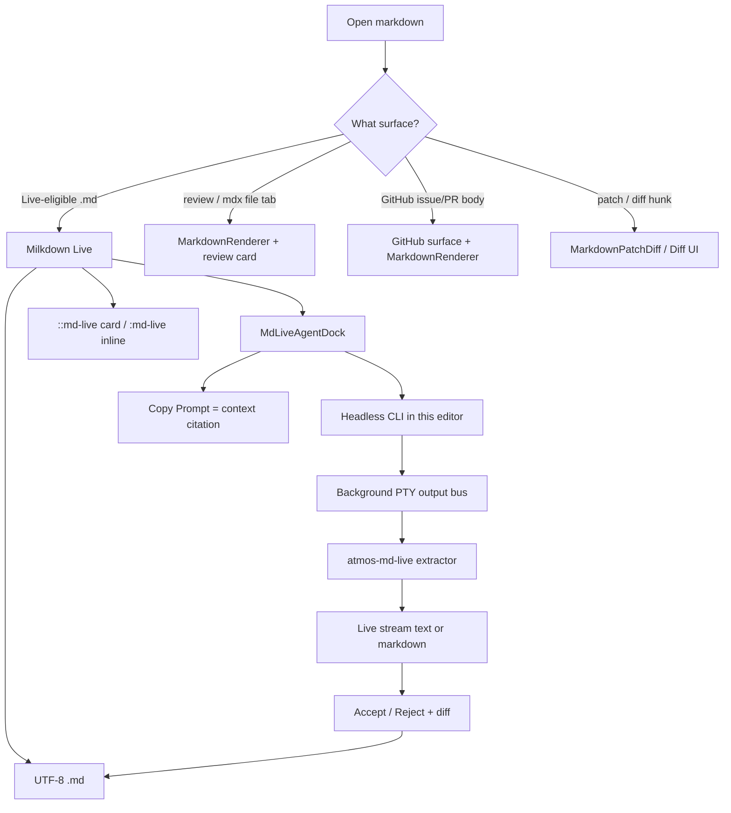

# TECH · APP-067: Document Editor

> Technical Design · HOW. Implements PRD APP-067: Document Editor. Addresses **M1–M20**. N1–N10 deferred unless noted as cheap.
>
> This revision: package is **`@atmos/md-live`** (not `docs`). Agent in the editor is **composer + headless CLI only**. Copy Prompt is context citation, not an edit. Read-only review / GitHub / diff surfaces keep dedicated components — never Milkdown Live.

## Scope summary

Upgrade Live-eligible markdown **file tabs** into an Obsidian-like live editor with an Agent-first composer. Disk format stays UTF-8 `.md`. Source stays `BaseCodeMirrorEditor`. The docked `PromptComposer` runs the **selected agent as headless CLI** and streams **text or formatted markdown** into Live for Accept / Reject.

The editor does **not** send prompts into the user’s interactive Terminal, and it does **not** ask the agent to write the document file. Copy Prompt only copies the current context packet.

No BlockNote, no Crepe, no new `WsAction`, no document DB, no Wiki changes, no Live editor on review reports / GitHub issue-PR bodies / patch displays.

## Architecture overview

```text
apps/web  features/editor/CodeMirrorEditor.tsx
            Live pane  →  MarkdownLiveEditor   (host wrap of @atmos/md-live/ui)
            Source pane → BaseCodeMirrorEditor (unmounted while Live)
            MdLiveAgentDock → PromptComposer + existing Agent Select
apps/web  features/md-live              # dock, embeds, adapters, fence host
packages/md-live  @atmos/md-live/ui     # Milkdown editor, slash, selection toolbar
apps/web  features/terminal             # output bus tap (no user Terminal UX)
apps/web  features/selection            # Source-mode SelectionPopover only
apps/web  shared/components/markdown    # MarkdownRenderer + extracted MarkdownPatchDiff
apps/web  features/github | code-review | diff   # stay read-only consumers
          │
packages/md-live  @atmos/md-live        # codec + ./ui chrome
          │                             # MUST NOT import api-*, PromptComposer, apps/*, @workspace/ui
          ▼
existing fs_* + headless PTY (APP-024) + GitHub/Linear list APIs
```



### Naming

| Layer | Name |
|-------|------|
| Package | `@atmos/md-live` |
| Host feature | `apps/web/src/features/md-live/` |
| Composer surface | `md-live` |
| i18n | `mdLive` + existing `codeMirror.*` toggle keys |
| CSS root | `.md-live` |
| User-facing | **Live** / **Source** on the file tab. No “Docs” workbench. No second “Editor” brand. |
| New note | Untitled buffer → Save as into `{effectivePath}/Untitled.md` (or `Untitled-N.md`). No `docs/` default. |

`features/editor` remains CodeMirror. Do not put md-live UI there beyond the mount point in `CodeMirrorEditor.tsx`.

### Why this is still the file tab

A launchpad / `"docs"` center kind would be a second workbench (N8). v1 changes the **default view** of Live-eligible `.md` tabs to Live and docks the composer there.

Today `CodeMirrorEditor` opens `.md` in **Source** (`previewFilePath` starts `null`); only `.atmos/reviews/**` auto-previews. M2 is a **behavior change**: Live-eligible markdown defaults to Live.

### Engine (locked)

**`@milkdown/kit` + `@milkdown/react` ≥ 7.22** (MIT).

Allowed plugins: `preset-gfm`, `history`, `clipboard`, `listener`, `slash`, `tooltip`, `streaming`, `diff`, `diffComponent`, plus `$remark` wrapping **`remark-directive`** (MIT) for embeds.

Banned: `@milkdown/crepe`, `@milkdown/plugin-block`, `@blocknote/*`, `@tiptap-pro/*`, Tiptap Notion-like template, Tiptap AI Toolkit, Crepe `Feature.AI`.

### Why no new `WsAction`

`fs_read_file` / `fs_write_file` persist the tab. Headless runs reuse APP-024 + a PTY. Bytes arrive as `terminal_output`. md-live **taps** them; the user never operates in Terminal for this feature.

## Resolved decisions

| ID | Decision |
|----|----------|
| D1 | Home = existing `.md` file tab. No `"docs"` center kind and no launchpad in v1. |
| D2 | Package **`@atmos/md-live`**. Codec + fence + `AgentRequest` on `.`. Generic Live chrome (Milkdown editor, `/` menu, selection toolbar, format commands) on **`@atmos/md-live/ui`**. Host **`features/md-live`** wires Agent dock, Save as, Atmos embeds, PTY. <!-- updated 2026-08-27: generic slash/toolbar/editor moved into the package --> |
| D3 | Persist the markdown string. Never persist ProseMirror/Milkdown JSON. |
| D4 | **New note** opens an untitled Live tab. No disk write, no `docs/` directory. Proposed save location = `{effectivePath}/` (Project / Workspace root). Proposed name = next free `Untitled.md` / `Untitled-1.md` / `Untitled-2.md` in the **currently selected** save directory (same stem rule as Canvas). |
| D5 | Two views only: Live vs Source. |
| D6 | Milkdown **kit only**. No drag-handle chrome. |
| D7 | **One `PromptComposer`**, surfaces `welcome` \| `terminal` \| `md-live`. Dock on Live-eligible markdown tabs only (Live and Source). Body `/` vs composer `/` are focus-owned (D29). |
| D8 | Live selection = Milkdown tooltip (format + Ask / Rewrite / Summarize). Source = existing `SelectionPopover`. **Do not show both.** `doc-selection` uses `[#ctx:doc-selection:id]` — extend `AI_CONTEXT_KINDS`, do not widen `CHIP_TOKEN_PATTERN`. |
| D9 | Adapters: **`copy`** and **`headless` only**. No `terminal-current`. Agent identity = existing AI Input Agent Select. ACP is N1. |
| D10 | Headless = selected agent + APP-024 `buildInteractiveAgentRunPlan(..., mode: "headless")`. May create a PTY session so the CLI can run. **Do not** switch the workbench to Terminal. **Do not** send into the user’s current interactive shell. Editor dock is the only Agent UX. |
| D11 | The agent is **forbidden** from writing `{document.path}`. Accept + existing save is the only document write. If disk still changed: after Accept, editor buffer wins on save. Do not productize dual-write. Keep mine / Load disk only as a crash/unexpected-external-change guard on focus, not as an Agent feature. |
| D12 | AgentRequest body cap 100 KiB; else path + current heading + selection. |
| D13 | Images: relative worktree files, ``. Not embeds. |
| D14 | i18n namespace `mdLive` + `codeMirror` toggle keys. Sentence case (`Live`, `Source`, `Accept`, `Reject`, `Copy prompt`). |
| D15 | Frontmatter: Source-editable. Live may hide YAML behind a one-line title. |
| D16 | **Embeds, not hijacked links.** Milkdown custom **atoms** + React `$view` via a host **registry**. Two schema nodes: `mdLiveEmbedInline` (`group: inline`) and `mdLiveEmbedBlock` (`group: block`). Same `kind` registry. Disk = Generic Directive (`:md-live` inline / `::md-live` card). Ordinary `https://` stays a link. Cards may fetch title/status and render **Open** (and later actions). Do not iframe native surfaces. Unknown kind → generic fallback card. |
| D17 | In-document AI = kit `plugin/streaming` + `plugin/diff`. Provider = fence extractor. `outputHint: "text"` inserts as plain text; `outputHint: "markdown"` parses GFM. `customBlockTypes`: `mdLiveEmbedBlock`, `table`, `image`, `code_block`. **Not** mermaid / patch widgets (D35). Esc = `abortStreamingCmd({ keep: false })`. |
| D18 | Atmos UI, not Crepe/Nord. Live prose = existing `MarkdownRenderer` Tailwind. Generic slash/toolbar/editor chrome = `@atmos/md-live/ui`. Host dock chrome = `@workspace/ui`. Scope leftovers to `.md-live`. |
| D19 | **Default Live** for Live-eligible files. Persist per-path `live` \| `source`. |
| D20 | **Mount exactly one editor.** Inactive `surfaceActive=false` tabs unmount Milkdown + dock. |
| D21 | **Live-eligible** = untitled `untitled:{uuid}.md` tabs, or worktree `.md` the user is **authoring**, and **not** `.mdx`, **not** `.atmos/reviews/**`. Live is **never** mounted for GitHub issue/PR bodies, review-report preview, or patch/diff hunks (M20). Those stay read-only components. Renderer-only file tabs do **not** dock the composer. |
| D22 | **No silent rewrite.** No-edit open must not dirty or rewrite disk. |
| D23 | Pin `@milkdown/kit` / `@milkdown/react` **≥ 7.22.0**. |
| D24 | Stream isolation fence: `<!--atmos-md-live-->` … `<!--/atmos-md-live-->`. Fallback: one ` ```atmos-md-live ` fence. Inner payload only enters Live. `copy` does **not** include this contract. |
| D25 | **Streaming only from the headless run this editor started.** `copy` never streams and never asks the model to edit the file. |
| D26 | Tap PTY via `features/terminal/lib/terminal-output-bus.ts`. Do not open a second terminal WebSocket. Do not focus/steal the Terminal tab. |
| D27 | `mdLiveStreamLock` while streaming or diff-review pending. Disable autosave, Cmd-S, Live↔Source, file switch except Discard. Accept commits to `file.content`; then existing save. Reject restores the pre-stream snapshot. |
| D28 | Embed disk form is a **directive**, not `[](atmos://...)`. Public objects still carry `url="https://..."` (or `path="..."`) so Agents can read them. See Embedded components. |
| D29 | Slash = **focus**. Milkdown slash only when Live body is focused. Composer slash / Cmd-Enter only when the md-live composer is focused. Mosaic with Terminal may show two composers; each submits only itself. |
| D30 | No string-offset `applyMarkdownTransform`. Format actions are Milkdown commands in `@atmos/md-live/ui`. |
| D31 | Prompt files for `file_flag` go to `~/.atmos/cache/md-live-prompts/{uuid}.md`. Delete on run end. Never write a prompt file into the worktree. |
| D32 | No `fs_watch` in v1. Re-read on run end + focus only as an unexpected-change guard (D11). |
| D33 | Untitled tab id: `OpenFile.path = "untitled:{uuid}.md"` (not a real FS path). Skip `fs_read_file` / autosave until Save as. Cmd-S or dock **Save** on untitled → **Save as** dialog (directory + filename, defaults D4). Confirm → `fs_write_file` at the chosen path → replace the untitled tab with a normal file tab (`openFile` that path, drop the synthetic id). Close untitled while dirty → save / discard / cancel; save opens Save as. Disk stem is always English `Untitled` (Canvas); tab label may use `mdLive.untitled`. |
| D34 | Live uses GFM line breaks, not `remark-breaks`. |
| D35 | Live does **not** reimplement review / GitHub / patch widgets. A ` ```diff ` fence in a working note is a normal code block (edit in Live as code, or Source). Patch rendering lives in a dedicated **`MarkdownPatchDiff`** component used by `MarkdownRenderer` (read-only file preview, review reports) and GitHub/review surfaces. |
| D36 | `MarkdownToc` stays on Live-eligible file tabs, from the current markdown string. |
| D37 | **Copy Prompt** = context citation only: path, selection, mentions, workspace. No `[Output contract]`, no “rewrite this file”, no fence instructions. User pastes it into some other Agent. |
| D38 | Headless prompts **must** say: return only the fenced payload; **do not** use file tools on `{document.path}`; **do not** apply a patch to that file. Other files the user asked to change still go through Atmos Diff — that is a different surface, not this editor’s write path. |
| D39 | Embed NodeViews: `contenteditable: false` + `stopEvent` so button / link / input clicks belong to React. Backspace deletes the whole atom. Register `mdLiveEmbedBlock` in Milkdown `customBlockTypes` so streaming diff can accept/reject a card as one block. |

## Module-by-module design

### packages/md-live (`@atmos/md-live`)

```text
packages/md-live/
  package.json          # name @atmos/md-live; exports "."
  AGENTS.md
  src/
    index.ts
    embed/
      types.ts
      parse.ts              # directive → MdLiveEmbedSpec
      format.ts             # spec → :md-live / ::md-live
      parse.test.ts
    request/
      types.ts
      render-prompt.ts
      render-prompt.test.ts
      fence.ts
      fence.test.ts
    isolation.test.ts
```

Public API:

```ts
export type MdLiveEmbedLayout = "inline" | "card";

export type MdLiveEmbedSpec = {
  kind: string;
  layout: MdLiveEmbedLayout;
  title: string;
  attrs: Record<string, string>;
};

export function parseEmbedDirective(input: {
  type: "textDirective" | "leafDirective";
  name: string;
  label?: string;
  attributes?: Record<string, string>;
}): MdLiveEmbedSpec | null;

export function formatEmbedDirective(spec: MdLiveEmbedSpec): string;
export function renderAgentPrompt(request: AgentRequest): string;
export function formatEmbedForAgent(spec: MdLiveEmbedSpec): string;
// e.g. "GitHub issue acme/app#128 — https://github.com/acme/app/issues/128"

export type FenceExtractor = {
  push(chunk: string): { payloadDelta: string; done: boolean; abort?: "no-fence" | "junk" };
  reset(): void;
};
export function createFenceExtractor(): FenceExtractor;
```

`parseEmbedDirective` only accepts `name === "md-live"`. Unknown `kind` still parses (attrs pass through) so a newer file does not break an older Live — the host shows the generic fallback.

**Round-trip ship gate** (host Milkdown):

1. GFM fixtures + one inline embed + one card embed: parse → serialize → parse. Directive attrs and `layout` survive.
2. Real README, no edits → disk unchanged (D22).
3. Edit one paragraph → save → embed directives survive as directives, not rewritten to `[text](url)`. Diff/mermaid fences survive as **code fences**.

### Embedded components (M14)

Markdown **links cannot host cards**. A link is `href` + text; it cannot carry layout, extra attrs, action buttons, or a later embed kind without overloading URLs. Milkdown **can** host real components: this is the same stack as their iframe example and first-party `image-block` / `code-block` (copy button, language picker, upload).

**Why Milkdown is enough**

| Need | Milkdown / ProseMirror |
|------|------------------------|
| Block card vs inline chip | Two node types: `group: 'block'` vs `group: 'inline'`, both `atom: true`, `isolating: true` |
| Full React UI (Card, Badge, Button) | `$view` + `@milkdown/react` `useNodeViewFactory` — official `react-custom-component` example |
| Clicks on Open / copy | `contenteditable: false` on the NodeView DOM + `stopEvent` returning true for `button, a, input, [data-md-live-interactive]` |
| Structured attrs on disk | `remark-directive` Generic Directive Syntax (Milkdown iframe plugin uses this) |
| Future kinds without new schema | One directive name `md-live`; `kind` is an attribute; host **registry** picks the React view |
| Streaming Accept/Reject | Register `mdLiveEmbedBlock` in `diffComponentConfig.customBlockTypes` (NodeViews ignore inline decorations) |
| Nested markdown inside a callout | Container `:::md-live` — **reserved, not v1**. v1 is leaf/text directives only |

**Disk syntax** (Generic Directive, MIT `remark-directive`):

```md
A file in a sentence :md-live[auth.ts]{kind=file layout=inline path="src/auth/github.ts"}.

::md-live[GitHub #128]{kind=github-issue layout=card owner=acme repo=app n=128 url="https://github.com/acme/app/issues/128"}
```

| Form | mdast | ProseMirror | Default UI |
|------|-------|-------------|------------|
| `:md-live[title]{kind=… layout=inline …}` | `textDirective` | `mdLiveEmbedInline` | compact chip + optional overflow menu |
| `::md-live[title]{kind=… layout=card …}` | `leafDirective` | `mdLiveEmbedBlock` | card: icon, title, metadata, actions |

`layout` is required on write. If missing on parse: `textDirective` → inline, `leafDirective` → card.

Always persist a human `title` and, when it exists, a public `url` or worktree `path` so Source / git / Agents do not need the React view.

Do **not** store `[](https://…)` as the embed. Ordinary links remain ordinary. Slash / insert always writes a directive.

**Registry (host)** — adding a component is a React module, not a new Milkdown plugin:

```ts
// features/md-live/embeds/registry.ts
export type MdLiveEmbedViewProps = {
  spec: MdLiveEmbedSpec;
  selected: boolean;
  onOpen: () => void;       // native Atmos surface
  onRemove: () => void;     // delete atom
};

export type MdLiveEmbedDefinition = {
  kind: string;
  slashLabel: string;
  defaultLayout: MdLiveEmbedLayout;
  View: React.ComponentType<MdLiveEmbedViewProps>;
};

export const MD_LIVE_EMBEDS: MdLiveEmbedDefinition[] = [
  githubIssueEmbed,  // card: number, title, state, Open
  githubPrEmbed,
  linearIssueEmbed,
  fileEmbed,         // inline default; Open file tab
  folderEmbed,
  workspaceEmbed,
  branchEmbed,
  diffEmbed,         // card: Open Diff — does NOT mount MarkdownPatchDiff
  canvasEmbed,
  ptDesignEmbed,
  agentEmbed,
];
```

Unknown `kind` → `GenericEmbedCard` (title, attr list, no crash).

v1 card chrome (GitHub issue as the reference implementation):

- `@workspace/ui` `Card` / `Badge` / `Button`
- Best-effort fetch of title + state via existing GitHub/Linear list APIs; failure keeps the markdown `title`
- Buttons: **Open** (required). Optional later: Copy link. No iframe of the issue page
- Loading skeleton inside the card, not a document spinner

**Plugin stack**

```text
markdown ::md-live[...]{...}
        ↓ remark-directive ($remark)
     mdast leafDirective name=md-live
        ↓ parseMarkdown (match name)
     ProseMirror mdLiveEmbedBlock attrs={ kind, layout, title, payload }
        ↓ $view + useNodeViewFactory
     registry[kind].View  (buttons work via stopEvent)
        ↓ toMarkdown
     same directive (ship gate)
```

`payload` is the remaining attrs as a JSON string on the node (keeps the schema stable when a kind adds fields).

Slash: “GitHub issue” / “File” / … run the existing mention search, then insert the directive at the cursor (`layout` = definition default). Toolbar does not convert a normal link into an embed unless the user picks an insert command.

**Not in v1**

- `:::md-live` container with nested markdown (admonitions) — reserve the name
- Drag-handle reordering of cards (Crepe/block plugin is banned)
- Using Live to render GitHub/review **pages** (M20). Embeds live *inside* a working note; those pages stay read-only surfaces

### Read-only markdown & diffs (M20)

Do **not** replace these with Milkdown:

| Surface | Component |
|---------|-----------|
| `.atmos/reviews/**` file tab | `ReviewReportMetadataCard` + `MarkdownRenderer` (already in `CodeMirrorEditor.tsx`) |
| GitHub issue / PR body / review comments | existing `features/github` + `MarkdownRenderer` (`pr-detail-parts.tsx`) |
| Patch / diff hunks in markdown | extract **`MarkdownPatchDiff`** from `MarkdownRenderer`’s `SafePatchDiff` |
| Atmos Diff / Git review UI | existing `features/diff` — unchanged |
| Wiki | unchanged (M19) |
| Skills / automations / notes panels | keep `MarkdownRenderer` |

Extract:

```text
apps/web/src/shared/components/markdown/MarkdownPatchDiff.tsx
  # SafePatchDiff + patch detection now in MarkdownRenderer.tsx
apps/web/src/shared/components/markdown/MarkdownRenderer.tsx
  # code: mermaid | MarkdownPatchDiff | Shiki — no Milkdown
```

`MarkdownRenderer` stays the generic **read-only** GFM renderer. `MarkdownPatchDiff` is the dedicated diff widget (pierre `PatchDiff`). GitHub and code-review keep calling `MarkdownRenderer`; they never import `MarkdownLiveEditor`.

Live-eligible working notes: a ` ```diff ` block is editable fenced code, not `MarkdownPatchDiff`.

### Stream protocol (M16)

User-facing Agent path is only **`MdLiveAgentDock`**. Headless CLI is an implementation detail.

`outputHint`:

| Hint | Prompt asks for | Live insert |
|------|-----------------|-------------|
| `text` | Replacement **plain text** (no extra markdown structure unless it was already in the selection) | Stream as text (`insertAt: 'selection'` or cursor). Still highlighted + Accept/Reject. |
| `markdown` | Replacement **GFM** for the target | Stream as markdown tokens (Milkdown default). Diff review when the stream ends. |

Both wrap the payload in `<!--atmos-md-live-->` so tool traces never enter Live.

`renderAgentPrompt` when `execution.kind === "headless"`:

```text
[Output contract]
Do not modify the document file on disk. Do not use file tools on:
  {document.path}
Return ONLY the replacement {text|markdown} wrapped exactly as:

<!--atmos-md-live-->
...payload...
<!--/atmos-md-live-->

No tool traces, no commentary outside the fence.
```

`renderAgentPrompt` when `execution.kind === "copy"`:

```text
[Context]
Path: ...
[Selection]          # if any
[References]         # mentions
[Workspace]
```

No output contract. No “edit this file”. Copy is a **citation** the user hands to some other Agent.

```text
MdLiveAgentDock / Rewrite
        ↓  AgentRequest (outputHint: text | markdown, execution: headless)
buildInteractiveAgentRunPlan(headless)
        ↓  background PTY (do not focus Terminal)
terminal_output  →  output bus  →  strip ANSI/OSC
        ↓
createFenceExtractor().push(chunk)
        ↓  payloadDelta
startStreamingCmd { insertAt: cursor | selection }
pushChunkCmd(delta)          # text vs markdown per outputHint
        ↓
endStreamingCmd { diffReview: true }  if any payload
        else inline: "Agent did not return a document edit."
Accept / Reject  →  file.content  →  existing Cmd-S
```

Extractor rules (unit-tested):

| Input | Live |
|-------|------|
| Bytes before open fence | Drop |
| Inside fence | `payloadDelta` |
| Close fence | `done: true` |
| Process end, no fence | `abort: "no-fence"` — Live unchanged |
| Junk / tool JSON inside fence | `abort: "junk"` — restore snapshot |
| Agent `Write`s `{document.path}` | Not a feature. Stream lock ignores disk. After Accept, save writes the editor buffer. |

Insert rules (markdown hint = Milkdown defaults; text hint = insert as text, newlines kept):

| Cursor | markdown | text |
|--------|----------|------|
| Empty paragraph | streamed blocks | streamed text |
| Non-empty selection | `insertAt: 'selection'` | replace selection as text |
| Code block / table cell | plain text | plain text |

Diff chrome: Milkdown behavior, Atmos tokens, sentence-case **Accept** / **Reject** / **Accept all** / **Reject all**.

### Visual language (D18)

| Layer | Look like | How |
|-------|-----------|-----|
| Document | File-tab `MarkdownRenderer` prose | Tailwind `prose` on the Milkdown root |
| Chrome | `@workspace/ui` | React slash / tooltip / embed cards / Accept bar |
| Review / GitHub / patches | Existing read-only components | Never inside Live |

### crates / apps/api

**No schema migrations. No new WsAction.** N1 ACP later is ACP’s problem, not `md_live_*`.

### apps/web — host

| Area | Path |
|------|------|
| Live editor | `@atmos/md-live/ui` `MdLiveEditor`; host wrap `features/md-live/components/MarkdownLiveEditor.tsx` |
| Dock | `features/md-live/components/MdLiveAgentDock.tsx` — `PromptComposer` + existing Agent Select + **Copy prompt** / **Run**. No Terminal send. Shell pattern: `TerminalAgentInputShell` |
| Slash | Milkdown React slash; GFM + insert embed directive |
| Toolbar | Ask → `doc-selection` chip in dock. Rewrite / Generate / Continue → headless stream (`text` or `markdown` from the action) |
| Streaming | `features/md-live/lib/md-live-stream-session.ts` + `mdLiveStreamLock` |
| Fence host | `features/md-live/lib/md-live-pty-provider.ts` |
| Embeds | `features/md-live/embeds/` — registry, `MdLiveEmbedInline.tsx`, `MdLiveEmbedCard.tsx`, kind views |
| Milkdown plugin | `features/md-live/lib/md-live-embed-plugin.ts` — `$remark` + two `$node` + two `$view` |
| Adapters | `features/md-live/lib/md-live-adapters.ts` — `copy` \| `headless` |
| Mentions | `features/md-live/hooks/use-md-live-composer-mentions.ts` |
| New note | `features/md-live/lib/md-live-new-note.ts` — open untitled tab |
| Untitled names | `features/md-live/lib/md-live-untitled-name.ts` — `nextUntitledMarkdownName(namesInDir)` → `Untitled.md` / `Untitled-1.md` / … |
| Save as | `features/md-live/components/MdLiveSaveAsDialog.tsx` — directory (file tree, default `{effectivePath}`) + filename |
| Patch widget | `shared/components/markdown/MarkdownPatchDiff.tsx` |

`CodeMirrorEditor.tsx` (mount only):

- `isLiveEligible` (D21).
- Default + persist view (D19). Relabel to Live / Source.
- Live: `MarkdownLiveEditor` + `MdLiveAgentDock`; unmount CodeMirror.
- Source (eligible): CodeMirror + dock; unmount Milkdown.
- Renderer-only: `MarkdownRenderer` + review card + TOC; **no** dock, **no** Live.
- Respect `mdLiveStreamLock` on save/autosave.
- Untitled (`path` starts with `untitled:`): Live-eligible; skip `fs_read_file` and autosave; Cmd-S opens Save as.

### New note / Save as

```text
New note
  → openFiles += { path: "untitled:{uuid}.md", name: "Untitled", content: "", isDirty: false }
  → mount Live + dock
Edit
  → isDirty = true (existing updateFileContent)
Cmd-S / Save (untitled)
  → fs_list_dir({effectivePath}) → nextUntitledMarkdownName
  → MdLiveSaveAsDialog { directory: effectivePath, filename: Untitled.md | Untitled-N.md }
  → user may change both
  → if target exists: do not overwrite; error + suggest next free name
  → fs_write_file({ path: join(dir, name), content })
  → replace untitled tab with openFile(realPath); drop synthetic id
Later Cmd-S
  → existing saveFile
```

`nextUntitledMarkdownName(names)` (Bun-tested, same as Canvas):

- `Untitled.md` if free
- else `Untitled-1.md`, `Untitled-2.md`, … through `Untitled-9999.md`

Disk stem is **`Untitled`**, not a translated word. Tab title uses i18n `mdLive.untitled`.

Save as directory must stay inside the Computer FS allowlist (`{effectivePath}` or a subdirectory). `.md` suffix is required; add it if the user omits it.

Do **not** create `{effectivePath}/docs` as a side effect of New note.

Terminal:

- `features/terminal/lib/terminal-output-bus.ts`.
- `Terminal.tsx` `handleOutput` publishes.
- Headless launch may use `createAndRunTerminal` **without** switching the active center tab to that terminal.

AI context: add `"doc-selection"` to `AI_CONTEXT_KINDS`.

### packages/ui

No new primitive.

### packages/AGENTS.md

> **Live markdown embed directives / `atmos-md-live` fence / AgentRequest?** → `@atmos/md-live` (APP-067). Host registry + React cards in `features/md-live/embeds`. Not Wiki, not `@workspace/ui` as a home, not `features/editor` beyond the mount point.

## Data model

### On-disk markdown

```text
{effectivePath}/Untitled.md
{effectivePath}/Untitled-1.md
{effectivePath}/notes/oauth-plan.md   # after Save as into a user-chosen folder
```

```md
# GitHub OAuth

Implement login using :md-live[GitHub #128]{kind=github-issue layout=inline owner=acme repo=app n=128 url="https://github.com/acme/app/issues/128"}.

See also :md-live[auth.ts]{kind=file layout=inline path="src/auth/github.ts"}.

::md-live[GitHub #128]{kind=github-issue layout=card owner=acme repo=app n=128 url="https://github.com/acme/app/issues/128"}
```

### AgentRequest

```ts
type MdLiveExecutionTarget =
  | { kind: "copy" }
  | { kind: "headless"; agentId: string; sessionId?: string };

type AgentRequest = {
  instruction: string;
  document: { path: string; markdown: string; truncated: boolean };
  selection?: { markdown: string; heading?: string };
  references: MdLiveEmbedSpec[];
  workspace?: { id: string; name: string; path: string };
  project?: { id: string; name: string; path: string };
  branch?: string;
  execution: MdLiveExecutionTarget;
  outputHint: "text" | "markdown";
};
```

Copy uses `execution: { kind: "copy" }` and **omits** the output-contract section even if `outputHint` is set.

## Transport

### Files (existing WS)

```ts
wsRequest("fs_read_file", { path })
wsRequest("fs_write_file", { path, content })
wsRequest("fs_list_dir", { path })
wsRequest("fs_create_dir", { path })
```

### Interactive Terminal

**Not used** by this feature. No `terminal_input` into the user’s current session.

### Headless CLI (existing pieces, editor-owned UX)

1. `buildInteractiveAgentRunPlan({ ..., mode: "headless" })`.
2. Start a PTY for that process (may reuse `createAndRunTerminal`) **without** focusing Terminal.
3. `subscribeTerminalOutput(sessionId, ...)` until close / extractor `done` / 120s idle.
4. Editor chrome: pending + streaming highlight + Accept/Reject. No tool-call logs in Live. No “Open Terminal” primary control.

### REST

None. Do not add `/api/docs` or `/api/md-live`.

## Security & permissions

- File IO through the existing FS allowlist.
- Copy Prompt is explicit citation; do not log full document bodies.
- Headless yolo flags = APP-024. No md-live permission UI.
- GitHub/Linear list APIs use existing credentials.
- Fence extractor must not execute HTML inside streamed markdown.
- `~/.atmos/cache/md-live-prompts/` is user-local; delete after the run.

## Rollout plan

Each step is a mergeable PR. Must Have is complete after step 6.

1. **`@atmos/md-live`**: embed directive codec + fence + `renderAgentPrompt` (copy vs headless). Isolation test.
2. **Extract `MarkdownPatchDiff`**. `MarkdownRenderer` uses it. GitHub / review / read-only file preview unchanged in behavior. **No Live yet.**
3. **Live editor + D20/D22/D21**: Milkdown on Live-eligible tabs only. Review / mdx stay renderer. Default Live. Single mount.
4. **Slash + Live toolbar.**
5. **Embed plugin + registry** (inline + GitHub card) **+ New note.**
6. **Agent**: `MdLiveAgentDock`, copy citation, headless stream (`text` \| `markdown`), output bus, stream lock, Accept/Reject. No Terminal send.
7. Dogfood; N1 ACP if a structured stream appears.

## Risks & tradeoffs

- **Tradeoff · `@atmos/md-live` vs `docs`**: This is a live markdown editor with an Agent dock, not a document library. New note does not use a `docs/` folder.
- **Tradeoff · no Terminal send**: Agent-first here means the composer in this tab, not “paste into the shell I already have.” Copy Prompt covers off-ramp to any other Agent.
- **Tradeoff · no agent file writes**: One write path (Accept → save). Avoids dual-write vs streaming. Code changes the user asked for still belong on Atmos Diff if the agent touches other files — that is out of this editor, not a second Live feature.
- **Tradeoff · background PTY**: Atmos still runs CLI agents in a PTY. The user does not have to look at it. If creating a tab is required, leave it unfocused.
- **Tradeoff · kit vs Crepe**: Kit is the product.
- **Tradeoff · directives vs markdown links**: Links cannot host cards or buttons. `:md-live` / `::md-live` carry `kind`, `layout`, and `url`/`path`. Copy Prompt expands them via `formatEmbedForAgent`. Source shows the directive.
- **Risk · agents ignore the fence or write the file**: no-fence leaves Live unchanged; stream lock ignores disk; Accept/save overwrites the document with the editor buffer.
- **Risk · markdown normalization**: D22 + README fixture.
- **Risk · dual composer in mosaic**: D29.
- **Rollback**: unmount Live, restore `MarkdownRenderer`, leave Source as today.

## Dependencies & compatibility

- Depends on: `fs_*`, PromptComposer, APP-024, APP-005/057 list APIs, terminal PTY bytes.
- Does not block other specs. Wiki, Canvas, PT Design, GitHub, Diff unchanged except extracting `MarkdownPatchDiff` from `MarkdownRenderer`.
- No CLI version pin.
- External: `@milkdown/kit` + `@milkdown/react` ≥ 7.22.0 MIT; `remark-directive` MIT.

## PRD coverage

| PRD | TECH |
|-----|------|
| M1–M2 home | D1, D19, D21; `CodeMirrorEditor` mount |
| M3–M4 files | D3, D4, D33; untitled + Save as |
| M5–M7 engine | D5, D6, D18, D20, D22, D23, D34 |
| M8 save | existing dirty + D27 |
| M9–M10 slash/toolbar | D7, D8, D29, D30 |
| M11–M13 composer | D7 `md-live` surface |
| M14 embeds | D16, D28, D39; `remark-directive` + registry |
| M15 adapters | D9, D10, D25, D37 — copy + headless only |
| M16 streaming | D17, D24–D27, D38; `text` \| `markdown` |
| M17 FS | existing + D32 |
| M18 i18n | D14 `mdLive` |
| M19 Wiki | not in v1 |
| M20 read-only surfaces | D21, D35; `MarkdownPatchDiff` |
| N* | deferred |

## Open questions

None that block v1. Prompt-file vs argv is D31.
