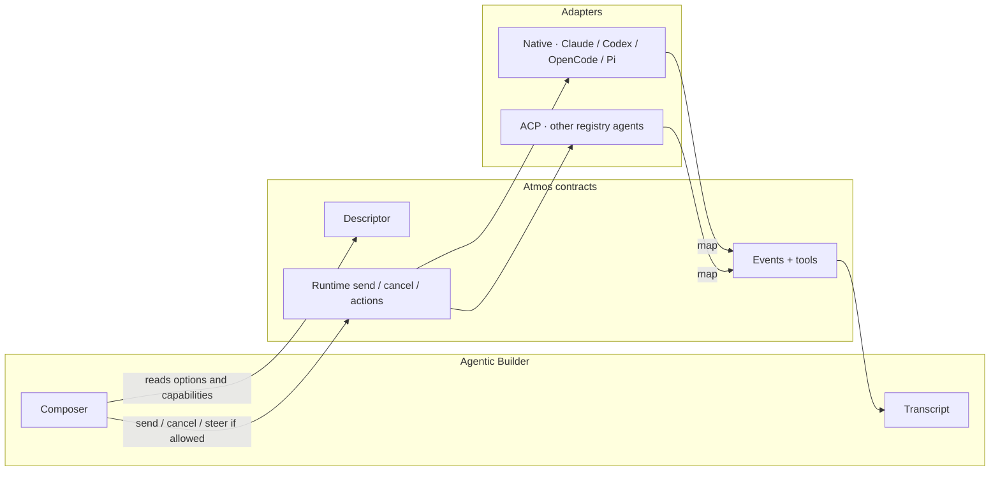

# PRD · APP-068: Agent Chat Architecture Optimize

> Product Requirements · WHAT and WHY. Settled direction for an Atmos-owned agent descriptor, tool, and event model, plus **native** hosts for Claude Code, Codex, OpenCode, and Pi.

## Context

- **Problem**: After APP-067, Chat identity and history are Atmos-owned, but **ability**, **configuration**, and **tool observation** are still scattered. ACP adapters lose vendor semantics (steer, approvals, web search items, thinking). The four mainstream agents Atmos must host well — **Claude Code** (this request’s “Cloud Code”; builtin id `claude`), **Codex**, **OpenCode**, **Pi** — each already has a native embed protocol. Frontend SDKs are TypeScript; Atmos's host is Rust, so we speak those wires in-process rather than wrapping Node SDKs.
- **Why now**: Agent Chat is a first-class workspace. Shipping only ACP for these four would keep Chat a lowest-common-denominator client. Native parse must be protocol-correct before we map anything into Atmos kinds.
- **Related specs**:
  - **Builds on** [APP-067](../APP-067_atmos_agent_abs/PRD.md) — Conversation identity, file history, restore ≠ resume, queue / steer / interrupt, main `/ws`. This spec does not reopen those product decisions.
  - **Uses** APP-004 process / permission / registry. ACP is the adapter for **other** Chat agents; Claude Code / Codex / OpenCode / Pi use native wires.
  - **Depends on** APP-048 / APP-049 / APP-064 for `/ws` catalog discipline.
  - **Does not replace** APP-024 terminal run-config UI, APP-015 / APP-022 / APP-027 Terminal, APP-030 side chat.

## Goals

1. **Primary** — Users see **one** Agent Chat: composer controls and tool cards follow Atmos meaning.
2. **Primary** — Atmos owns descriptor, small runtime, and observation contracts. **Claude Code, Codex, OpenCode, and Pi** connect through **native** adapters that speak each vendor's published protocol. Other registry agents may still use ACP.
3. **Secondary** — Adding a fifth agent is an adapter + spec change. Web does not grow vendor parsers.

Non-goals below, not here.

## Users & Scenarios

- **Primary persona**: Agentic Builder on Web / Desktop, switching among Claude Code, Codex, OpenCode, Pi, and other agents in the same Chat workspace.
- **Secondary persona**: Atmos implementer adding a new ACP agent or a later CLI/SDK provider.

### Key scenarios

1. **Pick configuration that exists**: On New Chat, the composer shows model and thinking only when that agent actually supports them. An agent with no thinking probe does not get a fake thinking control.
2. **Same tool, same card**: A shell call from Claude (`bash`) and from Codex (`command_execution`) both render as Atmos execute (command + output). A file read from any agent opens the path in the editor. A web search shows the query and result links. A web fetch shows the URL and fetched body. The user does not learn per-vendor payload shapes.
3. **Busy composer stays honest**: Steer is offered only when the descriptor says steer is supported. Queue and Stop still work. Atmos never fakes steer.
4. **Unknown agent still works**: A new ACP agent with unfamiliar tools still chats. Each unknown tool is **one** tool-call card showing that tool's params and result as the vendor sent them. Chat does not hide the turn and does not keep a second hidden copy.
5. **Return to a past chat**: Opening history still paints stored messages with no spawn (APP-067). Tool cards restore from Atmos-normalized records, not by re-sniffing vendor JSON in the browser.

## User Stories

- As an Agentic Builder, I want one composer for every agent, so that I only see model / thinking / mode / steer when they are real for that agent.
- As an Agentic Builder, I want tool cards to mean the same thing across agents, so that I can open a file, read a command, follow a web search, or read a fetched page without knowing which vendor JSON arrived.
- As an Agentic Builder, I want unfamiliar tools to still appear, so that a new agent does not blank the transcript.
- As an Agentic Builder, I want chats written after this spec to reopen from Atmos records, so that history is not a second, dumber parser.
- As an Atmos implementer, I want a closed place to declare what an agent can do and how it is configured, so that I do not add methods or UI branches for one vendor.
- As an Agentic Builder, I want Claude Code, Codex, OpenCode, and Pi to keep their real host capabilities in Atmos Chat (steer where the protocol has it, honest permission, model/thinking, main tools), so that Chat is not a lossy ACP wrapper.
- As an Atmos implementer, I want each of those four to speak its published native protocol from Rust, so that we do not depend on TypeScript SDKs or community ACP bridges for the mainstream path.

## Functional Requirements

### Must Have

- **M1 — Agent descriptor is the product surface**: Every Chat-capable agent exposes one Atmos descriptor: **identity**, **capabilities**, **supported options**, **current config**. Composer, catalog picker, and action chrome read this object. They do not read ACP `configOptions`, ACP initialize snapshots, or per-vendor catalogs as parallel sources of truth.
- **M2 — Capabilities are a closed product set**: v1 capabilities are only what Agent Chat already needs to *do*: steer, resume, permission response, configure (model / thinking / mode). Send, cancel, and subscribe are core runtime, not capability flags. Fork, rewind, compact, computer-use, thread-fork, and similar vendor verbs are **not** v1 capabilities.
- **M3 — Supported options ≠ capabilities**: Model list, thinking depth, and session modes are configuration options. An agent may have models but no thinking; thinking without a live model list; modes without either. Missing support is omitted, never faked (extends APP-067 M19 honesty).
- **M4 — Current config is explicit**: The selected model / thinking / mode on a conversation is `current_config`. Live session updates may refresh it. The UI does not infer selection by parsing raw vendor option bags.
- **M5 — Small runtime, closed actions**: Users continue to send, stop, and (when allowed) steer, approve/deny tools, and change model/thinking/mode. The product does not grow a new control per vendor ability. Unsupported actions fail closed and stay hidden.
- **M6 — Event model is Atmos observation**: Live Chat and persisted history speak Atmos event kinds (message, thinking, tool, plan, permission, status, error, session lifecycle). They are not ACP `session/update` frames and not a union of Codex/Pi native event names. Mapped events store only the Atmos kind. Unmapped vendor events are omitted or a single unknown event whose payload *is* the display data — not a sidecar copy next to a mapped event.
- **M7 — One stored observation per tool**: Each tool call stores **one** `params` and **one** `result`. If the adapter understands the tool, those are the Atmos typed fields the UI renders. If it does not, `kind` is `other` and `params`/`result` are the vendor values as-is — the generic card renders those. Never persist Atmos typed fields *and* a parallel native input/output bag for the same call.
- **M8 — Atmos tool contract**: Tool calls on the wire and in history have an Atmos **kind**, **params**, and **result**. v1 kinds: read, edit, delete, move, search (workspace grep/glob), **web_search**, execute, **fetch** (web fetch), skill, subagent, other. `web_search` is not `search`. Thinking and plan continue to fold out of the tool stream into their own parts (APP-067), not as fake tools.
- **M9 — Params and results are what the transcript shows**: Adapters fill the fields the matching card needs: path(s), command, workspace search query, **web search query + result links**, **fetch url + title/body**, skill name, background execute, output text, diff stats when known, error text. Unused vendor keys are not stored. They must not invent a kitchen-sink schema, and must not dual-write `native` next to a successful mapping.
- **M10 — Adapter is the only vendor mapper**: Native and ACP mapping live behind the provider adapter. Web must not classify vendor tool names or re-parse params to decide kind. Known kinds render typed cards. `other` renders one generic tool-call card from params + result.
- **M11 — Unknown tools are still one tool call**: If kind/params cannot be mapped, the host still emits a tool call (`kind: other`) with vendor params and result. The UI shows that single card. Chat does not hide the turn.
- **M12 — History is the new contract only**: `agent_chat_get` / replay serve `kind` / `params` / `result` and descriptor-backed chrome. Opening history still does not spawn the agent (APP-067 M5). Pre-contract jsonl is **not** migrated, remapped, or supported.
- **M13 — APP-067 product behavior is unchanged**: Center-stage Chat, conversation id ≠ provider handle, file SOT, queue vs steer vs interrupt, permission as its own control, standalone window, Web/Desktop v1 UI. This spec is the contract behind that product, not a second Chat.
- **M14 — One host protocol**: Clients keep main `/ws` `agent_chat_*`. Descriptor and the tool contract ride existing get/snapshot/event payloads. No dedicated ACP socket and no new REST chat API. OpenCode’s HTTP+SSE is the **vendor** protocol behind the adapter, not an Atmos REST chat API.
- **M15 — Native hosts for the four mainstream agents**: Chat's production path for **Claude Code** (`claude`), **Codex** (`codex`), **OpenCode** (`opencode`), and **Pi** (`pi`) is a **native protocol adapter**, not ACP and not a Node SDK. Each adapter must implement that agent's **main** host capabilities (see TECH matrix): send, cancel, resume, configure model/thinking when the protocol has them, permission when the protocol asks the host, steer only when the protocol has same-turn inject (Codex `turn/steer`, Pi `steer`). Do not fake steer on Claude Code or OpenCode.
- **M16 — Protocol-correct native parse**: Native adapters are specified against the vendor's published wire (not against ACP translations). Unknown vendor methods/events must not crash the session; unmapped tools follow M11. Fixture tests from recorded vendor frames are required before the adapter is called done.

### Nice to Have

- **N1 — Richer workspace results**: File-search hit lists and file trees as first-class Atmos results. v1 web search / web fetch are Must Have (M8–M9); workspace grep may still use `Text` when hit extraction is unreliable.
- **N2 — Extra vendor tool maps** for agents beyond the four native hosts and the ACP fallback.
- **N3 — Additional native providers** (Gemini, Cursor, Grok, …) using the same contracts. Not this spec's gate.
- **N4 — Promote more capabilities**: Codex `thread/fork`, Pi `fork`/`compact`, OpenCode session fork/summarize, Claude `rewind_files` — only when a Chat surface is scheduled to expose them.
- **N5 — CLI / Mobile** consuming the same descriptor and tool contract (APP-065 / APP-025).

## Out of Scope

- **Replacing Agent Chat as a workspace** — APP-067 placement, list, and persistence stay.
- **Hosting Claude Code / Codex / OpenCode / Pi only through ACP** — v1 native path is M15. ACP remains for other agents.
- **Embedding TypeScript SDKs** (`@anthropic-ai/claude-agent-sdk`, `@earendil-works/pi-coding-agent`, `@opencode-ai/sdk`) inside Atmos Server — speak the published wire from Rust.
- **Union of vendor abilities** — do not add runtime methods or composer buttons because one agent has them. Native extras stay in the adapter until a Chat control exists (N4).
- **Intersection-only host** — do not remove steer, permission, resume, or configure.
- **Pixel clones of Claude / Codex / ChatGPT tool skins** — same meaning and usable cards, not vendor-identical chrome.
- **Implementing third-party agents** — Atmos hosts them.
- **SQLite chat tables** — rejected; keep APP-067 files.
- **Migrating pre-APP-068 jsonl** — no compatibility layer; new event/tool envelope only.
- **Deleting turn_id** — still required for steer match, queue, stop, and usage grouping. Turn is not a nested document SOT.
- **Mobile UI / CLI verbs as a v1 gate**.
- **APP-024 / APP-030 / Terminal** as Chat redesigns. Catalog engine may keep feeding APP-024; this spec does not restyle Terminal.
- **Permission profiles** (Ask / Approve for me / Full access) — still APP-067 N4.

## Success Metrics

- **Leading**: For two different ACP agents, the composer shows thinking only when `supported_options.thinking` is present; Steer only when `capabilities.steer` is supported.
- **Leading**: Execute / read / edit / web_search / fetch tools from those agents render from Atmos params/result (command, path, search links, or fetched URL) without a vendor-specific UI branch.
- **Leading**: A fixture agent with an unknown tool name still shows one generic tool-call card whose params and result are the vendor values.
- **Leading**: Web agent-chat live path has no vendor tool classifier and no ACP schema imports (extends APP-067 M15).
- **Leading**: Codex and Pi show Steer; Claude Code and OpenCode do not, unless their native protocol later grows same-turn inject.
- **Leading**: Claude Bash / Codex `commandExecution` / Pi bash / OpenCode execute parts all render as Atmos execute from params/result.
- **Lagging**: The four native adapters can ship without a community ACP bridge in the Chat path.
- **Qualitative**: Implementers describe tools as "Atmos execute/read", not "whatever Claude stuffed in `raw_input`".

## Risks & Open Questions

- **Risk**: Over-normalizing tools recreates the union problem in schema form. Mitigation: M9 — only fields the matching card displays; otherwise `other` with vendor params/result once.
- **Risk**: Under-normalizing leaves the client parsers in place. Mitigation: M10 — live path cannot classify vendors.
- **Risk**: Users notice tool cards change while meaning stays. Acceptable; this is not a visual clone spec.
- **Risk**: Dual-storing typed params and vendor JSON for the same call. Forbidden (M7).
- **Locked**: Closed capability struct, not a string list of every vendor flag.
- **Locked**: Typed product actions, not `execute("steer", json)`.
- **Locked**: Tagged Atmos events. Unmapped vendor events are not also stored as a native sidecar on mapped events.
- **Risk**: Native protocols drift. Mitigation: M16 fixtures + pin to published docs; unknown methods ignored.
- **Risk**: Speaking ACP for the four mainstream agents. Rejected — too lossy for steer/approvals/items.
- **Locked**: Native for Claude Code, Codex, OpenCode, Pi. ACP for everyone else in this spec.

## Milestones

- **Phase 1** — Descriptor (identity / capabilities / supported_options / current_config) on catalog + chat meta; composer reads it; ACP option leak removed from the client SOT.
- **Phase 2** — Small runtime + `AgentAction`; Atmos event kinds; jsonl stores one observation per event.
- **Phase 3** — Tool contract in the ACP adapter (including web_search / fetch results); `other` fallback is one card with vendor params/result; jsonl writes the new envelope only; web renders params/result.
- **Phase 4** — Native adapters: Codex app-server, Claude stream-json+control, Pi `--mode rpc`, OpenCode serve HTTP+SSE; fixture maps for main tools and capabilities; delete client vendor classifiers; optional N1.
